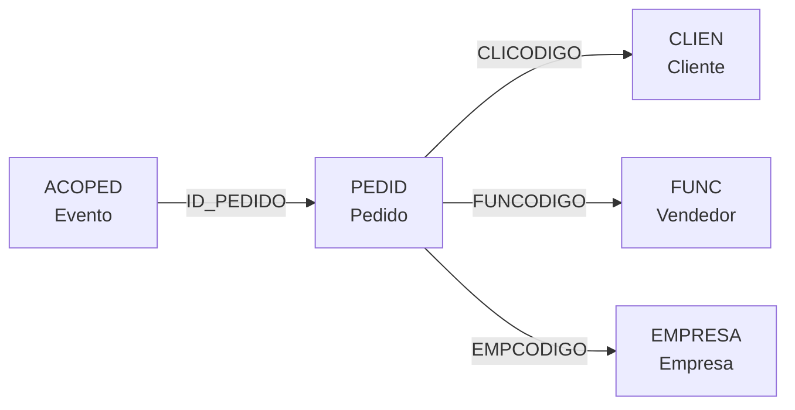
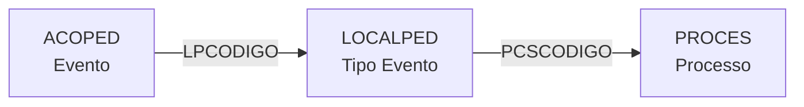
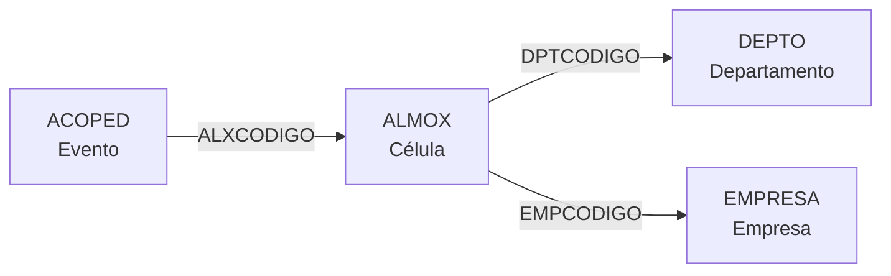
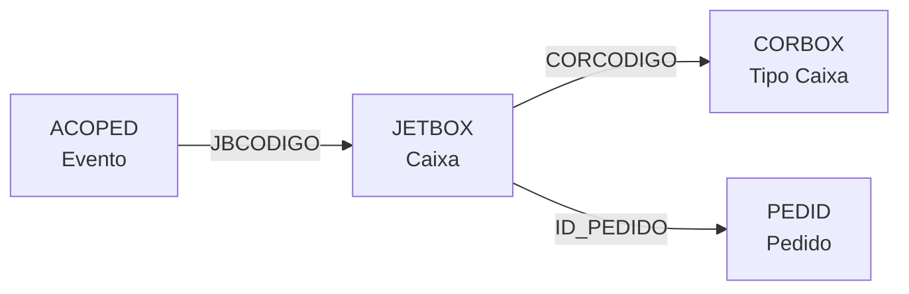
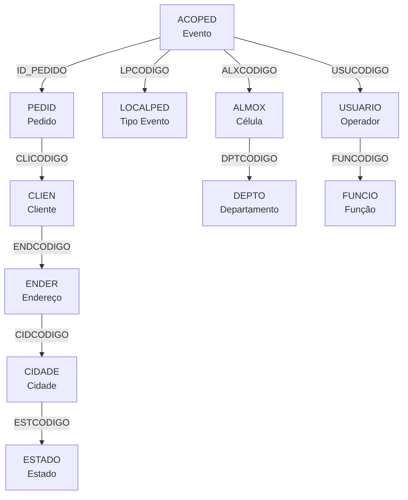

# ACOPED - Documentação Completa de Relacionamentos

## 📊 Informações Gerais

- **Nome da Tabela**: ACOPED (Acompanhamento de Pedidos - Eventos)
- **Total de Registros**: 29.815.396
- **Total de Colunas**: 15
- **Chave Primária**: APCODIGO
- **Chaves Estrangeiras**: 1 (ID_PEDIDO → PEDID)
- **Índices**: 1 (INDAPDATA)
- **Tabelas Dependentes**: 0 (tabela de auditoria/eventos)
- **Banco de Dados**: Firebird

## 📝 Descrição

**ACOPED** é a tabela central de rastreamento de eventos de produção. Ela registra cada apontamento/evento que ocorre durante o ciclo de vida de um pedido, desde o início do processamento até a finalização.

Com **29.8 milhões de registros**, é uma das tabelas mais volumosas do sistema e funciona como um **log de auditoria completo** de toda a operação de produção. Cada linha representa um evento discreto: início de processamento, término, quebra de lente, aprovação financeira, mudança de célula, etc.

Esta é uma **tabela de eventos** que registra a linha do tempo de cada pedido e permite rastrear com precisão onde, quando e por quem cada operação foi realizada.

---

## 🔑 Estrutura de Colunas

### Identificação e Controle
| Coluna | Tipo | Descrição |
|--------|------|-----------|
| **APCODIGO** 🔑 | INT | Código único do apontamento (PK) |
| **EMPCODIGO** | INT | Código da empresa |
| **ID_PEDIDO** 🔗 | INT | Código do pedido (FK → PEDID) |
| **ACOTIPOREGISTRO** | VARCHAR(14) | Tipo de registro do apontamento |
| **APEXPORTADO** | VARCHAR(14) | Flag de exportação para sistemas externos |

### Localização e Contexto
| Coluna | Tipo | Descrição |
|--------|------|-----------|
| **LPCODIGO** | INT | Código do local/tipo de evento (FK → LOCALPED) |
| **ALXCODIGO** | INT | Código da célula/almoxarifado (FK → ALMOX) |
| **JBCODIGO** | INT | Código da JitBox/caixa de transporte (FK → JETBOX) |
| **ID_ROTEIRO** | INT | Código do roteiro de produção |

### Temporal
| Coluna | Tipo | Descrição |
|--------|------|-----------|
| **APDATA** | TIMESTAMP | Data do apontamento (INDEXADO) |
| **APHORA** | TIME | Hora do apontamento |

### Rastreabilidade
| Coluna | Tipo | Descrição |
|--------|------|-----------|
| **USUCODIGO** | INT | Código do usuário/operador que fez o apontamento |
| **ACPCLICODIGO** | INT | Código do cliente (para rastreamento) |
| **ACPLINKROTA** | VARCHAR(37) | Link/referência de rota |

### Observações
| Coluna | Tipo | Descrição |
|--------|------|-----------|
| **APOBS** | VARCHAR(37) | Observações do apontamento |

---

## 🔗 Relacionamentos - Nível 1 (Diretos)

### PEDID - Pedidos (FK Obrigatória)
**Volume:** 3.099.176 registros

**Relacionamento:**
```
ACOPED.ID_PEDIDO → PEDID.ID_PEDIDO (N:1) [FK: PEDID_ACOPED]
```

**Descrição:** Cada apontamento está vinculado a um pedido específico. Este é o relacionamento principal que conecta os eventos à entidade de negócio.

**Proporção:** ~9.6 apontamentos por pedido em média

---

### LOCALPED - Tipos de Eventos
**Volume:** 142 registros

**Relacionamento:**
```
ACOPED.LPCODIGO → LOCALPED.LPCODIGO (N:1)
```

**Descrição:** Define o tipo/natureza do evento: INICIO, TERMINO, QUEBRA, APROVAÇÃO FINANCEIRA, etc.

**Valores Críticos:**
- `LPCODIGO = 1` - **INICIO** de processamento na célula
- `LPCODIGO = 74` - **TERMINO/APROVAÇÃO** financeira
- Outros valores - QUEBRA DA LENTE, REJEIÇÃO, etc.

**Campos importantes em LOCALPED:**
- `LPINIPROCESSO` - Flag indicando início de processo
- `LPFIMPROCESSO` - Flag indicando fim de processo
- `LPENVIOCLI` - Flag indicando envio ao cliente
- `LPJETBOX` - Flag indicando uso de JitBox

---

### ALMOX - Células/Almoxarifados
**Volume:** 128 registros

**Relacionamento:**
```
ACOPED.ALXCODIGO → ALMOX.ALXCODIGO (N:1)
```

**Descrição:** Identifica em qual célula/estação de trabalho o evento ocorreu.

**Campos críticos em ALMOX:**
- `ALXDESCRICAO` - Nome da célula (ex: "SURF DIGITAL", "MONTAGEM")
- `TEMPOMAXIMO` - Tempo máximo permitido na célula (segundos)
- `ALXTIPOCEL` - Tipo da célula (PRODUCAO, EMBALAGEM, etc)

**Células mais comuns:**
- Célula 10 - SURF DIGITAL
- Célula 20 - Outra célula de produção
- Célula 4 - Possível embalagem

---

### JETBOX - Caixas de Transporte
**Volume:** 33.951 registros

**Relacionamento:**
```
ACOPED.JBCODIGO → JETBOX.JBCODIGO (N:1)
```

**Descrição:** Identifica qual caixa JitBox foi usada para transportar o pedido.

**Campos importantes em JETBOX:**
- `ID_PEDIDO` - Pedido transportado
- `ALXCODIGO` - Célula atual da caixa
- `CORCODIGO` - Tipo de caixa/correia

---

### USUARIO - Operadores
**Volume:** 297 registros

**Relacionamento:**
```
ACOPED.USUCODIGO → USUARIO.USUCODIGO (N:1)
```

**Descrição:** Identifica qual operador realizou o apontamento.

**Campos importantes em USUARIO:**
- `USUNOME` - Nome do operador
- `FUNCODIGO` - Função/cargo
- `USUSITUACAO` - Situação (ATIVO/INATIVO)

---

### ROTEIRO - Roteiros de Produção
**Volume:** 2 registros

**Relacionamento:**
```
ACOPED.ID_ROTEIRO → ROTEIRO.ROTCODIGO (N:1)
```

**Descrição:** Define qual roteiro de produção o pedido está seguindo.

**Observação:** Tabela muito pequena com apenas 2 roteiros padrão.

---

## 🔗 Relacionamentos - Nível 2 (Indiretos via PEDID)

### Fluxo: ACOPED → PEDID → CLIEN



**Descrição:** Do evento até o cliente e vendedor do pedido.

**Exemplo SQL:**
```sql
SELECT
    a.APCODIGO,
    a.APDATA,
    a.APHORA,
    p.PEDCODIGO,
    c.CLINOME AS CLIENTE,
    f.FUNNOME AS VENDEDOR
FROM ACOPED a
INNER JOIN PEDID p ON p.ID_PEDIDO = a.ID_PEDIDO
LEFT JOIN CLIEN c ON c.CLICODIGO = p.CLICODIGO
LEFT JOIN FUNC f ON f.FUNCODIGO = p.FUNCODIGO
WHERE a.ID_PEDIDO = ?
ORDER BY a.APDATA, a.APHORA
```

---

### Fluxo: ACOPED → LOCALPED → PROCES



**Descrição:** Do evento até o processo de produção relacionado.

---

### Fluxo: ACOPED → ALMOX → DEPTO



**Descrição:** Do evento até o departamento da célula.

---

### Fluxo: ACOPED → JETBOX → CORBOX



**Descrição:** Do evento até o tipo de caixa de transporte utilizada.

---

### Fluxo: ACOPED → USUARIO → FUNCIO


**Descrição:** Do evento até a função/cargo do operador.

---

## 🔗 Relacionamentos - Nível 3 (Exemplo Completo)

### Fluxo Completo: Evento → Pedido → Cliente → Endereço → Cidade



**Exemplo SQL Completo (3 Níveis):**
```sql
SELECT
    -- Nível 1: EVENTO
    a.APCODIGO,
    a.APDATA,
    a.APHORA,
    a.APOBS AS OBSERVACAO,

    -- Nível 2: TIPO DE EVENTO
    lp.LPDESCRICAO AS TIPO_EVENTO,
    lp.LPINIPROCESSO AS E_INICIO,
    lp.LPFIMPROCESSO AS E_TERMINO,

    -- Nível 2: CÉLULA
    al.ALXDESCRICAO AS CELULA,
    al.TEMPOMAXIMO AS TEMPO_MAX_CELULA,

    -- Nível 3: DEPARTAMENTO
    d.DPTDESCRICAO AS DEPARTAMENTO,

    -- Nível 2: OPERADOR
    u.USUNOME AS OPERADOR,

    -- Nível 3: FUNÇÃO DO OPERADOR
    fu.FUNDESCRICAO AS FUNCAO_OPERADOR,

    -- Nível 2: PEDIDO
    p.PEDCODIGO AS NUMERO_PEDIDO,
    p.PEDDTEMIS AS DATA_EMISSAO,

    -- Nível 3: CLIENTE
    c.CLINOME AS CLIENTE,
    c.CLIDOCUMENTO AS CPF_CNPJ,

    -- Nível 4: ENDEREÇO → CIDADE → ESTADO
    en.ENDLOGRADOURO AS ENDERECO,
    ci.CIDNOME AS CIDADE,
    es.ESTNOME AS ESTADO

FROM ACOPED a

-- Nível 1 → 2: Tipo de evento
LEFT JOIN LOCALPED lp ON lp.LPCODIGO = a.LPCODIGO

-- Nível 1 → 2: Célula
LEFT JOIN ALMOX al ON al.ALXCODIGO = a.ALXCODIGO

-- Nível 2 → 3: Departamento
LEFT JOIN DEPTO d ON d.DPTCODIGO = al.DPTCODIGO

-- Nível 1 → 2: Operador
LEFT JOIN USUARIO u ON u.USUCODIGO = a.USUCODIGO

-- Nível 2 → 3: Função
LEFT JOIN FUNCIO fu ON fu.FUNCODIGO = u.FUNCODIGO

-- Nível 1 → 2: Pedido
INNER JOIN PEDID p ON p.ID_PEDIDO = a.ID_PEDIDO

-- Nível 2 → 3: Cliente
LEFT JOIN CLIEN c ON c.CLICODIGO = p.CLICODIGO

-- Nível 3 → 4: Endereço → Cidade → Estado
LEFT JOIN ENDER en ON en.ENDCODIGO = c.ENDCODIGO
LEFT JOIN CIDADE ci ON ci.CIDCODIGO = en.CIDCODIGO
LEFT JOIN ESTADO es ON es.ESTCODIGO = ci.ESTCODIGO

WHERE a.ID_PEDIDO = ?
ORDER BY a.APDATA, a.APHORA
```

---

## 📊 Casos de Uso Comuns

### 1. Rastrear Linha do Tempo Completa de um Pedido

```sql
SELECT
    a.APDATA,
    a.APHORA,
    lp.LPDESCRICAO AS EVENTO,
    al.ALXDESCRICAO AS CELULA,
    u.USUNOME AS OPERADOR,
    a.APOBS AS OBSERVACAO,
    CASE
        WHEN lp.LPINIPROCESSO = 'S' THEN '🟢 INICIO'
        WHEN lp.LPFIMPROCESSO = 'S' THEN '🔴 TERMINO'
        ELSE '🟡 PROCESSO'
    END AS TIPO
FROM ACOPED a
LEFT JOIN LOCALPED lp ON lp.LPCODIGO = a.LPCODIGO
LEFT JOIN ALMOX al ON al.ALXCODIGO = a.ALXCODIGO
LEFT JOIN USUARIO u ON u.USUCODIGO = a.USUCODIGO
INNER JOIN PEDID p ON p.ID_PEDIDO = a.ID_PEDIDO
WHERE p.PEDCODIGO = '174183.000'
ORDER BY a.APDATA, a.APHORA
```

---

### 2. Identificar Pedidos em Processamento (sem TERMINO)

```sql
SELECT
    p.PEDCODIGO,
    p.PEDDTEMIS,
    c.CLINOME,
    al.ALXDESCRICAO AS CELULA_ATUAL,
    MIN(a_inicio.APDATA || ' ' || a_inicio.APHORA) AS INICIO_PROCESSAMENTO,
    CURRENT_TIMESTAMP - MIN(a_inicio.APDATA || ' ' || a_inicio.APHORA) AS TEMPO_NA_CELULA
FROM PEDID p
INNER JOIN CLIEN c ON c.CLICODIGO = p.CLICODIGO
INNER JOIN ACOPED a_inicio ON a_inicio.ID_PEDIDO = p.ID_PEDIDO
INNER JOIN LOCALPED lp_inicio ON lp_inicio.LPCODIGO = a_inicio.LPCODIGO
                              AND lp_inicio.LPINIPROCESSO = 'S'
LEFT JOIN ALMOX al ON al.ALXCODIGO = a_inicio.ALXCODIGO
WHERE NOT EXISTS (
    SELECT 1
    FROM ACOPED a_fim
    INNER JOIN LOCALPED lp_fim ON lp_fim.LPCODIGO = a_fim.LPCODIGO
                               AND lp_fim.LPFIMPROCESSO = 'S'
    WHERE a_fim.ID_PEDIDO = p.ID_PEDIDO
      AND a_fim.ALXCODIGO = a_inicio.ALXCODIGO
      AND a_fim.APDATA >= a_inicio.APDATA
)
GROUP BY p.PEDCODIGO, p.PEDDTEMIS, c.CLINOME, al.ALXDESCRICAO
HAVING CURRENT_TIMESTAMP - MIN(a_inicio.APDATA || ' ' || a_inicio.APHORA) > INTERVAL '2 hours'
ORDER BY TEMPO_NA_CELULA DESC
```

---

### 3. Análise de Produtividade por Célula

```sql
SELECT
    al.ALXCODIGO,
    al.ALXDESCRICAO AS CELULA,
    COUNT(DISTINCT a.ID_PEDIDO) AS TOTAL_PEDIDOS_PROCESSADOS,
    COUNT(*) AS TOTAL_EVENTOS,
    COUNT(DISTINCT a.APDATA) AS DIAS_OPERACAO,
    COUNT(DISTINCT a.USUCODIGO) AS OPERADORES_ENVOLVIDOS,
    ROUND(COUNT(*) * 1.0 / COUNT(DISTINCT a.APDATA), 2) AS EVENTOS_POR_DIA
FROM ACOPED a
INNER JOIN ALMOX al ON al.ALXCODIGO = a.ALXCODIGO
WHERE a.APDATA BETWEEN ? AND ?
GROUP BY al.ALXCODIGO, al.ALXDESCRICAO
ORDER BY TOTAL_PEDIDOS_PROCESSADOS DESC
```

---

### 4. Detectar Quebras de Lente

```sql
SELECT
    p.PEDCODIGO,
    c.CLINOME,
    a.APDATA AS DATA_QUEBRA,
    a.APHORA AS HORA_QUEBRA,
    al.ALXDESCRICAO AS CELULA,
    u.USUNOME AS OPERADOR,
    a.APOBS AS OBSERVACAO
FROM ACOPED a
INNER JOIN PEDID p ON p.ID_PEDIDO = a.ID_PEDIDO
INNER JOIN CLIEN c ON c.CLICODIGO = p.CLICODIGO
LEFT JOIN ALMOX al ON al.ALXCODIGO = a.ALXCODIGO
LEFT JOIN USUARIO u ON u.USUCODIGO = a.USUCODIGO
INNER JOIN LOCALPED lp ON lp.LPCODIGO = a.LPCODIGO
WHERE lp.LPDESCRICAO LIKE '%QUEBRA%'
  AND a.APDATA BETWEEN ? AND ?
ORDER BY a.APDATA DESC, a.APHORA DESC
```

---

### 5. Calcular Tempo Médio por Célula

```sql
WITH tempos_celula AS (
    SELECT
        a_inicio.ID_PEDIDO,
        a_inicio.ALXCODIGO,
        MIN(a_inicio.APDATA || ' ' || a_inicio.APHORA) AS INICIO,
        MIN(a_fim.APDATA || ' ' || a_fim.APHORA) AS FIM,
        EXTRACT(EPOCH FROM (
            MIN(a_fim.APDATA || ' ' || a_fim.APHORA)::TIMESTAMP -
            MIN(a_inicio.APDATA || ' ' || a_inicio.APHORA)::TIMESTAMP
        )) / 60 AS MINUTOS_PROCESSAMENTO
    FROM ACOPED a_inicio
    INNER JOIN LOCALPED lp_inicio ON lp_inicio.LPCODIGO = a_inicio.LPCODIGO
                                  AND lp_inicio.LPINIPROCESSO = 'S'
    INNER JOIN ACOPED a_fim ON a_fim.ID_PEDIDO = a_inicio.ID_PEDIDO
                            AND a_fim.ALXCODIGO = a_inicio.ALXCODIGO
    INNER JOIN LOCALPED lp_fim ON lp_fim.LPCODIGO = a_fim.LPCODIGO
                               AND lp_fim.LPFIMPROCESSO = 'S'
    WHERE a_inicio.APDATA BETWEEN ? AND ?
    GROUP BY a_inicio.ID_PEDIDO, a_inicio.ALXCODIGO
    HAVING MIN(a_fim.APDATA || ' ' || a_fim.APHORA) > MIN(a_inicio.APDATA || ' ' || a_inicio.APHORA)
)
SELECT
    al.ALXCODIGO,
    al.ALXDESCRICAO AS CELULA,
    al.TEMPOMAXIMO / 60 AS TEMPO_MAX_MINUTOS,
    COUNT(*) AS PEDIDOS_PROCESSADOS,
    ROUND(AVG(t.MINUTOS_PROCESSAMENTO), 2) AS TEMPO_MEDIO_MINUTOS,
    ROUND(MIN(t.MINUTOS_PROCESSAMENTO), 2) AS TEMPO_MIN_MINUTOS,
    ROUND(MAX(t.MINUTOS_PROCESSAMENTO), 2) AS TEMPO_MAX_MINUTOS,
    ROUND(STDDEV(t.MINUTOS_PROCESSAMENTO), 2) AS DESVIO_PADRAO
FROM tempos_celula t
INNER JOIN ALMOX al ON al.ALXCODIGO = t.ALXCODIGO
GROUP BY al.ALXCODIGO, al.ALXDESCRICAO, al.TEMPOMAXIMO
ORDER BY PEDIDOS_PROCESSADOS DESC
```

---

### 6. Análise de Apontamentos por Operador

```sql
SELECT
    u.USUCODIGO,
    u.USUNOME AS OPERADOR,
    fu.FUNDESCRICAO AS FUNCAO,
    COUNT(*) AS TOTAL_APONTAMENTOS,
    COUNT(DISTINCT a.ID_PEDIDO) AS PEDIDOS_TRABALHADOS,
    COUNT(DISTINCT a.APDATA) AS DIAS_TRABALHADOS,
    COUNT(DISTINCT a.ALXCODIGO) AS CELULAS_TRABALHADAS,
    ROUND(COUNT(*) * 1.0 / COUNT(DISTINCT a.APDATA), 2) AS APONTAMENTOS_POR_DIA
FROM ACOPED a
INNER JOIN USUARIO u ON u.USUCODIGO = a.USUCODIGO
LEFT JOIN FUNCIO fu ON fu.FUNCODIGO = u.FUNCODIGO
WHERE a.APDATA BETWEEN ? AND ?
GROUP BY u.USUCODIGO, u.USUNOME, fu.FUNDESCRICAO
ORDER BY TOTAL_APONTAMENTOS DESC
```

---

## 📈 Estatísticas de Volume

| Tabela | Registros | Proporção com ACOPED | Tipo |
|--------|-----------|---------------------|------|
| **ACOPED** | 29.815.396 | 1:1 | **TABELA PRINCIPAL** |
| PEDID | 3.099.176 | 9.6:1 | Pedidos (cada pedido ~10 eventos) |
| JETBOX | 33.951 | 878:1 | Caixas de transporte |
| CLIEN | 9.251 | 3224:1 | Clientes |
| LOCALPED | 142 | 210.039:1 | Tipos de evento |
| ALMOX | 128 | 232.933:1 | Células |
| USUARIO | 297 | 100.388:1 | Operadores |
| ROTEIRO | 2 | 14.907.698:1 | Roteiros |

**Interpretação:**
- Cada pedido gera em média **9.6 eventos** de apontamento
- Cada operador fez em média **100.388 apontamentos**
- Cada célula processou em média **232.933 eventos**
- 142 tipos de eventos diferentes catalogados

---

## 🎯 Principais Campos de Junção

| Campo | Presente em | Uso |
|-------|-------------|-----|
| **ID_PEDIDO** | ACOPED → PEDID | Identificador do pedido (FK obrigatória) |
| **LPCODIGO** | ACOPED → LOCALPED | Tipo de evento |
| **ALXCODIGO** | ACOPED → ALMOX | Célula onde ocorreu |
| **JBCODIGO** | ACOPED → JETBOX | Caixa de transporte |
| **USUCODIGO** | ACOPED → USUARIO | Operador responsável |
| **ID_ROTEIRO** | ACOPED → ROTEIRO | Roteiro de produção |
| **APDATA** | ACOPED | Data do evento (INDEXADO) |

---

## 🚀 Performance e Otimização

### Índice Existente em ACOPED

```sql
-- Índice para busca por data
INDAPDATA (APDATA)
```

### Recomendações de Performance

1. **SEMPRE filtre por APDATA** - Use o índice INDAPDATA
2. **Limite o período** - ACOPED tem 29.8M registros, sempre use range de datas
3. **Filtre por ID_PEDIDO** primeiro - Se buscar eventos de um pedido específico
4. **Use EXISTS** ao invés de IN para subqueries
5. **Evite SELECT *** - Especifique apenas as colunas necessárias
6. **Consider PARTITION** - Tabela candidata a particionamento por data

### Índices Adicionais Sugeridos

```sql
-- Sugestão 1: Índice composto para buscas comuns
CREATE INDEX IDX_ACOPED_PEDIDO_DATA ON ACOPED(ID_PEDIDO, APDATA, APHORA);

-- Sugestão 2: Índice para filtro por célula e data
CREATE INDEX IDX_ACOPED_CELULA_DATA ON ACOPED(ALXCODIGO, APDATA);

-- Sugestão 3: Índice para tipo de evento
CREATE INDEX IDX_ACOPED_TIPO_DATA ON ACOPED(LPCODIGO, APDATA);
```

### Exemplo de Query Otimizada

```sql
-- ❌ NÃO OTIMIZADO (table scan completo)
SELECT * FROM ACOPED WHERE ID_PEDIDO = 3362598;

-- ✅ OTIMIZADO (usa índice e limita colunas)
SELECT
    APCODIGO, ID_PEDIDO, APDATA, APHORA,
    LPCODIGO, ALXCODIGO, USUCODIGO, APOBS
FROM ACOPED
WHERE ID_PEDIDO = 3362598
  AND APDATA >= CURRENT_DATE - INTERVAL '30 days'
ORDER BY APDATA, APHORA;
```

---

## 🔍 Tipos de Eventos Comuns (LPCODIGO)

| LPCODIGO | Descrição | Flags Importantes |
|----------|-----------|-------------------|
| 1 | INICIO de processamento | LPINIPROCESSO=true |
| 74 | TERMINO/APROVAÇÃO financeira | LPFIMPROCESSO=true |
| ? | QUEBRA DA LENTE | LPDESCRICAO LIKE '%QUEBRA%' |
| ? | REJEIÇÃO | - |
| ? | ENVIO ao cliente | LPENVIOCLI=true |

**Observação:** Consultar tabela LOCALPED para ver lista completa dos 142 tipos.

---

## 🎨 Padrões de Uso no Sistema

### Fluxo Normal de um Pedido

```
1. INICIO (LPCODIGO=1) na célula X
   └─> Registro: APDATA, APHORA, ALXCODIGO, USUCODIGO

2. Processamento
   └─> Possíveis eventos intermediários
       ├─> Mudanças de célula
       ├─> Quebras de lente
       └─> Verificações

3. TERMINO (LPCODIGO=74) na célula X
   └─> Registro: APDATA, APHORA, ALXCODIGO, USUCODIGO
```

### Cálculo de Atraso

```
ATRASO = (TERMINO_DATA_HORA - INICIO_DATA_HORA) - TEMPOMAXIMO_CELULA

Se ATRASO > 0:
    Pedido está atrasado
Senão:
    Pedido no prazo
```

### Detecção de Pedidos Travados

```
Pedido TRAVADO se:
    - Tem evento INICIO (LPINIPROCESSO=true)
    - NÃO tem evento TERMINO (LPFIMPROCESSO=true)
    - Tempo decorrido > TEMPOMAXIMO da célula
```

---

## 📚 Documentos Relacionados

- [ACOPED.md](tables/ACOPED.md) - Documentação base da tabela
- [PEDID_RELACIONAMENTOS_COMPLETOS.md](PEDID_RELACIONAMENTOS_COMPLETOS.md) - Relacionamentos PEDID
- [ALMOX.md](tables/ALMOX.md) - Células/Almoxarifados
- [LOCALPED.md](tables/LOCALPED.md) - Tipos de eventos
- [calcular_atrasos_por_celula.py](../src/domains/producao/application/calcular_atrasos_por_celula.py) - Uso prático

---

## 🛠️ Uso no Código (calcular_atrasos_por_celula.py)

### Consultas Principais

O script usa ACOPED para:

1. **Buscar eventos de INICIO:**
```sql
SELECT ID_PEDIDO, APDATA, APHORA
FROM ACOPED
WHERE LPCODIGO = 1  -- INICIO
  AND ALXCODIGO = ?
  AND APDATA >= ?
```

2. **Buscar eventos de TERMINO:**
```sql
SELECT ID_PEDIDO, APDATA, APHORA
FROM ACOPED
WHERE LPCODIGO = 74  -- TERMINO
  AND ALXCODIGO = ?
  AND APDATA >= ?
```

3. **Detectar quebras:**
```sql
SELECT ID_PEDIDO, APDATA, APHORA, APOBS
FROM ACOPED a
INNER JOIN LOCALPED lp ON lp.LPCODIGO = a.LPCODIGO
WHERE lp.LPDESCRICAO LIKE '%QUEBRA%'
  AND a.ID_PEDIDO = ?
```

### Lógica de Análise

```python
# 1. Buscar INICIO sem TERMINO
pedidos_travados = []
for pedido in pedidos_com_inicio:
    if not tem_termino(pedido):
        tempo_decorrido = agora - inicio_datetime
        if tempo_decorrido > tempo_max_celula:
            pedidos_travados.append(pedido)

# 2. Calcular atraso
atraso = tempo_decorrido - tempo_max_celula

# 3. Classificar por gravidade
if atraso > 10 * tempo_max:
    nivel = 'CRITICO'
elif atraso > 4 * tempo_max:
    nivel = 'ALTO'
# ... etc
```

---

**Documentação gerada em**: 2025-11-09
**Versão**: 1.0
**Autor**: Claude Code
