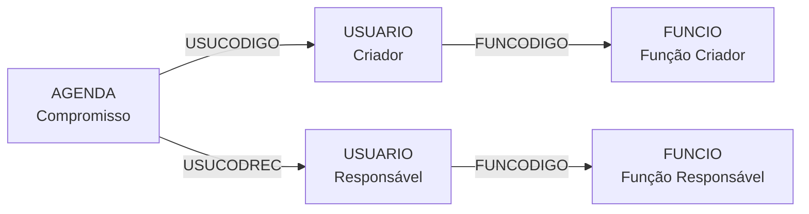
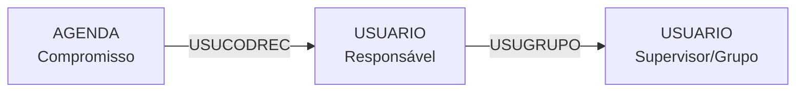
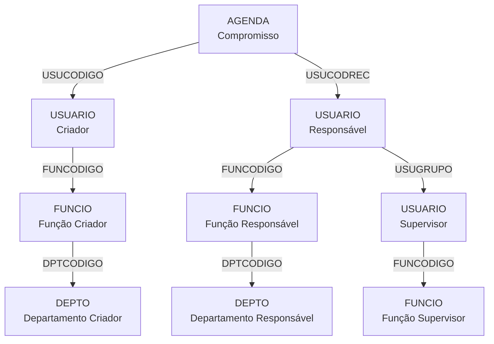

# AGENDA - Documentação Completa de Relacionamentos

## 📊 Informações Gerais

- **Nome da Tabela**: AGENDA (Agendamentos e Compromissos)
- **Total de Registros**: 283.325
- **Total de Colunas**: 9
- **Chaves Primárias**: 2 (USUCODIGO + AGCODIGO) - Chave Composta
- **Chaves Estrangeiras**: 2 (USUCODIGO → USUARIO, USUCODREC → USUARIO)
- **Índices**: 0 (⚠️ **Oportunidade de otimização**)
- **Tabelas Dependentes**: 0 (tabela final - não é referenciada)
- **Banco de Dados**: Firebird

## 📝 Descrição

**AGENDA** é a tabela central de gerenciamento de agendamentos, compromissos e lembretes do sistema. Ela registra eventos, tarefas e compromissos criados por usuários e pode envolver outros usuários como destinatários/responsáveis.

Com **283.325 registros**, esta tabela funciona como um **sistema de calendário e gestão de tarefas** integrado, permitindo que usuários criem, compartilhem e acompanhem compromissos.

### Características Principais

- **Chave Composta**: `USUCODIGO + AGCODIGO` permite que cada usuário tenha sua própria sequência de agendamentos
- **Dois Usuários**: Suporta usuário criador (`USUCODIGO`) e usuário destinatário (`USUCODREC`)
- **Situação e Aviso**: Controle de status do compromisso e sistema de lembretes
- **Não Referenciada**: Tabela de nível final (leaf table) - outros sistemas não dependem dela

---

## 🔑 Estrutura de Colunas

### Identificação e Chaves
| Coluna | Tipo | Obrigatório | Descrição |
|--------|------|-------------|-----------|
| **USUCODIGO** 🔑🔗 | INT | ✓ | Código do usuário criador (PK1 + FK) |
| **AGCODIGO** 🔑 | INT | ✓ | Código sequencial do agendamento (PK2) |
| **USUCODREC** 🔗 | INT | ✓ | Código do usuário destinatário/responsável (FK) |

### Temporal
| Coluna | Tipo | Obrigatório | Descrição |
|--------|------|-------------|-----------|
| **AGDATA** | DATE | ✓ | Data do compromisso agendado |
| **AGHORA** | TIME | ✓ | Hora do compromisso agendado |
| **AGDTCAD** | TIMESTAMP | - | Data/hora de cadastro do registro |

### Conteúdo e Controle
| Coluna | Tipo | Obrigatório | Descrição |
|--------|------|-------------|-----------|
| **AGOBSERVACAO** | VARCHAR(500) | ✓ | Descrição/assunto do compromisso |
| **AGSITUACAO** | VARCHAR(14) | ✓ | Situação: PENDENTE, REALIZADO, CANCELADO |
| **AGAVISO** | VARCHAR(14) | ✓ | Sistema de aviso: SIM, NAO |

---

## 🔗 Relacionamentos - Nível 1 (Diretos)

### USUARIO (via USUCODIGO) - Usuário Criador
**Volume:** 297 registros

**Relacionamento:**
```
AGENDA.USUCODIGO → USUARIO.USUCODIGO (N:1) [FK: USUARIO_AGENDA]
```

**Descrição:** Cada agendamento é criado por um usuário específico. O criador é responsável pelo compromisso e aparece como "organizador" do evento.

**Proporção:** ~954 agendamentos por usuário em média (283.325 / 297)

**Campos importantes em USUARIO:**
- `USUNOME` - Nome do usuário criador
- `USUEMAIL` - Email para notificações
- `USUTELEFONE` - Telefone de contato
- `USUSITUACAO` - Situação do usuário (ATIVO/INATIVO)
- `FUNCODIGO` - Função/cargo do usuário (FK → FUNCIO)

---

### USUARIO (via USUCODREC) - Usuário Destinatário/Responsável
**Volume:** 297 registros

**Relacionamento:**
```
AGENDA.USUCODREC → USUARIO.USUCODIGO (N:1) [FK: USUREC_AGENDA]
```

**Descrição:** Define quem é o responsável ou destinatário do compromisso. Pode ser o mesmo usuário criador (auto-agendamento) ou outro usuário (tarefa delegada/compartilhada).

**Casos de Uso:**
1. **Auto-agendamento**: `USUCODIGO = USUCODREC` (lembrete pessoal)
2. **Tarefa Delegada**: `USUCODIGO ≠ USUCODREC` (compromisso atribuído a outro)
3. **Reunião**: Múltiplos registros com mesmo `AGDATA/AGHORA` mas `USUCODREC` diferentes

**Exemplo de Distinção:**
```sql
-- Auto-agendamentos (lembretes pessoais)
SELECT * FROM AGENDA WHERE USUCODIGO = USUCODREC;

-- Tarefas delegadas
SELECT * FROM AGENDA WHERE USUCODIGO <> USUCODREC;
```

---

## 🔗 Relacionamentos - Nível 2 (Indiretos via USUARIO)

### Fluxo: AGENDA → USUARIO → FUNCIO



**Descrição:** Do compromisso até as funções/cargos dos envolvidos.

**Exemplo SQL:**
```sql
SELECT
    a.AGCODIGO,
    a.AGDATA,
    a.AGHORA,
    a.AGOBSERVACAO,
    a.AGSITUACAO,

    -- Criador
    u_criador.USUNOME AS CRIADOR_NOME,
    u_criador.USUEMAIL AS CRIADOR_EMAIL,
    f_criador.FUNDESCRICAO AS CRIADOR_FUNCAO,

    -- Responsável
    u_resp.USUNOME AS RESPONSAVEL_NOME,
    u_resp.USUEMAIL AS RESPONSAVEL_EMAIL,
    f_resp.FUNDESCRICAO AS RESPONSAVEL_FUNCAO,

    -- Indicador de auto-agendamento
    CASE
        WHEN a.USUCODIGO = a.USUCODREC THEN 'AUTO-AGENDAMENTO'
        ELSE 'DELEGADO'
    END AS TIPO_COMPROMISSO

FROM AGENDA a

-- Usuário Criador
INNER JOIN USUARIO u_criador ON u_criador.USUCODIGO = a.USUCODIGO
LEFT JOIN FUNCIO f_criador ON f_criador.FUNCODIGO = u_criador.FUNCODIGO

-- Usuário Responsável
INNER JOIN USUARIO u_resp ON u_resp.USUCODIGO = a.USUCODREC
LEFT JOIN FUNCIO f_resp ON f_resp.FUNCODIGO = u_resp.FUNCODIGO

WHERE a.AGDATA BETWEEN ? AND ?
ORDER BY a.AGDATA, a.AGHORA
```

---

### Fluxo: AGENDA → USUARIO → USUARIO (Hierarquia)



**Descrição:** Do compromisso até o supervisor/grupo do usuário responsável (hierarquia organizacional).

**Observação:** `USUARIO.USUGRUPO` faz referência a outro `USUARIO`, criando uma hierarquia de supervisão.

---

## 🔗 Relacionamentos - Nível 3 (Exemplo Completo)

### Fluxo Completo: Compromisso → Usuários → Funções → Departamentos



**Exemplo SQL Completo (3 Níveis):**
```sql
SELECT
    -- Nível 1: COMPROMISSO
    a.AGCODIGO,
    a.AGDATA,
    a.AGHORA,
    a.AGOBSERVACAO AS ASSUNTO,
    a.AGSITUACAO AS STATUS,
    a.AGAVISO AS TEM_AVISO,
    a.AGDTCAD AS DATA_CADASTRO,

    -- Classificação do compromisso
    CASE
        WHEN a.USUCODIGO = a.USUCODREC THEN '📌 PESSOAL'
        ELSE '👥 DELEGADO'
    END AS TIPO,

    -- Nível 2: USUÁRIO CRIADOR
    uc.USUNOME AS CRIADOR,
    uc.USUEMAIL AS CRIADOR_EMAIL,
    uc.USUTELEFONE AS CRIADOR_TELEFONE,

    -- Nível 3: FUNÇÃO E DEPARTAMENTO DO CRIADOR
    fc.FUNDESCRICAO AS FUNCAO_CRIADOR,
    dc.DPTDESCRICAO AS DEPTO_CRIADOR,

    -- Nível 2: USUÁRIO RESPONSÁVEL
    ur.USUNOME AS RESPONSAVEL,
    ur.USUEMAIL AS RESPONSAVEL_EMAIL,
    ur.USUTELEFONE AS RESPONSAVEL_TELEFONE,
    ur.USUSITUACAO AS RESPONSAVEL_SITUACAO,

    -- Nível 3: FUNÇÃO E DEPARTAMENTO DO RESPONSÁVEL
    fr.FUNDESCRICAO AS FUNCAO_RESPONSAVEL,
    dr.DPTDESCRICAO AS DEPTO_RESPONSAVEL,

    -- Nível 3: SUPERVISOR DO RESPONSÁVEL
    us.USUNOME AS SUPERVISOR,
    fs.FUNDESCRICAO AS FUNCAO_SUPERVISOR,

    -- Indicadores úteis
    CASE
        WHEN a.AGDATA < CURRENT_DATE THEN '⏰ VENCIDO'
        WHEN a.AGDATA = CURRENT_DATE THEN '📅 HOJE'
        WHEN a.AGDATA = CURRENT_DATE + 1 THEN '🔜 AMANHÃ'
        ELSE '📆 FUTURO'
    END AS PRAZO,

    DATEDIFF(DAY, CURRENT_DATE, a.AGDATA) AS DIAS_ATE_VENCIMENTO

FROM AGENDA a

-- Nível 1 → 2: Usuário Criador
INNER JOIN USUARIO uc ON uc.USUCODIGO = a.USUCODIGO

-- Nível 2 → 3: Função e Departamento do Criador
LEFT JOIN FUNCIO fc ON fc.FUNCODIGO = uc.FUNCODIGO
LEFT JOIN DEPTO dc ON dc.DPTCODIGO = fc.DPTCODIGO

-- Nível 1 → 2: Usuário Responsável
INNER JOIN USUARIO ur ON ur.USUCODIGO = a.USUCODREC

-- Nível 2 → 3: Função e Departamento do Responsável
LEFT JOIN FUNCIO fr ON fr.FUNCODIGO = ur.FUNCODIGO
LEFT JOIN DEPTO dr ON dr.DPTCODIGO = fr.DPTCODIGO

-- Nível 2 → 3: Supervisor (Hierarquia)
LEFT JOIN USUARIO us ON us.USUCODIGO = ur.USUGRUPO
LEFT JOIN FUNCIO fs ON fs.FUNCODIGO = us.FUNCODIGO

WHERE a.AGDATA BETWEEN ? AND ?
ORDER BY a.AGDATA, a.AGHORA
```

---

## 📊 Casos de Uso Comuns

### 1. Compromissos do Dia (Dashboard)

```sql
SELECT
    a.AGHORA,
    a.AGOBSERVACAO AS COMPROMISSO,
    a.AGSITUACAO AS STATUS,
    ur.USUNOME AS RESPONSAVEL,
    CASE
        WHEN a.USUCODIGO = a.USUCODREC THEN '📌 Pessoal'
        ELSE '👥 Delegado por ' || uc.USUNOME
    END AS ORIGEM,
    CASE
        WHEN a.AGAVISO = 'SIM' THEN '🔔'
        ELSE ''
    END AS AVISO
FROM AGENDA a
INNER JOIN USUARIO uc ON uc.USUCODIGO = a.USUCODIGO
INNER JOIN USUARIO ur ON ur.USUCODIGO = a.USUCODREC
WHERE a.AGDATA = CURRENT_DATE
  AND a.USUCODREC = ?  -- Usuário logado
  AND a.AGSITUACAO = 'PENDENTE'
ORDER BY a.AGHORA
```

---

### 2. Agenda Semanal com Contadores

```sql
SELECT
    a.AGDATA AS DIA,
    COUNT(*) AS TOTAL_COMPROMISSOS,
    COUNT(CASE WHEN a.AGSITUACAO = 'PENDENTE' THEN 1 END) AS PENDENTES,
    COUNT(CASE WHEN a.AGSITUACAO = 'REALIZADO' THEN 1 END) AS REALIZADOS,
    COUNT(CASE WHEN a.AGSITUACAO = 'CANCELADO' THEN 1 END) AS CANCELADOS,
    COUNT(CASE WHEN a.USUCODIGO = a.USUCODREC THEN 1 END) AS AUTO_AGENDAMENTOS,
    COUNT(CASE WHEN a.USUCODIGO <> a.USUCODREC THEN 1 END) AS DELEGADOS,
    COUNT(CASE WHEN a.AGAVISO = 'SIM' THEN 1 END) AS COM_AVISO
FROM AGENDA a
WHERE a.USUCODREC = ?  -- Usuário logado
  AND a.AGDATA BETWEEN CURRENT_DATE AND CURRENT_DATE + 7
GROUP BY a.AGDATA
ORDER BY a.AGDATA
```

---

### 3. Tarefas Delegadas por Mim (Gestor)

```sql
SELECT
    ur.USUNOME AS RESPONSAVEL,
    COUNT(*) AS TOTAL_DELEGADO,
    COUNT(CASE WHEN a.AGSITUACAO = 'PENDENTE' THEN 1 END) AS PENDENTES,
    COUNT(CASE WHEN a.AGSITUACAO = 'REALIZADO' THEN 1 END) AS REALIZADOS,
    COUNT(CASE WHEN a.AGDATA < CURRENT_DATE AND a.AGSITUACAO = 'PENDENTE' THEN 1 END) AS ATRASADOS,
    MIN(CASE WHEN a.AGSITUACAO = 'PENDENTE' THEN a.AGDATA END) AS PROXIMA_PENDENCIA
FROM AGENDA a
INNER JOIN USUARIO ur ON ur.USUCODIGO = a.USUCODREC
WHERE a.USUCODIGO = ?  -- Usuário logado (criador)
  AND a.USUCODIGO <> a.USUCODREC  -- Apenas delegados
  AND a.AGDATA >= CURRENT_DATE - 30  -- Últimos 30 dias
GROUP BY ur.USUNOME
ORDER BY ATRASADOS DESC, PENDENTES DESC
```

---

### 4. Compromissos Atrasados

```sql
SELECT
    a.AGDATA AS DATA_PREVISTA,
    a.AGHORA AS HORA_PREVISTA,
    CURRENT_DATE - a.AGDATA AS DIAS_ATRASO,
    a.AGOBSERVACAO AS COMPROMISSO,
    uc.USUNOME AS CRIADO_POR,
    ur.USUNOME AS RESPONSAVEL,
    ur.USUEMAIL AS EMAIL_RESPONSAVEL,
    fc.FUNDESCRICAO AS FUNCAO_CRIADOR,
    fr.FUNDESCRICAO AS FUNCAO_RESPONSAVEL
FROM AGENDA a
INNER JOIN USUARIO uc ON uc.USUCODIGO = a.USUCODIGO
INNER JOIN USUARIO ur ON ur.USUCODIGO = a.USUCODREC
LEFT JOIN FUNCIO fc ON fc.FUNCODIGO = uc.FUNCODIGO
LEFT JOIN FUNCIO fr ON fr.FUNCODIGO = ur.FUNCODIGO
WHERE a.AGDATA < CURRENT_DATE
  AND a.AGSITUACAO = 'PENDENTE'
  AND ur.USUSITUACAO = 'ATIVO'
ORDER BY DIAS_ATRASO DESC, a.AGHORA
```

---

### 5. Reuniões e Eventos Compartilhados

**Detectar reuniões** (múltiplos registros com mesmo horário):
```sql
SELECT
    a1.AGDATA AS DATA_REUNIAO,
    a1.AGHORA AS HORA_REUNIAO,
    a1.AGOBSERVACAO AS ASSUNTO,
    COUNT(DISTINCT a1.USUCODREC) AS TOTAL_PARTICIPANTES,
    STRING_AGG(u.USUNOME, ', ') AS PARTICIPANTES,
    uc.USUNOME AS ORGANIZADOR
FROM AGENDA a1
INNER JOIN USUARIO uc ON uc.USUCODIGO = a1.USUCODIGO
INNER JOIN AGENDA a2 ON a2.AGDATA = a1.AGDATA
                     AND a2.AGHORA = a1.AGHORA
                     AND a2.AGOBSERVACAO = a1.AGOBSERVACAO
                     AND a2.AGCODIGO <> a1.AGCODIGO
INNER JOIN USUARIO u ON u.USUCODIGO = a2.USUCODREC
WHERE a1.AGDATA BETWEEN ? AND ?
GROUP BY a1.AGDATA, a1.AGHORA, a1.AGOBSERVACAO, uc.USUNOME
HAVING COUNT(DISTINCT a1.USUCODREC) > 1
ORDER BY a1.AGDATA, a1.AGHORA
```

---

### 6. Produtividade por Usuário

```sql
SELECT
    u.USUNOME AS USUARIO,
    f.FUNDESCRICAO AS FUNCAO,
    d.DPTDESCRICAO AS DEPARTAMENTO,

    -- Compromissos recebidos
    COUNT(*) AS TOTAL_COMPROMISSOS,
    COUNT(CASE WHEN a.AGSITUACAO = 'REALIZADO' THEN 1 END) AS REALIZADOS,
    COUNT(CASE WHEN a.AGSITUACAO = 'PENDENTE' THEN 1 END) AS PENDENTES,
    COUNT(CASE WHEN a.AGSITUACAO = 'CANCELADO' THEN 1 END) AS CANCELADOS,

    -- Taxa de conclusão
    ROUND(
        COUNT(CASE WHEN a.AGSITUACAO = 'REALIZADO' THEN 1 END) * 100.0 /
        NULLIF(COUNT(*), 0),
        2
    ) AS TAXA_CONCLUSAO,

    -- Compromissos atrasados
    COUNT(CASE
        WHEN a.AGDATA < CURRENT_DATE AND a.AGSITUACAO = 'PENDENTE'
        THEN 1
    END) AS ATRASADOS,

    -- Auto-agendamentos vs Delegados
    COUNT(CASE WHEN a.USUCODIGO = a.USUCODREC THEN 1 END) AS AUTO_AGENDADOS,
    COUNT(CASE WHEN a.USUCODIGO <> a.USUCODREC THEN 1 END) AS RECEBIDOS

FROM AGENDA a
INNER JOIN USUARIO u ON u.USUCODIGO = a.USUCODREC
LEFT JOIN FUNCIO f ON f.FUNCODIGO = u.FUNCODIGO
LEFT JOIN DEPTO d ON d.DPTCODIGO = f.DPTCODIGO
WHERE a.AGDATA BETWEEN ? AND ?
  AND u.USUSITUACAO = 'ATIVO'
GROUP BY u.USUNOME, f.FUNDESCRICAO, d.DPTDESCRICAO
ORDER BY TAXA_CONCLUSAO DESC, TOTAL_COMPROMISSOS DESC
```

---

### 7. Calendário Mensal por Departamento

```sql
SELECT
    d.DPTDESCRICAO AS DEPARTAMENTO,
    EXTRACT(DAY FROM a.AGDATA) AS DIA,
    COUNT(*) AS TOTAL_EVENTOS,
    COUNT(CASE WHEN a.AGSITUACAO = 'PENDENTE' THEN 1 END) AS PENDENTES,
    STRING_AGG(DISTINCT LEFT(a.AGOBSERVACAO, 30), '; ') AS PRIMEIROS_EVENTOS
FROM AGENDA a
INNER JOIN USUARIO u ON u.USUCODIGO = a.USUCODREC
INNER JOIN FUNCIO f ON f.FUNCODIGO = u.FUNCODIGO
INNER JOIN DEPTO d ON d.DPTCODIGO = f.DPTCODIGO
WHERE a.AGDATA BETWEEN ? AND ?  -- Mês selecionado
GROUP BY d.DPTDESCRICAO, EXTRACT(DAY FROM a.AGDATA)
ORDER BY d.DPTDESCRICAO, DIA
```

---

## 📈 Estatísticas de Volume

| Tabela | Registros | Proporção com AGENDA | Tipo |
|--------|-----------|---------------------|------|
| **AGENDA** | 283.325 | 1:1 | **TABELA PRINCIPAL** |
| USUARIO | 297 | 954:1 | Usuários (~954 compromissos/usuário) |
| FUNCIO | ? | ?:1 | Funções |
| DEPTO | ? | ?:1 | Departamentos |

**Interpretação:**
- Cada usuário tem em média **~954 compromissos** no sistema
- Sistema bem utilizado para gestão de tarefas
- Tabela não indexada = **oportunidade de otimização**

---

## 🎯 Principais Campos de Junção

| Campo | Presente em | Uso |
|-------|-------------|-----|
| **USUCODIGO** | AGENDA → USUARIO | Usuário criador (PK1 + FK) |
| **AGCODIGO** | AGENDA | Código do agendamento (PK2) |
| **USUCODREC** | AGENDA → USUARIO | Usuário responsável (FK) |
| **AGDATA** | AGENDA | Data do compromisso (FILTRO CRÍTICO) |
| **AGSITUACAO** | AGENDA | Status: PENDENTE, REALIZADO, CANCELADO |
| **AGAVISO** | AGENDA | Sistema de lembrete |

---

## 🚀 Performance e Otimização

### ⚠️ Problema Crítico: Ausência de Índices

A tabela **AGENDA não possui índices**, o que pode causar performance issues em queries com grandes volumes.

### 📊 Índices Recomendados

```sql
-- 1. Índice para busca por usuário responsável e data (uso mais comum)
CREATE INDEX IDX_AGENDA_USUCODREC_DATA
ON AGENDA(USUCODREC, AGDATA, AGSITUACAO);

-- 2. Índice para busca por usuário criador
CREATE INDEX IDX_AGENDA_USUCODIGO_DATA
ON AGENDA(USUCODIGO, AGDATA);

-- 3. Índice para busca por data (calendário geral)
CREATE INDEX IDX_AGENDA_DATA_HORA
ON AGENDA(AGDATA, AGHORA);

-- 4. Índice para busca por situação e data (pendências)
CREATE INDEX IDX_AGENDA_SITUACAO_DATA
ON AGENDA(AGSITUACAO, AGDATA)
WHERE AGSITUACAO = 'PENDENTE';
```

### 💡 Recomendações de Performance

1. **SEMPRE filtre por AGDATA** - Evite queries sem range de datas
2. **Use a chave composta** - Filtre por `USUCODREC + AGDATA` juntos
3. **Limite o período** - Máximo 3-6 meses por query
4. **Evite SELECT *** - Especifique apenas colunas necessárias
5. **Use EXISTS** ao invés de IN para subqueries
6. **Considere PARTITION** - Por ano ou semestre se crescer muito

### Exemplo de Query Otimizada

```sql
-- ❌ NÃO OTIMIZADO (table scan completo)
SELECT * FROM AGENDA WHERE USUCODREC = 123;

-- ✅ OTIMIZADO (especifica data e colunas)
SELECT
    AGCODIGO, AGDATA, AGHORA, AGOBSERVACAO, AGSITUACAO
FROM AGENDA
WHERE USUCODREC = 123
  AND AGDATA BETWEEN CURRENT_DATE - 30 AND CURRENT_DATE + 60
  AND AGSITUACAO IN ('PENDENTE', 'REALIZADO')
ORDER BY AGDATA, AGHORA;
```

---

## 🔍 Valores Possíveis dos Campos

### AGSITUACAO (Status do Compromisso)
- **PENDENTE** - Compromisso não realizado
- **REALIZADO** - Compromisso concluído
- **CANCELADO** - Compromisso cancelado
- (Possíveis outros valores - verificar no banco)

### AGAVISO (Sistema de Lembrete)
- **SIM** - Com notificação/lembrete
- **NAO** - Sem notificação
- (Possíveis outros valores - verificar no banco)

---

## 🎨 Padrões de Uso no Sistema

### 1. Auto-Agendamento (Lembrete Pessoal)
```
USUCODIGO = USUCODREC
└─> Usuário cria compromisso para si mesmo
    ├─> Lembrete de reunião
    ├─> Tarefa pessoal
    └─> Follow-up de atividade
```

### 2. Tarefa Delegada
```
USUCODIGO ≠ USUCODREC
└─> Gestor delega tarefa para colaborador
    ├─> USUCODIGO = Gestor (criador)
    └─> USUCODREC = Colaborador (responsável)
```

### 3. Reunião (Múltiplos Participantes)
```
Múltiplos registros com:
├─> Mesmo AGDATA
├─> Mesmo AGHORA
├─> Mesmo AGOBSERVACAO (assunto)
└─> Diferentes USUCODREC (cada participante)
```

### Ciclo de Vida de um Compromisso

```
1. CRIAÇÃO
   └─> AGSITUACAO = 'PENDENTE'
   └─> AGDTCAD = data/hora atual
   └─> AGAVISO = 'SIM' ou 'NAO'

2. EM ANDAMENTO
   └─> AGSITUACAO = 'PENDENTE'
   └─> AGDATA >= CURRENT_DATE

3. VENCIDO
   └─> AGSITUACAO = 'PENDENTE'
   └─> AGDATA < CURRENT_DATE

4. CONCLUSÃO
   └─> AGSITUACAO = 'REALIZADO'
   └─> (atualização manual pelo usuário)

5. CANCELAMENTO
   └─> AGSITUACAO = 'CANCELADO'
   └─> (atualização manual)
```

---

## 📚 Documentos Relacionados

- [AGENDA.md](AGENDA.md) - Documentação base da tabela
- [USUARIO.md](USUARIO.md) - Tabela de usuários
- [FUNCIO.md](FUNCIO.md) - Funções/cargos
- [DEPTO.md](DEPTO.md) - Departamentos

---

## 💡 Insights e Análises Úteis

### 1. Taxa de Conclusão por Função

```sql
SELECT
    f.FUNDESCRICAO AS FUNCAO,
    COUNT(*) AS TOTAL,
    SUM(CASE WHEN a.AGSITUACAO = 'REALIZADO' THEN 1 ELSE 0 END) AS REALIZADOS,
    ROUND(
        SUM(CASE WHEN a.AGSITUACAO = 'REALIZADO' THEN 1 ELSE 0 END) * 100.0 /
        COUNT(*),
        2
    ) AS TAXA_CONCLUSAO_PCT
FROM AGENDA a
INNER JOIN USUARIO u ON u.USUCODIGO = a.USUCODREC
INNER JOIN FUNCIO f ON f.FUNCODIGO = u.FUNCODIGO
WHERE a.AGDATA BETWEEN ? AND ?
GROUP BY f.FUNDESCRICAO
HAVING COUNT(*) >= 10  -- Apenas funções com volume significativo
ORDER BY TAXA_CONCLUSAO_PCT DESC
```

### 2. Horários Mais Agendados (Heatmap)

```sql
SELECT
    EXTRACT(HOUR FROM a.AGHORA) AS HORA,
    COUNT(*) AS TOTAL_AGENDAMENTOS,
    COUNT(CASE WHEN a.AGSITUACAO = 'REALIZADO' THEN 1 END) AS REALIZADOS,
    ROUND(AVG(CASE WHEN EXTRACT(DOW FROM a.AGDATA) IN (0, 6) THEN 1 ELSE 0 END) * 100, 2) AS PCT_FINAL_SEMANA
FROM AGENDA a
WHERE a.AGDATA BETWEEN ? AND ?
GROUP BY EXTRACT(HOUR FROM a.AGHORA)
ORDER BY HORA
```

### 3. Delegação por Departamento

```sql
SELECT
    d_criador.DPTDESCRICAO AS DEPTO_ORIGEM,
    d_resp.DPTDESCRICAO AS DEPTO_DESTINO,
    COUNT(*) AS TOTAL_DELEGACOES,
    COUNT(CASE WHEN a.AGSITUACAO = 'REALIZADO' THEN 1 END) AS CONCLUIDAS,
    COUNT(CASE WHEN a.AGDATA < CURRENT_DATE AND a.AGSITUACAO = 'PENDENTE' THEN 1 END) AS ATRASADAS
FROM AGENDA a
INNER JOIN USUARIO u_criador ON u_criador.USUCODIGO = a.USUCODIGO
INNER JOIN USUARIO u_resp ON u_resp.USUCODIGO = a.USUCODREC
INNER JOIN FUNCIO f_criador ON f_criador.FUNCODIGO = u_criador.FUNCODIGO
INNER JOIN FUNCIO f_resp ON f_resp.FUNCODIGO = u_resp.FUNCODIGO
INNER JOIN DEPTO d_criador ON d_criador.DPTCODIGO = f_criador.DPTCODIGO
INNER JOIN DEPTO d_resp ON d_resp.DPTCODIGO = f_resp.DPTCODIGO
WHERE a.USUCODIGO <> a.USUCODREC  -- Apenas delegações
  AND a.AGDATA BETWEEN ? AND ?
GROUP BY d_criador.DPTDESCRICAO, d_resp.DPTDESCRICAO
HAVING COUNT(*) >= 5
ORDER BY TOTAL_DELEGACOES DESC
```

---

## 🔧 Queries de Manutenção

### Limpar Agendamentos Antigos

```sql
-- Ver agendamentos muito antigos para possível arquivamento
SELECT
    EXTRACT(YEAR FROM AGDATA) AS ANO,
    COUNT(*) AS TOTAL,
    COUNT(CASE WHEN AGSITUACAO = 'PENDENTE' THEN 1 END) AS PENDENTES_ANTIGOS
FROM AGENDA
GROUP BY EXTRACT(YEAR FROM AGDATA)
ORDER BY ANO;

-- Atualizar pendências muito antigas para cancelado (com cuidado!)
-- UPDATE AGENDA
-- SET AGSITUACAO = 'CANCELADO'
-- WHERE AGDATA < CURRENT_DATE - 365
--   AND AGSITUACAO = 'PENDENTE';
```

### Identificar Inconsistências

```sql
-- Compromissos com usuários inativos
SELECT
    a.AGCODIGO,
    a.USUCODREC,
    u.USUNOME,
    u.USUSITUACAO,
    a.AGDATA,
    a.AGOBSERVACAO
FROM AGENDA a
INNER JOIN USUARIO u ON u.USUCODIGO = a.USUCODREC
WHERE u.USUSITUACAO <> 'ATIVO'
  AND a.AGSITUACAO = 'PENDENTE'
  AND a.AGDATA >= CURRENT_DATE;
```

---

**Documentação gerada em**: 2025-11-26
**Versão**: 1.0
**Autor**: Claude Code
**Baseado em**: ACOPED_RELACIONAMENTOS_COMPLETOS.md
