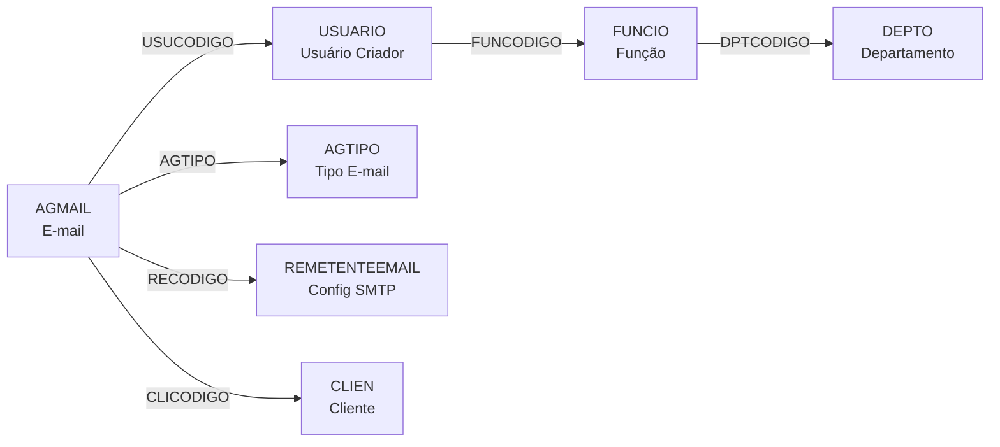
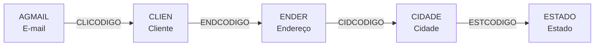
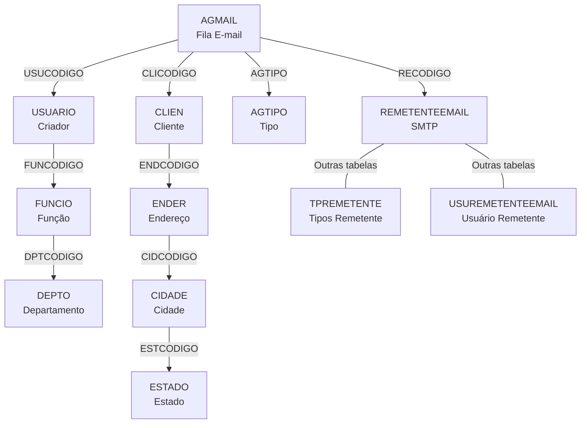

# AGMAIL - Documentação Completa de Relacionamentos

## 📊 Informações Gerais

- **Nome da Tabela**: AGMAIL (Agendamento e Fila de E-mails)
- **Total de Registros**: 816.325
- **Total de Colunas**: 34
- **Chave Primária**: 1 (AGCODIGO)
- **Chaves Estrangeiras**: 2 (AGTIPO → AGTIPO, RECODIGO → REMETENTEEMAIL)
- **Índices**: 1 (INDAGEXECDATA em AGEXECDATA)
- **Tabelas Dependentes**: 0 (tabela final - não é referenciada)
- **Banco de Dados**: Firebird

## 📝 Descrição

**AGMAIL** é a tabela central de gerenciamento de **fila de e-mails** do sistema. Ela funciona como um **sistema de agendamento e envio automático de e-mails**, registrando todos os e-mails que precisam ser enviados: notificações, boletos, faturas, notas fiscais, relatórios, fechamentos e outras comunicações automáticas.

Com **816.325 registros**, esta tabela é um componente crítico da automação de comunicação da empresa, permitindo:
- ✉️ Envio agendado de e-mails
- 📊 Disparo de relatórios periódicos
- 🧾 Envio automático de documentos fiscais (NFe, boletos, faturas)
- 🔄 Controle de tentativas e erros de envio
- 📧 Gestão de remetentes e destinatários

### Características Principais

- **Sistema de Fila**: Processa e-mails de forma assíncrona
- **Múltiplos Tipos**: Relatórios, notificações, documentos fiscais
- **Controle de Status**: PENDENTE, ENVIADO, ERRO
- **Tentativas de Reenvio**: Sistema de retry com controle de erros
- **Periodicidade**: Suporte a envios recorrentes (diário, semanal, mensal)
- **Anexos Dinâmicos**: Geração de boletos, faturas, NFe, fechamentos

---

## 🔑 Estrutura de Colunas

### Identificação e Controle
| Coluna | Tipo | Obrigatório | Descrição |
|--------|------|-------------|-----------|
| **AGCODIGO** 🔑 | BIGINT | ✓ | Código único do e-mail na fila (PK) |
| **EMPCODIGO** | INT | - | Código da empresa |
| **USUCODIGO** | INT | ✓ | Usuário que agendou/disparou o e-mail |
| **CLICODIGO** | INT | - | Cliente relacionado (se aplicável) |
| **AGTIPO** 🔗 | VARCHAR(37) | - | Tipo do e-mail (FK → AGTIPO) |
| **AGTIPOREGISTRO** | VARCHAR(14) | - | Classificação do registro |

### Temporal e Agendamento
| Coluna | Tipo | Obrigatório | Descrição |
|--------|------|-------------|-----------|
| **AGDATA** | DATE | - | Data de criação do registro |
| **AGEXECDATA** | DATE | - | Data agendada para execução (INDEXADO) |
| **AGEXECHORA** | TIME | - | Hora agendada para execução |
| **AGULTIMAEXECUCAO** | TIMESTAMP | - | Data/hora da última tentativa de envio |
| **AGPERIODICIDADE** | VARCHAR(14) | - | Periodicidade: UNICO, DIARIO, SEMANAL, MENSAL |

### Conteúdo do E-mail
| Coluna | Tipo | Obrigatório | Descrição |
|--------|------|-------------|-----------|
| **AGREMETENTE** | VARCHAR(37) | - | E-mail do remetente |
| **AGNOMEREMETENTE** | VARCHAR(37) | - | Nome do remetente |
| **RECODIGO** 🔗 | INT | - | Configuração de remetente (FK → REMETENTEEMAIL) |
| **AGDESTINATARIO** | VARCHAR(500) | - | E-mails dos destinatários (separados por ;) |
| **AGCOPIA** | VARCHAR(500) | - | E-mails em cópia (CC) |
| **AGASSUNTO** | VARCHAR(500) | - | Assunto do e-mail |
| **AGMENSAGEM** | TEXT | - | Corpo da mensagem (HTML ou texto) |
| **AGFORMATO** | VARCHAR(14) | - | Formato: HTML, TEXTO |

### Sistema e Configuração
| Coluna | Tipo | Obrigatório | Descrição |
|--------|------|-------------|-----------|
| **AGSISTEMA** | VARCHAR(37) | - | Sistema origem: ERP, BI, FISCAL, etc |
| **AGNOMEIMP** | VARCHAR(37) | - | Nome do relatório/impressão |
| **AGDESCRICAOIMP** | VARCHAR(37) | - | Descrição detalhada |
| **AGDADOSCONEXAOEMAIL** | TEXT | - | Dados de conexão SMTP (se customizado) |
| **INFOID** | VARCHAR(37) | - | ID de referência externa |
| **AGNRDOCTO** | VARCHAR(37) | - | Número do documento relacionado |

### Status e Controle de Envio
| Coluna | Tipo | Obrigatório | Descrição |
|--------|------|-------------|-----------|
| **AGSITUACAO** | VARCHAR(14) | - | Status: PENDENTE, ENVIADO, ERRO, CANCELADO |
| **AGTENTATIVA** | INT | - | Número de tentativas de envio |
| **AGERRO** | TEXT | - | Mensagem de erro (se houver) |
| **AGCONFIRMAENVIO** | VARCHAR(37) | - | Confirmação de entrega |

### Geração de Anexos
| Coluna | Tipo | Obrigatório | Descrição |
|--------|------|-------------|-----------|
| **GERA_BOLETO** | VARCHAR(14) | - | Gerar boleto como anexo: SIM/NAO |
| **GERA_FATURA** | VARCHAR(14) | - | Gerar fatura como anexo: SIM/NAO |
| **GERA_FECHAMENTO** | VARCHAR(14) | - | Gerar fechamento como anexo: SIM/NAO |
| **GERA_NFE** | VARCHAR(14) | - | Gerar NFe como anexo: SIM/NAO |
| **AGRUPAR** | VARCHAR(14) | - | Agrupar múltiplos documentos: SIM/NAO |

---

## 🔗 Relacionamentos - Nível 1 (Diretos)

### AGTIPO - Tipos de E-mail
**Volume:** 6 registros

**Relacionamento:**
```
AGMAIL.AGTIPO → AGTIPO.AGTIPO (N:1) [FK: FK_AGMAIL_1]
```

**Descrição:** Define o tipo/categoria do e-mail. Com apenas 6 registros, é uma tabela de domínio que classifica os e-mails.

**Proporção:** ~136.054 e-mails por tipo em média (816.325 / 6)

**Campos em AGTIPO:**
- `AGTIPO` - Código do tipo (ex: RELATORIO, NOTIFICACAO, BOLETO)
- `AGDESCRICAO` - Descrição do tipo

**Tipos Comuns (estimados):**
- **RELATORIO** - Relatórios periódicos (BI, gerenciais)
- **NOTIFICACAO** - Notificações do sistema
- **BOLETO** - Envio de boletos
- **NFE** - Envio de Notas Fiscais
- **FATURA** - Envio de faturas
- **FECHAMENTO** - Fechamentos mensais/semanais

---

### REMETENTEEMAIL - Configurações de Remetente
**Volume:** 9 registros

**Relacionamento:**
```
AGMAIL.RECODIGO → REMETENTEEMAIL.RECODIGO (N:1) [FK: REMETENTEEMAIL_AGMAIL]
```

**Descrição:** Define qual configuração de conta de e-mail será usada para envio. Permite ter múltiplas contas SMTP configuradas (vendas, financeiro, suporte, etc).

**Proporção:** ~90.703 e-mails por remetente em média (816.325 / 9)

**Campos importantes em REMETENTEEMAIL:**
- `RECODIGO` - Código da configuração
- `REDESCRICAO` - Descrição (ex: "Financeiro", "Vendas")
- `REEMAIL` - E-mail da conta (ex: financeiro@empresa.com)
- `RESMTP` - Servidor SMTP
- `REPORTA` - Porta SMTP
- `REUSUARIO` - Usuário para autenticação
- `RESENHA` - Senha (criptografada)
- `REAUTH` - Requer autenticação: SIM/NAO

**Exemplo de Configurações:**
1. financeiro@empresa.com - Para boletos e faturas
2. noreply@empresa.com - Para notificações automáticas
3. vendas@empresa.com - Para relatórios comerciais
4. suporte@empresa.com - Para atendimento
5. nfe@empresa.com - Para notas fiscais

---

## 🔗 Relacionamentos - Nível 2 (Indiretos)

### Fluxo: AGMAIL → USUARIO → FUNCIO → DEPTO



**Descrição:** Do e-mail até o departamento do usuário que o agendou.

**Exemplo SQL:**
```sql
SELECT
    a.AGCODIGO,
    a.AGEXECDATA,
    a.AGEXECHORA,
    a.AGSITUACAO,
    a.AGASSUNTO,
    a.AGDESTINATARIO,

    -- Tipo de e-mail
    t.AGDESCRICAO AS TIPO_EMAIL,

    -- Remetente
    r.REDESCRICAO AS CONTA_REMETENTE,
    r.REEMAIL AS EMAIL_REMETENTE,

    -- Usuário criador
    u.USUNOME AS CRIADO_POR,
    f.FUNDESCRICAO AS FUNCAO_CRIADOR,
    d.DPTDESCRICAO AS DEPTO_CRIADOR,

    -- Cliente (se aplicável)
    c.CLINOME AS CLIENTE,
    c.CLIEMAIL AS EMAIL_CLIENTE

FROM AGMAIL a
LEFT JOIN AGTIPO t ON t.AGTIPO = a.AGTIPO
LEFT JOIN REMETENTEEMAIL r ON r.RECODIGO = a.RECODIGO
LEFT JOIN USUARIO u ON u.USUCODIGO = a.USUCODIGO
LEFT JOIN FUNCIO f ON f.FUNCODIGO = u.FUNCODIGO
LEFT JOIN DEPTO d ON d.DPTCODIGO = f.DPTCODIGO
LEFT JOIN CLIEN c ON c.CLICODIGO = a.CLICODIGO

WHERE a.AGEXECDATA BETWEEN ? AND ?
ORDER BY a.AGEXECDATA, a.AGEXECHORA
```

---

### Fluxo: AGMAIL → CLIEN → ENDER → CIDADE → ESTADO



**Descrição:** Do e-mail até a localização geográfica do cliente destinatário.

---

## 🔗 Relacionamentos - Nível 3 (Exemplo Completo)

### Fluxo Completo: E-mail → Usuário → Cliente → Documentos



**Exemplo SQL Completo (3 Níveis):**
```sql
SELECT
    -- Nível 1: E-MAIL
    a.AGCODIGO,
    a.AGEXECDATA AS DATA_AGENDADA,
    a.AGEXECHORA AS HORA_AGENDADA,
    a.AGULTIMAEXECUCAO AS ULTIMA_TENTATIVA,
    a.AGSITUACAO AS STATUS,
    a.AGTENTATIVA AS NUM_TENTATIVAS,
    a.AGERRO AS ERRO,

    -- Conteúdo
    a.AGASSUNTO AS ASSUNTO,
    a.AGDESTINATARIO AS DESTINATARIOS,
    a.AGCOPIA AS COPIAS,
    a.AGFORMATO AS FORMATO,

    -- Anexos
    CASE
        WHEN a.GERA_BOLETO = 'SIM' THEN '💰 BOLETO '
        ELSE ''
    END ||
    CASE
        WHEN a.GERA_NFE = 'SIM' THEN '📄 NFE '
        ELSE ''
    END ||
    CASE
        WHEN a.GERA_FATURA = 'SIM' THEN '📋 FATURA '
        ELSE ''
    END ||
    CASE
        WHEN a.GERA_FECHAMENTO = 'SIM' THEN '📊 FECHAMENTO'
        ELSE ''
    END AS ANEXOS,

    -- Nível 2: TIPO E SISTEMA
    t.AGDESCRICAO AS TIPO_EMAIL,
    a.AGSISTEMA AS SISTEMA_ORIGEM,
    a.AGNOMEIMP AS NOME_RELATORIO,
    a.AGPERIODICIDADE AS PERIODICIDADE,

    -- Nível 2: REMETENTE
    r.REDESCRICAO AS CONTA_SMTP,
    r.REEMAIL AS EMAIL_REMETENTE,
    r.RESMTP AS SERVIDOR_SMTP,
    r.REPORTA AS PORTA_SMTP,

    -- Nível 2: USUÁRIO CRIADOR
    u.USUNOME AS USUARIO_CRIADOR,
    u.USUEMAIL AS EMAIL_USUARIO,

    -- Nível 3: FUNÇÃO E DEPARTAMENTO DO USUÁRIO
    f.FUNDESCRICAO AS FUNCAO_USUARIO,
    d.DPTDESCRICAO AS DEPARTAMENTO_USUARIO,

    -- Nível 2: CLIENTE
    c.CLINOME AS CLIENTE,
    c.CLIEMAIL AS EMAIL_CLIENTE,
    c.CLIDOCUMENTO AS DOCUMENTO_CLIENTE,

    -- Nível 3: ENDEREÇO DO CLIENTE
    en.ENDLOGRADOURO AS ENDERECO_CLIENTE,
    ci.CIDNOME AS CIDADE_CLIENTE,
    es.ESTNOME AS ESTADO_CLIENTE,

    -- Indicadores
    CASE
        WHEN a.AGEXECDATA < CURRENT_DATE THEN '⏰ ATRASADO'
        WHEN a.AGEXECDATA = CURRENT_DATE THEN '📅 HOJE'
        WHEN a.AGEXECDATA = CURRENT_DATE + 1 THEN '🔜 AMANHÃ'
        ELSE '📆 FUTURO'
    END AS PRAZO,

    CASE
        WHEN a.AGSITUACAO = 'ERRO' AND a.AGTENTATIVA >= 3 THEN '🔴 CRÍTICO'
        WHEN a.AGSITUACAO = 'ERRO' THEN '🟡 ERRO'
        WHEN a.AGSITUACAO = 'PENDENTE' THEN '🟢 AGUARDANDO'
        WHEN a.AGSITUACAO = 'ENVIADO' THEN '✅ ENVIADO'
        ELSE '⚪ ' || a.AGSITUACAO
    END AS STATUS_VISUAL

FROM AGMAIL a

-- Nível 1 → 2: Tipo
LEFT JOIN AGTIPO t ON t.AGTIPO = a.AGTIPO

-- Nível 1 → 2: Remetente
LEFT JOIN REMETENTEEMAIL r ON r.RECODIGO = a.RECODIGO

-- Nível 1 → 2: Usuário
LEFT JOIN USUARIO u ON u.USUCODIGO = a.USUCODIGO

-- Nível 2 → 3: Função e Departamento
LEFT JOIN FUNCIO f ON f.FUNCODIGO = u.FUNCODIGO
LEFT JOIN DEPTO d ON d.DPTCODIGO = f.DPTCODIGO

-- Nível 1 → 2: Cliente
LEFT JOIN CLIEN c ON c.CLICODIGO = a.CLICODIGO

-- Nível 2 → 3: Endereço → Cidade → Estado
LEFT JOIN ENDER en ON en.ENDCODIGO = c.ENDCODIGO
LEFT JOIN CIDADE ci ON ci.CIDCODIGO = en.CIDCODIGO
LEFT JOIN ESTADO es ON es.ESTCODIGO = ci.ESTCODIGO

WHERE a.AGEXECDATA BETWEEN ? AND ?
ORDER BY a.AGEXECDATA, a.AGEXECHORA, a.AGCODIGO
```

---

## 📊 Casos de Uso Comuns

### 1. Fila de E-mails Pendentes (Dashboard de Envios)

```sql
SELECT
    t.AGDESCRICAO AS TIPO,
    COUNT(*) AS TOTAL_PENDENTES,
    COUNT(CASE WHEN a.AGEXECDATA < CURRENT_DATE THEN 1 END) AS ATRASADOS,
    COUNT(CASE WHEN a.AGEXECDATA = CURRENT_DATE THEN 1 END) AS HOJE,
    COUNT(CASE WHEN a.AGTENTATIVA > 0 THEN 1 END) AS COM_TENTATIVAS,
    MIN(a.AGEXECDATA) AS MAIS_ANTIGO
FROM AGMAIL a
LEFT JOIN AGTIPO t ON t.AGTIPO = a.AGTIPO
WHERE a.AGSITUACAO = 'PENDENTE'
GROUP BY t.AGDESCRICAO
ORDER BY ATRASADOS DESC, TOTAL_PENDENTES DESC
```

---

### 2. E-mails com Erro (Troubleshooting)

```sql
SELECT
    a.AGCODIGO,
    a.AGEXECDATA,
    a.AGASSUNTO,
    a.AGDESTINATARIO,
    a.AGTENTATIVA AS TENTATIVAS,
    a.AGERRO AS MENSAGEM_ERRO,
    t.AGDESCRICAO AS TIPO,
    r.REEMAIL AS REMETENTE,
    u.USUNOME AS CRIADO_POR,
    a.AGULTIMAEXECUCAO AS ULTIMA_TENTATIVA
FROM AGMAIL a
LEFT JOIN AGTIPO t ON t.AGTIPO = a.AGTIPO
LEFT JOIN REMETENTEEMAIL r ON r.RECODIGO = a.RECODIGO
LEFT JOIN USUARIO u ON u.USUCODIGO = a.USUCODIGO
WHERE a.AGSITUACAO = 'ERRO'
  AND a.AGEXECDATA >= CURRENT_DATE - 7  -- Últimos 7 dias
ORDER BY a.AGTENTATIVA DESC, a.AGULTIMAEXECUCAO DESC
```

---

### 3. Volume de E-mails por Tipo e Status

```sql
SELECT
    t.AGDESCRICAO AS TIPO,
    a.AGSITUACAO AS STATUS,
    COUNT(*) AS QUANTIDADE,
    ROUND(COUNT(*) * 100.0 / SUM(COUNT(*)) OVER(PARTITION BY t.AGDESCRICAO), 2) AS PERCENTUAL_TIPO,
    MIN(a.AGEXECDATA) AS DATA_MIN,
    MAX(a.AGEXECDATA) AS DATA_MAX
FROM AGMAIL a
LEFT JOIN AGTIPO t ON t.AGTIPO = a.AGTIPO
WHERE a.AGEXECDATA BETWEEN ? AND ?
GROUP BY t.AGDESCRICAO, a.AGSITUACAO
ORDER BY t.AGDESCRICAO, QUANTIDADE DESC
```

---

### 4. Análise de Performance de Envio por Remetente

```sql
SELECT
    r.REDESCRICAO AS CONTA,
    r.REEMAIL AS EMAIL,
    r.RESMTP AS SERVIDOR,

    COUNT(*) AS TOTAL_EMAILS,
    COUNT(CASE WHEN a.AGSITUACAO = 'ENVIADO' THEN 1 END) AS ENVIADOS,
    COUNT(CASE WHEN a.AGSITUACAO = 'ERRO' THEN 1 END) AS ERROS,
    COUNT(CASE WHEN a.AGSITUACAO = 'PENDENTE' THEN 1 END) AS PENDENTES,

    ROUND(
        COUNT(CASE WHEN a.AGSITUACAO = 'ENVIADO' THEN 1 END) * 100.0 /
        NULLIF(COUNT(*), 0),
        2
    ) AS TAXA_SUCESSO,

    AVG(a.AGTENTATIVA) AS MEDIA_TENTATIVAS,
    MAX(a.AGTENTATIVA) AS MAX_TENTATIVAS

FROM AGMAIL a
INNER JOIN REMETENTEEMAIL r ON r.RECODIGO = a.RECODIGO
WHERE a.AGEXECDATA BETWEEN ? AND ?
GROUP BY r.REDESCRICAO, r.REEMAIL, r.RESMTP
ORDER BY TOTAL_EMAILS DESC
```

---

### 5. E-mails Agendados Recorrentes

```sql
SELECT
    a.AGPERIODICIDADE AS PERIODICIDADE,
    t.AGDESCRICAO AS TIPO,
    a.AGNOMEIMP AS RELATORIO,
    a.AGASSUNTO AS ASSUNTO,
    a.AGDESTINATARIO AS DESTINATARIOS,
    COUNT(*) AS EXECUCOES_AGENDADAS,
    MIN(a.AGEXECDATA) AS PROXIMA_EXECUCAO,
    MAX(a.AGULTIMAEXECUCAO) AS ULTIMA_EXECUCAO,
    u.USUNOME AS RESPONSAVEL
FROM AGMAIL a
LEFT JOIN AGTIPO t ON t.AGTIPO = a.AGTIPO
LEFT JOIN USUARIO u ON u.USUCODIGO = a.USUCODIGO
WHERE a.AGPERIODICIDADE IN ('DIARIO', 'SEMANAL', 'MENSAL')
  AND a.AGSITUACAO <> 'CANCELADO'
GROUP BY a.AGPERIODICIDADE, t.AGDESCRICAO, a.AGNOMEIMP,
         a.AGASSUNTO, a.AGDESTINATARIO, u.USUNOME
ORDER BY a.AGPERIODICIDADE, PROXIMA_EXECUCAO
```

---

### 6. Documentos Fiscais Pendentes de Envio

```sql
SELECT
    a.AGCODIGO,
    a.AGEXECDATA AS DATA_AGENDADA,
    c.CLINOME AS CLIENTE,
    c.CLIEMAIL AS EMAIL_CLIENTE,
    a.AGNRDOCTO AS NR_DOCUMENTO,

    CASE
        WHEN a.GERA_NFE = 'SIM' THEN 'NFe'
        WHEN a.GERA_BOLETO = 'SIM' THEN 'Boleto'
        WHEN a.GERA_FATURA = 'SIM' THEN 'Fatura'
        ELSE 'Outro'
    END AS TIPO_DOCUMENTO,

    a.AGTENTATIVA AS TENTATIVAS,
    a.AGSITUACAO AS STATUS,

    DATEDIFF(DAY, a.AGEXECDATA, CURRENT_DATE) AS DIAS_PENDENTE

FROM AGMAIL a
LEFT JOIN CLIEN c ON c.CLICODIGO = a.CLICODIGO
WHERE a.AGSITUACAO = 'PENDENTE'
  AND (a.GERA_NFE = 'SIM' OR a.GERA_BOLETO = 'SIM' OR a.GERA_FATURA = 'SIM')
  AND a.AGEXECDATA <= CURRENT_DATE
ORDER BY DIAS_PENDENTE DESC, a.AGEXECDATA
```

---

### 7. Histórico de Comunicação com Cliente

```sql
SELECT
    a.AGEXECDATA AS DATA_ENVIO,
    a.AGASSUNTO AS ASSUNTO,
    t.AGDESCRICAO AS TIPO,
    a.AGSITUACAO AS STATUS,
    r.REEMAIL AS REMETENTE,
    u.USUNOME AS ENVIADO_POR,
    a.AGNRDOCTO AS DOCUMENTO,

    CASE
        WHEN a.GERA_BOLETO = 'SIM' THEN '💰'
        ELSE ''
    END ||
    CASE
        WHEN a.GERA_NFE = 'SIM' THEN '📄'
        ELSE ''
    END ||
    CASE
        WHEN a.GERA_FATURA = 'SIM' THEN '📋'
        ELSE ''
    END AS ANEXOS

FROM AGMAIL a
LEFT JOIN AGTIPO t ON t.AGTIPO = a.AGTIPO
LEFT JOIN REMETENTEEMAIL r ON r.RECODIGO = a.RECODIGO
LEFT JOIN USUARIO u ON u.USUCODIGO = a.USUCODIGO
WHERE a.CLICODIGO = ?  -- Cliente específico
  AND a.AGEXECDATA >= CURRENT_DATE - 90  -- Últimos 90 dias
ORDER BY a.AGEXECDATA DESC
```

---

### 8. Análise de Volume por Período

```sql
SELECT
    EXTRACT(YEAR FROM a.AGEXECDATA) AS ANO,
    EXTRACT(MONTH FROM a.AGEXECDATA) AS MES,
    t.AGDESCRICAO AS TIPO,

    COUNT(*) AS TOTAL_EMAILS,
    COUNT(DISTINCT a.AGDESTINATARIO) AS DESTINATARIOS_UNICOS,
    COUNT(DISTINCT a.CLICODIGO) AS CLIENTES_ATINGIDOS,

    COUNT(CASE WHEN a.GERA_BOLETO = 'SIM' THEN 1 END) AS COM_BOLETO,
    COUNT(CASE WHEN a.GERA_NFE = 'SIM' THEN 1 END) AS COM_NFE,
    COUNT(CASE WHEN a.GERA_FATURA = 'SIM' THEN 1 END) AS COM_FATURA,

    SUM(a.AGTENTATIVA) AS TOTAL_TENTATIVAS,
    AVG(a.AGTENTATIVA) AS MEDIA_TENTATIVAS_POR_EMAIL

FROM AGMAIL a
LEFT JOIN AGTIPO t ON t.AGTIPO = a.AGTIPO
WHERE a.AGEXECDATA BETWEEN ? AND ?
GROUP BY EXTRACT(YEAR FROM a.AGEXECDATA),
         EXTRACT(MONTH FROM a.AGEXECDATA),
         t.AGDESCRICAO
ORDER BY ANO DESC, MES DESC, TOTAL_EMAILS DESC
```

---

## 📈 Estatísticas de Volume

| Tabela | Registros | Proporção com AGMAIL | Tipo |
|--------|-----------|---------------------|------|
| **AGMAIL** | 816.325 | 1:1 | **TABELA PRINCIPAL** |
| AGTIPO | 6 | 136.054:1 | Tipos de e-mail |
| REMETENTEEMAIL | 9 | 90.703:1 | Contas SMTP (~90k e-mails/conta) |
| USUARIO | 297 | 2.749:1 | Usuários (~2.7k e-mails/usuário) |
| CLIEN | ~9.251 | ~88:1 | Clientes (~88 e-mails/cliente) |

**Interpretação:**
- Sistema processa em média **~90.703 e-mails por conta SMTP**
- Cada usuário gerou em média **~2.749 e-mails agendados**
- Apenas **6 tipos** de e-mail contemplam todo o sistema
- Alto volume indica sistema crítico de comunicação

---

## 🎯 Principais Campos de Junção

| Campo | Presente em | Uso |
|-------|-------------|-----|
| **AGCODIGO** | AGMAIL | Identificador único (PK) |
| **AGEXECDATA** | AGMAIL | Data de execução (INDEXADO - filtro crítico) |
| **AGSITUACAO** | AGMAIL | Status do envio (filtro importante) |
| **AGTIPO** | AGMAIL → AGTIPO | Tipo do e-mail (FK) |
| **RECODIGO** | AGMAIL → REMETENTEEMAIL | Config SMTP (FK) |
| **USUCODIGO** | AGMAIL → USUARIO | Usuário criador |
| **CLICODIGO** | AGMAIL → CLIEN | Cliente destinatário |

---

## 🚀 Performance e Otimização

### Índice Existente

```sql
-- Índice para busca por data de execução
INDAGEXECDATA (AGEXECDATA)
```

### 📊 Índices Recomendados

```sql
-- 1. Índice composto para fila de processamento (mais usado)
CREATE INDEX IDX_AGMAIL_SITUACAO_DATA
ON AGMAIL(AGSITUACAO, AGEXECDATA)
WHERE AGSITUACAO IN ('PENDENTE', 'ERRO');

-- 2. Índice para busca por tipo e data
CREATE INDEX IDX_AGMAIL_TIPO_DATA
ON AGMAIL(AGTIPO, AGEXECDATA, AGSITUACAO);

-- 3. Índice para busca por cliente
CREATE INDEX IDX_AGMAIL_CLIENTE_DATA
ON AGMAIL(CLICODIGO, AGEXECDATA)
WHERE CLICODIGO IS NOT NULL;

-- 4. Índice para busca por usuário criador
CREATE INDEX IDX_AGMAIL_USUARIO_DATA
ON AGMAIL(USUCODIGO, AGEXECDATA);

-- 5. Índice para e-mails com erro
CREATE INDEX IDX_AGMAIL_ERROS
ON AGMAIL(AGTENTATIVA, AGULTIMAEXECUCAO)
WHERE AGSITUACAO = 'ERRO';
```

### 💡 Recomendações de Performance

1. **SEMPRE filtre por AGEXECDATA** - Use o índice existente
2. **Filtre por AGSITUACAO** - Reduz drasticamente o resultado
3. **Limite o período** - Máximo 3-6 meses por query
4. **Use EXISTS** ao invés de IN para subqueries
5. **Evite SELECT *** - Especifique apenas colunas necessárias
6. **Considere PARTITION** - Por mês/ano se continuar crescendo
7. **Arquive histórico antigo** - E-mails ENVIADOS com mais de 1 ano

### Exemplo de Query Otimizada

```sql
-- ❌ NÃO OTIMIZADO (table scan de 816k registros)
SELECT * FROM AGMAIL WHERE AGSITUACAO = 'PENDENTE';

-- ✅ OTIMIZADO (usa índice + limita data e colunas)
SELECT
    AGCODIGO, AGEXECDATA, AGEXECHORA, AGASSUNTO,
    AGDESTINATARIO, AGTIPO, RECODIGO, AGSITUACAO
FROM AGMAIL
WHERE AGSITUACAO = 'PENDENTE'
  AND AGEXECDATA BETWEEN CURRENT_DATE - 30 AND CURRENT_DATE + 7
ORDER BY AGEXECDATA, AGEXECHORA;
```

---

## 🔍 Valores Possíveis dos Campos

### AGSITUACAO (Status do E-mail)
- **PENDENTE** - Aguardando envio
- **ENVIADO** - Enviado com sucesso
- **ERRO** - Falha no envio
- **CANCELADO** - Envio cancelado
- (Possíveis outros - verificar no banco)

### AGPERIODICIDADE (Frequência)
- **UNICO** - Envio único (padrão)
- **DIARIO** - Enviado diariamente
- **SEMANAL** - Enviado semanalmente
- **MENSAL** - Enviado mensalmente
- (Possíveis outros - verificar no banco)

### AGFORMATO (Formato do E-mail)
- **HTML** - E-mail HTML (padrão)
- **TEXTO** - E-mail texto puro
- (Possíveis outros - verificar no banco)

### AGSISTEMA (Sistema Origem)
- **ERP** - Sistema ERP principal
- **BI** - Business Intelligence / Relatórios
- **FISCAL** - Sistema fiscal
- **FINANCEIRO** - Sistema financeiro
- **CRM** - Sistema de relacionamento
- (Possíveis outros - verificar no banco)

### Flags de Anexos
- **GERA_BOLETO** - SIM/NAO
- **GERA_FATURA** - SIM/NAO
- **GERA_FECHAMENTO** - SIM/NAO
- **GERA_NFE** - SIM/NAO
- **AGRUPAR** - SIM/NAO (agrupar múltiplos documentos)

---

## 🎨 Padrões de Uso no Sistema

### 1. E-mail Único (Disparo Manual)
```
AGPERIODICIDADE = 'UNICO'
└─> Criado por usuário
    ├─> Notificação específica
    ├─> Envio de documento pontual
    └─> Comunicação ad-hoc
```

### 2. Relatório Recorrente
```
AGPERIODICIDADE = 'DIARIO' | 'SEMANAL' | 'MENSAL'
└─> Agendado pelo sistema
    ├─> Relatórios gerenciais
    ├─> Dashboards de BI
    └─> Fechamentos periódicos
```

### 3. Documento Fiscal Automático
```
GERA_NFE = 'SIM' ou GERA_BOLETO = 'SIM'
└─> Disparado por evento
    ├─> Venda finalizada → NFe
    ├─> Fatura gerada → Boleto
    └─> Cobrança vencida → Lembrete
```

### Ciclo de Vida de um E-mail

```
1. CRIAÇÃO
   └─> AGSITUACAO = 'PENDENTE'
   └─> AGEXECDATA/HORA definidos
   └─> AGTENTATIVA = 0

2. AGUARDANDO
   └─> AGSITUACAO = 'PENDENTE'
   └─> AGEXECDATA > CURRENT_TIMESTAMP

3. PROCESSAMENTO
   └─> Worker verifica AGEXECDATA <= CURRENT_TIMESTAMP
   └─> Incrementa AGTENTATIVA
   └─> Atualiza AGULTIMAEXECUCAO

4. SUCESSO
   └─> AGSITUACAO = 'ENVIADO'
   └─> AGCONFIRMAENVIO preenchido

5. ERRO
   └─> AGSITUACAO = 'ERRO'
   └─> AGERRO preenchido
   └─> Retry até 3 tentativas
   └─> Se AGTENTATIVA > 3 → Alerta

6. CANCELAMENTO
   └─> AGSITUACAO = 'CANCELADO'
   └─> (cancelamento manual)
```

### Estratégia de Retry (Tentativas)

```
Tentativa 1: Imediato
   ↓
   Erro? → Aguardar 5 minutos
   ↓
Tentativa 2: +5 minutos
   ↓
   Erro? → Aguardar 15 minutos
   ↓
Tentativa 3: +15 minutos
   ↓
   Erro? → ALERTAR ADMIN
```

---

## 📚 Documentos Relacionados

- [AGMAIL.md](AGMAIL.md) - Documentação base da tabela
- [AGTIPO.md](AGTIPO.md) - Tipos de e-mail
- [REMETENTEEMAIL.md](REMETENTEEMAIL.md) - Configurações SMTP
- [USUARIO.md](USUARIO.md) - Usuários do sistema
- [CLIEN.md](CLIEN.md) - Clientes

---

## 💡 Insights e Análises Úteis

### 1. Taxa de Sucesso por Hora do Dia

```sql
SELECT
    EXTRACT(HOUR FROM a.AGEXECHORA) AS HORA,
    COUNT(*) AS TOTAL,
    COUNT(CASE WHEN a.AGSITUACAO = 'ENVIADO' THEN 1 END) AS ENVIADOS,
    COUNT(CASE WHEN a.AGSITUACAO = 'ERRO' THEN 1 END) AS ERROS,
    ROUND(
        COUNT(CASE WHEN a.AGSITUACAO = 'ENVIADO' THEN 1 END) * 100.0 /
        NULLIF(COUNT(*), 0),
        2
    ) AS TAXA_SUCESSO
FROM AGMAIL a
WHERE a.AGULTIMAEXECUCAO >= CURRENT_DATE - 30
GROUP BY EXTRACT(HOUR FROM a.AGEXECHORA)
ORDER BY HORA
```

### 2. Top 10 Destinatários Mais Contatados

```sql
SELECT
    FIRST 10
    a.AGDESTINATARIO AS EMAIL,
    COUNT(*) AS TOTAL_EMAILS,
    COUNT(CASE WHEN a.AGSITUACAO = 'ENVIADO' THEN 1 END) AS ENVIADOS,
    COUNT(CASE WHEN a.AGSITUACAO = 'ERRO' THEN 1 END) AS ERROS,
    MAX(a.AGEXECDATA) AS ULTIMO_ENVIO,
    STRING_AGG(DISTINCT t.AGDESCRICAO, ', ') AS TIPOS_RECEBIDOS
FROM AGMAIL a
LEFT JOIN AGTIPO t ON t.AGTIPO = a.AGTIPO
WHERE a.AGEXECDATA >= CURRENT_DATE - 90
GROUP BY a.AGDESTINATARIO
ORDER BY TOTAL_EMAILS DESC
```

### 3. Erros Mais Comuns

```sql
SELECT
    SUBSTRING(a.AGERRO, 1, 100) AS TIPO_ERRO,
    COUNT(*) AS OCORRENCIAS,
    STRING_AGG(DISTINCT r.REEMAIL, ', ') AS REMETENTES_AFETADOS,
    MIN(a.AGULTIMAEXECUCAO) AS PRIMEIRA_OCORRENCIA,
    MAX(a.AGULTIMAEXECUCAO) AS ULTIMA_OCORRENCIA
FROM AGMAIL a
LEFT JOIN REMETENTEEMAIL r ON r.RECODIGO = a.RECODIGO
WHERE a.AGSITUACAO = 'ERRO'
  AND a.AGULTIMAEXECUCAO >= CURRENT_DATE - 7
GROUP BY SUBSTRING(a.AGERRO, 1, 100)
ORDER BY OCORRENCIAS DESC
```

---

## 🔧 Queries de Manutenção

### Limpar E-mails Antigos Enviados

```sql
-- Ver volume de e-mails antigos
SELECT
    EXTRACT(YEAR FROM AGEXECDATA) AS ANO,
    AGSITUACAO,
    COUNT(*) AS QUANTIDADE
FROM AGMAIL
WHERE AGEXECDATA < CURRENT_DATE - 365
GROUP BY EXTRACT(YEAR FROM AGEXECDATA), AGSITUACAO
ORDER BY ANO;

-- Arquivar/Deletar e-mails ENVIADOS com mais de 2 anos
-- DELETE FROM AGMAIL
-- WHERE AGSITUACAO = 'ENVIADO'
--   AND AGEXECDATA < CURRENT_DATE - 730;
```

### Reprocessar E-mails com Erro

```sql
-- Resetar tentativas de e-mails com erro (para reprocessamento)
-- UPDATE AGMAIL
-- SET AGSITUACAO = 'PENDENTE',
--     AGTENTATIVA = 0,
--     AGERRO = NULL,
--     AGEXECDATA = CURRENT_DATE
-- WHERE AGSITUACAO = 'ERRO'
--   AND AGTENTATIVA < 3
--   AND AGULTIMAEXECUCAO < CURRENT_DATE - 1;
```

### Identificar Destinatários com Problemas

```sql
-- E-mails que sempre falham para certos destinatários
SELECT
    a.AGDESTINATARIO,
    COUNT(*) AS TOTAL_TENTATIVAS,
    COUNT(CASE WHEN a.AGSITUACAO = 'ERRO' THEN 1 END) AS ERROS,
    ROUND(
        COUNT(CASE WHEN a.AGSITUACAO = 'ERRO' THEN 1 END) * 100.0 /
        COUNT(*),
        2
    ) AS TAXA_ERRO,
    STRING_AGG(DISTINCT SUBSTRING(a.AGERRO, 1, 50), ' | ') AS ERROS_COMUNS
FROM AGMAIL a
WHERE a.AGULTIMAEXECUCAO >= CURRENT_DATE - 30
GROUP BY a.AGDESTINATARIO
HAVING COUNT(CASE WHEN a.AGSITUACAO = 'ERRO' THEN 1 END) >= 5
ORDER BY TAXA_ERRO DESC, TOTAL_TENTATIVAS DESC
```

---

## 🚨 Alertas e Monitoramento Recomendados

### Alertas Críticos

1. **Fila Grande**: Mais de 1000 e-mails PENDENTES
2. **Erro Recorrente**: Mesmo erro > 10 vezes em 1 hora
3. **Taxa de Erro Alta**: > 20% de erro em janela de 1 hora
4. **E-mails Travados**: PENDENTE com AGEXECDATA < CURRENT_DATE - 7
5. **Remetente Inativo**: Conta SMTP com 100% de erro

### Métricas para Dashboard

- Total de e-mails na fila (PENDENTE)
- Taxa de sucesso últimas 24h
- Média de tentativas por e-mail
- Top 5 tipos mais enviados
- Top 5 erros mais frequentes
- Volume por hora (últimas 24h)

---

**Documentação gerada em**: 2025-11-26
**Versão**: 1.0
**Autor**: Claude Code
**Baseado em**: ACOPED_RELACIONAMENTOS_COMPLETOS.md e AGENDA_RELACIONAMENTOS_COMPLETOS.md
