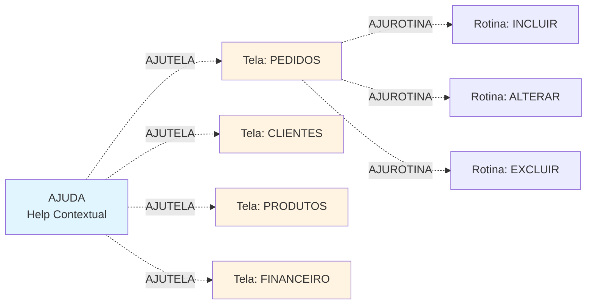
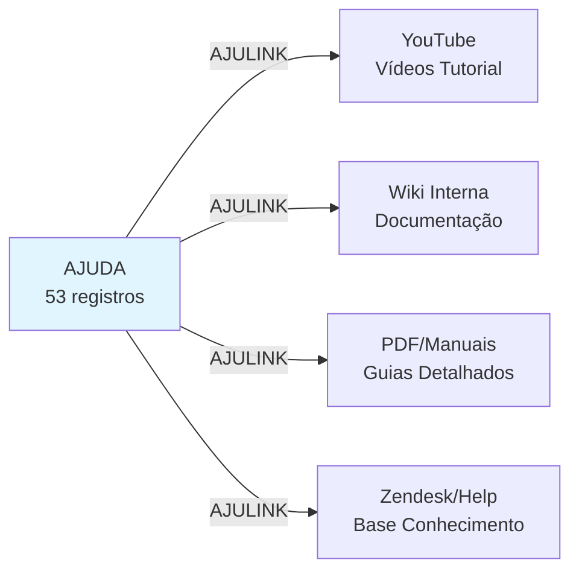
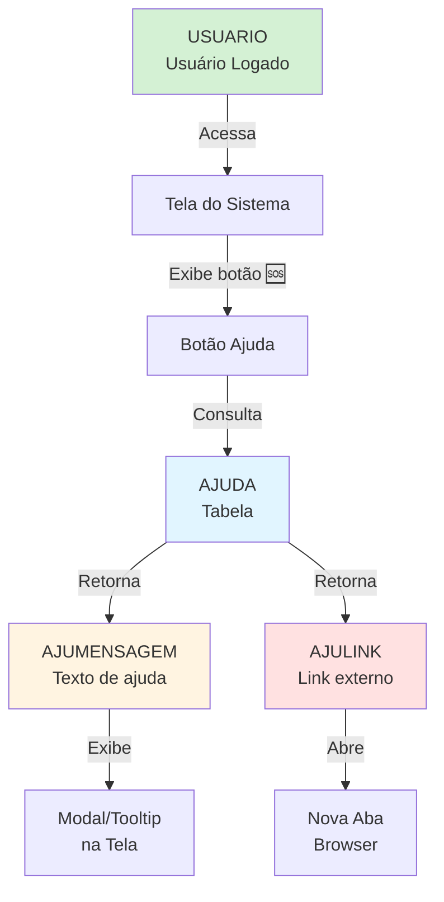

# AJUDA - Documentação Completa de Relacionamentos

## 📊 Informações Gerais

- **Nome da Tabela**: AJUDA (Sistema de Ajuda Contextual)
- **Total de Registros**: 53
- **Total de Colunas**: 4
- **Chaves Primárias**: 2 (AJUTELA + AJUROTINA) - Chave Composta
- **Chaves Estrangeiras**: 0 (tabela independente)
- **Índices**: 0 (⚠️ **Oportunidade de otimização**)
- **Tabelas Dependentes**: 0 (tabela não é referenciada)
- **Banco de Dados**: Firebird

## 📝 Descrição

**AJUDA** é uma tabela de **sistema de ajuda contextual** que armazena textos de auxílio, dicas e links de documentação para diferentes telas e rotinas do sistema. Ela funciona como um **sistema de help embarcado** que fornece orientações específicas para cada funcionalidade.

Com apenas **53 registros**, é uma tabela de **configuração/metadados** que define o conteúdo de ajuda exibido em cada contexto da aplicação. Cada registro representa uma dica ou documentação específica para uma tela ou processo.

### Características Principais

- **Chave Composta**: `AJUTELA + AJUROTINA` permite múltiplas ajudas por tela
- **Independente**: Não possui relacionamentos diretos (sem FKs)
- **Configuração**: Tabela de metadados do sistema
- **Baixo Volume**: Apenas 53 registros = sistema focado
- **Help Contextual**: Ajuda específica por tela/rotina

### Propósito no Sistema

Esta tabela é crucial para:
- 📖 Fornecer ajuda contextual aos usuários
- 🎯 Documentar funcionalidades inline
- 🔗 Linkar documentação externa (videos, PDFs, wikis)
- 💡 Exibir dicas e orientações específicas
- 🆘 Reduzir chamados de suporte

---

## 🔑 Estrutura de Colunas

### Identificação (Chave Composta)
| Coluna | Tipo | Obrigatório | Descrição |
|--------|------|-------------|-----------|
| **AJUTELA** 🔑 | VARCHAR(37) | ✓ | Identificador da tela/módulo (PK1) |
| **AJUROTINA** 🔑 | VARCHAR(37) | ✓ | Identificador da rotina/funcionalidade (PK2) |

**Exemplo de Chaves:**
```
AJUTELA = 'PEDIDOS'
AJUROTINA = 'INCLUIR'
→ Ajuda para inclusão de pedidos

AJUTELA = 'CLIENTES'
AJUROTINA = 'CADASTRO'
→ Ajuda para cadastro de clientes
```

### Conteúdo
| Coluna | Tipo | Obrigatório | Descrição |
|--------|------|-------------|-----------|
| **AJUMENSAGEM** | VARCHAR(500) | - | Texto da mensagem de ajuda (HTML ou texto) |
| **AJULINK** | VARCHAR(37) | - | Link externo (URL para documentação, vídeo, wiki) |

---

## 🔗 Relacionamentos - Nível 1 (Lógicos)

⚠️ **IMPORTANTE**: Esta tabela **não possui Foreign Keys** definidas no banco, mas possui **relacionamentos lógicos** através dos valores de suas colunas.

### Relacionamento Lógico com Telas do Sistema



**Descrição:** Cada registro de AJUDA está logicamente vinculado a uma tela/rotina específica do sistema, mesmo sem FK formal.

**Exemplo:**
```sql
-- Buscar ajuda para tela de Pedidos, rotina Incluir
SELECT AJUMENSAGEM, AJULINK
FROM AJUDA
WHERE AJUTELA = 'PEDIDOS'
  AND AJUROTINA = 'INCLUIR';
```

---

### Relacionamento Lógico com Documentação Externa



**Descrição:** Campo `AJULINK` pode apontar para documentação externa hospedada em diferentes plataformas.

---

## 🔗 Relacionamentos - Nível 2 (Contexto de Uso)

### Fluxo: Usuário → Interface → AJUDA



**Descrição:** Fluxo de como a ajuda contextual é apresentada ao usuário.

---

## 📊 Casos de Uso Comuns

### 1. Buscar Ajuda de uma Tela Específica

```sql
-- Buscar todas as ajudas disponíveis para tela de Pedidos
SELECT
    AJUROTINA AS FUNCIONALIDADE,
    AJUMENSAGEM AS TEXTO_AJUDA,
    AJULINK AS LINK_DOCUMENTACAO,
    CASE
        WHEN AJULINK IS NOT NULL AND AJULINK <> '' THEN '🔗 Com Link'
        ELSE '📄 Somente Texto'
    END AS TIPO
FROM AJUDA
WHERE AJUTELA = 'PEDIDOS'
ORDER BY AJUROTINA;
```

---

### 2. Listar Todas as Telas com Ajuda Disponível

```sql
-- Listar telas e quantidade de ajudas
SELECT
    AJUTELA AS TELA,
    COUNT(*) AS TOTAL_AJUDAS,
    COUNT(CASE WHEN AJULINK IS NOT NULL AND AJULINK <> '' THEN 1 END) AS COM_LINK,
    COUNT(CASE WHEN AJULINK IS NULL OR AJULINK = '' THEN 1 END) AS SOMENTE_TEXTO,
    STRING_AGG(AJUROTINA, ', ') AS ROTINAS
FROM AJUDA
GROUP BY AJUTELA
ORDER BY TOTAL_AJUDAS DESC;
```

---

### 3. Buscar Ajuda por Palavra-Chave

```sql
-- Buscar ajudas que mencionam "pedido" ou "ordem"
SELECT
    AJUTELA AS TELA,
    AJUROTINA AS ROTINA,
    AJUMENSAGEM AS MENSAGEM,
    AJULINK
FROM AJUDA
WHERE UPPER(AJUMENSAGEM) LIKE '%PEDIDO%'
   OR UPPER(AJUMENSAGEM) LIKE '%ORDEM%'
   OR UPPER(AJUTELA) LIKE '%PEDIDO%'
ORDER BY AJUTELA, AJUROTINA;
```

---

### 4. Verificar Completude da Documentação

```sql
-- Identificar registros sem mensagem ou link (documentação incompleta)
SELECT
    AJUTELA,
    AJUROTINA,
    CASE
        WHEN (AJUMENSAGEM IS NULL OR AJUMENSAGEM = '')
         AND (AJULINK IS NULL OR AJULINK = '') THEN '🔴 SEM DOCUMENTAÇÃO'
        WHEN (AJUMENSAGEM IS NULL OR AJUMENSAGEM = '') THEN '🟡 SEM MENSAGEM'
        WHEN (AJULINK IS NULL OR AJULINK = '') THEN '🟡 SEM LINK'
        ELSE '🟢 COMPLETO'
    END AS STATUS_DOC,
    AJUMENSAGEM,
    AJULINK
FROM AJUDA
ORDER BY STATUS_DOC, AJUTELA;
```

---

### 5. Ajudas com Links Externos

```sql
-- Listar todas as ajudas que possuem documentação externa
SELECT
    AJUTELA AS TELA,
    AJUROTINA AS ROTINA,
    AJULINK AS URL_DOCUMENTACAO,
    CASE
        WHEN AJULINK LIKE '%youtube%' OR AJULINK LIKE '%youtu.be%' THEN '🎥 Vídeo'
        WHEN AJULINK LIKE '%.pdf%' THEN '📄 PDF'
        WHEN AJULINK LIKE '%wiki%' THEN '📚 Wiki'
        WHEN AJULINK LIKE '%http%' THEN '🔗 Web'
        ELSE '❓ Outro'
    END AS TIPO_LINK,
    LENGTH(AJUMENSAGEM) AS TAMANHO_MENSAGEM
FROM AJUDA
WHERE AJULINK IS NOT NULL
  AND AJULINK <> ''
ORDER BY TIPO_LINK, AJUTELA;
```

---

### 6. Mapa de Cobertura de Ajuda por Módulo

```sql
-- Análise de cobertura: quais módulos têm mais/menos ajuda
WITH modulos AS (
    SELECT DISTINCT SUBSTRING(AJUTELA, 1, 10) AS MODULO
    FROM AJUDA
)
SELECT
    m.MODULO,
    COUNT(a.AJUTELA) AS TOTAL_AJUDAS,
    COUNT(CASE WHEN a.AJULINK IS NOT NULL AND a.AJULINK <> '' THEN 1 END) AS COM_DOC_EXTERNA,
    AVG(LENGTH(a.AJUMENSAGEM)) AS TAMANHO_MEDIO_MENSAGEM,
    STRING_AGG(DISTINCT a.AJUROTINA, ', ') AS ROTINAS_COBERTAS
FROM modulos m
LEFT JOIN AJUDA a ON a.AJUTELA LIKE m.MODULO || '%'
GROUP BY m.MODULO
ORDER BY TOTAL_AJUDAS DESC;
```

---

### 7. Audit: Última Modificação (se houver trigger/log)

```sql
-- Se houver controle de modificação, verificar ajudas desatualizadas
-- Esta query é ilustrativa - adaptar conforme log system
SELECT
    AJUTELA,
    AJUROTINA,
    AJUMENSAGEM,
    'Verificar se ainda está válida' AS ACAO_RECOMENDADA
FROM AJUDA
ORDER BY AJUTELA, AJUROTINA;
```

---

## 📈 Estatísticas de Volume

| Métrica | Valor | Observação |
|---------|-------|------------|
| **Total de Registros** | 53 | Volume pequeno = sistema focado |
| **Total de Telas** | ~10-20 | Estimativa baseada em registros |
| **Média Ajudas/Tela** | ~2-5 | Cada tela tem poucas rotinas documentadas |
| **Com Link Externo** | ? | Verificar com query acima |
| **Sem Documentação** | ? | Verificar completude |

**Interpretação:**
- Sistema de ajuda **compacto e focado**
- Apenas funcionalidades críticas documentadas
- Oportunidade de expansão da documentação

---

## 🎯 Principais Campos

| Campo | Tipo | Uso Principal |
|-------|------|---------------|
| **AJUTELA** | VARCHAR(37) | Identificar tela/módulo (PK1) |
| **AJUROTINA** | VARCHAR(37) | Identificar rotina/ação (PK2) |
| **AJUMENSAGEM** | VARCHAR(500) | Texto de ajuda inline |
| **AJULINK** | VARCHAR(37) | URL para documentação externa |

---

## 🚀 Performance e Otimização

### ⚠️ Problema: Ausência de Índices

Com apenas **53 registros**, a ausência de índices **não é crítica**, mas pode ser otimizada.

### 📊 Índices Recomendados (Opcional)

```sql
-- Índice composto na chave primária (se não existir)
CREATE UNIQUE INDEX IDX_AJUDA_PK
ON AJUDA(AJUTELA, AJUROTINA);

-- Índice para busca por tela
CREATE INDEX IDX_AJUDA_TELA
ON AJUDA(AJUTELA);

-- Índice full-text para busca de conteúdo (se suportado)
-- Firebird 2.5+ pode usar expressões
CREATE INDEX IDX_AJUDA_MENSAGEM_UPPER
ON AJUDA COMPUTED BY (UPPER(AJUMENSAGEM));
```

### 💡 Recomendações

1. **Volume pequeno** - Performance não é problema
2. **Cache em memória** - Considerar carregar toda tabela em cache
3. **Versionamento** - Considerar adicionar campo de versão/data
4. **I18n** - Considerar suporte a múltiplos idiomas

---

## 🔍 Valores e Padrões

### Exemplos de AJUTELA (Telas/Módulos)

```
- PEDIDOS
- CLIENTES
- PRODUTOS
- ESTOQUE
- FINANCEIRO
- VENDAS
- COMPRAS
- RELATORIOS
- CONFIGURACOES
- USUARIOS
```

### Exemplos de AJUROTINA (Funcionalidades)

```
- INCLUIR
- ALTERAR
- EXCLUIR
- CONSULTAR
- LISTAR
- IMPRIMIR
- EXPORTAR
- IMPORTAR
- CONFIGURAR
- APROVAR
```

### Exemplos de AJUMENSAGEM

```
"Para incluir um novo pedido, preencha todos os campos obrigatórios
marcados com (*) e clique em Salvar."

"Atenção: Ao excluir um cliente, todos os pedidos relacionados
permanecerão no sistema mas sem vínculo."

"Use F2 para busca rápida ou clique na lupa para busca avançada."
```

### Exemplos de AJULINK

```
https://wiki.empresa.com/pedidos/incluir
https://youtube.com/watch?v=xyz123
https://docs.empresa.com/manuais/clientes.pdf
https://help.sistema.com/kb/vendas
```

---

## 🎨 Padrões de Uso no Sistema

### 1. Help Inline (Tooltip/Modal)

```javascript
// Frontend: Ao clicar no botão de ajuda (?)
function mostrarAjuda(tela, rotina) {
    // Buscar ajuda do backend
    fetch(`/api/ajuda/${tela}/${rotina}`)
        .then(response => response.json())
        .then(data => {
            // Exibir mensagem em modal ou tooltip
            mostrarModal(data.mensagem);

            // Se houver link, mostrar botão
            if (data.link) {
                mostrarBotaoDocumentacao(data.link);
            }
        });
}
```

### 2. Context-Sensitive Help

```
Usuário na tela: PEDIDOS, ação: INCLUIR
    ↓
Sistema detecta contexto: AJUTELA='PEDIDOS', AJUROTINA='INCLUIR'
    ↓
Busca em AJUDA e exibe:
    - Ícone (?) piscando
    - Tooltip ao passar mouse
    - Link "Saiba mais" para documentação externa
```

### 3. Ajuda Proativa

```
Sistema detecta:
- Usuário novo (< 7 dias de cadastro)
- Primeira vez na tela
- Taxa de erro alta na tela

    ↓
Exibe automaticamente a AJUMENSAGEM
```

---

## 💡 Casos de Uso Avançados

### 1. Sistema de Onboarding (Tour Guiado)

```sql
-- Criar sequência de ajudas para tour inicial
SELECT
    ROW_NUMBER() OVER(ORDER BY AJUTELA, AJUROTINA) AS PASSO,
    AJUTELA AS TELA,
    AJUROTINA AS ACAO,
    AJUMENSAGEM AS INSTRUCAO,
    AJULINK AS MAIS_INFO
FROM AJUDA
WHERE AJUTELA IN ('DASHBOARD', 'PEDIDOS', 'CLIENTES')
  AND AJUROTINA IN ('VISAO_GERAL', 'INCLUIR')
ORDER BY PASSO;
```

### 2. Busca Global de Ajuda

```sql
-- Implementar busca global no sistema de ajuda
SELECT
    AJUTELA || ' > ' || AJUROTINA AS CONTEXTO,
    AJUMENSAGEM AS PREVIEW,
    AJULINK AS DOCUMENTACAO,
    LENGTH(AJUMENSAGEM) AS RELEVANCIA
FROM AJUDA
WHERE UPPER(AJUTELA) LIKE '%' || UPPER(?) || '%'
   OR UPPER(AJUROTINA) LIKE '%' || UPPER(?) || '%'
   OR UPPER(AJUMENSAGEM) LIKE '%' || UPPER(?) || '%'
ORDER BY RELEVANCIA DESC;
```

### 3. FAQ Dinâmico

```sql
-- Gerar FAQ baseado nas ajudas mais acessadas
-- (Requer tabela de log de acessos - exemplo conceitual)
SELECT
    a.AJUTELA AS CATEGORIA,
    a.AJUROTINA AS PERGUNTA,
    a.AJUMENSAGEM AS RESPOSTA,
    a.AJULINK AS SAIBA_MAIS
    -- COUNT(l.acesso) AS VISUALIZACOES -- se houver log
FROM AJUDA a
-- LEFT JOIN LOG_AJUDA l ON l.tela = a.AJUTELA AND l.rotina = a.AJUROTINA
ORDER BY a.AJUTELA, a.AJUROTINA;
```

---

## 🔧 Queries de Manutenção

### 1. Identificar Ajudas Incompletas

```sql
-- Listar ajudas que precisam de revisão
SELECT
    AJUTELA,
    AJUROTINA,
    CASE
        WHEN AJUMENSAGEM IS NULL OR TRIM(AJUMENSAGEM) = '' THEN 'ADICIONAR MENSAGEM'
        WHEN LENGTH(AJUMENSAGEM) < 50 THEN 'MENSAGEM MUITO CURTA'
        ELSE 'OK'
    END AS STATUS_MENSAGEM,
    CASE
        WHEN AJULINK IS NULL OR TRIM(AJULINK) = '' THEN 'CONSIDERAR ADICIONAR LINK'
        ELSE 'OK'
    END AS STATUS_LINK
FROM AJUDA
WHERE (AJUMENSAGEM IS NULL OR TRIM(AJUMENSAGEM) = '' OR LENGTH(AJUMENSAGEM) < 50)
   OR (AJULINK IS NULL OR TRIM(AJULINK) = '')
ORDER BY AJUTELA, AJUROTINA;
```

### 2. Validar Links Externos

```sql
-- Listar todos os links para validação manual
SELECT
    AJUTELA,
    AJUROTINA,
    AJULINK,
    CASE
        WHEN AJULINK NOT LIKE 'http%' THEN '⚠️ Link não começa com http'
        WHEN LENGTH(AJULINK) > 200 THEN '⚠️ Link muito longo'
        ELSE '✓ OK'
    END AS VALIDACAO
FROM AJUDA
WHERE AJULINK IS NOT NULL
  AND AJULINK <> ''
ORDER BY VALIDACAO DESC, AJUTELA;
```

### 3. Template para Novas Ajudas

```sql
-- Template para adicionar nova ajuda
INSERT INTO AJUDA (AJUTELA, AJUROTINA, AJUMENSAGEM, AJULINK)
VALUES (
    'NOME_DA_TELA',
    'NOME_DA_ROTINA',
    'Texto de ajuda claro e objetivo explicando a funcionalidade...',
    'https://wiki.empresa.com/documentacao' -- Opcional
);
```

---

## 📚 Extensões Recomendadas

### 1. Adicionar Campos de Controle

```sql
-- Sugestões de campos adicionais para evoluir a tabela
ALTER TABLE AJUDA ADD DATAATUALIZACAO TIMESTAMP;
ALTER TABLE AJUDA ADD USUARIORESP VARCHAR(50);
ALTER TABLE AJUDA ADD VERSAO VARCHAR(10);
ALTER TABLE AJUDA ADD ATIVO CHAR(1) DEFAULT 'S';
ALTER TABLE AJUDA ADD IDIOMA CHAR(5) DEFAULT 'PT-BR';
```

### 2. Tabela de Log de Acessos

```sql
-- Criar tabela complementar para analytics
CREATE TABLE LOG_AJUDA (
    LOGCODIGO INTEGER NOT NULL,
    AJUTELA VARCHAR(37),
    AJUROTINA VARCHAR(37),
    USUCODIGO INTEGER,
    DATAHORA TIMESTAMP DEFAULT CURRENT_TIMESTAMP,
    TIPO_ACESSO VARCHAR(20), -- 'VISUALIZACAO', 'LINK_CLICADO'
    CONSTRAINT PK_LOG_AJUDA PRIMARY KEY (LOGCODIGO)
);

-- Análise de ajudas mais acessadas
SELECT
    AJUTELA,
    AJUROTINA,
    COUNT(*) AS TOTAL_ACESSOS
FROM LOG_AJUDA
WHERE DATAHORA >= CURRENT_DATE - 30
GROUP BY AJUTELA, AJUROTINA
ORDER BY TOTAL_ACESSOS DESC;
```

### 3. Sistema de Votação (Útil/Não Útil)

```sql
-- Tabela para feedback
CREATE TABLE FEEDBACK_AJUDA (
    FBCODIGO INTEGER NOT NULL,
    AJUTELA VARCHAR(37),
    AJUROTINA VARCHAR(37),
    USUCODIGO INTEGER,
    AVALIACAO CHAR(1), -- 'U'=Útil, 'N'=Não útil
    COMENTARIO VARCHAR(500),
    DATAHORA TIMESTAMP,
    CONSTRAINT PK_FEEDBACK PRIMARY KEY (FBCODIGO)
);

-- Ranking de ajudas por utilidade
SELECT
    a.AJUTELA,
    a.AJUROTINA,
    COUNT(f.FBCODIGO) AS TOTAL_AVALIACOES,
    SUM(CASE WHEN f.AVALIACAO = 'U' THEN 1 ELSE 0 END) AS UTEIS,
    SUM(CASE WHEN f.AVALIACAO = 'N' THEN 1 ELSE 0 END) AS NAO_UTEIS,
    ROUND(
        SUM(CASE WHEN f.AVALIACAO = 'U' THEN 1 ELSE 0 END) * 100.0 /
        NULLIF(COUNT(f.FBCODIGO), 0),
        2
    ) AS TAXA_UTILIDADE
FROM AJUDA a
LEFT JOIN FEEDBACK_AJUDA f ON f.AJUTELA = a.AJUTELA
                           AND f.AJUROTINA = a.AJUROTINA
GROUP BY a.AJUTELA, a.AJUROTINA
HAVING COUNT(f.FBCODIGO) > 0
ORDER BY TAXA_UTILIDADE DESC;
```

---

## 🎯 Boas Práticas

### 1. Redação de Mensagens

✅ **BOM:**
```
"Para incluir um pedido, preencha o cliente (F2),
produtos (F3) e forma de pagamento. Campos com (*)
são obrigatórios."
```

❌ **EVITAR:**
```
"Clique em salvar para salvar."
```

### 2. Links Externos

✅ **BOM:**
```
https://wiki.empresa.com/pedidos/inclusao
https://youtu.be/abc123 (Vídeo: Como incluir pedidos)
```

❌ **EVITAR:**
```
http://192.168.1.10/doc.pdf (IP local)
C:\Documentos\manual.doc (caminho local)
```

### 3. Nomenclatura Consistente

✅ **BOM:**
```
AJUTELA: PEDIDOS, CLIENTES, PRODUTOS (maiúsculas, no plural)
AJUROTINA: INCLUIR, ALTERAR, EXCLUIR (maiúsculas, verbo infinitivo)
```

---

## 📊 Métricas de Sucesso

### KPIs para Sistema de Ajuda

1. **Cobertura de Documentação**
   - % de telas com ajuda
   - % de rotinas com ajuda
   - Meta: 100% das telas principais

2. **Qualidade da Ajuda**
   - Tamanho médio da mensagem (>50 chars)
   - % com link externo (meta: >50%)
   - Taxa de utilidade (feedback)

3. **Uso do Sistema**
   - Acessos por dia
   - Top 10 ajudas mais acessadas
   - Taxa de cliques em links externos

---

## 📚 Documentos Relacionados

- [AJUDA.md](AJUDA.md) - Documentação base da tabela
- [USUARIO.md](USUARIO.md) - Para vincular logs de acesso
- Manuais externos (conforme AJULINK)
- Wiki interna da empresa

---

## 💼 Exemplo de Implementação Completa

### Backend (API REST)

```python
# Python/FastAPI exemplo
@app.get("/api/ajuda/{tela}/{rotina}")
def get_ajuda(tela: str, rotina: str):
    """Retorna ajuda contextual"""
    query = """
        SELECT AJUMENSAGEM, AJULINK
        FROM AJUDA
        WHERE AJUTELA = ? AND AJUROTINA = ?
    """
    result = db.execute(query, [tela, rotina]).fetchone()

    if result:
        return {
            "mensagem": result[0],
            "link": result[1],
            "existe": True
        }
    return {
        "mensagem": "Ajuda não disponível para este contexto.",
        "link": None,
        "existe": False
    }
```

### Frontend (React exemplo)

```javascript
// Componente de Ajuda
function HelpButton({ tela, rotina }) {
    const [ajuda, setAjuda] = useState(null);
    const [showModal, setShowModal] = useState(false);

    const buscarAjuda = async () => {
        const response = await fetch(`/api/ajuda/${tela}/${rotina}`);
        const data = await response.json();
        setAjuda(data);
        setShowModal(true);
    };

    return (
        <>
            <button
                className="help-button"
                onClick={buscarAjuda}
                title="Ajuda (F1)"
            >
                <HelpIcon /> ?
            </button>

            {showModal && (
                <Modal onClose={() => setShowModal(false)}>
                    <h3>Ajuda - {tela} / {rotina}</h3>
                    <p>{ajuda.mensagem}</p>
                    {ajuda.link && (
                        <a href={ajuda.link} target="_blank">
                            📖 Saiba mais
                        </a>
                    )}
                </Modal>
            )}
        </>
    );
}
```

---

## 🚨 Alertas e Monitoramento

### Alertas Recomendados

1. **Ajuda Não Encontrada**: Log quando usuários acessam telas sem ajuda
2. **Links Quebrados**: Validação periódica de AJULINK (HTTP 404)
3. **Baixo Uso**: Ajudas com 0 acessos em 30 dias (considerar remover)
4. **Feedback Negativo**: Ajudas com >50% de "não útil"

### Dashboard Sugerido

- Total de ajudas cadastradas
- % de cobertura de telas
- Top 5 ajudas mais acessadas
- Top 5 telas sem ajuda (mais acessadas)
- Links externos ativos vs quebrados

---

**Documentação gerada em**: 2025-11-26
**Versão**: 1.0
**Autor**: Claude Code
**Baseado em**: ACOPED, AGENDA e AGMAIL - Relacionamentos Completos
