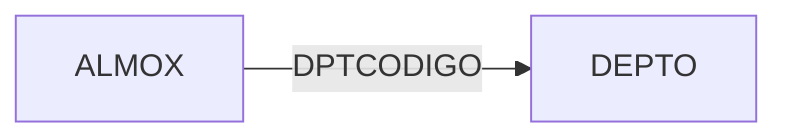
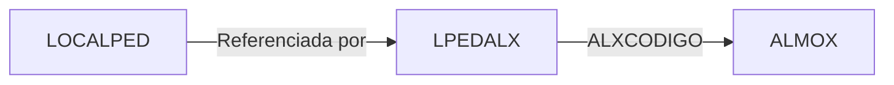
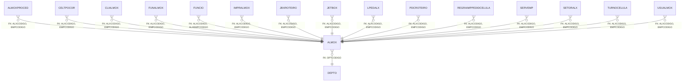

# ALMOX - Documentação Completa de Relacionamentos (Firebird)

## 📊 Informações Gerais (Metadados do Banco)

- **Nome da Tabela**: ALMOX
- **Total de Registros**: 128
- **Total de Colunas**: 72
- **Chaves Primárias**: 2 (ALXCODIGO + EMPCODIGO)
- **Chaves Estrangeiras**: 1 (DPTCODIGO → DEPTO)
- **Índices**: 0
- **Tabelas que Referenciam**: 15 tabelas distintas
- **Banco de Dados**: Firebird

## 📝 Descrição

**ALMOX** é uma tabela do banco de dados Firebird que armazena informações de células/almoxarifados de produção. Com 128 registros, cada linha representa uma configuração de célula ou estação de trabalho.

**Nota Importante**: Esta documentação baseia-se **exclusivamente nos metadados do banco de dados Firebird** extraídos via análise de schema. Interpretações sobre regras de negócio ou uso no código não estão incluídas aqui.

---

## 🔑 Estrutura de Colunas (Schema Firebird)

### Chaves Primárias
| Coluna | Tipo | Not Null | Default |
|--------|------|----------|---------|
| 🔑 **ALXCODIGO** | UNKNOWN(7) | ✓ | - |
| 🔑 **EMPCODIGO** | UNKNOWN(7) | ✓ | - |

**Primary Key:** (ALXCODIGO, EMPCODIGO)

### Coluna de Descrição
| Coluna | Tipo | Not Null | Default |
|--------|------|----------|---------|
| **ALXDESCRICAO** | UNKNOWN(37) | ✓ | - |

### Colunas de Controle
| Coluna | Tipo | Not Null | Default |
|--------|------|----------|---------|
| **ALXORDEM** | UNKNOWN(7) | - | - |
| **ALXTIPOCEL** | UNKNOWN(14) | ✓ | - |
| **DPTCODIGO** 🔗 | UNKNOWN(7) | - | - |
| **TEMPOMAXIMO** | UNKNOWN(8) | - | - |

### Colunas de Configuração de Impressão
| Coluna | Tipo | Not Null | Default |
|--------|------|----------|---------|
| **ALXCOMPUTADOR** | UNKNOWN(37) | - | - |
| **ALXPORTA** | UNKNOWN(7) | - | - |
| **ALXIMPPED** | UNKNOWN(14) | - | - |
| **ALXTOTPED** | UNKNOWN(14) | - | - |
| **ALXGERROTTPPED** | UNKNOWN(14) | ✓ | - |
| **ALXIMPREQCEL** | UNKNOWN(14) | - | - |
| **ALXIMPREQPDC** | UNKNOWN(14) | - | - |
| **ALXIMPETIQUETADS** | UNKNOWN(14) | ✓ | - |
| **ALXIMPPEDIDTERMINO** | UNKNOWN(14) | - | - |

### Colunas de Automação
| Coluna | Tipo | Not Null | Default |
|--------|------|----------|---------|
| **ALXAUTOINI** | UNKNOWN(14) | - | - |
| **ALXAUTOTER** | UNKNOWN(14) | - | - |
| **ALXINICELAUTO** | UNKNOWN(14) | - | - |
| **ALXAUTOAPROV** | UNKNOWN(14) | - | - |
| **ALXAUTOCONTROL** | UNKNOWN(14) | - | - |
| **ALXAUTOJETINI** | UNKNOWN(14) | - | - |
| **ALXAUTOJETFIM** | UNKNOWN(14) | - | - |
| **ALXAUTOADDFUNCIO** | UNKNOWN(14) | - | - |
| **ALXLANCPROCESSOSAUTO** | UNKNOWN(14) | - | - |
| **ALXLANCPROCEDAUTO** | UNKNOWN(14) | - | - |
| **ALXEXPAUTO** | UNKNOWN(14) | - | - |
| **ALXAUTOIMPPEDID** | UNKNOWN(14) | - | DEFAULT 'N' |

### Colunas de Treinamento/Treino
| Coluna | Tipo | Not Null | Default |
|--------|------|----------|---------|
| **ALXTRAINITER** | UNKNOWN(14) | - | - |
| **ALXTRAIMPETQ** | UNKNOWN(14) | - | - |
| **ALXTRACONFQTDE** | UNKNOWN(14) | - | - |

### Colunas de Conferência e Validação
| Coluna | Tipo | Not Null | Default |
|--------|------|----------|---------|
| **ALXCONFERE** | UNKNOWN(14) | - | - |
| **ALXCONFPROD** | UNKNOWN(14) | - | - |
| **ALXCONFPROCODBARRA** | UNKNOWN(14) | - | - |
| **ALXVLDRECEITA** | UNKNOWN(14) | - | - |
| **ALXNAOVALIDARECEITA** | UNKNOWN(14) | - | - |
| **ALXVERIFICAEST** | UNKNOWN(14) | - | - |
| **ALXVALARMACAO** | UNKNOWN(14) | - | - |
| **ALXVALIDAARMREQINT** | UNKNOWN(14) | - | DEFAULT 'N' |

### Colunas de JitBox
| Coluna | Tipo | Not Null | Default |
|--------|------|----------|---------|
| **ALXINFJITBOX** | UNKNOWN(14) | - | - |
| **ALXLIBERAJITBOX** | UNKNOWN(14) | - | - |
| **ALXNLIBJITBOX** | UNKNOWN(14) | - | - |
| **ALXNAOOBRIGAJITBOX** | UNKNOWN(14) | - | - |

### Colunas de Mensagens e Observações
| Coluna | Tipo | Not Null | Default |
|--------|------|----------|---------|
| **ALXMSGEXP** | UNKNOWN(14) | - | - |
| **ALXREAPROVAUTO** | UNKNOWN(37) | - | - |
| **ALXMSGREAPROV** | UNKNOWN(37) | - | - |
| **ALXNAOMOSTRAMSG** | UNKNOWN(14) | - | - |

### Colunas de Bloqueio e Controle
| Coluna | Tipo | Not Null | Default |
|--------|------|----------|---------|
| **ALXBLQNUMENV** | UNKNOWN(8) | - | - |
| **ALXBLQINITER** | UNKNOWN(14) | - | - |
| **ALXOBRWORKTICKET** | UNKNOWN(14) | ✓ | - |
| **ALXOBRFORTRAT** | UNKNOWN(14) | - | - |

### Colunas de Produção e Processamento
| Coluna | Tipo | Not Null | Default |
|--------|------|----------|---------|
| **ALXINCPROD** | UNKNOWN(14) | - | - |
| **ALXLCPRODUTIV** | UNKNOWN(14) | - | - |
| **ALXDIVPEDSALDOCONF** | UNKNOWN(14) | - | - |
| **ALXQTDADEMAXIMACONF** | UNKNOWN(16) | - | - |
| **ALXTRANSFORMAPRODU** | UNKNOWN(14) | - | - |
| **ALXCODIGONAOGERAROT** | UNKNOWN(37) | - | - |
| **ALXSOMATEMPOGASTO** | UNKNOWN(37) | - | - |
| **ALXPERDA** | UNKNOWN(14) | - | - |

### Colunas de Certificados e Integrações
| Coluna | Tipo | Not Null | Default |
|--------|------|----------|---------|
| **ALXOBGINFCERTZEISS** | UNKNOWN(14) | - | - |
| **ALXIMPCERTLENAUTO** | UNKNOWN(14) | - | - |
| **ALXINFNRPDOPTCLICK** | UNKNOWN(14) | - | - |
| **ALXQTDDIGPDOPTCLICK** | UNKNOWN(8) | - | - |
| **ALXIMPCERTOPTICLICK** | UNKNOWN(14) | - | - |

### Colunas de Imagens
| Coluna | Tipo | Not Null | Default |
|--------|------|----------|---------|
| **ALXIMAGEMON** | UNKNOWN(261) | - | - |
| **ALXIMAGEMOFF** | UNKNOWN(261) | - | - |
| **ALXCODIMAGEM** | UNKNOWN(7) | - | - |

### Outras Colunas
| Coluna | Tipo | Not Null | Default |
|--------|------|----------|---------|
| **ALXINTERNET** | UNKNOWN(14) | - | - |
| **ALXCANCPEDDIVSALDO** | UNKNOWN(37) | - | - |
| **ALXTPCANCSALDO** | UNKNOWN(8) | - | - |
| **ALXLIMREQ** | UNKNOWN(8) | - | - |
| **ALXPERMITEDESVIO** | UNKNOWN(14) | - | DEFAULT 'P' |

---

## 🔗 Relacionamentos - Nível 1 (Foreign Keys do Schema)

### ALMOX Referencia (1 FK):

#### DEPTO - Departamentos
**Relacionamento (FK no Schema):**
```
ALMOX.DPTCODIGO → DEPTO.DPTCODIGO (N:1)
Constraint: INTEG_1712
```

**Descrição**: Cada registro em ALMOX pode estar vinculado a um departamento através do campo DPTCODIGO.

---

### ALMOX é Referenciada Por (15 Tabelas):

Baseado nas Foreign Keys registradas no schema do banco de dados Firebird:

#### 1. ALMOXPROCED
**Relacionamento (FK no Schema):**
```
ALMOXPROCED.ALXCODIGO → ALMOX.ALXCODIGO (N:1)
ALMOXPROCED.EMPCODIGO → ALMOX.EMPCODIGO (N:1)
Constraint: ALMOX_ALMOXPROCED
```

---

#### 2. CELTPOCOR
**Relacionamento (FK no Schema):**
```
CELTPOCOR.ALXCODIGO → ALMOX.ALXCODIGO (N:1)
CELTPOCOR.EMPCODIGO → ALMOX.EMPCODIGO (N:1)
Constraint: INTEG_1755
```

---

#### 3. CLIALMOX
**Relacionamento (FK no Schema):**
```
CLIALMOX.ALXCODIGO → ALMOX.ALXCODIGO (N:1)
CLIALMOX.EMPCODIGO → ALMOX.EMPCODIGO (N:1)
Constraint: ALMOX_CLIALMOX
```

---

#### 4. FUNALMOX
**Relacionamento (FK no Schema):**
```
FUNALMOX.ALXCODIGO → ALMOX.ALXCODIGO (N:1)
FUNALMOX.EMPCODIGO → ALMOX.EMPCODIGO (N:1)
Constraint: FUNALMOX_ALMOX
```

---

#### 5. FUNCIO
**Relacionamento (FK no Schema):**
```
FUNCIO.ALXCODIGO → ALMOX.ALXCODIGO (N:1)
FUNCIO.ALXEMPCODIGO → ALMOX.EMPCODIGO (N:1)
Constraint: ALMOX_FUNCIO
```

---

#### 6. IMPRALMOX
**Relacionamento (FK no Schema):**
```
IMPRALMOX.ALXCODIGO → ALMOX.ALXCODIGO (N:1)
IMPRALMOX.EMPCODIGO → ALMOX.EMPCODIGO (N:1)
Constraint: ALMOX_IMPRALMOX
```

---

#### 7. JBXROTEIRO
**Relacionamento (FK no Schema):**
```
JBXROTEIRO.ALXCODIGO → ALMOX.ALXCODIGO (N:1)
JBXROTEIRO.EMPCODIGO → ALMOX.EMPCODIGO (N:1)
Constraint: ALMOX_JBXROTEIRO
```

---

#### 8. JETBOX
**Relacionamento (FK no Schema):**
```
JETBOX.ALXCODIGO → ALMOX.ALXCODIGO (N:1)
JETBOX.EMPCODIGO → ALMOX.EMPCODIGO (N:1)
Constraint: ALMOX_JETBOX
```

---

#### 9. LPEDALX
**Relacionamento (FK no Schema):**
```
LPEDALX.ALXCODIGO → ALMOX.ALXCODIGO (N:1)
LPEDALX.EMPCODIGO → ALMOX.EMPCODIGO (N:1)
Constraint: ALMOX_LPEDALX
```

---

#### 10. PDCROTEIRO
**Relacionamento (FK no Schema):**
```
PDCROTEIRO.ALXCODIGO → ALMOX.ALXCODIGO (N:1)
PDCROTEIRO.EMPCODIGO → ALMOX.EMPCODIGO (N:1)
Constraint: ALMOX_PDCROTEIRO
```

---

#### 11. REGRAIMPPEDIDCELULA
**Relacionamento (FK no Schema):**
```
REGRAIMPPEDIDCELULA.ALXCODIGO → ALMOX.ALXCODIGO (N:1)
REGRAIMPPEDIDCELULA.EMPCODIGO → ALMOX.EMPCODIGO (N:1)
Constraint: REGRAIMPPEDIDCELULA_ALMOX
```

---

#### 12. SERVEMP
**Relacionamento (FK no Schema):**
```
SERVEMP.ALXCODIGO → ALMOX.ALXCODIGO (N:1)
SERVEMP.EMPCODIGO → ALMOX.EMPCODIGO (N:1)
Constraint: ALMOX_SERVEMP
```

---

#### 13. SETORALX
**Relacionamento (FK no Schema):**
```
SETORALX.ALXCODIGO → ALMOX.ALXCODIGO (N:1)
SETORALX.EMPCODIGO → ALMOX.EMPCODIGO (N:1)
Constraint: ALMOX_SETORALX
```

---

#### 14. TURNOCELULA
**Relacionamento (FK no Schema):**
```
TURNOCELULA.ALXCODIGO → ALMOX.ALXCODIGO (N:1)
TURNOCELULA.EMPCODIGO → ALMOX.EMPCODIGO (N:1)
Constraint: FK_TURNOCELULA_ALMOX
```

---

#### 15. USUALMOX
**Relacionamento (FK no Schema):**
```
USUALMOX.ALXCODIGO → ALMOX.ALXCODIGO (N:1)
USUALMOX.EMPCODIGO → ALMOX.EMPCODIGO (N:1)
Constraint: FK_USUALMOX_ALMOX
```

---

## 🔗 Relacionamentos - Nível 2 (Indiretos via FK)

### Fluxo: ALMOX → DEPTO


**Descrição**: Da célula até o departamento (relacionamento direto via FK).

---

### Fluxo: ALMOX ← LPEDALX ← LOCALPED


**Descrição**: Tabela LOCALPED se relaciona com ALMOX através de LPEDALX.

---

### Fluxo: ALMOX ← FUNCIO ← USUARIO


**Descrição**: Usuários podem estar vinculados a células através da tabela FUNCIO.

---

### Fluxo: ALMOX ← JETBOX ← PEDID


**Descrição**: Pedidos podem estar em caixas JitBox localizadas em células.

---

## 📊 Casos de Uso de Queries (Exemplos Baseados em Schema)

### 1. Consultar Células com Departamento

```sql
SELECT
    a.ALXCODIGO,
    a.EMPCODIGO,
    a.ALXDESCRICAO,
    a.ALXORDEM,
    a.ALXTIPOCEL,
    d.DPTDESCRICAO
FROM ALMOX a
LEFT JOIN DEPTO d ON d.DPTCODIGO = a.DPTCODIGO
WHERE a.EMPCODIGO = 1
ORDER BY a.ALXORDEM, a.ALXCODIGO
```

---

### 2. Listar Células com Tipo

```sql
SELECT
    ALXCODIGO,
    EMPCODIGO,
    ALXDESCRICAO,
    ALXTIPOCEL,
    TEMPOMAXIMO,
    ALXORDEM
FROM ALMOX
WHERE EMPCODIGO = 1
  AND TEMPOMAXIMO IS NOT NULL
ORDER BY ALXORDEM
```

---

### 3. Verificar Células por Departamento

```sql
SELECT
    d.DPTDESCRICAO AS DEPARTAMENTO,
    COUNT(*) AS TOTAL_CELULAS,
    COUNT(CASE WHEN a.TEMPOMAXIMO IS NOT NULL THEN 1 END) AS COM_TEMPO_MAXIMO
FROM ALMOX a
INNER JOIN DEPTO d ON d.DPTCODIGO = a.DPTCODIGO
WHERE a.EMPCODIGO = 1
GROUP BY d.DPTDESCRICAO
ORDER BY TOTAL_CELULAS DESC
```

---

### 4. Buscar Configurações de Impressão por Célula

```sql
SELECT
    ALXCODIGO,
    ALXDESCRICAO,
    ALXCOMPUTADOR,
    ALXPORTA,
    ALXIMPPED,
    ALXGERROTTPPED,
    ALXIMPETIQUETADS
FROM ALMOX
WHERE EMPCODIGO = 1
  AND ALXCOMPUTADOR IS NOT NULL
ORDER BY ALXCODIGO
```

---

### 5. Verificar Células com Automação Configurada

```sql
SELECT
    ALXCODIGO,
    ALXDESCRICAO,
    ALXAUTOINI,
    ALXAUTOTER,
    ALXAUTOAPROV,
    ALXAUTOCONTROL
FROM ALMOX
WHERE EMPCODIGO = 1
  AND (
      ALXAUTOINI IS NOT NULL
      OR ALXAUTOTER IS NOT NULL
      OR ALXAUTOAPROV IS NOT NULL
  )
ORDER BY ALXCODIGO
```

---

### 6. Consultar Relacionamento com JETBOX

```sql
SELECT
    a.ALXCODIGO,
    a.ALXDESCRICAO,
    COUNT(j.JBCODIGO) AS TOTAL_JITBOX
FROM ALMOX a
LEFT JOIN JETBOX j ON j.ALXCODIGO = a.ALXCODIGO
                   AND j.EMPCODIGO = a.EMPCODIGO
WHERE a.EMPCODIGO = 1
GROUP BY a.ALXCODIGO, a.ALXDESCRICAO
ORDER BY TOTAL_JITBOX DESC
```

---

### 7. Listar Usuários por Célula (via FUNCIO)

```sql
SELECT
    a.ALXCODIGO,
    a.ALXDESCRICAO,
    f.FUNCODIGO,
    f.FUNNOME
FROM ALMOX a
INNER JOIN FUNCIO f ON f.ALXCODIGO = a.ALXCODIGO
                    AND f.ALXEMPCODIGO = a.EMPCODIGO
WHERE a.EMPCODIGO = 1
ORDER BY a.ALXCODIGO, f.FUNNOME
```

---

### 8. Verificar Permissões de Usuários (via USUALMOX)

```sql
SELECT
    a.ALXCODIGO,
    a.ALXDESCRICAO,
    u.USUNOME
FROM ALMOX a
INNER JOIN USUALMOX ua ON ua.ALXCODIGO = a.ALXCODIGO
                       AND ua.EMPCODIGO = a.EMPCODIGO
INNER JOIN USUARIO u ON u.USUCODIGO = ua.USUCODIGO
WHERE a.EMPCODIGO = 1
ORDER BY a.ALXCODIGO, u.USUNOME
```

---

## 📈 Estatísticas do Schema

| Informação | Valor |
|------------|-------|
| **Total de Registros** | 128 |
| **Total de Colunas** | 72 |
| **Chaves Primárias** | 2 (ALXCODIGO + EMPCODIGO) |
| **Foreign Keys (saída)** | 1 (DPTCODIGO → DEPTO) |
| **Foreign Keys (entrada)** | ~28 referências de 15 tabelas |
| **Índices** | 0 (apenas PK) |
| **Colunas NOT NULL** | 5 |
| **Colunas com DEFAULT** | 3 |

---

## 🔍 Observações Importantes sobre o Schema

### ⚠️ Tipos de Dados
O schema mostra tipos como **UNKNOWN(n)** onde:
- `UNKNOWN(7)` - Tamanho 7 (provavelmente INTEGER)
- `UNKNOWN(8)` - Tamanho 8 (provavelmente NUMERIC ou BIGINT)
- `UNKNOWN(14)` - Tamanho 14 (provavelmente VARCHAR ou CHAR - flags)
- `UNKNOWN(16)` - Tamanho 16 (provavelmente NUMERIC)
- `UNKNOWN(37)` - Tamanho 37 (provavelmente VARCHAR)
- `UNKNOWN(261)` - Tamanho 261 (provavelmente BLOB)

### ⚠️ Campo TEMPOMAXIMO
- Tipo: `UNKNOWN(8)`
- NOT NULL: Não
- Default: Nenhum
- **Unidade de medida NÃO especificada no schema**
- Para saber se é segundos, minutos ou horas, consultar documentação de negócio

### ⚠️ Colunas de Flags
Muitas colunas tipo `UNKNOWN(14)` provavelmente armazenam flags 'S'/'N':
- ALXAUTOINI, ALXAUTOTER, ALXAUTOAPROV, etc.
- Defaults: 'N' (visto em ALXAUTOIMPPEDID, ALXVALIDAARMREQINT)
- Default 'P' em ALXPERMITEDESVIO

### ⚠️ Chave Primária Composta
- A tabela usa PK composta: `(ALXCODIGO, EMPCODIGO)`
- Sempre filtrar por ambas as colunas para garantir unicidade

---

## 📊 Diagrama ER Completo (Schema Firebird)



---

## 📚 Referências

- **Schema Source**: `docs/database_documentation.md`
- **Data de Análise**: 2025-10-27 16:57:49
- **Total de Tabelas no Banco**: 1270
- **Total de Relacionamentos no Banco**: 1741

---

**Documentação gerada em**: 2025-11-09
**Versão**: 2.0 (Baseada exclusivamente em metadados do Firebird)
**Fonte**: database_documentation.md
