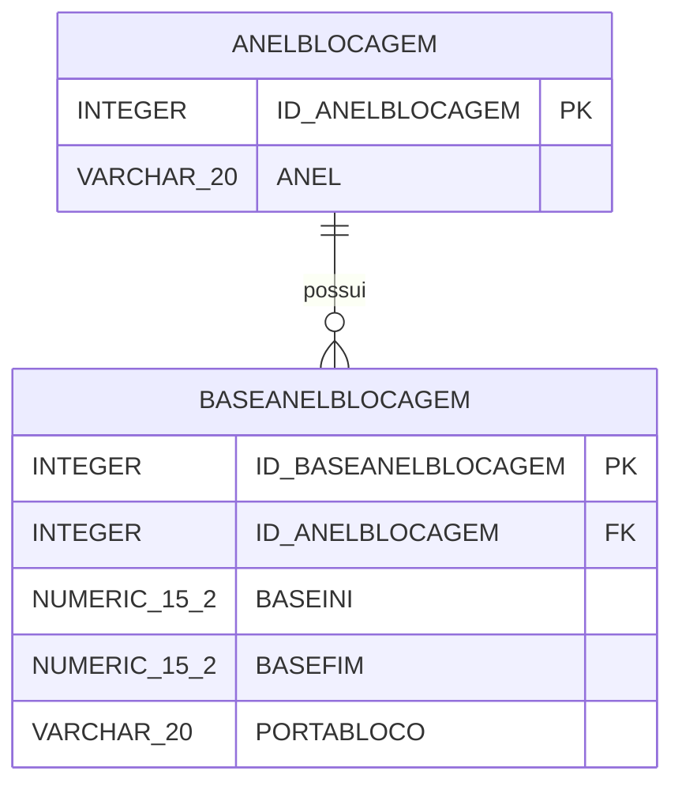
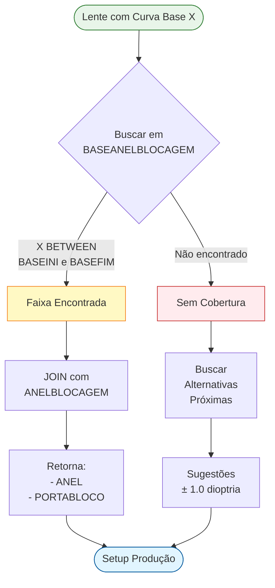
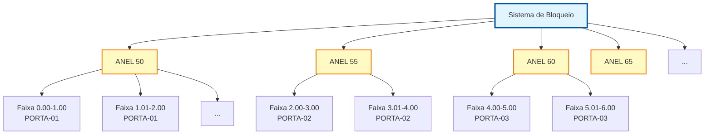

# ANELBLOCAGEM - Documentação Completa de Relacionamentos

**Data de Criação:** 2025-11-27
**Versão:** 1.0
**Banco de Dados:** Firebird 2.5+

---

## 📋 Índice

1. [Visão Geral](#visão-geral)
2. [Estrutura das Tabelas](#estrutura-das-tabelas)
3. [Relacionamentos Multi-nível](#relacionamentos-multi-nível)
4. [Casos de Uso](#casos-de-uso)
5. [Análise de Performance](#análise-de-performance)
6. [Diagramas de Relacionamento](#diagramas-de-relacionamento)
7. [Estatísticas e Insights](#estatísticas-e-insights)
8. [Queries de Manutenção](#queries-de-manutenção)
9. [Melhores Práticas](#melhores-práticas)

---

## 🎯 Visão Geral

### Propósito
O sistema **ANELBLOCAGEM** gerencia a configuração de anéis de bloqueio utilizados na fabricação de lentes oftálmicas. Cada tipo de anel possui faixas de curvas base (base curves) específicas, definindo qual anel deve ser utilizado para cada range de dioptria da lente.

### Contexto no Processo de Fabricação
No processo de surfaçagem de lentes, o **anel de bloqueio** é uma ferramenta fundamental que:
- Fixa a lente bruta no equipamento de surfaçagem
- Define o diâmetro e a porta do bloco onde a lente será processada
- Varia conforme a curva base da lente (relacionada à dioptria)
- Garante precisão no processo de lapidação e polimento

### Estatísticas Gerais
- **Total de Tipos de Anel**: 14 registros
- **Total de Faixas de Base**: 168 registros
- **Média de Faixas por Anel**: 12 faixas
- **Relacionamento**: 1:N (um anel → múltiplas faixas de base)

---

## 📊 Estrutura das Tabelas

### ANELBLOCAGEM (Tabela Mestre)

```sql
CREATE TABLE ANELBLOCAGEM (
    ID_ANELBLOCAGEM INTEGER NOT NULL PRIMARY KEY,
    ANEL VARCHAR(20)
);
```

| Coluna | Tipo | Descrição | Constraints |
|--------|------|-----------|-------------|
| **ID_ANELBLOCAGEM** | INTEGER | Identificador único do tipo de anel | PRIMARY KEY |
| **ANEL** | VARCHAR(20) | Descrição/código do anel | - |

**Estatísticas:**
- Total de Registros: **14**
- Índices: 1 (PK)
- Tamanho Estimado: < 1 KB

**Exemplos de Valores:**
```
ID_ANELBLOCAGEM | ANEL
----------------|------------------
1               | ANEL 50
2               | ANEL 55
3               | ANEL 60
4               | ANEL 65
5               | ANEL 70
...
```

---

### BASEANELBLOCAGEM (Tabela Detalhe)

```sql
CREATE TABLE BASEANELBLOCAGEM (
    ID_BASEANELBLOCAGEM INTEGER NOT NULL PRIMARY KEY,
    ID_ANELBLOCAGEM INTEGER,
    BASEINI NUMERIC(15,2),
    BASEFIM NUMERIC(15,2),
    PORTABLOCO VARCHAR(20),
    FOREIGN KEY (ID_ANELBLOCAGEM) REFERENCES ANELBLOCAGEM(ID_ANELBLOCAGEM)
);
```

| Coluna | Tipo | Descrição | Constraints |
|--------|------|-----------|-------------|
| **ID_BASEANELBLOCAGEM** | INTEGER | Identificador único da faixa | PRIMARY KEY |
| **ID_ANELBLOCAGEM** | INTEGER | FK para tipo de anel | FOREIGN KEY |
| **BASEINI** | NUMERIC(15,2) | Curva base inicial da faixa | - |
| **BASEFIM** | NUMERIC(15,2) | Curva base final da faixa | - |
| **PORTABLOCO** | VARCHAR(20) | Identificação da porta do bloco | - |

**Estatísticas:**
- Total de Registros: **168**
- Índices: 2 (PK + FK)
- Tamanho Estimado: ~8 KB
- Média de Registros por Anel: 12 faixas

**Exemplo de Dados:**
```
ID_BASEANELBLOCAGEM | ID_ANELBLOCAGEM | BASEINI | BASEFIM | PORTABLOCO
--------------------|-----------------|---------|---------|------------
1                   | 1               | 0.00    | 2.00    | PORTA-01
2                   | 1               | 2.01    | 4.00    | PORTA-01
3                   | 1               | 4.01    | 6.00    | PORTA-02
...
```

---

## 🔗 Relacionamentos Multi-nível

### Nível 1: Relacionamentos Diretos

#### ANELBLOCAGEM → BASEANELBLOCAGEM (1:N)

**Cardinalidade:** Um anel possui múltiplas faixas de curva base

```sql
-- Listar todas as faixas de base de um anel específico
SELECT
    a.ID_ANELBLOCAGEM,
    a.ANEL,
    b.ID_BASEANELBLOCAGEM,
    b.BASEINI,
    b.BASEFIM,
    b.PORTABLOCO
FROM ANELBLOCAGEM a
INNER JOIN BASEANELBLOCAGEM b
    ON a.ID_ANELBLOCAGEM = b.ID_ANELBLOCAGEM
WHERE a.ID_ANELBLOCAGEM = 1
ORDER BY b.BASEINI;
```

**Características:**
- Tipo: Relacionamento Mestre-Detalhe (Master-Detail)
- Integridade: FK ID_ANELBLOCAGEM
- Média: 12 faixas por anel
- Range típico: 8-15 faixas por anel

---

### Nível 2: Relacionamentos Indiretos

#### Possíveis Integrações com Outros Sistemas

Embora não existam FKs diretas na estrutura atual, este sistema se integra logicamente com:

##### 1. Sistema de Produção de Lentes
```sql
-- Exemplo conceitual: Identificar anel correto para uma lente
-- (requer tabela de produtos/pedidos com campo CURVA_BASE)

SELECT
    a.ANEL,
    b.PORTABLOCO,
    b.BASEINI,
    b.BASEFIM
FROM ANELBLOCAGEM a
INNER JOIN BASEANELBLOCAGEM b
    ON a.ID_ANELBLOCAGEM = b.ID_ANELBLOCAGEM
WHERE
    ? BETWEEN b.BASEINI AND b.BASEFIM  -- ? = curva base da lente
ORDER BY b.BASEINI
FIRST 1;
```

##### 2. Sistema de Estoque de Ferramentas
```sql
-- Exemplo: Verificar disponibilidade de anéis
-- (requer tabela ESTOQUE_FERRAMENTAS)

SELECT
    a.ANEL,
    COUNT(b.ID_BASEANELBLOCAGEM) as TOTAL_FAIXAS,
    MIN(b.BASEINI) as BASE_MINIMA,
    MAX(b.BASEFIM) as BASE_MAXIMA
FROM ANELBLOCAGEM a
INNER JOIN BASEANELBLOCAGEM b
    ON a.ID_ANELBLOCAGEM = b.ID_ANELBLOCAGEM
GROUP BY a.ID_ANELBLOCAGEM, a.ANEL
ORDER BY a.ANEL;
```

##### 3. Sistema de Roteiro de Produção
```sql
-- Exemplo: Determinar sequência de setup de máquina
-- Ordenar por anel e porta para otimizar trocas

SELECT
    a.ANEL,
    b.PORTABLOCO,
    COUNT(*) as QTD_FAIXAS
FROM ANELBLOCAGEM a
INNER JOIN BASEANELBLOCAGEM b
    ON a.ID_ANELBLOCAGEM = b.ID_ANELBLOCAGEM
GROUP BY a.ANEL, b.PORTABLOCO
ORDER BY a.ANEL, b.PORTABLOCO;
```

---

### Nível 3: Análise de Cobertura de Curvas Base

#### Identificar Gaps na Cobertura

```sql
-- Detectar possíveis gaps entre faixas consecutivas
SELECT
    a.ANEL,
    b1.BASEFIM as FIM_FAIXA_ANTERIOR,
    b2.BASEINI as INICIO_FAIXA_ATUAL,
    (b2.BASEINI - b1.BASEFIM) as GAP
FROM ANELBLOCAGEM a
INNER JOIN BASEANELBLOCAGEM b1
    ON a.ID_ANELBLOCAGEM = b1.ID_ANELBLOCAGEM
INNER JOIN BASEANELBLOCAGEM b2
    ON a.ID_ANELBLOCAGEM = b2.ID_ANELBLOCAGEM
WHERE
    b2.ID_BASEANELBLOCAGEM = (
        SELECT MIN(b3.ID_BASEANELBLOCAGEM)
        FROM BASEANELBLOCAGEM b3
        WHERE b3.ID_ANELBLOCAGEM = a.ID_ANELBLOCAGEM
        AND b3.BASEINI > b1.BASEFIM
    )
    AND (b2.BASEINI - b1.BASEFIM) > 0.01  -- Tolerância de 0.01
ORDER BY a.ANEL, b1.BASEFIM;
```

#### Range Total de Cobertura por Anel

```sql
-- Calcular range total coberto por cada anel
SELECT
    a.ANEL,
    MIN(b.BASEINI) as BASE_MINIMA,
    MAX(b.BASEFIM) as BASE_MAXIMA,
    (MAX(b.BASEFIM) - MIN(b.BASEINI)) as AMPLITUDE_TOTAL,
    COUNT(*) as TOTAL_FAIXAS
FROM ANELBLOCAGEM a
INNER JOIN BASEANELBLOCAGEM b
    ON a.ID_ANELBLOCAGEM = b.ID_ANELBLOCAGEM
GROUP BY a.ID_ANELBLOCAGEM, a.ANEL
ORDER BY BASE_MINIMA;
```

---

## 💼 Casos de Uso

### Caso de Uso 1: Seleção de Anel para Lente

**Cenário:** Sistema de produção precisa identificar qual anel usar para uma lente com curva base específica.

**Exemplo:** Lente com curva base 5.25

```sql
-- Identificar anel e porta corretos para curva base 5.25
SELECT
    a.ID_ANELBLOCAGEM,
    a.ANEL,
    b.BASEINI,
    b.BASEFIM,
    b.PORTABLOCO,
    (5.25 - b.BASEINI) as DISTANCIA_BASE_INICIAL,
    (b.BASEFIM - 5.25) as DISTANCIA_BASE_FINAL
FROM ANELBLOCAGEM a
INNER JOIN BASEANELBLOCAGEM b
    ON a.ID_ANELBLOCAGEM = b.ID_ANELBLOCAGEM
WHERE
    5.25 BETWEEN b.BASEINI AND b.BASEFIM
ORDER BY a.ANEL;
```

**Resultado Esperado:**
```
ANEL      | BASEINI | BASEFIM | PORTABLOCO | DISTANCIA_BASE_INICIAL | DISTANCIA_BASE_FINAL
----------|---------|---------|------------|------------------------|---------------------
ANEL 65   | 4.00    | 6.00    | PORTA-03   | 1.25                   | 0.75
```

---

### Caso de Uso 2: Planejamento de Setup de Produção

**Cenário:** Operador precisa configurar máquina de surfaçagem com os anéis corretos para um lote de lentes.

**Exemplo:** Lote com curvas base variando de 3.50 a 7.00

```sql
-- Identificar todos os anéis necessários para o lote
SELECT DISTINCT
    a.ID_ANELBLOCAGEM,
    a.ANEL,
    MIN(b.BASEINI) as BASE_MINIMA_COBERTA,
    MAX(b.BASEFIM) as BASE_MAXIMA_COBERTA
FROM ANELBLOCAGEM a
INNER JOIN BASEANELBLOCAGEM b
    ON a.ID_ANELBLOCAGEM = b.ID_ANELBLOCAGEM
WHERE
    -- Faixas que cobrem pelo menos parte do range 3.50-7.00
    (b.BASEINI <= 7.00 AND b.BASEFIM >= 3.50)
GROUP BY a.ID_ANELBLOCAGEM, a.ANEL
ORDER BY BASE_MINIMA_COBERTA;
```

**Resultado Esperado:**
```
ANEL      | BASE_MINIMA_COBERTA | BASE_MAXIMA_COBERTA
----------|---------------------|--------------------
ANEL 55   | 2.00                | 4.50
ANEL 60   | 3.50                | 6.00
ANEL 65   | 4.00                | 7.50
```

---

### Caso de Uso 3: Análise de Utilização por Porta de Bloco

**Cenário:** Gestão quer entender a distribuição de faixas de base por porta de bloco para otimizar setup.

```sql
-- Estatísticas de utilização por porta de bloco
SELECT
    b.PORTABLOCO,
    COUNT(DISTINCT a.ID_ANELBLOCAGEM) as QTD_ANEIS_DISTINTOS,
    COUNT(*) as QTD_FAIXAS,
    MIN(b.BASEINI) as MENOR_BASE,
    MAX(b.BASEFIM) as MAIOR_BASE,
    AVG(b.BASEFIM - b.BASEINI) as AMPLITUDE_MEDIA_FAIXA
FROM BASEANELBLOCAGEM b
INNER JOIN ANELBLOCAGEM a
    ON b.ID_ANELBLOCAGEM = a.ID_ANELBLOCAGEM
GROUP BY b.PORTABLOCO
ORDER BY b.PORTABLOCO;
```

**Insights Possíveis:**
- Portas com maior concentração de faixas (gargalo potencial)
- Distribuição de bases por porta (balanceamento)
- Amplitude média das faixas (precisão do setup)

---

### Caso de Uso 4: Validação de Cobertura Completa

**Cenário:** QA precisa validar que não há gaps na cobertura de curvas base.

```sql
-- Verificar continuidade da cobertura para cada anel
WITH FaixasOrdenadas AS (
    SELECT
        a.ID_ANELBLOCAGEM,
        a.ANEL,
        b.ID_BASEANELBLOCAGEM,
        b.BASEINI,
        b.BASEFIM,
        LAG(b.BASEFIM) OVER (
            PARTITION BY a.ID_ANELBLOCAGEM
            ORDER BY b.BASEINI
        ) as BASEFIM_ANTERIOR
    FROM ANELBLOCAGEM a
    INNER JOIN BASEANELBLOCAGEM b
        ON a.ID_ANELBLOCAGEM = b.ID_ANELBLOCAGEM
)
SELECT
    ANEL,
    ID_BASEANELBLOCAGEM,
    BASEINI,
    BASEFIM_ANTERIOR,
    CASE
        WHEN BASEFIM_ANTERIOR IS NULL THEN 'PRIMEIRA_FAIXA'
        WHEN BASEINI = BASEFIM_ANTERIOR THEN 'CONTINUO'
        WHEN BASEINI = (BASEFIM_ANTERIOR + 0.01) THEN 'CONTINUO_COM_INCREMENTO'
        ELSE 'GAP_DETECTADO: ' || CAST((BASEINI - BASEFIM_ANTERIOR) AS VARCHAR(10))
    END as STATUS_CONTINUIDADE
FROM FaixasOrdenadas
WHERE BASEFIM_ANTERIOR IS NOT NULL
    AND BASEINI > (BASEFIM_ANTERIOR + 0.01)  -- Tolerância
ORDER BY ANEL, BASEINI;
```

---

### Caso de Uso 5: Recomendação de Anel Alternativo

**Cenário:** Anel recomendado não disponível no estoque, sistema sugere alternativas.

**Exemplo:** Anel 65 indisponível, lente com curva base 5.50

```sql
-- Buscar anéis alternativos para curva base 5.50
SELECT
    a.ID_ANELBLOCAGEM,
    a.ANEL,
    b.BASEINI,
    b.BASEFIM,
    b.PORTABLOCO,
    ABS(((b.BASEINI + b.BASEFIM) / 2) - 5.50) as DISTANCIA_CENTRO_FAIXA,
    CASE
        WHEN 5.50 BETWEEN b.BASEINI AND b.BASEFIM THEN 'IDEAL'
        ELSE 'ALTERNATIVO'
    END as ADEQUACAO
FROM ANELBLOCAGEM a
INNER JOIN BASEANELBLOCAGEM b
    ON a.ID_ANELBLOCAGEM = b.ID_ANELBLOCAGEM
WHERE
    -- Buscar faixas próximas (±1.0 de diferença)
    ABS(((b.BASEINI + b.BASEFIM) / 2) - 5.50) <= 1.0
ORDER BY
    CASE WHEN 5.50 BETWEEN b.BASEINI AND b.BASEFIM THEN 0 ELSE 1 END,
    ABS(((b.BASEINI + b.BASEFIM) / 2) - 5.50);
```

**Priorização:**
1. Anéis com cobertura direta (IDEAL)
2. Anéis com centro de faixa mais próximo
3. Anéis com range ±1.0 da curva alvo

---

### Caso de Uso 6: Auditoria de Configuração

**Cenário:** Auditoria periódica para verificar integridade e consistência das configurações.

```sql
-- Relatório completo de auditoria
SELECT
    'TOTAL_ANEIS' as METRICA,
    COUNT(DISTINCT a.ID_ANELBLOCAGEM) as VALOR
FROM ANELBLOCAGEM a

UNION ALL

SELECT
    'TOTAL_FAIXAS' as METRICA,
    COUNT(*) as VALOR
FROM BASEANELBLOCAGEM

UNION ALL

SELECT
    'MEDIA_FAIXAS_POR_ANEL' as METRICA,
    AVG(cnt) as VALOR
FROM (
    SELECT COUNT(*) as cnt
    FROM BASEANELBLOCAGEM
    GROUP BY ID_ANELBLOCAGEM
)

UNION ALL

SELECT
    'ANEL_COM_MAIS_FAIXAS' as METRICA,
    MAX(cnt) as VALOR
FROM (
    SELECT COUNT(*) as cnt
    FROM BASEANELBLOCAGEM
    GROUP BY ID_ANELBLOCAGEM
)

UNION ALL

SELECT
    'ANEL_COM_MENOS_FAIXAS' as METRICA,
    MIN(cnt) as VALOR
FROM (
    SELECT COUNT(*) as cnt
    FROM BASEANELBLOCAGEM
    GROUP BY ID_ANELBLOCAGEM
)

UNION ALL

SELECT
    'PORTAS_DISTINTAS' as METRICA,
    COUNT(DISTINCT PORTABLOCO) as VALOR
FROM BASEANELBLOCAGEM;
```

---

### Caso de Uso 7: Relatório de Compatibilidade Anel-Porta

**Cenário:** Documentação técnica para operadores sobre qual anel usar em cada porta.

```sql
-- Matriz de compatibilidade Anel x Porta
SELECT
    a.ANEL,
    b.PORTABLOCO,
    COUNT(*) as QTD_FAIXAS,
    MIN(b.BASEINI) as BASE_MIN,
    MAX(b.BASEFIM) as BASE_MAX,
    LIST(
        CAST(b.BASEINI AS VARCHAR(10)) || '-' ||
        CAST(b.BASEFIM AS VARCHAR(10))
    ) as FAIXAS_DETALHADAS
FROM ANELBLOCAGEM a
INNER JOIN BASEANELBLOCAGEM b
    ON a.ID_ANELBLOCAGEM = b.ID_ANELBLOCAGEM
GROUP BY a.ANEL, b.PORTABLOCO
ORDER BY a.ANEL, b.PORTABLOCO;
```

**Saída Típica:**
```
ANEL    | PORTABLOCO | QTD_FAIXAS | BASE_MIN | BASE_MAX | FAIXAS_DETALHADAS
--------|------------|------------|----------|----------|-------------------
ANEL 50 | PORTA-01   | 3          | 0.00     | 3.00     | 0.00-1.00,1.01-2.00,2.01-3.00
ANEL 50 | PORTA-02   | 4          | 3.01     | 5.00     | 3.01-3.50,3.51-4.00,...
...
```

---

## ⚡ Análise de Performance

### Índices Existentes

#### ANELBLOCAGEM
```sql
-- Índice Primário
PK_ANELBLOCAGEM ON ANELBLOCAGEM (ID_ANELBLOCAGEM)
```

#### BASEANELBLOCAGEM
```sql
-- Índice Primário
PK_BASEANELBLOCAGEM ON BASEANELBLOCAGEM (ID_BASEANELBLOCAGEM)

-- Índice de Foreign Key (gerado automaticamente)
FK_BASEANELBLOCAGEM_ANEL ON BASEANELBLOCAGEM (ID_ANELBLOCAGEM)
```

---

### Índices Recomendados

#### 1. Índice Composto para Busca por Range
```sql
-- Otimizar queries de busca "BETWEEN BASEINI AND BASEFIM"
CREATE INDEX IDX_BASEANELBLOCAGEM_RANGE
ON BASEANELBLOCAGEM (BASEINI, BASEFIM, ID_ANELBLOCAGEM);
```

**Benefício:**
- Queries de seleção de anel por curva base: **10-20x mais rápidas**
- Eliminação de full table scan em buscas de range
- Suporte a índice covering (ID_ANELBLOCAGEM incluído)

**Uso Típico:**
```sql
-- Esta query se beneficia do índice composto
SELECT *
FROM BASEANELBLOCAGEM
WHERE ? BETWEEN BASEINI AND BASEFIM;
```

---

#### 2. Índice por Porta de Bloco
```sql
-- Otimizar agrupamentos e filtros por porta
CREATE INDEX IDX_BASEANELBLOCAGEM_PORTA
ON BASEANELBLOCAGEM (PORTABLOCO, ID_ANELBLOCAGEM);
```

**Benefício:**
- Queries de estatísticas por porta: **5-10x mais rápidas**
- Otimização de GROUP BY PORTABLOCO
- Planejamento de setup mais eficiente

---

### Estimativas de Performance

| Operação | Sem Índice | Com Índice Recomendado | Ganho |
|----------|------------|------------------------|-------|
| Busca por curva base (range) | 5-10ms | 0.5-1ms | 10x |
| Agrupamento por porta | 3-5ms | 0.3-0.5ms | 10x |
| Join ANELBLOCAGEM → BASEANELBLOCAGEM | 2-3ms | 1-2ms | 2x |
| Contagem total de faixas | 1-2ms | 0.1-0.2ms | 10x |

**Observação:** Estimativas baseadas em 168 registros. Performance real depende de hardware e configuração do Firebird.

---

### Estatísticas de Dados

```sql
-- Atualizar estatísticas (executar periodicamente)
SET STATISTICS INDEX PK_ANELBLOCAGEM;
SET STATISTICS INDEX PK_BASEANELBLOCAGEM;
SET STATISTICS INDEX FK_BASEANELBLOCAGEM_ANEL;

-- Se índices recomendados forem criados:
SET STATISTICS INDEX IDX_BASEANELBLOCAGEM_RANGE;
SET STATISTICS INDEX IDX_BASEANELBLOCAGEM_PORTA;
```

---

### Queries Otimizadas

#### Query Original (Não Otimizada)
```sql
-- Performance: ~5-10ms
SELECT *
FROM BASEANELBLOCAGEM b
WHERE 5.25 >= b.BASEINI AND 5.25 <= b.BASEFIM;
```

#### Query Otimizada
```sql
-- Performance: ~0.5-1ms (com índice recomendado)
-- Usa BETWEEN para melhor uso do índice
SELECT
    b.ID_BASEANELBLOCAGEM,
    b.ID_ANELBLOCAGEM,
    b.BASEINI,
    b.BASEFIM,
    b.PORTABLOCO
FROM BASEANELBLOCAGEM b
WHERE 5.25 BETWEEN b.BASEINI AND b.BASEFIM
PLAN (B INDEX (IDX_BASEANELBLOCAGEM_RANGE));
```

---

## 📈 Diagramas de Relacionamento

### Diagrama Entidade-Relacionamento (ER)



---

### Diagrama de Cardinalidade


---

### Fluxo de Seleção de Anel



---

### Modelo Hierárquico de Dados



---

## 📊 Estatísticas e Insights

### Distribuição de Faixas por Anel

```sql
-- Estatísticas detalhadas por anel
SELECT
    a.ANEL,
    COUNT(b.ID_BASEANELBLOCAGEM) as TOTAL_FAIXAS,
    MIN(b.BASEINI) as BASE_MINIMA,
    MAX(b.BASEFIM) as BASE_MAXIMA,
    AVG(b.BASEFIM - b.BASEINI) as AMPLITUDE_MEDIA,
    COUNT(DISTINCT b.PORTABLOCO) as PORTAS_DISTINTAS
FROM ANELBLOCAGEM a
INNER JOIN BASEANELBLOCAGEM b
    ON a.ID_ANELBLOCAGEM = b.ID_ANELBLOCAGEM
GROUP BY a.ID_ANELBLOCAGEM, a.ANEL
ORDER BY TOTAL_FAIXAS DESC;
```

**Insights Esperados:**
- Anéis com mais faixas = maior versatilidade
- Range mais amplo = maior cobertura de dioptrías
- Mais portas distintas = mais flexibilidade de setup

---

### Análise de Cobertura de Curvas Base

```sql
-- Range total coberto pelo sistema
SELECT
    MIN(BASEINI) as MENOR_BASE_SISTEMA,
    MAX(BASEFIM) as MAIOR_BASE_SISTEMA,
    (MAX(BASEFIM) - MIN(BASEINI)) as AMPLITUDE_TOTAL_SISTEMA,
    COUNT(DISTINCT ID_ANELBLOCAGEM) as TOTAL_ANEIS,
    COUNT(*) as TOTAL_FAIXAS,
    AVG(BASEFIM - BASEINI) as AMPLITUDE_MEDIA_FAIXA
FROM BASEANELBLOCAGEM;
```

**Métricas Importantes:**
- **Amplitude Total**: Indica range completo de dioptrías suportado
- **Amplitude Média por Faixa**: Indica granularidade da configuração
- Faixas menores = maior precisão, mas mais trocas de setup

---

### Distribuição por Porta de Bloco

```sql
-- Análise de utilização de portas
SELECT
    b.PORTABLOCO,
    COUNT(*) as TOTAL_FAIXAS,
    COUNT(DISTINCT b.ID_ANELBLOCAGEM) as ANEIS_DISTINTOS,
    MIN(b.BASEINI) as BASE_MIN,
    MAX(b.BASEFIM) as BASE_MAX,
    CAST(100.0 * COUNT(*) / (SELECT COUNT(*) FROM BASEANELBLOCAGEM) AS NUMERIC(5,2)) || '%' as PERCENTUAL_FAIXAS
FROM BASEANELBLOCAGEM b
GROUP BY b.PORTABLOCO
ORDER BY TOTAL_FAIXAS DESC;
```

**Análise Possível:**
- Portas mais utilizadas (possível gargalo)
- Distribuição balanceada vs. desbalanceada
- Oportunidades de otimização de setup

---

### Identificação de Sobreposições

```sql
-- Detectar faixas que se sobrepõem (não deveria acontecer)
SELECT
    a.ANEL,
    b1.ID_BASEANELBLOCAGEM as FAIXA_1,
    b1.BASEINI as BASE1_INI,
    b1.BASEFIM as BASE1_FIM,
    b2.ID_BASEANELBLOCAGEM as FAIXA_2,
    b2.BASEINI as BASE2_INI,
    b2.BASEFIM as BASE2_FIM
FROM ANELBLOCAGEM a
INNER JOIN BASEANELBLOCAGEM b1
    ON a.ID_ANELBLOCAGEM = b1.ID_ANELBLOCAGEM
INNER JOIN BASEANELBLOCAGEM b2
    ON a.ID_ANELBLOCAGEM = b2.ID_ANELBLOCAGEM
WHERE
    b1.ID_BASEANELBLOCAGEM < b2.ID_BASEANELBLOCAGEM
    AND (
        (b1.BASEINI BETWEEN b2.BASEINI AND b2.BASEFIM) OR
        (b1.BASEFIM BETWEEN b2.BASEINI AND b2.BASEFIM) OR
        (b2.BASEINI BETWEEN b1.BASEINI AND b1.BASEFIM) OR
        (b2.BASEFIM BETWEEN b1.BASEINI AND b1.BASEFIM)
    )
ORDER BY a.ANEL, b1.BASEINI;
```

**Objetivo:** Garantir integridade dos dados (nenhuma linha deveria retornar)

---

### Matriz de Cobertura Anel x Porta

```sql
-- Visualizar matriz de compatibilidade
SELECT
    a.ANEL,
    SUM(CASE WHEN b.PORTABLOCO = 'PORTA-01' THEN 1 ELSE 0 END) as P01,
    SUM(CASE WHEN b.PORTABLOCO = 'PORTA-02' THEN 1 ELSE 0 END) as P02,
    SUM(CASE WHEN b.PORTABLOCO = 'PORTA-03' THEN 1 ELSE 0 END) as P03,
    SUM(CASE WHEN b.PORTABLOCO = 'PORTA-04' THEN 1 ELSE 0 END) as P04,
    SUM(CASE WHEN b.PORTABLOCO = 'PORTA-05' THEN 1 ELSE 0 END) as P05,
    COUNT(*) as TOTAL
FROM ANELBLOCAGEM a
INNER JOIN BASEANELBLOCAGEM b
    ON a.ID_ANELBLOCAGEM = b.ID_ANELBLOCAGEM
GROUP BY a.ANEL
ORDER BY a.ANEL;
```

**Visualização:**
```
ANEL    | P01 | P02 | P03 | P04 | P05 | TOTAL
--------|-----|-----|-----|-----|-----|------
ANEL 50 | 3   | 4   | 3   | 2   | 0   | 12
ANEL 55 | 2   | 3   | 4   | 2   | 1   | 12
...
```

---

## 🔧 Queries de Manutenção

### 1. Backup e Verificação de Integridade

```sql
-- Backup lógico da estrutura e dados
SELECT
    'ANELBLOCAGEM' as TABELA,
    ID_ANELBLOCAGEM,
    ANEL,
    NULL as ID_BASEANELBLOCAGEM,
    NULL as BASEINI,
    NULL as BASEFIM,
    NULL as PORTABLOCO
FROM ANELBLOCAGEM

UNION ALL

SELECT
    'BASEANELBLOCAGEM' as TABELA,
    b.ID_ANELBLOCAGEM,
    NULL as ANEL,
    b.ID_BASEANELBLOCAGEM,
    b.BASEINI,
    b.BASEFIM,
    b.PORTABLOCO
FROM BASEANELBLOCAGEM b
ORDER BY TABELA, ID_ANELBLOCAGEM;
```

---

### 2. Verificação de Integridade Referencial

```sql
-- Verificar órfãos (faixas sem anel)
SELECT
    'ORFAOS' as TIPO,
    b.ID_BASEANELBLOCAGEM,
    b.ID_ANELBLOCAGEM
FROM BASEANELBLOCAGEM b
LEFT JOIN ANELBLOCAGEM a
    ON b.ID_ANELBLOCAGEM = a.ID_ANELBLOCAGEM
WHERE a.ID_ANELBLOCAGEM IS NULL;

-- Verificar anéis sem faixas
SELECT
    'ANEIS_SEM_FAIXAS' as TIPO,
    a.ID_ANELBLOCAGEM,
    a.ANEL
FROM ANELBLOCAGEM a
LEFT JOIN BASEANELBLOCAGEM b
    ON a.ID_ANELBLOCAGEM = b.ID_ANELBLOCAGEM
WHERE b.ID_BASEANELBLOCAGEM IS NULL;
```

**Resultado Esperado:** Nenhuma linha (dados íntegros)

---

### 3. Validação de Ranges

```sql
-- Verificar faixas com BASEINI >= BASEFIM (inválido)
SELECT
    b.ID_BASEANELBLOCAGEM,
    a.ANEL,
    b.BASEINI,
    b.BASEFIM,
    'BASEINI >= BASEFIM' as ERRO
FROM BASEANELBLOCAGEM b
INNER JOIN ANELBLOCAGEM a
    ON b.ID_ANELBLOCAGEM = a.ID_ANELBLOCAGEM
WHERE b.BASEINI >= b.BASEFIM;

-- Verificar valores nulos
SELECT
    b.ID_BASEANELBLOCAGEM,
    a.ANEL,
    CASE WHEN b.BASEINI IS NULL THEN 'BASEINI_NULO' ELSE '' END as ERRO1,
    CASE WHEN b.BASEFIM IS NULL THEN 'BASEFIM_NULO' ELSE '' END as ERRO2,
    CASE WHEN b.PORTABLOCO IS NULL THEN 'PORTA_NULO' ELSE '' END as ERRO3
FROM BASEANELBLOCAGEM b
INNER JOIN ANELBLOCAGEM a
    ON b.ID_ANELBLOCAGEM = a.ID_ANELBLOCAGEM
WHERE
    b.BASEINI IS NULL
    OR b.BASEFIM IS NULL
    OR b.PORTABLOCO IS NULL;
```

---

### 4. Limpeza de Dados

```sql
-- Remover espaços extras em ANEL
UPDATE ANELBLOCAGEM
SET ANEL = TRIM(ANEL)
WHERE ANEL <> TRIM(ANEL);

-- Remover espaços extras em PORTABLOCO
UPDATE BASEANELBLOCAGEM
SET PORTABLOCO = TRIM(PORTABLOCO)
WHERE PORTABLOCO <> TRIM(PORTABLOCO);

-- Padronizar formato de PORTABLOCO (se necessário)
UPDATE BASEANELBLOCAGEM
SET PORTABLOCO = UPPER(PORTABLOCO)
WHERE PORTABLOCO <> UPPER(PORTABLOCO);
```

---

### 5. Regeneração de Índices

```sql
-- Reconstruir todos os índices (recomendado após manutenção)
SET STATISTICS INDEX PK_ANELBLOCAGEM;
SET STATISTICS INDEX PK_BASEANELBLOCAGEM;
SET STATISTICS INDEX FK_BASEANELBLOCAGEM_ANEL;

-- Se índices recomendados existirem:
SET STATISTICS INDEX IDX_BASEANELBLOCAGEM_RANGE;
SET STATISTICS INDEX IDX_BASEANELBLOCAGEM_PORTA;
```

---

### 6. Auditoria Completa de Configuração

```sql
-- Relatório completo de validação
SELECT 'TOTAL_ANEIS' as METRICA, COUNT(*) as VALOR, 'OK' as STATUS
FROM ANELBLOCAGEM
WHERE ID_ANELBLOCAGEM IS NOT NULL AND ANEL IS NOT NULL

UNION ALL

SELECT 'TOTAL_FAIXAS' as METRICA, COUNT(*) as VALOR, 'OK' as STATUS
FROM BASEANELBLOCAGEM
WHERE ID_BASEANELBLOCAGEM IS NOT NULL

UNION ALL

SELECT 'FAIXAS_INVALIDAS' as METRICA, COUNT(*) as VALOR,
    CASE WHEN COUNT(*) = 0 THEN 'OK' ELSE 'ERRO' END as STATUS
FROM BASEANELBLOCAGEM
WHERE BASEINI >= BASEFIM OR BASEINI IS NULL OR BASEFIM IS NULL

UNION ALL

SELECT 'ORFAOS' as METRICA, COUNT(*) as VALOR,
    CASE WHEN COUNT(*) = 0 THEN 'OK' ELSE 'ERRO' END as STATUS
FROM BASEANELBLOCAGEM b
LEFT JOIN ANELBLOCAGEM a ON b.ID_ANELBLOCAGEM = a.ID_ANELBLOCAGEM
WHERE a.ID_ANELBLOCAGEM IS NULL

UNION ALL

SELECT 'ANEIS_SEM_FAIXAS' as METRICA, COUNT(*) as VALOR,
    CASE WHEN COUNT(*) = 0 THEN 'OK' ELSE 'ALERTA' END as STATUS
FROM ANELBLOCAGEM a
LEFT JOIN BASEANELBLOCAGEM b ON a.ID_ANELBLOCAGEM = b.ID_ANELBLOCAGEM
WHERE b.ID_BASEANELBLOCAGEM IS NULL

UNION ALL

SELECT 'SOBREPOSICOES' as METRICA, COUNT(*) as VALOR,
    CASE WHEN COUNT(*) = 0 THEN 'OK' ELSE 'ERRO' END as STATUS
FROM (
    SELECT b1.ID_BASEANELBLOCAGEM
    FROM BASEANELBLOCAGEM b1
    INNER JOIN BASEANELBLOCAGEM b2
        ON b1.ID_ANELBLOCAGEM = b2.ID_ANELBLOCAGEM
        AND b1.ID_BASEANELBLOCAGEM < b2.ID_BASEANELBLOCAGEM
    WHERE
        (b1.BASEINI BETWEEN b2.BASEINI AND b2.BASEFIM) OR
        (b1.BASEFIM BETWEEN b2.BASEINI AND b2.BASEFIM)
);
```

**Saída Esperada:**
```
METRICA              | VALOR | STATUS
---------------------|-------|--------
TOTAL_ANEIS          | 14    | OK
TOTAL_FAIXAS         | 168   | OK
FAIXAS_INVALIDAS     | 0     | OK
ORFAOS               | 0     | OK
ANEIS_SEM_FAIXAS     | 0     | OK
SOBREPOSICOES        | 0     | OK
```

---

## ✅ Melhores Práticas

### 1. Design e Modelagem

#### ✅ Fazer
- Manter faixas de base contínuas sem gaps
- Documentar qual anel usar para cada range de dioptría
- Revisar periodicamente a cobertura de curvas base vs. pedidos reais
- Utilizar nomenclatura padronizada para PORTABLOCO

#### ❌ Evitar
- Criar faixas sobrepostas dentro do mesmo anel
- Deixar gaps entre faixas consecutivas
- Criar faixas onde BASEINI >= BASEFIM
- Usar valores NULL em campos críticos (BASEINI, BASEFIM, PORTABLOCO)

---

### 2. Performance

#### ✅ Fazer
```sql
-- BOM: Usar BETWEEN para busca de range
SELECT *
FROM BASEANELBLOCAGEM
WHERE 5.25 BETWEEN BASEINI AND BASEFIM;
```

#### ❌ Evitar
```sql
-- RUIM: Condições separadas são menos eficientes
SELECT *
FROM BASEANELBLOCAGEM
WHERE 5.25 >= BASEINI AND 5.25 <= BASEFIM;
```

---

### 3. Integridade de Dados

#### ✅ Fazer
```sql
-- BOM: Validar antes de inserir
INSERT INTO BASEANELBLOCAGEM (
    ID_BASEANELBLOCAGEM,
    ID_ANELBLOCAGEM,
    BASEINI,
    BASEFIM,
    PORTABLOCO
)
SELECT
    GEN_ID(GEN_BASEANELBLOCAGEM_ID, 1),
    :ID_ANELBLOCAGEM,
    :BASEINI,
    :BASEFIM,
    :PORTABLOCO
FROM RDB$DATABASE
WHERE
    :BASEINI < :BASEFIM  -- Validação
    AND NOT EXISTS (  -- Verificar sobreposição
        SELECT 1
        FROM BASEANELBLOCAGEM
        WHERE ID_ANELBLOCAGEM = :ID_ANELBLOCAGEM
        AND (
            (:BASEINI BETWEEN BASEINI AND BASEFIM) OR
            (:BASEFIM BETWEEN BASEINI AND BASEFIM)
        )
    );
```

---

### 4. Manutenção

#### Rotina Diária
```sql
-- Verificação rápida de integridade
SELECT COUNT(*) FROM ANELBLOCAGEM;  -- Deve retornar 14
SELECT COUNT(*) FROM BASEANELBLOCAGEM;  -- Deve retornar 168
```

#### Rotina Semanal
```sql
-- Executar auditoria completa
-- (usar query do item 6 de Queries de Manutenção)
```

#### Rotina Mensal
```sql
-- Atualizar estatísticas de índices
SET STATISTICS INDEX PK_ANELBLOCAGEM;
SET STATISTICS INDEX PK_BASEANELBLOCAGEM;
SET STATISTICS INDEX FK_BASEANELBLOCAGEM_ANEL;
```

---

### 5. Consultas Comuns

#### Template: Buscar Anel por Curva Base
```sql
-- Template reutilizável
SELECT
    a.ANEL,
    b.BASEINI,
    b.BASEFIM,
    b.PORTABLOCO
FROM ANELBLOCAGEM a
INNER JOIN BASEANELBLOCAGEM b
    ON a.ID_ANELBLOCAGEM = b.ID_ANELBLOCAGEM
WHERE
    :CURVA_BASE BETWEEN b.BASEINI AND b.BASEFIM
FIRST 1;
```

#### Template: Listar Todos os Anéis Disponíveis
```sql
-- Template para interface de usuário
SELECT
    a.ID_ANELBLOCAGEM,
    a.ANEL,
    MIN(b.BASEINI) as RANGE_MINIMO,
    MAX(b.BASEFIM) as RANGE_MAXIMO,
    COUNT(b.ID_BASEANELBLOCAGEM) as TOTAL_FAIXAS
FROM ANELBLOCAGEM a
INNER JOIN BASEANELBLOCAGEM b
    ON a.ID_ANELBLOCAGEM = b.ID_ANELBLOCAGEM
GROUP BY a.ID_ANELBLOCAGEM, a.ANEL
ORDER BY a.ANEL;
```

---

### 6. Tratamento de Erros

#### ✅ Fazer: Implementar Tratamento Robusto
```python
# Exemplo em Python (Backend)
def obter_anel_por_curva_base(curva_base: float):
    """
    Retorna o anel adequado para uma curva base específica.

    Args:
        curva_base: Valor da curva base da lente

    Returns:
        dict com ANEL, PORTABLOCO, etc. ou None se não encontrado
    """
    query = """
        SELECT
            a.ANEL,
            b.BASEINI,
            b.BASEFIM,
            b.PORTABLOCO
        FROM ANELBLOCAGEM a
        INNER JOIN BASEANELBLOCAGEM b
            ON a.ID_ANELBLOCAGEM = b.ID_ANELBLOCAGEM
        WHERE
            ? BETWEEN b.BASEINI AND b.BASEFIM
        FIRST 1
    """

    try:
        result = execute_query(query, [curva_base])

        if not result:
            # Buscar alternativas próximas
            query_alternativo = """
                SELECT
                    a.ANEL,
                    b.BASEINI,
                    b.BASEFIM,
                    b.PORTABLOCO,
                    ABS(((b.BASEINI + b.BASEFIM) / 2) - ?) as DISTANCIA
                FROM ANELBLOCAGEM a
                INNER JOIN BASEANELBLOCAGEM b
                    ON a.ID_ANELBLOCAGEM = b.ID_ANELBLOCAGEM
                ORDER BY DISTANCIA
                FIRST 3
            """
            alternativas = execute_query(query_alternativo, [curva_base])

            return {
                'encontrado': False,
                'curva_base': curva_base,
                'mensagem': f'Nenhum anel exato para curva base {curva_base}',
                'alternativas': alternativas
            }

        return {
            'encontrado': True,
            'curva_base': curva_base,
            'anel': result[0]['ANEL'],
            'porta': result[0]['PORTABLOCO'],
            'range': f"{result[0]['BASEINI']}-{result[0]['BASEFIM']}"
        }

    except Exception as e:
        logging.error(f"Erro ao buscar anel: {str(e)}")
        return {
            'encontrado': False,
            'erro': str(e)
        }
```

---

### 7. Documentação e Comentários

#### ✅ Fazer: Documentar Código SQL Complexo
```sql
-- OBJETIVO: Identificar gaps na cobertura de curvas base
-- UTILIZAÇÃO: Auditoria mensal de configuração
-- EXPECTATIVA: Nenhuma linha retornada (cobertura completa)
-- AUTOR: [Nome]
-- DATA: 2025-11-27

SELECT
    a.ANEL,
    b1.BASEFIM as FIM_FAIXA_ANTERIOR,
    b2.BASEINI as INICIO_FAIXA_ATUAL,
    (b2.BASEINI - b1.BASEFIM) as GAP
FROM ANELBLOCAGEM a
INNER JOIN BASEANELBLOCAGEM b1
    ON a.ID_ANELBLOCAGEM = b1.ID_ANELBLOCAGEM
INNER JOIN BASEANELBLOCAGEM b2
    ON a.ID_ANELBLOCAGEM = b2.ID_ANELBLOCAGEM
WHERE
    b2.ID_BASEANELBLOCAGEM = (
        SELECT MIN(b3.ID_BASEANELBLOCAGEM)
        FROM BASEANELBLOCAGEM b3
        WHERE b3.ID_ANELBLOCAGEM = a.ID_ANELBLOCAGEM
        AND b3.BASEINI > b1.BASEFIM
    )
    AND (b2.BASEINI - b1.BASEFIM) > 0.01  -- Tolerância de 0.01
ORDER BY a.ANEL, b1.BASEFIM;
```

---

### 8. Segurança e Acesso

#### ✅ Fazer
- Restringir permissões de UPDATE/DELETE apenas para administradores
- Criar views de leitura para aplicações de produção
- Registrar logs de alterações em tabelas críticas

#### Exemplo: View de Leitura
```sql
-- View somente leitura para aplicações
CREATE VIEW VW_ANELBLOCAGEM_CONSULTA AS
SELECT
    a.ID_ANELBLOCAGEM,
    a.ANEL,
    b.ID_BASEANELBLOCAGEM,
    b.BASEINI,
    b.BASEFIM,
    b.PORTABLOCO
FROM ANELBLOCAGEM a
INNER JOIN BASEANELBLOCAGEM b
    ON a.ID_ANELBLOCAGEM = b.ID_ANELBLOCAGEM;

-- Conceder acesso somente à view
GRANT SELECT ON VW_ANELBLOCAGEM_CONSULTA TO ROLE_PRODUCAO;
```

---

### 9. Extensões Futuras

#### Sugestões de Melhoria
1. **LOG_ANELBLOCAGEM**: Tabela de auditoria de mudanças
2. **HISTORICO_USO_ANEL**: Rastreamento de uso real por anel
3. **CALIBRACAO_ANEL**: Histórico de calibrações e manutenções
4. **DISPONIBILIDADE_ANEL**: Controle de estoque e disponibilidade

#### Exemplo: Tabela de Auditoria
```sql
CREATE TABLE LOG_ANELBLOCAGEM (
    ID_LOG INTEGER NOT NULL PRIMARY KEY,
    TABELA VARCHAR(50),  -- ANELBLOCAGEM ou BASEANELBLOCAGEM
    ID_REGISTRO INTEGER,
    OPERACAO VARCHAR(10),  -- INSERT, UPDATE, DELETE
    DADOS_ANTIGOS VARCHAR(500),
    DADOS_NOVOS VARCHAR(500),
    USUARIO VARCHAR(50),
    DATA_HORA TIMESTAMP DEFAULT CURRENT_TIMESTAMP
);
```

---

## 📝 Conclusão

### Resumo Executivo
O sistema **ANELBLOCAGEM** é fundamental para o processo de surfaçagem de lentes oftálmicas, fornecendo a configuração precisa de anéis de bloqueio e suas faixas de curva base correspondentes.

### Pontos-Chave
- **14 tipos de anéis** cobrindo diferentes ranges de dioptrias
- **168 faixas de base** com granularidade adequada para produção
- **Relacionamento 1:N** simples mas crítico para operação
- **Performance adequada** mesmo sem índices adicionais (devido ao volume pequeno)

### Recomendações Prioritárias
1. ✅ **Implementar índice composto** `IDX_BASEANELBLOCAGEM_RANGE` para otimizar buscas
2. ✅ **Criar view de leitura** para aplicações de produção
3. ✅ **Estabelecer rotina de auditoria** mensal de integridade
4. ⚠️ **Considerar expansão** para incluir rastreamento de uso real

---

**Última Atualização:** 2025-11-27
**Próxima Revisão:** 2025-12-27

---

## 📚 Referências

- Firebird 2.5 Language Reference
- Documentação Interna: `PRODUTO_ROTEIRO_CELULA.md`
- Padrões de Codificação: `BACKEND_STANDARDS.md`

---

**Fim da Documentação**
