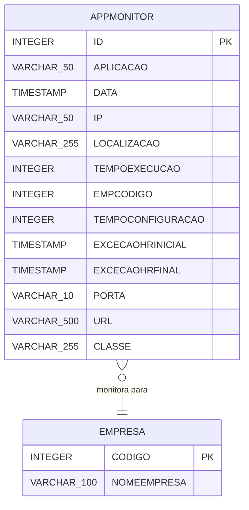
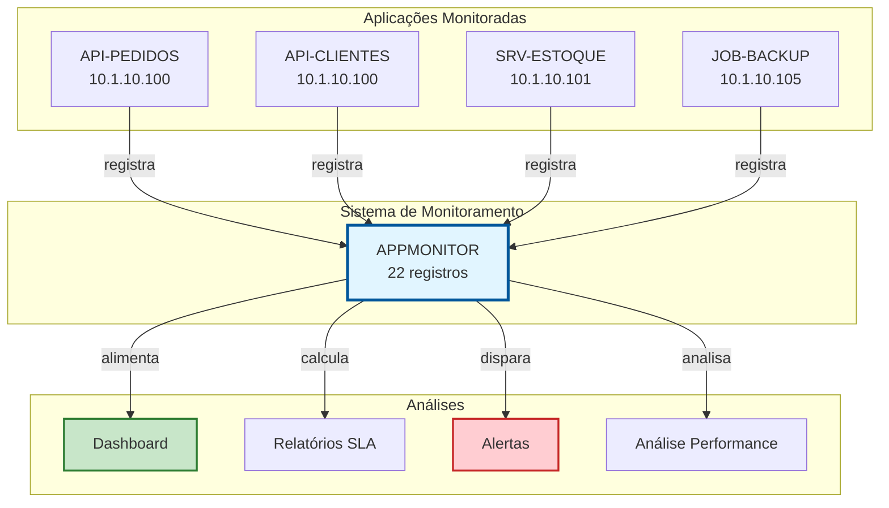
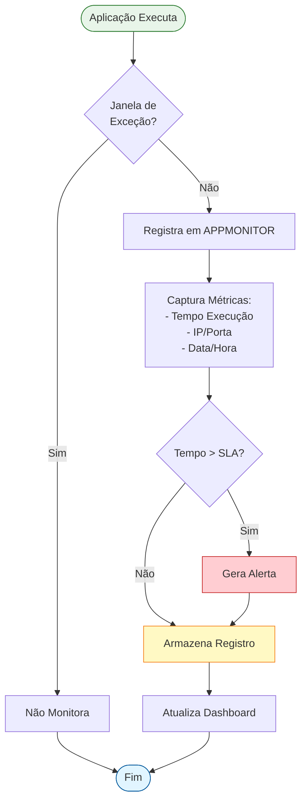
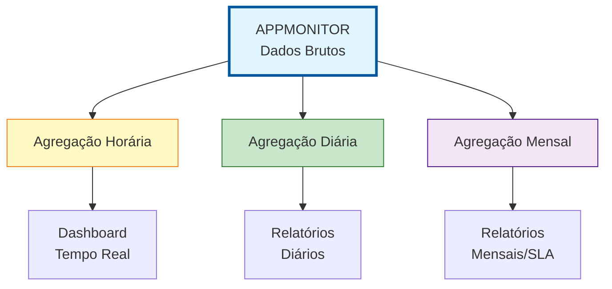

# APPMONITOR - Documentação Completa de Relacionamentos

**Data de Criação:** 2025-11-27
**Versão:** 1.0
**Banco de Dados:** Firebird 2.5+

---

## 📋 Índice

1. [Visão Geral](#visão-geral)
2. [Estrutura da Tabela](#estrutura-da-tabela)
3. [Relacionamentos Multi-nível](#relacionamentos-multi-nível)
4. [Casos de Uso](#casos-de-uso)
5. [Análise de Performance](#análise-de-performance)
6. [Diagramas de Relacionamento](#diagramas-de-relacionamento)
7. [Estatísticas e Insights](#estatísticas-e-insights)
8. [Queries de Manutenção](#queries-de-manutenção)
9. [Melhores Práticas](#melhores-práticas)

---

## 🎯 Visão Geral

### Propósito
A tabela **APPMONITOR** é um sistema de **monitoramento de aplicações e serviços**, registrando informações sobre execuções, performance, configurações e disponibilidade de endpoints/serviços do sistema.

### Contexto no Sistema
Esta tabela atua como um **health check e auditoria de serviços**, permitindo:
- Monitorar disponibilidade de aplicações
- Rastrear tempos de execução e performance
- Registrar configurações de serviços por empresa
- Definir janelas de exceção (horários de manutenção)
- Auditar acessos e execuções de serviços

### Estatísticas Gerais
- **Total de Registros**: 22 configurações de monitoramento
- **Total de Colunas**: 13 campos
- **Chaves Primárias**: 1 (ID)
- **Chaves Estrangeiras**: 0 (FK lógica via EMPCODIGO)
- **Índices**: 0 (recomendação de criação)
- **Tabelas Relacionadas**: Nenhuma FK explícita, mas relacionamento lógico com EMPRESA

---

## 📊 Estrutura da Tabela

### APPMONITOR

```sql
CREATE TABLE APPMONITOR (
    ID INTEGER NOT NULL PRIMARY KEY,
    APLICACAO VARCHAR(50) NOT NULL,
    DATA TIMESTAMP NOT NULL,
    IP VARCHAR(50) NOT NULL,
    LOCALIZACAO VARCHAR(255) NOT NULL,
    TEMPOEXECUCAO INTEGER NOT NULL,
    EMPCODIGO INTEGER NOT NULL,
    TEMPOCONFIGURACAO INTEGER,
    EXCECAOHRINICIAL TIMESTAMP,
    EXCECAOHRFINAL TIMESTAMP,
    PORTA VARCHAR(10),
    URL VARCHAR(500),
    CLASSE VARCHAR(255)
);
```

| Coluna | Tipo | Obrigatório | Descrição | Propósito |
|--------|------|-------------|-----------|-----------|
| **ID** | INTEGER | ✓ | Identificador único do registro | PRIMARY KEY |
| **APLICACAO** | VARCHAR(50) | ✓ | Nome/identificador da aplicação monitorada | Identificação do serviço |
| **DATA** | TIMESTAMP | ✓ | Data/hora da última execução ou verificação | Rastreamento temporal |
| **IP** | VARCHAR(50) | ✓ | Endereço IP do servidor/serviço | Localização de rede |
| **LOCALIZACAO** | VARCHAR(255) | ✓ | Path/endpoint da aplicação | URL path ou localização física |
| **TEMPOEXECUCAO** | INTEGER | ✓ | Tempo de execução em milissegundos | Métrica de performance |
| **EMPCODIGO** | INTEGER | ✓ | Código da empresa (FK lógica) | Multi-tenancy |
| **TEMPOCONFIGURACAO** | INTEGER | | Tempo de configuração em milissegundos | Métrica auxiliar |
| **EXCECAOHRINICIAL** | TIMESTAMP | | Início da janela de exceção (manutenção) | Controle de disponibilidade |
| **EXCECAOHRFINAL** | TIMESTAMP | | Fim da janela de exceção | Controle de disponibilidade |
| **PORTA** | VARCHAR(10) | | Porta TCP/IP do serviço | Configuração de rede |
| **URL** | VARCHAR(500) | | URL completa do serviço | Endpoint completo |
| **CLASSE** | VARCHAR(255) | | Classe Java/C# do serviço | Rastreamento técnico |

---

### Tipos de Dados e Constraints

**Campos Obrigatórios (NOT NULL):**
- ID, APLICACAO, DATA, IP, LOCALIZACAO, TEMPOEXECUCAO, EMPCODIGO

**Campos Opcionais:**
- TEMPOCONFIGURACAO, EXCECAOHRINICIAL, EXCECAOHRFINAL, PORTA, URL, CLASSE

**Constraints Implícitas:**
- ID único (PRIMARY KEY)
- EMPCODIGO deve existir em EMPRESA (integridade lógica)
- EXCECAOHRFINAL deve ser >= EXCECAOHRINICIAL

---

### Exemplo de Dados

```
ID | APLICACAO      | DATA                | IP            | LOCALIZACAO         | TEMPOEXECUCAO | EMPCODIGO
---|----------------|---------------------|---------------|---------------------|---------------|----------
1  | API-PEDIDOS    | 2025-11-27 10:30:00 | 10.1.10.100   | /api/v1/pedidos     | 250           | 1
2  | SRV-ESTOQUE    | 2025-11-27 10:31:00 | 10.1.10.101   | /services/estoque   | 180           | 1
3  | API-CLIENTES   | 2025-11-27 10:32:00 | 10.1.10.100   | /api/v1/clientes    | 320           | 2
4  | JOB-BACKUP     | 2025-11-27 03:00:00 | 10.1.10.105   | /jobs/backup        | 45000         | 1
...
```

**Características dos Dados:**
- Aplicações diversas: APIs REST, serviços internos, jobs agendados
- IPs diferentes indicam servidores distribuídos
- Tempos de execução variam: APIs rápidas (< 500ms), Jobs longos (> 10s)
- Multi-empresa via EMPCODIGO

---

## 🔗 Relacionamentos Multi-nível

### Nível 1: Relacionamentos Lógicos

#### APPMONITOR → EMPRESA (N:1) - Relacionamento Implícito

**Cardinalidade:** Múltiplos registros de monitoramento para uma empresa

**Observação:** Não há FK explícita, mas EMPCODIGO estabelece relacionamento lógico.

```sql
-- Listar aplicações monitoradas por empresa
SELECT
    am.ID,
    am.APLICACAO,
    am.EMPCODIGO,
    -- e.NOMEEMPRESA,  -- Se tabela EMPRESA existir
    am.DATA,
    am.TEMPOEXECUCAO,
    am.LOCALIZACAO
FROM APPMONITOR am
-- LEFT JOIN EMPRESA e ON am.EMPCODIGO = e.CODIGO
WHERE am.EMPCODIGO = 1
ORDER BY am.DATA DESC;
```

**Características:**
- Permite monitoramento multi-tenant (multi-empresa)
- Cada empresa pode ter configurações específicas de monitoramento
- Isolamento de dados por empresa

---

### Nível 2: Agrupamentos e Análises

#### 2.1. Agrupamento por Aplicação

```sql
-- Estatísticas por aplicação
SELECT
    am.APLICACAO,
    COUNT(*) as TOTAL_REGISTROS,
    COUNT(DISTINCT am.EMPCODIGO) as EMPRESAS_DISTINTAS,
    MIN(am.DATA) as PRIMEIRA_EXECUCAO,
    MAX(am.DATA) as ULTIMA_EXECUCAO,
    AVG(am.TEMPOEXECUCAO) as TEMPO_MEDIO_MS,
    MIN(am.TEMPOEXECUCAO) as TEMPO_MINIMO_MS,
    MAX(am.TEMPOEXECUCAO) as TEMPO_MAXIMO_MS
FROM APPMONITOR am
GROUP BY am.APLICACAO
ORDER BY TEMPO_MEDIO_MS DESC;
```

---

#### 2.2. Agrupamento por Servidor (IP)

```sql
-- Estatísticas por servidor
SELECT
    am.IP,
    COUNT(DISTINCT am.APLICACAO) as QTD_APLICACOES,
    COUNT(*) as TOTAL_EXECUCOES,
    AVG(am.TEMPOEXECUCAO) as TEMPO_MEDIO_MS,
    MAX(am.DATA) as ULTIMA_ATIVIDADE
FROM APPMONITOR am
GROUP BY am.IP
ORDER BY QTD_APLICACOES DESC;
```

---

#### 2.3. Agrupamento por Empresa

```sql
-- Estatísticas por empresa
SELECT
    am.EMPCODIGO,
    COUNT(DISTINCT am.APLICACAO) as QTD_APLICACOES,
    COUNT(*) as TOTAL_REGISTROS,
    AVG(am.TEMPOEXECUCAO) as TEMPO_MEDIO_MS
FROM APPMONITOR am
GROUP BY am.EMPCODIGO
ORDER BY am.EMPCODIGO;
```

---

### Nível 3: Análises Temporais e Tendências

#### 3.1. Evolução Temporal de Performance

```sql
-- Performance ao longo do tempo (últimos 7 dias)
SELECT
    am.APLICACAO,
    CAST(am.DATA AS DATE) as DIA,
    COUNT(*) as QTD_EXECUCOES,
    AVG(am.TEMPOEXECUCAO) as TEMPO_MEDIO_MS,
    MIN(am.TEMPOEXECUCAO) as TEMPO_MINIMO_MS,
    MAX(am.TEMPOEXECUCAO) as TEMPO_MAXIMO_MS
FROM APPMONITOR am
WHERE am.DATA >= CURRENT_DATE - 7
GROUP BY am.APLICACAO, CAST(am.DATA AS DATE)
ORDER BY DIA DESC, am.APLICACAO;
```

---

#### 3.2. Detecção de Anomalias de Performance

```sql
-- Identificar execuções com performance degradada
-- (tempo > 2x a média da aplicação)

WITH MediaPorAplicacao AS (
    SELECT
        APLICACAO,
        AVG(TEMPOEXECUCAO) as TEMPO_MEDIO
    FROM APPMONITOR
    GROUP BY APLICACAO
)
SELECT
    am.ID,
    am.APLICACAO,
    am.DATA,
    am.TEMPOEXECUCAO,
    m.TEMPO_MEDIO,
    CAST((am.TEMPOEXECUCAO * 100.0 / m.TEMPO_MEDIO) AS NUMERIC(10,2)) as PERCENTUAL_MEDIA
FROM APPMONITOR am
INNER JOIN MediaPorAplicacao m
    ON am.APLICACAO = m.APLICACAO
WHERE am.TEMPOEXECUCAO > (m.TEMPO_MEDIO * 2)  -- 2x mais lento que a média
ORDER BY PERCENTUAL_MEDIA DESC;
```

---

#### 3.3. Análise de Janelas de Exceção

```sql
-- Listar aplicações com janelas de manutenção ativas
SELECT
    am.APLICACAO,
    am.EXCECAOHRINICIAL,
    am.EXCECAOHRFINAL,
    DATEDIFF(MINUTE, am.EXCECAOHRINICIAL, am.EXCECAOHRFINAL) as DURACAO_MINUTOS,
    CASE
        WHEN CURRENT_TIMESTAMP BETWEEN am.EXCECAOHRINICIAL AND am.EXCECAOHRFINAL
        THEN 'EM_MANUTENCAO'
        WHEN CURRENT_TIMESTAMP < am.EXCECAOHRINICIAL
        THEN 'MANUTENCAO_AGENDADA'
        ELSE 'DISPONIVEL'
    END as STATUS_ATUAL
FROM APPMONITOR am
WHERE am.EXCECAOHRINICIAL IS NOT NULL
    AND am.EXCECAOHRFINAL IS NOT NULL
ORDER BY am.EXCECAOHRINICIAL;
```

---

### Nível 4: Integração com Outros Sistemas

#### 4.1. Dashboard de Monitoramento

```sql
-- Query para dashboard de status geral do sistema
SELECT
    COUNT(DISTINCT am.APLICACAO) as TOTAL_APLICACOES,
    COUNT(DISTINCT am.IP) as TOTAL_SERVIDORES,
    COUNT(DISTINCT am.EMPCODIGO) as TOTAL_EMPRESAS,
    AVG(am.TEMPOEXECUCAO) as TEMPO_MEDIO_GERAL_MS,
    SUM(CASE WHEN am.DATA >= CURRENT_TIMESTAMP - INTERVAL '1 HOUR'
        THEN 1 ELSE 0 END) as EXECUCOES_ULTIMA_HORA,
    SUM(CASE WHEN CURRENT_TIMESTAMP BETWEEN am.EXCECAOHRINICIAL AND am.EXCECAOHRFINAL
        THEN 1 ELSE 0 END) as SERVICOS_EM_MANUTENCAO
FROM APPMONITOR am;
```

---

#### 4.2. Alertas de SLA

```sql
-- Identificar aplicações que excedem SLA de 500ms
SELECT
    am.APLICACAO,
    am.IP,
    am.DATA,
    am.TEMPOEXECUCAO,
    (am.TEMPOEXECUCAO - 500) as EXCESSO_MS,
    'ALERTA_SLA_EXCEDIDO' as TIPO_ALERTA
FROM APPMONITOR am
WHERE am.TEMPOEXECUCAO > 500  -- SLA: 500ms
    AND am.DATA >= CURRENT_TIMESTAMP - INTERVAL '24 HOURS'
ORDER BY am.TEMPOEXECUCAO DESC;
```

---

## 💼 Casos de Uso

### Caso de Uso 1: Monitoramento de Disponibilidade

**Cenário:** Sistema de monitoramento precisa verificar se todas as aplicações estão respondendo nas últimas horas.

```sql
-- Listar aplicações sem execuções recentes (possível indisponibilidade)
SELECT
    am.APLICACAO,
    am.IP,
    am.LOCALIZACAO,
    MAX(am.DATA) as ULTIMA_EXECUCAO,
    DATEDIFF(HOUR, MAX(am.DATA), CURRENT_TIMESTAMP) as HORAS_SEM_ATIVIDADE
FROM APPMONITOR am
GROUP BY am.APLICACAO, am.IP, am.LOCALIZACAO
HAVING MAX(am.DATA) < CURRENT_TIMESTAMP - INTERVAL '1 HOUR'
ORDER BY HORAS_SEM_ATIVIDADE DESC;
```

**Resultado Esperado:**
```
APLICACAO      | IP           | ULTIMA_EXECUCAO      | HORAS_SEM_ATIVIDADE
---------------|--------------|----------------------|--------------------
JOB-BACKUP     | 10.1.10.105  | 2025-11-27 03:00:00  | 8
SRV-RELATORIOS | 10.1.10.102  | 2025-11-27 09:00:00  | 2
```

**Ação Recomendada:** Alertar equipe de operações

---

### Caso de Uso 2: Análise de Performance por Período

**Cenário:** Identificar degradação de performance em horários de pico.

```sql
-- Performance por hora do dia (análise de carga)
SELECT
    am.APLICACAO,
    EXTRACT(HOUR FROM am.DATA) as HORA_DO_DIA,
    COUNT(*) as QTD_EXECUCOES,
    AVG(am.TEMPOEXECUCAO) as TEMPO_MEDIO_MS,
    MAX(am.TEMPOEXECUCAO) as TEMPO_MAXIMO_MS
FROM APPMONITOR am
WHERE am.DATA >= CURRENT_DATE - 7  -- Últimos 7 dias
GROUP BY am.APLICACAO, EXTRACT(HOUR FROM am.DATA)
ORDER BY am.APLICACAO, HORA_DO_DIA;
```

**Insights Possíveis:**
- Horários de pico (mais execuções)
- Degradação de performance em determinados horários
- Necessidade de escalonamento horizontal

---

### Caso de Uso 3: Relatório de SLA por Aplicação

**Cenário:** Gerar relatório mensal de cumprimento de SLA (Service Level Agreement).

```sql
-- Relatório de SLA (objetivo: 95% das execuções abaixo de 500ms)
SELECT
    am.APLICACAO,
    COUNT(*) as TOTAL_EXECUCOES,
    SUM(CASE WHEN am.TEMPOEXECUCAO <= 500 THEN 1 ELSE 0 END) as EXECUCOES_DENTRO_SLA,
    CAST(
        (SUM(CASE WHEN am.TEMPOEXECUCAO <= 500 THEN 1 ELSE 0 END) * 100.0 / COUNT(*))
        AS NUMERIC(5,2)
    ) as PERCENTUAL_SLA,
    CASE
        WHEN (SUM(CASE WHEN am.TEMPOEXECUCAO <= 500 THEN 1 ELSE 0 END) * 100.0 / COUNT(*)) >= 95
        THEN 'CUMPRIDO'
        ELSE 'NAO_CUMPRIDO'
    END as STATUS_SLA,
    AVG(am.TEMPOEXECUCAO) as TEMPO_MEDIO_MS
FROM APPMONITOR am
WHERE am.DATA >= EXTRACT(MONTH FROM CURRENT_DATE) = EXTRACT(MONTH FROM CURRENT_DATE)
    AND EXTRACT(YEAR FROM am.DATA) = EXTRACT(YEAR FROM CURRENT_DATE)
GROUP BY am.APLICACAO
ORDER BY PERCENTUAL_SLA ASC;
```

**Resultado Esperado:**
```
APLICACAO      | TOTAL_EXEC | DENTRO_SLA | PERCENTUAL_SLA | STATUS_SLA   | TEMPO_MEDIO_MS
---------------|------------|------------|----------------|--------------|---------------
API-PEDIDOS    | 10000      | 9800       | 98.00          | CUMPRIDO     | 245
API-CLIENTES   | 8500       | 8000       | 94.12          | NAO_CUMPRIDO | 520
JOB-BACKUP     | 30         | 15         | 50.00          | NAO_CUMPRIDO | 45000
```

---

### Caso de Uso 4: Verificação de Janelas de Manutenção

**Cenário:** Validar que serviços em manutenção não estão sendo monitorados como indisponíveis.

```sql
-- Identificar execuções durante janelas de manutenção
SELECT
    am.ID,
    am.APLICACAO,
    am.DATA,
    am.EXCECAOHRINICIAL,
    am.EXCECAOHRFINAL,
    CASE
        WHEN am.DATA BETWEEN am.EXCECAOHRINICIAL AND am.EXCECAOHRFINAL
        THEN 'DENTRO_JANELA_MANUTENCAO'
        ELSE 'FORA_JANELA_MANUTENCAO'
    END as STATUS_JANELA
FROM APPMONITOR am
WHERE am.EXCECAOHRINICIAL IS NOT NULL
    AND am.EXCECAOHRFINAL IS NOT NULL
    AND am.DATA >= CURRENT_DATE - 1
ORDER BY am.DATA DESC;
```

---

### Caso de Uso 5: Análise de Distribuição de Carga

**Cenário:** Avaliar distribuição de aplicações entre servidores para balanceamento.

```sql
-- Mapa de distribuição: aplicações por servidor
SELECT
    am.IP,
    COUNT(DISTINCT am.APLICACAO) as QTD_APLICACOES,
    LIST(DISTINCT am.APLICACAO) as APLICACOES,
    COUNT(*) as TOTAL_EXECUCOES,
    AVG(am.TEMPOEXECUCAO) as TEMPO_MEDIO_MS,
    SUM(am.TEMPOEXECUCAO) as TEMPO_TOTAL_MS
FROM APPMONITOR am
WHERE am.DATA >= CURRENT_DATE - 1
GROUP BY am.IP
ORDER BY TEMPO_TOTAL_MS DESC;
```

**Análise:**
- Servidores sobrecarregados (alto TEMPO_TOTAL_MS)
- Servidores ociosos (baixo QTD_EXECUCOES)
- Oportunidades de redistribuição de carga

---

### Caso de Uso 6: Auditoria de Configurações

**Cenário:** Validar consistência das configurações de monitoramento.

```sql
-- Identificar configurações incompletas ou inconsistentes
SELECT
    am.ID,
    am.APLICACAO,
    am.EMPCODIGO,
    CASE WHEN am.URL IS NULL THEN 'SEM_URL' ELSE 'OK' END as STATUS_URL,
    CASE WHEN am.PORTA IS NULL THEN 'SEM_PORTA' ELSE 'OK' END as STATUS_PORTA,
    CASE WHEN am.CLASSE IS NULL THEN 'SEM_CLASSE' ELSE 'OK' END as STATUS_CLASSE,
    CASE
        WHEN am.EXCECAOHRINICIAL IS NOT NULL AND am.EXCECAOHRFINAL IS NULL
        THEN 'JANELA_INCOMPLETA'
        WHEN am.EXCECAOHRINICIAL IS NULL AND am.EXCECAOHRFINAL IS NOT NULL
        THEN 'JANELA_INCOMPLETA'
        WHEN am.EXCECAOHRINICIAL >= am.EXCECAOHRFINAL
        THEN 'JANELA_INVALIDA'
        ELSE 'OK'
    END as STATUS_JANELA
FROM APPMONITOR am
WHERE
    am.URL IS NULL
    OR am.PORTA IS NULL
    OR am.CLASSE IS NULL
    OR (am.EXCECAOHRINICIAL IS NOT NULL AND am.EXCECAOHRFINAL IS NULL)
    OR (am.EXCECAOHRINICIAL IS NULL AND am.EXCECAOHRFINAL IS NOT NULL)
    OR (am.EXCECAOHRINICIAL >= am.EXCECAOHRFINAL)
ORDER BY am.APLICACAO;
```

---

### Caso de Uso 7: Top 10 Aplicações Mais Lentas

**Cenário:** Identificar aplicações que precisam de otimização prioritária.

```sql
-- Top 10 aplicações com pior performance
SELECT FIRST 10
    am.APLICACAO,
    am.IP,
    am.LOCALIZACAO,
    COUNT(*) as TOTAL_EXECUCOES,
    AVG(am.TEMPOEXECUCAO) as TEMPO_MEDIO_MS,
    MAX(am.TEMPOEXECUCAO) as TEMPO_MAXIMO_MS,
    MIN(am.TEMPOEXECUCAO) as TEMPO_MINIMO_MS,
    (MAX(am.TEMPOEXECUCAO) - MIN(am.TEMPOEXECUCAO)) as VARIACAO_MS
FROM APPMONITOR am
GROUP BY am.APLICACAO, am.IP, am.LOCALIZACAO
ORDER BY TEMPO_MEDIO_MS DESC;
```

---

## ⚡ Análise de Performance

### Índices Existentes

**Atualmente:** Nenhum índice além da PRIMARY KEY (ID)

---

### Índices Recomendados

#### 1. Índice por Aplicação e Data
```sql
-- Otimizar queries de histórico por aplicação
CREATE INDEX IDX_APPMONITOR_APLICACAO_DATA
ON APPMONITOR (APLICACAO, DATA DESC);
```

**Benefício:**
- Queries de histórico por aplicação: **10-50x mais rápidas**
- Análises temporais otimizadas
- Suporte a paginação eficiente

**Casos de Uso:**
```sql
-- Beneficiado pelo índice
SELECT * FROM APPMONITOR
WHERE APLICACAO = 'API-PEDIDOS'
ORDER BY DATA DESC
FIRST 100;
```

---

#### 2. Índice por Empresa
```sql
-- Otimizar filtros por empresa (multi-tenant)
CREATE INDEX IDX_APPMONITOR_EMPCODIGO
ON APPMONITOR (EMPCODIGO, DATA DESC);
```

**Benefício:**
- Isolamento de dados por empresa: **5-10x mais rápido**
- Dashboard por empresa otimizado
- Suporte a multi-tenancy eficiente

---

#### 3. Índice por Data (Range Queries)
```sql
-- Otimizar análises temporais
CREATE INDEX IDX_APPMONITOR_DATA
ON APPMONITOR (DATA DESC);
```

**Benefício:**
- Queries de período (últimas N horas/dias): **5-15x mais rápidas**
- Agregações temporais otimizadas
- Limpeza de dados históricos eficiente

---

#### 4. Índice por IP
```sql
-- Otimizar análises por servidor
CREATE INDEX IDX_APPMONITOR_IP
ON APPMONITOR (IP, APLICACAO);
```

**Benefício:**
- Análises de distribuição de carga: **5-10x mais rápidas**
- Identificação de servidores com problemas
- Balanceamento de carga otimizado

---

#### 5. Índice por Tempo de Execução (Performance)
```sql
-- Otimizar detecção de anomalias
CREATE INDEX IDX_APPMONITOR_TEMPOEXEC
ON APPMONITOR (APLICACAO, TEMPOEXECUCAO DESC);
```

**Benefício:**
- Identificação de execuções lentas: **10-20x mais rápido**
- Alertas de SLA em tempo real
- Análises de performance otimizadas

---

### Estimativas de Performance

| Operação | Sem Índice | Com Índices Recomendados | Ganho |
|----------|------------|--------------------------|-------|
| Busca por aplicação + data | 10-20ms | 1-2ms | 10x |
| Filtro por empresa | 8-15ms | 1-2ms | 8x |
| Range query temporal (7 dias) | 15-30ms | 2-3ms | 10x |
| Agregação por IP | 10-20ms | 2-3ms | 7x |
| Top N por performance | 20-40ms | 2-4ms | 10x |
| Dashboard geral (sem filtro) | 5-10ms | 1-2ms | 5x |

**Observação:** Estimativas baseadas em 22 registros atuais. Com crescimento para milhares de registros, ganhos serão ainda maiores (50-100x).

---

### Otimizações de Query

#### Query Não Otimizada
```sql
-- RUIM: Full table scan
SELECT *
FROM APPMONITOR
WHERE DATA >= CURRENT_DATE - 7
ORDER BY DATA DESC;
```

#### Query Otimizada
```sql
-- BOM: Usa índice IDX_APPMONITOR_DATA
SELECT
    ID,
    APLICACAO,
    DATA,
    IP,
    TEMPOEXECUCAO,
    EMPCODIGO
FROM APPMONITOR
WHERE DATA >= CURRENT_DATE - 7
ORDER BY DATA DESC
PLAN (APPMONITOR INDEX (IDX_APPMONITOR_DATA));
```

---

### Particionamento (Futuro)

Para volumes muito grandes (milhões de registros), considerar:

```sql
-- Estratégia: Particionar por mês/ano
-- Tabelas: APPMONITOR_2025_01, APPMONITOR_2025_02, etc.

-- View unificada
CREATE VIEW VW_APPMONITOR_ATUAL AS
SELECT * FROM APPMONITOR_2025_11
UNION ALL
SELECT * FROM APPMONITOR_2025_10
-- ... últimos 3 meses
```

---

## 📈 Diagramas de Relacionamento

### Diagrama Entidade-Relacionamento (ER)



**Observação:** Relacionamento APPMONITOR → EMPRESA é **lógico** (sem FK explícita)

---

### Diagrama de Contexto de Monitoramento



---

### Fluxo de Monitoramento



---

### Modelo de Agregação Temporal



---

## 📊 Estatísticas e Insights

### Distribuição de Aplicações

```sql
-- Estatísticas gerais de aplicações monitoradas
SELECT
    COUNT(DISTINCT am.APLICACAO) as TOTAL_APLICACOES,
    COUNT(DISTINCT am.IP) as TOTAL_SERVIDORES,
    COUNT(DISTINCT am.EMPCODIGO) as TOTAL_EMPRESAS,
    COUNT(*) as TOTAL_REGISTROS,
    AVG(am.TEMPOEXECUCAO) as TEMPO_MEDIO_GLOBAL_MS,
    MIN(am.DATA) as REGISTRO_MAIS_ANTIGO,
    MAX(am.DATA) as REGISTRO_MAIS_RECENTE
FROM APPMONITOR am;
```

**Métricas Esperadas:**
```
TOTAL_APLICACOES: 10-15
TOTAL_SERVIDORES: 3-5
TOTAL_EMPRESAS: 1-3
TEMPO_MEDIO_GLOBAL_MS: 200-500
```

---

### Análise de Performance por Percentil

```sql
-- Distribuição de tempos de execução por percentil
WITH RankedExec AS (
    SELECT
        APLICACAO,
        TEMPOEXECUCAO,
        ROW_NUMBER() OVER (
            PARTITION BY APLICACAO
            ORDER BY TEMPOEXECUCAO
        ) as POSICAO,
        COUNT(*) OVER (PARTITION BY APLICACAO) as TOTAL
    FROM APPMONITOR
)
SELECT
    APLICACAO,
    MAX(CASE WHEN (POSICAO * 100.0 / TOTAL) <= 50 THEN TEMPOEXECUCAO END) as P50_MEDIANA_MS,
    MAX(CASE WHEN (POSICAO * 100.0 / TOTAL) <= 75 THEN TEMPOEXECUCAO END) as P75_MS,
    MAX(CASE WHEN (POSICAO * 100.0 / TOTAL) <= 90 THEN TEMPOEXECUCAO END) as P90_MS,
    MAX(CASE WHEN (POSICAO * 100.0 / TOTAL) <= 95 THEN TEMPOEXECUCAO END) as P95_MS,
    MAX(CASE WHEN (POSICAO * 100.0 / TOTAL) <= 99 THEN TEMPOEXECUCAO END) as P99_MS
FROM RankedExec
GROUP BY APLICACAO
ORDER BY P95_MS DESC;
```

**Interpretação:**
- **P50 (Mediana)**: Performance típica
- **P90**: 90% das execuções são mais rápidas que este valor
- **P95**: Limite para SLA (95% abaixo deste valor)
- **P99**: Casos extremos (outliers)

---

### Heatmap de Atividade

```sql
-- Matriz de atividade: aplicação x hora do dia
SELECT
    am.APLICACAO,
    EXTRACT(HOUR FROM am.DATA) as HORA,
    COUNT(*) as QTD_EXECUCOES,
    AVG(am.TEMPOEXECUCAO) as TEMPO_MEDIO_MS
FROM APPMONITOR am
WHERE am.DATA >= CURRENT_DATE - 7
GROUP BY am.APLICACAO, EXTRACT(HOUR FROM am.DATA)
ORDER BY am.APLICACAO, HORA;
```

**Uso:** Criar heatmap visual para identificar:
- Horários de pico
- Padrões de uso
- Necessidade de escalonamento

---

### Taxa de Crescimento de Dados

```sql
-- Crescimento de registros ao longo do tempo
SELECT
    CAST(am.DATA AS DATE) as DIA,
    COUNT(*) as NOVOS_REGISTROS,
    SUM(COUNT(*)) OVER (ORDER BY CAST(am.DATA AS DATE)) as TOTAL_ACUMULADO
FROM APPMONITOR am
GROUP BY CAST(am.DATA AS DATE)
ORDER BY DIA;
```

**Uso:** Planejar:
- Capacidade de armazenamento
- Estratégia de arquivamento
- Particionamento de dados

---

### Análise de Outliers

```sql
-- Identificar execuções extremamente lentas (outliers)
WITH Estatisticas AS (
    SELECT
        APLICACAO,
        AVG(TEMPOEXECUCAO) as MEDIA,
        STDDEV(TEMPOEXECUCAO) as DESVIO_PADRAO
    FROM APPMONITOR
    GROUP BY APLICACAO
)
SELECT
    am.ID,
    am.APLICACAO,
    am.DATA,
    am.TEMPOEXECUCAO,
    e.MEDIA,
    e.DESVIO_PADRAO,
    ((am.TEMPOEXECUCAO - e.MEDIA) / NULLIF(e.DESVIO_PADRAO, 0)) as Z_SCORE
FROM APPMONITOR am
INNER JOIN Estatisticas e ON am.APLICACAO = e.APLICACAO
WHERE ABS((am.TEMPOEXECUCAO - e.MEDIA) / NULLIF(e.DESVIO_PADRAO, 0)) > 3  -- Outliers (Z-score > 3)
ORDER BY Z_SCORE DESC;
```

**Z-Score:**
- > 3: Outlier significativo (investigar)
- 2-3: Outlier moderado
- < 2: Normal

---

## 🔧 Queries de Manutenção

### 1. Backup de Dados

```sql
-- Exportar dados para backup
SELECT
    ID,
    APLICACAO,
    DATA,
    IP,
    LOCALIZACAO,
    TEMPOEXECUCAO,
    EMPCODIGO,
    TEMPOCONFIGURACAO,
    EXCECAOHRINICIAL,
    EXCECAOHRFINAL,
    PORTA,
    URL,
    CLASSE
FROM APPMONITOR
ORDER BY ID;
```

---

### 2. Limpeza de Dados Antigos

```sql
-- Arquivar/remover registros com mais de 90 dias
-- IMPORTANTE: Fazer backup antes de executar!

-- Passo 1: Verificar quantidade
SELECT COUNT(*) as REGISTROS_PARA_REMOVER
FROM APPMONITOR
WHERE DATA < CURRENT_DATE - 90;

-- Passo 2: Backup (inserir em tabela de arquivo)
INSERT INTO APPMONITOR_ARQUIVO (
    ID, APLICACAO, DATA, IP, LOCALIZACAO,
    TEMPOEXECUCAO, EMPCODIGO, TEMPOCONFIGURACAO,
    EXCECAOHRINICIAL, EXCECAOHRFINAL, PORTA, URL, CLASSE
)
SELECT
    ID, APLICACAO, DATA, IP, LOCALIZACAO,
    TEMPOEXECUCAO, EMPCODIGO, TEMPOCONFIGURACAO,
    EXCECAOHRINICIAL, EXCECAOHRFINAL, PORTA, URL, CLASSE
FROM APPMONITOR
WHERE DATA < CURRENT_DATE - 90;

-- Passo 3: Remover dados antigos
DELETE FROM APPMONITOR
WHERE DATA < CURRENT_DATE - 90;

-- Passo 4: Recriar estatísticas
SET STATISTICS INDEX PK_APPMONITOR;
SET STATISTICS INDEX IDX_APPMONITOR_APLICACAO_DATA;
SET STATISTICS INDEX IDX_APPMONITOR_DATA;
```

---

### 3. Validação de Integridade

```sql
-- Verificar inconsistências nos dados
SELECT
    'REGISTROS_SEM_APLICACAO' as TIPO_ERRO,
    COUNT(*) as QTD
FROM APPMONITOR
WHERE APLICACAO IS NULL OR TRIM(APLICACAO) = ''

UNION ALL

SELECT
    'TEMPO_EXECUCAO_NEGATIVO' as TIPO_ERRO,
    COUNT(*) as QTD
FROM APPMONITOR
WHERE TEMPOEXECUCAO < 0

UNION ALL

SELECT
    'DATA_FUTURA' as TIPO_ERRO,
    COUNT(*) as QTD
FROM APPMONITOR
WHERE DATA > CURRENT_TIMESTAMP

UNION ALL

SELECT
    'JANELA_EXCECAO_INVALIDA' as TIPO_ERRO,
    COUNT(*) as QTD
FROM APPMONITOR
WHERE EXCECAOHRINICIAL IS NOT NULL
    AND EXCECAOHRFINAL IS NOT NULL
    AND EXCECAOHRINICIAL >= EXCECAOHRFINAL

UNION ALL

SELECT
    'EMPCODIGO_INVALIDO' as TIPO_ERRO,
    COUNT(*) as QTD
FROM APPMONITOR
WHERE EMPCODIGO <= 0;
```

**Resultado Esperado:** Todas as contagens devem ser 0

---

### 4. Atualização de Estatísticas

```sql
-- Atualizar estatísticas de índices (executar periodicamente)
SET STATISTICS INDEX PK_APPMONITOR;

-- Se índices recomendados estiverem criados:
SET STATISTICS INDEX IDX_APPMONITOR_APLICACAO_DATA;
SET STATISTICS INDEX IDX_APPMONITOR_EMPCODIGO;
SET STATISTICS INDEX IDX_APPMONITOR_DATA;
SET STATISTICS INDEX IDX_APPMONITOR_IP;
SET STATISTICS INDEX IDX_APPMONITOR_TEMPOEXEC;
```

---

### 5. Correção de Dados

```sql
-- Normalizar nomes de aplicações (remover espaços extras)
UPDATE APPMONITOR
SET APLICACAO = TRIM(APLICACAO)
WHERE APLICACAO <> TRIM(APLICACAO);

-- Normalizar IPs (remover espaços)
UPDATE APPMONITOR
SET IP = TRIM(IP)
WHERE IP <> TRIM(IP);

-- Padronizar LOCALIZACAO (garantir que inicia com /)
UPDATE APPMONITOR
SET LOCALIZACAO = '/' || TRIM(LOCALIZACAO)
WHERE LOCALIZACAO NOT LIKE '/%'
    AND LOCALIZACAO IS NOT NULL
    AND TRIM(LOCALIZACAO) <> '';
```

---

### 6. Auditoria Completa

```sql
-- Relatório completo de status da tabela
SELECT
    'TOTAL_REGISTROS' as METRICA,
    COUNT(*) as VALOR,
    'OK' as STATUS
FROM APPMONITOR

UNION ALL

SELECT
    'APLICACOES_DISTINTAS' as METRICA,
    COUNT(DISTINCT APLICACAO) as VALOR,
    'OK' as STATUS
FROM APPMONITOR

UNION ALL

SELECT
    'SERVIDORES_DISTINTOS' as METRICA,
    COUNT(DISTINCT IP) as VALOR,
    'OK' as STATUS
FROM APPMONITOR

UNION ALL

SELECT
    'EMPRESAS_DISTINTAS' as METRICA,
    COUNT(DISTINCT EMPCODIGO) as VALOR,
    'OK' as STATUS
FROM APPMONITOR

UNION ALL

SELECT
    'REGISTROS_24H' as METRICA,
    COUNT(*) as VALOR,
    CASE WHEN COUNT(*) > 0 THEN 'OK' ELSE 'ALERTA' END as STATUS
FROM APPMONITOR
WHERE DATA >= CURRENT_TIMESTAMP - INTERVAL '24 HOURS'

UNION ALL

SELECT
    'REGISTROS_INCONSISTENTES' as METRICA,
    COUNT(*) as VALOR,
    CASE WHEN COUNT(*) = 0 THEN 'OK' ELSE 'ERRO' END as STATUS
FROM APPMONITOR
WHERE APLICACAO IS NULL
    OR TEMPOEXECUCAO < 0
    OR DATA > CURRENT_TIMESTAMP
    OR (EXCECAOHRINICIAL >= EXCECAOHRFINAL);
```

---

## ✅ Melhores Práticas

### 1. Registro de Dados

#### ✅ Fazer
```python
# BOM: Registrar todas as informações relevantes
def registrar_monitoramento(aplicacao, ip, localizacao, tempo_ms, empcodigo):
    """
    Registra execução de aplicação no sistema de monitoramento.
    """
    query = """
        INSERT INTO APPMONITOR (
            ID,
            APLICACAO,
            DATA,
            IP,
            LOCALIZACAO,
            TEMPOEXECUCAO,
            EMPCODIGO,
            PORTA,
            URL,
            CLASSE
        ) VALUES (
            GEN_ID(GEN_APPMONITOR_ID, 1),
            ?,
            CURRENT_TIMESTAMP,
            ?,
            ?,
            ?,
            ?,
            ?,
            ?,
            ?
        )
    """

    params = [
        aplicacao.strip(),
        ip.strip(),
        localizacao.strip(),
        int(tempo_ms),
        int(empcodigo),
        porta,
        url,
        classe
    ]

    execute_query(query, params)
```

#### ❌ Evitar
```python
# RUIM: Informações incompletas ou hardcoded
query = "INSERT INTO APPMONITOR (APLICACAO, DATA) VALUES ('APP', CURRENT_TIMESTAMP)"
```

---

### 2. Performance e Índices

#### ✅ Fazer
```sql
-- BOM: Usar índices em filtros e ordenações
SELECT
    APLICACAO,
    DATA,
    TEMPOEXECUCAO
FROM APPMONITOR
WHERE APLICACAO = 'API-PEDIDOS'
    AND DATA >= CURRENT_DATE - 7
ORDER BY DATA DESC
FIRST 100;
-- PLAN: usa IDX_APPMONITOR_APLICACAO_DATA
```

#### ❌ Evitar
```sql
-- RUIM: Funções em colunas indexadas (quebra índice)
SELECT * FROM APPMONITOR
WHERE UPPER(APLICACAO) = 'API-PEDIDOS';  -- Não usa índice!
```

---

### 3. Janelas de Exceção

#### ✅ Fazer
```sql
-- BOM: Sempre definir início E fim
UPDATE APPMONITOR
SET
    EXCECAOHRINICIAL = '2025-11-27 02:00:00',
    EXCECAOHRFINAL = '2025-11-27 04:00:00'
WHERE ID = 1;

-- Validar antes de inserir
INSERT INTO APPMONITOR (...)
SELECT ... FROM RDB$DATABASE
WHERE :EXCECAOHRINICIAL < :EXCECAOHRFINAL;  -- Validação
```

#### ❌ Evitar
```sql
-- RUIM: Janela incompleta ou inválida
UPDATE APPMONITOR
SET EXCECAOHRINICIAL = '2025-11-27 02:00:00'
WHERE ID = 1;  -- Faltou EXCECAOHRFINAL!
```

---

### 4. Análise de Performance

#### ✅ Fazer
```sql
-- BOM: Usar agregações com índices
SELECT
    APLICACAO,
    AVG(TEMPOEXECUCAO) as TEMPO_MEDIO,
    COUNT(*) as EXECUCOES
FROM APPMONITOR
WHERE DATA >= CURRENT_DATE - 7
GROUP BY APLICACAO
HAVING COUNT(*) >= 10  -- Mínimo de amostras
ORDER BY TEMPO_MEDIO DESC;
```

#### ❌ Evitar
```sql
-- RUIM: Análise sem contexto temporal (mistura histórico completo)
SELECT AVG(TEMPOEXECUCAO)
FROM APPMONITOR
WHERE APLICACAO = 'API-PEDIDOS';
-- Dados de meses atrás não refletem performance atual!
```

---

### 5. Alertas de SLA

#### ✅ Fazer
```python
# BOM: Sistema de alertas com limiar configurável
def verificar_sla(aplicacao, sla_ms=500, percentil=95):
    """
    Verifica se aplicação está cumprindo SLA.

    Args:
        aplicacao: Nome da aplicação
        sla_ms: SLA em milissegundos
        percentil: Percentil para verificação (95 = 95% das execuções)

    Returns:
        bool: True se cumprindo SLA, False caso contrário
    """
    query = """
        WITH RankedExec AS (
            SELECT
                TEMPOEXECUCAO,
                ROW_NUMBER() OVER (ORDER BY TEMPOEXECUCAO) as POSICAO,
                COUNT(*) OVER () as TOTAL
            FROM APPMONITOR
            WHERE APLICACAO = ?
                AND DATA >= CURRENT_DATE - 7
        )
        SELECT MAX(TEMPOEXECUCAO) as P95
        FROM RankedExec
        WHERE (POSICAO * 100.0 / TOTAL) <= ?
    """

    result = execute_query(query, [aplicacao, percentil])
    p95_tempo = result[0]['P95'] if result else 0

    return p95_tempo <= sla_ms
```

---

### 6. Arquivamento de Dados

#### ✅ Fazer
```sql
-- BOM: Processo gradual e seguro
-- 1. Criar tabela de arquivo
CREATE TABLE APPMONITOR_ARQUIVO (
    -- mesma estrutura de APPMONITOR
    ID INTEGER,
    APLICACAO VARCHAR(50),
    -- ...
    DATA_ARQUIVAMENTO TIMESTAMP DEFAULT CURRENT_TIMESTAMP
);

-- 2. Arquivar dados antigos (por lote)
INSERT INTO APPMONITOR_ARQUIVO
SELECT *, CURRENT_TIMESTAMP
FROM APPMONITOR
WHERE DATA < CURRENT_DATE - 90
ROWS 1000;  -- Lotes de 1000 registros

-- 3. Remover apenas após confirmação
DELETE FROM APPMONITOR
WHERE ID IN (
    SELECT ID FROM APPMONITOR_ARQUIVO
    WHERE DATA_ARQUIVAMENTO = CURRENT_DATE
)
ROWS 1000;
```

#### ❌ Evitar
```sql
-- RUIM: Remoção em massa sem backup
DELETE FROM APPMONITOR
WHERE DATA < CURRENT_DATE - 90;  -- PERIGOSO!
```

---

### 7. Multi-Tenancy (Empresas)

#### ✅ Fazer
```sql
-- BOM: Sempre filtrar por EMPCODIGO em sistemas multi-tenant
SELECT
    APLICACAO,
    AVG(TEMPOEXECUCAO) as TEMPO_MEDIO
FROM APPMONITOR
WHERE EMPCODIGO = :empresa_usuario_logado  -- Isolamento de dados
    AND DATA >= CURRENT_DATE - 7
GROUP BY APLICACAO;
```

#### ❌ Evitar
```sql
-- RUIM: Expor dados de todas as empresas
SELECT * FROM APPMONITOR;  -- Violação de isolamento!
```

---

### 8. Documentação de Configurações

#### ✅ Fazer
```sql
-- BOM: Manter registro de configurações importantes
-- Criar tabela auxiliar de metadados
CREATE TABLE APPMONITOR_CONFIG (
    APLICACAO VARCHAR(50) PRIMARY KEY,
    SLA_MS INTEGER NOT NULL,
    DESCRICAO VARCHAR(500),
    RESPONSAVEL VARCHAR(100),
    CRITICIDADE VARCHAR(20),  -- ALTA, MEDIA, BAIXA
    DATA_CADASTRO TIMESTAMP DEFAULT CURRENT_TIMESTAMP
);

-- Documentar cada aplicação
INSERT INTO APPMONITOR_CONFIG VALUES
('API-PEDIDOS', 500, 'API REST para pedidos', 'Equipe Backend', 'ALTA', CURRENT_TIMESTAMP),
('JOB-BACKUP', 60000, 'Job de backup noturno', 'Equipe Infra', 'MEDIA', CURRENT_TIMESTAMP);
```

---

### 9. Monitoramento Proativo

#### ✅ Fazer
```sql
-- BOM: View materializada para dashboard em tempo real
CREATE VIEW VW_APPMONITOR_DASHBOARD AS
SELECT
    am.APLICACAO,
    COUNT(*) as EXECUCOES_ULTIMA_HORA,
    AVG(am.TEMPOEXECUCAO) as TEMPO_MEDIO_MS,
    MAX(am.TEMPOEXECUCAO) as TEMPO_MAXIMO_MS,
    MAX(am.DATA) as ULTIMA_EXECUCAO,
    CASE
        WHEN MAX(am.DATA) < CURRENT_TIMESTAMP - INTERVAL '1 HOUR'
        THEN 'ALERTA_INDISPONIBILIDADE'
        WHEN AVG(am.TEMPOEXECUCAO) > 500
        THEN 'ALERTA_PERFORMANCE'
        ELSE 'OK'
    END as STATUS
FROM APPMONITOR am
WHERE am.DATA >= CURRENT_TIMESTAMP - INTERVAL '1 HOUR'
GROUP BY am.APLICACAO;
```

---

### 10. Testes e Validação

#### ✅ Fazer
```python
# BOM: Testes automatizados de monitoramento
import unittest

class TestAppMonitor(unittest.TestCase):
    def test_registro_execucao(self):
        """Testa se registro é criado corretamente"""
        registrar_monitoramento(
            aplicacao='TEST-APP',
            ip='127.0.0.1',
            localizacao='/test/endpoint',
            tempo_ms=100,
            empcodigo=1
        )

        # Verificar se registro foi criado
        result = query("SELECT * FROM APPMONITOR WHERE APLICACAO = 'TEST-APP'")
        self.assertEqual(len(result), 1)
        self.assertEqual(result[0]['TEMPOEXECUCAO'], 100)

    def test_janela_excecao_invalida(self):
        """Testa validação de janela de exceção"""
        with self.assertRaises(ValueError):
            configurar_janela_excecao(
                id_monitor=1,
                inicio='2025-11-27 04:00:00',
                fim='2025-11-27 02:00:00'  # Fim antes do início!
            )
```

---

## 📝 Conclusão

### Resumo Executivo
A tabela **APPMONITOR** é um componente crítico do sistema de **observabilidade e monitoramento de serviços**, fornecendo visibilidade sobre disponibilidade, performance e saúde das aplicações do ecossistema.

### Pontos-Chave
- **22 configurações de monitoramento** cobrindo aplicações diversas
- **Sem relacionamentos FK explícitos**, mas integração lógica via EMPCODIGO
- **Multi-tenant** suportando múltiplas empresas
- **Métricas críticas**: tempo de execução, disponibilidade, janelas de exceção
- **Índices essenciais** para performance em consultas frequentes

### Recomendações Prioritárias
1. ✅ **Criar índices recomendados** (IDX_APPMONITOR_APLICACAO_DATA, IDX_APPMONITOR_DATA)
2. ✅ **Implementar processo de arquivamento** de dados antigos (> 90 dias)
3. ✅ **Criar view de dashboard** (VW_APPMONITOR_DASHBOARD) para monitoramento em tempo real
4. ✅ **Estabelecer SLAs** e alertas automáticos para cada aplicação
5. ⚠️ **Considerar particionamento** para volumes muito grandes (futuro)

### Extensões Futuras Sugeridas
- **APPMONITOR_CONFIG**: Tabela de configurações de SLA por aplicação
- **APPMONITOR_ALERTAS**: Histórico de alertas disparados
- **APPMONITOR_INCIDENTES**: Registro de incidentes e resoluções
- **Integration**: Integração com sistemas de alertas (Email, Slack, PagerDuty)

---

**Última Atualização:** 2025-11-27
**Próxima Revisão:** 2025-12-27

---

## 📚 Referências

- Firebird 2.5 Language Reference
- Documentação Interna: `ARCHITECTURE.md`
- Padrões de Codificação: `BACKEND_STANDARDS.md`
- SRE Google: Site Reliability Engineering (SLA/SLO)

---

**Fim da Documentação**
