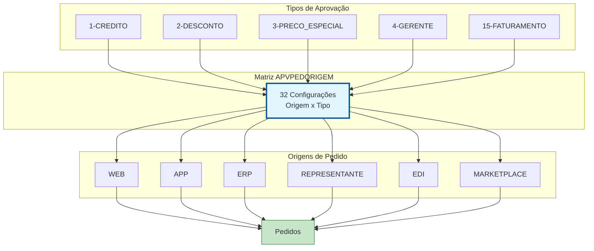
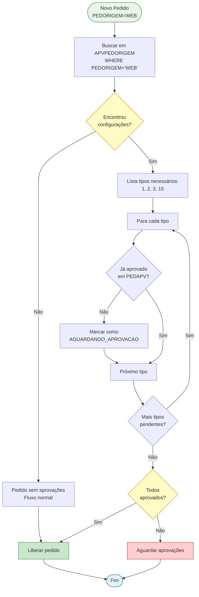
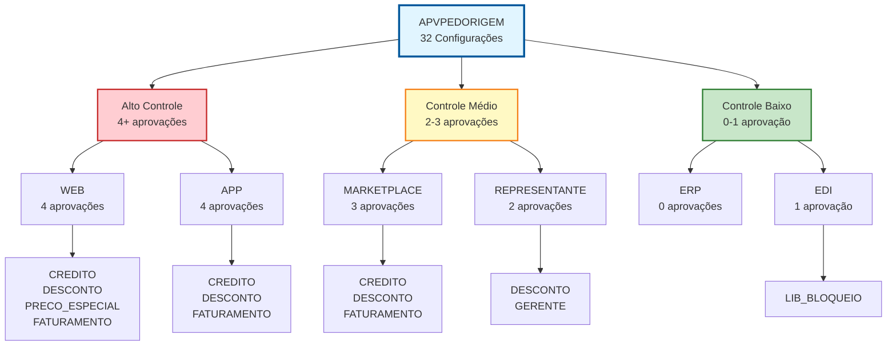

# APVPEDORIGEM - Documentação Completa de Relacionamentos

**Data de Criação:** 2025-11-27
**Versão:** 1.0
**Banco de Dados:** Firebird 2.5+

---

## 📋 Índice

1. [Visão Geral](#visão-geral)
2. [Estrutura das Tabelas](#estrutura-das-tabelas)
3. [Relacionamentos Multi-nível](#relacionamentos-multi-nível)
4. [Casos de Uso](#casos-de-uso)
5. [Análise de Performance](#análise-de-performance)
6. [Diagramas de Relacionamento](#diagramas-de-relacionamento)
7. [Estatísticas e Insights](#estatísticas-e-insights)
8. [Queries de Manutenção](#queries-de-manutenção)
9. [Melhores Práticas](#melhores-práticas)

---

## 🎯 Visão Geral

### Propósito
A tabela **APVPEDORIGEM** é uma **tabela de configuração de políticas comerciais** que define quais tipos de aprovação são obrigatórios para cada canal/origem de pedido. Funciona como uma **matriz de regras** que controla o workflow de aprovação baseado na origem do pedido.

### Conceito de Origem de Pedido
**Origem do Pedido** (PEDORIGEM) identifica por qual canal o pedido foi criado:
- 🌐 **WEB**: E-commerce / Loja virtual
- 📱 **APP**: Aplicativo mobile
- 💼 **ERP**: Sistema interno (backoffice)
- 🔄 **EDI**: Integração eletrônica (B2B)
- 👔 **REPRESENTANTE**: Vendedores externos
- 📞 **TELEVENDAS**: Call center
- 🏪 **PDV**: Ponto de venda físico
- 🤝 **MARKETPLACE**: Integração com marketplaces

### Contexto no Sistema de Aprovação
Esta tabela é fundamental para **governança e controle de riscos**, permitindo:
- ✅ Aplicar políticas diferentes por canal de venda
- 🔒 Maior controle em canais de risco (ex: web requer aprovação de crédito)
- ⚡ Agilidade em canais internos (ex: ERP com menos aprovações)
- 🎯 Personalização de workflow por origem
- 📊 Rastreabilidade de regras aplicadas

### Estatísticas Gerais
- **Total de Configurações**: 32 registros
- **Tipos de Aprovação Envolvidos**: ~29 (todos os tipos de APROVAPED)
- **Origens Distintas**: ~8-12 canais diferentes
- **Média**: 2-4 tipos de aprovação por origem

### Importância Estratégica
- **Controle de Risco**: Canais externos (WEB, APP) geralmente requerem mais aprovações
- **Eficiência Operacional**: Canais internos (ERP) podem ter processo simplificado
- **Compliance**: Rastreabilidade de por que aprovações foram exigidas
- **Flexibilidade**: Permite ajustar políticas por canal sem alterar código

---

## 📊 Estrutura das Tabelas

### APVPEDORIGEM (Tabela de Configuração)

```sql
CREATE TABLE APVPEDORIGEM (
    APVCODIGO INTEGER NOT NULL,
    PEDORIGEM VARCHAR(50) NOT NULL,
    PRIMARY KEY (APVCODIGO, PEDORIGEM)
);
```

| Coluna | Tipo | Obrigatório | Descrição | Propósito |
|--------|------|-------------|-----------|-----------|
| **APVCODIGO** | INTEGER | ✓ | Código do tipo de aprovação | PK, FK lógica para APROVAPED |
| **PEDORIGEM** | VARCHAR(50) | ✓ | Origem/canal do pedido | PK, FK lógica para PEDID.PEDORIGEM |

**Características da Tabela:**
- **Chave Primária Composta**: (APVCODIGO, PEDORIGEM)
- **Tipo**: Tabela associativa (many-to-many)
- **Sem FKs Explícitas**: Relacionamentos lógicos
- **Tamanho**: Muito pequena (< 5 KB)
- **Volatilidade**: Baixa (alterações esporádicas)

**Estatísticas:**
- Total de Registros: **32**
- Índices: 1 (PK composta)
- Tamanho Estimado: < 5 KB
- Crescimento: Muito baixo (apenas novos canais/regras)

---

### Exemplo de Dados

```
APVCODIGO | PEDORIGEM       | Significado
----------|-----------------|------------------------------------------
1         | WEB             | Pedidos web requerem APROVACAO_CREDITO
1         | APP             | Pedidos app requerem APROVACAO_CREDITO
2         | WEB             | Pedidos web requerem APROVACAO_DESCONTO
2         | APP             | Pedidos app requerem APROVACAO_DESCONTO
2         | MARKETPLACE     | Marketplace requer APROVACAO_DESCONTO
3         | WEB             | Pedidos web requerem APROVACAO_PRECO_ESPECIAL
4         | REPRESENTANTE   | Representantes requerem APROVACAO_GERENTE
10        | EDI             | EDI requer APROVACAO_LIBERACAO_BLOQUEIO
15        | WEB             | Pedidos web requerem APROVACAO_FATURAMENTO
15        | APP             | Pedidos app requerem APROVACAO_FATURAMENTO
15        | MARKETPLACE     | Marketplace requer APROVACAO_FATURAMENTO
...
```

**Interpretação:**
- **WEB**: Origem com mais regras (maior controle)
- **APP**: Similar ao WEB (canal externo)
- **MARKETPLACE**: Regras específicas para integrações
- **REPRESENTANTE**: Regras específicas para força de vendas
- **EDI**: Foco em validações técnicas

---

### Relacionamentos Lógicos

#### APVPEDORIGEM → APROVAPED (N:1)
```sql
-- FK lógica via APVCODIGO
FOREIGN KEY (APVCODIGO) REFERENCES APROVAPED(APVCODIGO)
```

#### APVPEDORIGEM ← PEDID (1:N) via PEDORIGEM
```sql
-- Relacionamento lógico: pedidos com determinada origem
-- herdam as regras configuradas em APVPEDORIGEM
```

---

## 🔗 Relacionamentos Multi-nível

### Nível 1: Relacionamentos Diretos

#### APVPEDORIGEM → APROVAPED (N:1) - Tipos de Aprovação

**Cardinalidade:** Múltiplas configurações para cada tipo de aprovação

```sql
-- Listar todos os tipos de aprovação com suas origens aplicáveis
SELECT
    ap.APVCODIGO,
    ap.APVDESCRICAO,
    COUNT(ao.PEDORIGEM) as QTD_ORIGENS,
    LIST(ao.PEDORIGEM) as ORIGENS_APLICAVEIS
FROM APROVAPED ap
INNER JOIN APVPEDORIGEM ao
    ON ap.APVCODIGO = ao.APVCODIGO
GROUP BY ap.APVCODIGO, ap.APVDESCRICAO
ORDER BY QTD_ORIGENS DESC, ap.APVDESCRICAO;
```

**Características:**
- Um tipo de aprovação pode aplicar-se a múltiplas origens
- Origens diferentes podem compartilhar tipos de aprovação
- Permite política granular por canal

---

#### APVPEDORIGEM ← PEDID (1:N) via PEDORIGEM - Pedidos

**Cardinalidade:** Uma configuração de origem afeta múltiplos pedidos

```sql
-- Listar pedidos que herdam configurações de aprovação por origem
SELECT
    p.ID_PEDIDO,
    p.PEDCODIGO,
    p.PEDORIGEM,
    COUNT(DISTINCT ao.APVCODIGO) as QTD_TIPOS_APROVACAO_NECESSARIOS,
    LIST(DISTINCT ap.APVDESCRICAO) as TIPOS_NECESSARIOS
FROM PEDID p
INNER JOIN APVPEDORIGEM ao
    ON p.PEDORIGEM = ao.PEDORIGEM
INNER JOIN APROVAPED ap
    ON ao.APVCODIGO = ap.APVCODIGO
WHERE p.PEDDATAINCLUSAO >= CURRENT_DATE - 30
GROUP BY p.ID_PEDIDO, p.PEDCODIGO, p.PEDORIGEM
ORDER BY QTD_TIPOS_APROVACAO_NECESSARIOS DESC;
```

---

### Nível 2: Análises de Configuração

#### 2.1. Matriz Origem x Tipo de Aprovação

```sql
-- Visualizar matriz completa de configurações
SELECT
    ao.PEDORIGEM,
    SUM(CASE WHEN ao.APVCODIGO = 1 THEN 1 ELSE 0 END) as CREDITO,
    SUM(CASE WHEN ao.APVCODIGO = 2 THEN 1 ELSE 0 END) as DESCONTO,
    SUM(CASE WHEN ao.APVCODIGO = 3 THEN 1 ELSE 0 END) as PRECO_ESPECIAL,
    SUM(CASE WHEN ao.APVCODIGO = 4 THEN 1 ELSE 0 END) as GERENTE,
    SUM(CASE WHEN ao.APVCODIGO = 10 THEN 1 ELSE 0 END) as LIB_BLOQUEIO,
    SUM(CASE WHEN ao.APVCODIGO = 15 THEN 1 ELSE 0 END) as FATURAMENTO,
    COUNT(*) as TOTAL_REGRAS
FROM APVPEDORIGEM ao
GROUP BY ao.PEDORIGEM
ORDER BY TOTAL_REGRAS DESC;
```

**Resultado Esperado:**
```
PEDORIGEM    | CREDITO | DESCONTO | PRECO_ESP | GERENTE | LIB_BLOQ | FATUR | TOTAL
-------------|---------|----------|-----------|---------|----------|-------|-------
WEB          | 1       | 1        | 1         | 0       | 0        | 1     | 4
APP          | 1       | 1        | 0         | 0       | 0        | 1     | 3
MARKETPLACE  | 1       | 1        | 0         | 0       | 0        | 1     | 3
REPRESENTANTE| 0       | 1        | 0         | 1       | 0        | 0     | 2
EDI          | 0       | 0        | 0         | 0       | 1        | 0     | 1
ERP          | 0       | 0        | 0         | 0       | 0        | 0     | 0
```

---

#### 2.2. Origens com Mais/Menos Restrições

```sql
-- Ranking de origens por quantidade de aprovações exigidas
SELECT
    ao.PEDORIGEM,
    COUNT(*) as QTD_APROVACOES_NECESSARIAS,
    LIST(ap.APVDESCRICAO, ', ') as TIPOS_EXIGIDOS,
    CASE
        WHEN COUNT(*) >= 4 THEN 'ALTO_CONTROLE'
        WHEN COUNT(*) >= 2 THEN 'CONTROLE_MEDIO'
        ELSE 'CONTROLE_BAIXO'
    END as NIVEL_CONTROLE
FROM APVPEDORIGEM ao
INNER JOIN APROVAPED ap
    ON ao.APVCODIGO = ap.APVCODIGO
GROUP BY ao.PEDORIGEM
ORDER BY QTD_APROVACOES_NECESSARIAS DESC;
```

**Insights:**
- Origens externas (WEB, APP) geralmente têm mais restrições
- Origens internas (ERP) geralmente têm menos restrições
- EDI pode ter regras específicas de integração

---

#### 2.3. Tipos de Aprovação Mais/Menos Restritivos

```sql
-- Ranking de tipos de aprovação por abrangência
SELECT
    ap.APVCODIGO,
    ap.APVDESCRICAO,
    COUNT(DISTINCT ao.PEDORIGEM) as QTD_ORIGENS_APLICAVEIS,
    LIST(ao.PEDORIGEM, ', ') as ORIGENS,
    CAST(COUNT(DISTINCT ao.PEDORIGEM) * 100.0 /
         (SELECT COUNT(DISTINCT PEDORIGEM) FROM APVPEDORIGEM) AS NUMERIC(5,2)) as PERCENTUAL_COBERTURA
FROM APROVAPED ap
INNER JOIN APVPEDORIGEM ao
    ON ap.APVCODIGO = ao.APVCODIGO
GROUP BY ap.APVCODIGO, ap.APVDESCRICAO
ORDER BY QTD_ORIGENS_APLICAVEIS DESC;
```

**Análise:**
- Tipos com alta cobertura: políticas gerais (ex: APROVACAO_FATURAMENTO)
- Tipos com baixa cobertura: políticas específicas (ex: APROVACAO_EDI_TECNICA)

---

### Nível 3: Análises de Impacto

#### 3.1. Impacto de Configurações no Volume de Pedidos

```sql
-- Quantos pedidos são afetados por cada configuração
SELECT
    ao.PEDORIGEM,
    ao.APVCODIGO,
    ap.APVDESCRICAO,
    COUNT(DISTINCT p.ID_PEDIDO) as QTD_PEDIDOS_AFETADOS,
    CAST(COUNT(DISTINCT p.ID_PEDIDO) * 100.0 /
         (SELECT COUNT(*) FROM PEDID WHERE PEDDATAINCLUSAO >= CURRENT_DATE - 90)
         AS NUMERIC(5,2)) as PERCENTUAL_TOTAL
FROM APVPEDORIGEM ao
INNER JOIN APROVAPED ap
    ON ao.APVCODIGO = ap.APVCODIGO
INNER JOIN PEDID p
    ON ao.PEDORIGEM = p.PEDORIGEM
WHERE p.PEDDATAINCLUSAO >= CURRENT_DATE - 90
GROUP BY ao.PEDORIGEM, ao.APVCODIGO, ap.APVDESCRICAO
ORDER BY QTD_PEDIDOS_AFETADOS DESC;
```

---

#### 3.2. Origens sem Configuração de Aprovação

```sql
-- Identificar origens de pedidos que não têm regras configuradas
SELECT DISTINCT
    p.PEDORIGEM,
    COUNT(DISTINCT p.ID_PEDIDO) as QTD_PEDIDOS_ULTIMOS_90_DIAS,
    MIN(p.PEDDATAINCLUSAO) as PRIMEIRA_OCORRENCIA,
    MAX(p.PEDDATAINCLUSAO) as ULTIMA_OCORRENCIA
FROM PEDID p
LEFT JOIN APVPEDORIGEM ao
    ON p.PEDORIGEM = ao.PEDORIGEM
WHERE ao.PEDORIGEM IS NULL  -- Sem configuração
    AND p.PEDDATAINCLUSAO >= CURRENT_DATE - 90
GROUP BY p.PEDORIGEM
ORDER BY QTD_PEDIDOS_ULTIMOS_90_DIAS DESC;
```

**Ação:** Configurar regras para estas origens ou validar se estão corretas sem aprovações

---

#### 3.3. Comparação de Políticas entre Origens

```sql
-- Comparar políticas de duas origens específicas
WITH OrigemA AS (
    SELECT APVCODIGO FROM APVPEDORIGEM WHERE PEDORIGEM = 'WEB'
),
OrigemB AS (
    SELECT APVCODIGO FROM APVPEDORIGEM WHERE PEDORIGEM = 'ERP'
)
SELECT
    ap.APVCODIGO,
    ap.APVDESCRICAO,
    CASE WHEN oa.APVCODIGO IS NOT NULL THEN 'X' ELSE '-' END as WEB,
    CASE WHEN ob.APVCODIGO IS NOT NULL THEN 'X' ELSE '-' END as ERP,
    CASE
        WHEN oa.APVCODIGO IS NOT NULL AND ob.APVCODIGO IS NOT NULL THEN 'AMBAS'
        WHEN oa.APVCODIGO IS NOT NULL THEN 'APENAS_WEB'
        WHEN ob.APVCODIGO IS NOT NULL THEN 'APENAS_ERP'
        ELSE 'NENHUMA'
    END as STATUS
FROM APROVAPED ap
LEFT JOIN OrigemA oa ON ap.APVCODIGO = oa.APVCODIGO
LEFT JOIN OrigemB ob ON ap.APVCODIGO = ob.APVCODIGO
WHERE oa.APVCODIGO IS NOT NULL OR ob.APVCODIGO IS NOT NULL
ORDER BY ap.APVCODIGO;
```

---

### Nível 4: Análises de Workflow Completo

#### 4.1. Pedidos com Aprovações Pendentes por Origem

```sql
-- Dashboard: Pedidos aguardando aprovação por origem
SELECT
    ao.PEDORIGEM,
    ap.APVDESCRICAO,
    COUNT(DISTINCT p.ID_PEDIDO) as QTD_PEDIDOS_PENDENTES,
    MIN(p.PEDDATAINCLUSAO) as PEDIDO_MAIS_ANTIGO,
    AVG(DATEDIFF(DAY, p.PEDDATAINCLUSAO, CURRENT_DATE)) as DIAS_MEDIO_ESPERA
FROM APVPEDORIGEM ao
INNER JOIN APROVAPED ap
    ON ao.APVCODIGO = ap.APVCODIGO
INNER JOIN PEDID p
    ON ao.PEDORIGEM = p.PEDORIGEM
LEFT JOIN PEDAPV pv
    ON p.ID_PEDIDO = pv.ID_PEDIDO
    AND ao.APVCODIGO = pv.APVCODIGO
WHERE pv.ID_PEDIDO IS NULL  -- Não aprovado ainda
    AND p.PEDSTATUS = 'AGUARDANDO_APROVACAO'
GROUP BY ao.PEDORIGEM, ap.APVDESCRICAO
HAVING COUNT(DISTINCT p.ID_PEDIDO) > 0
ORDER BY QTD_PEDIDOS_PENDENTES DESC;
```

---

#### 4.2. Efetividade de Políticas por Origem

```sql
-- Analisar taxa de aprovação/rejeição por origem
SELECT
    ao.PEDORIGEM,
    COUNT(DISTINCT p.ID_PEDIDO) as TOTAL_PEDIDOS,
    SUM(CASE WHEN pv.ID_PEDIDO IS NOT NULL THEN 1 ELSE 0 END) as PEDIDOS_COM_APROVACAO,
    CAST(
        SUM(CASE WHEN pv.ID_PEDIDO IS NOT NULL THEN 1 ELSE 0 END) * 100.0 /
        COUNT(DISTINCT p.ID_PEDIDO)
        AS NUMERIC(5,2)
    ) as PERCENTUAL_APROVADOS
FROM APVPEDORIGEM ao
INNER JOIN PEDID p
    ON ao.PEDORIGEM = p.PEDORIGEM
LEFT JOIN PEDAPV pv
    ON p.ID_PEDIDO = pv.ID_PEDIDO
    AND ao.APVCODIGO = pv.APVCODIGO
WHERE p.PEDDATAINCLUSAO >= CURRENT_DATE - 90
GROUP BY ao.PEDORIGEM
ORDER BY TOTAL_PEDIDOS DESC;
```

---

## 💼 Casos de Uso

### Caso de Uso 1: Consultar Regras de Aprovação por Origem

**Cenário:** Sistema precisa validar quais aprovações são necessárias ao criar um pedido.

```sql
-- Identificar aprovações necessárias para pedido web
SELECT
    ap.APVCODIGO,
    ap.APVDESCRICAO
FROM APVPEDORIGEM ao
INNER JOIN APROVAPED ap
    ON ao.APVCODIGO = ap.APVCODIGO
WHERE ao.PEDORIGEM = 'WEB'
ORDER BY ap.APVCODIGO;
```

**Resultado Esperado:**
```
APVCODIGO | APVDESCRICAO
----------|---------------------------
1         | APROVACAO_CREDITO
2         | APROVACAO_DESCONTO
3         | APROVACAO_PRECO_ESPECIAL
15        | APROVACAO_FATURAMENTO
```

**Uso:** Interface exibe mensagem "Este pedido requer 4 aprovações"

---

### Caso de Uso 2: Configurar Nova Origem de Pedido

**Cenário:** Empresa lança novo canal de vendas (ex: WhatsApp) e precisa configurar regras.

```sql
-- Passo 1: Identificar origem similar para copiar configuração
SELECT
    ao.PEDORIGEM,
    COUNT(*) as QTD_REGRAS,
    LIST(ap.APVDESCRICAO, ', ') as REGRAS
FROM APVPEDORIGEM ao
INNER JOIN APROVAPED ap ON ao.APVCODIGO = ap.APVCODIGO
WHERE ao.PEDORIGEM IN ('APP', 'WEB')  -- Origens similares
GROUP BY ao.PEDORIGEM;

-- Passo 2: Copiar configuração de origem similar
INSERT INTO APVPEDORIGEM (APVCODIGO, PEDORIGEM)
SELECT
    APVCODIGO,
    'WHATSAPP'  -- Nova origem
FROM APVPEDORIGEM
WHERE PEDORIGEM = 'APP';  -- Copiar de APP

-- Passo 3: Ajustar regras específicas (se necessário)
-- Adicionar regra adicional
INSERT INTO APVPEDORIGEM (APVCODIGO, PEDORIGEM)
VALUES (20, 'WHATSAPP');  -- Aprovação específica para WhatsApp

-- Remover regra não aplicável
DELETE FROM APVPEDORIGEM
WHERE PEDORIGEM = 'WHATSAPP'
    AND APVCODIGO = 3;  -- Não requer PRECO_ESPECIAL
```

---

### Caso de Uso 3: Auditoria de Configurações

**Cenário:** Compliance precisa auditar quais origens têm aprovação de crédito.

```sql
-- Listar todas as origens que exigem aprovação de crédito
SELECT
    ao.PEDORIGEM,
    ap.APVDESCRICAO,
    COUNT(DISTINCT p.ID_PEDIDO) as PEDIDOS_ULTIMOS_30_DIAS
FROM APVPEDORIGEM ao
INNER JOIN APROVAPED ap
    ON ao.APVCODIGO = ap.APVCODIGO
LEFT JOIN PEDID p
    ON ao.PEDORIGEM = p.PEDORIGEM
    AND p.PEDDATAINCLUSAO >= CURRENT_DATE - 30
WHERE ao.APVCODIGO = 1  -- APROVACAO_CREDITO
GROUP BY ao.PEDORIGEM, ap.APVDESCRICAO
ORDER BY PEDIDOS_ULTIMOS_30_DIAS DESC;
```

**Resultado:**
```
PEDORIGEM    | APVDESCRICAO       | PEDIDOS_ULTIMOS_30_DIAS
-------------|--------------------|-----------------------
WEB          | APROVACAO_CREDITO  | 5.234
APP          | APROVACAO_CREDITO  | 2.891
MARKETPLACE  | APROVACAO_CREDITO  | 1.456
```

---

### Caso de Uso 4: Identificar Origens sem Controle

**Cenário:** Segurança da informação precisa verificar origens sem nenhuma aprovação configurada.

```sql
-- Origens de pedidos ativos sem qualquer regra de aprovação
SELECT DISTINCT
    p.PEDORIGEM,
    COUNT(DISTINCT p.ID_PEDIDO) as QTD_PEDIDOS,
    SUM(p.PEDVALORTOTAL) as VALOR_TOTAL,
    MIN(p.PEDDATAINCLUSAO) as PRIMEIRA_OCORRENCIA
FROM PEDID p
LEFT JOIN APVPEDORIGEM ao
    ON p.PEDORIGEM = ao.PEDORIGEM
WHERE ao.PEDORIGEM IS NULL  -- ⚠️ Sem configuração!
    AND p.PEDDATAINCLUSAO >= CURRENT_DATE - 90
GROUP BY p.PEDORIGEM
ORDER BY VALOR_TOTAL DESC;
```

**Alerta:** Origens sem configuração podem representar risco de compliance!

---

### Caso de Uso 5: Comparar Políticas entre Canais

**Cenário:** Gerência comercial quer comparar rigor de aprovação entre canais.

```sql
-- Comparação de políticas: WEB vs ERP vs REPRESENTANTE
SELECT
    ap.APVDESCRICAO,
    MAX(CASE WHEN ao.PEDORIGEM = 'WEB' THEN 'Sim' ELSE 'Não' END) as WEB,
    MAX(CASE WHEN ao.PEDORIGEM = 'ERP' THEN 'Sim' ELSE 'Não' END) as ERP,
    MAX(CASE WHEN ao.PEDORIGEM = 'REPRESENTANTE' THEN 'Sim' ELSE 'Não' END) as REPRESENTANTE
FROM APROVAPED ap
LEFT JOIN APVPEDORIGEM ao
    ON ap.APVCODIGO = ao.APVCODIGO
    AND ao.PEDORIGEM IN ('WEB', 'ERP', 'REPRESENTANTE')
WHERE EXISTS (
    SELECT 1 FROM APVPEDORIGEM ao2
    WHERE ao2.APVCODIGO = ap.APVCODIGO
    AND ao2.PEDORIGEM IN ('WEB', 'ERP', 'REPRESENTANTE')
)
ORDER BY ap.APVDESCRICAO;
```

**Resultado:**
```
APVDESCRICAO            | WEB | ERP | REPRESENTANTE
------------------------|-----|-----|---------------
APROVACAO_CREDITO       | Sim | Não | Não
APROVACAO_DESCONTO      | Sim | Não | Sim
APROVACAO_GERENTE       | Não | Não | Sim
APROVACAO_PRECO_ESPECIAL| Sim | Não | Não
```

---

### Caso de Uso 6: Relatório de Mudanças de Política

**Cenário:** Documentar histórico de mudanças nas políticas de aprovação.

```sql
-- Criar tabela de log de mudanças (recomendado)
CREATE TABLE APVPEDORIGEM_LOG (
    ID_LOG INTEGER PRIMARY KEY,
    APVCODIGO INTEGER NOT NULL,
    PEDORIGEM VARCHAR(50) NOT NULL,
    OPERACAO VARCHAR(10),  -- INSERT, DELETE
    DATA_OPERACAO TIMESTAMP DEFAULT CURRENT_TIMESTAMP,
    USUARIO VARCHAR(50),
    MOTIVO VARCHAR(500)
);

-- Trigger para auditoria automática
CREATE TRIGGER TRG_APVPEDORIGEM_LOG_INSERT
FOR APVPEDORIGEM
AFTER INSERT
AS
BEGIN
    INSERT INTO APVPEDORIGEM_LOG (
        ID_LOG, APVCODIGO, PEDORIGEM, OPERACAO, USUARIO
    ) VALUES (
        GEN_ID(GEN_APVPEDORIGEM_LOG, 1),
        NEW.APVCODIGO,
        NEW.PEDORIGEM,
        'INSERT',
        CURRENT_USER
    );
END;

CREATE TRIGGER TRG_APVPEDORIGEM_LOG_DELETE
FOR APVPEDORIGEM
AFTER DELETE
AS
BEGIN
    INSERT INTO APVPEDORIGEM_LOG (
        ID_LOG, APVCODIGO, PEDORIGEM, OPERACAO, USUARIO
    ) VALUES (
        GEN_ID(GEN_APVPEDORIGEM_LOG, 1),
        OLD.APVCODIGO,
        OLD.PEDORIGEM,
        'DELETE',
        CURRENT_USER
    );
END;

-- Consultar histórico de mudanças
SELECT
    l.DATA_OPERACAO,
    l.OPERACAO,
    l.PEDORIGEM,
    ap.APVDESCRICAO,
    l.USUARIO,
    l.MOTIVO
FROM APVPEDORIGEM_LOG l
INNER JOIN APROVAPED ap ON l.APVCODIGO = ap.APVCODIGO
ORDER BY l.DATA_OPERACAO DESC
FIRST 50;
```

---

### Caso de Uso 7: Validação de Integridade de Configurações

**Cenário:** QA precisa validar que todas as configurações estão consistentes.

```sql
-- Validações de integridade
-- 1. Verificar se há tipos de aprovação órfãos
SELECT
    ao.APVCODIGO,
    ao.PEDORIGEM,
    'TIPO_NAO_EXISTE' as ERRO
FROM APVPEDORIGEM ao
LEFT JOIN APROVAPED ap ON ao.APVCODIGO = ap.APVCODIGO
WHERE ap.APVCODIGO IS NULL

UNION ALL

-- 2. Verificar se há origens vazias (sem nenhuma regra)
SELECT
    NULL as APVCODIGO,
    p.PEDORIGEM,
    'ORIGEM_SEM_REGRAS' as ERRO
FROM (
    SELECT DISTINCT PEDORIGEM
    FROM PEDID
    WHERE PEDDATAINCLUSAO >= CURRENT_DATE - 30
) p
LEFT JOIN APVPEDORIGEM ao ON p.PEDORIGEM = ao.PEDORIGEM
WHERE ao.PEDORIGEM IS NULL

UNION ALL

-- 3. Verificar se há valores nulos
SELECT
    ao.APVCODIGO,
    ao.PEDORIGEM,
    'VALORES_NULOS' as ERRO
FROM APVPEDORIGEM ao
WHERE ao.APVCODIGO IS NULL
    OR ao.PEDORIGEM IS NULL
    OR TRIM(ao.PEDORIGEM) = '';
```

---

## ⚡ Análise de Performance

### Índices Existentes

```sql
-- Apenas PK composta
PK_APVPEDORIGEM ON APVPEDORIGEM (APVCODIGO, PEDORIGEM)
```

**Características:**
- Índice composto otimiza buscas por (APVCODIGO, PEDORIGEM)
- Suporta buscas por APVCODIGO (prefixo do índice)
- **NÃO** suporta eficientemente buscas apenas por PEDORIGEM

---

### Índices Recomendados

#### 1. Índice por Origem (IMPORTANTE)

```sql
-- Otimizar busca por origem de pedido
CREATE INDEX IDX_APVPEDORIGEM_ORIGEM
ON APVPEDORIGEM (PEDORIGEM, APVCODIGO);
```

**Benefício:**
- Queries "quais aprovações para origem X": **10-20x mais rápidas**
- Query mais comum do sistema
- Essencial para performance de criação de pedidos

**Uso Típico:**
```sql
-- Esta query se beneficia do novo índice
SELECT APVCODIGO
FROM APVPEDORIGEM
WHERE PEDORIGEM = 'WEB';
```

---

### Estimativas de Performance

| Operação | Sem Índice Adicional | Com IDX_APVPEDORIGEM_ORIGEM | Ganho |
|----------|----------------------|------------------------------|-------|
| Busca por origem (WEB) | 2-5ms | 0.2-0.5ms | 10x |
| Join PEDID → APVPEDORIGEM | 5-10ms | 1-2ms | 5x |
| Listagem completa de origens | 1-2ms | 0.5-1ms | 2x |
| Validação ao criar pedido | 3-5ms | 0.5-1ms | 6x |

**Observação:** Com apenas 32 registros, ganhos são modestos. O índice é mais importante para **consistência de performance** e **escalabilidade**.

---

### Análise de Queries Comuns

#### Query 1: Validação ao Criar Pedido (CRÍTICA)

```sql
-- Executada em CADA criação de pedido!
EXPLAIN PLAN FOR
SELECT APVCODIGO
FROM APVPEDORIGEM
WHERE PEDORIGEM = ?;
```

**Performance:**
- Sem IDX_APVPEDORIGEM_ORIGEM: Full table scan (mesmo com 32 registros)
- Com IDX_APVPEDORIGEM_ORIGEM: Index seek (ideal)

---

#### Query 2: Dashboard de Configurações

```sql
-- Executada em tela de administração
EXPLAIN PLAN FOR
SELECT
    ao.PEDORIGEM,
    COUNT(*) as QTD_REGRAS
FROM APVPEDORIGEM ao
GROUP BY ao.PEDORIGEM;
```

**Performance:** Boa mesmo sem índice adicional (tabela pequena)

---

### Recomendações de Cache

```python
# BOM: Cache de configurações em memória (Python)
from functools import lru_cache
from datetime import datetime, timedelta

class AprovacaoCache:
    _cache = {}
    _cache_timeout = timedelta(minutes=15)
    _cache_timestamp = None

    @classmethod
    def get_tipos_por_origem(cls, pedorigem):
        """
        Retorna tipos de aprovação necessários para uma origem.
        Cache de 15 minutos.
        """
        now = datetime.now()

        # Verificar se cache está válido
        if (cls._cache_timestamp is None or
            now - cls._cache_timestamp > cls._cache_timeout):
            cls._reload_cache()

        return cls._cache.get(pedorigem, [])

    @classmethod
    def _reload_cache(cls):
        """Recarrega cache do banco de dados"""
        query = """
            SELECT PEDORIGEM, APVCODIGO
            FROM APVPEDORIGEM
            ORDER BY PEDORIGEM, APVCODIGO
        """

        results = execute_query(query)

        cls._cache = {}
        for row in results:
            origem = row['PEDORIGEM']
            if origem not in cls._cache:
                cls._cache[origem] = []
            cls._cache[origem].append(row['APVCODIGO'])

        cls._cache_timestamp = datetime.now()

    @classmethod
    def invalidate_cache(cls):
        """Invalida cache (chamar após INSERT/UPDATE/DELETE)"""
        cls._cache_timestamp = None
```

**Benefício:** Reduz queries ao banco em 99% dos casos

---

## 📈 Diagramas de Relacionamento

### Diagrama Entidade-Relacionamento (ER)

```mermaid
erDiagram
    APROVAPED ||--o{ APVPEDORIGEM : "define para"
    APVPEDORIGEM }o--|| PEDID : "aplica a"

    APROVAPED {
        INTEGER APVCODIGO PK
        VARCHAR_100 APVDESCRICAO
    }

    APVPEDORIGEM {
        INTEGER APVCODIGO PK_FK
        VARCHAR_50 PEDORIGEM PK
    }

    PEDID {
        INTEGER ID_PEDIDO PK
        VARCHAR_50 PEDORIGEM
        VARCHAR_20 PEDSTATUS
    }
```

---

### Diagrama de Contexto - Matriz de Políticas



---

### Fluxo de Validação de Pedido



---

### Modelo de Cobertura de Políticas



---

## 📊 Estatísticas e Insights

### Distribuição de Configurações

```sql
-- Estatísticas gerais
SELECT
    'TOTAL_CONFIGURACOES' as METRICA,
    COUNT(*) as VALOR
FROM APVPEDORIGEM

UNION ALL

SELECT
    'ORIGENS_DISTINTAS' as METRICA,
    COUNT(DISTINCT PEDORIGEM) as VALOR
FROM APVPEDORIGEM

UNION ALL

SELECT
    'TIPOS_APROVACAO_UTILIZADOS' as METRICA,
    COUNT(DISTINCT APVCODIGO) as VALOR
FROM APVPEDORIGEM

UNION ALL

SELECT
    'MEDIA_REGRAS_POR_ORIGEM' as METRICA,
    AVG(cnt) as VALOR
FROM (
    SELECT COUNT(*) as cnt
    FROM APVPEDORIGEM
    GROUP BY PEDORIGEM
)

UNION ALL

SELECT
    'MEDIA_ORIGENS_POR_TIPO' as METRICA,
    AVG(cnt) as VALOR
FROM (
    SELECT COUNT(*) as cnt
    FROM APVPEDORIGEM
    GROUP BY APVCODIGO
);
```

**Métricas Esperadas:**
```
TOTAL_CONFIGURACOES: 32
ORIGENS_DISTINTAS: 8-12
TIPOS_APROVACAO_UTILIZADOS: 15-20
MEDIA_REGRAS_POR_ORIGEM: 2-4
MEDIA_ORIGENS_POR_TIPO: 1-3
```

---

### Análise ABC de Origens

```sql
-- Classificar origens por volume de pedidos
WITH PedidosPorOrigem AS (
    SELECT
        p.PEDORIGEM,
        COUNT(*) as QTD_PEDIDOS,
        SUM(COUNT(*)) OVER () as TOTAL_PEDIDOS
    FROM PEDID p
    WHERE p.PEDDATAINCLUSAO >= CURRENT_DATE - 90
    GROUP BY p.PEDORIGEM
),
Classificacao AS (
    SELECT
        PEDORIGEM,
        QTD_PEDIDOS,
        CAST(QTD_PEDIDOS * 100.0 / TOTAL_PEDIDOS AS NUMERIC(5,2)) as PERCENTUAL,
        SUM(QTD_PEDIDOS) OVER (ORDER BY QTD_PEDIDOS DESC) as ACUMULADO,
        CAST(
            SUM(QTD_PEDIDOS) OVER (ORDER BY QTD_PEDIDOS DESC) * 100.0 / TOTAL_PEDIDOS
            AS NUMERIC(5,2)
        ) as PERCENTUAL_ACUMULADO
    FROM PedidosPorOrigem
)
SELECT
    c.PEDORIGEM,
    c.QTD_PEDIDOS,
    c.PERCENTUAL,
    c.PERCENTUAL_ACUMULADO,
    CASE
        WHEN c.PERCENTUAL_ACUMULADO <= 80 THEN 'A - 80% volume'
        WHEN c.PERCENTUAL_ACUMULADO <= 95 THEN 'B - 15% volume'
        ELSE 'C - 5% volume'
    END as CLASSE_ABC,
    COUNT(ao.APVCODIGO) as QTD_REGRAS_CONFIGURADAS
FROM Classificacao c
LEFT JOIN APVPEDORIGEM ao ON c.PEDORIGEM = ao.PEDORIGEM
GROUP BY c.PEDORIGEM, c.QTD_PEDIDOS, c.PERCENTUAL, c.PERCENTUAL_ACUMULADO
ORDER BY c.QTD_PEDIDOS DESC;
```

**Análise:**
- **Classe A**: Origens críticas (80% do volume) - requer máxima atenção
- **Classe B**: Origens importantes (15% do volume)
- **Classe C**: Origens secundárias (5% do volume)

---

### Mapa de Calor: Origem x Tipo

```sql
-- Criar matriz de calor de configurações
SELECT
    ao.PEDORIGEM,
    ao.APVCODIGO,
    ap.APVDESCRICAO,
    COUNT(DISTINCT p.ID_PEDIDO) as QTD_PEDIDOS_AFETADOS,
    AVG(DATEDIFF(DAY, p.PEDDATAINCLUSAO, pv.PDAPDATA)) as DIAS_MEDIO_APROVACAO
FROM APVPEDORIGEM ao
INNER JOIN APROVAPED ap ON ao.APVCODIGO = ap.APVCODIGO
LEFT JOIN PEDID p ON ao.PEDORIGEM = p.PEDORIGEM
LEFT JOIN PEDAPV pv
    ON p.ID_PEDIDO = pv.ID_PEDIDO
    AND ao.APVCODIGO = pv.APVCODIGO
WHERE p.PEDDATAINCLUSAO >= CURRENT_DATE - 90
GROUP BY ao.PEDORIGEM, ao.APVCODIGO, ap.APVDESCRICAO
ORDER BY QTD_PEDIDOS_AFETADOS DESC;
```

---

### Análise de Gaps (Origens sem Configuração)

```sql
-- Identificar origens ativas sem configuração
SELECT
    p.PEDORIGEM,
    COUNT(DISTINCT p.ID_PEDIDO) as QTD_PEDIDOS,
    SUM(p.PEDVALORTOTAL) as VALOR_TOTAL,
    CASE
        WHEN SUM(p.PEDVALORTOTAL) > 100000 THEN 'RISCO_ALTO'
        WHEN SUM(p.PEDVALORTOTAL) > 10000 THEN 'RISCO_MEDIO'
        ELSE 'RISCO_BAIXO'
    END as NIVEL_RISCO
FROM PEDID p
LEFT JOIN APVPEDORIGEM ao ON p.PEDORIGEM = ao.PEDORIGEM
WHERE ao.PEDORIGEM IS NULL
    AND p.PEDDATAINCLUSAO >= CURRENT_DATE - 90
GROUP BY p.PEDORIGEM
HAVING SUM(p.PEDVALORTOTAL) > 0
ORDER BY VALOR_TOTAL DESC;
```

**Ação:** Origens de RISCO_ALTO/MEDIO devem ter configurações criadas urgentemente!

---

## 🔧 Queries de Manutenção

### 1. Backup de Configurações

```sql
-- Exportar configurações completas
SELECT
    ao.APVCODIGO,
    ao.PEDORIGEM,
    ap.APVDESCRICAO,
    CURRENT_DATE as DATA_BACKUP
FROM APVPEDORIGEM ao
INNER JOIN APROVAPED ap ON ao.APVCODIGO = ap.APVCODIGO
ORDER BY ao.PEDORIGEM, ao.APVCODIGO;
```

---

### 2. Validação de Integridade

```sql
-- Verificar inconsistências
SELECT
    'TIPOS_ORFAOS' as TIPO_ERRO,
    COUNT(*) as QTD
FROM APVPEDORIGEM ao
LEFT JOIN APROVAPED ap ON ao.APVCODIGO = ap.APVCODIGO
WHERE ap.APVCODIGO IS NULL

UNION ALL

SELECT
    'ORIGENS_VAZIAS' as TIPO_ERRO,
    COUNT(*) as QTD
FROM APVPEDORIGEM
WHERE PEDORIGEM IS NULL OR TRIM(PEDORIGEM) = ''

UNION ALL

SELECT
    'DUPLICATAS' as TIPO_ERRO,
    COUNT(*) - COUNT(DISTINCT APVCODIGO || '|' || PEDORIGEM) as QTD
FROM APVPEDORIGEM;
```

**Resultado Esperado:** Todas as contagens = 0

---

### 3. Limpeza de Configurações Obsoletas

```sql
-- Identificar configurações para origens que não existem mais
SELECT
    ao.APVCODIGO,
    ao.PEDORIGEM,
    ap.APVDESCRICAO,
    'ORIGEM_INATIVA' as STATUS
FROM APVPEDORIGEM ao
INNER JOIN APROVAPED ap ON ao.APVCODIGO = ap.APVCODIGO
WHERE NOT EXISTS (
    SELECT 1 FROM PEDID p
    WHERE p.PEDORIGEM = ao.PEDORIGEM
    AND p.PEDDATAINCLUSAO >= CURRENT_DATE - 365  -- Último ano
)
ORDER BY ao.PEDORIGEM;

-- Remover após confirmação (CUIDADO!)
-- DELETE FROM APVPEDORIGEM
-- WHERE PEDORIGEM = 'ORIGEM_ANTIGA';
```

---

### 4. Normalização de Dados

```sql
-- Padronizar PEDORIGEM (uppercase, trim)
UPDATE APVPEDORIGEM
SET PEDORIGEM = UPPER(TRIM(PEDORIGEM))
WHERE PEDORIGEM <> UPPER(TRIM(PEDORIGEM));

-- Verificar duplicatas após normalização
SELECT
    PEDORIGEM,
    APVCODIGO,
    COUNT(*) as QTD
FROM APVPEDORIGEM
GROUP BY PEDORIGEM, APVCODIGO
HAVING COUNT(*) > 1;
```

---

### 5. Atualização de Estatísticas

```sql
-- Atualizar estatísticas do índice
SET STATISTICS INDEX PK_APVPEDORIGEM;

-- Se índice recomendado foi criado:
SET STATISTICS INDEX IDX_APVPEDORIGEM_ORIGEM;
```

---

### 6. Relatório de Auditoria Completo

```sql
-- Relatório completo de configurações e uso
SELECT
    ao.PEDORIGEM,
    COUNT(DISTINCT ao.APVCODIGO) as QTD_REGRAS,
    LIST(ap.APVDESCRICAO, ' | ') as TIPOS_APROVACAO,
    COUNT(DISTINCT p.ID_PEDIDO) as PEDIDOS_ULTIMOS_90_DIAS,
    SUM(p.PEDVALORTOTAL) as VALOR_TOTAL_PEDIDOS,
    MIN(p.PEDDATAINCLUSAO) as PRIMEIRO_PEDIDO,
    MAX(p.PEDDATAINCLUSAO) as ULTIMO_PEDIDO
FROM APVPEDORIGEM ao
INNER JOIN APROVAPED ap ON ao.APVCODIGO = ap.APVCODIGO
LEFT JOIN PEDID p
    ON ao.PEDORIGEM = p.PEDORIGEM
    AND p.PEDDATAINCLUSAO >= CURRENT_DATE - 90
GROUP BY ao.PEDORIGEM
ORDER BY VALOR_TOTAL_PEDIDOS DESC NULLS LAST;
```

---

## ✅ Melhores Práticas

### 1. Configuração de Novas Origens

#### ✅ Fazer
```sql
-- BOM: Analisar origem similar primeiro
SELECT
    ao.PEDORIGEM,
    COUNT(*) as QTD_REGRAS,
    LIST(ap.APVDESCRICAO) as TIPOS
FROM APVPEDORIGEM ao
INNER JOIN APROVAPED ap ON ao.APVCODIGO = ap.APVCODIGO
WHERE ao.PEDORIGEM IN ('APP', 'WEB')  -- Origens similares
GROUP BY ao.PEDORIGEM;

-- BOM: Copiar e ajustar
INSERT INTO APVPEDORIGEM (APVCODIGO, PEDORIGEM)
SELECT APVCODIGO, 'NOVA_ORIGEM'
FROM APVPEDORIGEM
WHERE PEDORIGEM = 'ORIGEM_SIMILAR';

-- BOM: Documentar mudança
INSERT INTO APVPEDORIGEM_LOG (APVCODIGO, PEDORIGEM, MOTIVO)
VALUES (1, 'NOVA_ORIGEM', 'Nova origem criada baseada em APP');
```

#### ❌ Evitar
```sql
-- RUIM: Configurar sem análise
INSERT INTO APVPEDORIGEM VALUES (1, 'NOVA_ORIGEM');
-- E os outros tipos? Por que só este?

-- RUIM: Deixar origem sem configuração
-- Origem existe em PEDID mas não em APVPEDORIGEM = RISCO!
```

---

### 2. Nomenclatura de Origens

#### ✅ Fazer
- **UPPERCASE**: WEB, APP, ERP (não web, app, erp)
- **DESCRITIVO**: MARKETPLACE_B2W (não MKT1)
- **CONSISTENTE**: TELEVENDAS (não TELE_VENDAS, TELESALES)
- **SEM ESPAÇOS**: Use underscore se necessário

#### ❌ Evitar
- Minúsculas ou mixed case
- Abreviações não óbvias
- Espaços ou caracteres especiais
- Nomes genéricos (ORIGEM1, ORIGEM2)

---

### 3. Gestão de Mudanças

#### ✅ Fazer
```python
# BOM: Classe para gerenciar configurações
class GestorAprovacoesPorOrigem:
    def adicionar_regra(self, origem, tipo_aprovacao, motivo):
        """Adiciona regra com validação e auditoria"""
        # Validar se origem existe em PEDID
        if not self._origem_existe(origem):
            raise ValueError(f"Origem {origem} não existe em PEDID")

        # Validar se tipo existe
        if not self._tipo_existe(tipo_aprovacao):
            raise ValueError(f"Tipo {tipo_aprovacao} não existe")

        # Verificar se já existe
        if self._regra_existe(origem, tipo_aprovacao):
            print(f"Regra já existe: {origem} + {tipo_aprovacao}")
            return False

        # Inserir
        query = """
            INSERT INTO APVPEDORIGEM (APVCODIGO, PEDORIGEM)
            VALUES (?, ?)
        """
        execute_query(query, [tipo_aprovacao, origem])

        # Auditar
        self._log_mudanca('INSERT', origem, tipo_aprovacao, motivo)

        # Invalidar cache
        AprovacaoCache.invalidate_cache()

        return True

    def remover_regra(self, origem, tipo_aprovacao, motivo):
        """Remove regra com confirmação e auditoria"""
        # Confirmar impacto
        pedidos_afetados = self._contar_pedidos_afetados(origem)
        if pedidos_afetados > 100:
            print(f"⚠️ ATENÇÃO: {pedidos_afetados} pedidos serão afetados!")
            confirmacao = input("Confirmar remoção? (sim/não): ")
            if confirmacao.lower() != 'sim':
                return False

        # Remover
        query = """
            DELETE FROM APVPEDORIGEM
            WHERE APVCODIGO = ? AND PEDORIGEM = ?
        """
        execute_query(query, [tipo_aprovacao, origem])

        # Auditar
        self._log_mudanca('DELETE', origem, tipo_aprovacao, motivo)

        # Invalidar cache
        AprovacaoCache.invalidate_cache()

        return True
```

---

### 4. Testes de Configuração

#### ✅ Fazer
```python
# BOM: Suite de testes automatizados
import unittest

class TestAprovacoesPorOrigem(unittest.TestCase):
    def test_origem_web_requer_credito(self):
        """Testa se origem WEB requer aprovação de crédito"""
        tipos = get_tipos_aprovacao_por_origem('WEB')
        self.assertIn(1, tipos)  # 1 = APROVACAO_CREDITO

    def test_origem_erp_sem_restricoes(self):
        """Testa se ERP não requer aprovações"""
        tipos = get_tipos_aprovacao_por_origem('ERP')
        self.assertEqual(len(tipos), 0)

    def test_todas_origens_ativas_configuradas(self):
        """Testa se todas as origens com pedidos recentes têm configuração"""
        origens_ativas = get_origens_com_pedidos_recentes()
        origens_configuradas = get_origens_configuradas()

        origens_sem_config = set(origens_ativas) - set(origens_configuradas)

        self.assertEqual(
            len(origens_sem_config), 0,
            f"Origens sem configuração: {origens_sem_config}"
        )

    def test_nenhuma_configuracao_orfa(self):
        """Testa se não há configurações para tipos inexistentes"""
        query = """
            SELECT COUNT(*) as QTD
            FROM APVPEDORIGEM ao
            LEFT JOIN APROVAPED ap ON ao.APVCODIGO = ap.APVCODIGO
            WHERE ap.APVCODIGO IS NULL
        """
        result = execute_query(query)[0]['QTD']
        self.assertEqual(result, 0, "Existem configurações órfãs!")
```

---

### 5. Monitoramento Contínuo

#### ✅ Fazer
```sql
-- BOM: View de monitoramento
CREATE VIEW VW_APVPEDORIGEM_MONITOR AS
SELECT
    CURRENT_DATE as DATA_VERIFICACAO,
    COUNT(*) as TOTAL_CONFIGURACOES,
    COUNT(DISTINCT PEDORIGEM) as ORIGENS_DISTINTAS,
    COUNT(DISTINCT APVCODIGO) as TIPOS_DISTINTOS,
    -- Verificar origens sem configuração
    (SELECT COUNT(DISTINCT PEDORIGEM)
     FROM PEDID
     WHERE PEDDATAINCLUSAO >= CURRENT_DATE - 90) as ORIGENS_ATIVAS,
    (SELECT COUNT(DISTINCT p.PEDORIGEM)
     FROM PEDID p
     LEFT JOIN APVPEDORIGEM ao ON p.PEDORIGEM = ao.PEDORIGEM
     WHERE p.PEDDATAINCLUSAO >= CURRENT_DATE - 90
       AND ao.PEDORIGEM IS NULL) as ORIGENS_SEM_CONFIG
FROM APVPEDORIGEM;

-- Monitorar diariamente
SELECT * FROM VW_APVPEDORIGEM_MONITOR;
```

---

### 6. Documentação de Políticas

#### ✅ Fazer
```sql
-- BOM: Criar tabela de documentação
CREATE TABLE APVPEDORIGEM_DOC (
    PEDORIGEM VARCHAR(50) PRIMARY KEY,
    DESCRICAO VARCHAR(500),
    JUSTIFICATIVA_POLITICA VARCHAR(500),
    NIVEL_RISCO VARCHAR(20),  -- ALTO, MEDIO, BAIXO
    RESPONSAVEL VARCHAR(100),
    DATA_CRIACAO TIMESTAMP
);

-- Documentar cada origem
INSERT INTO APVPEDORIGEM_DOC VALUES (
    'WEB',
    'Pedidos originados do e-commerce (loja virtual)',
    'Alto risco devido a: self-service, pagamento online, novos clientes',
    'ALTO',
    'Gerente Comercial',
    CURRENT_TIMESTAMP
);

INSERT INTO APVPEDORIGEM_DOC VALUES (
    'ERP',
    'Pedidos criados internamente pelo backoffice',
    'Baixo risco: usuários treinados, processo supervisionado',
    'BAIXO',
    'Coordenador Operacional',
    CURRENT_TIMESTAMP
);
```

---

### 7. Versionamento de Configurações

#### ✅ Fazer
```sql
-- BOM: Manter histórico de configurações
CREATE TABLE APVPEDORIGEM_VERSAO (
    ID_VERSAO INTEGER PRIMARY KEY,
    DATA_VERSAO TIMESTAMP DEFAULT CURRENT_TIMESTAMP,
    USUARIO VARCHAR(50),
    DESCRICAO VARCHAR(500),
    CONFIGURACAO_JSON VARCHAR(5000)  -- JSON da configuração completa
);

-- Snapshot trimestral
INSERT INTO APVPEDORIGEM_VERSAO (
    ID_VERSAO,
    USUARIO,
    DESCRICAO,
    CONFIGURACAO_JSON
) VALUES (
    GEN_ID(GEN_APVPEDORIGEM_VERSAO, 1),
    CURRENT_USER,
    'Snapshot Q4 2025',
    (SELECT LIST('{' || APVCODIGO || ',' || PEDORIGEM || '}')
     FROM APVPEDORIGEM)
);
```

---

### 8. Análise de Impacto Antes de Mudanças

#### ✅ Fazer
```python
# BOM: Análise de impacto antes de remover regra
def analisar_impacto_remocao(origem, tipo_aprovacao):
    """
    Analisa impacto de remover uma regra de aprovação.
    """
    # Contar pedidos afetados
    query_pedidos = """
        SELECT COUNT(DISTINCT p.ID_PEDIDO) as QTD
        FROM PEDID p
        WHERE p.PEDORIGEM = ?
          AND p.PEDDATAINCLUSAO >= CURRENT_DATE - 30
    """
    qtd_pedidos = execute_query(query_pedidos, [origem])[0]['QTD']

    # Contar aprovações pendentes
    query_pendentes = """
        SELECT COUNT(DISTINCT p.ID_PEDIDO) as QTD
        FROM PEDID p
        LEFT JOIN PEDAPV pv
            ON p.ID_PEDIDO = pv.ID_PEDIDO
            AND pv.APVCODIGO = ?
        WHERE p.PEDORIGEM = ?
          AND p.PEDSTATUS = 'AGUARDANDO_APROVACAO'
          AND pv.ID_PEDIDO IS NULL
    """
    qtd_pendentes = execute_query(query_pendentes,
                                    [tipo_aprovacao, origem])[0]['QTD']

    # Relatório de impacto
    relatorio = f"""
    ANÁLISE DE IMPACTO - REMOÇÃO DE REGRA
    =====================================
    Origem: {origem}
    Tipo de Aprovação: {tipo_aprovacao}

    Pedidos afetados (últimos 30 dias): {qtd_pedidos}
    Aprovações pendentes: {qtd_pendentes}

    RECOMENDAÇÃO:
    """

    if qtd_pendentes > 0:
        relatorio += f"⚠️ CUIDADO: {qtd_pendentes} aprovações pendentes serão invalidadas!"
    elif qtd_pedidos > 1000:
        relatorio += "⚠️ ALTO VOLUME: Revisar impacto com equipe comercial"
    else:
        relatorio += "✅ Impacto baixo, pode prosseguir com cautela"

    return relatorio
```

---

### 9. Integração com Sistema de Pedidos

#### ✅ Fazer
```python
# BOM: Validação automática ao criar pedido
def criar_pedido(dados_pedido):
    """
    Cria pedido e valida aprovações necessárias automaticamente.
    """
    # Criar pedido
    id_pedido = inserir_pedido(dados_pedido)

    # Buscar aprovações necessárias
    tipos_necessarios = AprovacaoCache.get_tipos_por_origem(
        dados_pedido['PEDORIGEM']
    )

    if len(tipos_necessarios) > 0:
        # Marcar pedido como aguardando aprovação
        atualizar_status_pedido(id_pedido, 'AGUARDANDO_APROVACAO')

        # Notificar aprovadores
        for tipo in tipos_necessarios:
            notificar_aprovadores(id_pedido, tipo)

        return {
            'id_pedido': id_pedido,
            'status': 'AGUARDANDO_APROVACAO',
            'tipos_aprovacao': tipos_necessarios,
            'mensagem': f'Pedido criado. Requer {len(tipos_necessarios)} aprovações.'
        }
    else:
        # Pedido pode ser processado imediatamente
        atualizar_status_pedido(id_pedido, 'LIBERADO')

        return {
            'id_pedido': id_pedido,
            'status': 'LIBERADO',
            'mensagem': 'Pedido criado e liberado para faturamento.'
        }
```

---

### 10. Revisão Periódica de Políticas

#### ✅ Fazer
```sql
-- BOM: Relatório trimestral de revisão
SELECT
    ao.PEDORIGEM,
    COUNT(DISTINCT ao.APVCODIGO) as QTD_REGRAS,
    COUNT(DISTINCT p.ID_PEDIDO) as PEDIDOS_TRIMESTRE,
    AVG(DATEDIFF(DAY, p.PEDDATAINCLUSAO, pv.PDAPDATA)) as DIAS_MEDIO_APROVACAO,
    SUM(CASE WHEN pv.PDAPOBSER LIKE '%REJEITADO%' THEN 1 ELSE 0 END) as QTD_REJEICOES,
    CASE
        WHEN AVG(DATEDIFF(DAY, p.PEDDATAINCLUSAO, pv.PDAPDATA)) > 3
        THEN 'REVISAR_WORKFLOW'
        WHEN COUNT(DISTINCT p.ID_PEDIDO) < 10
        THEN 'ORIGEM_INATIVA'
        ELSE 'OK'
    END as STATUS_REVISAO
FROM APVPEDORIGEM ao
LEFT JOIN PEDID p
    ON ao.PEDORIGEM = p.PEDORIGEM
    AND p.PEDDATAINCLUSAO >= CURRENT_DATE - 90
LEFT JOIN PEDAPV pv
    ON p.ID_PEDIDO = pv.ID_PEDIDO
    AND ao.APVCODIGO = pv.APVCODIGO
GROUP BY ao.PEDORIGEM
ORDER BY PEDIDOS_TRIMESTRE DESC NULLS LAST;
```

---

## 📝 Conclusão

### Resumo Executivo
A tabela **APVPEDORIGEM** é uma **tabela de configuração crítica** que define a **matriz de políticas comerciais** do sistema de aprovação, controlando quais tipos de aprovação são obrigatórios para cada canal/origem de pedido.

### Pontos-Chave
- **32 configurações** gerenciando políticas de aprovação
- **Tabela associativa** (many-to-many) entre tipos e origens
- **Baixo volume** mas **alto impacto** (afeta todos os pedidos)
- **Granularidade**: Permite políticas diferentes por canal
- **Governança**: Controle de risco por origem

### Recomendações Prioritárias
1. ✅ **Criar IDX_APVPEDORIGEM_ORIGEM** para otimizar buscas
2. ✅ **Implementar cache em aplicação** (reduz 99% das queries)
3. ✅ **Documentar cada origem** (APVPEDORIGEM_DOC)
4. ✅ **Criar auditoria** (triggers de log)
5. ⚠️ **Validar origens sem configuração** (risco de compliance)
6. ⚠️ **Revisar políticas trimestralmente**

### Benefícios da Implementação
- **Flexibilidade**: Ajustar políticas sem alterar código
- **Controle**: Maior segurança em canais de risco
- **Agilidade**: Processos simplificados em canais confiáveis
- **Rastreabilidade**: Histórico completo de mudanças
- **Compliance**: Documentação de políticas aplicadas

### Impacto no Sistema
- **Performance**: Excelente (tabela pequena + cache)
- **Manutenibilidade**: Alta (configuração vs. hardcode)
- **Escalabilidade**: Suporta novos canais facilmente
- **Segurança**: Políticas centralizadas e auditáveis

---

**Última Atualização:** 2025-11-27
**Próxima Revisão:** 2026-02-27
**Prioridade de Ação:** ⚠️ **MÉDIA** (Configuração + Otimização)

---

## 📚 Referências

- Firebird 2.5 Language Reference
- Documentação Interna: `APROVAPED_RELACIONAMENTOS_COMPLETOS.md`
- Padrões de Codificação: `BACKEND_STANDARDS.md`
- Sistema de Pedidos: `PEDID_RELACIONAMENTOS_COMPLETOS.md`

---

**Fim da Documentação**
