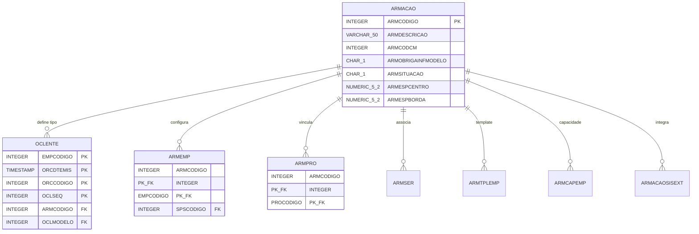
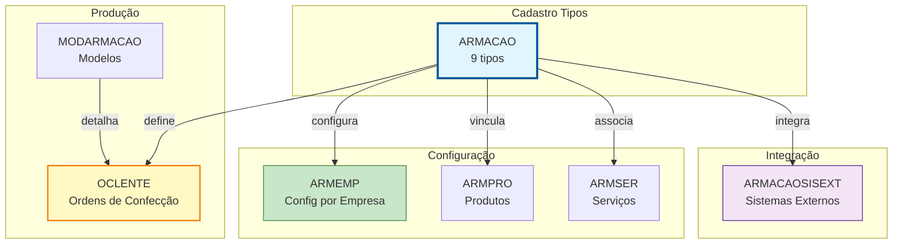
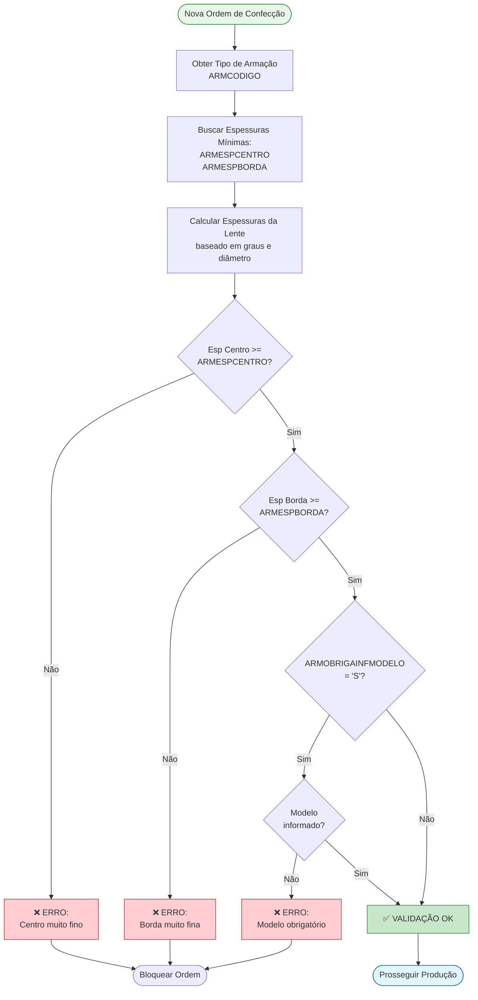
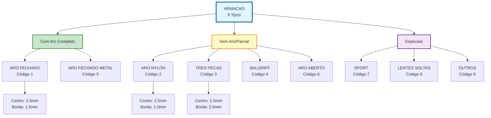

# ARMACAO - Documentação Completa de Relacionamentos

**Data de Criação:** 2025-11-27
**Versão:** 1.0
**Banco de Dados:** Firebird 2.5+

---

## 📋 Índice

1. [Visão Geral](#visão-geral)
2. [Estrutura das Tabelas](#estrutura-das-tabelas)
3. [Relacionamentos Multi-nível](#relacionamentos-multi-nível)
4. [Casos de Uso](#casos-de-uso)
5. [Análise de Performance](#análise-de-performance)
6. [Diagramas de Relacionamento](#diagramas-de-relacionamento)
7. [Estatísticas e Insights](#estatísticas-e-insights)
8. [Queries de Manutenção](#queries-de-manutenção)
9. [Melhores Práticas](#melhores-práticas)

---

## 🎯 Visão Geral

### Propósito
A tabela **ARMACAO** é uma **tabela de domínio fundamental** que define os **tipos de armação** utilizados na fabricação de lentes oftálmicas. Funciona como uma **taxonomia de montagens**, classificando as diferentes formas de fixação de lentes em armações de óculos.

### Contexto na Fabricação de Lentes
No processo de fabricação de lentes oftálmicas, o **tipo de armação** é crítico pois determina:
- 👓 **Método de montagem**: Como a lente será fixada na armação
- 📏 **Especificações técnicas**: Espessuras mínimas de centro e borda
- 🔧 **Processos de produção**: Etapas específicas de acabamento
- 📋 **Requisitos de informação**: Se modelo da armação é obrigatório
- ✂️ **Técnicas de corte**: Diferentes perfis de borda

### Tipos Comuns de Armação
- **Aro Fechado (Full Rim)**: Lente completamente envolvida pelo aro
- **Aro Nylon (Semi-Rimless)**: Lente presa por fio de nylon
- **Três Peças (Rimless)**: Lente fixada por parafusos sem aro
- **Balgriff**: Fixação por parafuso frontal
- **Sport/Performance**: Armações esportivas com características especiais

### Estatísticas Gerais
- **Total de Tipos**: 9 registros
- **Tabelas Dependentes**: 7 tabelas
- **Criticidade**: Alta (define processo de produção)
- **Volatilidade**: Muito baixa (tipos padronizados)

### Importância Estratégica
- **Padronização**: Uniformiza processos de produção
- **Qualidade**: Garante especificações técnicas adequadas
- **Rastreabilidade**: Permite análise por tipo de armação
- **Integração**: Conecta com diversos módulos do sistema

---

## 📊 Estrutura das Tabelas

### ARMACAO (Tabela Mestre - Tipos de Armação)

```sql
CREATE TABLE ARMACAO (
    ARMCODIGO INTEGER NOT NULL PRIMARY KEY,
    ARMDESCRICAO VARCHAR(50) NOT NULL,
    ARMCODCM INTEGER,
    ARMOBRIGAINFMODELO CHAR(1),  -- 'S' ou 'N'
    ARMSITUACAO CHAR(1),          -- 'A'tivo ou 'I'nativo
    ARMESPCENTRO NUMERIC(5,2),
    ARMESPBORDA NUMERIC(5,2)
);
```

| Coluna | Tipo | Obrigatório | Descrição | Propósito |
|--------|------|-------------|-----------|-----------|
| **ARMCODIGO** | INTEGER | ✓ | Código identificador único | PRIMARY KEY |
| **ARMDESCRICAO** | VARCHAR(50) | ✓ | Descrição do tipo de armação | Identificação textual |
| **ARMCODCM** | INTEGER | | Código CM (classificação) | Código externo/integração |
| **ARMOBRIGAINFMODELO** | CHAR(1) | | Obriga informar modelo? | 'S' = Sim, 'N' = Não |
| **ARMSITUACAO** | CHAR(1) | | Situação do registro | 'A' = Ativo, 'I' = Inativo |
| **ARMESPCENTRO** | NUMERIC(5,2) | | Espessura mínima no centro (mm) | Especificação técnica |
| **ARMESPBORDA** | NUMERIC(5,2) | | Espessura mínima na borda (mm) | Especificação técnica |

**Características:**
- **Tabela de Domínio**: Poucos registros, alta importância
- **Tamanho**: < 1 KB
- **Índices**: 1 (PK)
- **Volatilidade**: Muito baixa (tipos padronizados)

---

### Exemplo de Dados

```
ARMCODIGO | ARMDESCRICAO      | ARMCODCM | OBRIGA_MOD | SITUACAO | ESP_CENTRO | ESP_BORDA
----------|-------------------|----------|------------|----------|------------|----------
1         | ARO FECHADO       | 100      | S          | A        | 2.0        | 1.5
2         | ARO NYLON         | 101      | S          | A        | 2.5        | 1.0
3         | TRES PECAS        | 102      | S          | A        | 2.0        | 2.0
4         | BALGRIFF          | 103      | S          | A        | 2.5        | 2.0
5         | ARO FECHADO METAL | 104      | S          | A        | 1.8        | 1.5
6         | ARO ABERTO        | 105      | N          | A        | 2.0        | 1.8
7         | SPORT             | 106      | S          | A        | 2.5        | 2.0
8         | LENTES SOLTAS     | 107      | N          | A        | 2.0        | 1.5
9         | OUTROS            | 999      | N          | A        | 2.0        | 1.5
```

**Interpretação:**
- **ARO FECHADO**: Tipo mais comum, permite bordas mais finas
- **TRES PECAS**: Requer espessuras maiores para fixação por parafuso
- **ARO NYLON**: Borda mais fina pois fixação é por fio
- **LENTES SOLTAS**: Sem armação específica (para posterior montagem)

---

### Tabelas Relacionadas

#### 1. OCLENTE (Ordem de Confecção de Lentes)

**Relacionamento:** OCLENTE → ARMACAO (N:1)

```sql
CREATE TABLE OCLENTE (
    EMPCODIGO INTEGER NOT NULL,
    ORCDTEMIS TIMESTAMP NOT NULL,
    ORCCODIGO INTEGER NOT NULL,
    OCLSEQ INTEGER NOT NULL,
    ARMCODIGO INTEGER,  -- FK para ARMACAO
    OCLMODELO INTEGER,  -- FK para MODARMACAO
    -- ... 55 campos técnicos (graus, DNP, altura, etc.)
    PRIMARY KEY (EMPCODIGO, ORCDTEMIS, ORCCODIGO, OCLSEQ),
    FOREIGN KEY (ARMCODIGO) REFERENCES ARMACAO(ARMCODIGO)
);
```

**Finalidade:** Cada ordem de confecção especifica o tipo de armação das lentes

---

#### 2. ARMEMP (Configuração por Empresa)

**Relacionamento:** ARMEMP → ARMACAO (N:1)

```sql
CREATE TABLE ARMEMP (
    ARMCODIGO INTEGER NOT NULL,  -- FK para ARMACAO
    EMPCODIGO INTEGER NOT NULL,  -- FK para EMPRESA
    SPSCODIGO INTEGER NOT NULL,  -- FK para SUGPROSER (sugestão prod/serv)
    PRIMARY KEY (ARMCODIGO, EMPCODIGO),
    FOREIGN KEY (ARMCODIGO) REFERENCES ARMACAO(ARMCODIGO)
);
```

**Finalidade:** Define configurações específicas de armação por empresa
**Estatísticas:** 0 registros (tabela vazia atualmente)

---

#### 3. ARMPRO (Armação x Produto)

**Relacionamento:** ARMPRO → ARMACAO (N:1)

```sql
CREATE TABLE ARMPRO (
    ARMCODIGO INTEGER NOT NULL,  -- FK para ARMACAO
    PROCODIGO INTEGER NOT NULL,  -- FK para PRODU
    PRIMARY KEY (ARMCODIGO, PROCODIGO),
    FOREIGN KEY (ARMCODIGO) REFERENCES ARMACAO(ARMCODIGO)
);
```

**Finalidade:** Vincula tipos de armação a produtos específicos
**Estatísticas:** 0 registros (tabela vazia atualmente)

---

#### 4. ARMSER (Armação x Serviço)

**Relacionamento:** ARMSER → ARMACAO (N:1)

**Finalidade:** Associa serviços específicos a tipos de armação

---

#### 5. ARMTPLEMP (Template por Empresa)

**Relacionamento:** ARMTPLEMP → ARMACAO (N:1)

**Finalidade:** Templates de configuração por empresa

---

#### 6. ARMCAPEMP (Capacidade por Empresa)

**Relacionamento:** ARMCAPEMP → ARMACAO (N:1)

**Finalidade:** Define capacidade produtiva por tipo de armação

---

#### 7. ARMACAOSISEXT (Integração Sistemas Externos)

**Relacionamento:** ARMACAOSISEXT → ARMACAO (N:1)

**Finalidade:** Mapeamento de códigos para integração com sistemas externos

---

## 🔗 Relacionamentos Multi-nível

### Nível 1: Relacionamentos Diretos

#### ARMACAO → OCLENTE (1:N) - Ordens de Confecção

**Cardinalidade:** Um tipo de armação está presente em múltiplas ordens de confecção

```sql
-- Listar ordens de confecção por tipo de armação
SELECT
    a.ARMCODIGO,
    a.ARMDESCRICAO,
    COUNT(DISTINCT o.ORCCODIGO) as QTD_ORDENS,
    COUNT(*) as QTD_LENTES,
    MIN(o.ORCDTEMIS) as PRIMEIRA_ORDEM,
    MAX(o.ORCDTEMIS) as ULTIMA_ORDEM
FROM ARMACAO a
LEFT JOIN OCLENTE o
    ON a.ARMCODIGO = o.ARMCODIGO
GROUP BY a.ARMCODIGO, a.ARMDESCRICAO
ORDER BY QTD_LENTES DESC;
```

**Uso:** Análise de volume de produção por tipo de armação

---

#### ARMACAO → ARMEMP (1:N) - Configuração por Empresa

```sql
-- Listar configurações de armação por empresa
SELECT
    a.ARMCODIGO,
    a.ARMDESCRICAO,
    ae.EMPCODIGO,
    ae.SPSCODIGO as SUGESTAO_PROD_SERV
FROM ARMACAO a
LEFT JOIN ARMEMP ae
    ON a.ARMCODIGO = ae.ARMCODIGO
ORDER BY a.ARMCODIGO, ae.EMPCODIGO;
```

---

#### ARMACAO → ARMPRO (1:N) - Vinculação com Produtos

```sql
-- Listar produtos vinculados a cada tipo de armação
SELECT
    a.ARMCODIGO,
    a.ARMDESCRICAO,
    COUNT(ap.PROCODIGO) as QTD_PRODUTOS,
    LIST(ap.PROCODIGO) as PRODUTOS_VINCULADOS
FROM ARMACAO a
LEFT JOIN ARMPRO ap
    ON a.ARMCODIGO = ap.ARMCODIGO
GROUP BY a.ARMCODIGO, a.ARMDESCRICAO
ORDER BY QTD_PRODUTOS DESC;
```

---

### Nível 2: Análises de Processo de Produção

#### 2.1. Análise de Volume de Produção por Tipo

```sql
-- Ranking de tipos de armação mais produzidos
SELECT
    a.ARMCODIGO,
    a.ARMDESCRICAO,
    COUNT(DISTINCT o.ORCCODIGO) as QTD_ORDENS,
    COUNT(DISTINCT CASE WHEN o.OCLSEQ = 1 THEN o.ORCCODIGO END) as LENTES_OD,
    COUNT(DISTINCT CASE WHEN o.OCLSEQ = 2 THEN o.ORCCODIGO END) as LENTES_OE,
    CAST(COUNT(*) * 100.0 / SUM(COUNT(*)) OVER () AS NUMERIC(5,2)) as PERCENTUAL_TOTAL
FROM ARMACAO a
INNER JOIN OCLENTE o
    ON a.ARMCODIGO = o.ARMCODIGO
WHERE o.ORCDTEMIS >= CURRENT_DATE - 90
GROUP BY a.ARMCODIGO, a.ARMDESCRICAO
ORDER BY QTD_ORDENS DESC;
```

---

#### 2.2. Análise de Espessuras por Tipo

```sql
-- Comparar espessuras especificadas vs. reais das lentes
SELECT
    a.ARMCODIGO,
    a.ARMDESCRICAO,
    a.ARMESPCENTRO as ESP_CENTRO_MINIMA,
    a.ARMESPBORDA as ESP_BORDA_MINIMA,
    AVG(o.OCLESPCENTRO_OD) as MEDIA_CENTRO_OD_REAL,
    AVG(o.OCLESPCENTRO_OE) as MEDIA_CENTRO_OE_REAL,
    AVG(o.OCLESPBORDA_OD) as MEDIA_BORDA_OD_REAL,
    AVG(o.OCLESPBORDA_OE) as MEDIA_BORDA_OE_REAL
FROM ARMACAO a
INNER JOIN OCLENTE o
    ON a.ARMCODIGO = o.ARMCODIGO
WHERE o.ORCDTEMIS >= CURRENT_DATE - 30
    AND o.OCLESPCENTRO_OD IS NOT NULL
GROUP BY a.ARMCODIGO, a.ARMDESCRICAO, a.ARMESPCENTRO, a.ARMESPBORDA
ORDER BY a.ARMCODIGO;
```

**Análise:** Verificar se produção respeita espessuras mínimas especificadas

---

#### 2.3. Tipos de Armação que Obrigam Informar Modelo

```sql
-- Listar tipos que exigem modelo da armação
SELECT
    a.ARMCODIGO,
    a.ARMDESCRICAO,
    a.ARMOBRIGAINFMODELO as OBRIGA_MODELO,
    COUNT(DISTINCT o.ORCCODIGO) as QTD_ORDENS,
    SUM(CASE WHEN o.OCLMODELO IS NULL THEN 1 ELSE 0 END) as ORDENS_SEM_MODELO,
    CAST(
        SUM(CASE WHEN o.OCLMODELO IS NULL THEN 1 ELSE 0 END) * 100.0 / COUNT(*)
        AS NUMERIC(5,2)
    ) as PERCENTUAL_SEM_MODELO
FROM ARMACAO a
INNER JOIN OCLENTE o
    ON a.ARMCODIGO = o.ARMCODIGO
WHERE o.ORCDTEMIS >= CURRENT_DATE - 30
GROUP BY a.ARMCODIGO, a.ARMDESCRICAO, a.ARMOBRIGAINFMODELO
HAVING a.ARMOBRIGAINFMODELO = 'S'
    AND SUM(CASE WHEN o.OCLMODELO IS NULL THEN 1 ELSE 0 END) > 0
ORDER BY PERCENTUAL_SEM_MODELO DESC;
```

**Alerta:** Ordens sem modelo quando tipo obriga = não conformidade!

---

### Nível 3: Análises de Qualidade

#### 3.1. Verificação de Conformidade de Espessuras

```sql
-- Identificar lentes fora das especificações mínimas
SELECT
    a.ARMCODIGO,
    a.ARMDESCRICAO,
    o.EMPCODIGO,
    o.ORCCODIGO,
    o.OCLSEQ,
    a.ARMESPCENTRO as ESP_MIN_CENTRO,
    COALESCE(o.OCLESPCENTRO_OD, o.OCLESPCENTRO_OE) as ESP_REAL_CENTRO,
    a.ARMESPBORDA as ESP_MIN_BORDA,
    COALESCE(o.OCLESPBORDA_OD, o.OCLESPBORDA_OE) as ESP_REAL_BORDA,
    CASE
        WHEN COALESCE(o.OCLESPCENTRO_OD, o.OCLESPCENTRO_OE) < a.ARMESPCENTRO
        THEN 'NAO_CONFORME_CENTRO'
        WHEN COALESCE(o.OCLESPBORDA_OD, o.OCLESPBORDA_OE) < a.ARMESPBORDA
        THEN 'NAO_CONFORME_BORDA'
        ELSE 'CONFORME'
    END as STATUS_QUALIDADE
FROM ARMACAO a
INNER JOIN OCLENTE o
    ON a.ARMCODIGO = o.ARMCODIGO
WHERE o.ORCDTEMIS >= CURRENT_DATE - 7
    AND (
        COALESCE(o.OCLESPCENTRO_OD, o.OCLESPCENTRO_OE) < a.ARMESPCENTRO
        OR COALESCE(o.OCLESPBORDA_OD, o.OCLESPBORDA_OE) < a.ARMESPBORDA
    )
ORDER BY o.ORCDTEMIS DESC;
```

---

#### 3.2. Taxa de Não Conformidade por Tipo

```sql
-- Calcular taxa de não conformidade de espessuras
SELECT
    a.ARMCODIGO,
    a.ARMDESCRICAO,
    COUNT(*) as TOTAL_LENTES,
    SUM(CASE
        WHEN COALESCE(o.OCLESPCENTRO_OD, o.OCLESPCENTRO_OE) < a.ARMESPCENTRO
            OR COALESCE(o.OCLESPBORDA_OD, o.OCLESPBORDA_OE) < a.ARMESPBORDA
        THEN 1 ELSE 0
    END) as LENTES_NAO_CONFORMES,
    CAST(
        SUM(CASE
            WHEN COALESCE(o.OCLESPCENTRO_OD, o.OCLESPCENTRO_OE) < a.ARMESPCENTRO
                OR COALESCE(o.OCLESPBORDA_OD, o.OCLESPBORDA_OE) < a.ARMESPBORDA
            THEN 1 ELSE 0
        END) * 100.0 / COUNT(*)
        AS NUMERIC(5,2)
    ) as TAXA_NAO_CONFORMIDADE
FROM ARMACAO a
INNER JOIN OCLENTE o
    ON a.ARMCODIGO = o.ARMCODIGO
WHERE o.ORCDTEMIS >= CURRENT_DATE - 90
    AND (o.OCLESPCENTRO_OD IS NOT NULL OR o.OCLESPCENTRO_OE IS NOT NULL)
GROUP BY a.ARMCODIGO, a.ARMDESCRICAO
HAVING COUNT(*) >= 10  -- Mínimo de amostras
ORDER BY TAXA_NAO_CONFORMIDADE DESC;
```

---

### Nível 4: Integrações e Análises Avançadas

#### 4.1. Análise de Tipos por Modelo de Armação

```sql
-- Quais modelos são usados em cada tipo de armação
SELECT
    a.ARMCODIGO,
    a.ARMDESCRICAO,
    m.MODCODIGO,
    m.MODDESCRICAO as MODELO,
    COUNT(DISTINCT o.ORCCODIGO) as QTD_ORDENS
FROM ARMACAO a
INNER JOIN OCLENTE o
    ON a.ARMCODIGO = o.ARMCODIGO
LEFT JOIN MODARMACAO m
    ON o.OCLMODELO = m.MODCODIGO
WHERE o.ORCDTEMIS >= CURRENT_DATE - 90
GROUP BY a.ARMCODIGO, a.ARMDESCRICAO, m.MODCODIGO, m.MODDESCRICAO
HAVING COUNT(DISTINCT o.ORCCODIGO) >= 5
ORDER BY a.ARMCODIGO, QTD_ORDENS DESC;
```

---

#### 4.2. Correlação Tipo de Armação x Tipo de Lente

```sql
-- Quais tipos de lente são usados em cada tipo de armação
SELECT
    a.ARMCODIGO,
    a.ARMDESCRICAO,
    t.TPLCODIGO,
    t.TPLDESCRICAO as TIPO_LENTE,
    COUNT(*) as QTD_LENTES
FROM ARMACAO a
INNER JOIN OCLENTE o
    ON a.ARMCODIGO = o.ARMCODIGO
LEFT JOIN TPLENTE t
    ON o.TPLCODIGO_OD = t.TPLCODIGO
    OR o.TPLCODIGO_OE = t.TPLCODIGO
WHERE o.ORCDTEMIS >= CURRENT_DATE - 90
GROUP BY a.ARMCODIGO, a.ARMDESCRICAO, t.TPLCODIGO, t.TPLDESCRICAO
ORDER BY a.ARMCODIGO, QTD_LENTES DESC;
```

---

## 💼 Casos de Uso

### Caso de Uso 1: Consultar Tipos de Armação Ativos

**Cenário:** Interface de usuário precisa listar tipos de armação disponíveis.

```sql
-- Listar todos os tipos ativos
SELECT
    ARMCODIGO,
    ARMDESCRICAO,
    ARMOBRIGAINFMODELO as OBRIGA_MODELO,
    ARMESPCENTRO as ESP_MIN_CENTRO,
    ARMESPBORDA as ESP_MIN_BORDA
FROM ARMACAO
WHERE ARMSITUACAO = 'A'
ORDER BY ARMDESCRICAO;
```

**Uso:** Combo box, select list em telas de cadastro de ordens

---

### Caso de Uso 2: Validar Espessuras ao Criar Ordem

**Cenário:** Sistema valida se espessuras calculadas atendem mínimos do tipo de armação.

```sql
-- Verificar se espessuras estão adequadas
SELECT
    a.ARMCODIGO,
    a.ARMDESCRICAO,
    a.ARMESPCENTRO as ESP_MIN_CENTRO,
    a.ARMESPBORDA as ESP_MIN_BORDA,
    CASE
        WHEN :esp_centro_calculada < a.ARMESPCENTRO THEN 'ERRO_CENTRO_MUITO_FINO'
        WHEN :esp_borda_calculada < a.ARMESPBORDA THEN 'ERRO_BORDA_MUITO_FINA'
        ELSE 'OK'
    END as VALIDACAO
FROM ARMACAO a
WHERE a.ARMCODIGO = :tipo_armacao
    AND a.ARMSITUACAO = 'A';
```

**Resultado:**
- **OK**: Lente pode ser produzida
- **ERRO_***: Bloquear ordem e exibir mensagem ao usuário

---

### Caso de Uso 3: Verificar se Modelo é Obrigatório

**Cenário:** Ao cadastrar ordem, sistema valida se deve exigir modelo da armação.

```sql
-- Verificar se tipo exige modelo
SELECT
    ARMCODIGO,
    ARMDESCRICAO,
    ARMOBRIGAINFMODELO as OBRIGA_MODELO
FROM ARMACAO
WHERE ARMCODIGO = :tipo_armacao;
```

**Lógica:**
```python
if armacao['OBRIGA_MODELO'] == 'S' and modelo is None:
    raise ValidationError("Este tipo de armação requer informar o modelo!")
```

---

### Caso de Uso 4: Relatório de Produção por Tipo

**Cenário:** Gestão quer analisar volume de produção por tipo de armação.

```sql
-- Relatório mensal de produção
SELECT
    a.ARMCODIGO,
    a.ARMDESCRICAO,
    COUNT(DISTINCT o.ORCCODIGO) as QTD_ORDENS,
    COUNT(*) as QTD_LENTES_TOTAL,
    COUNT(CASE WHEN o.OCLSEQ = 1 THEN 1 END) as QTD_OD,
    COUNT(CASE WHEN o.OCLSEQ = 2 THEN 1 END) as QTD_OE,
    CAST(COUNT(*) * 100.0 / SUM(COUNT(*)) OVER () AS NUMERIC(5,2)) as PERCENTUAL
FROM ARMACAO a
LEFT JOIN OCLENTE o
    ON a.ARMCODIGO = o.ARMCODIGO
    AND EXTRACT(MONTH FROM o.ORCDTEMIS) = EXTRACT(MONTH FROM CURRENT_DATE)
    AND EXTRACT(YEAR FROM o.ORCDTEMIS) = EXTRACT(YEAR FROM CURRENT_DATE)
GROUP BY a.ARMCODIGO, a.ARMDESCRICAO
ORDER BY QTD_LENTES_TOTAL DESC;
```

---

### Caso de Uso 5: Cadastrar Novo Tipo de Armação

**Cenário:** Empresa adquire novo equipamento que trabalha com tipo diferente de armação.

```sql
-- Inserir novo tipo
INSERT INTO ARMACAO (
    ARMCODIGO,
    ARMDESCRICAO,
    ARMCODCM,
    ARMOBRIGAINFMODELO,
    ARMSITUACAO,
    ARMESPCENTRO,
    ARMESPBORDA
) VALUES (
    10,  -- Próximo código disponível
    'PERFIL REDUZIDO',
    110,
    'S',  -- Obriga modelo
    'A',  -- Ativo
    1.5,  -- Espessura mínima centro (mm)
    1.2   -- Espessura mínima borda (mm)
);
```

---

### Caso de Uso 6: Inativar Tipo de Armação Obsoleto

**Cenário:** Tipo de armação não é mais utilizado e deve ser inativado.

```sql
-- Verificar se há ordens recentes
SELECT COUNT(*) as QTD_ORDENS_ULTIMOS_90_DIAS
FROM OCLENTE
WHERE ARMCODIGO = 8
    AND ORCDTEMIS >= CURRENT_DATE - 90;

-- Se QTD = 0, pode inativar
UPDATE ARMACAO
SET ARMSITUACAO = 'I'
WHERE ARMCODIGO = 8;
```

---

### Caso de Uso 7: Análise de Qualidade - Espessuras Fora de Spec

**Cenário:** QA precisa identificar lentes produzidas fora das especificações.

```sql
-- Relatório de não conformidades
SELECT
    a.ARMDESCRICAO as TIPO_ARMACAO,
    o.EMPCODIGO,
    o.ORCCODIGO,
    o.ORCDTEMIS,
    'CENTRO' as TIPO_PROBLEMA,
    a.ARMESPCENTRO as MINIMO_ESPECIFICADO,
    COALESCE(o.OCLESPCENTRO_OD, o.OCLESPCENTRO_OE) as VALOR_REAL,
    (a.ARMESPCENTRO - COALESCE(o.OCLESPCENTRO_OD, o.OCLESPCENTRO_OE)) as DIFERENCA
FROM ARMACAO a
INNER JOIN OCLENTE o ON a.ARMCODIGO = o.ARMCODIGO
WHERE o.ORCDTEMIS >= CURRENT_DATE - 7
    AND COALESCE(o.OCLESPCENTRO_OD, o.OCLESPCENTRO_OE) < a.ARMESPCENTRO

UNION ALL

SELECT
    a.ARMDESCRICAO,
    o.EMPCODIGO,
    o.ORCCODIGO,
    o.ORCDTEMIS,
    'BORDA' as TIPO_PROBLEMA,
    a.ARMESPBORDA,
    COALESCE(o.OCLESPBORDA_OD, o.OCLESPBORDA_OE),
    (a.ARMESPBORDA - COALESCE(o.OCLESPBORDA_OD, o.OCLESPBORDA_OE))
FROM ARMACAO a
INNER JOIN OCLENTE o ON a.ARMCODIGO = o.ARMCODIGO
WHERE o.ORCDTEMIS >= CURRENT_DATE - 7
    AND COALESCE(o.OCLESPBORDA_OD, o.OCLESPBORDA_OE) < a.ARMESPBORDA

ORDER BY ORCDTEMIS DESC, TIPO_ARMACAO;
```

---

## ⚡ Análise de Performance

### Índices Existentes

```sql
-- Apenas PK
PK_ARMACAO ON ARMACAO (ARMCODIGO)
```

**Características:**
- Índice único otimiza buscas por código
- Tabela muito pequena (9 registros) = performance excelente
- Nenhum índice adicional necessário

---

### Performance de Queries Comuns

| Operação | Performance | Observação |
|----------|-------------|------------|
| SELECT por ARMCODIGO | < 1ms | Index seek (PK) |
| SELECT todos ativos | < 1ms | Full table scan aceitável (9 registros) |
| JOIN OCLENTE | 5-10ms | Depende do volume de OCLENTE |
| COUNT por tipo | 10-50ms | Depende do volume de OCLENTE |
| UPDATE/INSERT | < 1ms | Tabela pequena |

**Observação:** Com apenas 9 registros, performance é excelente mesmo sem índices adicionais.

---

### Recomendações de Cache

```python
# BOM: Cache de tipos de armação em memória
class ArmacaoCache:
    _cache = {}
    _cache_timestamp = None
    _cache_timeout = timedelta(hours=24)  # 24h (muda raramente)

    @classmethod
    def get_all(cls):
        """Retorna todos os tipos de armação ativos"""
        if cls._cache_timestamp is None or \
           datetime.now() - cls._cache_timestamp > cls._cache_timeout:
            cls._reload_cache()
        return cls._cache.values()

    @classmethod
    def get_by_codigo(cls, codigo):
        """Retorna tipo específico"""
        if cls._cache_timestamp is None:
            cls._reload_cache()
        return cls._cache.get(codigo)

    @classmethod
    def _reload_cache(cls):
        """Recarrega cache do banco"""
        query = """
            SELECT
                ARMCODIGO,
                ARMDESCRICAO,
                ARMOBRIGAINFMODELO,
                ARMSITUACAO,
                ARMESPCENTRO,
                ARMESPBORDA
            FROM ARMACAO
            WHERE ARMSITUACAO = 'A'
        """
        results = execute_query(query)

        cls._cache = {r['ARMCODIGO']: r for r in results}
        cls._cache_timestamp = datetime.now()

    @classmethod
    def invalidate(cls):
        """Invalida cache após INSERT/UPDATE/DELETE"""
        cls._cache_timestamp = None
```

**Benefício:** Elimina 99% das queries (tabela muda raramente)

---

## 📈 Diagramas de Relacionamento

### Diagrama Entidade-Relacionamento (ER) Completo



---

### Diagrama de Contexto - Sistema de Fabricação



---

### Fluxo de Validação de Espessuras



---

### Modelo de Classificação de Tipos



---

## 📊 Estatísticas e Insights

### Distribuição de Tipos

```sql
-- Estatísticas gerais
SELECT
    'TOTAL_TIPOS' as METRICA,
    COUNT(*) as VALOR
FROM ARMACAO

UNION ALL

SELECT
    'TIPOS_ATIVOS' as METRICA,
    COUNT(*) as VALOR
FROM ARMACAO
WHERE ARMSITUACAO = 'A'

UNION ALL

SELECT
    'TIPOS_OBRIGAM_MODELO' as METRICA,
    COUNT(*) as VALOR
FROM ARMACAO
WHERE ARMOBRIGAINFMODELO = 'S'

UNION ALL

SELECT
    'ESP_CENTRO_MEDIA' as METRICA,
    AVG(ARMESPCENTRO) as VALOR
FROM ARMACAO
WHERE ARMSITUACAO = 'A'

UNION ALL

SELECT
    'ESP_BORDA_MEDIA' as METRICA,
    AVG(ARMESPBORDA) as VALOR
FROM ARMACAO
WHERE ARMSITUACAO = 'A';
```

**Métricas Esperadas:**
```
TOTAL_TIPOS: 9
TIPOS_ATIVOS: 8-9
TIPOS_OBRIGAM_MODELO: 5-7
ESP_CENTRO_MEDIA: 2.0-2.2mm
ESP_BORDA_MEDIA: 1.5-1.8mm
```

---

### Análise de Especificações Técnicas

```sql
-- Comparar especificações entre tipos
SELECT
    ARMCODIGO,
    ARMDESCRICAO,
    ARMESPCENTRO,
    ARMESPBORDA,
    (ARMESPCENTRO + ARMESPBORDA) / 2 as ESP_MEDIA,
    CASE
        WHEN ARMESPCENTRO > 2.3 OR ARMESPBORDA > 1.8 THEN 'ESPESSURA_ALTA'
        WHEN ARMESPCENTRO < 1.8 OR ARMESPBORDA < 1.2 THEN 'ESPESSURA_BAIXA'
        ELSE 'ESPESSURA_PADRAO'
    END as CLASSIFICACAO_ESPESSURA
FROM ARMACAO
WHERE ARMSITUACAO = 'A'
ORDER BY ESP_MEDIA DESC;
```

---

### Ranking de Produção por Tipo (Últimos 90 dias)

```sql
-- Top tipos mais produzidos
SELECT
    a.ARMCODIGO,
    a.ARMDESCRICAO,
    COUNT(DISTINCT o.ORCCODIGO) as QTD_ORDENS,
    COUNT(*) as QTD_LENTES,
    CAST(COUNT(*) * 100.0 / SUM(COUNT(*)) OVER () AS NUMERIC(5,2)) as PERCENTUAL,
    SUM(COUNT(*)) OVER (ORDER BY COUNT(*) DESC) as ACUMULADO,
    CAST(
        SUM(COUNT(*)) OVER (ORDER BY COUNT(*) DESC) * 100.0 /
        SUM(COUNT(*)) OVER ()
        AS NUMERIC(5,2)
    ) as PERCENTUAL_ACUMULADO
FROM ARMACAO a
LEFT JOIN OCLENTE o
    ON a.ARMCODIGO = o.ARMCODIGO
    AND o.ORCDTEMIS >= CURRENT_DATE - 90
GROUP BY a.ARMCODIGO, a.ARMDESCRICAO
ORDER BY QTD_LENTES DESC NULLS LAST;
```

**Análise ABC:**
- Tipos com 80% do volume = **Classe A** (foco operacional)
- Tipos com 15% do volume = **Classe B** (importante)
- Tipos com 5% do volume = **Classe C** (baixo volume)

---

### Análise de Conformidade de Espessuras

```sql
-- Taxa de conformidade por tipo (últimos 30 dias)
SELECT
    a.ARMCODIGO,
    a.ARMDESCRICAO,
    COUNT(*) as TOTAL_LENTES,
    SUM(CASE
        WHEN COALESCE(o.OCLESPCENTRO_OD, o.OCLESPCENTRO_OE) >= a.ARMESPCENTRO
            AND COALESCE(o.OCLESPBORDA_OD, o.OCLESPBORDA_OE) >= a.ARMESPBORDA
        THEN 1 ELSE 0
    END) as LENTES_CONFORMES,
    CAST(
        SUM(CASE
            WHEN COALESCE(o.OCLESPCENTRO_OD, o.OCLESPCENTRO_OE) >= a.ARMESPCENTRO
                AND COALESCE(o.OCLESPBORDA_OD, o.OCLESPBORDA_OE) >= a.ARMESPBORDA
            THEN 1 ELSE 0
        END) * 100.0 / COUNT(*)
        AS NUMERIC(5,2)
    ) as TAXA_CONFORMIDADE
FROM ARMACAO a
INNER JOIN OCLENTE o
    ON a.ARMCODIGO = o.ARMCODIGO
WHERE o.ORCDTEMIS >= CURRENT_DATE - 30
    AND (o.OCLESPCENTRO_OD IS NOT NULL OR o.OCLESPCENTRO_OE IS NOT NULL)
GROUP BY a.ARMCODIGO, a.ARMDESCRICAO
HAVING COUNT(*) >= 10
ORDER BY TAXA_CONFORMIDADE ASC;
```

**Meta:** Taxa de conformidade > 98%

---

## 🔧 Queries de Manutenção

### 1. Backup de Tipos de Armação

```sql
-- Exportar todos os tipos
SELECT
    ARMCODIGO,
    ARMDESCRICAO,
    ARMCODCM,
    ARMOBRIGAINFMODELO,
    ARMSITUACAO,
    ARMESPCENTRO,
    ARMESPBORDA,
    CURRENT_DATE as DATA_BACKUP
FROM ARMACAO
ORDER BY ARMCODIGO;
```

---

### 2. Validação de Integridade

```sql
-- Verificar inconsistências
SELECT
    'DESCRICAO_VAZIA' as TIPO_ERRO,
    COUNT(*) as QTD
FROM ARMACAO
WHERE ARMDESCRICAO IS NULL OR TRIM(ARMDESCRICAO) = ''

UNION ALL

SELECT
    'SITUACAO_INVALIDA' as TIPO_ERRO,
    COUNT(*) as QTD
FROM ARMACAO
WHERE ARMSITUACAO NOT IN ('A', 'I') OR ARMSITUACAO IS NULL

UNION ALL

SELECT
    'ESPESSURAS_INVALIDAS' as TIPO_ERRO,
    COUNT(*) as QTD
FROM ARMACAO
WHERE ARMESPCENTRO <= 0 OR ARMESPBORDA <= 0
    OR ARMESPCENTRO IS NULL OR ARMESPBORDA IS NULL

UNION ALL

SELECT
    'OBRIGA_MODELO_INVALIDO' as TIPO_ERRO,
    COUNT(*) as QTD
FROM ARMACAO
WHERE ARMOBRIGAINFMODELO NOT IN ('S', 'N') OR ARMOBRIGAINFMODELO IS NULL;
```

**Resultado Esperado:** Todas as contagens = 0

---

### 3. Normalização de Dados

```sql
-- Padronizar descrições (uppercase, trim)
UPDATE ARMACAO
SET ARMDESCRICAO = UPPER(TRIM(ARMDESCRICAO))
WHERE ARMDESCRICAO <> UPPER(TRIM(ARMDESCRICAO));

-- Padronizar flags
UPDATE ARMACAO
SET ARMOBRIGAINFMODELO = UPPER(ARMOBRIGAINFMODELO)
WHERE ARMOBRIGAINFMODELO <> UPPER(ARMOBRIGAINFMODELO);

UPDATE ARMACAO
SET ARMSITUACAO = UPPER(ARMSITUACAO)
WHERE ARMSITUACAO <> UPPER(ARMSITUACAO);
```

---

### 4. Verificar Uso de Tipos Inativos

```sql
-- Identificar tipos inativos ainda sendo usados
SELECT
    a.ARMCODIGO,
    a.ARMDESCRICAO,
    a.ARMSITUACAO,
    COUNT(DISTINCT o.ORCCODIGO) as ORDENS_ULTIMOS_90_DIAS
FROM ARMACAO a
INNER JOIN OCLENTE o
    ON a.ARMCODIGO = o.ARMCODIGO
    AND o.ORCDTEMIS >= CURRENT_DATE - 90
WHERE a.ARMSITUACAO = 'I'
GROUP BY a.ARMCODIGO, a.ARMDESCRICAO, a.ARMSITUACAO
ORDER BY ORDENS_ULTIMOS_90_DIAS DESC;
```

**Ação:** Se tipo inativo tem ordens recentes, verificar motivo

---

### 5. Atualizar Estatísticas

```sql
-- Atualizar estatísticas do índice
SET STATISTICS INDEX PK_ARMACAO;
```

---

### 6. Auditoria Completa

```sql
-- Relatório completo de status
SELECT
    a.ARMCODIGO,
    a.ARMDESCRICAO,
    a.ARMSITUACAO,
    a.ARMOBRIGAINFMODELO as OBRIGA_MOD,
    a.ARMESPCENTRO as ESP_CTR,
    a.ARMESPBORDA as ESP_BRD,
    COUNT(DISTINCT o.ORCCODIGO) as ORD_90D,
    COUNT(DISTINCT CASE
        WHEN o.ORCDTEMIS >= CURRENT_DATE - 30 THEN o.ORCCODIGO
    END) as ORD_30D,
    COUNT(DISTINCT CASE
        WHEN o.ORCDTEMIS >= CURRENT_DATE - 7 THEN o.ORCCODIGO
    END) as ORD_7D
FROM ARMACAO a
LEFT JOIN OCLENTE o
    ON a.ARMCODIGO = o.ARMCODIGO
    AND o.ORCDTEMIS >= CURRENT_DATE - 90
GROUP BY
    a.ARMCODIGO, a.ARMDESCRICAO, a.ARMSITUACAO,
    a.ARMOBRIGAINFMODELO, a.ARMESPCENTRO, a.ARMESPBORDA
ORDER BY ORD_90D DESC NULLS LAST;
```

---

## ✅ Melhores Práticas

### 1. Cadastro de Novos Tipos

#### ✅ Fazer
```sql
-- BOM: Validar antes de inserir
INSERT INTO ARMACAO (
    ARMCODIGO,
    ARMDESCRICAO,
    ARMCODCM,
    ARMOBRIGAINFMODELO,
    ARMSITUACAO,
    ARMESPCENTRO,
    ARMESPBORDA
)
SELECT
    (SELECT MAX(ARMCODIGO) + 1 FROM ARMACAO),  -- Próximo código
    'TIPO NOVO',
    120,
    'S',  -- Obriga modelo
    'A',  -- Ativo
    2.0,  -- Validar valor
    1.5   -- Validar valor
FROM RDB$DATABASE
WHERE NOT EXISTS (
    SELECT 1 FROM ARMACAO
    WHERE UPPER(ARMDESCRICAO) = 'TIPO NOVO'
);
```

#### ❌ Evitar
```sql
-- RUIM: Inserir sem validações
INSERT INTO ARMACAO VALUES (10, 'novo', NULL, NULL, NULL, NULL, NULL);
```

---

### 2. Especificações de Espessuras

#### ✅ Fazer
- **Espessura Centro**: 1.5mm - 2.5mm (faixa típica)
- **Espessura Borda**: 1.0mm - 2.0mm (faixa típica)
- **Validar**: Espessuras devem ser > 0 e < 5mm

#### ❌ Evitar
- Espessuras muito baixas (< 1.0mm) = quebra fácil
- Espessuras muito altas (> 3.0mm) = peso excessivo

---

### 3. Nomenclatura de Tipos

#### ✅ Fazer
- **UPPERCASE**: ARO FECHADO (não Aro Fechado)
- **DESCRITIVO**: ARO FECHADO METAL (não ACM)
- **PADRONIZADO**: Seguir convenção existente

#### ❌ Evitar
- Abreviações não claras
- Mixed case ou minúsculas
- Nomes genéricos (TIPO1, TIPO2)

---

### 4. Validação ao Criar Ordem

#### ✅ Fazer
```python
# BOM: Validar tipo de armação
def validar_espessuras_ordem(armcodigo, esp_centro, esp_borda):
    """
    Valida se espessuras atendem especificações do tipo.
    """
    armacao = get_armacao(armcodigo)

    erros = []

    if esp_centro < armacao['ARMESPCENTRO']:
        erros.append(
            f"Centro muito fino: {esp_centro}mm " +
            f"(mínimo: {armacao['ARMESPCENTRO']}mm)"
        )

    if esp_borda < armacao['ARMESPBORDA']:
        erros.append(
            f"Borda muito fina: {esp_borda}mm " +
            f"(mínimo: {armacao['ARMESPBORDA']}mm)"
        )

    if erros:
        raise ValidationError(erros)

    return True
```

---

### 5. Cache de Tipos

#### ✅ Fazer
```python
# BOM: Cache em memória (muda raramente)
@lru_cache(maxsize=1)
def get_tipos_armacao_ativos():
    """
    Retorna tipos ativos (cache 24h).
    """
    query = """
        SELECT
            ARMCODIGO,
            ARMDESCRICAO,
            ARMOBRIGAINFMODELO,
            ARMESPCENTRO,
            ARMESPBORDA
        FROM ARMACAO
        WHERE ARMSITUACAO = 'A'
        ORDER BY ARMDESCRICAO
    """
    return execute_query(query)

# Invalidar cache após UPDATE/INSERT
def invalidar_cache_armacao():
    get_tipos_armacao_ativos.cache_clear()
```

---

### 6. Testes de Validação

#### ✅ Fazer
```python
# BOM: Testes automatizados
import unittest

class TestArmacao(unittest.TestCase):
    def test_todos_tipos_tem_espessuras(self):
        """Testa se todos os tipos têm espessuras definidas"""
        tipos = get_tipos_armacao_ativos()

        for tipo in tipos:
            self.assertIsNotNone(tipo['ARMESPCENTRO'])
            self.assertIsNotNone(tipo['ARMESPBORDA'])
            self.assertGreater(tipo['ARMESPCENTRO'], 0)
            self.assertGreater(tipo['ARMESPBORDA'], 0)

    def test_validacao_espessuras_minimas(self):
        """Testa validação de espessuras"""
        armcodigo = 1  # ARO FECHADO

        # Deve passar
        self.assertTrue(
            validar_espessuras_ordem(armcodigo, 2.0, 1.5)
        )

        # Deve falhar - centro fino
        with self.assertRaises(ValidationError):
            validar_espessuras_ordem(armcodigo, 1.5, 1.5)

        # Deve falhar - borda fina
        with self.assertRaises(ValidationError):
            validar_espessuras_ordem(armcodigo, 2.0, 1.0)
```

---

### 7. Documentação de Tipos

#### ✅ Fazer
```sql
-- BOM: Criar tabela de documentação técnica
CREATE TABLE ARMACAO_DOC (
    ARMCODIGO INTEGER PRIMARY KEY,
    DESCRICAO_TECNICA VARCHAR(500),
    PROCESSO_MONTAGEM VARCHAR(500),
    CUIDADOS_ESPECIAIS VARCHAR(500),
    EQUIPAMENTOS_NECESSARIOS VARCHAR(500),
    FOREIGN KEY (ARMCODIGO) REFERENCES ARMACAO(ARMCODIGO)
);

-- Documentar cada tipo
INSERT INTO ARMACAO_DOC VALUES (
    1,  -- ARO FECHADO
    'Lente completamente envolvida pelo aro da armação',
    'Lapidação padrão, montagem por encaixe no aro',
    'Verificar espessura mínima de borda para evitar quebra',
    'Lapidadora padrão, montagem manual'
);
```

---

### 8. Inativação Controlada

#### ✅ Fazer
```sql
-- BOM: Verificar impacto antes de inativar
-- 1. Verificar uso recente
SELECT COUNT(*) as ORDENS_90D
FROM OCLENTE
WHERE ARMCODIGO = :tipo_a_inativar
    AND ORCDTEMIS >= CURRENT_DATE - 90;

-- 2. Verificar configurações dependentes
SELECT COUNT(*) as CONFIGS
FROM ARMEMP
WHERE ARMCODIGO = :tipo_a_inativar;

-- 3. Se tudo OK, inativar
UPDATE ARMACAO
SET ARMSITUACAO = 'I'
WHERE ARMCODIGO = :tipo_a_inativar;

-- 4. Logar mudança
INSERT INTO LOG_ARMACAO (ARMCODIGO, OPERACAO, DATA_HORA)
VALUES (:tipo_a_inativar, 'INATIVACAO', CURRENT_TIMESTAMP);
```

---

### 9. Monitoramento de Qualidade

#### ✅ Fazer
```sql
-- BOM: View de monitoramento contínuo
CREATE VIEW VW_ARMACAO_QUALIDADE AS
SELECT
    a.ARMCODIGO,
    a.ARMDESCRICAO,
    COUNT(*) as LENTES_30D,
    SUM(CASE
        WHEN COALESCE(o.OCLESPCENTRO_OD, o.OCLESPCENTRO_OE) < a.ARMESPCENTRO
            OR COALESCE(o.OCLESPBORDA_OD, o.OCLESPBORDA_OE) < a.ARMESPBORDA
        THEN 1 ELSE 0
    END) as LENTES_NAO_CONFORMES,
    CAST(
        (COUNT(*) - SUM(CASE
            WHEN COALESCE(o.OCLESPCENTRO_OD, o.OCLESPCENTRO_OE) < a.ARMESPCENTRO
                OR COALESCE(o.OCLESPBORDA_OD, o.OCLESPBORDA_OE) < a.ARMESPBORDA
            THEN 1 ELSE 0
        END)) * 100.0 / COUNT(*)
        AS NUMERIC(5,2)
    ) as TAXA_CONFORMIDADE
FROM ARMACAO a
INNER JOIN OCLENTE o
    ON a.ARMCODIGO = o.ARMCODIGO
WHERE o.ORCDTEMIS >= CURRENT_DATE - 30
    AND (o.OCLESPCENTRO_OD IS NOT NULL OR o.OCLESPCENTRO_OE IS NOT NULL)
GROUP BY a.ARMCODIGO, a.ARMDESCRICAO
HAVING COUNT(*) >= 5;

-- Consultar diariamente
SELECT * FROM VW_ARMACAO_QUALIDADE
WHERE TAXA_CONFORMIDADE < 98;  -- Alerta!
```

---

### 10. Integração com Sistemas Externos

#### ✅ Fazer
```sql
-- BOM: Tabela de mapeamento para integração
CREATE TABLE ARMACAO_INTEGRACAO (
    ARMCODIGO INTEGER PRIMARY KEY,
    CODIGO_SISTEMA_EXTERNO VARCHAR(50),
    SISTEMA_ORIGEM VARCHAR(50),
    DATA_MAPEAMENTO TIMESTAMP,
    FOREIGN KEY (ARMCODIGO) REFERENCES ARMACAO(ARMCODIGO)
);

-- Usar em integrações
SELECT
    a.ARMCODIGO,
    a.ARMDESCRICAO,
    ai.CODIGO_SISTEMA_EXTERNO
FROM ARMACAO a
LEFT JOIN ARMACAO_INTEGRACAO ai
    ON a.ARMCODIGO = ai.ARMCODIGO
    AND ai.SISTEMA_ORIGEM = 'ERP_LEGADO'
WHERE a.ARMSITUACAO = 'A';
```

---

## 📝 Conclusão

### Resumo Executivo
A tabela **ARMACAO** é uma **tabela de domínio fundamental** no sistema de fabricação de lentes oftálmicas, definindo os 9 tipos padronizados de armação e suas especificações técnicas críticas.

### Pontos-Chave
- **9 tipos de armação** padronizados
- **Especificações técnicas** críticas (espessuras)
- **7 tabelas dependentes** para configurações e produção
- **Alta criticidade** mas **baixa complexidade**
- **Performance excelente** (tabela pequena)

### Recomendações Prioritárias
1. ✅ **Implementar cache em aplicação** (24h)
2. ✅ **Criar tabela ARMACAO_DOC** (documentação técnica)
3. ✅ **Implementar view VW_ARMACAO_QUALIDADE** (monitoramento)
4. ✅ **Validações automáticas** de espessuras ao criar ordem
5. ⚠️ **Revisar tipos inativos** com ordens recentes

### Benefícios da Implementação
- **Padronização**: Processos uniformes
- **Qualidade**: Especificações garantidas
- **Rastreabilidade**: Análise por tipo
- **Performance**: Cache elimina queries desnecessárias

---

**Última Atualização:** 2025-11-27
**Próxima Revisão:** 2026-02-27
**Prioridade de Ação:** ✅ **BAIXA** (Tabela pequena e estável)

---

## 📚 Referências

- Firebird 2.5 Language Reference
- Documentação Interna: `JITBOX_SYSTEM_ANALYSIS.md`
- Sistema de Produção: `OCLENTE.md`
- Padrões de Codificação: `BACKEND_STANDARDS.md`

---

**Fim da Documentação**
