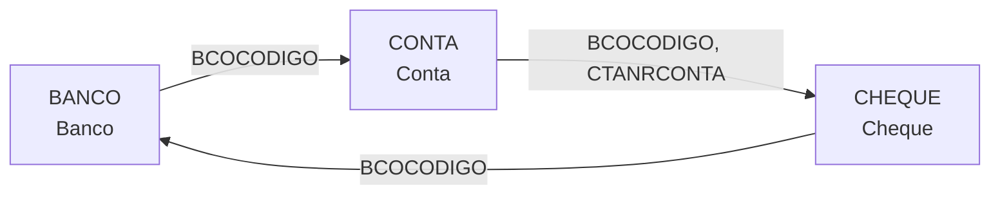
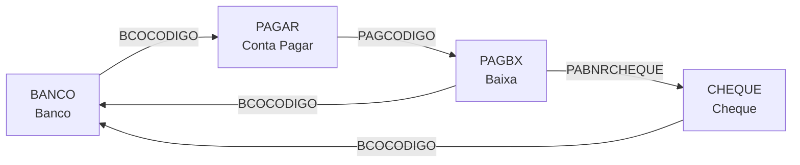
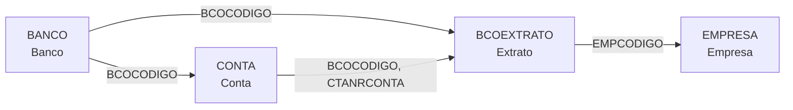
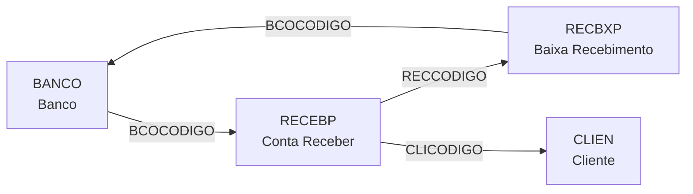
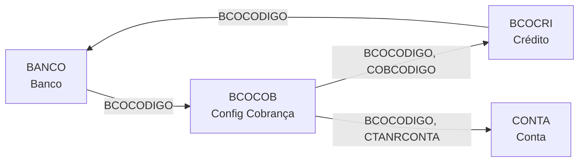
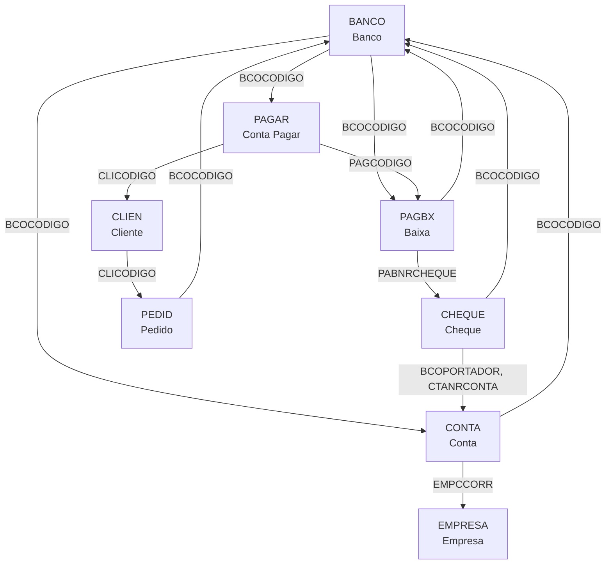

# BANCO - Documentação Completa de Relacionamentos

## 📊 Informações Gerais

- **Nome da Tabela**: BANCO (Cadastro de Bancos)
- **Total de Registros**: 108
- **Total de Colunas**: 7
- **Chave Primária**: BCOCODIGO
- **Chaves Estrangeiras**: 0 (tabela mestre)
- **Índices**: 0
- **Tabelas Dependentes**: 28 (tabela referenciada por múltiplas entidades)
- **Banco de Dados**: Firebird

## 📝 Descrição

**BANCO** é a tabela mestre que armazena o cadastro de todas as instituições bancárias utilizadas no sistema. Com apenas **108 registros**, é uma tabela pequena mas **altamente referenciada** por **28 tabelas diferentes**, tornando-a um componente central do módulo financeiro.

Esta tabela funciona como **catálogo de bancos** e é utilizada em diversos contextos:
- **Contas bancárias** (CONTA)
- **Contas a pagar e receber** (PAGAR, RECEBER)
- **Cheques** (CHEQUE)
- **Extratos bancários** (BCOEXTRATO)
- **Cobranças e pagamentos** (COBCLI, PAGBX, RECBX)
- **Pedidos** (PEDID)
- **Notas fiscais** (NOTAC, NOTAE)
- **Filiais e empresas** (EMPFILIAL)
- **Frente de caixa** (FRENTECAIXA)

Cada banco possui informações sobre:
- Nome e identificação
- Número de compensação (BCONRCOMP)
- Controle de caixa (BCOLCCAIXA)
- Sequência de títulos (BCOSEQTIT)
- Link para internet banking (BCOLINK)
- Flag de internet banking (BCOINTERNET)

---

## 🔑 Estrutura de Colunas

### Identificação
| Coluna | Tipo | Descrição |
|--------|------|-----------|
| **BCOCODIGO** 🔑 | SMALLINT | Código único do banco (PK) |

### Informações Básicas
| Coluna | Tipo | Descrição |
|--------|------|-----------|
| **BCONOME** | VARCHAR(37) | Nome do banco (obrigatório) |
| **BCONRCOMP** | VARCHAR(14) | Número de compensação bancária |
| **BCOLCCAIXA** | VARCHAR(14) | Flag indicando se é banco de caixa (S/N) |
| **BCOSEQTIT** | INTEGER | Sequência para numeração de títulos |
| **BCOLINK** | VARCHAR(37) | Link/URL do internet banking |
| **BCOINTERNET** | VARCHAR(14) | Flag indicando se possui internet banking (S/N) |

---

## 🔗 Relacionamentos - Nível 1 (Diretos)

BANCO é referenciada por **28 tabelas diferentes**. Vamos organizá-las por categoria funcional:

### Categoria 1: Contas Bancárias e Extratos

#### CONTA - Contas Bancárias
**Volume:** 55 registros

**Relacionamento:**
```
CONTA.BCOCODIGO → BANCO.BCOCODIGO (N:1) [FK: BANCO_CONTA]
```

**Descrição:** Cada conta bancária pertence a um banco específico. CONTA possui chave primária composta incluindo BCOCODIGO, estabelecendo uma relação forte com BANCO.

**Campos importantes em CONTA:**
- `CTANRCONTA` - Número da conta
- `CTAAGENCIA` - Agência bancária
- `CTASALDOIMPL` - Saldo inicial
- `CTAVRLIMITE` - Valor limite da conta

**Proporção:** ~0.5 contas por banco em média

---

#### BCOEXTRATO - Extratos Bancários
**Volume:** 100 registros

**Relacionamento:**
```
BCOEXTRATO.BCOCODIGO → BANCO.BCOCODIGO (N:1) [FK: BCOEXTRATO_BANCO]
```

**Descrição:** Extratos bancários importados estão vinculados ao banco de origem.

**Campos importantes em BCOEXTRATO:**
- `NRCONTA` - Número da conta do extrato
- `EMPCODIGO` - Empresa
- `BCEARQUIVO` - Arquivo do extrato
- `BCEDATA` - Data do extrato

**Proporção:** ~0.9 extratos por banco em média

---

### Categoria 2: Contas a Pagar

#### PAGAR - Contas a Pagar
**Volume:** ~138.000+ registros

**Relacionamento:**
```
PAGAR.BCOCODIGO → BANCO.BCOCODIGO (N:1) [FK: BANCO_PAGAR]
```

**Descrição:** Contas a pagar podem estar vinculadas a um banco específico para pagamento.

**Campos importantes em PAGAR:**
- `PAGCODIGO` - Código da conta a pagar
- `CLICODIGO` - Cliente/Fornecedor
- `PAGDTVENCTO` - Data de vencimento
- `PAGVALOR` - Valor da conta

**Proporção:** Múltiplas contas a pagar por banco

---

#### PAGBX - Baixas de Pagamento
**Volume:** 138.447 registros

**Relacionamento:**
```
PAGBX.BCOCODIGO → BANCO.BCOCODIGO (N:1) [FK: BANCO_PAGBX]
```

**Descrição:** Baixas de pagamento registram qual banco foi utilizado para efetuar o pagamento.

**Campos importantes em PAGBX:**
- `PAGCODIGO` - Código da conta a pagar
- `PABDTPAGTO` - Data do pagamento
- `PABDTLIQ` - Data de liquidação
- `PABVALOR` - Valor pago
- `PABNRCHEQUE` - Número do cheque (se aplicável)

**Proporção:** ~1.281 baixas por banco em média

---

#### PAGARP - Parcelas de Contas a Pagar
**Volume:** Variável

**Relacionamento:**
```
PAGARP.BCOCODIGO → BANCO.BCOCODIGO (N:1) [FK: BANCOS_PAGARP]
```

**Descrição:** Parcelas de contas a pagar vinculadas ao banco.

---

#### PAGBXP - Baixas de Parcelas de Pagamento
**Volume:** Variável

**Relacionamento:**
```
PAGBXP.BCOCODIGO → BANCO.BCOCODIGO (N:1) [FK: BANCO_PAGBXP]
```

**Descrição:** Baixas de parcelas de pagamento.

---

### Categoria 3: Contas a Receber

#### RECEBP - Contas a Receber
**Volume:** Variável (baixo volume, ~3 registros)

**Relacionamento:**
```
RECEBP.BCOCODIGO → BANCO.BCOCODIGO (N:1) [FK: BANCO_RECEBP]
```

**Descrição:** Contas a receber vinculadas ao banco para recebimento.

**Campos importantes em RECEBP:**
- `RECCODIGO` - Código da conta a receber
- `CLICODIGO` - Cliente
- `RECDTVENCTO` - Data de vencimento
- `RECVALOR` - Valor a receber

---

#### RECBXP - Baixas de Recebimento
**Volume:** Variável

**Relacionamento:**
```
RECBXP.BCOCODIGO → BANCO.BCOCODIGO (N:1) [FK: BANCO_RECBXP]
```

**Descrição:** Baixas de recebimento indicando qual banco recebeu o pagamento.

---

### Categoria 4: Cheques

#### CHEQUE - Cheques
**Volume:** Variável

**Relacionamento:**
```
CHEQUE.BCOCODIGO → BANCO.BCOCODIGO (N:1) [FK: BANCO_CHEQUE]
```

**Descrição:** Cheques emitidos ou recebidos vinculados ao banco emissor.

**Campos importantes em CHEQUE:**
- `CHNRCHEQUE` - Número do cheque
- `CHAGENCIA` - Agência
- `CHNRCONTA` - Número da conta
- `CHDTCAD` - Data de cadastro
- `CHSITUACAO` - Situação do cheque

**Observação:** CHEQUE também referencia CONTA através de `BCOPORTADOR`, `CTANRCONTA`, `EMPCCORR`.

---

### Categoria 5: Cobranças e Pagamentos

#### COBCLI - Cobranças de Clientes
**Volume:** Variável

**Relacionamento:**
```
COBCLI.BCOCODIGO → BANCO.BCOCODIGO (N:1) [FK: BANCO_COBCLI]
```

**Descrição:** Configurações de cobrança por banco.

---

#### BCOCOB - Configurações de Cobrança Bancária
**Volume:** Variável

**Relacionamento:**
```
BCOCOB.BCOCODIGO → BANCO.BCOCODIGO (N:1) [FK: BANCO_BCOCOB]
```

**Descrição:** Configurações específicas de cobrança para cada banco.

**Campos importantes em BCOCOB:**
- `COBCODIGO` - Código da configuração
- `COBNOME` - Nome da configuração
- `COBCODIGOCEDENTE` - Código do cedente
- `COBUSERPASS` - Usuário/senha para internet banking

---

#### BCOCOM - Comissões Bancárias
**Volume:** 1 registro

**Relacionamento:**
```
BCOCOM.BCOCODIGO → BANCO.BCOCODIGO (N:1) [FK: BANCO_BCOCOM]
```

**Descrição:** Configurações de comissões por banco.

---

### Categoria 6: Pedidos e Notas Fiscais

#### PEDID - Pedidos
**Volume:** 3.099.176 registros

**Relacionamento:**
```
PEDID.BCOCODIGO → BANCO.BCOCODIGO (N:1)
```

**Descrição:** Pedidos podem ter um banco associado para cobrança/pagamento.

**Proporção:** Múltiplos pedidos por banco

---

#### NOTAC - Notas Fiscais de Compra
**Volume:** Variável

**Relacionamento:**
```
NOTAC.BCOCODIGO → BANCO.BCOCODIGO (N:1) [FK: BANCO_NOTAC]
```

**Descrição:** Notas fiscais de compra vinculadas ao banco de pagamento.

---

#### NOTAE - Notas Fiscais de Entrada
**Volume:** Variável

**Relacionamento:**
```
NOTAE.BCOCODIGO → BANCO.BCOCODIGO (N:1) [FK: BANCO_NOTAE]
```

**Descrição:** Notas fiscais de entrada vinculadas ao banco.

---

### Categoria 7: Empresas e Filiais

#### EMPFILIAL - Filiais de Empresa
**Volume:** Variável

**Relacionamento:**
```
EMPFILIAL.BCOCODIGO → BANCO.BCOCODIGO (N:1) [FK: BANCO_EMPFILIAL]
```

**Descrição:** Filiais podem ter banco associado.

---

#### FRENTECAIXA - Frente de Caixa
**Volume:** Variável

**Relacionamento:**
```
FRENTECAIXA.BCCODIGO → BANCO.BCOCODIGO (N:1) [FK: BANCO_FRENTECAIXA]
```

**Descrição:** Configuração de banco para frente de caixa.

**Observação:** Campo `BCCODIGO` (sem O) referencia `BCOCODIGO`.

---

### Categoria 8: Clientes e Referências

#### CLIREFBCO - Referências Bancárias de Clientes
**Volume:** Variável

**Relacionamento:**
```
CLIREFBCO.BCOCODIGO → BANCO.BCOCODIGO (N:1) [FK: BANCO_CLIREFBANCO]
```

**Descrição:** Referências bancárias cadastradas para clientes.

---

#### CLIEMPCMP - Empresas de Clientes
**Volume:** Variável

**Relacionamento:**
```
CLIEMPCMP.BCOCODIGO → BANCO.BCOCODIGO (N:1) [FK: BANCO_CLIEMPCMP]
```

**Descrição:** Empresas de clientes com banco associado.

---

#### SDREFBCO - Referências Bancárias de Sócios/Dependentes
**Volume:** 0 registros

**Relacionamento:**
```
SDREFBCO.BCOCODIGO → BANCO.BCOCODIGO (N:1) [FK: BANCO_SDREFBCO]
```

**Descrição:** Referências bancárias de sócios e dependentes.

---

### Categoria 9: Títulos e Duplicatas

#### SOLDUP - Solicitados Duplicatas
**Volume:** Variável

**Relacionamento:**
```
SOLDUP.BCOCODIGO → BANCO.BCOCODIGO (N:1) [FK: BANCO_SOLDUP]
SOLDUP.BCOCODIGOCH → BANCO.BCOCODIGO (N:1) [FK: BANCOCH_SOLDUP]
```

**Descrição:** Duplicatas solicitadas podem ter dois bancos: um para pagamento e outro para cheque.

---

#### OCDUP - Ocorrências de Duplicatas
**Volume:** Variável

**Relacionamento:**
```
OCDUP.BCOCODIGOCH → BANCO.BCOCODIGO (N:1) [FK: BANCOCH_OCDUP]
```

**Descrição:** Ocorrências de duplicatas com banco de cheque.

---

### Categoria 10: Integrações e Outros

#### BANCOCRI - Créditos Bancários
**Volume:** Variável

**Relacionamento:**
```
BANCOCRI.BCOCODIGO → BANCO.BCOCODIGO (N:1) [FK: BANCO_BANCOCRI]
```

**Descrição:** Créditos bancários vinculados ao banco.

---

#### BORDEROPAG - Bordero de Pagamento
**Volume:** Variável

**Relacionamento:**
```
BORDEROPAG.BCOCODIGO → BANCO.BCOCODIGO (N:1) [FK: INTEG_1752]
```

**Descrição:** Bordero de pagamento para integração.

---

#### PDFINANC - Plano de Desenvolvimento Financeiro
**Volume:** Variável

**Relacionamento:**
```
PDFINANC.BCOCODIGO → BANCO.BCOCODIGO (N:1) [FK: BANCO_PDFINANC]
```

**Descrição:** Planos financeiros vinculados ao banco.

---

#### INFCLITBFECHA - Informações de Fechamento de Tabela Cliente
**Volume:** Variável

**Relacionamento:**
```
INFCLITBFECHA.BCOCODIGO → BANCO.BCOCODIGO (N:1) [FK: FK_INFCLITBFECHA_BANCO]
```

**Descrição:** Informações de fechamento com banco.

---

#### VERBCOCOB - Verificação de Cobrança Bancária
**Volume:** Variável

**Relacionamento:**
```
VERBCOCOB.BCOCODIGO → BANCO.BCOCODIGO (N:1) [FK: BCOCODIGO_VERBCOCOB]
```

**Descrição:** Verificações de cobrança por banco.

---

#### USUARIOWEBDETALHES - Detalhes de Usuário Web
**Volume:** Variável

**Relacionamento:**
```
USUARIOWEBDETALHES.BCOCODIGO → BANCO.BCOCODIGO (N:1) [FK: BCOCODIGO_DUS]
```

**Descrição:** Detalhes de usuários web com banco associado.

---

## 🔗 Relacionamentos - Nível 2 (Indiretos)

### Fluxo: BANCO → CONTA → CHEQUE



**Descrição:** Um banco possui múltiplas contas, e cada conta pode ter múltiplos cheques. Os cheques também referenciam diretamente o banco.

**Exemplo SQL:**
```sql
SELECT
    b.BCOCODIGO,
    b.BCONOME AS BANCO,
    c.CTANRCONTA AS CONTA,
    ch.CHNRCHEQUE AS CHEQUE,
    ch.CHSITUACAO AS SITUACAO
FROM BANCO b
INNER JOIN CONTA c ON c.BCOCODIGO = b.BCOCODIGO
LEFT JOIN CHEQUE ch ON ch.BCOPORTADOR = c.BCOCODIGO
                   AND ch.CTANRCONTA = c.CTANRCONTA
                   AND ch.EMPCCORR = c.EMPCCORR
WHERE b.BCOCODIGO = ?
ORDER BY c.CTANRCONTA, ch.CHNRCHEQUE
```

---

### Fluxo: BANCO → PAGAR → PAGBX → CHEQUE



**Descrição:** Fluxo completo de pagamento: banco → conta a pagar → baixa de pagamento → cheque (se aplicável).

**Exemplo SQL:**
```sql
SELECT
    b.BCONOME AS BANCO,
    p.PAGCODIGO,
    p.PAGVALOR,
    pb.PABDTPAGTO AS DATA_PAGAMENTO,
    pb.PABVALOR AS VALOR_PAGO,
    ch.CHNRCHEQUE AS NUMERO_CHEQUE,
    ch.CHSITUACAO AS SITUACAO_CHEQUE
FROM BANCO b
INNER JOIN PAGAR p ON p.BCOCODIGO = b.BCOCODIGO
INNER JOIN PAGBX pb ON pb.PAGCODIGO = p.PAGCODIGO
                   AND pb.EMPCODIGO = p.EMPCODIGO
LEFT JOIN CHEQUE ch ON ch.CHNRCHEQUE = pb.PABNRCHEQUE
                   AND ch.EMPCODIGO = pb.EMPCODIGO
WHERE b.BCOCODIGO = ?
  AND pb.PABDTPAGTO BETWEEN ? AND ?
ORDER BY pb.PABDTPAGTO DESC
```

---

### Fluxo: BANCO → CONTA → BCOEXTRATO → EMPRESA



**Descrição:** Extratos bancários conectam banco, conta e empresa.

**Exemplo SQL:**
```sql
SELECT
    b.BCONOME AS BANCO,
    c.CTANRCONTA AS CONTA,
    e.EMPRAZSOCIAL AS EMPRESA,
    be.BCEDATA AS DATA_EXTRATO,
    be.BCEARQUIVO AS ARQUIVO
FROM BANCO b
INNER JOIN CONTA c ON c.BCOCODIGO = b.BCOCODIGO
INNER JOIN BCOEXTRATO be ON be.BCOCODIGO = b.BCOCODIGO
                        AND be.NRCONTA = c.CTANRCONTA
INNER JOIN EMPRESA e ON e.EMPCODIGO = be.EMPCODIGO
WHERE b.BCOCODIGO = ?
ORDER BY be.BCEDATA DESC
```

---

### Fluxo: BANCO → RECEBP → RECBXP → CLIEN



**Descrição:** Fluxo de recebimento: banco → conta a receber → baixa de recebimento → cliente.

**Exemplo SQL:**
```sql
SELECT
    b.BCONOME AS BANCO,
    c.CLINOME AS CLIENTE,
    r.RECCODIGO,
    r.RECVALOR AS VALOR_ORIGINAL,
    r.RECVALORABERTO AS VALOR_ABERTO,
    rb.RBXDTPAGTO AS DATA_RECEBIMENTO,
    rb.RBXVALOR AS VALOR_RECEBIDO
FROM BANCO b
INNER JOIN RECEBP r ON r.BCOCODIGO = b.BCOCODIGO
INNER JOIN CLIEN c ON c.CLICODIGO = r.CLICODIGO
LEFT JOIN RECBXP rb ON rb.RECCODIGO = r.RECCODIGO
                  AND rb.EMPCODIGO = r.EMPCODIGO
WHERE b.BCOCODIGO = ?
  AND r.RECDTVENCTO BETWEEN ? AND ?
ORDER BY r.RECDTVENCTO DESC
```

---

### Fluxo: BANCO → BCOCOB → BCOCRI → CONTA



**Descrição:** Configurações de cobrança bancária conectadas a contas e créditos.

---

## 🔗 Relacionamentos - Nível 3 (Exemplo Completo)

### Fluxo Completo: Banco → Conta → Pagamento → Cliente → Empresa



**Exemplo SQL Completo (3 Níveis):**
```sql
SELECT
    -- Nível 1: BANCO
    b.BCOCODIGO,
    b.BCONOME AS BANCO_NOME,
    b.BCONRCOMP AS NUMERO_COMPENSACAO,
    
    -- Nível 2: CONTA
    c.CTANRCONTA AS NUMERO_CONTA,
    c.CTAAGENCIA AS AGENCIA,
    c.CTASALDOIMPL AS SALDO_INICIAL,
    
    -- Nível 2: EMPRESA
    e.EMPRAZSOCIAL AS EMPRESA,
    e.EMPCNPJ AS CNPJ_EMPRESA,
    
    -- Nível 2: PAGAR
    p.PAGCODIGO,
    p.PAGVALOR AS VALOR_CONTA,
    p.PAGDTVENCTO AS DATA_VENCIMENTO,
    
    -- Nível 3: CLIENTE
    cl.CLINOME AS CLIENTE,
    cl.CLIDOCUMENTO AS CPF_CNPJ_CLIENTE,
    
    -- Nível 2: PAGBX
    pb.PABDTPAGTO AS DATA_PAGAMENTO,
    pb.PABVALOR AS VALOR_PAGO,
    pb.PABDTLIQ AS DATA_LIQUIDACAO,
    
    -- Nível 3: CHEQUE
    ch.CHNRCHEQUE AS NUMERO_CHEQUE,
    ch.CHSITUACAO AS SITUACAO_CHEQUE,
    ch.CHDTCAD AS DATA_CADASTRO_CHEQUE

FROM BANCO b

-- Nível 1 → 2: Contas do banco
LEFT JOIN CONTA c ON c.BCOCODIGO = b.BCOCODIGO

-- Nível 2 → 3: Empresa da conta
LEFT JOIN EMPRESA e ON e.EMPCODIGO = c.EMPCCORR

-- Nível 1 → 2: Contas a pagar do banco
LEFT JOIN PAGAR p ON p.BCOCODIGO = b.BCOCODIGO

-- Nível 2 → 3: Cliente da conta a pagar
LEFT JOIN CLIEN cl ON cl.CLICODIGO = p.CLICODIGO

-- Nível 2 → 3: Baixas de pagamento
LEFT JOIN PAGBX pb ON pb.PAGCODIGO = p.PAGCODIGO
                  AND pb.EMPCODIGO = p.EMPCODIGO
                  AND pb.BCOCODIGO = b.BCOCODIGO

-- Nível 3 → 4: Cheques das baixas
LEFT JOIN CHEQUE ch ON ch.CHNRCHEQUE = pb.PABNRCHEQUE
                   AND ch.EMPCODIGO = pb.EMPCODIGO
                   AND ch.BCOCODIGO = b.BCOCODIGO

WHERE b.BCOCODIGO = ?
  AND pb.PABDTPAGTO BETWEEN ? AND ?
ORDER BY pb.PABDTPAGTO DESC, c.CTANRCONTA
```

---

## 📊 Casos de Uso Comuns

### 1. Listar Todas as Contas de um Banco

```sql
SELECT
    b.BCONOME AS BANCO,
    c.CTANRCONTA AS CONTA,
    c.CTAAGENCIA AS AGENCIA,
    c.CTASALDOIMPL AS SALDO_INICIAL,
    c.CTAVRLIMITE AS LIMITE,
    e.EMPRAZSOCIAL AS EMPRESA
FROM BANCO b
INNER JOIN CONTA c ON c.BCOCODIGO = b.BCOCODIGO
LEFT JOIN EMPRESA e ON e.EMPCODIGO = c.EMPCCORR
WHERE b.BCOCODIGO = ?
ORDER BY c.CTANRCONTA
```

---

### 2. Relatório de Pagamentos por Banco

```sql
SELECT
    b.BCOCODIGO,
    b.BCONOME AS BANCO,
    COUNT(DISTINCT p.PAGCODIGO) AS TOTAL_CONTAS,
    COUNT(pb.PABCONTADOR) AS TOTAL_BAIXAS,
    SUM(pb.PABVALOR) AS VALOR_TOTAL_PAGO,
    MIN(pb.PABDTPAGTO) AS PRIMEIRO_PAGAMENTO,
    MAX(pb.PABDTPAGTO) AS ULTIMO_PAGAMENTO
FROM BANCO b
LEFT JOIN PAGAR p ON p.BCOCODIGO = b.BCOCODIGO
LEFT JOIN PAGBX pb ON pb.PAGCODIGO = p.PAGCODIGO
                  AND pb.EMPCODIGO = p.EMPCODIGO
                  AND pb.BCOCODIGO = b.BCOCODIGO
WHERE pb.PABDTPAGTO BETWEEN ? AND ?
GROUP BY b.BCOCODIGO, b.BCONOME
ORDER BY VALOR_TOTAL_PAGO DESC
```

---

### 3. Cheques por Banco e Situação

```sql
SELECT
    b.BCOCODIGO,
    b.BCONOME AS BANCO,
    ch.CHSITUACAO AS SITUACAO,
    COUNT(*) AS QUANTIDADE,
    SUM(CASE WHEN ch.CHSITUACAO = 'COMPENSADO' THEN 1 ELSE 0 END) AS COMPENSADOS,
    SUM(CASE WHEN ch.CHSITUACAO = 'PENDENTE' THEN 1 ELSE 0 END) AS PENDENTES,
    SUM(CASE WHEN ch.CHSITUACAO = 'DEVOLVIDO' THEN 1 ELSE 0 END) AS DEVOLVIDOS
FROM BANCO b
INNER JOIN CHEQUE ch ON ch.BCOCODIGO = b.BCOCODIGO
WHERE ch.CHDTCAD BETWEEN ? AND ?
GROUP BY b.BCOCODIGO, b.BCONOME, ch.CHSITUACAO
ORDER BY b.BCONOME, ch.CHSITUACAO
```

---

### 4. Extratos Bancários por Período

```sql
SELECT
    b.BCONOME AS BANCO,
    c.CTANRCONTA AS CONTA,
    e.EMPRAZSOCIAL AS EMPRESA,
    be.BCEDATA AS DATA_EXTRATO,
    be.BCEARQUIVO AS ARQUIVO,
    COUNT(*) OVER (PARTITION BY b.BCOCODIGO) AS TOTAL_EXTRATOS_BANCO
FROM BANCO b
INNER JOIN BCOEXTRATO be ON be.BCOCODIGO = b.BCOCODIGO
INNER JOIN CONTA c ON c.BCOCODIGO = be.BCOCODIGO
                  AND c.CTANRCONTA = be.NRCONTA
INNER JOIN EMPRESA e ON e.EMPCODIGO = be.EMPCODIGO
WHERE be.BCEDATA BETWEEN ? AND ?
ORDER BY be.BCEDATA DESC, b.BCONOME
```

---

### 5. Análise de Recebimentos por Banco

```sql
SELECT
    b.BCOCODIGO,
    b.BCONOME AS BANCO,
    COUNT(DISTINCT r.RECCODIGO) AS TOTAL_CONTAS_RECEBER,
    COUNT(rb.RBXCONTADOR) AS TOTAL_RECEBIMENTOS,
    SUM(r.RECVALOR) AS VALOR_TOTAL_A_RECEBER,
    SUM(r.RECVALORABERTO) AS VALOR_ABERTO,
    SUM(rb.RBXVALOR) AS VALOR_RECEBIDO,
    SUM(r.RECVALOR) - SUM(rb.RBXVALOR) AS VALOR_PENDENTE
FROM BANCO b
LEFT JOIN RECEBP r ON r.BCOCODIGO = b.BCOCODIGO
LEFT JOIN RECBXP rb ON rb.RECCODIGO = r.RECCODIGO
                   AND rb.EMPCODIGO = r.EMPCODIGO
                   AND rb.BCOCODIGO = b.BCOCODIGO
WHERE r.RECDTVENCTO BETWEEN ? AND ?
GROUP BY b.BCOCODIGO, b.BCONOME
ORDER BY VALOR_RECEBIDO DESC
```

---

### 6. Bancos com Internet Banking e suas Configurações

```sql
SELECT
    b.BCOCODIGO,
    b.BCONOME AS BANCO,
    b.BCOINTERNET AS TEM_INTERNET_BANKING,
    b.BCOLINK AS LINK_INTERNET_BANKING,
    bc.COBNOME AS CONFIG_COBRANCA,
    bc.COBCODIGOCEDENTE AS CODIGO_CEDENTE,
    COUNT(c.CTANRCONTA) AS TOTAL_CONTAS
FROM BANCO b
LEFT JOIN BCOCOB bc ON bc.BCOCODIGO = b.BCOCODIGO
LEFT JOIN CONTA c ON c.BCOCODIGO = b.BCOCODIGO
WHERE b.BCOINTERNET = 'S'
GROUP BY b.BCOCODIGO, b.BCONOME, b.BCOINTERNET, b.BCOLINK, bc.COBNOME, bc.COBCODIGOCEDENTE
ORDER BY b.BCONOME
```

---

### 7. Fluxo Completo: Pagamento com Cheque

```sql
SELECT
    -- Banco
    b.BCONOME AS BANCO_PAGAMENTO,
    
    -- Conta a Pagar
    p.PAGCODIGO,
    p.PAGVALOR AS VALOR_CONTA,
    p.PAGDTVENCTO AS VENCIMENTO,
    
    -- Cliente/Fornecedor
    cl.CLINOME AS FORNECEDOR,
    
    -- Baixa
    pb.PABDTPAGTO AS DATA_PAGAMENTO,
    pb.PABVALOR AS VALOR_PAGO,
    pb.PABDTLIQ AS DATA_LIQUIDACAO,
    
    -- Cheque
    ch.CHNRCHEQUE AS NUMERO_CHEQUE,
    ch.CHAGENCIA AS AGENCIA_CHEQUE,
    ch.CHNRCONTA AS CONTA_CHEQUE,
    ch.CHSITUACAO AS SITUACAO_CHEQUE,
    
    -- Conta do Cheque
    c.CTANRCONTA AS CONTA_PORTADOR,
    c.CTAAGENCIA AS AGENCIA_PORTADOR

FROM BANCO b
INNER JOIN PAGAR p ON p.BCOCODIGO = b.BCOCODIGO
INNER JOIN CLIEN cl ON cl.CLICODIGO = p.CLICODIGO
INNER JOIN PAGBX pb ON pb.PAGCODIGO = p.PAGCODIGO
                   AND pb.EMPCODIGO = p.EMPCODIGO
INNER JOIN CHEQUE ch ON ch.CHNRCHEQUE = pb.PABNRCHEQUE
                     AND ch.EMPCODIGO = pb.EMPCODIGO
LEFT JOIN CONTA c ON c.BCOCODIGO = ch.BCOPORTADOR
                 AND c.CTANRCONTA = ch.CTANRCONTA
                 AND c.EMPCCORR = ch.EMPCCORR
WHERE pb.PABDTPAGTO BETWEEN ? AND ?
  AND ch.CHSITUACAO IN ('PENDENTE', 'COMPENSADO')
ORDER BY pb.PABDTPAGTO DESC
```

---

## 📈 Estatísticas de Volume

| Tabela | Registros | Proporção com BANCO | Tipo |
|--------|-----------|---------------------|------|
| **BANCO** | 108 | 1:1 | **TABELA PRINCIPAL** |
| PAGBX | 138.447 | 1.281:1 | Baixas de pagamento |
| PAGAR | ~138.000+ | ~1.278:1 | Contas a pagar |
| PEDID | 3.099.176 | 28.696:1 | Pedidos |
| CONTA | 55 | 0.5:1 | Contas bancárias |
| BCOEXTRATO | 100 | 0.9:1 | Extratos bancários |
| CHEQUE | Variável | Variável | Cheques |
| RECEBP | ~3 | 0.03:1 | Contas a receber |
| BCOCOM | 1 | 0.009:1 | Comissões |
| SDREFBCO | 0 | 0:1 | Referências sócios |

**Interpretação:**
- Cada banco possui em média **0.5 contas** cadastradas
- Cada banco tem em média **1.281 baixas de pagamento**
- Cada banco pode ter múltiplos **pedidos** associados
- A maioria dos bancos possui **extratos** importados
- Poucos bancos têm **comissões** configuradas

---

## 🎯 Principais Campos de Junção

| Campo | Presente em | Uso |
|-------|-------------|-----|
| **BCOCODIGO** | BANCO (PK) | Identificador único do banco |
| **BCOCODIGO** | CONTA → BANCO | Banco da conta |
| **BCOCODIGO** | PAGAR → BANCO | Banco da conta a pagar |
| **BCOCODIGO** | PAGBX → BANCO | Banco da baixa de pagamento |
| **BCOCODIGO** | RECEBP → BANCO | Banco da conta a receber |
| **BCOCODIGO** | CHEQUE → BANCO | Banco do cheque |
| **BCOCODIGO** | BCOEXTRATO → BANCO | Banco do extrato |
| **BCOCODIGO** | PEDID → BANCO | Banco do pedido |
| **BCCODIGO** | FRENTECAIXA → BANCO | Banco da frente de caixa (campo diferente) |
| **BCOCODIGOCH** | SOLDUP, OCDUP → BANCO | Banco de cheque (campo específico) |

---

## 🚀 Performance e Otimização

### Índices Existentes

BANCO não possui índices próprios, mas as tabelas que a referenciam possuem:

**PAGBX:**
- `INDPABDTLIQ` (PABDTLIQ)
- `INDPABDTPAGTO` (PABDTPAGTO)

**RECEBP:**
- `INDRECDTEMISSAOP` (RECDTEMISSAO)
- `INDRECDTPREVISP` (RECDTPREVIS)
- `INDRECDTVENCTOP` (RECDTVENCTO)
- `INDRECEBPNSNUM` (RECNSNUMERO)
- `INDRECNRDOCP` (RECNRDOC)
- `INDRECPSEQNSNUMERO` (RECSEQNSNUMERO)

### Recomendações de Performance

1. **BANCO é pequena (108 registros)** - Queries diretas são rápidas
2. **SEMPRE use JOIN com BANCO** - Evite subqueries desnecessárias
3. **Filtre por BCOCODIGO primeiro** - Se buscar dados de um banco específico
4. **Use índices das tabelas relacionadas** - PAGBX, RECEBP têm índices por data
5. **Evite SELECT *** - Especifique apenas as colunas necessárias
6. **Considere cache** - BANCO raramente muda, pode ser cacheada

### Índices Sugeridos

```sql
-- Sugestão 1: Índice para busca por nome (se houver muitas consultas)
CREATE INDEX IDX_BANCO_NOME ON BANCO(BCONOME);

-- Sugestão 2: Índice para bancos com internet banking
CREATE INDEX IDX_BANCO_INTERNET ON BANCO(BCOINTERNET) WHERE BCOINTERNET = 'S';

-- Sugestão 3: Índice composto para contas (já existe via FK, mas pode melhorar)
-- CONTA já tem FK em BCOCODIGO, mas pode adicionar índice composto
CREATE INDEX IDX_CONTA_BANCO_EMPRESA ON CONTA(BCOCODIGO, EMPCCORR);
```

### Exemplo de Query Otimizada

```sql
-- ❌ NÃO OTIMIZADO (subquery desnecessária)
SELECT * FROM PAGAR 
WHERE BCOCODIGO IN (SELECT BCOCODIGO FROM BANCO WHERE BCOINTERNET = 'S');

-- ✅ OTIMIZADO (JOIN direto)
SELECT 
    p.PAGCODIGO,
    p.PAGVALOR,
    b.BCONOME
FROM PAGAR p
INNER JOIN BANCO b ON b.BCOCODIGO = p.BCOCODIGO
WHERE b.BCOINTERNET = 'S'
  AND p.PAGDTVENCTO BETWEEN ? AND ?;
```

---

## 🔍 Campos Importantes por Contexto

### Bancos com Internet Banking
```sql
SELECT BCOCODIGO, BCONOME, BCOLINK
FROM BANCO
WHERE BCOINTERNET = 'S'
ORDER BY BCONOME
```

### Bancos de Caixa
```sql
SELECT BCOCODIGO, BCONOME
FROM BANCO
WHERE BCOLCCAIXA = 'S'
ORDER BY BCONOME
```

### Bancos com Configuração de Cobrança
```sql
SELECT DISTINCT
    b.BCOCODIGO,
    b.BCONOME,
    bc.COBNOME AS CONFIG_COBRANCA
FROM BANCO b
INNER JOIN BCOCOB bc ON bc.BCOCODIGO = b.BCOCODIGO
ORDER BY b.BCONOME
```

---

## 🎨 Padrões de Uso no Sistema

### Fluxo de Pagamento com Banco

```
1. CONTA A PAGAR (PAGAR)
   └─> BCOCODIGO → BANCO (banco para pagamento)

2. BAIXA DE PAGAMENTO (PAGBX)
   └─> BCOCODIGO → BANCO (banco utilizado)
   └─> PABNRCHEQUE → CHEQUE (se pagamento por cheque)

3. CHEQUE (CHEQUE)
   └─> BCOCODIGO → BANCO (banco emissor)
   └─> BCOPORTADOR, CTANRCONTA → CONTA (conta portadora)
```

### Fluxo de Recebimento com Banco

```
1. CONTA A RECEBER (RECEBP)
   └─> BCOCODIGO → BANCO (banco para recebimento)

2. BAIXA DE RECEBIMENTO (RECBXP)
   └─> BCOCODIGO → BANCO (banco que recebeu)
```

### Fluxo de Extrato Bancário

```
1. BANCO (BANCO)
   └─> BCOCODIGO

2. CONTA (CONTA)
   └─> BCOCODIGO → BANCO

3. EXTRATO (BCOEXTRATO)
   └─> BCOCODIGO → BANCO
   └─> NRCONTA → CONTA.CTANRCONTA
   └─> EMPCODIGO → EMPRESA
```

---

## 📚 Documentos Relacionados

- [BANCO.md](tables/BANCO.md) - Documentação base da tabela
- [CONTA.md](tables/CONTA.md) - Contas bancárias
- [PAGAR.md](tables/PAGAR.md) - Contas a pagar
- [PAGBX.md](tables/PAGBX.md) - Baixas de pagamento
- [RECEBP.md](tables/RECEBP.md) - Contas a receber
- [CHEQUE.md](tables/CHEQUE.md) - Cheques
- [BCOEXTRATO.md](tables/BCOEXTRATO.md) - Extratos bancários
- [BCOCOB.md](tables/BCOCOB.md) - Configurações de cobrança
- [PEDID_RELACIONAMENTOS_COMPLETOS.md](PEDID_RELACIONAMENTOS_COMPLETOS.md) - Relacionamentos PEDID

---

## 🛠️ Uso no Código (FirebirdBanco.php)

### Model Laravel

O modelo `FirebirdBanco` implementa:

1. **Relacionamento com Pedidos:**
```php
public function orders()
{
    return $this->hasMany(FirebirdPedid::class, 'BCOCODIGO', 'BCOCODIGO');
}
```

2. **Scopes Úteis:**
```php
// Bancos com internet banking
FirebirdBanco::withInternetBanking()->get();

// Bancos de caixa
FirebirdBanco::cashBanks()->get();

// Busca por nome
FirebirdBanco::byName('Banco do Brasil')->get();
```

3. **Métodos Auxiliares:**
```php
// Verificar se tem internet banking
$banco->hasInternetBanking(); // bool

// Verificar se é banco de caixa
$banco->isCashBank(); // bool

// Obter dados formatados
$banco->getFormattedData(); // array
```

4. **Estatísticas:**
```php
FirebirdBanco::getStatistics();
// Retorna: ['total', 'with_internet_banking', 'cash_banks']
```

---

**Documentação gerada em**: 2025-01-27
**Versão**: 1.0
**Autor**: Claude Code

