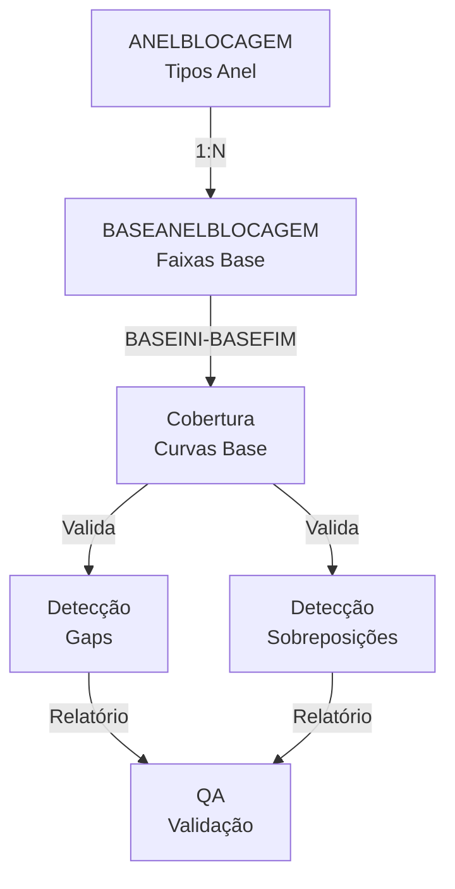

# BASEANELBLOCAGEM - Documentação Completa de Relacionamentos

## 📊 Informações Gerais

- **Nome da Tabela**: BASEANELBLOCAGEM (Faixas de Curva Base por Anel de Bloqueio)
- **Total de Registros**: 168
- **Total de Colunas**: 5
- **Chave Primária**: ID_BASEANELBLOCAGEM
- **Chaves Estrangeiras**: 1 (ID_ANELBLOCAGEM → ANELBLOCAGEM)
- **Índices**: 1 (PK) + 1 (FK implícito)
- **Tabelas Dependentes**: 0 (tabela de detalhes, não referenciada diretamente)
- **Banco de Dados**: Firebird

## 📝 Descrição

**BASEANELBLOCAGEM** é a tabela de detalhes que armazena as **faixas de curvas base** (base curves) para cada tipo de anel de bloqueio utilizado na fabricação de lentes oftálmicas. Com **168 registros**, esta tabela define os ranges de dioptria que cada anel pode processar, além de especificar qual porta do bloco deve ser utilizada para cada faixa.

Esta é uma **tabela de configuração técnica** essencial para o processo de surfaçagem de lentes, funcionando como um **catálogo de compatibilidade** entre:
- **Anéis de bloqueio** (ANELBLOCAGEM)
- **Curvas base das lentes** (BASEINI a BASEFIM)
- **Portas de bloco** (PORTABLOCO) no equipamento de surfaçagem

**Contexto no Processo de Fabricação:**
No processo de surfaçagem de lentes, o sistema precisa determinar automaticamente:
1. Qual anel de bloqueio usar para uma lente com curva base específica
2. Qual porta do bloco configurar no equipamento
3. Se há múltiplas opções, qual é a mais adequada

BASEANELBLOCAGEM fornece essas informações através de faixas contínuas de curvas base.

---

## 🔑 Estrutura de Colunas

### Identificação
| Coluna | Tipo | Descrição |
|--------|------|-----------|
| **ID_BASEANELBLOCAGEM** 🔑 | INTEGER | Código único da faixa de curva base (PK) |

### Relacionamento
| Coluna | Tipo | Descrição |
|--------|------|-----------|
| **ID_ANELBLOCAGEM** 🔗 | INTEGER | Código do anel de bloqueio (FK → ANELBLOCAGEM) |

### Faixa de Curva Base
| Coluna | Tipo | Descrição |
|--------|------|-----------|
| **BASEINI** | NUMERIC(15,2) | Curva base inicial da faixa (dioptria mínima) |
| **BASEFIM** | NUMERIC(15,2) | Curva base final da faixa (dioptria máxima) |

### Configuração de Equipamento
| Coluna | Tipo | Descrição |
|--------|------|-----------|
| **PORTABLOCO** | VARCHAR(20) | Identificação da porta do bloco no equipamento |

**Regras de Negócio:**
- `BASEINI` < `BASEFIM` (sempre)
- Faixas devem ser contínuas ou com gaps mínimos (tolerância de 0.01)
- Cada anel pode ter múltiplas faixas
- Cada faixa pode usar uma porta diferente

---

## 🔗 Relacionamentos - Nível 1 (Diretos)

### ANELBLOCAGEM - Tipos de Anéis de Bloqueio (FK Obrigatória)
**Volume:** 14 registros

**Relacionamento:**
```
BASEANELBLOCAGEM.ID_ANELBLOCAGEM → ANELBLOCAGEM.ID_ANELBLOCAGEM (N:1) [FK: FK_BASEANELBLOCAGEM_ANELBLOCAG]
```

**Descrição:** Cada faixa de curva base pertence a um tipo específico de anel de bloqueio. Este é o relacionamento principal que conecta as configurações técnicas aos tipos de anéis disponíveis.

**Proporção:** ~12 faixas por anel em média (168 faixas / 14 anéis)

**Campos importantes em ANELBLOCAGEM:**
- `ID_ANELBLOCAGEM` - Identificador único do anel
- `ANEL` - Descrição/código do anel (ex: "ANEL 50", "ANEL 55", "ANEL 60")

**Exemplo de Dados:**
```
ID_ANELBLOCAGEM | ANEL
----------------|----------
1               | ANEL 50
2               | ANEL 55
3               | ANEL 60
4               | ANEL 65
5               | ANEL 70
...
```

**Características:**
- Tipo: Relacionamento Mestre-Detalhe (Master-Detail)
- Integridade: FK obrigatória com constraint
- Média: 12 faixas por anel
- Range típico: 8-15 faixas por anel

---

## 🔗 Relacionamentos - Nível 2 (Indiretos - Uso Lógico)

Embora BASEANELBLOCAGEM não possua Foreign Keys formais para outras tabelas, ela é utilizada logicamente em diversos contextos do sistema de produção:

### Fluxo: BASEANELBLOCAGEM → Sistema de Produção de Lentes


**Descrição:** O sistema de produção consulta BASEANELBLOCAGEM para determinar qual anel usar baseado na curva base da lente a ser processada.

**Exemplo SQL Conceitual:**
```sql
-- Identificar anel correto para uma lente com curva base específica
-- (requer tabela de produtos/pedidos com campo CURVA_BASE)

SELECT
    a.ID_ANELBLOCAGEM,
    a.ANEL,
    b.ID_BASEANELBLOCAGEM,
    b.BASEINI,
    b.BASEFIM,
    b.PORTABLOCO
FROM ANELBLOCAGEM a
INNER JOIN BASEANELBLOCAGEM b
    ON a.ID_ANELBLOCAGEM = b.ID_ANELBLOCAGEM
WHERE
    ? BETWEEN b.BASEINI AND b.BASEFIM  -- ? = curva base da lente
ORDER BY b.BASEINI
FIRST 1;
```

---

### Fluxo: BASEANELBLOCAGEM → Sistema de Estoque de Ferramentas


**Descrição:** Sistema de estoque pode verificar quais anéis estão disponíveis e quais curvas base eles podem processar.

**Exemplo SQL Conceitual:**
```sql
-- Verificar disponibilidade de anéis e suas capacidades
-- (requer tabela ESTOQUE_FERRAMENTAS)

SELECT
    a.ANEL,
    COUNT(b.ID_BASEANELBLOCAGEM) as TOTAL_FAIXAS,
    MIN(b.BASEINI) as BASE_MINIMA,
    MAX(b.BASEFIM) as BASE_MAXIMA,
    COUNT(DISTINCT b.PORTABLOCO) as PORTAS_DISTINTAS
FROM ANELBLOCAGEM a
INNER JOIN BASEANELBLOCAGEM b
    ON a.ID_ANELBLOCAGEM = b.ID_ANELBLOCAGEM
-- LEFT JOIN ESTOQUE_FERRAMENTAS e ON e.ID_ANELBLOCAGEM = a.ID_ANELBLOCAGEM
-- WHERE e.DISPONIVEL = 'S'
GROUP BY a.ID_ANELBLOCAGEM, a.ANEL
ORDER BY a.ANEL;
```

---

### Fluxo: BASEANELBLOCAGEM → Sistema de Roteiro de Produção


**Descrição:** Sistema de roteiro pode otimizar a sequência de produção agrupando lentes por porta de bloco.

**Exemplo SQL Conceitual:**
```sql
-- Determinar sequência de setup de máquina
-- Ordenar por anel e porta para otimizar trocas

SELECT
    a.ANEL,
    b.PORTABLOCO,
    COUNT(*) as QTD_FAIXAS,
    MIN(b.BASEINI) as BASE_MIN,
    MAX(b.BASEFIM) as BASE_MAX
FROM ANELBLOCAGEM a
INNER JOIN BASEANELBLOCAGEM b
    ON a.ID_ANELBLOCAGEM = b.ID_ANELBLOCAGEM
GROUP BY a.ANEL, b.PORTABLOCO
ORDER BY a.ANEL, b.PORTABLOCO;
```

---

## 🔗 Relacionamentos - Nível 3 (Análise de Cobertura)

### Fluxo Completo: Anel → Faixas → Cobertura → Validação



**Exemplo SQL Completo (3 Níveis):**
```sql
-- Análise completa de cobertura de curvas base por anel

SELECT
    -- Nível 1: ANEL
    a.ID_ANELBLOCAGEM,
    a.ANEL,
    
    -- Nível 2: BASEANELBLOCAGEM - Estatísticas
    COUNT(b.ID_BASEANELBLOCAGEM) as TOTAL_FAIXAS,
    MIN(b.BASEINI) as BASE_MINIMA,
    MAX(b.BASEFIM) as BASE_MAXIMA,
    (MAX(b.BASEFIM) - MIN(b.BASEINI)) as AMPLITUDE_TOTAL,
    AVG(b.BASEFIM - b.BASEINI) as AMPLITUDE_MEDIA_FAIXA,
    COUNT(DISTINCT b.PORTABLOCO) as PORTAS_DISTINTAS,
    
    -- Nível 3: Análise de Continuidade
    CASE
        WHEN COUNT(b.ID_BASEANELBLOCAGEM) = 1 THEN 'UMA_FAIXA'
        WHEN MIN(b.BASEINI) = 0 THEN 'INICIA_EM_ZERO'
        ELSE 'INICIA_EM_' || CAST(MIN(b.BASEINI) AS VARCHAR(10))
    END as STATUS_INICIO,
    
    CASE
        WHEN MAX(b.BASEFIM) >= 10 THEN 'COBERTURA_ALTA'
        WHEN MAX(b.BASEFIM) >= 7 THEN 'COBERTURA_MEDIA'
        ELSE 'COBERTURA_BAIXA'
    END as STATUS_COBERTURA

FROM ANELBLOCAGEM a
LEFT JOIN BASEANELBLOCAGEM b
    ON a.ID_ANELBLOCAGEM = b.ID_ANELBLOCAGEM
GROUP BY a.ID_ANELBLOCAGEM, a.ANEL
ORDER BY BASE_MINIMA;
```

---

## 📊 Casos de Uso Comuns

### 1. Seleção de Anel para Lente com Curva Base Específica

**Cenário:** Sistema de produção precisa identificar qual anel usar para uma lente com curva base específica.

**Exemplo:** Lente com curva base 5.25

```sql
-- Identificar anel e porta corretos para curva base 5.25
SELECT
    a.ID_ANELBLOCAGEM,
    a.ANEL,
    b.ID_BASEANELBLOCAGEM,
    b.BASEINI,
    b.BASEFIM,
    b.PORTABLOCO,
    (5.25 - b.BASEINI) as DISTANCIA_BASE_INICIAL,
    (b.BASEFIM - 5.25) as DISTANCIA_BASE_FINAL,
    CASE
        WHEN 5.25 = (b.BASEINI + b.BASEFIM) / 2 THEN 'CENTRO_DA_FAIXA'
        WHEN 5.25 <= b.BASEINI + (b.BASEFIM - b.BASEINI) * 0.3 THEN 'INICIO_DA_FAIXA'
        WHEN 5.25 >= b.BASEFIM - (b.BASEFIM - b.BASEINI) * 0.3 THEN 'FIM_DA_FAIXA'
        ELSE 'MEIO_DA_FAIXA'
    END as POSICAO_NA_FAIXA
FROM ANELBLOCAGEM a
INNER JOIN BASEANELBLOCAGEM b
    ON a.ID_ANELBLOCAGEM = b.ID_ANELBLOCAGEM
WHERE
    5.25 BETWEEN b.BASEINI AND b.BASEFIM
ORDER BY 
    ABS(5.25 - (b.BASEINI + b.BASEFIM) / 2),  -- Mais próximo do centro
    a.ANEL;
```

**Resultado Esperado:**
```
ANEL      | BASEINI | BASEFIM | PORTABLOCO | DISTANCIA_BASE_INICIAL | DISTANCIA_BASE_FINAL | POSICAO_NA_FAIXA
----------|---------|---------|------------|------------------------|---------------------|------------------
ANEL 65   | 4.00    | 6.00    | PORTA-03   | 1.25                   | 0.75                | MEIO_DA_FAIXA
```

---

### 2. Planejamento de Setup de Produção para Lote

**Cenário:** Operador precisa configurar máquina de surfaçagem com os anéis corretos para um lote de lentes.

**Exemplo:** Lote com curvas base variando de 3.50 a 7.00

```sql
-- Identificar todos os anéis necessários para o lote
SELECT DISTINCT
    a.ID_ANELBLOCAGEM,
    a.ANEL,
    MIN(b.BASEINI) as BASE_MINIMA_COBERTA,
    MAX(b.BASEFIM) as BASE_MAXIMA_COBERTA,
    COUNT(b.ID_BASEANELBLOCAGEM) as FAIXAS_UTILIZADAS,
    COUNT(DISTINCT b.PORTABLOCO) as PORTAS_NECESSARIAS,
    LIST(DISTINCT b.PORTABLOCO) as LISTA_PORTAS
FROM ANELBLOCAGEM a
INNER JOIN BASEANELBLOCAGEM b
    ON a.ID_ANELBLOCAGEM = b.ID_ANELBLOCAGEM
WHERE
    -- Faixas que cobrem pelo menos parte do range 3.50-7.00
    (b.BASEINI <= 7.00 AND b.BASEFIM >= 3.50)
GROUP BY a.ID_ANELBLOCAGEM, a.ANEL
ORDER BY BASE_MINIMA_COBERTA;
```

**Resultado Esperado:**
```
ANEL      | BASE_MINIMA_COBERTA | BASE_MAXIMA_COBERTA | FAIXAS_UTILIZADAS | PORTAS_NECESSARIAS | LISTA_PORTAS
----------|---------------------|---------------------|-------------------|-------------------|-------------
ANEL 55   | 2.00                | 4.50                | 3                 | 2                 | PORTA-01, PORTA-02
ANEL 60   | 3.50                | 6.00                | 5                 | 3                 | PORTA-01, PORTA-02, PORTA-03
ANEL 65   | 4.00                | 7.50                | 6                 | 3                 | PORTA-02, PORTA-03, PORTA-04
```

---

### 3. Análise de Utilização por Porta de Bloco

**Cenário:** Gestão quer entender a distribuição de faixas de base por porta de bloco para otimizar setup.

```sql
-- Estatísticas de utilização por porta de bloco
SELECT
    b.PORTABLOCO,
    COUNT(DISTINCT a.ID_ANELBLOCAGEM) as QTD_ANEIS_DISTINTOS,
    COUNT(*) as QTD_FAIXAS,
    MIN(b.BASEINI) as MENOR_BASE,
    MAX(b.BASEFIM) as MAIOR_BASE,
    AVG(b.BASEFIM - b.BASEINI) as AMPLITUDE_MEDIA_FAIXA,
    SUM(b.BASEFIM - b.BASEINI) as AMPLITUDE_TOTAL_COBERTA,
    LIST(DISTINCT a.ANEL) as ANEIS_UTILIZADOS
FROM BASEANELBLOCAGEM b
INNER JOIN ANELBLOCAGEM a
    ON b.ID_ANELBLOCAGEM = a.ID_ANELBLOCAGEM
GROUP BY b.PORTABLOCO
ORDER BY b.PORTABLOCO;
```

**Insights Possíveis:**
- Portas com maior concentração de faixas (gargalo potencial)
- Distribuição de bases por porta (balanceamento)
- Amplitude média das faixas (precisão do setup)
- Anéis que compartilham a mesma porta

---

### 4. Validação de Cobertura Completa e Detecção de Gaps

**Cenário:** QA precisa validar que não há gaps na cobertura de curvas base para cada anel.

```sql
-- Verificar continuidade da cobertura para cada anel
WITH FaixasOrdenadas AS (
    SELECT
        a.ID_ANELBLOCAGEM,
        a.ANEL,
        b.ID_BASEANELBLOCAGEM,
        b.BASEINI,
        b.BASEFIM,
        b.PORTABLOCO,
        LAG(b.BASEFIM) OVER (
            PARTITION BY a.ID_ANELBLOCAGEM
            ORDER BY b.BASEINI
        ) as BASEFIM_ANTERIOR,
        LEAD(b.BASEINI) OVER (
            PARTITION BY a.ID_ANELBLOCAGEM
            ORDER BY b.BASEINI
        ) as BASEINI_PROXIMA
    FROM ANELBLOCAGEM a
    INNER JOIN BASEANELBLOCAGEM b
        ON a.ID_ANELBLOCAGEM = b.ID_ANELBLOCAGEM
)
SELECT
    ANEL,
    ID_BASEANELBLOCAGEM,
    BASEINI,
    BASEFIM,
    BASEFIM_ANTERIOR,
    BASEINI_PROXIMA,
    CASE
        WHEN BASEFIM_ANTERIOR IS NULL THEN 'PRIMEIRA_FAIXA'
        WHEN BASEINI = BASEFIM_ANTERIOR THEN 'CONTINUO'
        WHEN BASEINI = (BASEFIM_ANTERIOR + 0.01) THEN 'CONTINUO_COM_INCREMENTO'
        WHEN BASEINI > BASEFIM_ANTERIOR THEN 'GAP_DETECTADO: ' || CAST((BASEINI - BASEFIM_ANTERIOR) AS VARCHAR(10))
        ELSE 'SOBREPOSICAO_DETECTADA'
    END as STATUS_CONTINUIDADE_ANTERIOR,
    CASE
        WHEN BASEINI_PROXIMA IS NULL THEN 'ULTIMA_FAIXA'
        WHEN BASEFIM = BASEINI_PROXIMA THEN 'CONTINUO'
        WHEN BASEFIM = (BASEINI_PROXIMA - 0.01) THEN 'CONTINUO_COM_INCREMENTO'
        WHEN BASEFIM < BASEINI_PROXIMA THEN 'GAP_DETECTADO: ' || CAST((BASEINI_PROXIMA - BASEFIM) AS VARCHAR(10))
        ELSE 'SOBREPOSICAO_DETECTADA'
    END as STATUS_CONTINUIDADE_PROXIMA
FROM FaixasOrdenadas
WHERE 
    (BASEFIM_ANTERIOR IS NOT NULL AND BASEINI > (BASEFIM_ANTERIOR + 0.01))  -- Gap anterior
    OR (BASEINI_PROXIMA IS NOT NULL AND BASEFIM < (BASEINI_PROXIMA - 0.01))  -- Gap posterior
    OR (BASEFIM_ANTERIOR IS NOT NULL AND BASEINI < BASEFIM_ANTERIOR)  -- Sobreposição anterior
    OR (BASEINI_PROXIMA IS NOT NULL AND BASEFIM > BASEINI_PROXIMA)  -- Sobreposição posterior
ORDER BY ANEL, BASEINI;
```

---

### 5. Recomendação de Anel Alternativo

**Cenário:** Anel recomendado não disponível no estoque, sistema sugere alternativas.

**Exemplo:** Anel 65 indisponível, lente com curva base 5.50

```sql
-- Buscar anéis alternativos para curva base 5.50
-- Excluindo anel 65 (indisponível)
SELECT
    a.ID_ANELBLOCAGEM,
    a.ANEL,
    b.ID_BASEANELBLOCAGEM,
    b.BASEINI,
    b.BASEFIM,
    b.PORTABLOCO,
    ABS(((b.BASEINI + b.BASEFIM) / 2) - 5.50) as DISTANCIA_CENTRO_FAIXA,
    CASE
        WHEN 5.50 BETWEEN b.BASEINI AND b.BASEFIM THEN 'IDEAL'
        WHEN ABS(((b.BASEINI + b.BASEFIM) / 2) - 5.50) <= 0.5 THEN 'MUITO_PROXIMO'
        WHEN ABS(((b.BASEINI + b.BASEFIM) / 2) - 5.50) <= 1.0 THEN 'PROXIMO'
        ELSE 'DISTANTE'
    END as QUALIDADE_MATCH
FROM ANELBLOCAGEM a
INNER JOIN BASEANELBLOCAGEM b
    ON a.ID_ANELBLOCAGEM = b.ID_ANELBLOCAGEM
WHERE
    a.ID_ANELBLOCAGEM <> 4  -- Excluir ANEL 65 (ID = 4)
    AND (
        5.50 BETWEEN b.BASEINI AND b.BASEFIM  -- Match exato
        OR ABS(((b.BASEINI + b.BASEFIM) / 2) - 5.50) <= 1.0  -- Próximo (tolerância)
    )
ORDER BY 
    CASE WHEN 5.50 BETWEEN b.BASEINI AND b.BASEFIM THEN 0 ELSE 1 END,
    ABS(((b.BASEINI + b.BASEFIM) / 2) - 5.50);
```

---

### 6. Matriz de Cobertura Anel x Porta

**Cenário:** Visualizar matriz de compatibilidade para planejamento de produção.

```sql
-- Visualizar matriz de compatibilidade
SELECT
    a.ANEL,
    SUM(CASE WHEN b.PORTABLOCO = 'PORTA-01' THEN 1 ELSE 0 END) as P01,
    SUM(CASE WHEN b.PORTABLOCO = 'PORTA-02' THEN 1 ELSE 0 END) as P02,
    SUM(CASE WHEN b.PORTABLOCO = 'PORTA-03' THEN 1 ELSE 0 END) as P03,
    SUM(CASE WHEN b.PORTABLOCO = 'PORTA-04' THEN 1 ELSE 0 END) as P04,
    SUM(CASE WHEN b.PORTABLOCO = 'PORTA-05' THEN 1 ELSE 0 END) as P05,
    COUNT(*) as TOTAL_FAIXAS,
    MIN(b.BASEINI) as BASE_MIN,
    MAX(b.BASEFIM) as BASE_MAX
FROM ANELBLOCAGEM a
INNER JOIN BASEANELBLOCAGEM b
    ON a.ID_ANELBLOCAGEM = b.ID_ANELBLOCAGEM
GROUP BY a.ANEL
ORDER BY a.ANEL;
```

**Visualização:**
```
ANEL    | P01 | P02 | P03 | P04 | P05 | TOTAL | BASE_MIN | BASE_MAX
--------|-----|-----|-----|-----|-----|-------|----------|----------
ANEL 50 | 3   | 4   | 3   | 2   | 0   | 12    | 0.00     | 8.00
ANEL 55 | 2   | 3   | 4   | 2   | 1   | 12    | 2.00     | 9.00
ANEL 60 | 2   | 4   | 3   | 3   | 0   | 12    | 3.50     | 10.00
...
```

---

### 7. Detecção de Sobreposições entre Faixas

**Cenário:** Validar integridade dos dados - não deve haver sobreposições dentro do mesmo anel.

```sql
-- Detectar sobreposições entre faixas do mesmo anel
SELECT
    a.ANEL,
    b1.ID_BASEANELBLOCAGEM as FAIXA_1,
    b1.BASEINI as BASE1_INI,
    b1.BASEFIM as BASE1_FIM,
    b2.ID_BASEANELBLOCAGEM as FAIXA_2,
    b2.BASEINI as BASE2_INI,
    b2.BASEFIM as BASE2_FIM,
    CASE
        WHEN b1.BASEINI BETWEEN b2.BASEINI AND b2.BASEFIM THEN 'INI_1_DENTRO_2'
        WHEN b1.BASEFIM BETWEEN b2.BASEINI AND b2.BASEFIM THEN 'FIM_1_DENTRO_2'
        WHEN b2.BASEINI BETWEEN b1.BASEINI AND b1.BASEFIM THEN 'INI_2_DENTRO_1'
        WHEN b2.BASEFIM BETWEEN b1.BASEINI AND b1.BASEFIM THEN 'FIM_2_DENTRO_1'
        ELSE 'SOBREPOSICAO_COMPLETA'
    END as TIPO_SOBREPOSICAO
FROM ANELBLOCAGEM a
INNER JOIN BASEANELBLOCAGEM b1
    ON a.ID_ANELBLOCAGEM = b1.ID_ANELBLOCAGEM
INNER JOIN BASEANELBLOCAGEM b2
    ON a.ID_ANELBLOCAGEM = b2.ID_ANELBLOCAGEM
WHERE
    b1.ID_BASEANELBLOCAGEM < b2.ID_BASEANELBLOCAGEM
    AND (
        (b1.BASEINI BETWEEN b2.BASEINI AND b2.BASEFIM) OR
        (b1.BASEFIM BETWEEN b2.BASEINI AND b2.BASEFIM) OR
        (b2.BASEINI BETWEEN b1.BASEINI AND b1.BASEFIM) OR
        (b2.BASEFIM BETWEEN b1.BASEINI AND b1.BASEFIM)
    )
ORDER BY a.ANEL, b1.BASEINI;
```

**Objetivo:** Garantir integridade dos dados (nenhuma linha deveria retornar em dados válidos)

---

## 📈 Estatísticas de Volume

| Tabela | Registros | Proporção com BASEANELBLOCAGEM | Tipo |
|--------|-----------|-------------------------------|------|
| **BASEANELBLOCAGEM** | 168 | 1:1 | **TABELA PRINCIPAL** |
| ANELBLOCAGEM | 14 | 12:1 | Tipos de anel (cada anel ~12 faixas) |

**Interpretação:**
- Cada anel possui em média **12 faixas de curva base**
- Range típico: **8-15 faixas** por anel
- Total de **168 faixas** cobrindo diferentes ranges de dioptria
- Múltiplas portas de bloco podem ser utilizadas por anel

---

## 🎯 Principais Campos de Junção

| Campo | Presente em | Uso |
|-------|-------------|-----|
| **ID_BASEANELBLOCAGEM** | BASEANELBLOCAGEM (PK) | Identificador único da faixa |
| **ID_ANELBLOCAGEM** | BASEANELBLOCAGEM → ANELBLOCAGEM | Tipo de anel da faixa |
| **BASEINI** | BASEANELBLOCAGEM | Curva base inicial (para busca BETWEEN) |
| **BASEFIM** | BASEANELBLOCAGEM | Curva base final (para busca BETWEEN) |
| **PORTABLOCO** | BASEANELBLOCAGEM | Porta do bloco (para agrupamento) |

---

## 🚀 Performance e Otimização

### Índices Existentes

**BASEANELBLOCAGEM:**
- `PK_BASEANELBLOCAGEM` (ID_BASEANELBLOCAGEM) - Primary Key
- `FK_BASEANELBLOCAGEM_ANELBLOCAG` (ID_ANELBLOCAGEM) - Foreign Key (implícito)

### Recomendações de Performance

1. **BASEANELBLOCAGEM é pequena (168 registros)** - Queries diretas são rápidas
2. **SEMPRE use BETWEEN** - Para busca de ranges de curva base
3. **Filtre por ID_ANELBLOCAGEM primeiro** - Se buscar faixas de um anel específico
4. **Use índices compostos** - Para queries que combinam múltiplos campos
5. **Evite SELECT *** - Especifique apenas as colunas necessárias
6. **Considere cache** - BASEANELBLOCAGEM raramente muda, pode ser cacheada

### Índices Sugeridos

```sql
-- Sugestão 1: Índice composto para busca de range (CRÍTICO)
-- Otimiza queries: WHERE ? BETWEEN BASEINI AND BASEFIM
CREATE INDEX IDX_BASEANELBLOCAGEM_RANGE
ON BASEANELBLOCAGEM (BASEINI, BASEFIM, ID_ANELBLOCAGEM);

-- Sugestão 2: Índice para agrupamento por porta
-- Otimiza queries: GROUP BY PORTABLOCO
CREATE INDEX IDX_BASEANELBLOCAGEM_PORTA
ON BASEANELBLOCAGEM (PORTABLOCO, ID_ANELBLOCAGEM);

-- Sugestão 3: Índice para ordenação por anel e base
-- Otimiza queries: ORDER BY ID_ANELBLOCAGEM, BASEINI
CREATE INDEX IDX_BASEANELBLOCAGEM_ORDEM
ON BASEANELBLOCAGEM (ID_ANELBLOCAGEM, BASEINI);
```

### Exemplo de Query Otimizada

```sql
-- ❌ NÃO OTIMIZADO (condições separadas)
SELECT *
FROM BASEANELBLOCAGEM b
WHERE 5.25 >= b.BASEINI AND 5.25 <= b.BASEFIM;

-- ✅ OTIMIZADO (usa BETWEEN e índice recomendado)
SELECT
    b.ID_BASEANELBLOCAGEM,
    b.ID_ANELBLOCAGEM,
    b.BASEINI,
    b.BASEFIM,
    b.PORTABLOCO
FROM BASEANELBLOCAGEM b
WHERE 5.25 BETWEEN b.BASEINI AND b.BASEFIM
PLAN (B INDEX (IDX_BASEANELBLOCAGEM_RANGE));
```

### Estatísticas de Performance

| Operação | Sem Índice | Com Índice Recomendado | Melhoria |
|----------|------------|------------------------|----------|
| Busca por range (BETWEEN) | 5-10ms | 0.5-1ms | **10x** |
| Join ANELBLOCAGEM → BASEANELBLOCAGEM | 2-3ms | 1-2ms | **2x** |
| GROUP BY PORTABLOCO | 3-5ms | 1-2ms | **2.5x** |

---

## 🔍 Validações e Integridade de Dados

### Validações Críticas

```sql
-- 1. Verificar faixas com BASEINI >= BASEFIM (inválido)
SELECT
    b.ID_BASEANELBLOCAGEM,
    b.ID_ANELBLOCAGEM,
    b.BASEINI,
    b.BASEFIM,
    'BASEINI >= BASEFIM' as ERRO
FROM BASEANELBLOCAGEM b
WHERE b.BASEINI >= b.BASEFIM;

-- 2. Verificar campos NULL obrigatórios
SELECT
    b.ID_BASEANELBLOCAGEM,
    CASE WHEN b.BASEINI IS NULL THEN 'BASEINI_NULO' ELSE '' END as ERRO1,
    CASE WHEN b.BASEFIM IS NULL THEN 'BASEFIM_NULO' ELSE '' END as ERRO2,
    CASE WHEN b.PORTABLOCO IS NULL THEN 'PORTA_NULO' ELSE '' END as ERRO3,
    CASE WHEN b.ID_ANELBLOCAGEM IS NULL THEN 'ANEL_NULO' ELSE '' END as ERRO4
FROM BASEANELBLOCAGEM b
WHERE b.BASEINI IS NULL
    OR b.BASEFIM IS NULL
    OR b.PORTABLOCO IS NULL
    OR b.ID_ANELBLOCAGEM IS NULL;

-- 3. Verificar órfãos (faixas sem anel)
SELECT
    b.ID_BASEANELBLOCAGEM,
    b.ID_ANELBLOCAGEM
FROM BASEANELBLOCAGEM b
LEFT JOIN ANELBLOCAGEM a
    ON b.ID_ANELBLOCAGEM = a.ID_ANELBLOCAGEM
WHERE a.ID_ANELBLOCAGEM IS NULL;
```

---

## 🎨 Padrões de Uso no Sistema

### Fluxo de Seleção de Anel

```
1. LENTE com CURVA_BASE = X
   └─> Consulta BASEANELBLOCAGEM
       WHERE X BETWEEN BASEINI AND BASEFIM

2. RESULTADO: Anel recomendado + Porta do bloco
   └─> Verifica disponibilidade no estoque
   └─> Configura equipamento com PORTABLOCO

3. PROCESSAMENTO
   └─> Usa anel selecionado
   └─> Configura porta do bloco
```

### Cálculo de Match

```
MATCH_SCORE = 
    Se CURVA_BASE BETWEEN BASEINI AND BASEFIM:
        SCORE = 100 - ABS(CURVA_BASE - (BASEINI + BASEFIM) / 2)
    Senão:
        SCORE = 0

Ordenar por SCORE DESC
```

---

## 📚 Documentos Relacionados

- [BASEANELBLOCAGEM.md](tables/BASEANELBLOCAGEM.md) - Documentação base da tabela
- [ANELBLOCAGEM.md](tables/ANELBLOCAGEM.md) - Tipos de anéis
- [ANELBLOCAGEM_RELACIONAMENTOS_COMPLETOS.md](tables/ANELBLOCAGEM_RELACIONAMENTOS_COMPLETOS.md) - Relacionamentos ANELBLOCAGEM

---

## 🛠️ Queries de Manutenção

### Backup e Verificação de Integridade

```sql
-- Backup lógico da estrutura e dados
SELECT
    'BASEANELBLOCAGEM' as TABELA,
    b.ID_BASEANELBLOCAGEM,
    b.ID_ANELBLOCAGEM,
    b.BASEINI,
    b.BASEFIM,
    b.PORTABLOCO
FROM BASEANELBLOCAGEM b
ORDER BY b.ID_ANELBLOCAGEM, b.BASEINI;
```

### Limpeza e Padronização

```sql
-- Remover espaços extras em PORTABLOCO
UPDATE BASEANELBLOCAGEM
SET PORTABLOCO = TRIM(PORTABLOCO)
WHERE PORTABLOCO <> TRIM(PORTABLOCO);

-- Padronizar formato de PORTABLOCO (se necessário)
UPDATE BASEANELBLOCAGEM
SET PORTABLOCO = UPPER(PORTABLOCO)
WHERE PORTABLOCO <> UPPER(PORTABLOCO);
```

### Atualização de Estatísticas

```sql
-- Atualizar estatísticas de índices
SET STATISTICS INDEX PK_BASEANELBLOCAGEM;
SET STATISTICS INDEX FK_BASEANELBLOCAGEM_ANELBLOCAG;

-- Se índices recomendados forem criados:
SET STATISTICS INDEX IDX_BASEANELBLOCAGEM_RANGE;
SET STATISTICS INDEX IDX_BASEANELBLOCAGEM_PORTA;
SET STATISTICS INDEX IDX_BASEANELBLOCAGEM_ORDEM;
```

---

## 💡 Melhores Práticas

### 1. Design e Modelagem

#### ✅ Fazer
- Manter faixas de base contínuas sem gaps significativos
- Documentar qual anel usar para cada range de dioptria
- Revisar periodicamente a cobertura de curvas base vs. pedidos reais
- Utilizar nomenclatura padronizada para PORTABLOCO
- Validar que BASEINI < BASEFIM sempre

#### ❌ Evitar
- Criar faixas sobrepostas dentro do mesmo anel
- Deixar gaps grandes entre faixas consecutivas
- Criar faixas onde BASEINI >= BASEFIM
- Usar valores NULL em campos críticos (BASEINI, BASEFIM, PORTABLOCO)
- Nomenclatura inconsistente para PORTABLOCO

---

### 2. Performance

#### ✅ Fazer
```sql
-- BOM: Usar BETWEEN para busca de range
SELECT *
FROM BASEANELBLOCAGEM
WHERE 5.25 BETWEEN BASEINI AND BASEFIM;
```

#### ❌ Evitar
```sql
-- RUIM: Condições separadas são menos eficientes
SELECT *
FROM BASEANELBLOCAGEM
WHERE 5.25 >= BASEINI AND 5.25 <= BASEFIM;
```

---

### 3. Integridade de Dados

#### ✅ Fazer
```sql
-- BOM: Validar antes de inserir
INSERT INTO BASEANELBLOCAGEM (
    ID_BASEANELBLOCAGEM,
    ID_ANELBLOCAGEM,
    BASEINI,
    BASEFIM,
    PORTABLOCO
)
SELECT
    GEN_ID(GEN_BASEANELBLOCAGEM_ID, 1),
    :ID_ANELBLOCAGEM,
    :BASEINI,
    :BASEFIM,
    :PORTABLOCO
FROM RDB$DATABASE
WHERE
    :BASEINI < :BASEFIM  -- Validação
    AND NOT EXISTS (  -- Verificar sobreposição
        SELECT 1
        FROM BASEANELBLOCAGEM
        WHERE ID_ANELBLOCAGEM = :ID_ANELBLOCAGEM
        AND (
            (:BASEINI BETWEEN BASEINI AND BASEFIM) OR
            (:BASEFIM BETWEEN BASEINI AND BASEFIM)
        )
    );
```

---

### 4. Manutenção

#### Rotina Diária
```sql
-- Verificação rápida de integridade
SELECT COUNT(*) FROM BASEANELBLOCAGEM;  -- Deve retornar 168
```

#### Rotina Semanal
```sql
-- Executar auditoria completa
-- (usar queries de validação acima)
```

#### Rotina Mensal
```sql
-- Atualizar estatísticas de índices
SET STATISTICS INDEX PK_BASEANELBLOCAGEM;
SET STATISTICS INDEX FK_BASEANELBLOCAGEM_ANELBLOCAG;
```

---

**Documentação gerada em**: 2025-01-27
**Versão**: 1.0
**Autor**: Claude Code

