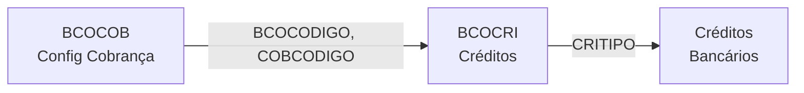
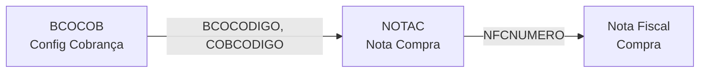
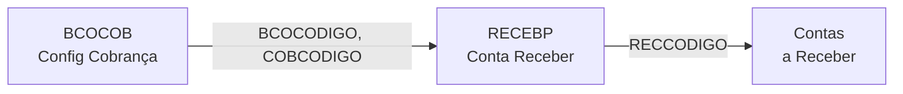
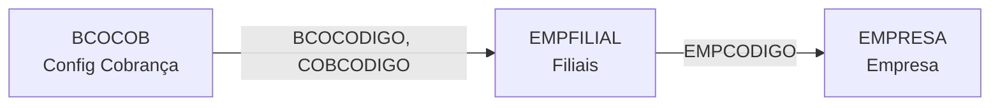
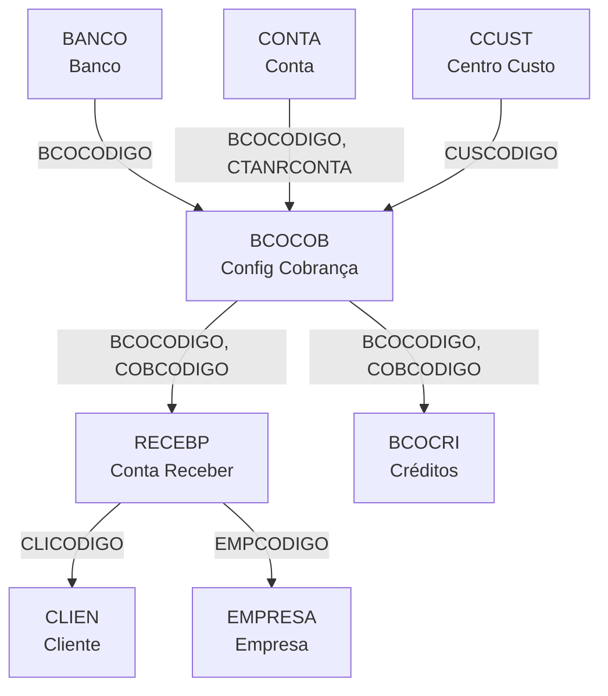

# BCOCOB - Documentação Completa de Relacionamentos

## 📊 Informações Gerais

- **Nome da Tabela**: BCOCOB (Configurações de Cobrança Bancária)
- **Total de Registros**: 11
- **Total de Colunas**: 84
- **Chave Primária**: BCOCODIGO + COBCODIGO (composta)
- **Chaves Estrangeiras**: 6
- **Índices**: 0
- **Tabelas Dependentes**: 24 (altamente referenciada)
- **Banco de Dados**: Firebird

## 📝 Descrição

**BCOCOB** é a tabela central de configuração de cobrança bancária do sistema. Com apenas **11 registros** mas **84 colunas**, armazena todas as configurações necessárias para integração com bancos para emissão e gestão de boletos, cobranças e títulos bancários.

Esta tabela funciona como **ponte de configuração** entre:
- **Bancos** (BANCO)
- **Contas bancárias** (CONTA)
- **Centros de custo** (CCUST)
- **Sistemas de cobrança** (24 tabelas dependentes)

Cada registro representa uma configuração específica de cobrança para um banco, incluindo:
- Credenciais de acesso (usuário, senha, tokens)
- Parâmetros de cobrança (juros, multa, desconto)
- Configurações de remessa e retorno
- Carteiras e modalidades
- Integrações com sistemas bancários

---

## 🔑 Estrutura de Colunas

### Identificação
| Coluna | Tipo | Descrição |
|--------|------|-----------|
| **BCOCODIGO** 🔑🔗 | INTEGER | Código do banco (PK + FK → BANCO) |
| **COBCODIGO** 🔑 | VARCHAR(14) | Código da configuração de cobrança (PK) |

### Informações Básicas
| Coluna | Tipo | Descrição |
|--------|------|-----------|
| **COBAGCONTA** | VARCHAR(37) | Agência e conta bancária |
| **COBNRCONTRATO** | VARCHAR(37) | Número do contrato com o banco |
| **COBCARTEIRA** | VARCHAR(37) | Carteira de cobrança |
| **COBNOME** | VARCHAR(37) | Nome da configuração |

### Relacionamentos
| Coluna | Tipo | Descrição |
|--------|------|-----------|
| **CUSCODIGO** 🔗 | INTEGER | Centro de custo (FK → CCUST) |
| **CUSCODIGO2** 🔗 | INTEGER | Centro de custo secundário (FK → CCUST) |
| **CTANRCONTA** 🔗 | VARCHAR(37) | Número da conta (FK → CONTA) |
| **EMPCCORR** 🔗 | INTEGER | Empresa correntista (FK → CONTA) |

### Parâmetros de Cobrança
| Coluna | Tipo | Descrição |
|--------|------|-----------|
| **COBPCJUROS** | NUMERIC(27) | Percentual de juros |
| **COBPCDESC** | NUMERIC(27) | Percentual de desconto |
| **COBPCMULTA** | NUMERIC(27) | Percentual de multa |
| **COBDIASVENCTO** | INTEGER | Dias para vencimento |
| **COBDIASREPASSE** | INTEGER | Dias para repasse |
| **COBPRZPROTESTO** | INTEGER | Prazo para protesto |

### Configurações de Remessa/Retorno
| Coluna | Tipo | Descrição |
|--------|------|-----------|
| **COBREMESSA** | VARCHAR(37) | Caminho arquivo remessa |
| **COBRETORNO** | VARCHAR(37) | Caminho arquivo retorno |
| **COBNRSEQREM** | INTEGER | Número sequencial remessa |
| **COBNSNUMERO** | VARCHAR(37) | Nosso número |

### Credenciais e Autenticação
| Coluna | Tipo | Descrição |
|--------|------|-----------|
| **COBCODIGOCEDENTE** | VARCHAR(37) | Código do cedente |
| **COBUSERPASS** | VARCHAR(37) | Usuário/senha |
| **COBIDENTIFICADOR** | VARCHAR(37) | Identificador |
| **COBCLIENTID** | VARCHAR(37) | Client ID (OAuth) |
| **COBCLIENTSECRET** | VARCHAR(37) | Client Secret (OAuth) |
| **COBKEYUSER** | VARCHAR(37) | Key User |
| **COBSCOPE** | VARCHAR(37) | Scope (OAuth) |

### Configurações de Impressão
| Coluna | Tipo | Descrição |
|--------|------|-----------|
| **COBIMPVENCTONF** | VARCHAR(14) | Imprime vencimento na NF |
| **COBORIGEMIMP** | VARCHAR(14) | Origem impressão |
| **COBIMPPARCELADOC** | VARCHAR(14) | Imprime parcelado |
| **COBIMPINSTR** | VARCHAR(14) | Imprime instruções |
| **COBFORIMP** | VARCHAR(14) | Forma impressão |

### Instruções de Cobrança
| Coluna | Tipo | Descrição |
|--------|------|-----------|
| **COBINST1** | VARCHAR(14) | Instrução 1 |
| **COBINST2** | VARCHAR(14) | Instrução 2 |
| **COBOBSER** | VARCHAR(261) | Observações |

### Outras Configurações
| Coluna | Tipo | Descrição |
|--------|------|-----------|
| **COBTIPO** | VARCHAR(14) | Tipo de cobrança |
| **COBSIT** | VARCHAR(14) | Situação |
| **COBTAC** | NUMERIC(16) | TAC |
| **COBTAXA** | NUMERIC(16) | Taxa |
| **COBINDCPIX** | VARCHAR(14) | Indicador CPIX |
| **COBMODALIDADE** | VARCHAR(37) | Modalidade |
| **COBTIPOCOBRANCA** | VARCHAR(37) | Tipo de cobrança |

---

## 🔗 Relacionamentos - Nível 1 (Diretos)

### BANCO - Bancos (FK Obrigatória)
**Volume:** 108 registros

**Relacionamento:**
```
BCOCOB.BCOCODIGO → BANCO.BCOCODIGO (N:1) [FK: BANCO_BCOCOB]
```

**Descrição:** Cada configuração de cobrança pertence a um banco específico.

**Proporção:** ~0.1 configurações por banco em média (11 configs / 108 bancos)

---

### CONTA - Contas Bancárias (FK Múltipla)
**Volume:** 55 registros

**Relacionamentos:**
```
BCOCOB.BCOCODIGO → CONTA.BCOCODIGO (N:1) [FK: CONTA_BCOCOB]
BCOCOB.CTANRCONTA → CONTA.CTANRCONTA (N:1) [FK: CONTA_BCOCOB]
BCOCOB.EMPCCORR → CONTA.EMPCCORR (N:1) [FK: CONTA_BCOCOB]
```

**Descrição:** Configuração vinculada a uma conta bancária específica através de chave composta.

**Campos importantes em CONTA:**
- `CTANRCONTA` - Número da conta
- `CTAAGENCIA` - Agência
- `CTASALDOIMPL` - Saldo inicial

---

### CCUST - Centros de Custo (FK Dupla)
**Volume:** Variável

**Relacionamentos:**
```
BCOCOB.CUSCODIGO → CCUST.CUSCODIGO (N:1) [FK: CCUST_BCOCOB]
BCOCOB.CUSCODIGO2 → CCUST.CUSCODIGO (N:1) [FK: CCUST_BCOCOB2]
```

**Descrição:** Configuração pode ter dois centros de custo (principal e secundário).

---

## 🔗 Relacionamentos - Nível 2 (Indiretos via Tabelas Dependentes)

### Fluxo: BCOCOB → BCOCRI → Sistema de Créditos



**Descrição:** Configurações de cobrança possuem créditos associados.

**Exemplo SQL:**
```sql
SELECT
    bc.BCOCODIGO,
    bc.COBCODIGO,
    bc.COBNOME,
    cri.CRICODIGO,
    cri.CRIDESCRICAO,
    cri.CRITIPO
FROM BCOCOB bc
LEFT JOIN BCOCRI cri ON cri.BCOCODIGO = bc.BCOCODIGO
                     AND cri.COBCODIGO = bc.COBCODIGO
WHERE bc.BCOCODIGO = ?
ORDER BY cri.CRITIPO
```

---

### Fluxo: BCOCOB → NOTAC → Notas Fiscais de Compra



**Descrição:** Notas fiscais de compra podem usar configuração de cobrança.

---

### Fluxo: BCOCOB → RECEBP → Contas a Receber



**Descrição:** Contas a receber utilizam configuração de cobrança para geração de boletos.

---

### Fluxo: BCOCOB → EMPFILIAL → Filiais



**Descrição:** Filiais podem ter configuração de cobrança específica.

---

## 🔗 Relacionamentos - Nível 3 (Exemplo Completo)

### Fluxo Completo: Banco → Configuração → Conta → Empresa → Contas a Receber



**Exemplo SQL Completo (3 Níveis):**
```sql
SELECT
    -- Nível 1: BANCO
    b.BCOCODIGO,
    b.BCONOME AS BANCO_NOME,
    
    -- Nível 1: BCOCOB
    bc.COBCODIGO,
    bc.COBNOME AS CONFIG_NOME,
    bc.COBCARTEIRA AS CARTEIRA,
    bc.COBNRCONTRATO AS CONTRATO,
    
    -- Nível 2: CONTA
    c.CTANRCONTA AS CONTA,
    c.CTAAGENCIA AS AGENCIA,
    
    -- Nível 2: CCUST
    cc.CUSDESCRICAO AS CENTRO_CUSTO,
    
    -- Nível 2: EMPRESA
    e.EMPRAZSOCIAL AS EMPRESA,
    
    -- Nível 3: RECEBP
    COUNT(DISTINCT r.RECCODIGO) AS TOTAL_CONTAS_RECEBER,
    SUM(r.RECVALOR) AS VALOR_TOTAL,
    
    -- Nível 3: BCOCRI
    COUNT(DISTINCT cri.CRICODIGO) AS TOTAL_CREDITOS

FROM BCOCOB bc

-- Nível 1 → 2: Banco
INNER JOIN BANCO b ON b.BCOCODIGO = bc.BCOCODIGO

-- Nível 1 → 2: Conta
LEFT JOIN CONTA c ON c.BCOCODIGO = bc.BCOCODIGO
                 AND c.CTANRCONTA = bc.CTANRCONTA
                 AND c.EMPCCORR = bc.EMPCCORR

-- Nível 2 → 3: Empresa
LEFT JOIN EMPRESA e ON e.EMPCODIGO = c.EMPCCORR

-- Nível 1 → 2: Centro de Custo
LEFT JOIN CCUST cc ON cc.CUSCODIGO = bc.CUSCODIGO

-- Nível 1 → 3: Contas a Receber
LEFT JOIN RECEBP r ON r.BCOCODIGO = bc.BCOCODIGO
                  AND r.COBCODIGO = bc.COBCODIGO

-- Nível 1 → 3: Créditos
LEFT JOIN BCOCRI cri ON cri.BCOCODIGO = bc.BCOCODIGO
                     AND cri.COBCODIGO = bc.COBCODIGO

WHERE bc.BCOCODIGO = ?
GROUP BY 
    b.BCOCODIGO, b.BCONOME,
    bc.COBCODIGO, bc.COBNOME, bc.COBCARTEIRA, bc.COBNRCONTRATO,
    c.CTANRCONTA, c.CTAAGENCIA,
    cc.CUSDESCRICAO,
    e.EMPRAZSOCIAL
```

---

## 📊 Casos de Uso Comuns

### 1. Listar Todas as Configurações de Cobrança por Banco

```sql
SELECT
    b.BCONOME AS BANCO,
    bc.COBCODIGO,
    bc.COBNOME AS CONFIGURACAO,
    bc.COBCARTEIRA AS CARTEIRA,
    bc.COBNRCONTRATO AS CONTRATO,
    c.CTANRCONTA AS CONTA,
    bc.COBSIT AS SITUACAO
FROM BCOCOB bc
INNER JOIN BANCO b ON b.BCOCODIGO = bc.BCOCODIGO
LEFT JOIN CONTA c ON c.BCOCODIGO = bc.BCOCODIGO
                 AND c.CTANRCONTA = bc.CTANRCONTA
                 AND c.EMPCCORR = bc.EMPCCORR
ORDER BY b.BCONOME, bc.COBCODIGO
```

---

### 2. Configuração de Cobrança com Parâmetros Financeiros

```sql
SELECT
    b.BCONOME AS BANCO,
    bc.COBNOME AS CONFIGURACAO,
    bc.COBCARTEIRA AS CARTEIRA,
    bc.COBNRCONTRATO AS CONTRATO,
    bc.COBNSNUMERO AS NOSSO_NUMERO,
    bc.COBNRSEQREM AS SEQ_REMESSA,
    bc.COBDIASVENCTO AS DIAS_VENCIMENTO,
    bc.COBDIASREPASSE AS DIAS_REPASSE,
    bc.COBPCDESC AS PERC_DESCONTO,
    bc.COBPCMULTA AS PERC_MULTA,
    bc.COBPCDESCEMISS AS PERC_DESC_EMISSAO,
    bc.COBDIASCAUCIONADO AS DIAS_CAUCIONADO,
    bc.COBOUTDESP AS OUTRAS_DESPESAS
FROM BCOCOB bc
INNER JOIN BANCO b ON b.BCOCODIGO = bc.BCOCODIGO
WHERE bc.BCOCODIGO = ?
  AND bc.COBSIT = 'ATIVO'
```

---

### 3. Configurações com Credenciais de Acesso

```sql
SELECT
    b.BCONOME AS BANCO,
    bc.COBNOME AS CONFIGURACAO,
    bc.COBCARTEIRA AS CARTEIRA,
    bc.COBNRCONTRATO AS CONTRATO,
    bc.COBCLIENTID AS CLIENT_ID,
    CASE 
        WHEN bc.COBCLIENTSECRET IS NOT NULL THEN '***' 
        ELSE NULL 
    END AS CLIENT_SECRET,
    bc.COBSCOPE AS SCOPE,
    bc.COBCLIENTID AS KEY_USER,
    bc.COBNOMEARQ AS NOME_ARQUIVO,
    bc.COBOBSER AS OBSERVACOES
FROM BCOCOB bc
INNER JOIN BANCO b ON b.BCOCODIGO = bc.BCOCODIGO
WHERE bc.BCOCODIGO = ?
ORDER BY bc.COBNOME
```

---

### 4. Configurações de Remessa e Retorno

```sql
SELECT
    b.BCONOME AS BANCO,
    bc.COBNOME AS CONFIGURACAO,
    bc.COBCARTEIRA AS CARTEIRA,
    bc.COBNRSEQREM AS SEQ_REMESSA,
    bc.COBNSNUMERO AS NOSSO_NUMERO,
    bc.COBNRDOC AS NUMERO_DOCUMENTO,
    bc.COBNUMEROEMIT AS NUMERO_EMITENTE,
    bc.COBNRCOMP AS NUMERO_COMPENSACAO,
    bc.COBCNAB AS CNAB,
    bc.COBCNABDENSIDADEGRAVACAO AS DENSIDADE_GRAVACAO,
    bc.COBCNABLAYOUT AS LAYOUT,
    bc.COBCNABVERSAOLAYOUT AS VERSAO_LAYOUT,
    bc.COBCARACTERISTICA AS CARACTERISTICA,
    bc.COBDIASEMISS AS DIAS_EMISSAO,
    bc.COBDIASREPASSE AS DIAS_REPASSE,
    bc.COBDIASVENCTO AS DIAS_VENCIMENTO,
    bc.COBDIASCAUCIONADO AS DIAS_CAUCIONADO,
    bc.COBOUTDESP AS OUTRAS_DESPESAS,
    bc.COBOBSER AS OBSERVACOES
FROM BCOCOB bc
INNER JOIN BANCO b ON b.BCOCODIGO = bc.BCOCODIGO
WHERE bc.BCOCODIGO = ?
ORDER BY bc.COBNOME
```

---

### 5. Relatório de Configurações por Banco e Situação

```sql
SELECT
    b.BCOCODIGO,
    b.BCONOME AS BANCO,
    bc.COBSIT AS SITUACAO,
    COUNT(*) AS TOTAL_CONFIGURACOES,
    COUNT(DISTINCT bc.COBCARTEIRA) AS CARTEIRAS_DISTINTAS,
    COUNT(DISTINCT c.CTANRCONTA) AS CONTAS_DISTINTAS,
    SUM(CASE WHEN bc.COBSIT = 'ATIVO' THEN 1 ELSE 0 END) AS ATIVAS,
    SUM(CASE WHEN bc.COBSIT = 'INATIVO' THEN 1 ELSE 0 END) AS INATIVAS
FROM BCOCOB bc
INNER JOIN BANCO b ON b.BCOCODIGO = bc.BCOCODIGO
LEFT JOIN CONTA c ON c.BCOCODIGO = bc.BCOCODIGO
                 AND c.CTANRCONTA = bc.CTANRCONTA
                 AND c.EMPCCORR = bc.EMPCCORR
GROUP BY b.BCOCODIGO, b.BCONOME, bc.COBSIT
ORDER BY b.BCONOME, bc.COBSIT
```

---

### 6. Configurações com Instruções de Cobrança

```sql
SELECT
    b.BCONOME AS BANCO,
    bc.COBNOME AS CONFIGURACAO,
    bc.COBCARTEIRA AS CARTEIRA,
    bc.COBNRCONTRATO AS CONTRATO,
    bc.COBNSNUMERO AS NOSSO_NUMERO,
    bc.COBNRDOC AS NUMERO_DOCUMENTO,
    bc.COBNUMEROEMIT AS NUMERO_EMITENTE,
    bc.COBNRCOMP AS NUMERO_COMPENSACAO,
    bc.COBCNAB AS CNAB,
    bc.COBCNABDENSIDADEGRAVACAO AS DENSIDADE_GRAVACAO,
    bc.COBCNABLAYOUT AS LAYOUT,
    bc.COBCNABVERSAOLAYOUT AS VERSAO_LAYOUT,
    bc.COBCARACTERISTICA AS CARACTERISTICA,
    bc.COBDIASEMISS AS DIAS_EMISSAO,
    bc.COBDIASREPASSE AS DIAS_REPASSE,
    bc.COBDIASVENCTO AS DIAS_VENCIMENTO,
    bc.COBDIASCAUCIONADO AS DIAS_CAUCIONADO,
    bc.COBOUTDESP AS OUTRAS_DESPESAS,
    bc.COBOBSER AS OBSERVACOES,
    bc.COBNOMEARQ AS NOME_ARQUIVO,
    bc.COBOBSER AS OBSERVACOES
FROM BCOCOB bc
INNER JOIN BANCO b ON b.BCOCODIGO = bc.BCOCODIGO
WHERE bc.BCOCODIGO = ?
ORDER BY bc.COBNOME
```

---

### 7. Configurações Utilizadas em Contas a Receber

```sql
SELECT
    b.BCONOME AS BANCO,
    bc.COBNOME AS CONFIGURACAO,
    bc.COBCARTEIRA AS CARTEIRA,
    COUNT(DISTINCT r.RECCODIGO) AS TOTAL_CONTAS_RECEBER,
    COUNT(DISTINCT r.CLICODIGO) AS CLIENTES_DISTINTOS,
    SUM(r.RECVALOR) AS VALOR_TOTAL,
    SUM(r.RECVALORABERTO) AS VALOR_ABERTO,
    SUM(r.RECVALOR) - SUM(r.RECVALORABERTO) AS VALOR_RECEBIDO,
    MIN(r.RECDTEMISSAO) AS PRIMEIRA_EMISSAO,
    MAX(r.RECDTVENCTO) AS ULTIMO_VENCIMENTO
FROM BCOCOB bc
INNER JOIN BANCO b ON b.BCOCODIGO = bc.BCOCODIGO
LEFT JOIN RECEBP r ON r.BCOCODIGO = bc.BCOCODIGO
                  AND r.COBCODIGO = bc.COBCODIGO
WHERE bc.BCOCODIGO = ?
GROUP BY b.BCOCODIGO, b.BCONOME, bc.COBCODIGO, bc.COBNOME, bc.COBCARTEIRA
ORDER BY TOTAL_CONTAS_RECEBER DESC
```

---

## 📈 Estatísticas de Volume

| Tabela | Registros | Proporção com BCOCOB | Tipo |
|--------|-----------|---------------------|------|
| **BCOCOB** | 11 | 1:1 | **TABELA PRINCIPAL** |
| BANCO | 108 | 9.8:1 | Bancos (cada banco pode ter múltiplas configs) |
| CONTA | 55 | 5:1 | Contas bancárias |
| BCOCRI | 183 | 16.6:1 | Créditos bancários |
| RECEBP | Variável | Variável | Contas a receber |

**Interpretação:**
- Cada banco pode ter múltiplas configurações de cobrança
- Cada configuração pode ter múltiplos créditos associados
- Configurações são utilizadas em contas a receber e outras operações financeiras

---

## 🎯 Principais Campos de Junção

| Campo | Presente em | Uso |
|-------|-------------|-----|
| **BCOCODIGO** | BCOCOB (PK+FK) | Banco da configuração |
| **COBCODIGO** | BCOCOB (PK) | Código da configuração |
| **BCOCODIGO + COBCODIGO** | BCOCOB → Tabelas Dependentes | Chave composta para referências |
| **CTANRCONTA + EMPCCORR** | BCOCOB → CONTA | Conta bancária da configuração |
| **CUSCODIGO** | BCOCOB → CCUST | Centro de custo principal |
| **CUSCODIGO2** | BCOCOB → CCUST | Centro de custo secundário |

---

## 🚀 Performance e Otimização

### Índices Existentes

**BCOCOB:**
- Chave primária composta implícita (BCOCODIGO, COBCODIGO)
- Foreign Keys implícitas

### Recomendações de Performance

1. **BCOCOB é pequena (11 registros)** - Queries diretas são rápidas
2. **SEMPRE use chave composta** - Para joins com tabelas dependentes
3. **Filtre por BCOCODIGO primeiro** - Se buscar configs de um banco específico
4. **Use índices compostos** - Para queries frequentes
5. **Evite SELECT *** - Especifique apenas as colunas necessárias (84 colunas!)

### Índices Sugeridos

```sql
-- Sugestão 1: Índice para busca por banco e situação
CREATE INDEX IDX_BCOCOB_BANCO_SITUACAO
ON BCOCOB (BCOCODIGO, COBSIT);

-- Sugestão 2: Índice para busca por conta
CREATE INDEX IDX_BCOCOB_CONTA
ON BCOCOB (BCOCODIGO, CTANRCONTA, EMPCCORR);

-- Sugestão 3: Índice para busca por centro de custo
CREATE INDEX IDX_BCOCOB_CCUST
ON BCOCOB (CUSCODIGO, CUSCODIGO2);
```

---

## 📚 Documentos Relacionados

- [BCOCOB.md](tables/BCOCOB.md) - Documentação base da tabela
- [BANCO.md](tables/BANCO.md) - Bancos
- [CONTA.md](tables/CONTA.md) - Contas bancárias
- [CCUST.md](tables/CCUST.md) - Centros de custo
- [BCOCRI.md](tables/BCOCRI.md) - Créditos bancários
- [RECEBP.md](tables/RECEBP.md) - Contas a receber
- [BANCO_RELACIONAMENTOS_COMPLETOS.md](tables/BANCO_RELACIONAMENTOS_COMPLETOS.md) - Relacionamentos BANCO

---

**Documentação gerada em**: 2025-01-27
**Versão**: 1.0
**Autor**: Claude Code

