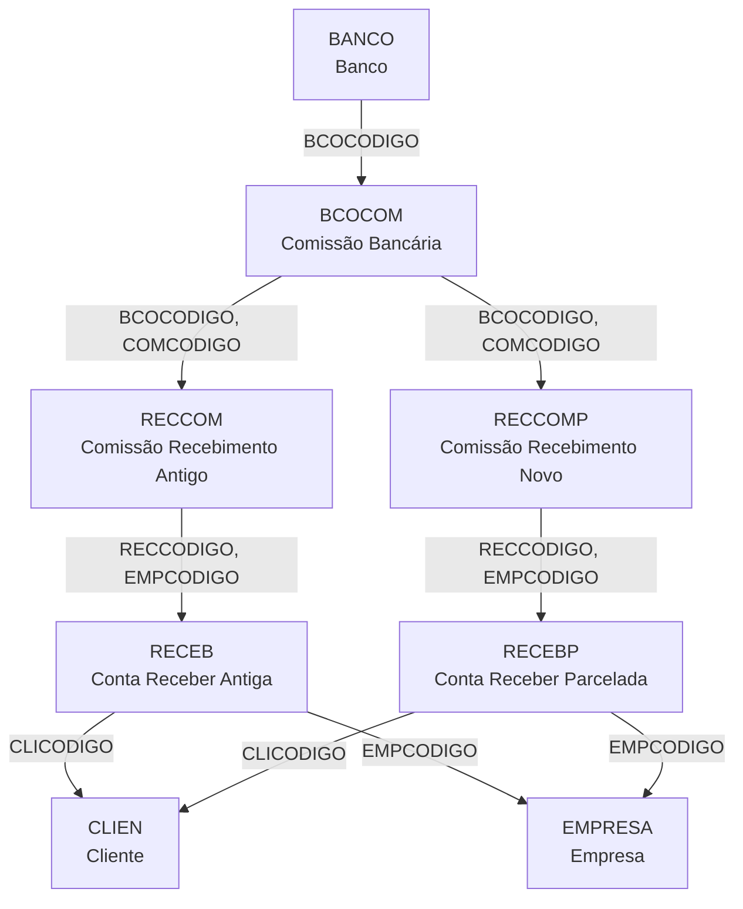

# BCOCOM - Documentação Completa de Relacionamentos

## 📊 Informações Gerais

- **Nome da Tabela**: BCOCOM (Comissões Bancárias)
- **Total de Registros**: 1
- **Total de Colunas**: 3
- **Chave Primária**: BCOCODIGO + COMCODIGO (composta)
- **Chaves Estrangeiras**: 1
- **Índices**: 0
- **Tabelas Dependentes**: 4 (RECCOM, RECCOMP e outras)
- **Banco de Dados**: Firebird

## 📝 Descrição

**BCOCOM** é uma tabela de configuração de **comissões bancárias** utilizada no sistema financeiro. Com apenas **1 registro**, esta tabela armazena a descrição/configuração de comissões relacionadas a operações bancárias, especificamente vinculadas a um banco.

Esta é uma **tabela de configuração** que funciona como **catálogo de tipos de comissões bancárias**, sendo utilizada principalmente em:
- **Comissões de recebimento** (RECCOM, RECCOMP)
- **Sistema de contas a receber** (RECEB, RECEBP)
- **Cálculo de comissões** sobre operações bancárias

**Contexto no Sistema Financeiro:**
No processo de gestão de recebimentos e operações bancárias, o sistema precisa calcular comissões que são cobradas pelos bancos. BCOCOM fornece a estrutura para identificar e classificar essas comissões, permitindo:
- Rastreamento de comissões por banco
- Cálculo de comissões sobre recebimentos
- Relatórios de comissões bancárias

---

## 🔑 Estrutura de Colunas

### Identificação
| Coluna | Tipo | Descrição |
|--------|------|-----------|
| **BCOCODIGO** 🔑🔗 | INTEGER | Código do banco (PK + FK → BANCO) |
| **COMCODIGO** 🔑 | VARCHAR(14) | Código da comissão (PK) |

### Descrição
| Coluna | Tipo | Descrição |
|--------|------|-----------|
| **COMDESCRICAO** | VARCHAR(37) | Descrição do tipo de comissão bancária |

**Regras de Negócio:**
- Chave primária composta: `BCOCODIGO + COMCODIGO`
- Cada banco pode ter múltiplos tipos de comissão
- Comissões são utilizadas em operações de recebimento

---

## 🔗 Relacionamentos - Nível 1 (Diretos)

### BANCO - Bancos (FK Obrigatória)
**Volume:** 108 registros

**Relacionamento:**
```
BCOCOM.BCOCODIGO → BANCO.BCOCODIGO (N:1) [FK: BANCO_BCOCOM]
```

**Descrição:** Cada tipo de comissão bancária está vinculado a um banco específico.

**Proporção:** ~0.009 comissões por banco em média (1 comissão / 108 bancos)

**Campos importantes em BANCO:**
- `BCOCODIGO` - Identificador único do banco
- `BCONOME` - Nome do banco
- `BCONRCOMP` - Número de compensação

---

## 🔗 Relacionamentos - Nível 2 (Indiretos via Tabelas Dependentes)

### RECCOM - Comissões de Recebimento (Sistema Antigo)
**Volume:** 0 registros (tabela vazia, sistema legado)

**Relacionamento:**
```
RECCOM.BCOCODIGO + RECCOM.COMCODIGO → BCOCOM.BCOCODIGO + BCOCOM.COMCODIGO (N:1) [FK: BCOCOM_RECCOM]
```

**Descrição:** Comissões de recebimento do sistema antigo (RECEB) vinculadas à configuração de comissão bancária.

**Campos importantes em RECCOM:**
- `RECCODIGO` - Código da conta a receber (FK → RECEB)
- `EMPCODIGO` - Código da empresa (FK → RECEB)
- `RECCCODIGO` - Código da comissão de recebimento
- `RECCDTREMESSA` - Data de remessa

**Estrutura:**
```
RECCOM → BCOCOM → BANCO
RECCOM → RECEB → CLIEN
```

**Exemplo SQL:**
```sql
SELECT
    bc.BCOCODIGO,
    bc.COMCODIGO,
    bc.COMDESCRICAO AS TIPO_COMISSAO,
    rc.RECCODIGO,
    rc.RECCDTREMESSA AS DATA_REMESSA,
    r.CLICODIGO,
    c.CLINOME AS CLIENTE
FROM BCOCOM bc
LEFT JOIN RECCOM rc ON rc.BCOCODIGO = bc.BCOCODIGO
                    AND rc.COMCODIGO = bc.COMCODIGO
LEFT JOIN RECEB r ON r.RECCODIGO = rc.RECCODIGO
                 AND r.EMPCODIGO = rc.EMPCODIGO
LEFT JOIN CLIEN c ON c.CLICODIGO = r.CLICODIGO
WHERE bc.BCOCODIGO = ?
ORDER BY rc.RECCDTREMESSA DESC
```

---

### RECCOMP - Comissões de Recebimento Parcelado (Sistema Novo)
**Volume:** 0 registros (tabela vazia, sistema atual)

**Relacionamento:**
```
RECCOMP.BCOCODIGO + RECCOMP.COMCODIGO → BCOCOM.BCOCODIGO + BCOCOM.COMCODIGO (N:1) [FK: BCOCOM_RECCOMP]
```

**Descrição:** Comissões de recebimento do sistema novo (RECEBP - contas a receber parceladas) vinculadas à configuração de comissão bancária.

**Campos importantes em RECCOMP:**
- `RECCODIGO` - Código da conta a receber (FK → RECEBP)
- `EMPCODIGO` - Código da empresa (FK → RECEBP)
- `RECCCODIGO` - Código da comissão de recebimento
- `RECCDTREMESSA` - Data de remessa

**Estrutura:**
```
RECCOMP → BCOCOM → BANCO
RECCOMP → RECEBP → CLIEN
```

**Exemplo SQL:**
```sql
SELECT
    bc.BCOCODIGO,
    bc.COMCODIGO,
    bc.COMDESCRICAO AS TIPO_COMISSAO,
    rcp.RECCODIGO,
    rcp.RECCDTREMESSA AS DATA_REMESSA,
    rp.CLICODIGO,
    rp.RECVALOR AS VALOR_CONTA,
    rp.RECVALORABERTO AS VALOR_ABERTO,
    c.CLINOME AS CLIENTE
FROM BCOCOM bc
LEFT JOIN RECCOMP rcp ON rcp.BCOCODIGO = bc.BCOCODIGO
                      AND rcp.COMCODIGO = bc.COMCODIGO
LEFT JOIN RECEBP rp ON rp.RECCODIGO = rcp.RECCODIGO
                   AND rp.EMPCODIGO = rcp.EMPCODIGO
LEFT JOIN CLIEN c ON c.CLICODIGO = rp.CLICODIGO
WHERE bc.BCOCODIGO = ?
ORDER BY rcp.RECCDTREMESSA DESC
```

---

## 🔗 Relacionamentos - Nível 3 (Exemplo Completo)

### Fluxo Completo: Banco → Comissão → Recebimento → Cliente → Empresa



**Exemplo SQL Completo (3 Níveis):**
```sql
SELECT
    -- Nível 1: BANCO
    b.BCOCODIGO,
    b.BCONOME AS BANCO_NOME,
    
    -- Nível 1: BCOCOM
    bc.COMCODIGO,
    bc.COMDESCRICAO AS TIPO_COMISSAO,
    
    -- Nível 2: RECCOMP (Sistema Novo)
    rcp.RECCODIGO AS CONTA_RECEBER,
    rcp.RECCDTREMESSA AS DATA_REMESSA,
    
    -- Nível 3: RECEBP
    rp.RECVALOR AS VALOR_CONTA,
    rp.RECVALORABERTO AS VALOR_ABERTO,
    rp.RECDTVENCTO AS DATA_VENCIMENTO,
    rp.RECDTEMISSAO AS DATA_EMISSAO,
    
    -- Nível 3: CLIEN
    c.CLICODIGO,
    c.CLINOME AS CLIENTE,
    c.CLIDOCUMENTO AS CPF_CNPJ,
    
    -- Nível 3: EMPRESA
    e.EMPRAZSOCIAL AS EMPRESA,
    e.EMPCNPJ AS CNPJ_EMPRESA

FROM BCOCOM bc

-- Nível 1 → 2: Banco
INNER JOIN BANCO b ON b.BCOCODIGO = bc.BCOCODIGO

-- Nível 1 → 2: Comissões de Recebimento (Sistema Novo)
LEFT JOIN RECCOMP rcp ON rcp.BCOCODIGO = bc.BCOCODIGO
                      AND rcp.COMCODIGO = bc.COMCODIGO

-- Nível 2 → 3: Contas a Receber Parceladas
LEFT JOIN RECEBP rp ON rp.RECCODIGO = rcp.RECCODIGO
                    AND rp.EMPCODIGO = rcp.EMPCODIGO

-- Nível 3 → 4: Cliente
LEFT JOIN CLIEN c ON c.CLICODIGO = rp.CLICODIGO

-- Nível 3 → 4: Empresa
LEFT JOIN EMPRESA e ON e.EMPCODIGO = rp.EMPCODIGO

WHERE bc.BCOCODIGO = ?
ORDER BY rcp.RECCDTREMESSA DESC, rp.RECDTVENCTO DESC
```

---

## 📊 Casos de Uso Comuns

### 1. Listar Configuração de Comissão Bancária

```sql
SELECT
    b.BCOCODIGO,
    b.BCONOME AS BANCO,
    bc.COMCODIGO,
    bc.COMDESCRICAO AS TIPO_COMISSAO
FROM BCOCOM bc
INNER JOIN BANCO b ON b.BCOCODIGO = bc.BCOCODIGO
ORDER BY b.BCONOME, bc.COMCODIGO
```

---

### 2. Comissões Utilizadas em Recebimentos (Sistema Novo)

```sql
SELECT
    b.BCONOME AS BANCO,
    bc.COMDESCRICAO AS TIPO_COMISSAO,
    COUNT(DISTINCT rcp.RECCODIGO) AS TOTAL_CONTAS_RECEBER,
    COUNT(rcp.RECCCODIGO) AS TOTAL_COMISSOES,
    MIN(rcp.RECCDTREMESSA) AS PRIMEIRA_REMESSA,
    MAX(rcp.RECCDTREMESSA) AS ULTIMA_REMESSA
FROM BCOCOM bc
INNER JOIN BANCO b ON b.BCOCODIGO = bc.BCOCODIGO
LEFT JOIN RECCOMP rcp ON rcp.BCOCODIGO = bc.BCOCODIGO
                      AND rcp.COMCODIGO = bc.COMCODIGO
GROUP BY b.BCOCODIGO, b.BCONOME, bc.COMCODIGO, bc.COMDESCRICAO
ORDER BY TOTAL_COMISSOES DESC
```

---

### 3. Comissões Utilizadas em Recebimentos (Sistema Antigo)

```sql
SELECT
    b.BCONOME AS BANCO,
    bc.COMDESCRICAO AS TIPO_COMISSAO,
    COUNT(DISTINCT rc.RECCODIGO) AS TOTAL_CONTAS_RECEBER,
    COUNT(rc.RECCCODIGO) AS TOTAL_COMISSOES,
    MIN(rc.RECCDTREMESSA) AS PRIMEIRA_REMESSA,
    MAX(rc.RECCDTREMESSA) AS ULTIMA_REMESSA
FROM BCOCOM bc
INNER JOIN BANCO b ON b.BCOCODIGO = bc.BCOCODIGO
LEFT JOIN RECCOM rc ON rc.BCOCODIGO = bc.BCOCODIGO
                    AND rc.COMCODIGO = bc.COMCODIGO
GROUP BY b.BCOCODIGO, b.BCONOME, bc.COMCODIGO, bc.COMDESCRICAO
ORDER BY TOTAL_COMISSOES DESC
```

---

### 4. Análise Comparativa: Sistema Antigo vs Novo

```sql
SELECT
    b.BCONOME AS BANCO,
    bc.COMDESCRICAO AS TIPO_COMISSAO,
    
    -- Sistema Antigo (RECCOM)
    COUNT(DISTINCT rc.RECCODIGO) AS CONTAS_RECEB_ANTIGO,
    COUNT(rc.RECCCODIGO) AS COMISSOES_ANTIGO,
    
    -- Sistema Novo (RECCOMP)
    COUNT(DISTINCT rcp.RECCODIGO) AS CONTAS_RECEB_NOVO,
    COUNT(rcp.RECCCODIGO) AS COMISSOES_NOVO,
    
    -- Total
    COUNT(DISTINCT rc.RECCODIGO) + COUNT(DISTINCT rcp.RECCODIGO) AS TOTAL_CONTAS,
    COUNT(rc.RECCCODIGO) + COUNT(rcp.RECCCODIGO) AS TOTAL_COMISSOES

FROM BCOCOM bc
INNER JOIN BANCO b ON b.BCOCODIGO = bc.BCOCODIGO
LEFT JOIN RECCOM rc ON rc.BCOCODIGO = bc.BCOCODIGO
                    AND rc.COMCODIGO = bc.COMCODIGO
LEFT JOIN RECCOMP rcp ON rcp.BCOCODIGO = bc.BCOCODIGO
                      AND rcp.COMCODIGO = bc.COMCODIGO
GROUP BY b.BCOCODIGO, b.BCONOME, bc.COMCODIGO, bc.COMDESCRICAO
ORDER BY TOTAL_COMISSOES DESC
```

---

### 5. Detalhamento de Comissões por Conta a Receber

```sql
SELECT
    b.BCONOME AS BANCO,
    bc.COMDESCRICAO AS TIPO_COMISSAO,
    rcp.RECCODIGO AS CONTA_RECEBER,
    rp.RECVALOR AS VALOR_CONTA,
    rp.RECVALORABERTO AS VALOR_ABERTO,
    rp.RECDTVENCTO AS VENCIMENTO,
    rcp.RECCDTREMESSA AS DATA_REMESSA,
    c.CLINOME AS CLIENTE,
    e.EMPRAZSOCIAL AS EMPRESA
FROM BCOCOM bc
INNER JOIN BANCO b ON b.BCOCODIGO = bc.BCOCODIGO
INNER JOIN RECCOMP rcp ON rcp.BCOCODIGO = bc.BCOCODIGO
                      AND rcp.COMCODIGO = bc.COMCODIGO
INNER JOIN RECEBP rp ON rp.RECCODIGO = rcp.RECCODIGO
                    AND rp.EMPCODIGO = rcp.EMPCODIGO
LEFT JOIN CLIEN c ON c.CLICODIGO = rp.CLICODIGO
LEFT JOIN EMPRESA e ON e.EMPCODIGO = rp.EMPCODIGO
WHERE bc.BCOCODIGO = ?
  AND rcp.RECCDTREMESSA BETWEEN ? AND ?
ORDER BY rcp.RECCDTREMESSA DESC, rp.RECDTVENCTO DESC
```

---

### 6. Relatório de Comissões por Período

```sql
SELECT
    b.BCONOME AS BANCO,
    bc.COMDESCRICAO AS TIPO_COMISSAO,
    EXTRACT(YEAR FROM rcp.RECCDTREMESSA) AS ANO,
    EXTRACT(MONTH FROM rcp.RECCDTREMESSA) AS MES,
    COUNT(DISTINCT rcp.RECCODIGO) AS TOTAL_CONTAS,
    COUNT(rcp.RECCCODIGO) AS TOTAL_COMISSOES,
    SUM(rp.RECVALOR) AS VALOR_TOTAL_CONTAS,
    SUM(rp.RECVALORABERTO) AS VALOR_ABERTO
FROM BCOCOM bc
INNER JOIN BANCO b ON b.BCOCODIGO = bc.BCOCODIGO
LEFT JOIN RECCOMP rcp ON rcp.BCOCODIGO = bc.BCOCODIGO
                      AND rcp.COMCODIGO = bc.COMCODIGO
LEFT JOIN RECEBP rp ON rp.RECCODIGO = rcp.RECCODIGO
                    AND rp.EMPCODIGO = rcp.EMPCODIGO
WHERE rcp.RECCDTREMESSA BETWEEN ? AND ?
GROUP BY 
    b.BCOCODIGO, b.BCONOME, 
    bc.COMCODIGO, bc.COMDESCRICAO,
    EXTRACT(YEAR FROM rcp.RECCDTREMESSA),
    EXTRACT(MONTH FROM rcp.RECCDTREMESSA)
ORDER BY ANO DESC, MES DESC, b.BCONOME
```

---

### 7. Verificar Uso de Comissões Bancárias

```sql
SELECT
    b.BCONOME AS BANCO,
    bc.COMCODIGO,
    bc.COMDESCRICAO AS TIPO_COMISSAO,
    
    -- Uso em RECCOM (Sistema Antigo)
    CASE 
        WHEN EXISTS (
            SELECT 1 FROM RECCOM rc 
            WHERE rc.BCOCODIGO = bc.BCOCODIGO 
            AND rc.COMCODIGO = bc.COMCODIGO
        ) THEN 'SIM' 
        ELSE 'NAO' 
    END AS USO_RECCOM,
    
    -- Uso em RECCOMP (Sistema Novo)
    CASE 
        WHEN EXISTS (
            SELECT 1 FROM RECCOMP rcp 
            WHERE rcp.BCOCODIGO = bc.BCOCODIGO 
            AND rcp.COMCODIGO = bc.COMCODIGO
        ) THEN 'SIM' 
        ELSE 'NAO' 
    END AS USO_RECCOMP,
    
    -- Total de registros
    (SELECT COUNT(*) FROM RECCOM rc 
     WHERE rc.BCOCODIGO = bc.BCOCODIGO 
     AND rc.COMCODIGO = bc.COMCODIGO) +
    (SELECT COUNT(*) FROM RECCOMP rcp 
     WHERE rcp.BCOCODIGO = bc.BCOCODIGO 
     AND rcp.COMCODIGO = bc.COMCODIGO) AS TOTAL_USOS

FROM BCOCOM bc
INNER JOIN BANCO b ON b.BCOCODIGO = bc.BCOCODIGO
ORDER BY TOTAL_USOS DESC, b.BCONOME
```

---

## 📈 Estatísticas de Volume

| Tabela | Registros | Proporção com BCOCOM | Tipo |
|--------|-----------|---------------------|------|
| **BCOCOM** | 1 | 1:1 | **TABELA PRINCIPAL** |
| BANCO | 108 | 108:1 | Bancos (1 comissão para múltiplos bancos possíveis) |
| RECCOM | 0 | 0:1 | Comissões recebimento antigo (sistema legado) |
| RECCOMP | 0 | 0:1 | Comissões recebimento novo (sistema atual) |

**Interpretação:**
- BCOCOM possui apenas **1 registro** (configuração única)
- Tabelas RECCOM e RECCOMP estão vazias (0 registros)
- Sistema pode estar migrando ou preparando estrutura para uso futuro
- Comissões podem ser calculadas dinamicamente sem necessidade de registro histórico

---

## 🎯 Principais Campos de Junção

| Campo | Presente em | Uso |
|-------|-------------|-----|
| **BCOCODIGO** | BCOCOM (PK+FK) | Banco da comissão |
| **COMCODIGO** | BCOCOM (PK) | Código do tipo de comissão |
| **BCOCODIGO + COMCODIGO** | BCOCOM → RECCOM, RECCOMP | Chave composta para referências |
| **RECCDTREMESSA** | RECCOM, RECCOMP | Data de remessa da comissão |

---

## 🚀 Performance e Otimização

### Índices Existentes

**BCOCOM:**
- Chave primária composta implícita (BCOCODIGO, COMCODIGO)
- Foreign Key implícita para BANCO

### Recomendações de Performance

1. **BCOCOM é muito pequena (1 registro)** - Queries diretas são instantâneas
2. **SEMPRE use chave composta** - Para joins com RECCOM e RECCOMP
3. **Filtre por BCOCODIGO primeiro** - Se buscar comissões de um banco específico
4. **Tabelas RECCOM/RECCOMP estão vazias** - Queries podem retornar vazio rapidamente
5. **Evite SELECT *** - Especifique apenas as colunas necessárias

### Índices Sugeridos

```sql
-- Sugestão 1: Índice para busca por banco e código de comissão
CREATE INDEX IDX_BCOCOM_BANCO_COMISSAO
ON BCOCOM (BCOCODIGO, COMCODIGO);

-- Sugestão 2: Índice para RECCOMP (quando começar a ser usado)
CREATE INDEX IDX_RECCOMP_COMISSAO_DATA
ON RECCOMP (BCOCODIGO, COMCODIGO, RECCDTREMESSA);

-- Sugestão 3: Índice para RECCOM (se sistema legado ainda for usado)
CREATE INDEX IDX_RECCOM_COMISSAO_DATA
ON RECCOM (BCOCODIGO, COMCODIGO, RECCDTREMESSA);
```

### Exemplo de Query Otimizada

```sql
-- ✅ OTIMIZADO (usa chave composta e especifica colunas)
SELECT
    bc.BCOCODIGO,
    bc.COMCODIGO,
    bc.COMDESCRICAO,
    b.BCONOME
FROM BCOCOM bc
INNER JOIN BANCO b ON b.BCOCODIGO = bc.BCOCODIGO
WHERE bc.BCOCODIGO = ?
  AND bc.COMCODIGO = ?
```

---

## 🔍 Validações e Integridade de Dados

### Validações Críticas

```sql
-- 1. Verificar se existe configuração de comissão
SELECT COUNT(*) FROM BCOCOM;  -- Deve retornar 1

-- 2. Verificar integridade referencial com BANCO
SELECT
    bc.BCOCODIGO,
    bc.COMCODIGO
FROM BCOCOM bc
LEFT JOIN BANCO b ON b.BCOCODIGO = bc.BCOCODIGO
WHERE b.BCOCODIGO IS NULL;

-- 3. Verificar uso em RECCOMP
SELECT
    bc.BCOCODIGO,
    bc.COMCODIGO,
    COUNT(rcp.RECCCODIGO) AS TOTAL_USOS
FROM BCOCOM bc
LEFT JOIN RECCOMP rcp ON rcp.BCOCODIGO = bc.BCOCODIGO
                      AND rcp.COMCODIGO = bc.COMCODIGO
GROUP BY bc.BCOCODIGO, bc.COMCODIGO
ORDER BY TOTAL_USOS DESC
```

---

## 🎨 Padrões de Uso no Sistema

### Fluxo de Comissão Bancária

```
1. CONTA A RECEBER (RECEBP)
   └─> Gera comissão bancária

2. COMISSÃO DE RECEBIMENTO (RECCOMP)
   └─> BCOCODIGO + COMCODIGO → BCOCOM
   └─> RECCDTREMESSA (data de remessa)

3. CONFIGURAÇÃO DE COMISSÃO (BCOCOM)
   └─> BCOCODIGO → BANCO
   └─> COMCODIGO + COMDESCRICAO
```

### Cálculo de Comissão

```
COMISSAO_BANCARIA = 
    Buscar BCOCOM por BCOCODIGO + COMCODIGO
    Aplicar regras de cálculo baseadas em COMDESCRICAO
    Registrar em RECCOMP com RECCDTREMESSA
```

---

## 📚 Documentos Relacionados

- [BCOCOM.md](tables/BCOCOM.md) - Documentação base da tabela
- [BANCO.md](tables/BANCO.md) - Bancos
- [RECCOM.md](tables/RECCOM.md) - Comissões recebimento antigo
- [RECCOMP.md](tables/RECCOMP.md) - Comissões recebimento novo
- [RECEBP.md](tables/RECEBP.md) - Contas a receber parceladas
- [RECEB.md](tables/RECEB.md) - Contas a receber (sistema antigo)
- [BANCO_RELACIONAMENTOS_COMPLETOS.md](tables/BANCO_RELACIONAMENTOS_COMPLETOS.md) - Relacionamentos BANCO

---

## 🛠️ Queries de Manutenção

### Backup e Verificação de Integridade

```sql
-- Backup lógico da estrutura e dados
SELECT
    'BCOCOM' as TABELA,
    bc.BCOCODIGO,
    bc.COMCODIGO,
    bc.COMDESCRICAO,
    b.BCONOME AS BANCO_NOME
FROM BCOCOM bc
INNER JOIN BANCO b ON b.BCOCODIGO = bc.BCOCODIGO
ORDER BY bc.BCOCODIGO, bc.COMCODIGO
```

### Verificação de Uso

```sql
-- Verificar se comissão está sendo utilizada
SELECT
    bc.BCOCODIGO,
    bc.COMCODIGO,
    bc.COMDESCRICAO,
    (SELECT COUNT(*) FROM RECCOM rc 
     WHERE rc.BCOCODIGO = bc.BCOCODIGO 
     AND rc.COMCODIGO = bc.COMCODIGO) AS USOS_RECCOM,
    (SELECT COUNT(*) FROM RECCOMP rcp 
     WHERE rcp.BCOCODIGO = bc.BCOCODIGO 
     AND rcp.COMCODIGO = bc.COMCODIGO) AS USOS_RECCOMP
FROM BCOCOM bc
ORDER BY bc.BCOCODIGO, bc.COMCODIGO
```

---

## 💡 Melhores Práticas

### 1. Design e Modelagem

#### ✅ Fazer
- Manter descrição clara e padronizada em COMDESCRICAO
- Vincular comissões a bancos específicos
- Documentar regras de cálculo de comissão
- Revisar periodicamente uso das comissões

#### ❌ Evitar
- Criar múltiplas comissões duplicadas para o mesmo banco
- Usar valores NULL em campos obrigatórios
- Deixar comissões órfãs (sem banco válido)

---

### 2. Performance

#### ✅ Fazer
```sql
-- BOM: Usar chave composta completa
SELECT * FROM BCOCOM
WHERE BCOCODIGO = ? AND COMCODIGO = ?;
```

#### ❌ Evitar
```sql
-- RUIM: Buscar apenas por uma parte da chave
SELECT * FROM BCOCOM WHERE BCOCODIGO = ?;
```

---

### 3. Integridade de Dados

#### ✅ Fazer
```sql
-- BOM: Validar antes de inserir
INSERT INTO BCOCOM (BCOCODIGO, COMCODIGO, COMDESCRICAO)
SELECT
    :BCOCODIGO,
    :COMCODIGO,
    :COMDESCRICAO
FROM RDB$DATABASE
WHERE EXISTS (
    SELECT 1 FROM BANCO 
    WHERE BCOCODIGO = :BCOCODIGO
)
AND NOT EXISTS (
    SELECT 1 FROM BCOCOM 
    WHERE BCOCODIGO = :BCOCODIGO 
    AND COMCODIGO = :COMCODIGO
);
```

---

### 4. Manutenção

#### Rotina Diária
```sql
-- Verificação rápida de integridade
SELECT COUNT(*) FROM BCOCOM;  -- Deve retornar 1
```

#### Rotina Semanal
```sql
-- Verificar uso de comissões
-- (usar query de verificação acima)
```

#### Rotina Mensal
```sql
-- Atualizar estatísticas de índices
SET STATISTICS INDEX PK_BCOCOM;
SET STATISTICS INDEX FK_BANCO_BCOCOM;
```

---

**Documentação gerada em**: 2025-01-27
**Versão**: 1.0
**Autor**: Claude Code

