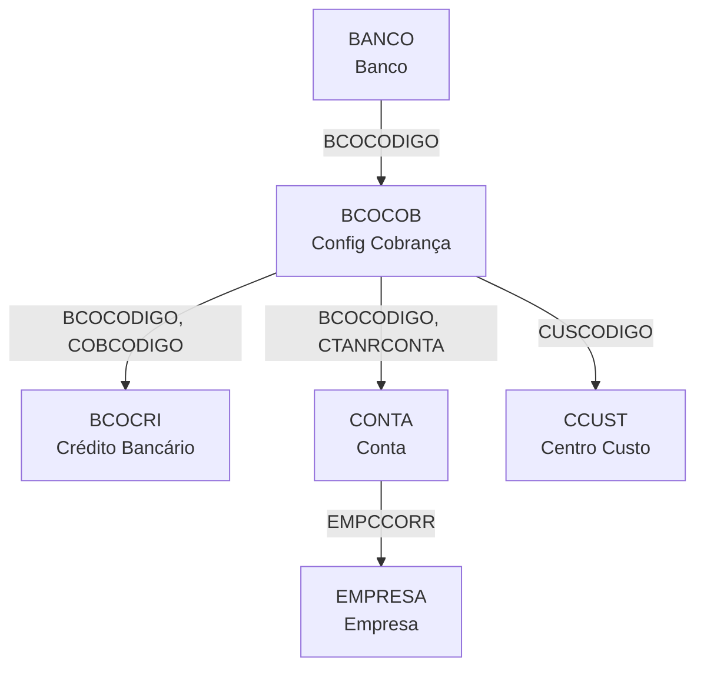

# BCOCRI - Documentação Completa de Relacionamentos

## 📊 Informações Gerais

- **Nome da Tabela**: BCOCRI (Créditos Bancários por Configuração de Cobrança)
- **Total de Registros**: 183
- **Total de Colunas**: 7
- **Chave Primária**: BCOCODIGO + COBCODIGO + CRICODIGO (composta)
- **Chaves Estrangeiras**: 2 (ambas para BCOCOB)
- **Índices**: 0
- **Tabelas Dependentes**: 0 (tabela de detalhes, não referenciada diretamente)
- **Banco de Dados**: Firebird

## 📝 Descrição

**BCOCRI** é a tabela de detalhes que armazena os **créditos bancários** associados a cada configuração de cobrança (BCOCOB). Com **183 registros**, esta tabela cataloga diferentes tipos de créditos que podem ser aplicados em operações bancárias, cada um vinculado a uma configuração específica de cobrança.

Esta é uma **tabela de catálogo de créditos** que funciona como **detalhamento de configurações de cobrança**, permitindo:
- Classificação de diferentes tipos de créditos bancários
- Associação de créditos a configurações específicas de cobrança
- Rastreamento de tipos de documentos e situações de crédito
- Gestão de créditos por banco e configuração

**Contexto no Sistema Financeiro:**
No processo de gestão de cobrança bancária, diferentes tipos de créditos podem ser aplicados dependendo da operação, situação ou tipo de documento. BCOCRI fornece a estrutura para catalogar e gerenciar esses créditos, permitindo:
- Identificação de créditos por tipo (CRITIPO)
- Classificação por tipo de documento (CRITIPODOCTO)
- Associação com situações específicas (STCODIGO)
- Vinculação a configurações de cobrança específicas

---

## 🔑 Estrutura de Colunas

### Identificação
| Coluna | Tipo | Descrição |
|--------|------|-----------|
| **BCOCODIGO** 🔑🔗 | INTEGER | Código do banco (PK + FK → BCOCOB) |
| **COBCODIGO** 🔑🔗 | VARCHAR(14) | Código da configuração de cobrança (PK + FK → BCOCOB) |
| **CRICODIGO** 🔑 | VARCHAR(14) | Código do crédito bancário (PK) |

### Descrição e Classificação
| Coluna | Tipo | Descrição |
|--------|------|-----------|
| **CRIDESCRICAO** | VARCHAR(37) | Descrição do tipo de crédito bancário |
| **CRITIPO** | VARCHAR(14) | Tipo/categoria do crédito |
| **STCODIGO** | VARCHAR(14) | Código da situação/status |
| **CRITIPODOCTO** | VARCHAR(14) | Tipo de documento relacionado ao crédito |

**Regras de Negócio:**
- Chave primária composta: `BCOCODIGO + COBCODIGO + CRICODIGO`
- Cada configuração de cobrança pode ter múltiplos créditos associados
- Créditos são classificados por tipo e situação
- Tipos de documentos podem ser associados aos créditos

---

## 🔗 Relacionamentos - Nível 1 (Diretos)

### BCOCOB - Configurações de Cobrança Bancária (FK Dupla Obrigatória)
**Volume:** 11 registros

**Relacionamentos:**
```
BCOCRI.BCOCODIGO → BCOCOB.BCOCODIGO (N:1) [FK: BCOCOB_BCOCRI]
BCOCRI.COBCODIGO → BCOCOB.COBCODIGO (N:1) [FK: BCOCOB_BCOCRI]
```

**Descrição:** Cada crédito bancário está vinculado a uma configuração específica de cobrança através da chave composta BCOCODIGO + COBCODIGO.

**Proporção:** ~16.6 créditos por configuração em média (183 créditos / 11 configs)

**Campos importantes em BCOCOB:**
- `BCOCODIGO` - Código do banco
- `COBCODIGO` - Código da configuração de cobrança
- `COBNOME` - Nome da configuração
- `COBCARTEIRA` - Carteira de cobrança
- `COBNRCONTRATO` - Número do contrato

**Características:**
- Tipo: Relacionamento Mestre-Detalhe (Master-Detail)
- Integridade: FK obrigatória dupla (BCOCODIGO + COBCODIGO)
- Média: ~16.6 créditos por configuração
- Range típico: Variável dependendo da configuração

---

## 🔗 Relacionamentos - Nível 2 (Indiretos via BCOCOB)

### Fluxo: BCOCRI → BCOCOB → BANCO


**Descrição:** Do crédito bancário até o banco através da configuração de cobrança.

**Exemplo SQL:**
```sql
SELECT
    cri.CRICODIGO,
    cri.CRIDESCRICAO AS DESCRICAO_CREDITO,
    cri.CRITIPO AS TIPO_CREDITO,
    bc.COBNOME AS CONFIG_COBRANCA,
    bc.COBCARTEIRA AS CARTEIRA,
    b.BCONOME AS BANCO
FROM BCOCRI cri
INNER JOIN BCOCOB bc ON bc.BCOCODIGO = cri.BCOCODIGO
                    AND bc.COBCODIGO = cri.COBCODIGO
INNER JOIN BANCO b ON b.BCOCODIGO = bc.BCOCODIGO
WHERE cri.BCOCODIGO = ?
ORDER BY cri.CRITIPO, cri.CRIDESCRICAO
```

---

### Fluxo: BCOCRI → BCOCOB → CONTA


**Descrição:** Do crédito até a conta bancária através da configuração de cobrança.

**Exemplo SQL:**
```sql
SELECT
    cri.CRICODIGO,
    cri.CRIDESCRICAO AS DESCRICAO_CREDITO,
    cri.CRITIPO AS TIPO_CREDITO,
    bc.COBNOME AS CONFIG_COBRANCA,
    c.CTANRCONTA AS CONTA,
    c.CTAAGENCIA AS AGENCIA,
    e.EMPRAZSOCIAL AS EMPRESA
FROM BCOCRI cri
INNER JOIN BCOCOB bc ON bc.BCOCODIGO = cri.BCOCODIGO
                    AND bc.COBCODIGO = cri.COBCODIGO
LEFT JOIN CONTA c ON c.BCOCODIGO = bc.BCOCODIGO
                 AND c.CTANRCONTA = bc.CTANRCONTA
                 AND c.EMPCCORR = bc.EMPCCORR
LEFT JOIN EMPRESA e ON e.EMPCODIGO = c.EMPCCORR
WHERE cri.BCOCODIGO = ?
ORDER BY cri.CRITIPO
```

---

### Fluxo: BCOCRI → BCOCOB → CCUST


**Descrição:** Do crédito até o centro de custo através da configuração de cobrança.

---

## 🔗 Relacionamentos - Nível 3 (Exemplo Completo)

### Fluxo Completo: Banco → Configuração → Crédito → Conta → Empresa



**Exemplo SQL Completo (3 Níveis):**
```sql
SELECT
    -- Nível 1: BANCO
    b.BCOCODIGO,
    b.BCONOME AS BANCO_NOME,
    
    -- Nível 1: BCOCOB
    bc.COBCODIGO,
    bc.COBNOME AS CONFIG_NOME,
    bc.COBCARTEIRA AS CARTEIRA,
    
    -- Nível 2: BCOCRI
    cri.CRICODIGO,
    cri.CRIDESCRICAO AS DESCRICAO_CREDITO,
    cri.CRITIPO AS TIPO_CREDITO,
    cri.STCODIGO AS SITUACAO,
    cri.CRITIPODOCTO AS TIPO_DOCUMENTO,
    
    -- Nível 2: CONTA
    c.CTANRCONTA AS CONTA,
    c.CTAAGENCIA AS AGENCIA,
    
    -- Nível 3: EMPRESA
    e.EMPRAZSOCIAL AS EMPRESA,
    
    -- Nível 2: CCUST
    cc.CUSDESCRICAO AS CENTRO_CUSTO

FROM BCOCRI cri

-- Nível 1 → 2: Configuração de Cobrança
INNER JOIN BCOCOB bc ON bc.BCOCODIGO = cri.BCOCODIGO
                    AND bc.COBCODIGO = cri.COBCODIGO

-- Nível 1 → 2: Banco
INNER JOIN BANCO b ON b.BCOCODIGO = bc.BCOCODIGO

-- Nível 1 → 2: Conta
LEFT JOIN CONTA c ON c.BCOCODIGO = bc.BCOCODIGO
                 AND c.CTANRCONTA = bc.CTANRCONTA
                 AND c.EMPCCORR = bc.EMPCCORR

-- Nível 2 → 3: Empresa
LEFT JOIN EMPRESA e ON e.EMPCODIGO = c.EMPCCORR

-- Nível 1 → 2: Centro de Custo
LEFT JOIN CCUST cc ON cc.CUSCODIGO = bc.CUSCODIGO

WHERE cri.BCOCODIGO = ?
ORDER BY cri.CRITIPO, cri.CRIDESCRICAO
```

---

## 📊 Casos de Uso Comuns

### 1. Listar Todos os Créditos por Configuração de Cobrança

```sql
SELECT
    b.BCONOME AS BANCO,
    bc.COBNOME AS CONFIGURACAO,
    cri.CRICODIGO,
    cri.CRIDESCRICAO AS DESCRICAO_CREDITO,
    cri.CRITIPO AS TIPO_CREDITO,
    cri.STCODIGO AS SITUACAO,
    cri.CRITIPODOCTO AS TIPO_DOCUMENTO
FROM BCOCRI cri
INNER JOIN BCOCOB bc ON bc.BCOCODIGO = cri.BCOCODIGO
                    AND bc.COBCODIGO = cri.COBCODIGO
INNER JOIN BANCO b ON b.BCOCODIGO = bc.BCOCODIGO
WHERE cri.BCOCODIGO = ?
  AND cri.COBCODIGO = ?
ORDER BY cri.CRITIPO, cri.CRIDESCRICAO
```

---

### 2. Análise de Créditos por Tipo

```sql
SELECT
    cri.CRITIPO AS TIPO_CREDITO,
    COUNT(*) AS TOTAL_CREDITOS,
    COUNT(DISTINCT cri.BCOCODIGO) AS BANCOS_DISTINTOS,
    COUNT(DISTINCT cri.COBCODIGO) AS CONFIGS_DISTINTAS,
    LIST(DISTINCT cri.CRIDESCRICAO) AS DESCRICOES
FROM BCOCRI cri
GROUP BY cri.CRITIPO
ORDER BY TOTAL_CREDITOS DESC
```

---

### 3. Créditos por Banco e Configuração

```sql
SELECT
    b.BCONOME AS BANCO,
    bc.COBNOME AS CONFIGURACAO,
    bc.COBCARTEIRA AS CARTEIRA,
    COUNT(cri.CRICODIGO) AS TOTAL_CREDITOS,
    COUNT(DISTINCT cri.CRITIPO) AS TIPOS_DISTINTOS,
    COUNT(DISTINCT cri.STCODIGO) AS SITUACOES_DISTINTAS,
    LIST(DISTINCT cri.CRITIPO) AS TIPOS_CREDITO
FROM BCOCRI cri
INNER JOIN BCOCOB bc ON bc.BCOCODIGO = cri.BCOCODIGO
                    AND bc.COBCODIGO = cri.COBCODIGO
INNER JOIN BANCO b ON b.BCOCODIGO = bc.BCOCODIGO
GROUP BY b.BCOCODIGO, b.BCONOME, bc.COBCODIGO, bc.COBNOME, bc.COBCARTEIRA
ORDER BY TOTAL_CREDITOS DESC
```

---

### 4. Buscar Crédito por Tipo e Situação

```sql
SELECT
    b.BCONOME AS BANCO,
    bc.COBNOME AS CONFIGURACAO,
    cri.CRICODIGO,
    cri.CRIDESCRICAO AS DESCRICAO_CREDITO,
    cri.CRITIPO AS TIPO_CREDITO,
    cri.STCODIGO AS SITUACAO,
    cri.CRITIPODOCTO AS TIPO_DOCUMENTO
FROM BCOCRI cri
INNER JOIN BCOCOB bc ON bc.BCOCODIGO = cri.BCOCODIGO
                    AND bc.COBCODIGO = cri.COBCODIGO
INNER JOIN BANCO b ON b.BCOCODIGO = bc.BCOCODIGO
WHERE cri.CRITIPO = ?
  AND cri.STCODIGO = ?
ORDER BY b.BCONOME, bc.COBNOME
```

---

### 5. Relatório de Créditos por Tipo de Documento

```sql
SELECT
    cri.CRITIPODOCTO AS TIPO_DOCUMENTO,
    COUNT(*) AS TOTAL_CREDITOS,
    COUNT(DISTINCT cri.BCOCODIGO) AS BANCOS_DISTINTOS,
    COUNT(DISTINCT cri.COBCODIGO) AS CONFIGS_DISTINTAS,
    COUNT(DISTINCT cri.CRITIPO) AS TIPOS_DISTINTOS,
    LIST(DISTINCT cri.CRIDESCRICAO) AS DESCRICOES
FROM BCOCRI cri
WHERE cri.CRITIPODOCTO IS NOT NULL
GROUP BY cri.CRITIPODOCTO
ORDER BY TOTAL_CREDITOS DESC
```

---

### 6. Matriz de Créditos: Banco x Tipo de Crédito

```sql
SELECT
    b.BCONOME AS BANCO,
    cri.CRITIPO AS TIPO_CREDITO,
    COUNT(*) AS TOTAL_CREDITOS,
    COUNT(DISTINCT cri.COBCODIGO) AS CONFIGS_UTILIZADAS,
    LIST(DISTINCT cri.CRIDESCRICAO) AS DESCRICOES
FROM BCOCRI cri
INNER JOIN BCOCOB bc ON bc.BCOCODIGO = cri.BCOCODIGO
                    AND bc.COBCODIGO = cri.COBCODIGO
INNER JOIN BANCO b ON b.BCOCODIGO = bc.BCOCODIGO
GROUP BY b.BCOCODIGO, b.BCONOME, cri.CRITIPO
ORDER BY b.BCONOME, TOTAL_CREDITOS DESC
```

---

### 7. Verificar Integridade: Créditos sem Configuração

```sql
SELECT
    cri.BCOCODIGO,
    cri.COBCODIGO,
    cri.CRICODIGO,
    cri.CRIDESCRICAO,
    'CONFIGURACAO_NAO_ENCONTRADA' AS ERRO
FROM BCOCRI cri
LEFT JOIN BCOCOB bc ON bc.BCOCODIGO = cri.BCOCODIGO
                   AND bc.COBCODIGO = cri.COBCODIGO
WHERE bc.BCOCODIGO IS NULL
   OR bc.COBCODIGO IS NULL
ORDER BY cri.BCOCODIGO, cri.COBCODIGO
```

---

## 📈 Estatísticas de Volume

| Tabela | Registros | Proporção com BCOCRI | Tipo |
|--------|-----------|---------------------|------|
| **BCOCRI** | 183 | 1:1 | **TABELA PRINCIPAL** |
| BCOCOB | 11 | 16.6:1 | Configurações de cobrança (cada config ~16.6 créditos) |
| BANCO | 108 | 0.59:1 | Bancos (múltiplos créditos por banco) |

**Interpretação:**
- Cada configuração de cobrança possui em média **16.6 créditos** associados
- Range típico: Variável dependendo da complexidade da configuração
- Total de **183 créditos** catalogados no sistema
- Créditos são organizados por tipo, situação e tipo de documento

---

## 🎯 Principais Campos de Junção

| Campo | Presente em | Uso |
|-------|-------------|-----|
| **BCOCODIGO** | BCOCRI (PK+FK) | Banco do crédito |
| **COBCODIGO** | BCOCRI (PK+FK) | Configuração de cobrança do crédito |
| **CRICODIGO** | BCOCRI (PK) | Código único do crédito |
| **BCOCODIGO + COBCODIGO** | BCOCRI → BCOCOB | Chave composta para referência |
| **CRITIPO** | BCOCRI | Tipo/categoria do crédito (para agrupamento) |
| **STCODIGO** | BCOCRI | Situação do crédito (para filtros) |
| **CRITIPODOCTO** | BCOCRI | Tipo de documento (para classificação) |

---

## 🚀 Performance e Otimização

### Índices Existentes

**BCOCRI:**
- Chave primária composta implícita (BCOCODIGO, COBCODIGO, CRICODIGO)
- Foreign Keys implícitas para BCOCOB

### Recomendações de Performance

1. **BCOCRI é pequena (183 registros)** - Queries diretas são rápidas
2. **SEMPRE use chave composta completa** - Para joins com BCOCOB
3. **Filtre por BCOCODIGO + COBCODIGO primeiro** - Se buscar créditos de uma config específica
4. **Use CRITIPO para agrupamento** - Se buscar créditos por tipo
5. **Evite SELECT *** - Especifique apenas as colunas necessárias

### Índices Sugeridos

```sql
-- Sugestão 1: Índice para busca por configuração
CREATE INDEX IDX_BCOCRI_CONFIG
ON BCOCRI (BCOCODIGO, COBCODIGO, CRICODIGO);

-- Sugestão 2: Índice para busca por tipo de crédito
CREATE INDEX IDX_BCOCRI_TIPO
ON BCOCRI (CRITIPO, BCOCODIGO, COBCODIGO);

-- Sugestão 3: Índice para busca por situação
CREATE INDEX IDX_BCOCRI_SITUACAO
ON BCOCRI (STCODIGO, CRITIPO) WHERE STCODIGO IS NOT NULL;

-- Sugestão 4: Índice para busca por tipo de documento
CREATE INDEX IDX_BCOCRI_TIPO_DOC
ON BCOCRI (CRITIPODOCTO, CRITIPO) WHERE CRITIPODOCTO IS NOT NULL;
```

### Exemplo de Query Otimizada

```sql
-- ❌ NÃO OTIMIZADO (busca parcial da chave)
SELECT * FROM BCOCRI WHERE BCOCODIGO = ?;

-- ✅ OTIMIZADO (usa chave composta completa e especifica colunas)
SELECT
    cri.CRICODIGO,
    cri.CRIDESCRICAO,
    cri.CRITIPO,
    cri.STCODIGO
FROM BCOCRI cri
WHERE cri.BCOCODIGO = ?
  AND cri.COBCODIGO = ?
ORDER BY cri.CRITIPO, cri.CRIDESCRICAO
```

---

## 🔍 Validações e Integridade de Dados

### Validações Críticas

```sql
-- 1. Verificar integridade referencial com BCOCOB
SELECT
    cri.BCOCODIGO,
    cri.COBCODIGO,
    cri.CRICODIGO,
    cri.CRIDESCRICAO
FROM BCOCRI cri
LEFT JOIN BCOCOB bc ON bc.BCOCODIGO = cri.BCOCODIGO
                   AND bc.COBCODIGO = cri.COBCODIGO
WHERE bc.BCOCODIGO IS NULL
   OR bc.COBCODIGO IS NULL;

-- 2. Verificar campos obrigatórios NULL
SELECT
    cri.CRICODIGO,
    CASE WHEN cri.CRIDESCRICAO IS NULL THEN 'DESCRICAO_NULA' ELSE '' END as ERRO1,
    CASE WHEN cri.CRITIPO IS NULL THEN 'TIPO_NULO' ELSE '' END as ERRO2
FROM BCOCRI cri
WHERE cri.CRIDESCRICAO IS NULL
   OR cri.CRITIPO IS NULL;

-- 3. Verificar duplicatas (mesmo crédito para mesma config)
SELECT
    cri.BCOCODIGO,
    cri.COBCODIGO,
    cri.CRICODIGO,
    COUNT(*) AS OCORRENCIAS
FROM BCOCRI cri
GROUP BY cri.BCOCODIGO, cri.COBCODIGO, cri.CRICODIGO
HAVING COUNT(*) > 1;
```

---

## 🎨 Padrões de Uso no Sistema

### Fluxo de Crédito Bancário

```
1. CONFIGURAÇÃO DE COBRANÇA (BCOCOB)
   └─> BCOCODIGO + COBCODIGO

2. CRÉDITO BANCÁRIO (BCOCRI)
   └─> BCOCODIGO + COBCODIGO → BCOCOB
   └─> CRICODIGO (código único)
   └─> CRIDESCRICAO (descrição)
   └─> CRITIPO (tipo/categoria)
   └─> STCODIGO (situação)
   └─> CRITIPODOCTO (tipo documento)
```

### Classificação de Créditos

```
CREDITO_BANCARIO = 
    Buscar BCOCRI por BCOCODIGO + COBCODIGO + CRICODIGO
    Classificar por CRITIPO
    Filtrar por STCODIGO (se necessário)
    Associar com CRITIPODOCTO (se aplicável)
```

---

## 📚 Documentos Relacionados

- [BCOCRI.md](tables/BCOCRI.md) - Documentação base da tabela
- [BCOCOB.md](tables/BCOCOB.md) - Configurações de cobrança
- [BCOCOB_RELACIONAMENTOS_COMPLETOS.md](tables/BCOCOB_RELACIONAMENTOS_COMPLETOS.md) - Relacionamentos BCOCOB
- [BANCO.md](tables/BANCO.md) - Bancos
- [CONTA.md](tables/CONTA.md) - Contas bancárias
- [CCUST.md](tables/CCUST.md) - Centros de custo

---

## 🛠️ Queries de Manutenção

### Backup e Verificação de Integridade

```sql
-- Backup lógico da estrutura e dados
SELECT
    'BCOCRI' as TABELA,
    cri.BCOCODIGO,
    cri.COBCODIGO,
    cri.CRICODIGO,
    cri.CRIDESCRICAO,
    cri.CRITIPO,
    cri.STCODIGO,
    cri.CRITIPODOCTO,
    bc.COBNOME AS CONFIG_NOME,
    b.BCONOME AS BANCO_NOME
FROM BCOCRI cri
LEFT JOIN BCOCOB bc ON bc.BCOCODIGO = cri.BCOCODIGO
                   AND bc.COBCODIGO = cri.COBCODIGO
LEFT JOIN BANCO b ON b.BCOCODIGO = cri.BCOCODIGO
ORDER BY cri.BCOCODIGO, cri.COBCODIGO, cri.CRITIPO
```

### Análise de Distribuição de Créditos

```sql
-- Distribuição de créditos por configuração
SELECT
    bc.COBNOME AS CONFIGURACAO,
    COUNT(cri.CRICODIGO) AS TOTAL_CREDITOS,
    COUNT(DISTINCT cri.CRITIPO) AS TIPOS_DISTINTOS,
    COUNT(DISTINCT cri.STCODIGO) AS SITUACOES_DISTINTAS,
    MIN(cri.CRIDESCRICAO) AS PRIMEIRA_DESCRICAO,
    MAX(cri.CRIDESCRICAO) AS ULTIMA_DESCRICAO
FROM BCOCRI cri
INNER JOIN BCOCOB bc ON bc.BCOCODIGO = cri.BCOCODIGO
                    AND bc.COBCODIGO = cri.COBCODIGO
GROUP BY bc.BCOCODIGO, bc.COBCODIGO, bc.COBNOME
ORDER BY TOTAL_CREDITOS DESC
```

---

## 💡 Melhores Práticas

### 1. Design e Modelagem

#### ✅ Fazer
- Manter descrições claras e padronizadas em CRIDESCRICAO
- Usar CRITIPO de forma consistente para classificação
- Documentar significados de STCODIGO e CRITIPODOCTO
- Vincular créditos corretamente a configurações de cobrança

#### ❌ Evitar
- Criar créditos duplicados para a mesma configuração
- Usar valores NULL em campos obrigatórios (CRIDESCRICAO, CRITIPO)
- Deixar créditos órfãos (sem configuração válida)
- Nomenclatura inconsistente em CRITIPO

---

### 2. Performance

#### ✅ Fazer
```sql
-- BOM: Usar chave composta completa
SELECT * FROM BCOCRI
WHERE BCOCODIGO = ? AND COBCODIGO = ? AND CRICODIGO = ?;
```

#### ❌ Evitar
```sql
-- RUIM: Buscar apenas por parte da chave
SELECT * FROM BCOCRI WHERE BCOCODIGO = ?;
```

---

### 3. Integridade de Dados

#### ✅ Fazer
```sql
-- BOM: Validar antes de inserir
INSERT INTO BCOCRI (BCOCODIGO, COBCODIGO, CRICODIGO, CRIDESCRICAO, CRITIPO)
SELECT
    :BCOCODIGO,
    :COBCODIGO,
    :CRICODIGO,
    :CRIDESCRICAO,
    :CRITIPO
FROM RDB$DATABASE
WHERE EXISTS (
    SELECT 1 FROM BCOCOB 
    WHERE BCOCODIGO = :BCOCODIGO 
    AND COBCODIGO = :COBCODIGO
)
AND NOT EXISTS (
    SELECT 1 FROM BCOCRI 
    WHERE BCOCODIGO = :BCOCODIGO 
    AND COBCODIGO = :COBCODIGO
    AND CRICODIGO = :CRICODIGO
);
```

---

### 4. Manutenção

#### Rotina Diária
```sql
-- Verificação rápida de integridade
SELECT COUNT(*) FROM BCOCRI;  -- Deve retornar 183
```

#### Rotina Semanal
```sql
-- Verificar integridade referencial
-- (usar queries de validação acima)
```

#### Rotina Mensal
```sql
-- Atualizar estatísticas de índices
SET STATISTICS INDEX PK_BCOCRI;
SET STATISTICS INDEX FK_BCOCOB_BCOCRI;
```

---

**Documentação gerada em**: 2025-01-27
**Versão**: 1.0
**Autor**: Claude Code

