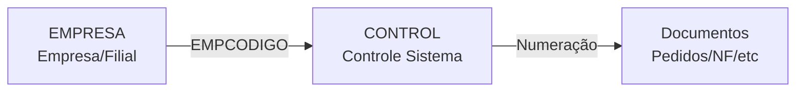
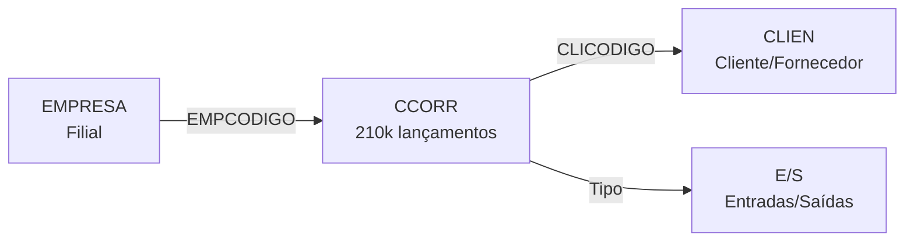
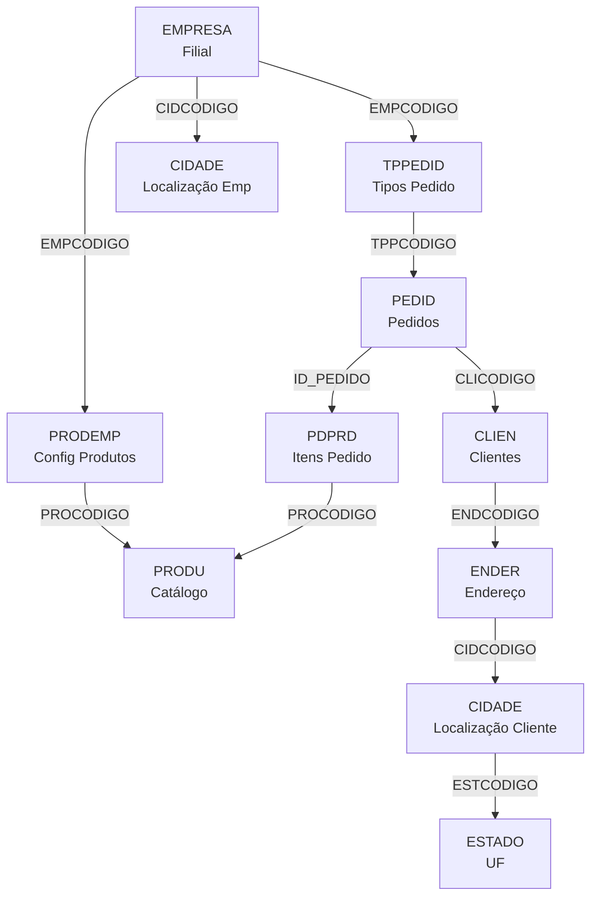

# EMPRESA - Documentação Completa de Relacionamentos

## 📊 Informações Gerais

- **Nome da Tabela**: EMPRESA (Empresas/Filiais)
- **Total de Registros**: 6
- **Total de Colunas**: ~80 (estimado)
- **Chave Primária**: EMPCODIGO (SMALLINT)
- **Chaves Estrangeiras OUT**: 5+
- **Índices**: Múltiplos
- **Tabelas Dependentes (FK IN)**: 51
- **Banco de Dados**: Firebird (READ-ONLY)

## 📝 Descrição

**EMPRESA** é a tabela mestre que armazena informações sobre empresas e filiais do sistema ERP. Ela contém dados cadastrais completos, fiscais, endereço, contatos e configurações operacionais de cada unidade de negócio.

Esta é uma **tabela central** que é referenciada por 51 tabelas dependentes, servindo como base para multi-empresa/multi-filial em praticamente todos os módulos do sistema.

**Dados típicos**: 6 empresas cadastradas (matriz + filiais)

---

## 🔑 Estrutura de Colunas Principais

### Identificação e Controle
| Coluna | Tipo | Descrição |
|--------|------|-----------|
| **EMPCODIGO** 🔑 | SMALLINT | Código único da empresa (PK) |
| **EMPRAZSOCIAL** | VARCHAR | Razão social da empresa |
| **EMPNOMEFNT** | VARCHAR | Nome fantasia |
| **EMPFJ** | CHAR(1) | Tipo pessoa: 'J' (Jurídica) ou 'F' (Física) |
| **EMPCNPJ** | VARCHAR | CNPJ/CPF da empresa |

### Dados Fiscais
| Coluna | Tipo | Descrição |
|--------|------|-----------|
| **EMPINSCEST** | VARCHAR | Inscrição estadual |
| **EMPINSCMUN** | VARCHAR | Inscrição municipal |
| **EMPCNAE** | VARCHAR | Código CNAE |
| **EMPREGIMETRIB** | VARCHAR | Regime tributário |

### Endereço
| Coluna | Tipo | Descrição |
|--------|------|-----------|
| **CIDCODIGO** | INTEGER | 🔗 Código da cidade (FK → CIDADE) |
| **EMPTPRUA** | VARCHAR | Tipo de logradouro |
| **EMPENDERECO** | VARCHAR | Endereço completo |
| **EMPNR** | VARCHAR | Número |
| **EMPCOMPLEMENTO** | VARCHAR | Complemento |
| **EMPBAIRRO** | VARCHAR | Bairro |
| **EMPCEP** | VARCHAR | CEP |

### Contato
| Coluna | Tipo | Descrição |
|--------|------|-----------|
| **EMPTELEFONE** | VARCHAR | Telefone principal |
| **EMPFAX** | VARCHAR | Fax |
| **EMPEMAIL** | VARCHAR | E-mail |
| **EMPSITE** | VARCHAR | Website |

### Configurações Bancárias
| Coluna | Tipo | Descrição |
|--------|------|-----------|
| **EMPBCOCODIGO** | INTEGER | 🔗 Código do banco principal |
| **BCOCODCTA** | VARCHAR | Código da conta bancária |
| **CTANRCONTA** | VARCHAR | Número da conta |
| **EMPCCORR** | VARCHAR | Conta corrente |

### Responsáveis e Contadores
| Coluna | Tipo | Descrição |
|--------|------|-----------|
| **EMPCODRESP** | INTEGER | 🔗 Código do responsável (FK → CLIEN) |
| **EMPCODCONT** | INTEGER | 🔗 Código do contador (FK → CLIEN) |
| **EMPFUNCODIGO** | INTEGER | 🔗 Código do funcionário responsável |

### Controle e Datas
| Coluna | Tipo | Descrição |
|--------|------|-----------|
| **EMPDTCAIXA** | TIMESTAMP | Data/hora do caixa |
| **DTCONTABILIZADO** | TIMESTAMP | Data contabilizado |
| **DTCONTFECH** | TIMESTAMP | Data de fechamento contábil |
| **EMPDTCAD** | DATE | Data de cadastro |

### Outras Configurações
| Coluna | Tipo | Descrição |
|--------|------|-----------|
| **EMPOBSCODIGO** | INTEGER | Código de observações |
| **ALCCODIGO** | INTEGER | 🔗 Código de alíquota (FK → ALIQCP) |

---

## 🔗 Relacionamentos - Nível 1: Foreign Keys OUT

### EMPRESA Referencia Outras Tabelas

#### EMPRESA → CIDADE
**Relacionamento:**
```
EMPRESA.CIDCODIGO → CIDADE.CIDCODIGO (N:1)
```

**Descrição:** Localização da empresa (cidade/município).

**Constraint:** `CIDADE_EMPRESA`

---

#### EMPRESA → CLIEN (Responsável)
**Relacionamento:**
```
EMPRESA.EMPCODRESP → CLIEN.CLICODIGO (N:1)
```

**Descrição:** Responsável legal da empresa cadastrado como cliente.

**Constraint:** `CLIEN_EMPRESA1`

---

#### EMPRESA → CLIEN (Contador)
**Relacionamento:**
```
EMPRESA.EMPCODCONT → CLIEN.CLICODIGO (N:1)
```

**Descrição:** Contador da empresa cadastrado como cliente.

**Constraint:** `CLIEN_EMPRESA`

---

#### EMPRESA → CONTA (Conta Bancária)
**Relacionamento:**
```
EMPRESA.BCOCODCTA → CONTA.BCOCODIGO (N:1)
EMPRESA.CTANRCONTA → CONTA.CTANRCONTA (N:1)
EMPRESA.EMPCCORR → CONTA.EMPCCORR (N:1)
```

**Descrição:** Conta bancária principal da empresa (chave composta).

**Constraint:** `CONTA_EMPRESA`

---

#### EMPRESA → TPRUA
**Relacionamento:**
```
EMPRESA.EMPTPRUA → TPRUA.TPRCODIGO (N:1)
```

**Descrição:** Tipo de logradouro (Rua, Avenida, etc).

**Constraint:** `TPRUA_EMPRESA`

---

#### EMPRESA → ALIQCP
**Relacionamento:**
```
EMPRESA.ALCCODIGO → ALIQCP.ALCCODIGO (N:1)
EMPRESA.EMPCODIGO → ALIQCP.EMPCODIGO (N:1)
```

**Descrição:** Alíquotas e configurações fiscais por empresa.

**Constraint:** `ALIQCP_EMPRESA`

---

## 🔗 Relacionamentos - Nível 1: Foreign Keys IN (51 Tabelas Dependentes)

### Categoria: Configurações de Produtos e Serviços (11 tabelas)

#### PRODEMP - Produto x Empresa ⚡
**Relacionamento:**
```
PRODEMP.EMPCODIGO → EMPRESA.EMPCODIGO (N:1)
```

**Descrição:** Configurações específicas de produtos por empresa/filial.

**Constraint:** `EMPRESA_PRODEMP`

**Volume:** ~0 registros (tabela de configuração)

---

#### TPLEMP - Tipo Lente x Empresa ⭐
**Relacionamento:**
```
TPLEMP.EMPCODIGO → EMPRESA.EMPCODIGO (N:1)
```

**Descrição:** Configuração de tipos de lente disponíveis por empresa.

**Constraint:** `EMPRESA_TPLEMP`

**Volume:** 11.776 registros

**Importância:** Alta - Define quais tipos de lentes cada filial trabalha.

---

#### TPPEDID - Tipo Pedido x Empresa 🔥
**Relacionamento:**
```
TPPEDID.EMPCODIGO → EMPRESA.EMPCODIGO (N:1)
```

**Descrição:** Tipos de pedidos configurados por empresa.

**Constraint:** `EMPRESA_TPPEDID`

**Volume:** 17 registros

---

#### IMPR* - Configurações de Impressão (7 tabelas)
**Relacionamento:**
```
IMPRPRODU.EMPCODIGO → EMPRESA.EMPCODIGO (N:1)
IMPRSERVI.EMPCODIGO → EMPRESA.EMPCODIGO (N:1)
IMPRTPLENTE.EMPCODIGO → EMPRESA.EMPCODIGO (N:1)
IMPRTPPED.EMPCODIGO → EMPRESA.EMPCODIGO (N:1)
IMPRPCS.EMPCODIGO → EMPRESA.EMPCODIGO (N:1)
IMPRPEDIDORIGEM.EMPCODIGO → EMPRESA.EMPCODIGO (N:1)
IMPRSISEXT.EMPCODIGO → EMPRESA.EMPCODIGO (N:1)
```

**Descrição:** Configurações de impressão de documentos por empresa.

**Constraint:** `EMPRESA_IMPR*`

**Volume:** Baixo (configurações)

---

#### Outras Configurações:
- **PRODEMPEXP** - Exportação de produtos por empresa
- **SERVEMPEXP** - Exportação de serviços por empresa
- **SUGPROEMP** - Sugestão de produtos por empresa

---

### Categoria: Operações Comerciais (8 tabelas)

#### CONTROL - Controle Geral do Sistema ⚡
**Relacionamento:**
```
CONTROL.EMPCODIGO → EMPRESA.EMPCODIGO (N:1)
```

**Descrição:** Tabela de controle central do sistema por empresa (numeração, configurações globais).

**Constraint:** `EMPRESA_CONTROL`

**Volume:** 8 registros (1-2 por empresa)

**Importância:** CRÍTICA - Controla numeração de documentos, configurações operacionais.

---

#### CTRLTPPED - Controle Tipo Pedido
**Relacionamento:**
```
CTRLTPPED.EMPCODIGO → EMPRESA.EMPCODIGO (N:1)
```

**Descrição:** Controle e numeração de tipos de pedidos por empresa.

**Constraint:** `EMPRESA_CTRLTPPED`

---

#### PRCONSIG - Produtos em Consignação
**Relacionamento:**
```
PRCONSIG.EMPCODIGO → EMPRESA.EMPCODIGO (N:1)
```

**Descrição:** Controle de produtos em consignação por empresa.

**Constraint:** `EMPRESA_PRCONSIG`

---

#### ORCAM - Orçamentos
**Relacionamento:**
```
ORCAM.EMPCODIGO → EMPRESA.EMPCODIGO (N:1)
```

**Descrição:** Orçamentos emitidos por empresa.

**Constraint:** `EMPRESA_ORCAM`

---

#### PREVORCAMENTO - Previsão Orçamentária
**Relacionamento:**
```
PREVORCAMENTO.EMPCODIGO → EMPRESA.EMPCODIGO (N:1)
```

**Descrição:** Previsões orçamentárias por empresa.

**Constraint:** `EMPRESA_PREVORCAMENTO`

---

#### CUPOM - Cupons Fiscais
**Relacionamento:**
```
CUPOM.EMPCODIGO → EMPRESA.EMPCODIGO (N:1)
```

**Descrição:** Cupons fiscais emitidos por empresa.

**Constraint:** `EMPRESA_CUPOM`

---

#### CURVAABC - Curva ABC
**Relacionamento:**
```
CURVAABC.EMPCODIGO → EMPRESA.EMPCODIGO (N:1)
```

**Descrição:** Análise de curva ABC de produtos por empresa.

**Constraint:** `FK_CURVAABC_EMPRESA`

---

#### CONTRATOS - Contratos
**Relacionamento:**
```
CONTRATOS.EMPCODIGO → EMPRESA.EMPCODIGO (N:1)
```

**Descrição:** Contratos da empresa.

**Constraint:** `FK_CONTRATOS_1`

---

### Categoria: Financeiro e Contabilidade (11 tabelas)

#### CCORR - Conta Corrente 🔥
**Relacionamento:**
```
CCORR.EMPCODIGO → EMPRESA.EMPCODIGO (N:1)
CCORR.CCOEMPTRANSF → EMPRESA.EMPCODIGO (N:1)
```

**Descrição:** Movimentação de conta corrente por empresa. Também registra transferências entre empresas.

**Constraint:** `EMPRESA_CCORR`, `EMPRESA_CCORRTRANSF`

**Volume:** 210.014 registros (ALTO VOLUME!)

**Importância:** CRÍTICA - Movimentação financeira completa.

---

#### CAIXA - Caixa
**Relacionamento:**
```
CAIXA.EMPCODIGO → EMPRESA.EMPCODIGO (N:1)
```

**Descrição:** Caixas por empresa.

**Constraint:** `EMPRESA_CAIXA`

**Volume:** 0 registros

---

#### CAIXAP - Caixa Particionado
**Relacionamento:**
```
CAIXAP.EMPCODIGO → EMPRESA.EMPCODIGO (N:1)
```

**Descrição:** Particionamento de caixas por empresa.

**Constraint:** `EMPRESA_CAIXAP`

**Volume:** 0 registros

---

#### CHEQUE - Cheques
**Relacionamento:**
```
CHEQUE.EMPCODIGO → EMPRESA.EMPCODIGO (N:1)
```

**Descrição:** Controle de cheques por empresa.

**Constraint:** `EMPRESA_CHEQUE`

---

#### BCOEXTRATO - Extrato Bancário
**Relacionamento:**
```
BCOEXTRATO.EMPCODIGO → EMPRESA.EMPCODIGO (N:1)
```

**Descrição:** Importação de extratos bancários por empresa.

**Constraint:** `BCOEXTRATO_EMPRESA`

**Volume:** 100 registros

---

#### LANCUSTO - Lançamentos de Custo
**Relacionamento:**
```
LANCUSTO.EMPCODIGO → EMPRESA.EMPCODIGO (N:1)
```

**Descrição:** Lançamentos de custos por empresa.

**Constraint:** `EMPRESA_LANCUSTO`

---

#### COMISSAO - Comissões
**Relacionamento:**
```
COMISSAO.EMPCODIGO → EMPRESA.EMPCODIGO (N:1)
```

**Descrição:** Controle de comissões por empresa.

**Constraint:** `EMPRESA_COMISSAO`

---

#### NOTAC - Notas a Cobrar
**Relacionamento:**
```
NOTAC.EMPCODIGO → EMPRESA.EMPCODIGO (N:1)
```

**Descrição:** Notas a cobrar por empresa.

**Constraint:** `EMPRESA_NOTAC`

---

#### NOTAE - Notas a Emitir
**Relacionamento:**
```
NOTAE.EMPCODIGO → EMPRESA.EMPCODIGO (N:1)
```

**Descrição:** Notas a emitir por empresa.

**Constraint:** `EMPRESA_NOTAE`

---

#### CCUSTEMPCTB - Centro Custo Empresa Contábil
**Relacionamento:**
```
CCUSTEMPCTB.EMPCODIGO → EMPRESA.EMPCODIGO (N:1)
```

**Descrição:** Centros de custo contábeis por empresa.

**Constraint:** `EMPRESA_CCUSTEMPCTB`

---

#### CLIFORCTB - Cliente/Fornecedor Contábil
**Relacionamento:**
```
CLIFORCTB.EMPCODIGO → EMPRESA.EMPCODIGO (N:1)
```

**Descrição:** Contas contábeis de clientes/fornecedores por empresa.

**Constraint:** `EMPRESA_CLIFORCTB`

---

### Categoria: Clientes e Vendas (6 tabelas)

#### CLIEMPCMP - Cliente Empresa Componente
**Relacionamento:**
```
CLIEMPCMP.EMPCODIGO → EMPRESA.EMPCODIGO (N:1)
```

**Descrição:** Componentes de clientes por empresa.

**Constraint:** `EMPRESA_CLIEMPCMP`

---

#### CLIFAIXAFAT - Cliente Faixa Faturamento
**Relacionamento:**
```
CLIFAIXAFAT.EMPCODIGO → EMPRESA.EMPCODIGO (N:1)
```

**Descrição:** Faixas de faturamento de clientes por empresa.

**Constraint:** `XFK_CLIFAIXAFAT_EMPRESA`

---

#### CLITBDESC - Cliente Tabela Desconto
**Relacionamento:**
```
CLITBDESC.EMPCODIGO → EMPRESA.EMPCODIGO (N:1)
```

**Descrição:** Tabelas de desconto especiais por cliente e empresa.

**Constraint:** `EMPRESA_CLITBDESC`

---

#### REMEQUIFAX - Remessa Equifax
**Relacionamento:**
```
REMEQUIFAX.EMPCODIGO → EMPRESA.EMPCODIGO (N:1)
```

**Descrição:** Remessas para Equifax (análise de crédito) por empresa.

**Constraint:** `EMPRESA_REMEQUIFAX`

---

#### CONFDEM - Conferência Demanda
**Relacionamento:**
```
CONFDEM.EMPCODIGO → EMPRESA.EMPCODIGO (N:1)
```

**Descrição:** Conferência de demandas por empresa.

**Constraint:** `EMPRESA_CONFDEM`

---

#### SOLICITACAO - Solicitações
**Relacionamento:**
```
SOLICITACAO.EMPCODIGO → EMPRESA.EMPCODIGO (N:1)
```

**Descrição:** Solicitações diversas por empresa.

**Constraint:** `EMPRESA_SOLICITACAO`

---

### Categoria: Armações (3 tabelas)

#### ARMEMP - Armação Empresa
**Relacionamento:**
```
ARMEMP.EMPCODIGO → EMPRESA.EMPCODIGO (N:1)
```

**Descrição:** Configurações de armações por empresa.

**Constraint:** `ARMEMP_EMPRESA`

**Volume:** 0 registros

---

#### ARMCAPEMP - Armação Característica Empresa
**Relacionamento:**
```
ARMCAPEMP.EMPCODIGO → EMPRESA.EMPCODIGO (N:1)
```

**Descrição:** Características de armações por empresa.

**Constraint:** `XFK_EMPRESA`

**Volume:** 0 registros

---

#### ARMTPLEMP - Armação Tipo Empresa
**Relacionamento:**
```
ARMTPLEMP.EMPCODIGO → EMPRESA.EMPCODIGO (N:1)
```

**Descrição:** Tipos de armações por empresa.

**Constraint:** `ARMTPLEMP_EMPRESA`

**Volume:** 0 registros

---

### Categoria: Produção e Estoque (3 tabelas)

#### MOVPCTPRO - Movimentação Produto
**Relacionamento:**
```
MOVPCTPRO.EMPCODIGO → EMPRESA.EMPCODIGO (N:1)
```

**Descrição:** Movimentações de produtos por empresa.

**Constraint:** `EMPRESA_MOVPCTPRO`

---

#### MOVPCTSER - Movimentação Serviço
**Relacionamento:**
```
MOVPCTSER.EMPCODIGO → EMPRESA.EMPCODIGO (N:1)
```

**Descrição:** Movimentações de serviços por empresa.

**Constraint:** `EMPRESA_MOVPCTSER`

---

#### EXCPDCPROEMP - Exceção PDC Produto Empresa
**Relacionamento:**
```
EXCPDCPROEMP.EMPCODIGO → EMPRESA.EMPCODIGO (N:1)
```

**Descrição:** Exceções de PDC (Plano de Controle) de produtos por empresa.

**Constraint:** `EMPRESA_EXCPDCPROEMP`

---

#### EXCPDCSEREMP - Exceção PDC Serviço Empresa
**Relacionamento:**
```
EXCPDCSEREMP.EMPCODIGO → EMPRESA.EMPCODIGO (N:1)
```

**Descrição:** Exceções de PDC de serviços por empresa.

**Constraint:** `EMPRESA_EXCPDCSEREMP`

---

### Categoria: Administrativo (5 tabelas)

#### EMPFILIAL - Empresa Filial
**Relacionamento:**
```
EMPFILIAL.EMPCODIGO → EMPRESA.EMPCODIGO (N:1)
```

**Descrição:** Hierarquia de empresas/filiais.

**Constraint:** `EMPRESA_EMPFILIAL`

**Volume:** 0 registros

---

#### VEIEMP - Veículo Empresa
**Relacionamento:**
```
VEIEMP.EMPCODIGO → EMPRESA.EMPCODIGO (N:1)
```

**Descrição:** Veículos da empresa.

**Constraint:** `EMPRESA_VEIEMP`

---

#### TRANSFEMP - Transferência Empresa
**Relacionamento:**
```
TRANSFEMP.EMPCODIGO → EMPRESA.EMPCODIGO (N:1)
```

**Descrição:** Transferências entre empresas.

**Constraint:** `EMPRESA_TRANSFEMP`

---

#### USUARIOWEBEMPRESA - Usuário Web Empresa
**Relacionamento:**
```
USUARIOWEBEMPRESA.EMPCODIGO → EMPRESA.EMPCODIGO (N:1)
```

**Descrição:** Relacionamento usuários web com empresas.

**Constraint:** `EMPRESA_USUARIOWEBEMPRESA`

---

#### TOKENESSILOR - Token Essilor
**Relacionamento:**
```
TOKENESSILOR.EMPCODIGO → EMPRESA.EMPCODIGO (N:1)
```

**Descrição:** Tokens de integração Essilor por empresa.

**Constraint:** `EMPRESA_TOKENESSILOR`

---

### Categoria: Linhas de Produto (1 tabela)

#### TPLLINHAEMP - Tipo Linha Empresa
**Relacionamento:**
```
TPLLINHAEMP.EMPCODIGO → EMPRESA.EMPCODIGO (N:1)
```

**Descrição:** Linhas de produtos disponíveis por empresa.

**Constraint:** `EMPRESA_TPLLINHAEMP`

---

## 🔗 Relacionamentos - Nível 2 (Exemplos via Tabelas Dependentes)

### Fluxo: EMPRESA → CONTROL → Configurações Globais



**Descrição:** Do cadastro da empresa até o controle de numeração de todos os documentos.

**SQL Exemplo:**
```sql
SELECT
    e.EMPCODIGO,
    e.EMPRAZSOCIAL,
    c.CTRNUMPED AS PROXIMA_VENDA,
    c.CTRNUMNF AS PROXIMA_NF
FROM EMPRESA e
LEFT JOIN CONTROL c ON c.EMPCODIGO = e.EMPCODIGO
WHERE e.EMPCODIGO = ?
```

---

### Fluxo: EMPRESA → PRODEMP → PRODU → Catálogo


**Descrição:** Configurações específicas de produtos disponíveis em cada filial.

**SQL Exemplo:**
```sql
SELECT
    e.EMPRAZSOCIAL AS EMPRESA,
    p.PRODESCRICAO AS PRODUTO,
    pe.PROATIVO AS ATIVO_NESTA_FILIAL
FROM EMPRESA e
INNER JOIN PRODEMP pe ON pe.EMPCODIGO = e.EMPCODIGO
INNER JOIN PRODU p ON p.PROCODIGO = pe.PROCODIGO
WHERE e.EMPCODIGO = ?
ORDER BY p.PRODESCRICAO
```

---

### Fluxo: EMPRESA → CCORR → CLIEN/FORNEC → Financeiro



**Descrição:** Movimentação financeira completa (a pagar/receber) por empresa.

**SQL Exemplo:**
```sql
SELECT
    e.EMPRAZSOCIAL AS EMPRESA,
    c.CLINOME AS CLIENTE_FORNECEDOR,
    cc.CCOTIPO AS TIPO,
    cc.CCOVLORIGINAL AS VALOR,
    cc.CCODTVENC AS VENCIMENTO,
    cc.CCODTPAGT AS DATA_PAGAMENTO
FROM EMPRESA e
INNER JOIN CCORR cc ON cc.EMPCODIGO = e.EMPCODIGO
LEFT JOIN CLIEN c ON c.CLICODIGO = cc.CLICODIGO
WHERE e.EMPCODIGO = ?
  AND cc.CCODTVENC BETWEEN ? AND ?
ORDER BY cc.CCODTVENC
```

---

### Fluxo: EMPRESA → TPPEDID → PEDID → Vendas


**Descrição:** Tipos de pedidos configurados por empresa e seus pedidos.

**SQL Exemplo:**
```sql
SELECT
    e.EMPRAZSOCIAL AS EMPRESA,
    tp.TPPDESCRICAO AS TIPO_PEDIDO,
    COUNT(p.ID_PEDIDO) AS TOTAL_PEDIDOS,
    SUM(p.PEDVRTOTAL) AS VALOR_TOTAL
FROM EMPRESA e
INNER JOIN TPPEDID tp ON tp.EMPCODIGO = e.EMPCODIGO
LEFT JOIN PEDID p ON p.TPPCODIGO = tp.TPPCODIGO
WHERE e.EMPCODIGO = ?
  AND p.PEDDTEMIS BETWEEN ? AND ?
GROUP BY e.EMPRAZSOCIAL, tp.TPPDESCRICAO
```

---

### Fluxo: EMPRESA → CIDADE → ESTADO → PAIS


**Descrição:** Localização geográfica completa da empresa.

**SQL Exemplo:**
```sql
SELECT
    e.EMPRAZSOCIAL,
    e.EMPENDERECO,
    c.CIDNOME AS CIDADE,
    es.ESTNOME AS ESTADO,
    es.ESTUF AS UF
FROM EMPRESA e
LEFT JOIN CIDADE c ON c.CIDCODIGO = e.CIDCODIGO
LEFT JOIN ESTADO es ON es.ESTCODIGO = c.ESTCODIGO
WHERE e.EMPCODIGO = ?
```

---

### Fluxo: EMPRESA → CONTA → BANCO → Gestão Bancária


**Descrição:** Contas bancárias da empresa.

**SQL Exemplo:**
```sql
SELECT
    e.EMPRAZSOCIAL,
    b.BCONOME AS BANCO,
    ct.CTANRCONTA AS CONTA,
    ct.CTAAGENCIA AS AGENCIA
FROM EMPRESA e
LEFT JOIN CONTA ct ON ct.EMPCCORR = e.EMPCCORR
                   AND ct.CTANRCONTA = e.CTANRCONTA
LEFT JOIN BANCO b ON b.BCOCODIGO = ct.BCOCODIGO
WHERE e.EMPCODIGO = ?
```

---

## 🔗 Relacionamentos - Nível 3 (Cadeia Completa)

### Fluxo Completo: Empresa → Produtos → Vendas → Clientes → Localização



**Exemplo SQL Completo:**
```sql
SELECT
    -- Nível 1: EMPRESA
    e.EMPCODIGO,
    e.EMPRAZSOCIAL AS EMPRESA,
    ce.CIDNOME AS CIDADE_EMPRESA,

    -- Nível 2: TIPO PEDIDO
    tp.TPPDESCRICAO AS TIPO_PEDIDO,

    -- Nível 2: PEDIDO
    p.PEDCODIGO AS NUMERO_PEDIDO,
    p.PEDDTEMIS AS DATA_EMISSAO,
    p.PEDVRTOTAL AS VALOR_TOTAL,

    -- Nível 3: ITEM
    pp.PDPSEQ AS ITEM,
    pr.PRODESCRICAO AS PRODUTO,
    pp.PDPQTDADE AS QUANTIDADE,
    pp.PDPVRUNIT AS VALOR_UNITARIO,

    -- Nível 3: CLIENTE
    c.CLINOME AS CLIENTE,
    c.CLIDOCUMENTO AS CPF_CNPJ,

    -- Nível 4: ENDEREÇO CLIENTE
    en.ENDLOGRADOURO AS ENDERECO_CLIENTE,
    ci.CIDNOME AS CIDADE_CLIENTE,
    es.ESTUF AS UF_CLIENTE

FROM EMPRESA e

-- Nível 1 → 2: Localização Empresa
LEFT JOIN CIDADE ce ON ce.CIDCODIGO = e.CIDCODIGO

-- Nível 1 → 2: Tipos de Pedido
INNER JOIN TPPEDID tp ON tp.EMPCODIGO = e.EMPCODIGO

-- Nível 2 → 3: Pedidos
INNER JOIN PEDID p ON p.TPPCODIGO = tp.TPPCODIGO
                   AND p.EMPCODIGO = e.EMPCODIGO

-- Nível 2 → 3: Itens do Pedido
INNER JOIN PDPRD pp ON pp.ID_PEDIDO = p.ID_PEDIDO

-- Nível 3 → 4: Produtos
INNER JOIN PRODU pr ON pr.PROCODIGO = pp.PROCODIGO

-- Nível 3 → 4: Clientes
LEFT JOIN CLIEN c ON c.CLICODIGO = p.CLICODIGO

-- Nível 4 → 5: Endereço Cliente → Cidade → Estado
LEFT JOIN ENDER en ON en.ENDCODIGO = c.ENDCODIGO
LEFT JOIN CIDADE ci ON ci.CIDCODIGO = en.CIDCODIGO
LEFT JOIN ESTADO es ON es.ESTCODIGO = ci.ESTCODIGO

WHERE e.EMPCODIGO = ?
  AND p.PEDDTEMIS BETWEEN ? AND ?

ORDER BY p.PEDDTEMIS DESC, pp.PDPSEQ
```

---

## 📊 Casos de Uso Comuns

### 1. Listar Todas as Empresas/Filiais

```sql
SELECT
    e.EMPCODIGO,
    e.EMPRAZSOCIAL AS RAZAO_SOCIAL,
    e.EMPNOMEFNT AS NOME_FANTASIA,
    e.EMPCNPJ AS CNPJ,
    e.EMPFJ AS TIPO,
    c.CIDNOME AS CIDADE,
    es.ESTUF AS UF,
    e.EMPTELEFONE AS TELEFONE,
    e.EMPEMAIL AS EMAIL
FROM EMPRESA e
LEFT JOIN CIDADE c ON c.CIDCODIGO = e.CIDCODIGO
LEFT JOIN ESTADO es ON es.ESTCODIGO = c.ESTCODIGO
ORDER BY e.EMPRAZSOCIAL
```

---

### 2. Dados Completos de Uma Empresa

```sql
SELECT
    e.EMPCODIGO,
    e.EMPRAZSOCIAL,
    e.EMPNOMEFNT,
    e.EMPCNPJ,
    e.EMPINSCEST,
    e.EMPINSCMUN,
    e.EMPTPRUA || ' ' || e.EMPENDERECO || ', ' || e.EMPNR AS ENDERECO_COMPLETO,
    e.EMPBAIRRO,
    e.EMPCEP,
    c.CIDNOME || '/' || es.ESTUF AS CIDADE_UF,
    e.EMPTELEFONE,
    e.EMPEMAIL,
    e.EMPSITE,
    resp.CLINOME AS RESPONSAVEL,
    cont.CLINOME AS CONTADOR
FROM EMPRESA e
LEFT JOIN CIDADE c ON c.CIDCODIGO = e.CIDCODIGO
LEFT JOIN ESTADO es ON es.ESTCODIGO = c.ESTCODIGO
LEFT JOIN CLIEN resp ON resp.CLICODIGO = e.EMPCODRESP
LEFT JOIN CLIEN cont ON cont.CLICODIGO = e.EMPCODCONT
WHERE e.EMPCODIGO = ?
```

---

### 3. Movimentação Financeira por Empresa (Resumo)

```sql
SELECT
    e.EMPRAZSOCIAL AS EMPRESA,
    COUNT(CASE WHEN cc.CCOTIPO = 'R' THEN 1 END) AS QTDE_A_RECEBER,
    SUM(CASE WHEN cc.CCOTIPO = 'R' THEN cc.CCOVLORIGINAL ELSE 0 END) AS VALOR_A_RECEBER,
    COUNT(CASE WHEN cc.CCOTIPO = 'P' THEN 1 END) AS QTDE_A_PAGAR,
    SUM(CASE WHEN cc.CCOTIPO = 'P' THEN cc.CCOVLORIGINAL ELSE 0 END) AS VALOR_A_PAGAR,
    SUM(CASE WHEN cc.CCOTIPO = 'R' THEN cc.CCOVLORIGINAL ELSE -cc.CCOVLORIGINAL END) AS SALDO
FROM EMPRESA e
LEFT JOIN CCORR cc ON cc.EMPCODIGO = e.EMPCODIGO
                   AND cc.CCODTPAGT IS NULL  -- Apenas em aberto
WHERE e.EMPCODIGO = ?
GROUP BY e.EMPRAZSOCIAL
```

---

### 4. Produtos Disponíveis por Empresa

```sql
SELECT
    e.EMPRAZSOCIAL AS EMPRESA,
    COUNT(pe.PROCODIGO) AS TOTAL_PRODUTOS,
    COUNT(CASE WHEN pe.PROATIVO = 'S' THEN 1 END) AS PRODUTOS_ATIVOS,
    COUNT(CASE WHEN pe.PROATIVO = 'N' THEN 1 END) AS PRODUTOS_INATIVOS
FROM EMPRESA e
LEFT JOIN PRODEMP pe ON pe.EMPCODIGO = e.EMPCODIGO
WHERE e.EMPCODIGO = ?
GROUP BY e.EMPRAZSOCIAL
```

---

### 5. Tipos de Lente por Empresa

```sql
SELECT
    e.EMPRAZSOCIAL AS EMPRESA,
    tpl.TPLDESCRICAO AS TIPO_LENTE,
    COUNT(tpe.TPLCODIGO) AS QUANTIDADE
FROM EMPRESA e
INNER JOIN TPLEMP tpe ON tpe.EMPCODIGO = e.EMPCODIGO
INNER JOIN TPLENTE tpl ON tpl.TPLCODIGO = tpe.TPLCODIGO
WHERE e.EMPCODIGO = ?
GROUP BY e.EMPRAZSOCIAL, tpl.TPLDESCRICAO
ORDER BY tpl.TPLDESCRICAO
```

---

### 6. Estatísticas de Vendas por Empresa (Período)

```sql
SELECT
    e.EMPRAZSOCIAL AS EMPRESA,
    COUNT(DISTINCT p.ID_PEDIDO) AS TOTAL_PEDIDOS,
    COUNT(DISTINCT p.CLICODIGO) AS TOTAL_CLIENTES,
    SUM(p.PEDVRTOTAL) AS FATURAMENTO_TOTAL,
    AVG(p.PEDVRTOTAL) AS TICKET_MEDIO,
    COUNT(DISTINCT pp.PROCODIGO) AS PRODUTOS_VENDIDOS
FROM EMPRESA e
INNER JOIN PEDID p ON p.EMPCODIGO = e.EMPCODIGO
INNER JOIN PDPRD pp ON pp.ID_PEDIDO = p.ID_PEDIDO
WHERE e.EMPCODIGO = ?
  AND p.PEDDTEMIS BETWEEN ? AND ?
  AND p.PEDSITPED NOT IN ('CANCELADO')
GROUP BY e.EMPRAZSOCIAL
```

---

## 📈 Estatísticas de Volume

| Tabela Dependente | Registros | Proporção | Tipo |
|-------------------|-----------|-----------|------|
| CCORR | 210.014 | 35.002:1 | 🔥 ALTO VOLUME - Financeiro |
| TPLEMP | 11.776 | 1.962:1 | ⭐ ALTO - Tipos lente |
| BCOEXTRATO | 100 | 16:1 | Extratos bancários |
| TPPEDID | 17 | 2.8:1 | Tipos de pedido |
| CONTROL | 8 | 1.3:1 | CRÍTICO - Controle sistema |
| EMPRESA | 6 | 1:1 | **TABELA MESTRE** |
| Demais tabelas | 0-baixo | Variável | Configurações |

**Interpretação:**
- Cada empresa tem em média **35.002 movimentações financeiras** (CCORR)
- Cada empresa configura **1.962 tipos de lentes** diferentes (TPLEMP)
- Sistema multi-empresa com 6 filiais ativas
- CONTROL é crítico (1-2 registros por empresa) para numeração

---

## 🎯 Principais Campos de Junção

| Campo | Presente em | Uso |
|-------|-------------|-----|
| **EMPCODIGO** | 51+ tabelas | Chave primária universal - filtro multi-empresa |
| **CIDCODIGO** | EMPRESA + CIDADE | Localização geográfica |
| **EMPCODRESP** | EMPRESA → CLIEN | Responsável legal |
| **EMPCODCONT** | EMPRESA → CLIEN | Contador |
| **EMPBCOCODIGO** | EMPRESA + CONTA | Banco principal |
| **ALCCODIGO** | EMPRESA + ALIQCP | Configuração fiscal |

---

## 🚀 Performance e Otimização

### Índices Críticos

**EMPRESA:**
- `PK_EMPRESA` (EMPCODIGO) - PRIMARY KEY
- Índices por CNPJ, CIDCODIGO (verificar via metadata)

### Tabelas Relacionadas Volumosas

**CCORR (210k registros):**
- SEMPRE filtrar por EMPCODIGO + período
- Índice crítico: `IDX_CCORR_EMP_DATA` (EMPCODIGO, CCODTVENC)

**TPLEMP (11k registros):**
- Filtrar por EMPCODIGO
- Cachear em memória se possível

### Dicas de Performance

1. **Multi-empresa**: SEMPRE incluir `WHERE EMPCODIGO = ?` em todas as queries
2. **Joins volumosos**: CCORR - sempre filtrar por data antes do JOIN
3. **CONTROL**: Cachear em memória (apenas 8 registros)
4. **Localização**: JOIN com CIDADE/ESTADO é comum - criar views se necessário
5. **Empresas ativas**: Total de 6 - considerar cache em aplicação

---

## 💡 Padrões de Uso

### Multi-Empresa/Multi-Filial

**Conceito:** Praticamente TODAS as tabelas operacionais têm `EMPCODIGO` como parte da chave ou filtro.

**Exemplo de filtro global:**
```sql
-- Sempre filtrar por empresa em queries operacionais
WHERE tabela.EMPCODIGO = :empresa_logada
```

### Hierarquia Empresas

**Tabela EMPFILIAL:** Define hierarquia matriz/filiais (se utilizada).

```sql
SELECT
    matriz.EMPRAZSOCIAL AS MATRIZ,
    filial.EMPRAZSOCIAL AS FILIAL
FROM EMPFILIAL ef
INNER JOIN EMPRESA matriz ON matriz.EMPCODIGO = ef.EMPCODMATRIZ
INNER JOIN EMPRESA filial ON filial.EMPCODIGO = ef.EMPCODIGO
```

---

## ⚠️ Observações Importantes

1. **Firebird é READ-ONLY** - Nunca fazer INSERT/UPDATE/DELETE
2. **EMPCODIGO é SMALLINT** - Limita a 32.767 empresas (mais que suficiente)
3. **Chave composta em CONTA** - Cuidado ao fazer JOIN com conta bancária
4. **6 empresas ativas** - Ambiente multi-filial pequeno
5. **CONTROL é crítico** - Não modificar, apenas consultar numeração
6. **CCORR tem alto volume** - Sempre filtrar por data + empresa
7. **Empresas J/F** - Verificar campo `EMPFJ` para CNPJ vs CPF

---

## 📚 Documentos Relacionados

- [FIREBIRD_ELOQUENT_MODELS_2025.md](../FIREBIRD_ELOQUENT_MODELS_2025.md) - Modelos Eloquent
- [FIREBIRD_DATABASE_COMPLETE_ANALYSIS_2025.md](../FIREBIRD_DATABASE_COMPLETE_ANALYSIS_2025.md) - Análise completa Firebird
- [PRODU_RELACIONAMENTOS_COMPLETOS.md](PRODU_RELACIONAMENTOS_COMPLETOS.md) - Relacionamentos PRODU
- [PEDID_RELACIONAMENTOS_COMPLETOS.md](PEDID_RELACIONAMENTOS_COMPLETOS.md) - Relacionamentos PEDID

---

**Documentação gerada em**: 2025-11-28
**Versão**: 1.0
**Autor**: Claude Code (Análise via Firebird + Laravel Eloquent)
