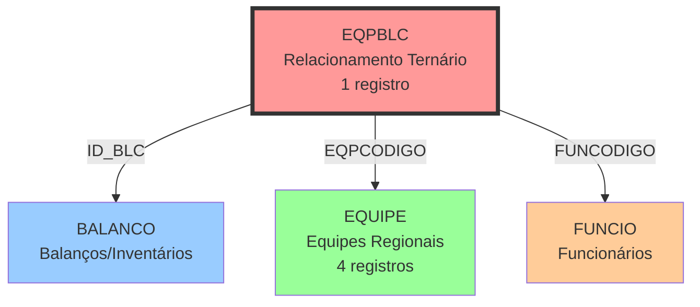

# EQPBLC - Equipamento Balanceamento - Relacionamentos Completos

## 📊 Informações Gerais

| Propriedade | Valor |
|-------------|-------|
| **Nome da Tabela** | EQPBLC |
| **Total de Registros** | 1 |
| **Total de Colunas** | 3 |
| **Tipo de Chave Primária** | Composta (3 campos) |
| **Chaves Estrangeiras (FK OUT)** | 3 |
| **Índices** | 1 (PRIMARY KEY) |
| **Tabelas Dependentes (FK IN)** | 0 |
| **Banco de Dados** | Firebird (READ ONLY) |

---

## 📝 Descrição

### Propósito
Tabela de **relacionamento ternário** (N:N:N) que associa três entidades do sistema:
- **BALANCO** (Balanços/Inventários)
- **EQUIPE** (Equipes Regionais)
- **FUNCIO** (Funcionários)

### Quando é Usada
- Registrar qual funcionário de qual equipe realizou determinado balanço
- Vincular responsáveis por processos de inventário
- Rastreabilidade de operações de balanceamento

### Importância no Sistema
⚠️ **TABELA PRATICAMENTE SEM USO**
- Apenas **1 registro** no sistema
- Pode ter sido planejada para funcionalidade não implementada
- Ou funcionalidade descontinuada ao longo do tempo

---

## 🔑 Estrutura de Colunas

### Todas as Colunas (3)

| Campo | Tipo | Nulo | Descrição | Função |
|-------|------|------|-----------|--------|
| **ID_BLC** | INTEGER | Não | Código do Balanço | PK + FK → BALANCO |
| **EQPCODIGO** | INTEGER | Não | Código da Equipe | PK + FK → EQUIPE |
| **FUNCODIGO** | INTEGER | Não | Código do Funcionário | PK + FK → FUNCIO |

### Características
- **Chave Primária Composta:** ID_BLC + EQPCODIGO + FUNCODIGO
- **Sem colunas adicionais:** Tabela pura de relacionamento
- **Sem dados de controle/auditoria:** Não tem timestamps ou flags

---

## 🔗 Relacionamentos FK OUT (Saindo desta tabela)

### Total: 3 Foreign Keys

#### 1. FK_EQPBLC_BALANCO
```
EQPBLC.ID_BLC → BALANCO.ID_BLC
```
- **Relacionamento:** N:1
- **Propósito:** Vincula ao balanço/inventário realizado
- **Obrigatoriedade:** Sim (NOT NULL)
- **Tabela Referenciada:** BALANCO
- **Descrição:** Identifica qual processo de balanço está sendo registrado

#### 2. FK_EQPBLC_EQUIPE
```
EQPBLC.EQPCODIGO → EQUIPE.EQPCODIGO
```
- **Relacionamento:** N:1
- **Propósito:** Vincula à equipe regional responsável
- **Obrigatoriedade:** Sim (NOT NULL)
- **Tabela Referenciada:** EQUIPE
- **Equipes Disponíveis:**
  - 2: CASCAVEL
  - 3: LONDRINA
  - 7: JOINVILLE
- **Descrição:** Identifica a equipe regional do processo

#### 3. FK_EQPBLC_FUNCIO
```
EQPBLC.FUNCODIGO → FUNCIO.FUNCODIGO
```
- **Relacionamento:** N:1
- **Propósito:** Vincula ao funcionário executor
- **Obrigatoriedade:** Sim (NOT NULL)
- **Tabela Referenciada:** FUNCIO
- **Descrição:** Identifica o funcionário que realizou o balanço

---

## 🔗 Relacionamentos FK IN (Chegando nesta tabela)

### Total: 0 Tabelas Dependentes

**NENHUMA TABELA REFERENCIA EQPBLC**

- Tabela terminal no modelo de dados
- Não possui tabelas dependentes
- Não é usada como foreign key em nenhum lugar

---

## 🔗 Relacionamentos Nível 2 (Via Tabelas Intermediárias)

### Fluxo: BALANCO ← EQPBLC → EQUIPE → (via EQPCODIGO)

**Navegação Possível:**
1. De um **BALANCO** → obter **EQUIPE** responsável
2. De um **BALANCO** → obter **FUNCIONÁRIO** executor
3. De uma **EQUIPE** → obter **BALANÇOS** realizados
4. De um **FUNCIO** → obter **BALANÇOS** realizados

### Exemplo de Navegação:
```sql
-- Obter equipe e funcionário de um balanço
SELECT
    b.ID_BLC,
    b.descricao_balanco,
    e.EQPNOME,
    f.FUNNOME
FROM BALANCO b
JOIN EQPBLC eqp ON b.ID_BLC = eqp.ID_BLC
JOIN EQUIPE e ON eqp.EQPCODIGO = e.EQPCODIGO
JOIN FUNCIO f ON eqp.FUNCODIGO = f.FUNCODIGO
WHERE b.ID_BLC = 123;
```

---

## 🔗 Relacionamentos Nível 3 (Fluxos Completos)

### Diagrama de Relacionamento Ternário



### Descrição do Fluxo
- **EQPBLC** conecta 3 entidades independentes
- Representa: "Qual FUNCIONÁRIO de qual EQUIPE realizou qual BALANÇO"
- Relacionamento N:N:N (muitos para muitos para muitos)

---

## 📊 Casos de Uso Comuns

### 1. Obter Dados Completos do Único Registro
```sql
SELECT
    eqp.ID_BLC,
    eqp.EQPCODIGO,
    eqp.FUNCODIGO,
    e.EQPNOME as nome_equipe,
    f.FUNNOME as nome_funcionario
FROM EQPBLC eqp
LEFT JOIN EQUIPE e ON eqp.EQPCODIGO = e.EQPCODIGO
LEFT JOIN FUNCIO f ON eqp.FUNCODIGO = f.FUNCODIGO;
```

### 2. Verificar Balanços por Equipe
```sql
-- (Considerando uso futuro com mais registros)
SELECT
    e.EQPNOME,
    COUNT(*) as total_balancos
FROM EQPBLC eqp
JOIN EQUIPE e ON eqp.EQPCODIGO = e.EQPCODIGO
GROUP BY e.EQPNOME
ORDER BY total_balancos DESC;
```

### 3. Listar Funcionários que Realizaram Balanços
```sql
-- (Considerando uso futuro)
SELECT
    f.FUNCODIGO,
    f.FUNNOME,
    COUNT(DISTINCT eqp.ID_BLC) as total_balancos,
    e.EQPNOME as equipe
FROM FUNCIO f
JOIN EQPBLC eqp ON f.FUNCODIGO = eqp.FUNCODIGO
JOIN EQUIPE e ON eqp.EQPCODIGO = e.EQPCODIGO
GROUP BY f.FUNCODIGO, f.FUNNOME, e.EQPNOME
ORDER BY total_balancos DESC;
```

### 4. Verificar Balanços por Funcionário e Equipe
```sql
SELECT
    b.ID_BLC,
    b.data_balanco,
    e.EQPNOME,
    f.FUNNOME
FROM BALANCO b
LEFT JOIN EQPBLC eqp ON b.ID_BLC = eqp.ID_BLC
LEFT JOIN EQUIPE e ON eqp.EQPCODIGO = e.EQPCODIGO
LEFT JOIN FUNCIO f ON eqp.FUNCODIGO = f.FUNCODIGO
ORDER BY b.data_balanco DESC;
```

### 5. Validar Integridade (Balanços Sem Vinculação)
```sql
-- Balanços sem vinculação em EQPBLC
SELECT b.ID_BLC
FROM BALANCO b
LEFT JOIN EQPBLC eqp ON b.ID_BLC = eqp.ID_BLC
WHERE eqp.ID_BLC IS NULL;
```

---

## 📈 Estatísticas de Volume

### Distribuição Atual

| Métrica | Valor | Percentual |
|---------|-------|------------|
| **Total de Registros** | 1 | 100% |
| **Balanços Vinculados** | 1 | - |
| **Equipes Vinculadas** | 1 | - |
| **Funcionários Vinculados** | 1 | - |

### Análise
- ⚠️ **PRATICAMENTE SEM USO**
- Apenas 1 registro no sistema
- Não há distribuição significativa para analisar
- Volume não justifica análise estatística

### Possíveis Cenários
1. **Funcionalidade não implementada:** Tabela criada para uso futuro
2. **Funcionalidade descontinuada:** Era usada e foi abandonada
3. **Processo manual:** Balanços são registrados de outra forma
4. **Dados arquivados:** Registros antigos podem ter sido deletados

---

## 🚀 Performance e Otimização

### Índices Existentes

#### PRIMARY KEY (Composta)
```sql
PK_EQPBLC (ID_BLC, EQPCODIGO, FUNCODIGO)
```
- **Tipo:** UNIQUE
- **Campos:** 3 (todos os campos da tabela)
- **Propósito:** Garantir unicidade da combinação
- **Performance:** Excelente (apenas 1 registro)

### Recomendações de Performance

#### 1. Volume Baixíssimo
- Não há preocupações de performance
- Qualquer query será instantânea
- Índices atuais são suficientes

#### 2. Para Uso Futuro (se volume crescer)
```sql
-- Índice para buscar por balanço (já coberto pela PK)
-- Índice para buscar por equipe
CREATE INDEX IDX_EQPBLC_EQUIPE ON EQPBLC(EQPCODIGO);

-- Índice para buscar por funcionário
CREATE INDEX IDX_EQPBLC_FUNCIO ON EQPBLC(FUNCODIGO);
```

#### 3. Campos de Junção Importantes
- **ID_BLC:** Use para join com BALANCO
- **EQPCODIGO:** Use para join com EQUIPE
- **FUNCODIGO:** Use para join com FUNCIO

#### 4. Otimização de Queries
- LEFT JOIN recomendado (pode haver balanços sem vinculação)
- Evite DISTINCT desnecessário (PK já garante unicidade)
- Filtre por equipe/funcionário quando possível

---

## 💡 Observações Especiais

### 1. Volume Extremamente Baixo
- ⚠️ **Apenas 1 registro** em toda a tabela
- Questionar utilidade da tabela no sistema
- Possível candidata a remoção ou refatoração

### 2. Relacionamento Ternário Raro
- Estrutura N:N:N é incomum
- Pode indicar modelagem complexa desnecessária
- Considerar simplificação se volume não justificar

### 3. Sem Campos de Controle
- Não possui data de criação/atualização
- Não possui flags de status
- Não possui campos de auditoria
- **Dificulta rastreabilidade**

### 4. Possível Refatoração
Se a funcionalidade voltar a ser usada, considerar:
- Adicionar timestamps (created_at, updated_at)
- Adicionar campos de auditoria (user_id, ip_address)
- Adicionar campos de contexto (observacoes, status)

### 5. Modelo Eloquent (Laravel)
**ATUALMENTE NÃO EXISTE MODELO PARA EQPBLC**

Se for criar, estrutura sugerida:
```php
<?php

namespace App\Models\Firebird;

use Illuminate\Database\Eloquent\Model;

class FirebirdEqpblc extends Model
{
    protected $connection = 'firebird';
    protected $table = 'EQPBLC';

    // Chave primária composta
    protected $primaryKey = ['ID_BLC', 'EQPCODIGO', 'FUNCODIGO'];
    public $incrementing = false;
    public $timestamps = false;

    protected $fillable = [
        'ID_BLC',
        'EQPCODIGO',
        'FUNCODIGO',
    ];

    // Relacionamentos
    public function balanco()
    {
        return $this->belongsTo(FirebirdBalanco::class, 'ID_BLC', 'ID_BLC');
    }

    public function equipe()
    {
        return $this->belongsTo(FirebirdEquipe::class, 'EQPCODIGO', 'EQPCODIGO');
    }

    public function funcionario()
    {
        return $this->belongsTo(FirebirdFuncio::class, 'FUNCODIGO', 'FUNCODIGO');
    }
}
```

### 6. Integridade Referencial
- ✅ **FKs implementadas:** Todas as 3 foreign keys existem
- ✅ **Proteção:** ON DELETE/UPDATE conforme BALANCO/EQUIPE/FUNCIO
- ✅ **Validação:** Banco garante integridade

### 7. Uso em Produção
- **NÃO USAR** para novas funcionalidades sem investigação
- **VERIFICAR** com time de negócio se é necessária
- **CONSIDERAR** arquivamento ou remoção da tabela

---

## 📚 Documentos Relacionados

### Tabelas Diretamente Relacionadas
- **BALANCO:** [Documentação não criada] - Balanços/Inventários
- **[EQUIPE_RELACIONAMENTOS_COMPLETOS.md](./EQUIPE_RELACIONAMENTOS_COMPLETOS.md)** - Equipes Regionais
- **FUNCIO:** [Documentação não criada] - Funcionários

### Documentação Geral
- **[FIREBIRD_DATABASE_COMPLETE_ANALYSIS_2025.md](../FIREBIRD_DATABASE_COMPLETE_ANALYSIS_2025.md)** - Análise completa do Firebird
- **[FIREBIRD_DATABASE_RELATIONSHIPS_DIAGRAM.md](../FIREBIRD_DATABASE_RELATIONSHIPS_DIAGRAM.md)** - Diagrama de relacionamentos
- **[INDEX.md](../INDEX.md)** - Índice geral da documentação

---

## 🔄 Histórico de Alterações

| Data | Versão | Autor | Descrição |
|------|--------|-------|-----------|
| 2025-11-28 | 1.0 | Claude Code | Criação da documentação completa |

---

**Última Atualização:** Novembro 2025
**Status:** ⚠️ Tabela com volume extremamente baixo (1 registro) - Avaliar necessidade
