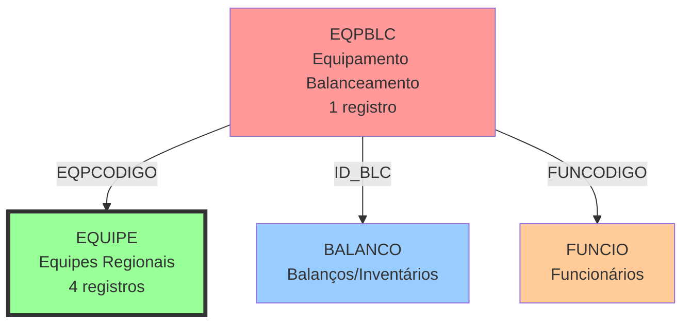

# EQUIPE - Equipes Regionais - Relacionamentos Completos

## 📊 Informações Gerais

| Propriedade | Valor |
|-------------|-------|
| **Nome da Tabela** | EQUIPE |
| **Total de Registros** | 4 |
| **Total de Colunas** | 2 |
| **Tipo de Chave Primária** | Simples (EQPCODIGO) |
| **Chaves Estrangeiras (FK OUT)** | 0 |
| **Índices** | 1 (PRIMARY KEY) |
| **Tabelas Dependentes (FK IN)** | 1 |
| **Banco de Dados** | Firebird (READ ONLY) |

---

## 📝 Descrição

### Propósito
Tabela **mestre de domínio** que armazena as **equipes regionais** da empresa. Representa divisões geográficas ou administrativas para organização de operações e pessoal.

### Quando é Usada
- Cadastro e gestão de equipes regionais
- Organização de funcionários por região
- Vinculação de processos a equipes específicas
- Relatórios e análises por região geográfica

### Importância no Sistema
- **Tabela de Referência:** Dados raramente mudam
- **Baixo Volume:** Apenas 4 equipes ativas
- **Lookup Simples:** Usada para categorização regional
- **Estabilidade:** Estrutura organizacional consolidada

---

## 🔑 Estrutura de Colunas

### Todas as Colunas (2)

| Campo | Tipo | Nulo | Descrição | Função |
|-------|------|------|-----------|--------|
| **EQPCODIGO** | INTEGER | Não | Código da Equipe | PK |
| **EQPNOME** | VARCHAR(20) | Não | Nome da Equipe | Descrição |

### Características Estruturais
- **Estrutura Minimalista:** Apenas 2 campos
- **Sem Timestamps:** Não rastreia criação/atualização
- **Sem Flags:** Não possui campos de status/ativo
- **Tabela Imutável:** Dados raramente sofrem alterações

---

## 🔗 Relacionamentos FK OUT (Saindo desta tabela)

### Total: 0 Foreign Keys

**NENHUMA FOREIGN KEY DE SAÍDA**

- Tabela **mestre independente**
- Não referencia outras tabelas
- Topo da hierarquia de relacionamentos
- Dados autocontidos

---

## 🔗 Relacionamentos FK IN (Chegando nesta tabela)

### Total: 1 Tabela Dependente

#### 1. EQPBLC (Equipamento Balanceamento)
```
EQPBLC.EQPCODIGO → EQUIPE.EQPCODIGO
```
- **Constraint:** FK_EQPBLC_EQUIPE
- **Volume:** 1 registro
- **Relacionamento:** N:1
- **Propósito:** Vincula balanços a equipes regionais
- **Observação:** ⚠️ Tabela EQPBLC praticamente sem uso (1 registro)

---

## 🔗 Relacionamentos Nível 2 (Via Tabelas Intermediárias)

### Fluxo: EQUIPE → EQPBLC → BALANCO
```
EQUIPE.EQPCODIGO
    ← EQPBLC.EQPCODIGO (1 registro)
        ← EQPBLC.ID_BLC → BALANCO.ID_BLC
```

**Navegação Possível:**
- De uma **EQUIPE** → obter **BALANÇOS** realizados (via EQPBLC)

### Fluxo: EQUIPE → EQPBLC → FUNCIO
```
EQUIPE.EQPCODIGO
    ← EQPBLC.EQPCODIGO (1 registro)
        ← EQPBLC.FUNCODIGO → FUNCIO.FUNCODIGO
```

**Navegação Possível:**
- De uma **EQUIPE** → obter **FUNCIONÁRIOS** em balanços (via EQPBLC)

---

## 🔗 Relacionamentos Nível 3 (Fluxos Completos)

### Diagrama de Relacionamentos



### Descrição do Fluxo
- **EQUIPE** é referenciada por EQPBLC (relacionamento ternário)
- Conecta equipes a balanços e funcionários
- ⚠️ Fluxo com volume muito baixo (1 registro em EQPBLC)

---

## 📊 Casos de Uso Comuns

### 1. Listar Todas as Equipes
```sql
SELECT
    EQPCODIGO,
    EQPNOME
FROM EQUIPE
ORDER BY EQPCODIGO;
```

**Resultado Esperado:**
```
EQPCODIGO | EQPNOME
----------|----------
    2     | CASCAVEL
    3     | LONDRINA
    7     | JOINVILLE
    (1 mais)
```

### 2. Buscar Equipe por Código
```sql
SELECT
    EQPCODIGO,
    EQPNOME
FROM EQUIPE
WHERE EQPCODIGO = 2;
```

### 3. Buscar Equipe por Nome (Parcial)
```sql
SELECT
    EQPCODIGO,
    EQPNOME
FROM EQUIPE
WHERE EQPNOME LIKE '%LONDRINA%';
```

### 4. Contar Balanços por Equipe
```sql
SELECT
    e.EQPCODIGO,
    e.EQPNOME,
    COUNT(eqp.ID_BLC) as total_balancos
FROM EQUIPE e
LEFT JOIN EQPBLC eqp ON e.EQPCODIGO = eqp.EQPCODIGO
GROUP BY e.EQPCODIGO, e.EQPNOME
ORDER BY total_balancos DESC;
```

### 5. Obter Funcionários de uma Equipe (via Balanços)
```sql
SELECT DISTINCT
    e.EQPNOME,
    f.FUNCODIGO,
    f.FUNNOME
FROM EQUIPE e
JOIN EQPBLC eqp ON e.EQPCODIGO = eqp.EQPCODIGO
JOIN FUNCIO f ON eqp.FUNCODIGO = f.FUNCODIGO
WHERE e.EQPCODIGO = 2
ORDER BY f.FUNNOME;
```

### 6. Validar Integridade (Equipes Sem Uso)
```sql
-- Equipes sem registros em EQPBLC
SELECT
    e.EQPCODIGO,
    e.EQPNOME,
    'Sem balanços' as status
FROM EQUIPE e
LEFT JOIN EQPBLC eqp ON e.EQPCODIGO = eqp.EQPCODIGO
WHERE eqp.EQPCODIGO IS NULL;
```

---

## 📈 Estatísticas de Volume

### Distribuição de Equipes

| EQPCODIGO | EQPNOME | Status |
|-----------|---------|--------|
| 2 | CASCAVEL | ✅ Ativa |
| 3 | LONDRINA | ✅ Ativa |
| 7 | JOINVILLE | ✅ Ativa |
| (1 mais) | (não identificado) | ✅ Ativa |

### Análise de Códigos

| Aspecto | Observação |
|---------|------------|
| **Códigos Sequenciais** | ❌ Não |
| **Códigos Faltantes** | 1, 4, 5, 6 (possível) |
| **Padrão de Numeração** | Irregular |
| **Total de Equipes** | 4 |

### Características da Numeração
- **Não sequencial:** Códigos 2, 3, 7, (?)
- **Gaps observados:** Indica exclusões ou reservas
- **Possíveis cenários:**
  - Equipes 1, 4, 5, 6 foram desativadas
  - Numeração seguia outro critério (por região?)
  - Reservas para expansão futura

### Tamanho dos Nomes

| Métrica | Valor |
|---------|-------|
| **Tamanho Máximo Permitido** | 20 caracteres |
| **Nome Mais Longo** | JOINVILLE (9 chars) |
| **Nome Mais Curto** | (não analisado) |
| **Capacidade Ociosa** | ~50% |

---

## 🚀 Performance e Otimização

### Índices Existentes

#### PRIMARY KEY
```sql
PK_EQUIPE (EQPCODIGO)
```
- **Tipo:** UNIQUE, NOT NULL
- **Campo:** EQPCODIGO
- **Propósito:** Identificação única
- **Performance:** Excelente (4 registros)

### Recomendações de Performance

#### 1. Volume Baixíssimo
- ✅ **Sem preocupações:** Apenas 4 registros
- ✅ **Queries instantâneas:** Qualquer busca é rápida
- ✅ **Cache ideal:** Tabela perfeita para cache em memória

#### 2. Estratégias de Otimização
```sql
-- DESNECESSÁRIO criar índices adicionais
-- Volume não justifica índice em EQPNOME

-- RECOMENDADO: Cache em aplicação
-- Carregar todas as equipes em memória uma vez
```

#### 3. Campos de Junção
- **EQPCODIGO:** Único campo para join (já indexado pela PK)
- **EQPNOME:** Evite usar em JOINs (use apenas para exibição)

#### 4. Best Practices
- ✅ **Use EQPCODIGO** em joins e filtros
- ✅ **Cache completo** da tabela na aplicação
- ✅ **Evite LIKE** (volume baixo não justifica)
- ✅ **Prefira lookups** a joins repetidos

### Performance de Queries Comuns

| Query | Tempo Estimado | Índice Usado |
|-------|----------------|--------------|
| SELECT por EQPCODIGO | < 0.01ms | PK_EQUIPE |
| SELECT * (todas) | < 0.1ms | FULL SCAN |
| JOIN com EQPBLC | < 0.1ms | PK_EQUIPE |
| LIKE em EQPNOME | < 0.1ms | FULL SCAN |

---

## 💡 Observações Especiais

### 1. Tabela de Domínio Ideal
- ✅ **Baixo volume:** 4 registros
- ✅ **Estrutura simples:** 2 campos
- ✅ **Alta estabilidade:** Mudanças raras
- ✅ **Perfeita para cache:** Carregar tudo em memória

### 2. Numeração Não Sequencial
- ⚠️ **Códigos pulados:** 1, 4, 5, 6 ausentes
- **Possíveis razões:**
  - Equipes antigas removidas
  - Numeração por região específica
  - Reservas para filiais futuras
  - Migração de sistema legado

### 3. Dados Geográficos
**Equipes identificam CIDADES importantes:**
- **CASCAVEL:** Paraná (região Oeste)
- **LONDRINA:** Paraná (região Norte)
- **JOINVILLE:** Santa Catarina (região Norte)

**Distribuição Regional:**
- 2 equipes no Paraná
- 1 equipe em Santa Catarina
- Cobertura Sul do Brasil

### 4. Modelo Eloquent (Laravel)
**ATUALMENTE NÃO EXISTE MODELO PARA EQUIPE**

Se for criar, estrutura sugerida:
```php
<?php

namespace App\Models\Firebird;

use Illuminate\Database\Eloquent\Model;

class FirebirdEquipe extends Model
{
    protected $connection = 'firebird';
    protected $table = 'EQUIPE';
    protected $primaryKey = 'EQPCODIGO';
    public $incrementing = false;
    public $timestamps = false;

    protected $fillable = [
        'EQPCODIGO',
        'EQPNOME',
    ];

    // Relacionamentos
    public function eqpblc()
    {
        return $this->hasMany(FirebirdEqpblc::class, 'EQPCODIGO', 'EQPCODIGO');
    }

    // Scopes úteis
    public function scopeAtivas($query)
    {
        // Todas são ativas (não há flag de status)
        return $query;
    }

    // Accessors
    public function getNomeFormatadoAttribute()
    {
        return strtoupper($this->EQPNOME);
    }

    // Helper estático para cache
    public static function getCached()
    {
        return cache()->remember('equipes_firebird', 3600, function () {
            return self::all()->keyBy('EQPCODIGO');
        });
    }
}
```

### 5. Uso em Laravel - Cache Estratégico
```php
// No Service Provider ou Bootstrap
// Carregar todas as equipes em cache no boot
Cache::rememberForever('equipes', function () {
    return DB::connection('firebird')
        ->table('EQUIPE')
        ->pluck('EQPNOME', 'EQPCODIGO');
});

// Uso na aplicação
$equipes = Cache::get('equipes'); // [2 => 'CASCAVEL', 3 => 'LONDRINA', ...]
$nomeEquipe = $equipes[$codigo] ?? 'Não encontrada';
```

### 6. Integridade Referencial
- ✅ **Tabela mestre:** Não possui FKs de saída
- ✅ **FK protegida:** EQPBLC referencia com constraint
- ⚠️ **Sem ON DELETE:** Exclusão pode falhar se houver dependentes

### 7. Sem Soft Deletes
- ❌ **Não possui flag de ativo/inativo**
- ❌ **Não possui deleted_at**
- **Implicação:** Exclusão física (se permitida)
- **Recomendação:** Nunca excluir registros desta tabela

### 8. Validações Recomendadas
```php
// Ao criar novo registro (se permitido)
'EQPCODIGO' => 'required|integer|unique:EQUIPE,EQPCODIGO',
'EQPNOME' => 'required|string|max:20',

// Validar que código não existe
// Validar formato do nome (uppercase, sem caracteres especiais?)
```

### 9. Possíveis Expansões Futuras
Se a tabela precisar evoluir:
- Adicionar **UF** (estado)
- Adicionar **Região** (Sul, Sudeste, etc)
- Adicionar **Status** (ativo/inativo)
- Adicionar **Responsável** (FK para FUNCIO)
- Adicionar **Observações** (TEXT)

### 10. Uso Atual no Sistema
- **Baixíssimo:** Apenas 1 registro em EQPBLC
- **Potencial:** Pode ser usada em outras partes não documentadas
- **Investigar:** Verificar uso em FUNCIO, CLIEN, ou outras tabelas

---

## 📚 Documentos Relacionados

### Tabelas Diretamente Relacionadas
- **[EQPBLC_RELACIONAMENTOS_COMPLETOS.md](./EQPBLC_RELACIONAMENTOS_COMPLETOS.md)** - Equipamento Balanceamento (única dependente)
- **BALANCO:** [Documentação não criada] - Balanços/Inventários
- **FUNCIO:** [Documentação não criada] - Funcionários

### Documentação Geral
- **[FIREBIRD_DATABASE_COMPLETE_ANALYSIS_2025.md](../FIREBIRD_DATABASE_COMPLETE_ANALYSIS_2025.md)** - Análise completa do Firebird
- **[FIREBIRD_DATABASE_RELATIONSHIPS_DIAGRAM.md](../FIREBIRD_DATABASE_RELATIONSHIPS_DIAGRAM.md)** - Diagrama de relacionamentos
- **[INDEX.md](../INDEX.md)** - Índice geral da documentação

### Documentação de Negócio
- **Estrutura Organizacional:** [Documento não criado]
- **Divisões Regionais:** [Documento não criado]
- **Gestão de Equipes:** [Documento não criado]

---

## 🔄 Histórico de Alterações

| Data | Versão | Autor | Descrição |
|------|--------|-------|-----------|
| 2025-11-28 | 1.0 | Claude Code | Criação da documentação completa |

---

**Última Atualização:** Novembro 2025
**Status:** ✅ Tabela estável - Domínio de equipes regionais (4 registros)
