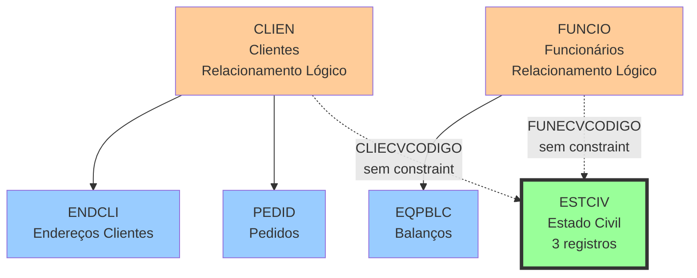

# ESTCIV - Estado Civil - Relacionamentos Completos

## 📊 Informações Gerais

| Propriedade | Valor |
|-------------|-------|
| **Nome da Tabela** | ESTCIV |
| **Total de Registros** | 3 |
| **Total de Colunas** | 2 |
| **Tipo de Chave Primária** | Simples (ECVCODIGO) |
| **Chaves Estrangeiras (FK OUT)** | 0 |
| **Índices** | 1 (PRIMARY KEY) |
| **Tabelas Dependentes (FK IN)** | 0 (sem constraints formais) |
| **Banco de Dados** | Firebird (READ ONLY) |

---

## 📝 Descrição

### Propósito
Tabela **lookup de domínio** que armazena os **estados civis** válidos no sistema. É uma tabela de referência simples usada para padronizar e validar valores de estado civil em cadastros de pessoas (clientes e funcionários).

### Quando é Usada
- Cadastro de clientes (CLIEN)
- Cadastro de funcionários (FUNCIO)
- Relatórios demográficos
- Validação de formulários
- Dropdown/select em interfaces

### Importância no Sistema
- **Tabela de Referência:** Dados raramente ou nunca mudam
- **Baixíssimo Volume:** Apenas 3 estados civis
- **Padrão Brasileiro:** Valores baseados em documentação civil brasileira
- **Lookup Simples:** Usada apenas para validação e exibição

---

## 🔑 Estrutura de Colunas

### Todas as Colunas (2)

| Campo | Tipo | Nulo | Descrição | Função |
|-------|------|------|-----------|--------|
| **ECVCODIGO** | INTEGER | Não | Código do Estado Civil | PK |
| **ECVDESCRICAO** | VARCHAR(10) | Não | Descrição do Estado Civil | Descrição |

### Características Estruturais
- **Estrutura Minimalista:** Apenas 2 campos (código + descrição)
- **Sem Timestamps:** Não rastreia criação/atualização
- **Sem Flags:** Não possui campos de status/ativo
- **Tabela Imutável:** Dados praticamente nunca mudam
- **Tamanho Descritivo Limitado:** Apenas 10 caracteres

---

## 🔗 Relacionamentos FK OUT (Saindo desta tabela)

### Total: 0 Foreign Keys

**NENHUMA FOREIGN KEY DE SAÍDA**

- Tabela **mestre independente**
- Não referencia outras tabelas
- Topo da hierarquia de relacionamentos
- Dados autocontidos

---

## 🔗 Relacionamentos FK IN (Chegando nesta tabela)

### Total: 0 Constraints Formais (Mas É Referenciada)

**NENHUMA FOREIGN KEY FORMAL**

Apesar de não haver constraints formais no banco, a tabela ESTCIV é **referenciada logicamente** por:

#### 1. CLIEN (Clientes) - Relacionamento Lógico
```
CLIEN.CLIECVCODIGO → ESTCIV.ECVCODIGO (sem constraint)
```
- **Tipo:** Referência lógica (sem FK formal)
- **Campo:** CLIECVCODIGO
- **Volume:** Quantidade de clientes desconhecida
- **Propósito:** Estado civil do cliente
- **Observação:** ⚠️ Permite valores NULL e valores inválidos

#### 2. FUNCIO (Funcionários) - Relacionamento Lógico
```
FUNCIO.FUNECVCODIGO → ESTCIV.ECVCODIGO (sem constraint)
```
- **Tipo:** Referência lógica (sem FK formal)
- **Campo:** FUNECVCODIGO
- **Volume:** Quantidade de funcionários desconhecida
- **Propósito:** Estado civil do funcionário
- **Observação:** ⚠️ Permite valores NULL e valores inválidos

### Problemas da Ausência de Constraints
- ❌ **Sem validação automática:** Banco não garante integridade
- ❌ **Valores inválidos possíveis:** Pode ter códigos inexistentes
- ❌ **Sem proteção ON DELETE:** ESTCIV pode ser deletado com dependentes
- ⚠️ **Validação deve ser na aplicação:** Laravel/PHP deve validar

---

## 🔗 Relacionamentos Nível 2 (Via Tabelas Intermediárias)

### Fluxo: ESTCIV → CLIEN → (outras tabelas)
```
ESTCIV.ECVCODIGO
    ← CLIEN.CLIECVCODIGO (lógico)
        → CLIEN possui muitos relacionamentos (PEDID, ENDCLI, etc)
```

**Navegação Possível:**
- De um **ESTADO CIVIL** → obter **CLIENTES** daquele estado civil
- De um **ESTADO CIVIL** → obter **PEDIDOS** de clientes daquele estado civil

### Fluxo: ESTCIV → FUNCIO → (outras tabelas)
```
ESTCIV.ECVCODIGO
    ← FUNCIO.FUNECVCODIGO (lógico)
        → FUNCIO possui relacionamentos (EQPBLC, etc)
```

**Navegação Possível:**
- De um **ESTADO CIVIL** → obter **FUNCIONÁRIOS** daquele estado civil

---

## 🔗 Relacionamentos Nível 3 (Fluxos Completos)

### Diagrama de Relacionamentos



**Legenda:**
- Linha sólida (→): FK formal com constraint
- Linha pontilhada (-.->): Relacionamento lógico sem constraint

---

## 📊 Casos de Uso Comuns

### 1. Listar Todos os Estados Civis
```sql
SELECT
    ECVCODIGO,
    ECVDESCRICAO
FROM ESTCIV
ORDER BY ECVCODIGO;
```

**Resultado Esperado:**
```
ECVCODIGO | ECVDESCRICAO
----------|-------------
    1     | CASADO(A)
    2     | SOLTEIRO(A)
    3     | VIUVA
```

### 2. Buscar Estado Civil por Código
```sql
SELECT
    ECVCODIGO,
    ECVDESCRICAO
FROM ESTCIV
WHERE ECVCODIGO = 1;
```

### 3. Buscar Estado Civil por Descrição
```sql
SELECT
    ECVCODIGO,
    ECVDESCRICAO
FROM ESTCIV
WHERE ECVDESCRICAO LIKE '%CASADO%';
```

### 4. Contar Clientes por Estado Civil (Relacionamento Lógico)
```sql
SELECT
    e.ECVCODIGO,
    e.ECVDESCRICAO,
    COUNT(c.CLICODIGO) as total_clientes
FROM ESTCIV e
LEFT JOIN CLIEN c ON e.ECVCODIGO = c.CLIECVCODIGO
GROUP BY e.ECVCODIGO, e.ECVDESCRICAO
ORDER BY total_clientes DESC;
```

### 5. Contar Funcionários por Estado Civil (Relacionamento Lógico)
```sql
SELECT
    e.ECVCODIGO,
    e.ECVDESCRICAO,
    COUNT(f.FUNCODIGO) as total_funcionarios
FROM ESTCIV e
LEFT JOIN FUNCIO f ON e.ECVCODIGO = f.FUNECVCODIGO
GROUP BY e.ECVCODIGO, e.ECVDESCRICAO
ORDER BY total_funcionarios DESC;
```

### 6. Validar Integridade (Clientes com Estado Civil Inválido)
```sql
-- Clientes com código de estado civil inexistente
SELECT
    c.CLICODIGO,
    c.CLINOME,
    c.CLIECVCODIGO as codigo_invalido
FROM CLIEN c
LEFT JOIN ESTCIV e ON c.CLIECVCODIGO = e.ECVCODIGO
WHERE c.CLIECVCODIGO IS NOT NULL
  AND e.ECVCODIGO IS NULL;
```

### 7. Validar Integridade (Funcionários com Estado Civil Inválido)
```sql
-- Funcionários com código de estado civil inexistente
SELECT
    f.FUNCODIGO,
    f.FUNNOME,
    f.FUNECVCODIGO as codigo_invalido
FROM FUNCIO f
LEFT JOIN ESTCIV e ON f.FUNECVCODIGO = e.ECVCODIGO
WHERE f.FUNECVCODIGO IS NOT NULL
  AND e.ECVCODIGO IS NULL;
```

### 8. Uso em Eloquent (Laravel) - Helper
```php
// No Model Eloquent
public function getEstadoCivilDescricaoAttribute()
{
    $estados = [
        1 => 'CASADO(A)',
        2 => 'SOLTEIRO(A)',
        3 => 'VIUVA',
    ];

    return $estados[$this->CLIECVCODIGO] ?? 'Não informado';
}
```

---

## 📈 Estatísticas de Volume

### Distribuição de Estados Civis

| ECVCODIGO | ECVDESCRICAO | Observações |
|-----------|--------------|-------------|
| 1 | CASADO(A) | ✅ Padrão brasileiro |
| 2 | SOLTEIRO(A) | ✅ Padrão brasileiro |
| 3 | VIUVA | ⚠️ Sem gênero masculino? |

### Análise de Completude

| Aspecto | Status | Observação |
|---------|--------|------------|
| **Casado(a)** | ✅ Presente | |
| **Solteiro(a)** | ✅ Presente | |
| **Viúvo(a)** | ⚠️ Parcial | Apenas "VIUVA" (feminino?) |
| **Divorciado(a)** | ❌ Ausente | Não incluído |
| **Separado(a)** | ❌ Ausente | Não incluído |
| **União Estável** | ❌ Ausente | Não incluído |

### Estados Civis Ausentes
Segundo legislação brasileira, faltam:
- **DIVORCIADO(A)** - Comum em cadastros modernos
- **SEPARADO(A)** - Menos usado atualmente
- **UNIÃO ESTÁVEL** - Reconhecido legalmente
- **VIUVO** (masculino) - Se "VIUVA" for só feminino

### Possíveis Problemas de Dados
```sql
-- Verificar se há viúvos usando código 3 (se for só feminino)
-- Verificar se há divorciados sem código válido
-- Verificar valores NULL ou 0 em CLIEN/FUNCIO
```

### Características da Descrição

| Métrica | Valor |
|---------|-------|
| **Tamanho Máximo Permitido** | 10 caracteres |
| **Descrição Mais Longa** | SOLTEIRO(A) (11 chars?) ⚠️ |
| **Descrição Mais Curta** | VIUVA (5 chars) |
| **Formato** | UPPERCASE com (A) |

⚠️ **ATENÇÃO:** "SOLTEIRO(A)" tem 11 caracteres, mas campo permite apenas 10. Verificar se há truncamento.

---

## 🚀 Performance e Otimização

### Índices Existentes

#### PRIMARY KEY
```sql
PK_ESTCIV (ECVCODIGO)
```
- **Tipo:** UNIQUE, NOT NULL
- **Campo:** ECVCODIGO
- **Propósito:** Identificação única
- **Performance:** Excelente (3 registros)

### Recomendações de Performance

#### 1. Volume Irrisório
- ✅ **Sem preocupações:** Apenas 3 registros
- ✅ **Queries instantâneas:** Qualquer busca < 0.01ms
- ✅ **Cache obrigatório:** Tabela DEVE ser cacheada
- ✅ **Carregar em memória:** Ideal para array/hash estático

#### 2. Estratégias de Otimização
```sql
-- DESNECESSÁRIO criar índices adicionais
-- Volume não justifica índice em ECVDESCRICAO

-- OBRIGATÓRIO: Cache em aplicação
-- NUNCA fazer query para esta tabela em runtime
```

#### 3. Cache Estratégico (Laravel)
```php
// Config ou Service Provider
const ESTADOS_CIVIS = [
    1 => 'CASADO(A)',
    2 => 'SOLTEIRO(A)',
    3 => 'VIUVA',
];

// Uso direto (sem query)
$descricao = ESTADOS_CIVIS[$codigo] ?? 'Não informado';
```

#### 4. Campos de Junção
- **ECVCODIGO:** Único campo para join (já indexado pela PK)
- **ECVDESCRICAO:** NUNCA use em JOINs (só para exibição)

#### 5. Best Practices
- ✅ **NUNCA query em runtime:** Use constante/cache
- ✅ **Validação em aplicação:** Não confie em FK (não existe)
- ✅ **Enum no Laravel:** Considere usar Enum PHP 8.1+
- ✅ **Hard-coded ok:** Volume não justifica dinamismo

### Performance de Queries Comuns

| Query | Tempo Estimado | Recomendação |
|-------|----------------|--------------|
| SELECT por ECVCODIGO | < 0.01ms | ❌ Use cache/const |
| SELECT * (todas) | < 0.1ms | ❌ Use cache/const |
| JOIN com CLIEN | Variável | ⚠️ Sem FK, verificar NULLs |
| LIKE em ECVDESCRICAO | < 0.1ms | ❌ Desnecessário |

---

## 💡 Observações Especiais

### 1. Tabela Ideal para Hard-Coding
- ✅ **Volume mínimo:** 3 registros
- ✅ **Dados estáveis:** Não muda
- ✅ **Sem FK formal:** Não há constraint
- ✅ **Perfeita para constante:** Evite queries

### 2. Problema: "VIUVA" vs "VIUVO"
```
Código 3: "VIUVA"
```
- ⚠️ **Possível problema de gênero:** Só feminino?
- **Verificar:** Sistema aceita viúvos (masculino)?
- **Testar:** Cadastro de homem viúvo usa código 3?
- **Corrigir:** Mudar para "VIUVO(A)" se necessário

### 3. Falta de Estados Civis Modernos
Estados ausentes segundo Receita Federal:
- **DIVORCIADO(A)** - Código 4 (sugestão)
- **SEPARADO(A)** - Código 5 (sugestão)
- **UNIÃO ESTÁVEL** - Código 6 (sugestão)

### 4. Sem Constraints em CLIEN/FUNCIO
```sql
-- PROBLEMA: Não há FK formal
CLIEN.CLIECVCODIGO → ESTCIV.ECVCODIGO (lógico)
FUNCIO.FUNECVCODIGO → ESTCIV.ECVCODIGO (lógico)

-- RISCO:
-- - Valores inválidos (4, 5, 99, etc)
-- - NULLs podem estar presentes
-- - Exclusão de ESTCIV não é bloqueada
```

### 5. Modelo Eloquent (Laravel)
**ATUALMENTE NÃO EXISTE MODELO PARA ESTCIV**

Não é necessário criar. Use Enum ou constante:

#### Opção 1: Enum (PHP 8.1+)
```php
<?php

namespace App\Enums;

enum EstadoCivil: int
{
    case CASADO = 1;
    case SOLTEIRO = 2;
    case VIUVA = 3;

    public function descricao(): string
    {
        return match($this) {
            self::CASADO => 'CASADO(A)',
            self::SOLTEIRO => 'SOLTEIRO(A)',
            self::VIUVA => 'VIUVA',
        };
    }

    public static function fromCodigo(?int $codigo): ?self
    {
        return self::tryFrom($codigo);
    }
}
```

#### Opção 2: Constante/Config
```php
// config/constants.php
return [
    'estados_civis' => [
        1 => 'CASADO(A)',
        2 => 'SOLTEIRO(A)',
        3 => 'VIUVA',
    ],
];

// Uso
$descricao = config('constants.estados_civis.' . $codigo);
```

#### Opção 3: Trait para Models
```php
trait HasEstadoCivil
{
    public function getEstadoCivilDescricaoAttribute(): string
    {
        $estados = [
            1 => 'CASADO(A)',
            2 => 'SOLTEIRO(A)',
            3 => 'VIUVA',
        ];

        return $estados[$this->CLIECVCODIGO] ?? 'Não informado';
    }
}

// No Model CLIEN
use HasEstadoCivil;
```

### 6. Validação em Formulários (Laravel)
```php
// Request validation
'estado_civil' => 'nullable|in:1,2,3',

// Ou com Enum
'estado_civil' => ['nullable', new Enum(EstadoCivil::class)],

// Ou com Rule
'estado_civil' => [
    'nullable',
    Rule::in([1, 2, 3]),
],
```

### 7. Uso em Seeders (Laravel)
```php
// NUNCA criar seeder para ESTCIV
// Firebird é READ ONLY
// Dados já existem e não mudam
```

### 8. Migração para PostgreSQL (se necessário)
```php
// Migration
Schema::create('estados_civis', function (Blueprint $table) {
    $table->id('codigo');
    $table->string('descricao', 20);
    $table->timestamps();
});

// Seeder (dados do Firebird)
DB::table('estados_civis')->insert([
    ['codigo' => 1, 'descricao' => 'CASADO(A)'],
    ['codigo' => 2, 'descricao' => 'SOLTEIRO(A)'],
    ['codigo' => 3, 'descricao' => 'VIUVA'], // ou VIUVO(A)
    ['codigo' => 4, 'descricao' => 'DIVORCIADO(A)'], // novo
    ['codigo' => 5, 'descricao' => 'UNIÃO ESTÁVEL'], // novo
]);
```

### 9. Relatórios Demográficos
```sql
-- Distribuição de clientes por estado civil e gênero
SELECT
    e.ECVDESCRICAO as estado_civil,
    c.CLISEXO as genero,
    COUNT(*) as total
FROM CLIEN c
JOIN ESTCIV e ON c.CLIECVCODIGO = e.ECVCODIGO
GROUP BY e.ECVDESCRICAO, c.CLISEXO
ORDER BY total DESC;
```

### 10. Inconsistências Possíveis
```sql
-- Clientes sem estado civil
SELECT COUNT(*) FROM CLIEN WHERE CLIECVCODIGO IS NULL;

-- Clientes com código inválido
SELECT COUNT(*) FROM CLIEN
WHERE CLIECVCODIGO NOT IN (1, 2, 3)
  AND CLIECVCODIGO IS NOT NULL;

-- Funcionários sem estado civil
SELECT COUNT(*) FROM FUNCIO WHERE FUNECVCODIGO IS NULL;

-- Funcionários com código inválido
SELECT COUNT(*) FROM FUNCIO
WHERE FUNECVCODIGO NOT IN (1, 2, 3)
  AND FUNECVCODIGO IS NOT NULL;
```

---

## 📚 Documentos Relacionados

### Tabelas Que Referenciam (Logicamente)
- **CLIEN:** [Documentação não criada] - Clientes (campo CLIECVCODIGO)
- **FUNCIO:** [Documentação não criada] - Funcionários (campo FUNECVCODIGO)

### Documentação Geral
- **[FIREBIRD_DATABASE_COMPLETE_ANALYSIS_2025.md](../FIREBIRD_DATABASE_COMPLETE_ANALYSIS_2025.md)** - Análise completa do Firebird
- **[FIREBIRD_DATABASE_RELATIONSHIPS_DIAGRAM.md](../FIREBIRD_DATABASE_RELATIONSHIPS_DIAGRAM.md)** - Diagrama de relacionamentos
- **[INDEX.md](../INDEX.md)** - Índice geral da documentação

### Documentação de Negócio
- **Políticas de Cadastro:** [Documento não criado]
- **Validações de Cliente:** [Documento não criado]
- **RH - Cadastro de Funcionários:** [Documento não criado]

---

## 🔄 Histórico de Alterações

| Data | Versão | Autor | Descrição |
|------|--------|-------|-----------|
| 2025-11-28 | 1.0 | Claude Code | Criação da documentação completa |

---

**Última Atualização:** Novembro 2025
**Status:** ✅ Tabela lookup estável - Usar como constante/enum (não fazer queries)
