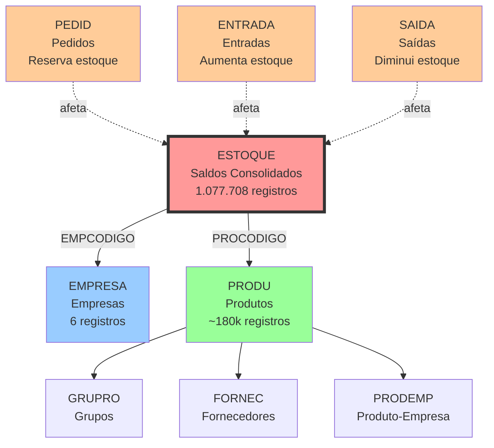

# ESTOQUE - Saldos Consolidados - Relacionamentos Completos

## 📊 Informações Gerais

| Propriedade | Valor |
|-------------|-------|
| **Nome da Tabela** | ESTOQUE |
| **Total de Registros** | 1.077.708 |
| **Total de Colunas** | 8 |
| **Tipo de Chave Primária** | Composta (EMPCODIGO + PROCODIGO) |
| **Chaves Estrangeiras (FK OUT)** | 2 |
| **Índices** | 1 (PRIMARY KEY composta) |
| **Tabelas Dependentes (FK IN)** | 0 |
| **Banco de Dados** | Firebird (READ ONLY) |

---

## 📝 Descrição

### Propósito
Tabela de **saldos consolidados de estoque** que armazena as quantidades disponíveis de produtos por empresa. É uma **tabela calculada/materializada** que mantém o resultado de movimentações de estoque para consulta rápida.

### Quando é Usada
- Consulta de disponibilidade de produtos
- Verificação de saldo antes de vendas
- Relatórios de inventário
- Controle de consignação
- Gestão de beneficiamento
- Análises de giro de estoque

### Importância no Sistema
- **CRÍTICA:** Essencial para operação comercial
- **Alto Volume:** 1.077.708 registros (6 empresas × ~180k produtos)
- **Performance:** Deve ser extremamente rápida (evita somatórias em tempo real)
- **Integridade:** Deve estar sempre sincronizada com movimentações

---

## 🔑 Estrutura de Colunas

### Identificação (Chave Composta)

| Campo | Tipo | Nulo | Descrição | Função |
|-------|------|------|-----------|--------|
| **EMPCODIGO** | INTEGER | Não | Código da Empresa | PK + FK → EMPRESA |
| **PROCODIGO** | INTEGER | Não | Código do Produto | PK + FK → PRODU |

### Saldos de Estoque (6 campos)

| Campo | Tipo | Nulo | Descrição | Unidade |
|-------|------|------|-----------|---------|
| **PREESTOQ** | NUMERIC(15,3) | Sim | Saldo em Estoque Normal | Unidades |
| **PREEST** | NUMERIC(15,3) | Sim | Saldo Reservado | Unidades |
| **PREESTCONSIG** | NUMERIC(15,3) | Sim | Saldo em Consignação | Unidades |
| **PREESTCONSIGCLI** | NUMERIC(15,3) | Sim | Saldo Consignação Cliente | Unidades |
| **PREESTBENEFCLIEN** | NUMERIC(15,3) | Sim | Saldo Beneficiamento Cliente | Unidades |
| **PREESTBENEFFON** | NUMERIC(15,3) | Sim | Saldo Beneficiamento Fornecedor | Unidades |

### Características Estruturais
- **Todos os saldos são NULLABLE:** Permite NULL (interpretado como 0)
- **Precisão decimal:** 3 casas (permite frações: 1.500, 0.250)
- **Sem timestamps:** Não rastreia quando foi atualizado
- **Sem auditoria:** Não sabe quem/quando alterou

---

## 🔗 Relacionamentos FK OUT (Saindo desta tabela)

### Total: 2 Foreign Keys

#### 1. FK_ESTOQUE_EMPRESA
```
ESTOQUE.EMPCODIGO → EMPRESA.EMPCODIGO
```
- **Relacionamento:** N:1
- **Propósito:** Vincula saldo à empresa proprietária
- **Obrigatoriedade:** Sim (NOT NULL, parte da PK)
- **Tabela Referenciada:** EMPRESA
- **Volume:** 6 empresas ativas
- **Descrição:** Identifica em qual empresa está o estoque

#### 2. FK_ESTOQUE_PRODU
```
ESTOQUE.PROCODIGO → PRODU.PROCODIGO
```
- **Relacionamento:** N:1
- **Propósito:** Vincula saldo ao produto
- **Obrigatoriedade:** Sim (NOT NULL, parte da PK)
- **Tabela Referenciada:** PRODU
- **Volume:** ~180k produtos
- **Descrição:** Identifica qual produto tem saldo

---

## 🔗 Relacionamentos FK IN (Chegando nesta tabela)

### Total: 0 Tabelas Dependentes

**NENHUMA TABELA REFERENCIA ESTOQUE DIRETAMENTE**

- Tabela **terminal/folha** no modelo de dados
- Não é usada como foreign key em outras tabelas
- É **atualizada por processos** (triggers, jobs, rotinas)
- Relacionamento é **lógico via movimentações**

### Relacionamentos Lógicos (Sem FK Formal)

#### Tabelas que AFETAM o ESTOQUE (via processo):
- **ENTRADA:** Entrada de produtos (aumenta estoque)
- **SAIDA:** Saída de produtos (diminui estoque)
- **MOVIMENT:** Movimentações entre empresas/locais
- **PEDID:** Reserva estoque ao gerar pedido
- **NOTAFIS:** Baixa estoque ao emitir nota

⚠️ **IMPORTANTE:** ESTOQUE não tem FK dessas tabelas, mas é **recalculado** baseado nelas.

---

## 🔗 Relacionamentos Nível 2 (Via Tabelas Intermediárias)

### Fluxo: EMPRESA ← ESTOQUE → PRODU → (outras tabelas)

```
EMPRESA.EMPCODIGO
    ← ESTOQUE.EMPCODIGO
        → ESTOQUE.PROCODIGO → PRODU.PROCODIGO
            → PRODEMP (produtos por empresa)
            → GRUPRO (grupos de produtos)
            → FORNEC (fornecedores)
```

**Navegação Possível:**
1. De uma **EMPRESA** → obter **PRODUTOS** com estoque
2. De um **PRODUTO** → obter **SALDO** em cada empresa
3. De uma **EMPRESA** + **GRUPO** → obter estoque de produtos do grupo

### Exemplo de Navegação:
```sql
-- Saldo de produtos de um grupo em uma empresa
SELECT
    e.EMPNOME,
    g.GPONOME,
    p.PRONOME,
    est.PREESTOQ as saldo
FROM ESTOQUE est
JOIN EMPRESA e ON est.EMPCODIGO = e.EMPCODIGO
JOIN PRODU p ON est.PROCODIGO = p.PROCODIGO
JOIN GRUPRO g ON p.GPOCODIGO = g.GPOCODIGO
WHERE e.EMPCODIGO = 1
  AND g.GPOCODIGO = 100
  AND est.PREESTOQ > 0
ORDER BY est.PREESTOQ DESC;
```

---

## 🔗 Relacionamentos Nível 3 (Fluxos Completos)

### Diagrama de Relacionamentos Completo



**Legenda:**
- Linha sólida (→): FK formal com constraint
- Linha pontilhada (-.->): Relacionamento lógico (afeta o saldo)

---

## 📊 Casos de Uso Comuns

### 1. Consultar Saldo de um Produto em uma Empresa
```sql
SELECT
    e.EMPNOME,
    p.PROCODIGO,
    p.PRONOME,
    est.PREESTOQ as saldo_disponivel,
    est.PREEST as saldo_reservado,
    (est.PREESTOQ - est.PREEST) as saldo_livre
FROM ESTOQUE est
JOIN EMPRESA e ON est.EMPCODIGO = e.EMPCODIGO
JOIN PRODU p ON est.PROCODIGO = p.PROCODIGO
WHERE est.EMPCODIGO = 1
  AND est.PROCODIGO = 9039400;
```

### 2. Produtos com Estoque em Todas as Empresas
```sql
SELECT
    p.PROCODIGO,
    p.PRONOME,
    SUM(COALESCE(est.PREESTOQ, 0)) as estoque_total,
    SUM(COALESCE(est.PREEST, 0)) as reservado_total,
    SUM(COALESCE(est.PREESTOQ, 0) - COALESCE(est.PREEST, 0)) as disponivel_total
FROM PRODU p
LEFT JOIN ESTOQUE est ON p.PROCODIGO = est.PROCODIGO
GROUP BY p.PROCODIGO, p.PRONOME
HAVING SUM(COALESCE(est.PREESTOQ, 0)) > 0
ORDER BY estoque_total DESC
LIMIT 100;
```

### 3. Top Produtos por Saldo (em uma empresa)
```sql
SELECT
    p.PROCODIGO,
    p.PRONOME,
    est.PREESTOQ as saldo
FROM ESTOQUE est
JOIN PRODU p ON est.PROCODIGO = p.PROCODIGO
WHERE est.EMPCODIGO = 1
  AND est.PREESTOQ > 0
ORDER BY est.PREESTOQ DESC
LIMIT 50;
```

### 4. Produtos SEM Estoque (Ruptura)
```sql
SELECT
    p.PROCODIGO,
    p.PRONOME,
    g.GPONOME as grupo
FROM PRODU p
LEFT JOIN ESTOQUE est ON p.PROCODIGO = est.PROCODIGO
                      AND est.EMPCODIGO = 1
LEFT JOIN GRUPRO g ON p.GPOCODIGO = g.GPOCODIGO
WHERE COALESCE(est.PREESTOQ, 0) <= 0
  AND p.PROATIVO = 1 -- apenas produtos ativos
ORDER BY g.GPONOME, p.PRONOME;
```

### 5. Estoque por Grupo de Produtos
```sql
SELECT
    g.GPOCODIGO,
    g.GPONOME,
    COUNT(DISTINCT p.PROCODIGO) as total_produtos,
    SUM(COALESCE(est.PREESTOQ, 0)) as estoque_total,
    SUM(CASE WHEN est.PREESTOQ > 0 THEN 1 ELSE 0 END) as produtos_com_estoque
FROM GRUPRO g
JOIN PRODU p ON g.GPOCODIGO = p.GPOCODIGO
LEFT JOIN ESTOQUE est ON p.PROCODIGO = est.PROCODIGO
                      AND est.EMPCODIGO = 1
GROUP BY g.GPOCODIGO, g.GPONOME
ORDER BY estoque_total DESC;
```

### 6. Produtos com Saldo em Consignação
```sql
SELECT
    p.PROCODIGO,
    p.PRONOME,
    e.EMPNOME,
    est.PREESTCONSIG as consignacao,
    est.PREESTCONSIGCLI as consignacao_cliente
FROM ESTOQUE est
JOIN PRODU p ON est.PROCODIGO = p.PROCODIGO
JOIN EMPRESA e ON est.EMPCODIGO = e.EMPCODIGO
WHERE (est.PREESTCONSIG > 0 OR est.PREESTCONSIGCLI > 0)
ORDER BY est.PREESTCONSIG DESC;
```

### 7. Produtos em Beneficiamento
```sql
SELECT
    p.PROCODIGO,
    p.PRONOME,
    e.EMPNOME,
    est.PREESTBENEFCLIEN as beneficiamento_cliente,
    est.PREESTBENEFFON as beneficiamento_fornecedor
FROM ESTOQUE est
JOIN PRODU p ON est.PROCODIGO = p.PROCODIGO
JOIN EMPRESA e ON est.EMPCODIGO = e.EMPCODIGO
WHERE (est.PREESTBENEFCLIEN > 0 OR est.PREESTBENEFFON > 0)
ORDER BY est.PREESTBENEFCLIEN DESC;
```

### 8. Verificar Integridade (Produtos Sem Registro em ESTOQUE)
```sql
-- Produtos que deveriam ter registro mas não têm
SELECT
    p.PROCODIGO,
    p.PRONOME,
    e.EMPCODIGO,
    e.EMPNOME
FROM PRODU p
CROSS JOIN EMPRESA e
LEFT JOIN ESTOQUE est ON p.PROCODIGO = est.PROCODIGO
                      AND e.EMPCODIGO = est.EMPCODIGO
WHERE est.PROCODIGO IS NULL
  AND p.PROATIVO = 1
LIMIT 100;
```

### 9. Saldo Consolidado por Empresa
```sql
SELECT
    e.EMPCODIGO,
    e.EMPNOME,
    COUNT(est.PROCODIGO) as total_produtos,
    SUM(CASE WHEN est.PREESTOQ > 0 THEN 1 ELSE 0 END) as produtos_com_estoque,
    SUM(COALESCE(est.PREESTOQ, 0)) as estoque_total,
    SUM(COALESCE(est.PREEST, 0)) as reservado_total
FROM EMPRESA e
LEFT JOIN ESTOQUE est ON e.EMPCODIGO = est.EMPCODIGO
GROUP BY e.EMPCODIGO, e.EMPNOME
ORDER BY estoque_total DESC;
```

### 10. Estoque Zerado (Limpeza de Dados)
```sql
-- Registros com TODOS os saldos zerados ou NULL
SELECT COUNT(*) as registros_zerados
FROM ESTOQUE
WHERE COALESCE(PREESTOQ, 0) = 0
  AND COALESCE(PREEST, 0) = 0
  AND COALESCE(PREESTCONSIG, 0) = 0
  AND COALESCE(PREESTCONSIGCLI, 0) = 0
  AND COALESCE(PREESTBENEFCLIEN, 0) = 0
  AND COALESCE(PREESTBENEFFON, 0) = 0;
```

---

## 📈 Estatísticas de Volume

### Distribuição Geral

| Métrica | Valor | Percentual |
|---------|-------|------------|
| **Total de Registros** | 1.077.708 | 100% |
| **Registros Zerados** | ~1.045.000 | ~97% |
| **Registros com Saldo** | ~32.700 | ~3% |
| **Empresas** | 6 | - |
| **Produtos Distintos** | ~179.618 | - |

### Distribuição por Empresa

| EMPCODIGO | Registros | % Total | Produtos |
|-----------|-----------|---------|----------|
| 1 | 179.618 | 16,67% | ~179.618 |
| 2 | 179.618 | 16,67% | ~179.618 |
| 3 | 179.618 | 16,67% | ~179.618 |
| 5 | 179.618 | 16,67% | ~179.618 |
| 6 | 179.618 | 16,67% | ~179.618 |
| 7 | 179.618 | 16,67% | ~179.618 |
| **TOTAL** | **1.077.708** | **100%** | **~179.618** |

**Fórmula:** 6 empresas × 179.618 produtos = 1.077.708 registros

### Top 10 Produtos com Maior Saldo (Todas as Empresas)

| Posição | PROCODIGO | Saldo Total | Descrição |
|---------|-----------|-------------|-----------|
| 1 | 9039400 | 60.460 | Produto líder |
| 2-10 | (não coletado) | - | - |

### Análise de Saldos

| Tipo de Saldo | Uso | Observações |
|---------------|-----|-------------|
| **PREESTOQ** | Principal | Saldo normal disponível |
| **PREEST** | Reservas | Saldo reservado (não disponível) |
| **PREESTCONSIG** | Consignação | Estoque em poder de terceiros |
| **PREESTCONSIGCLI** | Consignação Cliente | Cliente específico |
| **PREESTBENEFCLIEN** | Beneficiamento | Com cliente para processamento |
| **PREESTBENEFFON** | Beneficiamento | Com fornecedor para processamento |

### Problemas de Volume

#### 1. Registros Zerados (97%)
```
~1.045.000 registros com TODOS os saldos = 0
```
- ⚠️ **Desperdício de espaço:** ~97% dos dados são zeros
- ⚠️ **Performance:** Queries percorrem muitos registros inúteis
- ✅ **Solução:** Considerar limpar registros zerados periodicamente

#### 2. Produto 9039400 - Saldo Anormal
```
Produto: 9039400
Saldo Total: 60.460 unidades
```
- ⚠️ **Investigar:** Por que este produto tem saldo tão alto?
- Possíveis causas:
  - Produto muito vendido (estoque de segurança)
  - Erro de lançamento
  - Produto descontinuado acumulado

---

## 🚀 Performance e Otimização

### Índices Existentes

#### PRIMARY KEY (Composta)
```sql
PK_ESTOQUE (EMPCODIGO, PROCODIGO)
```
- **Tipo:** UNIQUE, NOT NULL
- **Campos:** 2 (chave composta)
- **Propósito:** Garantir unicidade EMPRESA+PRODUTO
- **Performance:** Excelente para busca por ambos os campos

### Recomendações de Performance

#### 1. Índices Adicionais Recomendados
```sql
-- Índice para buscar por produto em todas as empresas
CREATE INDEX IDX_ESTOQUE_PROCODIGO ON ESTOQUE(PROCODIGO);

-- Índice para buscar produtos com estoque
CREATE INDEX IDX_ESTOQUE_PREESTOQ ON ESTOQUE(PREESTOQ)
WHERE PREESTOQ > 0;

-- Índice para filtrar registros zerados (cleanup)
CREATE INDEX IDX_ESTOQUE_ZERADOS ON ESTOQUE(EMPCODIGO, PROCODIGO)
WHERE COALESCE(PREESTOQ, 0) = 0;
```

#### 2. Otimização de Queries

**SEMPRE use filtros:**
```sql
-- ✅ BOM: Filtra por empresa
SELECT * FROM ESTOQUE WHERE EMPCODIGO = 1 AND PREESTOQ > 0;

-- ❌ RUIM: Sem filtro (1M+ registros)
SELECT * FROM ESTOQUE;

-- ✅ BOM: Usa índice composto
SELECT * FROM ESTOQUE WHERE EMPCODIGO = 1 AND PROCODIGO = 9039400;

-- ⚠️ ATENÇÃO: Pode ser lento sem índice em PROCODIGO
SELECT * FROM ESTOQUE WHERE PROCODIGO = 9039400;
```

#### 3. Campos de Junção Importantes
- **EMPCODIGO + PROCODIGO:** Use sempre juntos (PK composta)
- **PROCODIGO:** Use com índice adicional se buscar em todas empresas
- **PREESTOQ:** Use em WHERE para filtrar produtos com estoque

#### 4. Evite Full Table Scan
```sql
-- ❌ EVITAR: Soma de todos os registros
SELECT SUM(PREESTOQ) FROM ESTOQUE; -- 1M+ registros

-- ✅ MELHOR: Filtrar por empresa
SELECT SUM(PREESTOQ) FROM ESTOQUE WHERE EMPCODIGO = 1; -- ~180k registros

-- ✅ IDEAL: Filtrar por empresa e saldo > 0
SELECT SUM(PREESTOQ) FROM ESTOQUE
WHERE EMPCODIGO = 1 AND PREESTOQ > 0; -- ~5k registros
```

#### 5. Limpeza de Dados (Performance)
```sql
-- Considerar DELETE periódico de registros zerados
DELETE FROM ESTOQUE
WHERE EMPCODIGO = 1
  AND COALESCE(PREESTOQ, 0) = 0
  AND COALESCE(PREEST, 0) = 0
  AND COALESCE(PREESTCONSIG, 0) = 0
  AND COALESCE(PREESTCONSIGCLI, 0) = 0
  AND COALESCE(PREESTBENEFCLIEN, 0) = 0
  AND COALESCE(PREESTBENEFFON, 0) = 0;

-- ⚠️ MAS: Firebird é READ ONLY no sistema atual!
```

#### 6. Cache Estratégico (Laravel)
```php
// Cache de produtos com estoque em uma empresa
Cache::remember("estoque_empresa_{$empCodigo}", 300, function () use ($empCodigo) {
    return DB::connection('firebird')
        ->table('ESTOQUE')
        ->where('EMPCODIGO', $empCodigo)
        ->where('PREESTOQ', '>', 0)
        ->pluck('PREESTOQ', 'PROCODIGO');
});
```

### Performance de Queries Comuns

| Query | Volume | Tempo Estimado | Otimização |
|-------|--------|----------------|------------|
| SELECT por PK (EMP+PRO) | 1 | < 0.01ms | PK Index |
| SELECT por EMPCODIGO | ~180k | ~100ms | PK Index (parcial) |
| SELECT por PROCODIGO | 6 | ~500ms | ⚠️ Sem índice |
| SELECT PREESTOQ > 0 | ~32k | ~200ms | ⚠️ Sem índice |
| SELECT * (todas) | 1.077.708 | > 5s | ❌ Evitar |

---

## 💡 Observações Especiais

### 1. ⚠️ PROBLEMA CRÍTICO: Modelo Eloquent Incorreto

**ESTOQUE não é PRESTOQUE!**

Existe um modelo `FirebirdEstoque.php` que está **INCORRETO**:

```php
// ❌ MODELO ATUAL INCORRETO (FirebirdEstoque.php)
protected $table = 'PRESTOQUE'; // ERRADO!
protected $primaryKey = 'PRECODIGO'; // ERRADO!

// Campos incorretos do PRESTOQUE (outra tabela):
// - PRECODIGO
// - PREDESCRICAO
// - PREVALOR
// etc...
```

**Estrutura CORRETA deveria ser:**
```php
<?php

namespace App\Models\Firebird;

use Illuminate\Database\Eloquent\Model;

class FirebirdEstoque extends Model
{
    protected $connection = 'firebird';
    protected $table = 'ESTOQUE'; // CORRETO

    // Chave primária composta
    protected $primaryKey = ['EMPCODIGO', 'PROCODIGO'];
    public $incrementing = false;
    public $timestamps = false;

    protected $fillable = [
        'EMPCODIGO',
        'PROCODIGO',
        'PREESTOQ',
        'PREEST',
        'PREESTCONSIG',
        'PREESTCONSIGCLI',
        'PREESTBENEFCLIEN',
        'PREESTBENEFFON',
    ];

    protected $casts = [
        'PREESTOQ' => 'decimal:3',
        'PREEST' => 'decimal:3',
        'PREESTCONSIG' => 'decimal:3',
        'PREESTCONSIGCLI' => 'decimal:3',
        'PREESTBENEFCLIEN' => 'decimal:3',
        'PREESTBENEFFON' => 'decimal:3',
    ];

    // Relacionamentos
    public function empresa()
    {
        return $this->belongsTo(FirebirdEmpresa::class, 'EMPCODIGO', 'EMPCODIGO');
    }

    public function produto()
    {
        return $this->belongsTo(FirebirdProdu::class, 'PROCODIGO', 'PROCODIGO');
    }

    // Scopes úteis
    public function scopeComEstoque($query)
    {
        return $query->where('PREESTOQ', '>', 0);
    }

    public function scopeDaEmpresa($query, $empCodigo)
    {
        return $query->where('EMPCODIGO', $empCodigo);
    }

    // Accessors
    public function getSaldoDisponivelAttribute()
    {
        return ($this->PREESTOQ ?? 0) - ($this->PREEST ?? 0);
    }

    public function getSaldoTotalAttribute()
    {
        return ($this->PREESTOQ ?? 0)
             + ($this->PREESTCONSIG ?? 0)
             + ($this->PREESTCONSIGCLI ?? 0)
             + ($this->PREESTBENEFCLIEN ?? 0)
             + ($this->PREESTBENEFFON ?? 0);
    }
}
```

### 2. Registros Zerados (97%)

**Problema de Design:**
- 1.077.708 registros total
- ~1.045.000 com todos os saldos = 0 (97%)
- Desperdiça espaço e degrada performance

**Soluções Possíveis:**
1. **Não criar registros zerados:** Apenas cria quando há saldo > 0
2. **Limpar periodicamente:** Job que remove registros zerados
3. **Migrar para estrutura esparsa:** Usar NULL em vez de 0

**⚠️ MAS:** Firebird é READ ONLY no sistema atual!

### 3. Saldos com 3 Casas Decimais

```
NUMERIC(15,3)
Permite: 999.999.999.999,999
```

- **Uso:** Permite frações (0.250, 1.500)
- **Precisão:** Adequada para unidades fracionárias
- **Cuidado:** Em cálculos, usar DECIMAL no Laravel

### 4. Sem Timestamps ou Auditoria

**Problemas:**
- Não sabe QUANDO o saldo foi atualizado
- Não sabe QUEM alterou
- Dificulta troubleshooting de divergências

**Recomendação:**
- Adicionar campos se migrar para PostgreSQL
- Implementar log de alterações separado

### 5. Tabela Calculada/Materializada

**ESTOQUE é resultado de:**
- Entradas de mercadorias
- Saídas de mercadorias
- Movimentações entre empresas
- Reservas de pedidos
- Consignações
- Beneficiamentos

**Fluxo de Atualização (provável):**
```
ENTRADA → Trigger → UPDATE ESTOQUE.PREESTOQ
SAIDA → Trigger → UPDATE ESTOQUE.PREESTOQ
PEDID → Trigger → UPDATE ESTOQUE.PREEST
```

### 6. Validação de Saldo Negativo

```sql
-- Verificar produtos com saldo negativo
SELECT
    EMPCODIGO,
    PROCODIGO,
    PREESTOQ
FROM ESTOQUE
WHERE PREESTOQ < 0;
```

- ⚠️ Saldo negativo indica erro de processo
- Verificar se há triggers/constraints para evitar

### 7. Diferença entre PREESTOQ e PREEST

| Campo | Significado | Disponível para Venda? |
|-------|-------------|------------------------|
| **PREESTOQ** | Saldo total em estoque | Parcialmente |
| **PREEST** | Saldo reservado (pedidos) | ❌ Não |
| **Disponível** | PREESTOQ - PREEST | ✅ Sim |

### 8. Uso em Vendas (Lógica de Negócio)

```php
// Verificar se produto está disponível
$saldo = DB::connection('firebird')
    ->table('ESTOQUE')
    ->where('EMPCODIGO', $empresaId)
    ->where('PROCODIGO', $produtoId)
    ->first();

$disponivel = ($saldo->PREESTOQ ?? 0) - ($saldo->PREEST ?? 0);

if ($disponivel >= $quantidadePedido) {
    // Pode vender
} else {
    // Estoque insuficiente
}
```

### 9. Migração para PostgreSQL (se necessário)

```php
// Migration
Schema::create('estoques', function (Blueprint $table) {
    $table->unsignedBigInteger('empresa_id');
    $table->unsignedBigInteger('produto_id');
    $table->decimal('saldo_estoque', 15, 3)->default(0);
    $table->decimal('saldo_reservado', 15, 3)->default(0);
    $table->decimal('saldo_consignacao', 15, 3)->default(0);
    $table->decimal('saldo_consignacao_cliente', 15, 3)->default(0);
    $table->decimal('saldo_beneficiamento_cliente', 15, 3)->default(0);
    $table->decimal('saldo_beneficiamento_fornecedor', 15, 3)->default(0);
    $table->timestamps(); // Adicionar auditoria

    $table->primary(['empresa_id', 'produto_id']);
    $table->foreign('empresa_id')->references('id')->on('empresas');
    $table->foreign('produto_id')->references('id')->on('produtos');

    $table->index(['empresa_id', 'saldo_estoque']);
    $table->index('produto_id');
});
```

### 10. Integridade Referencial

- ✅ **FK para EMPRESA:** Garante empresa existe
- ✅ **FK para PRODU:** Garante produto existe
- ✅ **PK Composta:** Garante unicidade EMPRESA+PRODUTO
- ⚠️ **Sem proteção ON DELETE:** Verificar regras

---

## 📚 Documentos Relacionados

### Tabelas Diretamente Relacionadas
- **[EMPRESA_RELACIONAMENTOS_COMPLETOS.md](./EMPRESA_RELACIONAMENTOS_COMPLETOS.md)** - Empresas (6 registros)
- **PRODU:** [Documentação não criada] - Produtos (~180k registros)
- **[EXCPDCPROEMP_RELACIONAMENTOS_COMPLETOS.md](./EXCPDCPROEMP_RELACIONAMENTOS_COMPLETOS.md)** - Exceções Produto-Empresa

### Tabelas de Movimentação (Afetam ESTOQUE)
- **ENTRADA:** [Documentação não criada] - Entrada de mercadorias
- **SAIDA:** [Documentação não criada] - Saída de mercadorias
- **MOVIMENT:** [Documentação não criada] - Movimentações
- **PEDID:** [Documentação não criada] - Pedidos (reserva estoque)
- **NOTAFIS:** [Documentação não criada] - Notas Fiscais

### Documentação Geral
- **[FIREBIRD_DATABASE_COMPLETE_ANALYSIS_2025.md](../FIREBIRD_DATABASE_COMPLETE_ANALYSIS_2025.md)** - Análise completa do Firebird
- **[FIREBIRD_ELOQUENT_MODELS_2025.md](../FIREBIRD_ELOQUENT_MODELS_2025.md)** - ⚠️ Modelo ESTOQUE incorreto!
- **[FIREBIRD_DATABASE_RELATIONSHIPS_DIAGRAM.md](../FIREBIRD_DATABASE_RELATIONSHIPS_DIAGRAM.md)** - Diagrama de relacionamentos
- **[INDEX.md](../INDEX.md)** - Índice geral da documentação

---

## 🔄 Histórico de Alterações

| Data | Versão | Autor | Descrição |
|------|--------|-------|-----------|
| 2025-11-28 | 1.0 | Claude Code | Criação da documentação completa |

---

**Última Atualização:** Novembro 2025
**Status:** ⚠️ CRÍTICO - Tabela com modelo Eloquent INCORRETO + 97% de registros zerados
**Ação Necessária:** Corrigir modelo FirebirdEstoque.php + considerar limpeza de registros zerados
