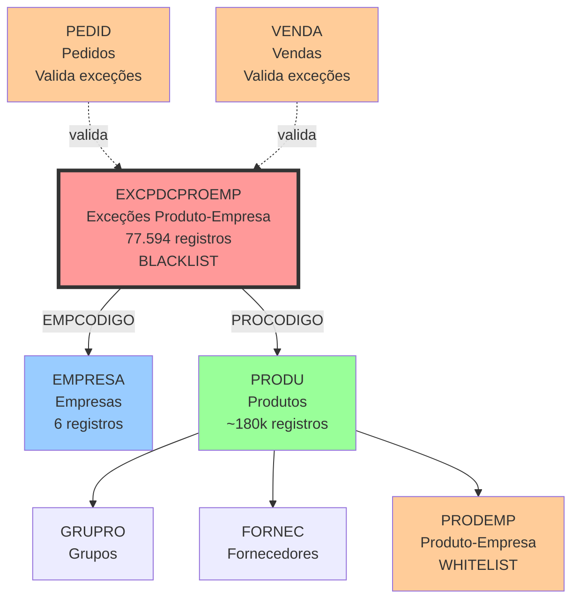

# EXCPDCPROEMP - Exceções Produto-Empresa - Relacionamentos Completos

## 📊 Informações Gerais

| Propriedade | Valor |
|-------------|-------|
| **Nome da Tabela** | EXCPDCPROEMP |
| **Total de Registros** | 77.594 |
| **Total de Colunas** | 2 |
| **Tipo de Chave Primária** | Composta (EMPCODIGO + PROCODIGO) |
| **Chaves Estrangeiras (FK OUT)** | 2 |
| **Índices** | 1 (PRIMARY KEY composta) |
| **Tabelas Dependentes (FK IN)** | 0 |
| **Banco de Dados** | Firebird (READ ONLY) |

---

## 📝 Descrição

### Propósito
Tabela de **exceções de produtos por empresa** que define quais produtos estão **PROIBIDOS/BLOQUEADOS** em cada empresa. Funciona como uma **lista negra** (blacklist) de produtos que NÃO podem ser vendidos/movimentados em determinada empresa.

### Lógica Invertida vs PRODEMP
- **PRODEMP:** Lista produtos **PERMITIDOS** (whitelist)
- **EXCPDCPROEMP:** Lista produtos **PROIBIDOS** (blacklist)

Se um produto está em **EXCPDCPROEMP**, ele **NÃO pode** ser usado naquela empresa, mesmo que esteja em PRODEMP.

### Quando é Usada
- Validação de vendas (bloquear produtos restritos)
- Filtro de produtos disponíveis por empresa
- Regras de negócio específicas por regional
- Controle de portfólio diferenciado
- Restrições regulatórias ou comerciais

### Importância no Sistema
- **CRÍTICA:** Evita vendas de produtos proibidos
- **Alto Volume:** 77.594 restrições ativas
- **Empresa 6:** A mais restritiva (35% das exceções)
- **Validação:** Deve ser verificada ANTES de permitir operação

---

## 🔑 Estrutura de Colunas

### Todas as Colunas (2)

| Campo | Tipo | Nulo | Descrição | Função |
|-------|------|------|-----------|--------|
| **EMPCODIGO** | INTEGER | Não | Código da Empresa | PK + FK → EMPRESA |
| **PROCODIGO** | INTEGER | Não | Código do Produto | PK + FK → PRODU |

### Características Estruturais
- **Estrutura Minimalista:** Apenas 2 campos (relação pura)
- **Chave Composta:** EMPCODIGO + PROCODIGO (unicidade)
- **Sem Timestamps:** Não rastreia quando foi criado
- **Sem Flags:** Não possui motivo/observação da exceção
- **Sem Auditoria:** Não sabe quem criou/alterou

---

## 🔗 Relacionamentos FK OUT (Saindo desta tabela)

### Total: 2 Foreign Keys

#### 1. FK_EXCPDCPROEMP_EMPRESA
```
EXCPDCPROEMP.EMPCODIGO → EMPRESA.EMPCODIGO
```
- **Relacionamento:** N:1
- **Propósito:** Vincula exceção à empresa
- **Obrigatoriedade:** Sim (NOT NULL, parte da PK)
- **Tabela Referenciada:** EMPRESA
- **Volume:** 6 empresas ativas
- **Descrição:** Identifica em qual empresa o produto é proibido

#### 2. FK_EXCPDCPROEMP_PRODU
```
EXCPDCPROEMP.PROCODIGO → PRODU.PROCODIGO
```
- **Relacionamento:** N:1
- **Propósito:** Vincula exceção ao produto
- **Obrigatoriedade:** Sim (NOT NULL, parte da PK)
- **Tabela Referenciada:** PRODU
- **Volume:** ~180k produtos total, 27.381 com exceção
- **Descrição:** Identifica qual produto está proibido

---

## 🔗 Relacionamentos FK IN (Chegando nesta tabela)

### Total: 0 Tabelas Dependentes

**NENHUMA TABELA REFERENCIA EXCPDCPROEMP DIRETAMENTE**

- Tabela **terminal/folha** no modelo de dados
- Não é usada como foreign key em outras tabelas
- É **consultada em validações** (lógica de negócio)
- Relacionamento é **lógico via queries**

### Uso Lógico (Sem FK Formal)

#### Processos que CONSULTAM esta tabela:
- **Validação de Vendas:** Verificar se produto pode ser vendido
- **Filtro de Produtos:** Exibir apenas produtos permitidos
- **Transferências:** Validar se produto pode ser movimentado
- **Cadastro de Pedidos:** Bloquear produtos restritos

---

## 🔗 Relacionamentos Nível 2 (Via Tabelas Intermediárias)

### Fluxo: EMPRESA ← EXCPDCPROEMP → PRODU → (outras tabelas)

```
EMPRESA.EMPCODIGO
    ← EXCPDCPROEMP.EMPCODIGO
        → EXCPDCPROEMP.PROCODIGO → PRODU.PROCODIGO
            → GRUPRO (grupos de produtos)
            → FORNEC (fornecedores)
            → PRODEMP (produtos permitidos)
```

**Navegação Possível:**
1. De uma **EMPRESA** → obter **PRODUTOS PROIBIDOS**
2. De um **PRODUTO** → obter **EMPRESAS** que o bloqueiam
3. De uma **EMPRESA** → obter produtos **PERMITIDOS** (PRODEMP - EXCPDCPROEMP)

### Exemplo de Navegação:
```sql
-- Produtos PERMITIDOS em uma empresa (PRODEMP - EXCPDCPROEMP)
SELECT p.PROCODIGO, p.PRONOME
FROM PRODU p
JOIN PRODEMP pe ON p.PROCODIGO = pe.PROCODIGO
                AND pe.EMPCODIGO = 1
LEFT JOIN EXCPDCPROEMP exc ON p.PROCODIGO = exc.PROCODIGO
                            AND exc.EMPCODIGO = 1
WHERE exc.PROCODIGO IS NULL; -- Não está na lista negra
```

---

## 🔗 Relacionamentos Nível 3 (Fluxos Completos)

### Diagrama de Relacionamentos Completo



**Legenda:**
- Linha sólida (→): FK formal com constraint
- Linha pontilhada (-.->): Relacionamento lógico (validação)
- **Vermelho:** Blacklist (proibidos)
- **Laranja:** Whitelist (permitidos)

---

## 📊 Casos de Uso Comuns

### 1. Verificar se Produto é Proibido em uma Empresa
```sql
SELECT
    e.EMPNOME,
    p.PROCODIGO,
    p.PRONOME,
    'PROIBIDO' as status
FROM EXCPDCPROEMP exc
JOIN EMPRESA e ON exc.EMPCODIGO = e.EMPCODIGO
JOIN PRODU p ON exc.PROCODIGO = p.PROCODIGO
WHERE exc.EMPCODIGO = 1
  AND exc.PROCODIGO = 12345;
```

**Uso em validação:**
```sql
-- Retorna 1 se proibido, 0 se permitido
SELECT COUNT(*) as proibido
FROM EXCPDCPROEMP
WHERE EMPCODIGO = 1
  AND PROCODIGO = 12345;
```

### 2. Listar Todos os Produtos Proibidos de uma Empresa
```sql
SELECT
    p.PROCODIGO,
    p.PRONOME,
    g.GPONOME as grupo
FROM EXCPDCPROEMP exc
JOIN PRODU p ON exc.PROCODIGO = p.PROCODIGO
LEFT JOIN GRUPRO g ON p.GPOCODIGO = g.GPOCODIGO
WHERE exc.EMPCODIGO = 6 -- Empresa mais restritiva
ORDER BY g.GPONOME, p.PRONOME;
```

### 3. Produtos Permitidos em uma Empresa (PRODEMP - EXCPDCPROEMP)
```sql
-- Produtos que PODEM ser vendidos
SELECT
    p.PROCODIGO,
    p.PRONOME
FROM PRODU p
JOIN PRODEMP pe ON p.PROCODIGO = pe.PROCODIGO
WHERE pe.EMPCODIGO = 1
  AND NOT EXISTS (
      SELECT 1 FROM EXCPDCPROEMP exc
      WHERE exc.EMPCODIGO = 1
        AND exc.PROCODIGO = p.PROCODIGO
  )
ORDER BY p.PRONOME;
```

### 4. Empresas que Bloqueiam um Produto Específico
```sql
SELECT
    e.EMPCODIGO,
    e.EMPNOME,
    'Produto bloqueado' as status
FROM EXCPDCPROEMP exc
JOIN EMPRESA e ON exc.EMPCODIGO = e.EMPCODIGO
WHERE exc.PROCODIGO = 12345
ORDER BY e.EMPNOME;
```

### 5. Contar Exceções por Empresa
```sql
SELECT
    e.EMPCODIGO,
    e.EMPNOME,
    COUNT(exc.PROCODIGO) as total_restricoes,
    ROUND(COUNT(exc.PROCODIGO) * 100.0 / 77594, 2) as percentual
FROM EMPRESA e
LEFT JOIN EXCPDCPROEMP exc ON e.EMPCODIGO = exc.EMPCODIGO
GROUP BY e.EMPCODIGO, e.EMPNOME
ORDER BY total_restricoes DESC;
```

### 6. Top Produtos Mais Bloqueados (em Múltiplas Empresas)
```sql
SELECT
    p.PROCODIGO,
    p.PRONOME,
    COUNT(exc.EMPCODIGO) as empresas_que_bloqueiam
FROM EXCPDCPROEMP exc
JOIN PRODU p ON exc.PROCODIGO = p.PROCODIGO
GROUP BY p.PROCODIGO, p.PRONOME
HAVING COUNT(exc.EMPCODIGO) > 1
ORDER BY empresas_que_bloqueiam DESC, p.PRONOME
LIMIT 100;
```

### 7. Produtos Bloqueados por Grupo
```sql
SELECT
    g.GPOCODIGO,
    g.GPONOME,
    e.EMPNOME,
    COUNT(exc.PROCODIGO) as total_bloqueados
FROM EXCPDCPROEMP exc
JOIN PRODU p ON exc.PROCODIGO = p.PROCODIGO
JOIN GRUPRO g ON p.GPOCODIGO = g.GPOCODIGO
JOIN EMPRESA e ON exc.EMPCODIGO = e.EMPCODIGO
GROUP BY g.GPOCODIGO, g.GPONOME, e.EMPNOME
ORDER BY total_bloqueados DESC;
```

### 8. Validar Integridade (Produtos em EXCPDCPROEMP mas NÃO em PRODEMP)
```sql
-- Exceções de produtos que nem estão permitidos (redundante)
SELECT
    exc.EMPCODIGO,
    exc.PROCODIGO,
    p.PRONOME,
    'Exceção redundante' as observacao
FROM EXCPDCPROEMP exc
JOIN PRODU p ON exc.PROCODIGO = p.PROCODIGO
LEFT JOIN PRODEMP pe ON exc.EMPCODIGO = pe.EMPCODIGO
                     AND exc.PROCODIGO = pe.PROCODIGO
WHERE pe.PROCODIGO IS NULL;
```

### 9. Diferença entre PRODEMP e EXCPDCPROEMP (Produtos Efetivamente Disponíveis)
```sql
-- Produtos disponíveis = PRODEMP - EXCPDCPROEMP
SELECT
    pe.EMPCODIGO,
    COUNT(DISTINCT pe.PROCODIGO) as produtos_em_prodemp,
    COUNT(DISTINCT exc.PROCODIGO) as produtos_bloqueados,
    COUNT(DISTINCT pe.PROCODIGO) - COUNT(DISTINCT exc.PROCODIGO) as produtos_disponiveis
FROM PRODEMP pe
LEFT JOIN EXCPDCPROEMP exc ON pe.EMPCODIGO = exc.EMPCODIGO
                            AND pe.PROCODIGO = exc.PROCODIGO
GROUP BY pe.EMPCODIGO
ORDER BY pe.EMPCODIGO;
```

### 10. Uso em Eloquent/Laravel (Validação)
```php
// Verificar se produto pode ser vendido
$proibido = DB::connection('firebird')
    ->table('EXCPDCPROEMP')
    ->where('EMPCODIGO', $empresaId)
    ->where('PROCODIGO', $produtoId)
    ->exists();

if ($proibido) {
    throw new Exception('Produto não disponível para esta empresa');
}
```

---

## 📈 Estatísticas de Volume

### Distribuição por Empresa

| EMPCODIGO | Total Exceções | % do Total | Produtos Únicos | Status |
|-----------|----------------|------------|-----------------|--------|
| **6** | **27.147** | **35,0%** | - | 🔴 Mais Restritiva |
| 3 | 14.191 | 18,3% | - | 🟡 Alta Restrição |
| 2 | 13.874 | 17,9% | - | 🟡 Alta Restrição |
| 7 | 12.241 | 15,8% | - | 🟡 Alta Restrição |
| 5 | 9.876 | 12,7% | - | 🟢 Média Restrição |
| 1 | 265 | 0,3% | - | 🟢 Baixa Restrição |
| **TOTAL** | **77.594** | **100%** | **27.381** | - |

### Análise por Empresa

#### Empresa 6 - A Mais Restritiva
- **27.147 exceções** (35% do total)
- **10x mais restritiva** que a Empresa 1
- Possíveis razões:
  - Regional com políticas específicas
  - Restrições regulatórias locais
  - Portfólio diferenciado
  - Estratégia comercial distinta

#### Empresa 1 - A Mais Permissiva
- **Apenas 265 exceções** (0,3% do total)
- **100x menos restritiva** que a Empresa 6
- Possíveis razões:
  - Matriz ou filial principal
  - Maior diversidade de produtos
  - Menos restrições comerciais

### Produtos Únicos Bloqueados

| Métrica | Valor |
|---------|-------|
| **Produtos Distintos com Exceção** | 27.381 |
| **Total de Produtos no Sistema** | ~179.618 |
| **% de Produtos com Alguma Exceção** | ~15,2% |
| **Produtos SEM Exceção** | ~152.237 |

**Análise:**
- ~15% dos produtos têm alguma restrição
- ~85% dos produtos podem ser vendidos em todas as empresas
- Média de **2,83 empresas** bloqueiam cada produto com exceção (77.594 / 27.381)

### Distribuição de Bloqueios por Produto

```sql
-- Produtos bloqueados em 1, 2, 3... empresas
SELECT
    empresas_bloqueadas,
    COUNT(DISTINCT PROCODIGO) as total_produtos
FROM (
    SELECT PROCODIGO, COUNT(EMPCODIGO) as empresas_bloqueadas
    FROM EXCPDCPROEMP
    GROUP BY PROCODIGO
) subq
GROUP BY empresas_bloqueadas
ORDER BY empresas_bloqueadas;
```

---

## 🚀 Performance e Otimização

### Índices Existentes

#### PRIMARY KEY (Composta)
```sql
PK_EXCPDCPROEMP (EMPCODIGO, PROCODIGO)
```
- **Tipo:** UNIQUE, NOT NULL
- **Campos:** 2 (chave composta)
- **Propósito:** Garantir unicidade EMPRESA+PRODUTO
- **Performance:** Excelente para busca por empresa+produto

### Recomendações de Performance

#### 1. Índices Adicionais Recomendados
```sql
-- Índice para buscar por produto em todas as empresas
CREATE INDEX IDX_EXCPDCPROEMP_PROCODIGO ON EXCPDCPROEMP(PROCODIGO);

-- Índice para contar exceções por empresa
-- (já coberto parcialmente pela PK)
```

#### 2. Otimização de Queries

**SEMPRE use empresa+produto (PK completa):**
```sql
-- ✅ EXCELENTE: Usa PK completa
SELECT 1 FROM EXCPDCPROEMP
WHERE EMPCODIGO = 1 AND PROCODIGO = 12345;

-- ✅ BOM: Filtra por empresa (usa parte da PK)
SELECT * FROM EXCPDCPROEMP WHERE EMPCODIGO = 1;

-- ⚠️ ATENÇÃO: Pode ser lento sem índice em PROCODIGO
SELECT * FROM EXCPDCPROEMP WHERE PROCODIGO = 12345;
```

#### 3. Cache Estratégico (Laravel)

**Cachear exceções por empresa:**
```php
// Cache de produtos proibidos por empresa
Cache::remember("produtos_proibidos_empresa_{$empCodigo}", 3600, function () use ($empCodigo) {
    return DB::connection('firebird')
        ->table('EXCPDCPROEMP')
        ->where('EMPCODIGO', $empCodigo)
        ->pluck('PROCODIGO')
        ->toArray();
});

// Uso (muito rápido)
$proibidos = Cache::get("produtos_proibidos_empresa_{$empCodigo}", []);
if (in_array($produtoId, $proibidos)) {
    // Produto proibido
}
```

#### 4. Validação em Lote (Bulk Validation)
```php
// Validar múltiplos produtos de uma vez
$produtosIds = [12345, 67890, 11111];

$proibidos = DB::connection('firebird')
    ->table('EXCPDCPROEMP')
    ->where('EMPCODIGO', $empresaId)
    ->whereIn('PROCODIGO', $produtosIds)
    ->pluck('PROCODIGO')
    ->toArray();

// Produtos permitidos = diferença
$permitidos = array_diff($produtosIds, $proibidos);
```

#### 5. Uso com JOIN (Anti-Join)
```sql
-- Obter apenas produtos PERMITIDOS (excluir bloqueados)
SELECT p.PROCODIGO, p.PRONOME
FROM PRODU p
WHERE NOT EXISTS (
    SELECT 1 FROM EXCPDCPROEMP exc
    WHERE exc.EMPCODIGO = 1
      AND exc.PROCODIGO = p.PROCODIGO
)
LIMIT 1000;
```

#### 6. Campos de Junção Importantes
- **EMPCODIGO + PROCODIGO:** Use sempre juntos (PK completa)
- **EMPCODIGO:** Use sozinho para listar todas as exceções de uma empresa
- **PROCODIGO:** Use com índice adicional para buscar empresas que bloqueiam

### Performance de Queries Comuns

| Query | Volume | Tempo Estimado | Otimização |
|-------|--------|----------------|------------|
| SELECT por PK (EMP+PRO) | 1 ou 0 | < 0.01ms | PK Index |
| SELECT por EMPCODIGO | 265-27k | ~10-100ms | PK Index (parcial) |
| SELECT por PROCODIGO | 1-6 | ~200ms | ⚠️ Criar índice |
| EXISTS (validação) | 1 ou 0 | < 0.01ms | PK Index |
| JOIN com PRODU | 77.594 | ~500ms | ✅ OK |

---

## 💡 Observações Especiais

### 1. Lógica Invertida (Blacklist vs Whitelist)

**IMPORTANTE: Entender a diferença**

| Tabela | Tipo | Lógica | Uso |
|--------|------|--------|-----|
| **PRODEMP** | Whitelist | Se está, PODE vender | Lista permissões |
| **EXCPDCPROEMP** | Blacklist | Se está, NÃO PODE vender | Lista proibições |

**Produto disponível se:**
```
(produto EM PRODEMP) AND (produto NÃO EM EXCPDCPROEMP)
```

### 2. Empresa 6 - Caso Especial

**27.147 exceções (35% do total)**

Investigar:
- É a filial de qual região?
- Há regulamentação específica?
- Produtos são de categorias específicas?
- É estratégia comercial ou limitação operacional?

### 3. Empresa 1 - Apenas 265 Exceções

**100x menos restritiva que Empresa 6**

Possíveis razões:
- **Matriz:** Filial principal sem restrições
- **Centro de Distribuição:** Maior variedade
- **Menos regulamentação:** Região sem restrições

### 4. Modelo Eloquent (Laravel)

**ATUALMENTE NÃO EXISTE MODELO PARA EXCPDCPROEMP**

Se for criar, estrutura sugerida:
```php
<?php

namespace App\Models\Firebird;

use Illuminate\Database\Eloquent\Model;

class FirebirdExcpdcProEmp extends Model
{
    protected $connection = 'firebird';
    protected $table = 'EXCPDCPROEMP';

    // Chave primária composta
    protected $primaryKey = ['EMPCODIGO', 'PROCODIGO'];
    public $incrementing = false;
    public $timestamps = false;

    protected $fillable = [
        'EMPCODIGO',
        'PROCODIGO',
    ];

    // Relacionamentos
    public function empresa()
    {
        return $this->belongsTo(FirebirdEmpresa::class, 'EMPCODIGO', 'EMPCODIGO');
    }

    public function produto()
    {
        return $this->belongsTo(FirebirdProdu::class, 'PROCODIGO', 'PROCODIGO');
    }

    // Scopes
    public function scopeDaEmpresa($query, $empCodigo)
    {
        return $query->where('EMPCODIGO', $empCodigo);
    }

    public function scopeDoProduto($query, $proCodigo)
    {
        return $query->where('PROCODIGO', $proCodigo);
    }

    // Helper estático
    public static function isProdutoProibido($empCodigo, $proCodigo): bool
    {
        return static::where('EMPCODIGO', $empCodigo)
                     ->where('PROCODIGO', $proCodigo)
                     ->exists();
    }

    public static function getProdutosProibidos($empCodigo): array
    {
        return static::where('EMPCODIGO', $empCodigo)
                     ->pluck('PROCODIGO')
                     ->toArray();
    }
}
```

### 5. Validação em Request (Laravel)

```php
use App\Models\Firebird\FirebirdExcpdcProEmp;

class VendaRequest extends FormRequest
{
    public function rules()
    {
        return [
            'empresa_id' => 'required|exists:firebird.EMPRESA,EMPCODIGO',
            'produto_id' => [
                'required',
                'exists:firebird.PRODU,PROCODIGO',
                function ($attribute, $value, $fail) {
                    $empresaId = $this->input('empresa_id');
                    if (FirebirdExcpdcProEmp::isProdutoProibido($empresaId, $value)) {
                        $fail('Este produto não está disponível para a empresa selecionada.');
                    }
                },
            ],
        ];
    }
}
```

### 6. Service para Validação

```php
namespace App\Services;

use App\Models\Firebird\FirebirdExcpdcProEmp;
use Illuminate\Support\Facades\Cache;

class ProdutoDisponivelService
{
    public function isProdutoDisponivel(int $empresaId, int $produtoId): bool
    {
        // 1. Verificar se produto existe (PRODU)
        // 2. Verificar se produto está em PRODEMP (permitido)
        // 3. Verificar se produto NÃO está em EXCPDCPROEMP (não bloqueado)

        $proibidos = $this->getProdutosProibidosCached($empresaId);

        return !in_array($produtoId, $proibidos);
    }

    private function getProdutosProibidosCached(int $empresaId): array
    {
        return Cache::remember(
            "excpdcproemp_empresa_{$empresaId}",
            3600, // 1 hora
            fn() => FirebirdExcpdcProEmp::getProdutosProibidos($empresaId)
        );
    }

    public function limparCache(int $empresaId): void
    {
        Cache::forget("excpdcproemp_empresa_{$empresaId}");
    }
}
```

### 7. Falta de Campos Descritivos

**Problema:**
- Não há campo para **MOTIVO** da exceção
- Não há campo para **DATA** de criação
- Não há campo para **OBSERVAÇÕES**

**Implicações:**
- Não sabe POR QUE produto foi bloqueado
- Dificulta auditoria e troubleshooting
- Não sabe quem/quando bloqueou

**Se migrar para PostgreSQL:**
```php
Schema::create('excecoes_produto_empresa', function (Blueprint $table) {
    $table->unsignedBigInteger('empresa_id');
    $table->unsignedBigInteger('produto_id');
    $table->string('motivo', 255)->nullable(); // NOVO
    $table->text('observacoes')->nullable(); // NOVO
    $table->unsignedBigInteger('usuario_id')->nullable(); // NOVO
    $table->timestamps(); // NOVO

    $table->primary(['empresa_id', 'produto_id']);
    $table->foreign('empresa_id')->references('id')->on('empresas');
    $table->foreign('produto_id')->references('id')->on('produtos');
    $table->foreign('usuario_id')->references('id')->on('users');
});
```

### 8. Possíveis Inconsistências

```sql
-- 1. Produtos em EXCPDCPROEMP mas não em PRODU
SELECT exc.PROCODIGO
FROM EXCPDCPROEMP exc
LEFT JOIN PRODU p ON exc.PROCODIGO = p.PROCODIGO
WHERE p.PROCODIGO IS NULL;

-- 2. Produtos em EXCPDCPROEMP mas não em PRODEMP (redundante)
SELECT exc.EMPCODIGO, exc.PROCODIGO
FROM EXCPDCPROEMP exc
LEFT JOIN PRODEMP pe ON exc.EMPCODIGO = pe.EMPCODIGO
                     AND exc.PROCODIGO = pe.PROCODIGO
WHERE pe.PROCODIGO IS NULL;

-- 3. Empresas inválidas
SELECT exc.EMPCODIGO
FROM EXCPDCPROEMP exc
LEFT JOIN EMPRESA e ON exc.EMPCODIGO = e.EMPCODIGO
WHERE e.EMPCODIGO IS NULL;
```

### 9. Relatório de Análise de Restrições

```sql
-- Análise completa de restrições por empresa
SELECT
    e.EMPCODIGO,
    e.EMPNOME,
    COUNT(DISTINCT exc.PROCODIGO) as produtos_bloqueados,
    COUNT(DISTINCT pe.PROCODIGO) as produtos_permitidos,
    COUNT(DISTINCT pe.PROCODIGO) - COUNT(DISTINCT exc.PROCODIGO) as produtos_disponiveis,
    ROUND(
        COUNT(DISTINCT exc.PROCODIGO) * 100.0 /
        NULLIF(COUNT(DISTINCT pe.PROCODIGO), 0),
        2
    ) as percentual_bloqueado
FROM EMPRESA e
LEFT JOIN EXCPDCPROEMP exc ON e.EMPCODIGO = exc.EMPCODIGO
LEFT JOIN PRODEMP pe ON e.EMPCODIGO = pe.EMPCODIGO
GROUP BY e.EMPCODIGO, e.EMPNOME
ORDER BY produtos_bloqueados DESC;
```

### 10. Integridade Referencial

- ✅ **FK para EMPRESA:** Garante empresa existe
- ✅ **FK para PRODU:** Garante produto existe
- ✅ **PK Composta:** Garante unicidade EMPRESA+PRODUTO
- ⚠️ **Sem proteção ON DELETE:** Verificar regras
- ⚠️ **Sem validação cruzada:** Pode ter exceção de produto não em PRODEMP

---

## 📚 Documentos Relacionados

### Tabelas Diretamente Relacionadas
- **[EMPRESA_RELACIONAMENTOS_COMPLETOS.md](./EMPRESA_RELACIONAMENTOS_COMPLETOS.md)** - Empresas (6 registros)
- **PRODU:** [Documentação não criada] - Produtos (~180k registros)
- **PRODEMP:** [Documentação não criada] - Produtos por Empresa (whitelist)
- **[ESTOQUE_RELACIONAMENTOS_COMPLETOS.md](./ESTOQUE_RELACIONAMENTOS_COMPLETOS.md)** - Saldos de Estoque

### Tabelas Relacionadas Indiretamente
- **GRUPRO:** [Documentação não criada] - Grupos de Produtos
- **FORNEC:** [Documentação não criada] - Fornecedores
- **PEDID:** [Documentação não criada] - Pedidos (deve validar exceções)

### Documentação Geral
- **[FIREBIRD_DATABASE_COMPLETE_ANALYSIS_2025.md](../FIREBIRD_DATABASE_COMPLETE_ANALYSIS_2025.md)** - Análise completa do Firebird
- **[FIREBIRD_DATABASE_RELATIONSHIPS_DIAGRAM.md](../FIREBIRD_DATABASE_RELATIONSHIPS_DIAGRAM.md)** - Diagrama de relacionamentos
- **[INDEX.md](../INDEX.md)** - Índice geral da documentação

### Documentação de Negócio
- **Políticas de Vendas por Regional:** [Documento não criado]
- **Regras de Restrição de Produtos:** [Documento não criado]
- **Matriz de Produtos x Empresas:** [Documento não criado]

---

## 🔄 Histórico de Alterações

| Data | Versão | Autor | Descrição |
|------|--------|-------|-----------|
| 2025-11-28 | 1.0 | Claude Code | Criação da documentação completa |

---

**Última Atualização:** Novembro 2025
**Status:** ⚠️ CRÍTICA - Tabela de blacklist de produtos (77.594 restrições) - SEMPRE validar antes de vendas
**Destaque:** Empresa 6 com 35% das restrições (27.147) vs Empresa 1 com 0,3% (265)
