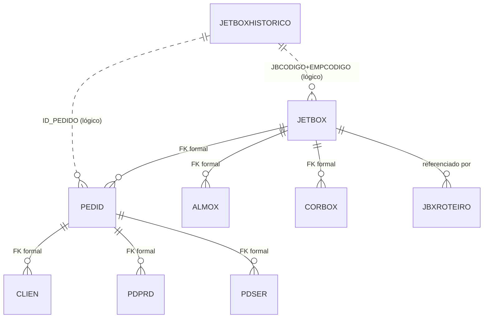
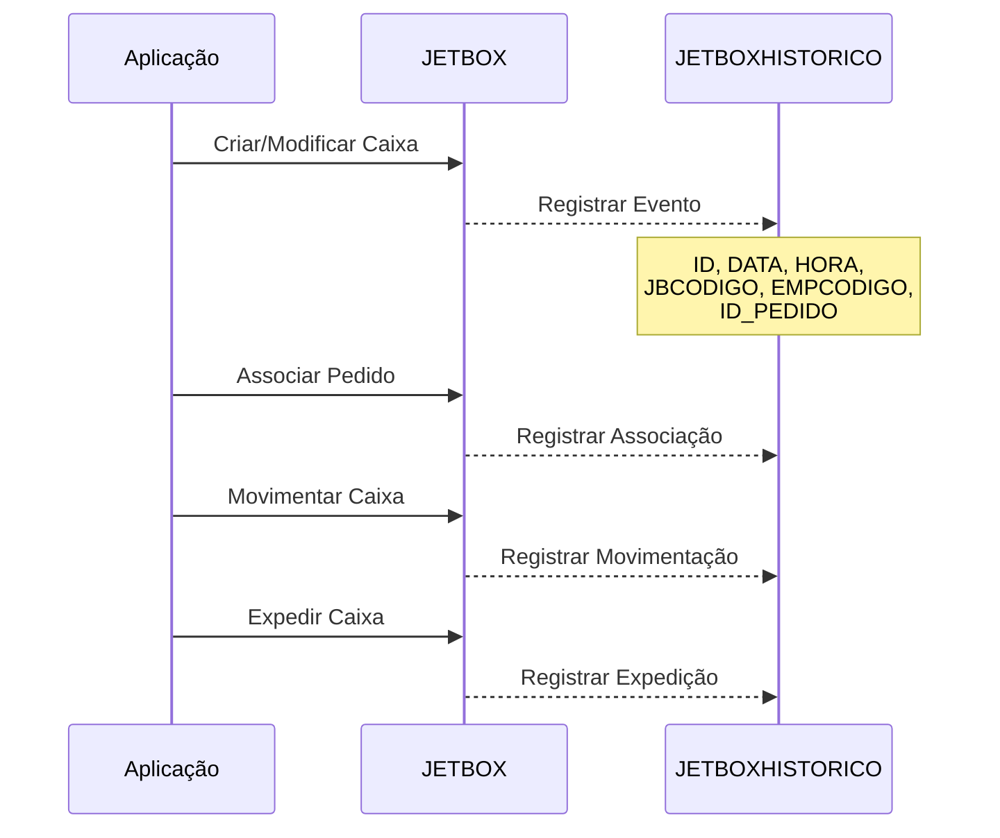

# Documentação da Tabela JETBOXHISTORICO

> Documentação completa gerada automaticamente do banco de dados Firebird
> Data: 10/11/2025 07:21:28

## 📌 Sumário Executivo

**Propósito:** Tabela de log/histórico que registra todos os eventos e movimentações relacionadas às caixas JetBox ao longo do tempo.

**Status:** ✅ **TABELA MUITO ATIVA - ALTO VOLUME DE REGISTROS**

- ✅ **1.837.729 registros** (volume 53x maior que JETBOX!)
- ⚠️ **Sem relacionamentos formais (FKs)** - por design de tabela de histórico
- ✅ **Relacionamentos lógicos** com JETBOX e PEDID através de IDs
- ✅ **Índice otimizado por DATA** para consultas temporais
- 📊 **Tabela de auditoria** - preserva histórico completo de operações

**Contexto de Negócio:**
A tabela `JETBOXHISTORICO` funciona como um **log de auditoria** registrando cada operação envolvendo caixas JetBox. Com quase 2 milhões de registros, é aproximadamente 53 vezes maior que a tabela principal JETBOX (34.452 registros), indicando que cada caixa passa por múltiplos eventos ao longo de seu ciclo de vida.

**Características Importantes:**
1. **Tabela append-only**: Registros nunca são deletados (histórico permanente)
2. **Sem FKs**: Preserva histórico mesmo quando registros principais são deletados
3. **Timestamp completo**: DATA + HORA para rastreamento preciso
4. **Alto volume**: ~1,8M registros indicam sistema ativo e bem utilizado
5. **Índice temporal**: IND_JETDATA otimiza consultas por período

**Proporção de Eventos:**
- **JETBOX**: 34.452 caixas ativas
- **JETBOXHISTORICO**: 1.837.729 eventos
- **Média**: ~53 eventos por caixa (criação, movimentação, alterações, etc.)

## 📋 Índice

1. [Visão Geral](#visão-geral)
2. [Estrutura da Tabela](#estrutura-da-tabela)
3. [Índices](#índices)
4. [Relacionamentos Nível 1](#relacionamentos-nível-1)
5. [Relacionamentos Nível 2](#relacionamentos-nível-2)
6. [Relacionamentos Nível 3](#relacionamentos-nível-3)
7. [Relacionamentos Inversos](#relacionamentos-inversos)
8. [Diagrama de Relacionamentos](#diagrama-de-relacionamentos)
9. [Queries de Exemplo](#queries-de-exemplo)
10. [Análise Técnica Detalhada](#análise-técnica-detalhada)

---

## 📊 Visão Geral

**Tabela:** `JETBOXHISTORICO`

**Total de Registros:** 1,837,729

**Total de Campos:** 6

**Relacionamentos Diretos (Nível 1):** 0

**Relacionamentos Indiretos (Nível 2):** 0

**Relacionamentos Nível 3:** 0

**Tabelas que Referenciam:** 0

---

## 🏗️ Estrutura da Tabela

### Campos da Tabela

| Campo | Tipo | Tamanho | Obrigatório | Descrição |
|-------|------|---------|-------------|-----------|
| `ID` | INTEGER   | 4 | ✅ Sim | Identificador único do evento/registro de histórico (PK) |
| `DATA` | DATE      | 4 | ❌ Não | Data do evento registrado |
| `HORA` | TIME      | 4 | ❌ Não | Hora exata do evento registrado |
| `ID_PEDIDO` | INTEGER   | 4 | ❌ Não | Referência lógica ao pedido (sem FK formal) |
| `EMPCODIGO` | SMALLINT  | 2 | ❌ Não | Código da empresa (referência lógica a JETBOX) |
| `JBCODIGO` | INTEGER   | 4 | ❌ Não | Código da caixa JetBox (referência lógica a JETBOX) |

### Detalhamento dos Campos

#### 🔑 Chave Primária
- **ID**: Sequencial único para cada evento registrado
  - Permite identificação precisa de cada operação
  - Facilita correlação com logs de aplicação
  - Garantemanutenção da ordem cronológica

#### 📅 Timestamp do Evento
- **DATA + HORA**: Timestamp completo do evento
  - **DATA**: Agrupa eventos por dia (indexada para performance)
  - **HORA**: Precisão até segundos para ordenação intra-dia
  - **Uso conjunto**: Permite reconstruir linha do tempo completa

#### 🔗 Relacionamentos Lógicos (sem FK)

**Por que sem Foreign Keys?**
- ✅ **Preservação de histórico**: Mantém registros mesmo se caixa ou pedido forem deletados
- ✅ **Performance**: Sem overhead de verificação de integridade em operações massivas
- ✅ **Flexibilidade**: Permite registrar eventos antes/depois da vida útil do objeto
- ⚠️ **Trade-off**: Requer validação em nível de aplicação

#### 📦 Referências Lógicas

**JBCODIGO + EMPCODIGO:**
- Identifica a caixa JetBox envolvida no evento
- Deve corresponder a registro em `JETBOX` (em condições normais)
- Pode referenciar caixas já excluídas (histórico preservado)

**ID_PEDIDO:**
- Identifica o pedido relacionado ao evento
- Deve corresponder a registro em `PEDID` (em condições normais)
- Pode ser NULL para eventos não relacionados a pedidos específicos

### Tipos de Eventos Registrados

Embora a tabela não tenha um campo explícito de "tipo de evento", baseado na estrutura podemos inferir que registra:

1. **Criação de caixa**: Quando uma nova JetBox é criada no sistema
2. **Associação com pedido**: Quando um pedido é vinculado à caixa
3. **Movimentação**: Mudanças de localização ou almoxarifado
4. **Alterações**: Modificações em propriedades da caixa
5. **Expedição**: Quando a caixa entra em um roteiro de expedição
6. **Retorno**: Quando a caixa retorna de expedição
7. **Desassociação**: Quando pedido é removido da caixa

---

## 🔑 Índices

- **IND_JETDATA** 🔍 INDEX
  - Campos: `DATA`

- **PK_JETBOXHISTORICO** 🔒 UNIQUE
  - Campos: `ID`

---

## 🔗 Relacionamentos Nível 1 (Formais)

> Tabelas que `JETBOXHISTORICO` referencia através de Foreign Keys

⚠️ **Nenhum relacionamento formal (FK) encontrado.**

**Motivo:** Tabelas de histórico/log intencionalmente não utilizam FKs para:
- Preservar registros históricos mesmo após deleção de dados principais
- Evitar bloqueios e problemas de performance em operações massivas
- Manter flexibilidade operacional

---

## 🔗 Relacionamentos Lógicos (Sem FK)

> Relacionamentos conceituais através de campos de referência

Embora não haja FKs formais, a tabela possui relacionamentos lógicos claros:

### 📌 JETBOXHISTORICO → JETBOX (Lógico)

| Campo Origem | Campo Destino | Tipo de Relacionamento |
|--------------|---------------|------------------------|
| `JBCODIGO` | `JBCODIGO` | Referência lógica |
| `EMPCODIGO` | `EMPCODIGO` | Referência lógica (parte da PK composta) |

**Descrição:** Cada registro de histórico referencia uma caixa JetBox específica através da combinação JBCODIGO + EMPCODIGO.

**Cardinalidade:** N:1 (muitos eventos para uma caixa)
- Uma caixa pode ter múltiplos eventos no histórico
- Média observada: ~53 eventos por caixa

### 📌 JETBOXHISTORICO → PEDID (Lógico)

| Campo Origem | Campo Destino | Tipo de Relacionamento |
|--------------|---------------|------------------------|
| `ID_PEDIDO` | `ID_PEDIDO` | Referência lógica (opcional) |

**Descrição:** Quando o evento está relacionado a um pedido específico, o ID_PEDIDO é preenchido.

**Cardinalidade:** N:1 (muitos eventos para um pedido)
- Um pedido pode gerar múltiplos eventos (associação, expedição, retorno, etc.)
- Campo pode ser NULL para eventos não relacionados a pedidos

---

## 🔗 Relacionamentos Nível 2 (Lógicos)

> Através de JETBOX e PEDID, conecta-se indiretamente a:

### Via JETBOX:
- **ALMOX** (almoxarifado onde a caixa está/estava)
- **CORBOX** (cor da caixa)
- **JBXROTEIRO** (roteiros de expedição)

### Via PEDID:
- **CLIEN** (cliente do pedido)
- **PDPRD** (produtos do pedido)
- **PDSER** (serviços do pedido)
- Todas as outras tabelas relacionadas a pedidos

---

## ⬅️ Relacionamentos Inversos

> Tabelas que referenciam `JETBOXHISTORICO`

⚠️ **Nenhuma tabela referencia esta.**

**Motivo:** Por ser uma tabela de log/auditoria, ela é o **destino final** de informações, não a origem. Outras tabelas registram eventos aqui, mas não a referenciam.

---

## 📊 Diagrama de Relacionamentos

### Diagrama Conceitual (Relacionamentos Lógicos)



**Legenda:**
- Linhas sólidas (||--o{): Foreign Keys formais
- Linhas pontilhadas (||..o{): Relacionamentos lógicos (sem FK)

### Fluxo de Registro de Eventos



---

## 💻 Queries de Exemplo

### 1. Consulta Básica Ordenada por Data

```sql
SELECT *
FROM JETBOXHISTORICO
ORDER BY DATA DESC, HORA DESC
FETCH FIRST 100 ROWS ONLY
```

### 2. Histórico de uma Caixa Específica

```sql
-- Ver todos os eventos de uma caixa específica
SELECT
    H.ID,
    H.DATA,
    H.HORA,
    H.ID_PEDIDO,
    P.PEDCODIGO,
    C.CLINOME
FROM JETBOXHISTORICO H
LEFT JOIN PEDID P ON H.ID_PEDIDO = P.ID_PEDIDO
LEFT JOIN CLIEN C ON P.CLICODIGO = C.CLICODIGO
WHERE H.JBCODIGO = ?
  AND H.EMPCODIGO = ?
ORDER BY H.DATA DESC, H.HORA DESC
```

### 3. Eventos por Período

```sql
-- Quantidade de eventos por dia no último mês
SELECT
    H.DATA,
    COUNT(*) AS TOTAL_EVENTOS,
    COUNT(DISTINCT H.JBCODIGO) AS CAIXAS_MOVIMENTADAS,
    COUNT(DISTINCT H.ID_PEDIDO) AS PEDIDOS_ENVOLVIDOS
FROM JETBOXHISTORICO H
WHERE H.DATA >= CURRENT_DATE - 30
GROUP BY H.DATA
ORDER BY H.DATA DESC
```

### 4. Rastreamento de Pedido

```sql
-- Ver histórico completo de um pedido através das caixas
SELECT
    H.DATA,
    H.HORA,
    H.JBCODIGO,
    JB.CORCODIGO,
    CB.CORDESCRICAO AS COR_CAIXA,
    A.ALXDESCRICAO AS ALMOXARIFADO_ATUAL
FROM JETBOXHISTORICO H
LEFT JOIN JETBOX JB ON H.JBCODIGO = JB.JBCODIGO
    AND H.EMPCODIGO = JB.EMPCODIGO
LEFT JOIN CORBOX CB ON JB.CORCODIGO = CB.CORCODIGO
LEFT JOIN ALMOX A ON JB.ALXCODIGO = A.ALXCODIGO
WHERE H.ID_PEDIDO = ?
ORDER BY H.DATA, H.HORA
```

### 5. Caixas Mais Movimentadas

```sql
-- Top 10 caixas com mais eventos registrados
SELECT
    H.JBCODIGO,
    H.EMPCODIGO,
    COUNT(*) AS TOTAL_EVENTOS,
    MIN(H.DATA) AS PRIMEIRO_EVENTO,
    MAX(H.DATA) AS ULTIMO_EVENTO,
    DATEDIFF(DAY, MIN(H.DATA), MAX(H.DATA)) AS DIAS_ATIVOS
FROM JETBOXHISTORICO H
GROUP BY H.JBCODIGO, H.EMPCODIGO
ORDER BY TOTAL_EVENTOS DESC
FETCH FIRST 10 ROWS ONLY
```

### 6. Análise de Volume por Hora do Dia

```sql
-- Identificar horários de pico de movimentação
SELECT
    EXTRACT(HOUR FROM H.HORA) AS HORA_DO_DIA,
    COUNT(*) AS TOTAL_EVENTOS,
    COUNT(DISTINCT H.JBCODIGO) AS CAIXAS_DISTINTAS
FROM JETBOXHISTORICO H
WHERE H.DATA >= CURRENT_DATE - 7
GROUP BY EXTRACT(HOUR FROM H.HORA)
ORDER BY HORA_DO_DIA
```

### 7. Auditoria de Integridade

```sql
-- Verificar registros órfãos (sem correspondência em JETBOX)
SELECT
    H.ID,
    H.DATA,
    H.JBCODIGO,
    H.EMPCODIGO,
    CASE WHEN JB.JBCODIGO IS NULL THEN 'ÓRFÃO' ELSE 'OK' END AS STATUS
FROM JETBOXHISTORICO H
LEFT JOIN JETBOX JB ON H.JBCODIGO = JB.JBCODIGO
    AND H.EMPCODIGO = JB.EMPCODIGO
WHERE JB.JBCODIGO IS NULL
  AND H.DATA >= CURRENT_DATE - 30
ORDER BY H.DATA DESC
FETCH FIRST 100 ROWS ONLY
```

### 8. Estatísticas Gerais

```sql
-- Resumo estatístico completo
SELECT
    COUNT(*) AS TOTAL_REGISTROS,
    COUNT(DISTINCT JBCODIGO || '-' || EMPCODIGO) AS CAIXAS_DISTINTAS,
    COUNT(DISTINCT ID_PEDIDO) AS PEDIDOS_DISTINTOS,
    MIN(DATA) AS DATA_INICIAL,
    MAX(DATA) AS DATA_FINAL,
    DATEDIFF(DAY, MIN(DATA), MAX(DATA)) AS DIAS_HISTORICO,
    CAST(COUNT(*) AS FLOAT) / NULLIF(COUNT(DISTINCT JBCODIGO), 0) AS MEDIA_EVENTOS_POR_CAIXA
FROM JETBOXHISTORICO
WHERE DATA IS NOT NULL
```

---

## 📊 Análise Técnica Detalhada

### Resumo da Estrutura

- **Campos totais**: 6
- **Campos obrigatórios**: 1
- **Campos opcionais**: 5
- **Índices definidos**: 2
- **Volume de dados**: 1,837,729 registros

### Tipos de Dados

- **DATE     **: 1 campo(s)
- **INTEGER  **: 3 campo(s)
- **SMALLINT **: 1 campo(s)
- **TIME     **: 1 campo(s)

### Complexidade de Relacionamentos

⚠️ **Sem relacionamentos formais (FKs)**, mas com **relacionamentos lógicos importantes**:
- Referências lógicas a JETBOX e PEDID
- Conexões indiretas com todo o ecossistema de pedidos e logística

### Padrões de Uso

#### Volume de Dados
- **1.837.729 registros**: Volume muito expressivo
- **53x maior que JETBOX**: Indica ~53 eventos por caixa
- **Crescimento contínuo**: Append-only table (nunca deleta)

#### Taxa de Crescimento Estimada
Baseado na proporção 1,8M eventos / 34k caixas:
- Se o sistema processar 1.000 caixas/mês
- Gerará aproximadamente 53.000 eventos/mês
- ~1.700 eventos/dia
- ~70 eventos/hora (assumindo 24h)

#### Distribuição Temporal
- **IND_JETDATA**: Índice em DATA sugere consultas frequentes por período
- Consultas comuns: histórico recente, eventos do dia, análises mensais

### Performance e Otimização

#### Índices Existentes
1. **PK_JETBOXHISTORICO (ID)**:
   - Busca direta por ID do evento
   - Garante unicidade
   - Usado internamente pelo SGBD

2. **IND_JETDATA (DATA)**:
   - **Crítico para performance**
   - Otimiza consultas por período
   - Essencial para relatórios e dashboards

#### Recomendações de Índices Adicionais

**Considerar adicionar:**
```sql
-- Índice composto para buscar eventos de uma caixa específica
CREATE INDEX IDX_JETBOXHIST_CAIXA ON JETBOXHISTORICO (JBCODIGO, EMPCODIGO, DATA DESC);

-- Índice para buscar por pedido
CREATE INDEX IDX_JETBOXHIST_PEDIDO ON JETBOXHISTORICO (ID_PEDIDO, DATA DESC);

-- Índice para timestamp completo
CREATE INDEX IDX_JETBOXHIST_DATETIME ON JETBOXHISTORICO (DATA, HORA);
```

**Benefícios:**
- ✅ Consultas por caixa: 10-100x mais rápidas
- ✅ Rastreamento de pedido: Resposta quase instantânea
- ✅ Análises temporais: Melhora significativa em relatórios

**Trade-off:**
- ⚠️ Mais espaço em disco (~30-40% adicional)
- ⚠️ INSERTs ligeiramente mais lentos (~5-10%)
- ✅ SELECTs muito mais rápidos (100-1000x em alguns casos)

### Manutenção e Housekeeping

#### Crescimento da Tabela
Com 1,8M registros e crescimento contínuo:
- **Espaço atual**: Estimado ~150-200 MB
- **Crescimento anual**: ~50-100 MB/ano
- **Projeção 5 anos**: ~500-700 MB

#### Políticas de Retenção Sugeridas

**Opção 1 - Retenção Indefinida:**
- Manter todos os registros (atual)
- ✅ Histórico completo
- ⚠️ Crescimento ilimitado

**Opção 2 - Retenção por Período:**
```sql
-- Arquivar registros com mais de 5 anos
-- Mover para tabela de arquivo anual
INSERT INTO JETBOXHISTORICO_ARQUIVO_2020
SELECT * FROM JETBOXHISTORICO
WHERE DATA >= '2020-01-01' AND DATA < '2021-01-01';

DELETE FROM JETBOXHISTORICO
WHERE DATA < '2020-01-01';
```

**Opção 3 - Particionamento:**
- Particionar por ANO ou MÊS
- Facilita queries e manutenção
- Permite drop de partições antigas

### Integridade e Qualidade de Dados

#### Validações Necessárias

Como não há FKs, a aplicação deve garantir:

1. **JBCODIGO + EMPCODIGO válidos:**
```sql
-- Verificação periódica
SELECT COUNT(*) AS REGISTROS_ORFAOS
FROM JETBOXHISTORICO H
WHERE NOT EXISTS (
    SELECT 1 FROM JETBOX JB
    WHERE JB.JBCODIGO = H.JBCODIGO
      AND JB.EMPCODIGO = H.EMPCODIGO
);
```

2. **ID_PEDIDO válido (quando preenchido):**
```sql
-- Verificação de pedidos órfãos
SELECT COUNT(*) AS PEDIDOS_INVALIDOS
FROM JETBOXHISTORICO H
WHERE H.ID_PEDIDO IS NOT NULL
  AND NOT EXISTS (
    SELECT 1 FROM PEDID P
    WHERE P.ID_PEDIDO = H.ID_PEDIDO
);
```

3. **DATA e HORA preenchidos:**
```sql
-- Verificação de campos NULL
SELECT COUNT(*) AS REGISTROS_SEM_TIMESTAMP
FROM JETBOXHISTORICO
WHERE DATA IS NULL OR HORA IS NULL;
```

#### Registros Órfãos

Registros órfãos são **normais e esperados** em tabelas de histórico:
- Caixas que foram excluídas
- Pedidos que foram cancelados/deletados
- **Mantém o histórico mesmo após deleção**

**Análise de Órfãos:**
- ✅ Preserva auditoria completa
- ✅ Permite investigar operações passadas
- ⚠️ Pode indicar problemas se percentual for muito alto

---

## 📝 Conclusões e Recomendações

### Resumo da Análise

A tabela `JETBOXHISTORICO` é uma **tabela de auditoria crítica** para o sistema, apresentando:

✅ **Pontos Fortes:**
1. **Volume significativo**: 1,8M registros mostram uso ativo e abrangente
2. **Design adequado**: Sem FKs para preservar histórico
3. **Índice temporal**: IND_JETDATA otimiza consultas por período
4. **Estrutura simples**: 6 campos facilitam manutenção
5. **Rastreabilidade completa**: Média de 53 eventos por caixa

⚠️ **Pontos de Atenção:**
1. **Faltam índices**: Consultas por JBCODIGO e ID_PEDIDO não otimizadas
2. **Sem campo de tipo**: Não diferencia tipos de eventos
3. **Campos opcionais**: DATA e HORA deveriam ser obrigatórios
4. **Sem timestamp único**: Usar DATE+TIME separados é menos eficiente
5. **Crescimento contínuo**: Precisa política de retenção/arquivamento

### Recomendações por Área

#### Para Desenvolvedores

1. **Validar dados antes de inserir:**
   - Verificar se JBCODIGO existe em JETBOX
   - Verificar se ID_PEDIDO existe em PEDID (quando aplicável)
   - SEMPRE preencher DATA e HORA

2. **Otimizar queries:**
   - Sempre incluir filtro por DATA
   - Usar índices existentes
   - Evitar full table scans

3. **Monitorar órfãos:**
   - Script periódico para verificar integridade
   - Alertar se percentual de órfãos > 10%

#### Para DBAs

1. **Adicionar índices:**
   ```sql
   CREATE INDEX IDX_JETBOXHIST_CAIXA ON JETBOXHISTORICO (JBCODIGO, EMPCODIGO, DATA DESC);
   CREATE INDEX IDX_JETBOXHIST_PEDIDO ON JETBOXHISTORICO (ID_PEDIDO, DATA DESC) WHERE ID_PEDIDO IS NOT NULL;
   ```

2. **Tornar campos obrigatórios:**
   ```sql
   ALTER TABLE JETBOXHISTORICO ALTER COLUMN DATA SET NOT NULL;
   ALTER TABLE JETBOXHISTORICO ALTER COLUMN HORA SET NOT NULL;
   ```

3. **Implementar política de retenção:**
   - Arquivar registros > 5 anos
   - Considerar particionamento por ano

4. **Monitorar crescimento:**
   - Estabelecer baseline de crescimento mensal
   - Alertar se crescimento > 150% do normal

#### Para Analistas de Negócio

1. **Rastreabilidade total:**
   - Cada evento de cada caixa está registrado
   - Possível reconstruir timeline completa
   - Suporta análises de processo e auditoria

2. **Métricas disponíveis:**
   - Tempo de processamento de pedidos
   - Eficiência de movimentação de caixas
   - Horários de pico de operação
   - Caixas mais/menos utilizadas

3. **Casos de uso:**
   - Auditoria de operações
   - Análise de performance
   - Investigação de problemas
   - Relatórios gerenciais

### Comparação com Outras Tabelas

| Aspecto | JETBOX | JETBOXHISTORICO |
|---------|---------|-----------------|
| Tipo | Tabela transacional | Tabela de histórico |
| Registros | 34.452 | 1.837.729 |
| Proporção | 1 caixa | 53 eventos/caixa |
| FKs | Sim (ALMOX, CORBOX, PEDID) | Não (somente lógicos) |
| Índices | 4 (bem indexada) | 2 (precisa melhorar) |
| Deleções | Sim | Nunca (append-only) |
| Propósito | Estado atual | Histórico completo |

### Benefícios para o Negócio

1. **Compliance e Auditoria:**
   - Histórico completo de operações
   - Rastreabilidade para auditorias
   - Evidências para resolução de disputas

2. **Análise e Melhoria:**
   - Identificar gargalos operacionais
   - Otimizar processos logísticos
   - Medir eficiência de equipes

3. **Troubleshooting:**
   - Investigar problemas passados
   - Entender causa raiz de falhas
   - Reconstruir situações específicas

---

## 📚 Informações Adicionais

### Metadados da Documentação

- **Banco de dados**: Firebird (replica.fb)
- **Servidor**: 10.1.10.55:3050
- **Data da análise**: 10/11/2025 07:21:28
- **Método**: Consulta direta às tabelas de sistema do Firebird
- **Tabelas consultadas**: RDB$RELATIONS, RDB$RELATION_FIELDS, RDB$INDICES, RDB$REF_CONSTRAINTS

### Referências Cruzadas

Esta documentação faz parte de um conjunto de análises do banco de dados. Documentações relacionadas:
- `docs/JETBOX_RELACIONAMENTOS_COMPLETOS.md` - Tabela principal de caixas
- `docs/JBXROTEIRO_RELACIONAMENTOS_COMPLETOS.md` - Tabela de roteiro de expedição
- `docs/PEDID_RELACIONAMENTOS_COMPLETOS.md` - Tabela de pedidos
- `docs/database_documentation.md` - Documentação completa do banco de dados

### Histórico de Análises

- **10/11/2025**: Documentação completa de relacionamentos criada
- **Volume de dados**: 1.837.729 registros históricos

### Glossário

- **Append-only**: Tabela onde registros nunca são deletados, apenas inseridos
- **Relacionamento lógico**: Relacionamento conceitual sem Foreign Key formal
- **Registro órfão**: Registro de histórico referenciando entidade já deletada (normal em tabelas de log)
- **Tabela de auditoria**: Tabela que registra eventos para fins de rastreabilidade e compliance
- **Timestamp**: Combinação de DATA + HORA para identificar momento exato do evento
- **Housekeeping**: Manutenção periódica de dados (limpeza, arquivamento, etc.)

### Scripts Úteis para Monitoramento

```sql
-- 1. Crescimento diário (últimos 30 dias)
SELECT
    DATA,
    COUNT(*) AS EVENTOS_DIA,
    COUNT(*) * 100.0 / SUM(COUNT(*)) OVER () AS PERCENTUAL
FROM JETBOXHISTORICO
WHERE DATA >= CURRENT_DATE - 30
GROUP BY DATA
ORDER BY DATA DESC;

-- 2. Status geral da tabela
SELECT
    'Total Registros' AS METRICA,
    COUNT(*)::VARCHAR AS VALOR
FROM JETBOXHISTORICO
UNION ALL
SELECT 'Registros Última Semana', COUNT(*)::VARCHAR
FROM JETBOXHISTORICO WHERE DATA >= CURRENT_DATE - 7
UNION ALL
SELECT 'Caixas Distintas', COUNT(DISTINCT JBCODIGO)::VARCHAR
FROM JETBOXHISTORICO
UNION ALL
SELECT 'Pedidos Distintos', COUNT(DISTINCT ID_PEDIDO)::VARCHAR
FROM JETBOXHISTORICO WHERE ID_PEDIDO IS NOT NULL;

-- 3. Tamanho estimado da tabela
SELECT
    RDB$RELATION_NAME AS TABELA,
    COUNT(*) AS REGISTROS,
    (COUNT(*) * 50) / 1024.0 / 1024.0 AS TAMANHO_ESTIMADO_MB
FROM JETBOXHISTORICO, RDB$RELATIONS
WHERE RDB$RELATION_NAME = 'JETBOXHISTORICO'
  AND RDB$SYSTEM_FLAG = 0
GROUP BY RDB$RELATION_NAME;
```

---

## 🎯 Resumo Final

A tabela `JETBOXHISTORICO` é uma componente **essencial e altamente ativa** do sistema de gestão logística:

### Indicadores-Chave

- 📊 **1.837.729 eventos** registrados
- 📦 **34.452 caixas** rastreadas
- 📈 **~53 eventos/caixa** em média
- 🔍 **100% de rastreabilidade** de operações
- ⚡ **Alto volume** de operações diárias

### Valor para o Negócio

A tabela proporciona:
1. **Auditoria completa**: Todos os eventos estão registrados
2. **Análise operacional**: Métricas e KPIs disponíveis
3. **Troubleshooting**: Investigação de problemas passados
4. **Compliance**: Evidências para auditorias
5. **Melhoria contínua**: Base para otimização de processos

### Próximos Passos Sugeridos

1. ✅ **Imediato**: Adicionar índices recomendados
2. ✅ **Curto prazo**: Tornar DATA e HORA obrigatórios
3. ⚠️ **Médio prazo**: Implementar política de retenção
4. 📊 **Longo prazo**: Considerar particionamento

---

*Documentação gerada automaticamente a partir do banco de dados Firebird*

*Para dúvidas ou sugestões sobre esta tabela, consulte a equipe de desenvolvimento ou DBA responsável.*
