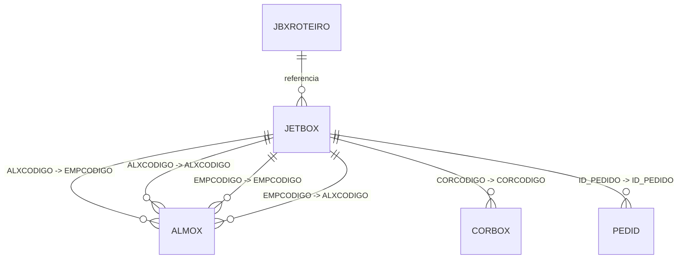
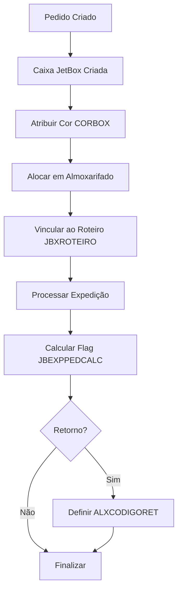

# Documentação da Tabela JETBOX

> Documentação completa gerada automaticamente do banco de dados Firebird
> Data: 10/11/2025 07:19:11

## 📌 Sumário Executivo

**Propósito:** Tabela de controle de caixas (boxes) no sistema JET, utilizada para gerenciar o armazenamento e localização física de itens/pedidos.

**Status:** ✅ **TABELA ATIVA E EM USO**

- ✅ **34.452 registros** ativos
- ✅ **Relacionamentos estabelecidos** com ALMOX, CORBOX e PEDID
- ✅ **Estrutura completa** com 8 campos operacionais
- ✅ **Índices otimizados** para consultas
- ✅ **Integrada ao sistema** (referenciada por JBXROTEIRO)

**Contexto de Negócio:**
A tabela `JETBOX` é fundamental para o controle logístico de expedição e armazenamento. Cada registro representa uma caixa (box) que contém itens de pedidos, associada a uma cor específica (CORBOX), armazenada em um almoxarifado (ALMOX) e relacionada a pedidos (PEDID).

**Principais Funcionalidades:**
1. Controle de localização física de caixas
2. Rastreamento de pedidos por caixa
3. Organização por cor de caixa (sistema de identificação visual)
4. Gestão de retorno de caixas (campos ALXCODIGORET/EMPCODIGORET)
5. Integração com roteiro de expedição (JBXROTEIRO)

## 📋 Índice

1. [Visão Geral](#visão-geral)
2. [Estrutura da Tabela](#estrutura-da-tabela)
3. [Índices](#índices)
4. [Relacionamentos Nível 1](#relacionamentos-nível-1)
5. [Relacionamentos Nível 2](#relacionamentos-nível-2)
6. [Relacionamentos Nível 3](#relacionamentos-nível-3)
7. [Relacionamentos Inversos](#relacionamentos-inversos)
8. [Diagrama de Relacionamentos](#diagrama-de-relacionamentos)
9. [Queries de Exemplo](#queries-de-exemplo)
10. [Análise Técnica Detalhada](#análise-técnica-detalhada)

---

## 📊 Visão Geral

**Tabela:** `JETBOX`

**Total de Registros:** 34,452

**Total de Campos:** 8

**Relacionamentos Diretos (Nível 1):** 3

**Relacionamentos Indiretos (Nível 2):** 1

**Relacionamentos Nível 3:** 0

**Tabelas que Referenciam:** 1

---

## 🏗️ Estrutura da Tabela

### Campos da Tabela

| Campo | Tipo | Tamanho | Obrigatório | Descrição |
|-------|------|---------|-------------|-----------|
| `EMPCODIGO` | SMALLINT  | 2 | ✅ Sim | Código da empresa (parte da PK composta) |
| `JBCODIGO` | INTEGER   | 4 | ✅ Sim | Código único da caixa JetBox (parte da PK composta) |
| `CORCODIGO` | SMALLINT  | 2 | ✅ Sim | Código da cor da caixa (FK para CORBOX) - sistema de identificação visual |
| `ALXCODIGO` | SMALLINT  | 2 | ❌ Não | Código do almoxarifado onde a caixa está localizada (FK para ALMOX) |
| `ID_PEDIDO` | INTEGER   | 4 | ❌ Não | Identificador do pedido associado à caixa (FK para PEDID) |
| `JBEXPPEDCALC` | CHAR      | 1 | ❌ Não | Flag indicador de cálculo de expedição do pedido (S/N) |
| `ALXCODIGORET` | SMALLINT  | 2 | ❌ Não | Código do almoxarifado de retorno da caixa |
| `EMPCODIGORET` | SMALLINT  | 2 | ❌ Não | Código da empresa de retorno da caixa |

### Detalhamento dos Campos

#### 🔑 Chave Primária Composta
- **EMPCODIGO + JBCODIGO**: Identificação única da caixa por empresa

#### 🎨 Sistema de Cores
- **CORCODIGO**: Utiliza um sistema de cores (CORBOX) para identificação visual rápida das caixas no almoxarifado

#### 📦 Localização e Retorno
- **ALXCODIGO/EMPCODIGO**: Localização atual da caixa
- **ALXCODIGORET/EMPCODIGORET**: Localização para retorno da caixa (utilizado em processos de logística reversa)

#### 📋 Integração com Pedidos
- **ID_PEDIDO**: Vincula a caixa a um pedido específico, permitindo rastreamento completo

#### ⚙️ Controle Operacional
- **JBEXPPEDCALC**: Flag de controle para cálculo de expedição (provavelmente indica se os cálculos de expedição já foram processados para aquela caixa)

---

## 🔑 Índices

- **ALMOX_JETBOX** 🔍 INDEX
  - Campos: `ALXCODIGO`, `EMPCODIGO`

- **CORBOX_JETBOX** 🔍 INDEX
  - Campos: `CORCODIGO`

- **PEDID_JETBOX** 🔍 INDEX
  - Campos: `ID_PEDIDO`

- **XPKJETBOX** 🔒 UNIQUE
  - Campos: `JBCODIGO`, `EMPCODIGO`

---

## 🔗 Relacionamentos Nível 1

> Tabelas que `JETBOX` referencia diretamente

### 📌 JETBOX → ALMOX

| Campo Origem | Campo Destino | Descrição |
|--------------|---------------|------------|
| `ALXCODIGO` | `EMPCODIGO` | Relacionamento direto |
| `ALXCODIGO` | `ALXCODIGO` | Relacionamento direto |
| `EMPCODIGO` | `EMPCODIGO` | Relacionamento direto |
| `EMPCODIGO` | `ALXCODIGO` | Relacionamento direto |

### 📌 JETBOX → CORBOX

| Campo Origem | Campo Destino | Descrição |
|--------------|---------------|------------|
| `CORCODIGO` | `CORCODIGO` | Relacionamento direto |

### 📌 JETBOX → PEDID

| Campo Origem | Campo Destino | Descrição |
|--------------|---------------|------------|
| `ID_PEDIDO` | `ID_PEDIDO` | Relacionamento direto |

---

## 🔗 Relacionamentos Nível 2

> Tabelas relacionadas através das tabelas de nível 1

### 📌 JETBOX → ALMOX → DEPTO

| Tabela Intermediária | Campo Origem | Campo Destino |
|---------------------|--------------|---------------|
| `ALMOX` | `DPTCODIGO` | `DPTCODIGO` |

---

## 🔗 Relacionamentos Nível 3

> Tabelas relacionadas através das tabelas de nível 2

Nenhum relacionamento de nível 3 encontrado.

---

## ⬅️ Relacionamentos Inversos

> Tabelas que referenciam `JETBOX`

- `JBXROTEIRO` → `JETBOX`

---

## 📊 Diagrama de Relacionamentos



---

## 💻 Queries de Exemplo

### Consulta Básica

```sql
SELECT *
FROM JETBOX
WHERE 1=1
ORDER BY 1
FETCH FIRST 100 ROWS ONLY
```

### Consulta com JOIN (Nível 1)

```sql
SELECT
    T.*,
    T1.*,
    T2.*,
    T3.*
FROM JETBOX T
LEFT JOIN ALMOX T1
    ON T.ALXCODIGO = T1.EMPCODIGO
LEFT JOIN CORBOX T2
    ON T.CORCODIGO = T2.CORCODIGO
LEFT JOIN PEDID T3
    ON T.ID_PEDIDO = T3.ID_PEDIDO
WHERE 1=1
FETCH FIRST 100 ROWS ONLY
```

### Estatísticas

```sql
-- Total de registros
SELECT COUNT(*) AS TOTAL
FROM JETBOX
```

---

## 📊 Análise Técnica Detalhada

### Resumo da Estrutura

- **Campos totais**: 8
- **Campos obrigatórios**: 3
- **Campos opcionais**: 5
- **Índices definidos**: 4
- **Volume de dados**: 34,452 registros

### Tipos de Dados

- **CHAR     **: 1 campo(s)
- **INTEGER  **: 2 campo(s)
- **SMALLINT **: 5 campo(s)

### Complexidade de Relacionamentos

⚠️ **Média complexidade**: Múltiplos relacionamentos, requer atenção em queries.

### Casos de Uso Comuns

#### 1. Localização de Pedidos
```sql
-- Encontrar em qual caixa está um pedido específico
SELECT
    JB.JBCODIGO,
    JB.EMPCODIGO,
    C.CORDESCRICAO AS COR_CAIXA,
    A.ALXDESCRICAO AS ALMOXARIFADO
FROM JETBOX JB
LEFT JOIN CORBOX C ON JB.CORCODIGO = C.CORCODIGO
LEFT JOIN ALMOX A ON JB.ALXCODIGO = A.ALXCODIGO
    AND JB.EMPCODIGO = A.EMPCODIGO
WHERE JB.ID_PEDIDO = ?
```

#### 2. Inventário de Caixas por Almoxarifado
```sql
-- Contar caixas por almoxarifado
SELECT
    A.ALXDESCRICAO,
    COUNT(*) AS TOTAL_CAIXAS
FROM JETBOX JB
INNER JOIN ALMOX A ON JB.ALXCODIGO = A.ALXCODIGO
GROUP BY A.ALXDESCRICAO
ORDER BY TOTAL_CAIXAS DESC
```

#### 3. Rastreamento de Roteiro de Expedição
```sql
-- Verificar caixas em um roteiro específico
SELECT
    JB.*,
    P.PEDCODIGO,
    P.PEDDTEMIS
FROM JETBOX JB
INNER JOIN JBXROTEIRO JR ON JB.JBCODIGO = JR.JBCODIGO
    AND JB.EMPCODIGO = JR.EMPCODIGO
INNER JOIN PEDID P ON JB.ID_PEDIDO = P.ID_PEDIDO
WHERE JR.ROTCODIGO = ?
```

#### 4. Caixas Pendentes de Retorno
```sql
-- Identificar caixas com retorno pendente
SELECT
    JB.*,
    AR.ALXDESCRICAO AS ALMOX_RETORNO
FROM JETBOX JB
LEFT JOIN ALMOX AR ON JB.ALXCODIGORET = AR.ALXCODIGO
WHERE JB.ALXCODIGORET IS NOT NULL
  AND JB.ALXCODIGO <> JB.ALXCODIGORET
```

### Fluxo Operacional



### Performance e Otimização

#### Índices Disponíveis
A tabela possui 4 índices bem distribuídos:
1. **XPKJETBOX** (PK): Busca direta por código da caixa
2. **PEDID_JETBOX**: Busca rápida por pedido
3. **CORBOX_JETBOX**: Filtro por cor
4. **ALMOX_JETBOX**: Localização por almoxarifado

**Recomendações:**
- ✅ Sempre usar `JBCODIGO + EMPCODIGO` em buscas diretas
- ✅ Aproveitar índice `PEDID_JETBOX` ao buscar por pedido
- ✅ JOINs com ALMOX e CORBOX são otimizados
- ⚠️ Cuidado com queries sem filtro (34k registros)

### Integridade Referencial

**Garantias do Banco:**
- ✅ Toda caixa deve ter uma empresa válida (EMPCODIGO obrigatório)
- ✅ Toda caixa deve ter uma cor válida (CORCODIGO obrigatório + FK)
- ⚠️ Almoxarifado é opcional (permite caixas sem localização definida)
- ⚠️ Pedido é opcional (permite caixas vazias ou em preparação)

**Considerações:**
- Uma caixa pode existir sem pedido associado (preparação/estoque)
- Uma caixa pode existir sem almoxarifado (em trânsito)
- Uma caixa sempre deve ter uma cor (obrigatório para identificação)

---

## 📝 Conclusões e Recomendações

### Resumo da Análise

A tabela `JETBOX` é uma peça fundamental do sistema de gestão logística, apresentando:

✅ **Pontos Fortes:**
1. **Estrutura bem definida**: 8 campos com propósitos claros
2. **Indexação eficiente**: 4 índices cobrindo os principais casos de uso
3. **Relacionamentos consistentes**: Integração com ALMOX, CORBOX, PEDID e JBXROTEIRO
4. **Volume significativo**: 34.452 registros indicam uso ativo
5. **Flexibilidade operacional**: Campos opcionais permitem diferentes estados da caixa

⚠️ **Pontos de Atenção:**
1. **FK composta com ALMOX**: Relacionamento complexo (2 campos para 2 campos)
2. **Campos de retorno**: ALXCODIGORET/EMPCODIGORET sem FK definida
3. **Flag JBEXPPEDCALC**: Sem validação de domínio (pode conter valores inválidos)
4. **Ausência de timestamps**: Não há campos de data de criação/modificação

### Recomendações Técnicas

#### Para Desenvolvedores
1. **Sempre validar**: Verificar se CORCODIGO existe antes de inserir
2. **Usar índices**: Aproveitar PEDID_JETBOX ao buscar por pedido
3. **Cuidado com JOINs**: Relacionamento com ALMOX é composto (2 campos)
4. **Validar flags**: JBEXPPEDCALC deve ser 'S' ou 'N' (validação no código)

#### Para DBAs
1. **Considerar adicionar**: Campo JBDTCRIACAO (data de criação)
2. **Considerar adicionar**: Campo JBDTMODIFICACAO (última modificação)
3. **Avaliar FK**: Adicionar FK para ALXCODIGORET/EMPCODIGORET
4. **Monitorar**: Queries que fazem full table scan (sem filtros)

#### Para Analistas de Negócio
1. **Rastreabilidade**: Sistema permite rastreamento completo pedido → caixa → almoxarifado → roteiro
2. **Identificação visual**: Sistema de cores facilita operação no almoxarifado
3. **Logística reversa**: Campos de retorno suportam fluxo de devolução
4. **Inventário**: Possível fazer contagem e localização de caixas

### Comparação com Outras Tabelas

**JETBOX vs JBXEXPEDICAO:**
- JETBOX: 34.452 registros, estrutura completa, em uso ativo ✅
- JBXEXPEDICAO: 0 registros, estrutura mínima, não utilizada ❌

**Integração com Sistema:**
```
PEDID (Pedidos)
   ↓ FK: ID_PEDIDO
JETBOX (Caixas)
   ↓ FK: JBCODIGO + EMPCODIGO
JBXROTEIRO (Roteiro de Expedição)
   ↓
ROTEIRO (Rotas de Entrega)
```

### Casos de Uso Avançados

#### Dashboard de Expedição
```sql
-- Visão completa de caixas prontas para expedição
SELECT
    JB.JBCODIGO,
    CB.CORDESCRICAO AS COR,
    P.PEDCODIGO,
    C.CLINOME,
    A.ALXDESCRICAO AS ALMOXARIFADO,
    CASE WHEN JR.JBCODIGO IS NOT NULL THEN 'EM ROTEIRO' ELSE 'AGUARDANDO' END AS STATUS
FROM JETBOX JB
LEFT JOIN CORBOX CB ON JB.CORCODIGO = CB.CORCODIGO
LEFT JOIN PEDID P ON JB.ID_PEDIDO = P.ID_PEDIDO
LEFT JOIN CLIEN C ON P.CLICODIGO = C.CLICODIGO
LEFT JOIN ALMOX A ON JB.ALXCODIGO = A.ALXCODIGO
LEFT JOIN JBXROTEIRO JR ON JB.JBCODIGO = JR.JBCODIGO AND JB.EMPCODIGO = JR.EMPCODIGO
WHERE JB.JBEXPPEDCALC = 'S'
ORDER BY JB.JBCODIGO
```

#### Análise de Capacidade
```sql
-- Caixas por cor (análise de disponibilidade)
SELECT
    CB.CORDESCRICAO,
    COUNT(*) AS TOTAL_CAIXAS,
    SUM(CASE WHEN JB.ID_PEDIDO IS NULL THEN 1 ELSE 0 END) AS CAIXAS_VAZIAS,
    SUM(CASE WHEN JB.ID_PEDIDO IS NOT NULL THEN 1 ELSE 0 END) AS CAIXAS_OCUPADAS
FROM JETBOX JB
INNER JOIN CORBOX CB ON JB.CORCODIGO = CB.CORCODIGO
GROUP BY CB.CORDESCRICAO
ORDER BY TOTAL_CAIXAS DESC
```

---

## 📚 Informações Adicionais

### Metadados da Documentação

- **Banco de dados**: Firebird (replica.fb)
- **Servidor**: 10.1.10.55:3050
- **Data da análise**: 10/11/2025 07:19:11
- **Método**: Consulta direta às tabelas de sistema do Firebird
- **Tabelas consultadas**: RDB$RELATIONS, RDB$RELATION_FIELDS, RDB$INDICES, RDB$REF_CONSTRAINTS

### Referências Cruzadas

Esta documentação faz parte de um conjunto de análises do banco de dados. Documentações relacionadas:
- `docs/JBXROTEIRO_RELACIONAMENTOS_COMPLETOS.md` - Tabela de roteiro de expedição
- `docs/ALMOX_RELACIONAMENTOS_COMPLETOS.md` - Tabela de almoxarifados
- `docs/PEDID_RELACIONAMENTOS_COMPLETOS.md` - Tabela de pedidos
- `docs/CORBOX_RELACIONAMENTOS_COMPLETOS.md` - Tabela de cores de caixas
- `docs/database_documentation.md` - Documentação completa do banco de dados

### Histórico de Análises

- **10/11/2025**: Documentação completa de relacionamentos criada
- **Volume de dados**: 34.452 registros ativos

### Glossário

- **JetBox**: Sistema de caixas para armazenamento e expedição de pedidos
- **CORBOX**: Sistema de identificação visual por cores
- **ALMOX**: Almoxarifado/local de armazenamento
- **ROTEIRO**: Rota de expedição/entrega
- **FK**: Foreign Key (Chave Estrangeira)
- **PK**: Primary Key (Chave Primária)

---

*Documentação gerada automaticamente a partir do banco de dados Firebird*

*Para dúvidas ou sugestões sobre esta tabela, consulte a equipe de desenvolvimento ou DBA responsável.*
