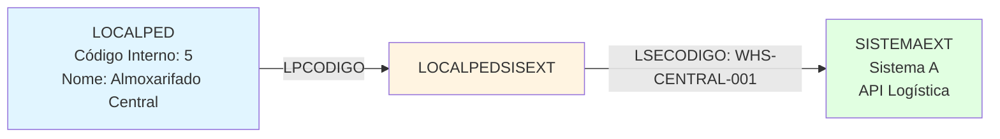
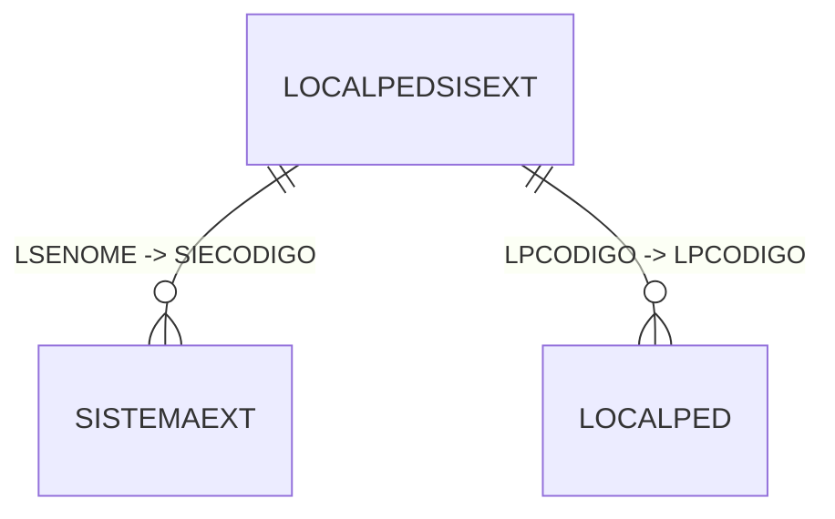

# Documentação da Tabela LOCALPEDSISEXT

> Documentação completa gerada automaticamente do banco de dados Firebird
> Data: 10/11/2025 07:31:28

## 📌 Sumário Executivo

**Propósito:** Tabela de configuração que mapeia localizações de pedidos (LOCALPED) para sistemas externos (SISTEMAEXT), permitindo integração e sincronização de dados entre o sistema interno e aplicações externas.

**Status:** ✅ **TABELA DE CONFIGURAÇÃO ATIVA**

- ✅ **12 registros** de configuração
- ✅ **Tabela de lookup/domínio** (baixo volume, alta importância)
- ✅ **Relacionamentos estabelecidos** com LOCALPED e SISTEMAEXT
- ✅ **Chave composta** (LPCODIGO + LSENOME) garante unicidade
- 🔧 **Tabela de integração** - ponte entre sistema interno e externo

**Contexto de Negócio:**
A tabela `LOCALPEDSISEXT` funciona como uma **tabela de mapeamento** que estabelece a correspondência entre localizações internas de pedidos (LOCALPED) e sistemas externos (SISTEMAEXT). Com apenas 12 registros, é uma tabela de configuração típica que define como os dados de localização devem ser interpretados ou enviados para sistemas externos.

**Características Importantes:**
1. **Tabela de domínio**: Volume pequeno e relativamente estático
2. **Ponte de integração**: Conecta entidades internas com sistemas externos
3. **Chave composta**: LPCODIGO + LSENOME garantem combinação única
4. **Campo complementar**: LSECOMPLE permite informações adicionais
5. **3 índices**: Boa indexação para consultas rápidas

**Uso Típico:**
- Mapeamento de dados para exportação
- Tradução de códigos internos para externos
- Configuração de integrações com APIs externas
- Sincronização de dados entre sistemas

## 📋 Índice

1. [Visão Geral](#visão-geral)
2. [Estrutura da Tabela](#estrutura-da-tabela)
3. [Índices](#índices)
4. [Relacionamentos Nível 1](#relacionamentos-nível-1)
5. [Relacionamentos Nível 2](#relacionamentos-nível-2)
6. [Relacionamentos Nível 3](#relacionamentos-nível-3)
7. [Relacionamentos Inversos](#relacionamentos-inversos)
8. [Diagrama de Relacionamentos](#diagrama-de-relacionamentos)
9. [Queries de Exemplo](#queries-de-exemplo)
10. [Análise Técnica Detalhada](#análise-técnica-detalhada)

---

## 📊 Visão Geral

**Tabela:** `LOCALPEDSISEXT`

**Total de Registros:** 12

**Total de Campos:** 4

**Relacionamentos Diretos (Nível 1):** 2

**Relacionamentos Indiretos (Nível 2):** 0

**Relacionamentos Nível 3:** 0

**Tabelas que Referenciam:** 0

---

## 🏗️ Estrutura da Tabela

### Campos da Tabela

| Campo | Tipo | Tamanho | Obrigatório | Descrição |
|-------|------|---------|-------------|-----------|
| `LPCODIGO` | SMALLINT  | 2 | ✅ Sim | Código da localização do pedido (FK para LOCALPED) - parte da PK composta |
| `LSECODIGO` | VARCHAR   | 30 | ✅ Sim | Código/identificador externo da localização no sistema externo |
| `LSENOME` | CHAR      | 1 | ✅ Sim | Código do sistema externo (FK para SISTEMAEXT) - parte da PK composta |
| `LSECOMPLE` | VARCHAR   | 30 | ❌ Não | Informação complementar sobre o mapeamento (descrição, observações) |

### Detalhamento dos Campos

#### 🔑 Chave Primária Composta
- **LPCODIGO + LSENOME**: Combinação única que garante que cada localização interna (LPCODIGO) pode ter apenas um mapeamento por sistema externo (LSENOME)
  - Permite que a mesma localização seja mapeada para diferentes sistemas externos
  - Evita duplicações de mapeamento para o mesmo sistema

#### 📊 Campos de Integração

**LPCODIGO (Localização Interna):**
- Código da localização do pedido no sistema interno
- Referência a `LOCALPED.LPCODIGO`
- Representa o "de onde" do mapeamento
- Obrigatório para garantir vínculo com localização interna válida

**LSENOME (Sistema Externo):**
- Código identificador do sistema externo
- Referência a `SISTEMAEXT.SIECODIGO`
- Representa o "para onde" do mapeamento
- Tipo CHAR(1) sugere códigos curtos (ex: 'A', 'B', 'C', '1', '2')
- Provavelmente identifica diferentes sistemas externos ou APIs

**LSECODIGO (Código Externo):**
- Código ou identificador usado no sistema externo
- VARCHAR(30) permite flexibilidade de formatos
- Pode ser: código numérico, alfanumérico, identificador de API, etc.
- Este é o valor que será enviado/recebido do sistema externo

**LSECOMPLE (Complemento):**
- Campo opcional para informações adicionais
- Pode conter: descrição, observações, metadados
- Útil para documentação interna do mapeamento
- Facilita manutenção e troubleshooting

### Exemplo de Uso Conceitual

```
Exemplo de Registro:
LPCODIGO = 5 (Ex: "Almoxarifado Central")
LSENOME = 'A' (Ex: Sistema Externo "API Logística")
LSECODIGO = "WHS-CENTRAL-001" (Código usado na API Logística)
LSECOMPLE = "Integração com API Logística v2.0"

Interpretação:
"Quando a localização 5 (Almoxarifado Central) for enviada para o
Sistema Externo 'A' (API Logística), deve ser traduzida como
'WHS-CENTRAL-001'"
```

### Padrão de Mapeamento



---

## 🔑 Índices

- **SISTEMAEXT_LOCALPEDSISEXT** 🔍 INDEX
  - Campos: `LSENOME`

- **TPLENTE_LOCALPEDSISEXT** 🔍 INDEX
  - Campos: `LPCODIGO`

- **XPKLOCALPEDSISEXT** 🔒 UNIQUE
  - Campos: `LPCODIGO`, `LSENOME`

---

## 🔗 Relacionamentos Nível 1

> Tabelas que `LOCALPEDSISEXT` referencia diretamente

### 📌 LOCALPEDSISEXT → SISTEMAEXT

| Campo Origem | Campo Destino | Descrição |
|--------------|---------------|------------|
| `LSENOME` | `SIECODIGO` | Relacionamento direto |

### 📌 LOCALPEDSISEXT → LOCALPED

| Campo Origem | Campo Destino | Descrição |
|--------------|---------------|------------|
| `LPCODIGO` | `LPCODIGO` | Relacionamento direto |

---

## 🔗 Relacionamentos Nível 2

> Tabelas relacionadas através das tabelas de nível 1

Nenhum relacionamento de nível 2 encontrado.

---

## 🔗 Relacionamentos Nível 3

> Tabelas relacionadas através das tabelas de nível 2

Nenhum relacionamento de nível 3 encontrado.

---

## ⬅️ Relacionamentos Inversos

> Tabelas que referenciam `LOCALPEDSISEXT`

Nenhuma tabela referencia esta.

---

## 📊 Diagrama de Relacionamentos



---

## 💻 Queries de Exemplo

### 1. Consulta Básica com Descrições

```sql
-- Listar todos os mapeamentos com descrições
SELECT
    LPS.LPCODIGO,
    LP.LPDESCRICAO AS LOCALIZACAO_INTERNA,
    LPS.LSENOME AS COD_SISTEMA_EXTERNO,
    SE.SIEDESCRICAO AS NOME_SISTEMA_EXTERNO,
    LPS.LSECODIGO AS CODIGO_EXTERNO,
    LPS.LSECOMPLE AS COMPLEMENTO
FROM LOCALPEDSISEXT LPS
INNER JOIN LOCALPED LP ON LPS.LPCODIGO = LP.LPCODIGO
INNER JOIN SISTEMAEXT SE ON LPS.LSENOME = SE.SIECODIGO
ORDER BY LP.LPDESCRICAO, SE.SIEDESCRICAO
```

### 2. Buscar Código Externo para uma Localização

```sql
-- Dado um código interno e sistema externo, obter o código a ser usado externamente
SELECT
    LPS.LSECODIGO AS CODIGO_PARA_USAR_NO_SISTEMA_EXTERNO
FROM LOCALPEDSISEXT LPS
WHERE LPS.LPCODIGO = ? -- Ex: 5
  AND LPS.LSENOME = ? -- Ex: 'A'
```

### 3. Listar Todos os Sistemas Externos de uma Localização

```sql
-- Ver para quais sistemas externos uma localização está mapeada
SELECT
    LP.LPCODIGO,
    LP.LPDESCRICAO AS LOCALIZACAO,
    SE.SIECODIGO,
    SE.SIEDESCRICAO AS SISTEMA_EXTERNO,
    LPS.LSECODIGO AS CODIGO_NO_SISTEMA,
    LPS.LSECOMPLE AS OBSERVACOES
FROM LOCALPED LP
INNER JOIN LOCALPEDSISEXT LPS ON LP.LPCODIGO = LPS.LPCODIGO
INNER JOIN SISTEMAEXT SE ON LPS.LSENOME = SE.SIECODIGO
WHERE LP.LPCODIGO = ? -- Ex: 5
ORDER BY SE.SIEDESCRICAO
```

### 4. Listar Todas as Localizações de um Sistema Externo

```sql
-- Ver quais localizações internas estão mapeadas para um sistema externo específico
SELECT
    SE.SIEDESCRICAO AS SISTEMA_EXTERNO,
    LP.LPCODIGO,
    LP.LPDESCRICAO AS LOCALIZACAO_INTERNA,
    LPS.LSECODIGO AS CODIGO_EXTERNO,
    LPS.LSECOMPLE AS OBSERVACOES
FROM SISTEMAEXT SE
INNER JOIN LOCALPEDSISEXT LPS ON SE.SIECODIGO = LPS.LSENOME
INNER JOIN LOCALPED LP ON LPS.LPCODIGO = LP.LPCODIGO
WHERE SE.SIECODIGO = ? -- Ex: 'A'
ORDER BY LP.LPDESCRICAO
```

### 5. Verificar Localizações Sem Mapeamento

```sql
-- Identificar localizações que não têm mapeamento para nenhum sistema externo
SELECT
    LP.LPCODIGO,
    LP.LPDESCRICAO AS LOCALIZACAO_SEM_MAPEAMENTO
FROM LOCALPED LP
WHERE NOT EXISTS (
    SELECT 1
    FROM LOCALPEDSISEXT LPS
    WHERE LPS.LPCODIGO = LP.LPCODIGO
)
ORDER BY LP.LPCODIGO
```

### 6. Verificar Localizações Sem Mapeamento para Sistema Específico

```sql
-- Localizações que não estão mapeadas para um sistema externo específico
SELECT
    LP.LPCODIGO,
    LP.LPDESCRICAO AS LOCALIZACAO
FROM LOCALPED LP
WHERE NOT EXISTS (
    SELECT 1
    FROM LOCALPEDSISEXT LPS
    WHERE LPS.LPCODIGO = LP.LPCODIGO
      AND LPS.LSENOME = ? -- Ex: 'A'
)
ORDER BY LP.LPCODIGO
```

### 7. Estatísticas de Mapeamento

```sql
-- Resumo de mapeamentos por sistema externo
SELECT
    SE.SIECODIGO,
    SE.SIEDESCRICAO AS SISTEMA_EXTERNO,
    COUNT(*) AS TOTAL_LOCALIZACOES_MAPEADAS,
    COUNT(DISTINCT LPS.LPCODIGO) AS LOCALIZACOES_DISTINTAS
FROM SISTEMAEXT SE
LEFT JOIN LOCALPEDSISEXT LPS ON SE.SIECODIGO = LPS.LSENOME
GROUP BY SE.SIECODIGO, SE.SIEDESCRICAO
ORDER BY TOTAL_LOCALIZACOES_MAPEADAS DESC
```

### 8. Auditoria de Duplicações (não deveria existir com PK, mas útil para verificação)

```sql
-- Verificar se há duplicações de mapeamento (redundante com PK, mas útil para auditoria)
SELECT
    LPCODIGO,
    LSENOME,
    COUNT(*) AS QTD_DUPLICACOES
FROM LOCALPEDSISEXT
GROUP BY LPCODIGO, LSENOME
HAVING COUNT(*) > 1
```

### 9. Função Auxiliar - Traduzir Código Interno para Externo

```sql
-- Exemplo de uso em aplicação: traduzir código antes de enviar para API externa
SELECT
    COALESCE(
        (SELECT LPS.LSECODIGO
         FROM LOCALPEDSISEXT LPS
         WHERE LPS.LPCODIGO = :codigo_interno
           AND LPS.LSENOME = :sistema_externo),
        :codigo_interno::VARCHAR -- fallback: usar código interno se não houver mapeamento
    ) AS CODIGO_PARA_ENVIAR
```

### 10. Listagem Completa para Documentação

```sql
-- Gerar documentação completa de todos os mapeamentos
SELECT
    LP.LPCODIGO || ' - ' || LP.LPDESCRICAO AS LOCALIZACAO_INTERNA,
    SE.SIECODIGO || ' - ' || SE.SIEDESCRICAO AS SISTEMA_EXTERNO,
    LPS.LSECODIGO AS CODIGO_USADO_EXTERNAMENTE,
    COALESCE(LPS.LSECOMPLE, '(sem observações)') AS OBSERVACOES
FROM LOCALPEDSISEXT LPS
INNER JOIN LOCALPED LP ON LPS.LPCODIGO = LP.LPCODIGO
INNER JOIN SISTEMAEXT SE ON LPS.LSENOME = SE.SIECODIGO
ORDER BY LP.LPDESCRICAO, SE.SIEDESCRICAO
```

---

## 📊 Análise Técnica Detalhada

### Resumo da Estrutura

- **Campos totais**: 4
- **Campos obrigatórios**: 3
- **Campos opcionais**: 1
- **Índices definidos**: 3
- **Volume de dados**: 12 registros

### Tipos de Dados

- **CHAR     **: 1 campo(s)
- **SMALLINT **: 1 campo(s)
- **VARCHAR  **: 2 campo(s)

### Complexidade de Relacionamentos

✅ **Baixa complexidade**: Poucos relacionamentos, estrutura simples e direta.

### Padrão de Tabela

**Tipo:** Tabela de Configuração/Lookup/Domínio

**Características:**
- ✅ Volume pequeno (12 registros)
- ✅ Dados relativamente estáticos
- ✅ Alta importância para integrações
- ✅ Frequência de leitura alta, escrita baixa
- ✅ Candidata a cache em aplicação

### Casos de Uso Típicos

#### 1. Exportação de Dados para Sistema Externo

```python
# Pseudocódigo Python
def exportar_pedido_para_sistema_externo(pedido, sistema_externo):
    # Obter localização do pedido
    codigo_local_interno = pedido.localizacao

    # Buscar código correspondente no sistema externo
    query = """
        SELECT LSECODIGO
        FROM LOCALPEDSISEXT
        WHERE LPCODIGO = ? AND LSENOME = ?
    """
    codigo_local_externo = db.query(query, codigo_local_interno, sistema_externo)

    # Usar código externo na API
    if codigo_local_externo:
        api_dados = {
            'pedido': pedido.numero,
            'localizacao': codigo_local_externo  # Código traduzido
        }
        sistema_externo_api.enviar(api_dados)
    else:
        # Tratar caso sem mapeamento
        log.error(f"Localização {codigo_local_interno} não mapeada para sistema {sistema_externo}")
```

#### 2. Importação de Dados de Sistema Externo

```python
# Pseudocódigo Python
def processar_dados_recebidos(dados_externos, sistema_origem):
    # Dados recebidos com código externo
    codigo_externo = dados_externos['localizacao']

    # Traduzir para código interno
    query = """
        SELECT LPCODIGO
        FROM LOCALPEDSISEXT
        WHERE LSECODIGO = ? AND LSENOME = ?
    """
    codigo_interno = db.query(query, codigo_externo, sistema_origem)

    # Processar com código interno
    if codigo_interno:
        pedido.localizacao = codigo_interno
        pedido.salvar()
    else:
        log.warning(f"Código externo {codigo_externo} não encontrado no mapeamento")
```

#### 3. Sincronização Bi-direcional

```python
# Pseudocódigo Python
def sincronizar_localizacao(pedido, sistema_externo):
    # Cache de mapeamentos (reload quando necessário)
    mapeamentos = carregar_mapeamentos_cache()

    chave = (pedido.localizacao, sistema_externo)

    if chave in mapeamentos:
        return mapeamentos[chave]
    else:
        # Tratar ausência de mapeamento
        return None
```

### Performance e Otimização

#### Índices Existentes

1. **XPKLOCALPEDSISEXT (LPCODIGO + LSENOME)** - Unique:
   - Garante unicidade da combinação
   - Busca rápida por localização + sistema
   - Usado em queries de tradução

2. **TPLENTE_LOCALPEDSISEXT (LPCODIGO)**:
   - Busca todas as definições de uma localização
   - Listagem de sistemas externos mapeados

3. **SISTEMAEXT_LOCALPEDSISEXT (LSENOME)**:
   - Busca todos os mapeamentos de um sistema externo
   - Listagem de localizações mapeadas para um sistema

**Análise:** Índices muito bem distribuídos para este tipo de tabela!

#### Estratégias de Cache

Com apenas 12 registros, esta tabela é **candidata ideal para cache**:

**Benefícios do Cache:**
- ✅ Reduz latência em integrações (evita query para cada tradução)
- ✅ Diminui carga no banco de dados
- ✅ Melhora performance de APIs e exportações

**Implementação Sugerida:**
```python
# Cache em memória com TTL
cache_mapeamentos = {
    # (codigo_interno, sistema_externo): codigo_externo
    (5, 'A'): 'WHS-CENTRAL-001',
    (6, 'A'): 'WHS-SOUTH-002',
    # ... todos os 12 registros
}

# Reload periódico (ex: a cada 1 hora) ou por evento
def reload_cache():
    global cache_mapeamentos
    cache_mapeamentos = carregar_do_banco()
```

### Integridade e Qualidade de Dados

#### Garantias do Banco

- ✅ FK para LOCALPED: Garante que LPCODIGO existe
- ✅ FK para SISTEMAEXT: Garante que LSENOME é válido
- ✅ PK composta: Evita duplicações de mapeamento
- ✅ Campos obrigatórios: LPCODIGO, LSENOME, LSECODIGO devem estar preenchidos

#### Validações Recomendadas

1. **LSECODIGO não vazio:**
```sql
-- Verificar se há códigos externos vazios ou só espaços
SELECT *
FROM LOCALPEDSISEXT
WHERE TRIM(LSECODIGO) = ''
```

2. **Consistência de formato:**
```sql
-- Verificar padrões de LSECODIGO por sistema
SELECT
    LSENOME,
    COUNT(*) AS QTD,
    MIN(LENGTH(LSECODIGO)) AS MIN_TAM,
    MAX(LENGTH(LSECODIGO)) AS MAX_TAM
FROM LOCALPEDSISEXT
GROUP BY LSENOME
```

### Manutenção

#### Quando Adicionar Novos Registros

1. **Nova localização criada** que precisa ser integrada
2. **Novo sistema externo** adicionado ao ambiente
3. **Mudança de código** em sistema externo existente

#### Processo de Manutenção

```sql
-- 1. Verificar se já existe mapeamento
SELECT *
FROM LOCALPEDSISEXT
WHERE LPCODIGO = :nova_localizacao
  AND LSENOME = :sistema_externo;

-- 2. Se não existir, inserir novo mapeamento
INSERT INTO LOCALPEDSISEXT (LPCODIGO, LSENOME, LSECODIGO, LSECOMPLE)
VALUES (:nova_localizacao, :sistema_externo, :codigo_externo, :observacao);

-- 3. Reload do cache (se usar cache)
-- 4. Testar integração
```

#### Auditoria Periódica

```sql
-- Verificar localizações ativas sem mapeamento
SELECT
    LP.LPCODIGO,
    LP.LPDESCRICAO,
    SE.SIECODIGO,
    SE.SIEDESCRICAO
FROM LOCALPED LP
CROSS JOIN SISTEMAEXT SE
WHERE NOT EXISTS (
    SELECT 1
    FROM LOCALPEDSISEXT LPS
    WHERE LPS.LPCODIGO = LP.LPCODIGO
      AND LPS.LSENOME = SE.SIECODIGO
)
  AND LP.LPATIVO = 'S' -- assumindo campo de ativo
  AND SE.SIEATIVO = 'S' -- assumindo campo de ativo
ORDER BY LP.LPDESCRICAO, SE.SIEDESCRICAO;
```

---

## 📝 Conclusões e Recomendações

### Resumo da Análise

A tabela `LOCALPEDSISEXT` é uma **tabela de configuração essencial** para integrações, apresentando:

✅ **Pontos Fortes:**
1. **Design adequado**: Chave composta permite múltiplos mapeamentos
2. **Indexação eficiente**: 3 índices cobrindo todos os casos de uso
3. **Integridade garantida**: FKs para ambas as tabelas relacionadas
4. **Volume gerenciável**: 12 registros facilitam manutenção e cache
5. **Flexibilidade**: VARCHAR(30) para LSECODIGO suporta vários formatos

⚠️ **Pontos de Atenção:**
1. **Sem tabela inversa**: Não há tabela para referenciar esta (esperado para lookup)
2. **LSECOMPLE opcional**: Recomenda-se sempre preencher para documentação
3. **Dependência de cache**: Com volume baixo, deve ser cacheada em aplicação
4. **Sem auditoria**: Não há histórico de mudanças de mapeamento
5. **Sem validação de formato**: LSECODIGO aceita qualquer string

### Recomendações por Área

#### Para Desenvolvedores

1. **Implementar cache:**
   - Carregar todos os registros na inicialização da aplicação
   - Reload periódico ou por evento (ex: webhook de mudança)
   - TTL de 1 hora ou invalidação manual

2. **Tratar ausência de mapeamento:**
   ```python
   codigo_externo = obter_mapeamento(codigo_interno, sistema)
   if not codigo_externo:
       # Opção 1: Usar código interno como fallback
       # Opção 2: Lançar exceção
       # Opção 3: Logar e retornar None
   ```

3. **Validar antes de integrar:**
   - Sempre verificar se mapeamento existe antes de exportar
   - Logar casos onde mapeamento está ausente
   - Criar alertas para mapeamentos faltantes

4. **Documentar códigos externos:**
   - Sempre preencher LSECOMPLE com informações úteis
   - Incluir versão da API, formato esperado, exemplos

#### Para DBAs

1. **Considerar adicionar:**
   ```sql
   -- Tabela de histórico de mudanças
   CREATE TABLE LOCALPEDSISEXT_HIST (
       ID INTEGER PRIMARY KEY,
       LPCODIGO SMALLINT,
       LSENOME CHAR(1),
       LSECODIGO_ANTIGO VARCHAR(30),
       LSECODIGO_NOVO VARCHAR(30),
       DATA_ALTERACAO TIMESTAMP,
       USUARIO VARCHAR(50),
       MOTIVO VARCHAR(200)
   );
   ```

2. **Adicionar constraint de formato (se aplicável):**
   ```sql
   -- Exemplo: se códigos externos sempre têm formato específico
   ALTER TABLE LOCALPEDSISEXT
   ADD CONSTRAINT CHK_LSECODIGO_FORMATO
   CHECK (LSECODIGO ~ '^[A-Z]{3}-[A-Z]+-[0-9]{3}$');
   ```

3. **Monitoramento:**
   - Alertar quando nova localização é criada sem mapeamento
   - Verificar integridade periódica (script semanal)

#### Para Analistas de Integração

1. **Documentação:**
   - Manter planilha Excel com todos os mapeamentos
   - Documentar formato esperado por cada sistema externo
   - Registrar contatos responsáveis por cada integração

2. **Governança:**
   - Processo formal para adicionar novos mapeamentos
   - Approval de mudanças em códigos existentes
   - Testes de integração após mudanças

3. **Monitoramento:**
   - Dashboard mostrando localizações sem mapeamento
   - Alertas quando integração falha por mapeamento ausente

### Comparação com Outras Tabelas

| Aspecto | LOCALPEDSISEXT | JETBOX | JETBOXHISTORICO |
|---------|----------------|--------|-----------------|
| Tipo | Configuração/Lookup | Transacional | Histórico/Log |
| Registros | 12 | 34.452 | 1.837.729 |
| Propósito | Mapeamento | Estado atual | Auditoria |
| Volatilidade | Muito baixa | Média | Alta (append-only) |
| Cache | Sim (recomendado) | Não | Não |
| Consultas | Constantes | Frequentes | Por período |

### Benefícios para o Negócio

1. **Integrações Simplificadas:**
   - Centraliza lógica de tradução de códigos
   - Facilita manutenção (mudanças em um lugar só)
   - Reduz erros de integração

2. **Flexibilidade:**
   - Fácil adicionar novos sistemas externos
   - Não requer mudança de código para novos mapeamentos
   - Suporta múltiplos sistemas simultaneamente

3. **Rastreabilidade:**
   - Sabe-se exatamente qual código usar em cada sistema
   - Documentação centralizada (campo LSECOMPLE)
   - Facilita troubleshooting de integrações

---

## 📚 Informações Adicionais

### Metadados da Documentação

- **Banco de dados**: Firebird (replica.fb)
- **Servidor**: 10.1.10.55:3050
- **Data da análise**: 10/11/2025 07:31:28
- **Método**: Consulta direta às tabelas de sistema do Firebird
- **Tabelas consultadas**: RDB$RELATIONS, RDB$RELATION_FIELDS, RDB$INDICES, RDB$REF_CONSTRAINTS

### Referências Cruzadas

Esta documentação faz parte de um conjunto de análises do banco de dados. Documentações relacionadas:
- `docs/LOCALPED_RELACIONAMENTOS_COMPLETOS.md` - Tabela de localizações de pedidos (se existir)
- `docs/SISTEMAEXT_RELACIONAMENTOS_COMPLETOS.md` - Tabela de sistemas externos (se existir)
- `docs/PEDID_RELACIONAMENTOS_COMPLETOS.md` - Tabela de pedidos
- `docs/database_documentation.md` - Documentação completa do banco de dados

### Histórico de Análises

- **10/11/2025**: Documentação completa de relacionamentos criada
- **Volume de dados**: 12 registros de configuração

### Glossário

- **Tabela de Lookup**: Tabela de referência/domínio com valores pré-definidos
- **Tabela de Configuração**: Tabela que armazena configurações do sistema, geralmente com poucos registros
- **Mapeamento**: Correspondência entre valores internos e externos
- **Sistema Externo**: Aplicação, API ou serviço fora do sistema principal
- **FK (Foreign Key)**: Chave estrangeira que garante integridade referencial
- **PK Composta**: Chave primária formada por múltiplos campos
- **Cache**: Armazenamento temporário em memória para melhorar performance
- **TTL (Time To Live)**: Tempo de vida de um dado em cache
- **Fallback**: Valor ou comportamento alternativo quando o principal falha

### Exemplos de Sistemas Externos Típicos

Baseado no nome da tabela e estrutura, exemplos de sistemas que podem ser integrados:

1. **Sistemas ERP externos**:
   - SAP
   - Oracle ERP
   - Totvs

2. **APIs de Logística**:
   - Correios
   - Transportadoras
   - WMS (Warehouse Management System)

3. **E-commerce/Marketplaces**:
   - Mercado Livre
   - Amazon
   - B2W

4. **Sistemas de terceiros**:
   - CRM externo
   - Sistema de faturamento
   - Portal do cliente

### Scripts de Monitoramento Recomendados

```sql
-- 1. Verificar integridade dos mapeamentos (executar semanalmente)
SELECT
    'TOTAL_MAPEAMENTOS' AS METRICA,
    COUNT(*)::VARCHAR AS VALOR
FROM LOCALPEDSISEXT
UNION ALL
SELECT 'LOCALIZACOES_MAPEADAS', COUNT(DISTINCT LPCODIGO)::VARCHAR
FROM LOCALPEDSISEXT
UNION ALL
SELECT 'SISTEMAS_CONFIGURADOS', COUNT(DISTINCT LSENOME)::VARCHAR
FROM LOCALPEDSISEXT;

-- 2. Alertar sobre mapeamentos sem complemento (documentação incompleta)
SELECT
    LPS.LPCODIGO,
    LP.LPDESCRICAO,
    LPS.LSENOME,
    LPS.LSECODIGO
FROM LOCALPEDSISEXT LPS
INNER JOIN LOCALPED LP ON LPS.LPCODIGO = LP.LPCODIGO
WHERE LPS.LSECOMPLE IS NULL
   OR TRIM(LPS.LSECOMPLE) = '';

-- 3. Dashboard de cobertura de mapeamentos
SELECT
    SE.SIECODIGO,
    SE.SIEDESCRICAO,
    COUNT(LPS.LPCODIGO) AS QTD_LOCALIZACOES_MAPEADAS,
    CAST(COUNT(LPS.LPCODIGO) * 100.0 / (SELECT COUNT(*) FROM LOCALPED) AS DECIMAL(5,2)) AS PERC_COBERTURA
FROM SISTEMAEXT SE
LEFT JOIN LOCALPEDSISEXT LPS ON SE.SIECODIGO = LPS.LSENOME
GROUP BY SE.SIECODIGO, SE.SIEDESCRICAO
ORDER BY PERC_COBERTURA DESC;
```

---

## 🎯 Resumo Final

A tabela `LOCALPEDSISEXT` é uma **componente crítica de integração** do sistema:

### Indicadores-Chave

- 📊 **12 registros** de configuração
- 🔗 **2 relacionamentos** formais (LOCALPED e SISTEMAEXT)
- 🔑 **3 índices** bem distribuídos
- 💾 **Cache recomendado** (volume pequeno)
- 🔄 **Tabela de mapeamento** para integrações

### Função no Sistema

A tabela serve como **dicionário de tradução** entre o sistema interno e sistemas externos:

```
Sistema Interno → LOCALPEDSISEXT → Sistema Externo
   (LPCODIGO)    →  [Mapeamento]  →   (LSECODIGO)
```

### Importância Estratégica

1. **Desacoplamento**: Muda-se mapeamento sem alterar código
2. **Escalabilidade**: Fácil adicionar novos sistemas
3. **Manutenibilidade**: Configuração centralizada
4. **Flexibilidade**: Suporta múltiplos formatos externos

### Próximos Passos Sugeridos

1. ✅ **Imediato**: Implementar cache em aplicação
2. ✅ **Curto prazo**: Documentar todos os LSECOMPLE
3. ⚠️ **Médio prazo**: Criar tabela de histórico de mudanças
4. 📊 **Longo prazo**: Dashboard de cobertura de mapeamentos

### Checklist de Implementação

Para implementar uso adequado desta tabela:

- [ ] Cache implementado na aplicação
- [ ] Todos os registros têm LSECOMPLE preenchido
- [ ] Script de monitoramento agendado
- [ ] Processo de governança para mudanças
- [ ] Documentação externa dos mapeamentos
- [ ] Testes de integração para cada sistema
- [ ] Alertas configurados para mapeamentos faltantes
- [ ] Validação de formato de LSECODIGO (se aplicável)

---

*Documentação gerada automaticamente a partir do banco de dados Firebird*

*Para dúvidas ou sugestões sobre esta tabela, consulte a equipe de desenvolvimento ou DBA responsável.*
