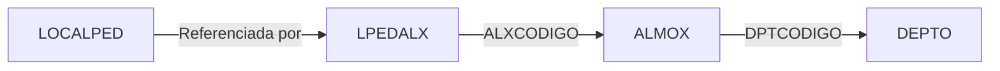
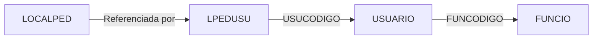
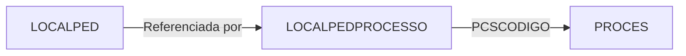
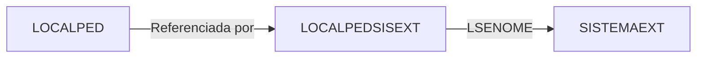
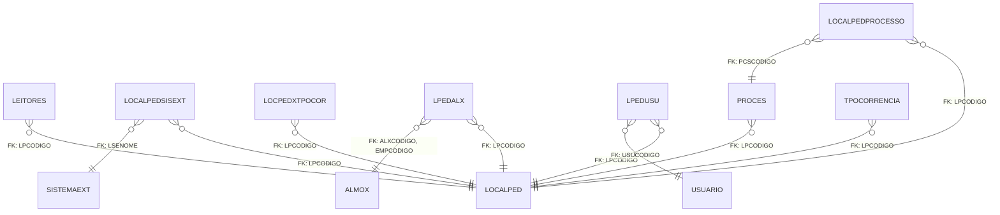

# LOCALPED - Documentação Completa de Relacionamentos (Firebird)

## 📊 Informações Gerais (Metadados do Banco)

- **Nome da Tabela**: LOCALPED
- **Total de Registros**: 142
- **Total de Colunas**: 33
- **Chave Primária**: 1 (LPCODIGO)
- **Chaves Estrangeiras**: 0 (tabela mestre)
- **Índices**: 0
- **Tabelas que Referenciam**: 7 tabelas distintas
- **Banco de Dados**: Firebird

## 📝 Descrição

**LOCALPED** é uma tabela do banco de dados Firebird que armazena tipos/categorias de eventos. Com 142 registros, cada linha representa um tipo específico de evento ou local de pedido que pode ser registrado no sistema.

**Nota Importante**: Esta documentação baseia-se **exclusivamente nos metadados do banco de dados Firebird** extraídos via análise de schema. Interpretações sobre regras de negócio ou uso no código não estão incluídas aqui.

---

## 🔑 Estrutura de Colunas (Schema Firebird)

### Chave Primária
| Coluna | Tipo | Not Null | Default |
|--------|------|----------|---------|
| 🔑 **LPCODIGO** | UNKNOWN(7) | ✓ | - |

**Primary Key:** LPCODIGO

### Coluna de Descrição
| Coluna | Tipo | Not Null | Default |
|--------|------|----------|---------|
| **LPDESCRICAO** | UNKNOWN(37) | ✓ | - |

### Colunas de Flags e Controle
| Coluna | Tipo | Not Null | Default |
|--------|------|----------|---------|
| **LPENVIOCLI** | UNKNOWN(14) | - | - |
| **LPFIMPROCESSO** | UNKNOWN(14) | - | - |
| **LPINIPROCESSO** | UNKNOWN(14) | - | - |
| **LPTPPEDID** | UNKNOWN(14) | - | - |
| **LPOBRIGATORIO** | UNKNOWN(14) | - | - |
| **LPORDEM** | UNKNOWN(7) | - | - |
| **LPJETBOX** | UNKNOWN(14) | - | - |
| **LPDISPCLI** | UNKNOWN(14) | - | - |

### Colunas Obrigatórias
| Coluna | Tipo | Not Null | Default |
|--------|------|----------|---------|
| **LPLIBEXPCALC** | UNKNOWN(14) | ✓ | - |
| **LPTIPOLANCTO** | UNKNOWN(14) | ✓ | - |
| **LPLOTEAR** | UNKNOWN(14) | ✓ | - |

### Colunas de Automação e Arquivamento
| Coluna | Tipo | Not Null | Default |
|--------|------|----------|---------|
| **LPARQLABAUTO** | UNKNOWN(14) | - | - |
| **LPENVOPTICLICK** | UNKNOWN(14) | - | - |
| **LPEXPORTA** | UNKNOWN(14) | - | - |

### Colunas de Alteração e Cancelamento
| Coluna | Tipo | Not Null | Default |
|--------|------|----------|---------|
| **LPNAOALTPEDIDO** | UNKNOWN(14) | - | DEFAULT 'N' |
| **LPALTPEDIDO** | UNKNOWN(14) | - | DEFAULT 'N' |
| **LPNAOCANPEDIDO** | UNKNOWN(14) | - | - |

### Colunas de Observações
| Coluna | Tipo | Not Null | Default |
|--------|------|----------|---------|
| **LPDISPOBSCLI** | UNKNOWN(14) | - | - |

### Colunas de Impressão
| Coluna | Tipo | Not Null | Default |
|--------|------|----------|---------|
| **LPIMPVIACALCULO** | UNKNOWN(14) | - | - |
| **LPPASTAPDFVIACALCULO** | UNKNOWN(37) | - | - |
| **LPIMPSEGUNDAVIA** | UNKNOWN(14) | - | DEFAULT 'N' |
| **LPIMPETIQUETAARM** | UNKNOWN(37) | - | DEFAULT 'N' |

### Colunas de Expedição e Garantia
| Coluna | Tipo | Not Null | Default |
|--------|------|----------|---------|
| **LPEXPPEDGARANTIA** | UNKNOWN(14) | - | - |
| **LPNAOEXPPEDIDO** | UNKNOWN(14) | - | DEFAULT 'N' |
| **LPLIBEXPPEDIDO** | UNKNOWN(14) | - | DEFAULT 'N' |
| **LPREEXPCALC** | UNKNOWN(14) | - | DEFAULT 'N' |

### Colunas de JitBox
| Coluna | Tipo | Not Null | Default |
|--------|------|----------|---------|
| **LPLIBERAJITBOX** | UNKNOWN(14) | - | - |

### Colunas de Desvio e Controle
| Coluna | Tipo | Not Null | Default |
|--------|------|----------|---------|
| **LPDESVIOALXCODIGO** | UNKNOWN(8) | - | - |
| **LPLIBERAARMACAO** | UNKNOWN(14) | - | - |

### Colunas de Romaneio e Urgência
| Coluna | Tipo | Not Null | Default |
|--------|------|----------|---------|
| **LPBXROMANEIO** | UNKNOWN(14) | - | DEFAULT 'N' |
| **LPURGENCIAPPS** | UNKNOWN(14) | - | DEFAULT 'N' |

---

## 🔗 Relacionamentos - Nível 1 (Foreign Keys do Schema)

### LOCALPED Referencia:
**Nenhuma** - Esta é uma tabela mestre que não possui Foreign Keys saindo dela.

---

### LOCALPED é Referenciada Por (7 Tabelas):

Baseado nas Foreign Keys registradas no schema do banco de dados Firebird:

#### 1. LEITORES
**Relacionamento (FK no Schema):**
```
LEITORES.LPCODIGO → LOCALPED.LPCODIGO (N:1)
Constraint: LOCALPED_LEITORES
```

**Descrição**: Tabela de leitores (dispositivos) referencia tipos de eventos/locais de LOCALPED.

---

#### 2. LOCALPEDPROCESSO
**Relacionamento (FK no Schema):**
```
LOCALPEDPROCESSO.LPCODIGO → LOCALPED.LPCODIGO (N:1)
Constraint: LOCALPED_LOCALPEDPROCESSO
```

**Descrição**: Relaciona locais de pedido com processos.

**Tabela:** LOCALPEDPROCESSO
- **Total de Registros**: 0
- **Colunas**: SEQ (PK), LPCODIGO (FK), PCSCODIGO (FK)

---

#### 3. LOCALPEDSISEXT
**Relacionamento (FK no Schema):**
```
LOCALPEDSISEXT.LPCODIGO → LOCALPED.LPCODIGO (N:1)
Constraint: TPLENTE_LOCALPEDSISEXT
```

**Descrição**: Integração de locais de pedido com sistemas externos.

**Tabela:** LOCALPEDSISEXT
- **Total de Registros**: 12
- **Colunas**: LPCODIGO (PK/FK), LSECODIGO, LSENOME (PK/FK), LSECOMPLE

---

#### 4. LOCPEDXTPOCOR
**Relacionamento (FK no Schema):**
```
LOCPEDXTPOCOR.LPCODIGO → LOCALPED.LPCODIGO (N:1)
Constraint: LOCALPED_LOCPEDXTPOCOR
```

**Descrição**: Relaciona locais de pedido com tipos de ocorrência/cor.

**Tabela:** LOCPEDXTPOCOR
- **Total de Registros**: 0
- **Colunas**: LPCODIGO (PK/FK), TPOCCODIGO (PK/FK)

---

#### 5. LPEDALX
**Relacionamento (FK no Schema):**
```
LPEDALX.LPCODIGO → LOCALPED.LPCODIGO (N:1)
Constraint: LOCALPED_LPEDALX
```

**Descrição**: Relaciona locais de pedido com células/almoxarifados (ALMOX).

**Tabela:** LPEDALX também referencia ALMOX:
```
LPEDALX.ALXCODIGO → ALMOX.ALXCODIGO (N:1)
LPEDALX.EMPCODIGO → ALMOX.EMPCODIGO (N:1)
```

---

#### 6. LPEDUSU
**Relacionamento (FK no Schema):**
```
LPEDUSU.LPCODIGO → LOCALPED.LPCODIGO (N:1)
Constraint: LOCALPED_LPEDUSU
```

**Descrição**: Relaciona locais de pedido com usuários.

**Tabela:** LPEDUSU também referencia USUARIO:
```
LPEDUSU.USUCODIGO → USUARIO.USUCODIGO (N:1)
```

---

#### 7. PROCES
**Relacionamento (FK no Schema):**
```
PROCES.LPCODIGO → LOCALPED.LPCODIGO (N:1)
Constraint: LOCALPED_PROCES
```

**Descrição**: Tabela de processos referencia LOCALPED.

---

#### 8. TPOCORRENCIA
**Relacionamento (FK no Schema):**
```
TPOCORRENCIA.LPCODIGO → LOCALPED.LPCODIGO (N:1)
Constraint: INTEG_1773
```

**Descrição**: Tipos de ocorrência referenciam LOCALPED.

---

## 🔗 Relacionamentos - Nível 2 (Indiretos via FK)

### Fluxo: LOCALPED → LPEDALX → ALMOX


**Descrição**: Locais de pedido se relacionam com células/almoxarifados, que por sua vez pertencem a departamentos.

---

### Fluxo: LOCALPED → LPEDUSU → USUARIO


**Descrição**: Locais de pedido relacionados com usuários, que possuem funções.

---

### Fluxo: LOCALPED → LOCALPEDPROCESSO → PROCES


**Descrição**: Locais de pedido relacionados com processos através de tabela intermediária.

---

### Fluxo: LOCALPED → LOCALPEDSISEXT → SISTEMAEXT


**Descrição**: Locais de pedido relacionados com sistemas externos.

---

## 📊 Casos de Uso de Queries (Exemplos Baseados em Schema)

### 1. Consultar Todos os Tipos de Eventos

```sql
SELECT
    LPCODIGO,
    LPDESCRICAO,
    LPINIPROCESSO,
    LPFIMPROCESSO,
    LPENVIOCLI,
    LPJETBOX,
    LPORDEM
FROM LOCALPED
ORDER BY LPORDEM, LPCODIGO
```

---

### 2. Buscar Eventos de Início de Processo

```sql
SELECT
    LPCODIGO,
    LPDESCRICAO,
    LPOBRIGATORIO,
    LPTIPOLANCTO
FROM LOCALPED
WHERE LPINIPROCESSO IS NOT NULL
ORDER BY LPCODIGO
```

---

### 3. Buscar Eventos de Fim de Processo

```sql
SELECT
    LPCODIGO,
    LPDESCRICAO,
    LPOBRIGATORIO,
    LPTIPOLANCTO
FROM LOCALPED
WHERE LPFIMPROCESSO IS NOT NULL
ORDER BY LPCODIGO
```

---

### 4. Listar Eventos com Envio ao Cliente

```sql
SELECT
    LPCODIGO,
    LPDESCRICAO,
    LPENVIOCLI,
    LPLIBEXPPEDIDO,
    LPNAOEXPPEDIDO
FROM LOCALPED
WHERE LPENVIOCLI IS NOT NULL
ORDER BY LPCODIGO
```

---

### 5. Verificar Eventos que Utilizam JitBox

```sql
SELECT
    LPCODIGO,
    LPDESCRICAO,
    LPJETBOX,
    LPLIBERAJITBOX
FROM LOCALPED
WHERE LPJETBOX IS NOT NULL
ORDER BY LPCODIGO
```

---

### 6. Consultar Relacionamento com Células (via LPEDALX)

```sql
SELECT
    lp.LPCODIGO,
    lp.LPDESCRICAO,
    a.ALXCODIGO,
    a.ALXDESCRICAO AS CELULA
FROM LOCALPED lp
INNER JOIN LPEDALX lpa ON lpa.LPCODIGO = lp.LPCODIGO
INNER JOIN ALMOX a ON a.ALXCODIGO = lpa.ALXCODIGO
                   AND a.EMPCODIGO = lpa.EMPCODIGO
WHERE a.EMPCODIGO = 1
ORDER BY lp.LPCODIGO, a.ALXCODIGO
```

---

### 7. Verificar Permissões de Usuários (via LPEDUSU)

```sql
SELECT
    lp.LPCODIGO,
    lp.LPDESCRICAO,
    u.USUCODIGO,
    u.USUNOME
FROM LOCALPED lp
INNER JOIN LPEDUSU lpu ON lpu.LPCODIGO = lp.LPCODIGO
INNER JOIN USUARIO u ON u.USUCODIGO = lpu.USUCODIGO
ORDER BY lp.LPCODIGO, u.USUNOME
```

---

### 8. Listar Integrações com Sistemas Externos

```sql
SELECT
    lp.LPCODIGO,
    lp.LPDESCRICAO,
    lse.LSECODIGO AS CODIGO_SISTEMA_EXTERNO,
    lse.LSENOME AS NOME_SISTEMA,
    lse.LSECOMPLE AS COMPLEMENTO
FROM LOCALPED lp
INNER JOIN LOCALPEDSISEXT lse ON lse.LPCODIGO = lp.LPCODIGO
ORDER BY lp.LPCODIGO, lse.LSENOME
```

---

### 9. Verificar Eventos com Defaults Específicos

```sql
SELECT
    LPCODIGO,
    LPDESCRICAO,
    LPNAOALTPEDIDO,
    LPALTPEDIDO,
    LPIMPSEGUNDAVIA,
    LPNAOEXPPEDIDO,
    LPLIBEXPPEDIDO,
    LPURGENCIAPPS,
    LPBXROMANEIO
FROM LOCALPED
WHERE LPNAOALTPEDIDO = 'N'
   OR LPALTPEDIDO = 'N'
   OR LPIMPSEGUNDAVIA = 'N'
ORDER BY LPCODIGO
```

---

### 10. Análise de Tipos de Lançamento

```sql
SELECT
    LPTIPOLANCTO AS TIPO_LANCAMENTO,
    COUNT(*) AS TOTAL_EVENTOS,
    COUNT(CASE WHEN LPINIPROCESSO IS NOT NULL THEN 1 END) AS COM_INICIO,
    COUNT(CASE WHEN LPFIMPROCESSO IS NOT NULL THEN 1 END) AS COM_FIM,
    COUNT(CASE WHEN LPENVIOCLI IS NOT NULL THEN 1 END) AS COM_ENVIO_CLIENTE
FROM LOCALPED
GROUP BY LPTIPOLANCTO
ORDER BY TOTAL_EVENTOS DESC
```

---

## 📈 Estatísticas do Schema

| Informação | Valor |
|------------|-------|
| **Total de Registros** | 142 |
| **Total de Colunas** | 33 |
| **Chave Primária** | 1 (LPCODIGO) |
| **Foreign Keys (saída)** | 0 (tabela mestre) |
| **Foreign Keys (entrada)** | 7 tabelas referenciam LOCALPED |
| **Índices** | 0 (apenas PK) |
| **Colunas NOT NULL** | 3 |
| **Colunas com DEFAULT** | 10 |

---

## 🔍 Observações Importantes sobre o Schema

### ⚠️ Tipos de Dados
O schema mostra tipos como **UNKNOWN(n)** onde:
- `UNKNOWN(7)` - Tamanho 7 (provavelmente INTEGER)
- `UNKNOWN(8)` - Tamanho 8 (provavelmente NUMERIC ou INTEGER)
- `UNKNOWN(14)` - Tamanho 14 (provavelmente VARCHAR ou CHAR - flags)
- `UNKNOWN(37)` - Tamanho 37 (provavelmente VARCHAR)

### ⚠️ Colunas de Flags
Muitas colunas tipo `UNKNOWN(14)` provavelmente armazenam flags 'S'/'N':
- LPINIPROCESSO, LPFIMPROCESSO, LPENVIOCLI, LPJETBOX
- Defaults: 'N' (visto em várias colunas)
- Valores possíveis: 'S', 'N', NULL

### ⚠️ Defaults Explícitos
Colunas com `DEFAULT 'N'` no schema:
- LPNAOALTPEDIDO
- LPALTPEDIDO
- LPIMPSEGUNDAVIA
- LPNAOEXPPEDIDO
- LPLIBEXPPEDIDO
- LPURGENCIAPPS
- LPIMPETIQUETAARM
- LPBXROMANEIO
- LPREEXPCALC

### ⚠️ Colunas Obrigatórias (NOT NULL)
- LPCODIGO (PK)
- LPDESCRICAO
- LPLIBEXPCALC
- LPTIPOLANCTO
- LPLOTEAR

### ⚠️ Tabela Mestre
LOCALPED é uma **tabela mestre** (lookup table):
- Não possui Foreign Keys saindo
- Apenas é referenciada por outras tabelas
- Armazena catálogo/dicionário de tipos de eventos
- 142 registros = 142 tipos de eventos catalogados

---

## 📊 Diagrama ER Completo (Schema Firebird)



---

## 🔢 Distribuição de Registros nas Tabelas Relacionadas

| Tabela | Registros | Descrição |
|--------|-----------|-----------|
| **LOCALPED** | **142** | **Tabela mestre** |
| LOCALPEDSISEXT | 12 | Integrações com sistemas externos |
| LOCALPEDPROCESSO | 0 | Relação com processos (vazia) |
| LOCPEDXTPOCOR | 0 | Relação com tipos de ocorrência (vazia) |
| LEITORES | ? | Dispositivos de leitura |
| LPEDALX | ? | Relação com células |
| LPEDUSU | ? | Permissões de usuários |
| PROCES | ? | Processos |
| TPOCORRENCIA | ? | Tipos de ocorrência |

---

## 📚 Referências

- **Schema Source**: `docs/database_documentation.md`
- **Data de Análise**: 2025-10-27 16:57:49
- **Total de Tabelas no Banco**: 1270
- **Total de Relacionamentos no Banco**: 1741

---

**Documentação gerada em**: 2025-11-09
**Versão**: 2.0 (Baseada exclusivamente em metadados do Firebird)
**Fonte**: database_documentation.md
