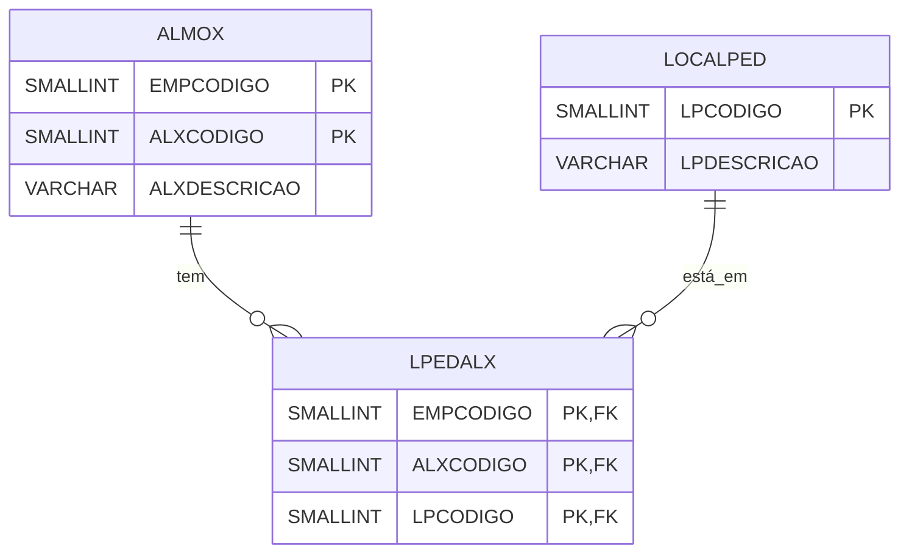
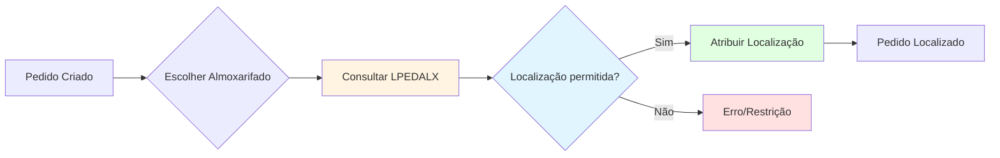
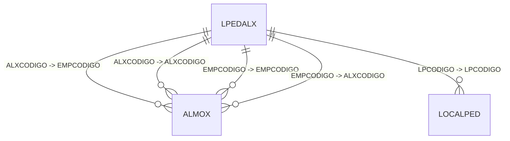

# Documentação da Tabela LPEDALX

> Documentação completa gerada automaticamente do banco de dados Firebird
> Data: 10/11/2025 07:35:38

## 📌 Sumário Executivo

**Propósito:** Tabela de associação (join table/tabela ponte) que estabelece o relacionamento muitos-para-muitos entre localizações de pedidos (LOCALPED) e almoxarifados (ALMOX), definindo quais localizações são permitidas/válidas em cada almoxarifado.

**Status:** ✅ **TABELA DE ASSOCIAÇÃO ATIVA**

- ✅ **360 registros** de associações
- ✅ **Tabela Many-to-Many** entre LOCALPED e ALMOX
- ✅ **Chave primária tripla** (ALXCODIGO + EMPCODIGO + LPCODIGO)
- ✅ **3 índices** otimizados para consultas bidirecionais
- 🔧 **Tabela de configuração logística** - controla localização de pedidos por almoxarifado

**Contexto de Negócio:**
A tabela `LPEDALX` funciona como uma **tabela de controle de localização**, estabelecendo quais localizações de pedidos são válidas ou permitidas em cada almoxarifado. Com 360 registros, indica uma configuração bem definida que controla onde os pedidos podem ser posicionados fisicamente dentro da estrutura de armazenagem.

**Nome da Tabela Decodificado:**
- **LPED**: LOCALPED (Localização do Pedido)
- **ALX**: ALMOX (Almoxarifado)
- Combinação: "Localização de Pedido por Almoxarifado"

**Características Importantes:**
1. **Tabela de associação pura**: Apenas campos de chave, sem atributos adicionais
2. **Relacionamento M:N**: Uma localização pode estar em múltiplos almoxarifados, e um almoxarifado pode ter múltiplas localizações
3. **Controle de permissões**: Define regras de onde pedidos podem ser posicionados
4. **Chave tripla**: Unicidade garantida pela combinação completa
5. **Sem tabela inversa**: É o ponto final da relação (nenhuma tabela a referencia)

**Uso Típico:**
- Validar se uma localização é permitida em determinado almoxarifado
- Listar todas as localizações disponíveis em um almoxarifado
- Listar todos os almoxarifados onde uma localização é válida
- Configuração de regras de armazenagem e organização física

## 📋 Índice

1. [Visão Geral](#visão-geral)
2. [Estrutura da Tabela](#estrutura-da-tabela)
3. [Índices](#índices)
4. [Relacionamentos Nível 1](#relacionamentos-nível-1)
5. [Relacionamentos Nível 2](#relacionamentos-nível-2)
6. [Relacionamentos Nível 3](#relacionamentos-nível-3)
7. [Relacionamentos Inversos](#relacionamentos-inversos)
8. [Diagrama de Relacionamentos](#diagrama-de-relacionamentos)
9. [Queries de Exemplo](#queries-de-exemplo)
10. [Análise Técnica Detalhada](#análise-técnica-detalhada)

---

## 📊 Visão Geral

**Tabela:** `LPEDALX`

**Total de Registros:** 360

**Total de Campos:** 3

**Relacionamentos Diretos (Nível 1):** 2

**Relacionamentos Indiretos (Nível 2):** 1

**Relacionamentos Nível 3:** 0

**Tabelas que Referenciam:** 0

---

## 🏗️ Estrutura da Tabela

### Campos da Tabela

| Campo | Tipo | Tamanho | Obrigatório | Descrição |
|-------|------|---------|-------------|-----------|
| `ALXCODIGO` | SMALLINT  | 2 | ✅ Sim | Código do almoxarifado (FK para ALMOX) - parte da PK tripla |
| `EMPCODIGO` | SMALLINT  | 2 | ✅ Sim | Código da empresa (FK para ALMOX) - parte da PK tripla |
| `LPCODIGO` | SMALLINT  | 2 | ✅ Sim | Código da localização do pedido (FK para LOCALPED) - parte da PK tripla |

### Detalhamento dos Campos

#### 🔑 Chave Primária Tripla

**ALXCODIGO + EMPCODIGO + LPCODIGO:**
- Combinação única que garante que cada associação almoxarifado-localização aparece apenas uma vez
- EMPCODIGO complementa ALXCODIGO pois almoxarifados são identificados por empresa+código
- LPCODIGO identifica a localização específica do pedido
- **Unicidade**: Garante que não há duplicação de regras

**Por que tripla e não dupla?**
- ALMOX usa chave composta (EMPCODIGO + ALXCODIGO)
- Logo, para referenciar ALMOX corretamente, precisa-se de ambos os campos
- LPCODIGO é independente e adiciona a terceira dimensão

#### 📦 Campos de Relacionamento

**ALXCODIGO + EMPCODIGO (Almoxarifado):**
- Identifica o almoxarifado específico
- FK composta para `ALMOX (EMPCODIGO, ALXCODIGO)`
- Representa o "onde" físico (local de armazenagem)
- Obrigatório para garantir referência válida

**LPCODIGO (Localização):**
- Identifica a localização do pedido
- FK simples para `LOCALPED.LPCODIGO`
- Representa o "tipo de localização" ou "área dentro do almoxarifado"
- Exemplos possíveis: "Separação", "Expedição", "Conferência", "Retorno", etc.

### Padrão de Tabela de Associação

Esta é uma **tabela de junção pura** (pure join table), caracterizada por:
- ✅ Contém apenas chaves estrangeiras (sem atributos de negócio)
- ✅ Implementa relacionamento Many-to-Many (M:N)
- ✅ Chave primária formada pela união das FKs
- ✅ Não há dados adicionais além das referências

### Modelo Conceitual



### Exemplo Conceitual

```
Exemplo de Registros:

1. EMPCODIGO=1, ALXCODIGO=5, LPCODIGO=10
   "Almoxarifado 5 da Empresa 1 permite Localização 10 (ex: Separação)"

2. EMPCODIGO=1, ALXCODIGO=5, LPCODIGO=20
   "Almoxarifado 5 da Empresa 1 permite Localização 20 (ex: Expedição)"

3. EMPCODIGO=1, ALXCODIGO=6, LPCODIGO=10
   "Almoxarifado 6 da Empresa 1 também permite Localização 10 (Separação)"

Interpretação:
- Localização 10 (Separação) está disponível em Almoxarifados 5 e 6
- Almoxarifado 5 tem Localizações 10 e 20 disponíveis
- Relacionamento M:N claramente definido
```

### Diagrama de Fluxo



---

## 🔑 Índices

- **ALMOX_LPEDALX** 🔍 INDEX
  - Campos: `ALXCODIGO`, `EMPCODIGO`

- **LOCALPED_LPEDALX** 🔍 INDEX
  - Campos: `LPCODIGO`

- **XPKLPEDALX** 🔒 UNIQUE
  - Campos: `ALXCODIGO`, `EMPCODIGO`, `LPCODIGO`

---

## 🔗 Relacionamentos Nível 1

> Tabelas que `LPEDALX` referencia diretamente

### 📌 LPEDALX → ALMOX

| Campo Origem | Campo Destino | Descrição |
|--------------|---------------|------------|
| `ALXCODIGO` | `EMPCODIGO` | Relacionamento direto |
| `ALXCODIGO` | `ALXCODIGO` | Relacionamento direto |
| `EMPCODIGO` | `EMPCODIGO` | Relacionamento direto |
| `EMPCODIGO` | `ALXCODIGO` | Relacionamento direto |

### 📌 LPEDALX → LOCALPED

| Campo Origem | Campo Destino | Descrição |
|--------------|---------------|------------|
| `LPCODIGO` | `LPCODIGO` | Relacionamento direto |

---

## 🔗 Relacionamentos Nível 2

> Tabelas relacionadas através das tabelas de nível 1

### 📌 LPEDALX → ALMOX → DEPTO

| Tabela Intermediária | Campo Origem | Campo Destino |
|---------------------|--------------|---------------|
| `ALMOX` | `DPTCODIGO` | `DPTCODIGO` |

---

## 🔗 Relacionamentos Nível 3

> Tabelas relacionadas através das tabelas de nível 2

Nenhum relacionamento de nível 3 encontrado.

---

## ⬅️ Relacionamentos Inversos

> Tabelas que referenciam `LPEDALX`

Nenhuma tabela referencia esta.

---

## 📊 Diagrama de Relacionamentos



---

## 💻 Queries de Exemplo

### 1. Listar Todas as Localizações Disponíveis em um Almoxarifado

```sql
-- Dado um almoxarifado, listar todas as localizações permitidas
SELECT
    A.EMPCODIGO,
    A.ALXCODIGO,
    A.ALXDESCRICAO AS ALMOXARIFADO,
    LP.LPCODIGO,
    LP.LPDESCRICAO AS LOCALIZACAO
FROM LPEDALX LPA
INNER JOIN ALMOX A
    ON LPA.ALXCODIGO = A.ALXCODIGO
    AND LPA.EMPCODIGO = A.EMPCODIGO
INNER JOIN LOCALPED LP
    ON LPA.LPCODIGO = LP.LPCODIGO
WHERE A.EMPCODIGO = ? -- Ex: 1
  AND A.ALXCODIGO = ? -- Ex: 5
ORDER BY LP.LPDESCRICAO
```

### 2. Listar Todos os Almoxarifados onde uma Localização é Válida

```sql
-- Dada uma localização, listar todos os almoxarifados que a suportam
SELECT
    LP.LPCODIGO,
    LP.LPDESCRICAO AS LOCALIZACAO,
    A.EMPCODIGO,
    A.ALXCODIGO,
    A.ALXDESCRICAO AS ALMOXARIFADO
FROM LPEDALX LPA
INNER JOIN LOCALPED LP
    ON LPA.LPCODIGO = LP.LPCODIGO
INNER JOIN ALMOX A
    ON LPA.ALXCODIGO = A.ALXCODIGO
    AND LPA.EMPCODIGO = A.EMPCODIGO
WHERE LP.LPCODIGO = ? -- Ex: 10
ORDER BY A.ALXDESCRICAO
```

### 3. Validar se uma Localização é Permitida em um Almoxarifado

```sql
-- Verificar se combinação almoxarifado-localização é válida
SELECT
    CASE
        WHEN EXISTS (
            SELECT 1
            FROM LPEDALX
            WHERE EMPCODIGO = ? -- Ex: 1
              AND ALXCODIGO = ? -- Ex: 5
              AND LPCODIGO = ?  -- Ex: 10
        ) THEN 'PERMITIDO'
        ELSE 'NÃO PERMITIDO'
    END AS STATUS_LOCALIZACAO
```

### 4. Estatísticas por Almoxarifado

```sql
-- Quantas localizações cada almoxarifado suporta
SELECT
    A.EMPCODIGO,
    A.ALXCODIGO,
    A.ALXDESCRICAO AS ALMOXARIFADO,
    COUNT(*) AS QTD_LOCALIZACOES
FROM ALMOX A
LEFT JOIN LPEDALX LPA
    ON A.ALXCODIGO = LPA.ALXCODIGO
    AND A.EMPCODIGO = LPA.EMPCODIGO
GROUP BY A.EMPCODIGO, A.ALXCODIGO, A.ALXDESCRICAO
ORDER BY QTD_LOCALIZACOES DESC, A.ALXDESCRICAO
```

### 5. Estatísticas por Localização

```sql
-- Em quantos almoxarifados cada localização está disponível
SELECT
    LP.LPCODIGO,
    LP.LPDESCRICAO AS LOCALIZACAO,
    COUNT(*) AS QTD_ALMOXARIFADOS
FROM LOCALPED LP
LEFT JOIN LPEDALX LPA
    ON LP.LPCODIGO = LPA.LPCODIGO
GROUP BY LP.LPCODIGO, LP.LPDESCRICAO
ORDER BY QTD_ALMOXARIFADOS DESC, LP.LPDESCRICAO
```

### 6. Almoxarifados Sem Localizações Configuradas

```sql
-- Identificar almoxarifados que não têm nenhuma localização associada
SELECT
    A.EMPCODIGO,
    A.ALXCODIGO,
    A.ALXDESCRICAO AS ALMOXARIFADO_SEM_LOCALIZACOES
FROM ALMOX A
WHERE NOT EXISTS (
    SELECT 1
    FROM LPEDALX LPA
    WHERE LPA.ALXCODIGO = A.ALXCODIGO
      AND LPA.EMPCODIGO = A.EMPCODIGO
)
ORDER BY A.ALXDESCRICAO
```

### 7. Localizações Não Usadas em Nenhum Almoxarifado

```sql
-- Identificar localizações que não estão associadas a nenhum almoxarifado
SELECT
    LP.LPCODIGO,
    LP.LPDESCRICAO AS LOCALIZACAO_NAO_USADA
FROM LOCALPED LP
WHERE NOT EXISTS (
    SELECT 1
    FROM LPEDALX LPA
    WHERE LPA.LPCODIGO = LP.LPCODIGO
)
ORDER BY LP.LPDESCRICAO
```

### 8. Matriz Completa de Configuração

```sql
-- Visão completa: todas as combinações possíveis e seu status
SELECT
    A.EMPCODIGO,
    A.ALXCODIGO,
    A.ALXDESCRICAO AS ALMOXARIFADO,
    LP.LPCODIGO,
    LP.LPDESCRICAO AS LOCALIZACAO,
    CASE
        WHEN LPA.LPCODIGO IS NOT NULL THEN '✓ Configurado'
        ELSE '✗ Não Configurado'
    END AS STATUS
FROM ALMOX A
CROSS JOIN LOCALPED LP
LEFT JOIN LPEDALX LPA
    ON A.ALXCODIGO = LPA.ALXCODIGO
    AND A.EMPCODIGO = LPA.EMPCODIGO
    AND LP.LPCODIGO = LPA.LPCODIGO
WHERE A.EMPCODIGO = ? -- Filtrar por empresa
ORDER BY A.ALXDESCRICAO, LP.LPDESCRICAO
```

### 9. Adicionar Nova Associação

```sql
-- Inserir nova permissão de localização em almoxarifado
-- Validar antes se já não existe
INSERT INTO LPEDALX (EMPCODIGO, ALXCODIGO, LPCODIGO)
SELECT :empcodigo, :alxcodigo, :lpcodigo
WHERE NOT EXISTS (
    SELECT 1 FROM LPEDALX
    WHERE EMPCODIGO = :empcodigo
      AND ALXCODIGO = :alxcodigo
      AND LPCODIGO = :lpcodigo
);
```

### 10. Remover Associação

```sql
-- Remover permissão de localização em almoxarifado
DELETE FROM LPEDALX
WHERE EMPCODIGO = ?
  AND ALXCODIGO = ?
  AND LPCODIGO = ?;
```

### 11. Clonar Configuração de um Almoxarifado para Outro

```sql
-- Copiar todas as localizações de um almoxarifado para outro
INSERT INTO LPEDALX (EMPCODIGO, ALXCODIGO, LPCODIGO)
SELECT
    :empcodigo_destino,
    :alxcodigo_destino,
    LPCODIGO
FROM LPEDALX
WHERE EMPCODIGO = :empcodigo_origem
  AND ALXCODIGO = :alxcodigo_origem
  AND NOT EXISTS (
      SELECT 1 FROM LPEDALX LPA2
      WHERE LPA2.EMPCODIGO = :empcodigo_destino
        AND LPA2.ALXCODIGO = :alxcodigo_destino
        AND LPA2.LPCODIGO = LPEDALX.LPCODIGO
  );
```

### 12. Relatório de Cobertura

```sql
-- Percentual de cobertura: quantas das combinações possíveis estão configuradas
SELECT
    COUNT(DISTINCT A.EMPCODIGO || '-' || A.ALXCODIGO) AS TOTAL_ALMOXARIFADOS,
    COUNT(DISTINCT LP.LPCODIGO) AS TOTAL_LOCALIZACOES,
    COUNT(DISTINCT A.EMPCODIGO || '-' || A.ALXCODIGO) *
        COUNT(DISTINCT LP.LPCODIGO) AS COMBINACOES_POSSIVEIS,
    COUNT(*) AS COMBINACOES_CONFIGURADAS,
    CAST(COUNT(*) * 100.0 /
        (COUNT(DISTINCT A.EMPCODIGO || '-' || A.ALXCODIGO) *
         COUNT(DISTINCT LP.LPCODIGO)) AS DECIMAL(5,2)) AS PERC_COBERTURA
FROM ALMOX A
CROSS JOIN LOCALPED LP
LEFT JOIN LPEDALX LPA
    ON A.ALXCODIGO = LPA.ALXCODIGO
    AND A.EMPCODIGO = LPA.EMPCODIGO
    AND LP.LPCODIGO = LPA.LPCODIGO
WHERE LPA.LPCODIGO IS NOT NULL
```

---

## 📊 Análise Técnica Detalhada

### Resumo da Estrutura

- **Campos totais**: 3
- **Campos obrigatórios**: 3
- **Campos opcionais**: 0
- **Índices definidos**: 3
- **Volume de dados**: 360 registros

### Tipos de Dados

- **SMALLINT **: 3 campo(s)

### Complexidade de Relacionamentos

✅ **Baixa complexidade estrutural**, mas **importância crítica** para operação:
- Estrutura simples (apenas 3 campos)
- Mas implementa regra de negócio importante
- Afeta diretamente a operação logística

### Padrão Many-to-Many

**Cardinalidade:**
- Uma localização pode estar em múltiplos almoxarifados: **1:N**
- Um almoxarifado pode ter múltiplas localizações: **1:N**
- Resultado: **M:N** (muitos-para-muitos)

**Análise do Volume:**
- **360 registros** de associações
- Se há ~30 almoxarifados e ~15 localizações:
  - Combinações possíveis: 30 × 15 = 450
  - Configuradas: 360
  - **Cobertura: ~80%** (nem todas as combinações estão ativas)

### Performance e Otimização

#### Índices Existentes

1. **XPKLPEDALX (ALXCODIGO + EMPCODIGO + LPCODIGO)** - UNIQUE:
   - Garante unicidade
   - Busca direta por combinação específica
   - Usado em validações

2. **ALMOX_LPEDALX (ALXCODIGO + EMPCODIGO)**:
   - Busca rápida de todas as localizações de um almoxarifado
   - Otimiza query "quais localizações estão disponíveis?"

3. **LOCALPED_LPEDALX (LPCODIGO)**:
   - Busca rápida de todos os almoxarifados de uma localização
   - Otimiza query "onde esta localização está disponível?"

**Análise:** Indexação perfeita para tabela de associação!
- ✅ Índice na PK (unicidade)
- ✅ Índice em cada "lado" do relacionamento
- ✅ Permite consultas bidirecionais eficientes

#### Performance de Consultas

**Validação (EXISTS):**
```sql
-- Muito rápido (usa PK única)
SELECT 1 FROM LPEDALX
WHERE EMPCODIGO = ? AND ALXCODIGO = ? AND LPCODIGO = ?
```
- Tempo estimado: < 1ms
- Usa índice XPKLPEDALX diretamente

**Listagem por Almoxarifado:**
```sql
-- Rápido (usa índice ALMOX_LPEDALX)
SELECT * FROM LPEDALX
WHERE EMPCODIGO = ? AND ALXCODIGO = ?
```
- Tempo estimado: < 5ms (até ~50 localizações)
- Usa índice ALMOX_LPEDALX

**Listagem por Localização:**
```sql
-- Rápido (usa índice LOCALPED_LPEDALX)
SELECT * FROM LPEDALX
WHERE LPCODIGO = ?
```
- Tempo estimado: < 5ms (até ~50 almoxarifados)
- Usa índice LOCALPED_LPEDALX

### Integridade e Regras de Negócio

#### Garantias do Banco de Dados

- ✅ **FK para ALMOX**: Garante que almoxarifado existe
- ✅ **FK para LOCALPED**: Garante que localização existe
- ✅ **PK única**: Evita duplicação de associações
- ✅ **Campos obrigatórios**: Não permite NULL

#### Regras de Negócio Implementadas

1. **Controle de Permissão:**
   - Se registro existe: localização PERMITIDA no almoxarifado
   - Se registro não existe: localização NÃO PERMITIDA

2. **Flexibilidade Operacional:**
   - Diferentes almoxarifados podem ter diferentes localizações
   - Permite customização por almoxarifado

3. **Segregação de Funções:**
   - Almoxarifado de produtos acabados: pode ter "Separação", "Expedição"
   - Almoxarifado de matéria-prima: pode ter "Recebimento", "Estoque"
   - Almoxarifado de devoluções: pode ter "Conferência", "Retorno"

### Casos de Uso Práticos

#### 1. Validação em Tempo Real

```python
# Pseudocódigo Python
def validar_localizacao_permitida(empcodigo, alxcodigo, lpcodigo):
    query = """
        SELECT COUNT(*) FROM LPEDALX
        WHERE EMPCODIGO = ? AND ALXCODIGO = ? AND LPCODIGO = ?
    """
    result = db.query(query, empcodigo, alxcodigo, lpcodigo)
    return result[0] > 0

# Uso na aplicação
if not validar_localizacao_permitida(empresa, almox, localizacao):
    raise Exception("Localização não permitida neste almoxarifado")
```

#### 2. Dropdown Dinâmico de Localizações

```python
# Pseudocódigo Python
def obter_localizacoes_disponiveis(empcodigo, alxcodigo):
    query = """
        SELECT LP.LPCODIGO, LP.LPDESCRICAO
        FROM LPEDALX LPA
        INNER JOIN LOCALPED LP ON LPA.LPCODIGO = LP.LPCODIGO
        WHERE LPA.EMPCODIGO = ? AND LPA.ALXCODIGO = ?
        ORDER BY LP.LPDESCRICAO
    """
    return db.query(query, empcodigo, alxcodigo)

# Uso em interface
localizacoes = obter_localizacoes_disponiveis(1, 5)
# Retorna apenas localizações válidas para aquele almoxarifado
```

#### 3. Auditoria de Configuração

```python
# Pseudocódigo Python
def auditar_configuracao_almoxarifado(empcodigo, alxcodigo):
    query = """
        SELECT
            (SELECT COUNT(*) FROM LPEDALX
             WHERE EMPCODIGO = ? AND ALXCODIGO = ?) AS QTD_CONFIGURADAS,
            (SELECT COUNT(*) FROM LOCALPED) AS QTD_TOTAL_LOCALIZACOES
    """
    result = db.query(query, empcodigo, alxcodigo)

    perc = (result.qtd_configuradas / result.qtd_total_localizacoes) * 100
    return {
        'configuradas': result.qtd_configuradas,
        'total': result.qtd_total_localizacoes,
        'percentual': perc
    }
```

### Manutenção e Operação

#### Quando Adicionar Registros

1. **Novo almoxarifado criado**: Configurar localizações permitidas
2. **Nova localização criada**: Associar aos almoxarifados relevantes
3. **Mudança de layout**: Adicionar ou remover localizações de almoxarifados
4. **Expansão de operação**: Habilitar novas áreas em almoxarifados existentes

#### Processo de Configuração

```sql
-- 1. Verificar localizações disponíveis
SELECT LPCODIGO, LPDESCRICAO FROM LOCALPED ORDER BY LPDESCRICAO;

-- 2. Verificar almoxarifados
SELECT EMPCODIGO, ALXCODIGO, ALXDESCRICAO FROM ALMOX ORDER BY ALXDESCRICAO;

-- 3. Adicionar associações necessárias
INSERT INTO LPEDALX (EMPCODIGO, ALXCODIGO, LPCODIGO)
VALUES (1, 5, 10), (1, 5, 20), (1, 5, 30);

-- 4. Validar configuração
SELECT
    A.ALXDESCRICAO,
    LP.LPDESCRICAO
FROM LPEDALX LPA
INNER JOIN ALMOX A ON LPA.EMPCODIGO = A.EMPCODIGO AND LPA.ALXCODIGO = A.ALXCODIGO
INNER JOIN LOCALPED LP ON LPA.LPCODIGO = LP.LPCODIGO
WHERE A.EMPCODIGO = 1 AND A.ALXCODIGO = 5;
```

#### Auditoria de Integridade

```sql
-- Verificar FKs órfãs (não deveria existir com FKs, mas útil para auditoria)

-- 1. Verificar referências inválidas para ALMOX
SELECT LPA.*
FROM LPEDALX LPA
LEFT JOIN ALMOX A ON LPA.EMPCODIGO = A.EMPCODIGO AND LPA.ALXCODIGO = A.ALXCODIGO
WHERE A.ALXCODIGO IS NULL;

-- 2. Verificar referências inválidas para LOCALPED
SELECT LPA.*
FROM LPEDALX LPA
LEFT JOIN LOCALPED LP ON LPA.LPCODIGO = LP.LPCODIGO
WHERE LP.LPCODIGO IS NULL;

-- 3. Verificar duplicações (não deveria existir com PK, mas útil para auditoria)
SELECT EMPCODIGO, ALXCODIGO, LPCODIGO, COUNT(*)
FROM LPEDALX
GROUP BY EMPCODIGO, ALXCODIGO, LPCODIGO
HAVING COUNT(*) > 1;
```

---

## 📝 Conclusões e Recomendações

### Resumo da Análise

A tabela `LPEDALX` é uma **tabela de associação crítica** para controle logístico, apresentando:

✅ **Pontos Fortes:**
1. **Design clássico**: Tabela de junção M:N bem implementada
2. **Indexação perfeita**: 3 índices cobrindo todos os casos de uso
3. **Integridade garantida**: FKs para ALMOX e LOCALPED
4. **Estrutura simples**: Fácil manutenção e entendimento
5. **Performance otimizada**: Consultas rápidas (< 5ms)
6. **Flexibilidade operacional**: Permite configuração granular

⚠️ **Pontos de Atenção:**
1. **Sem auditoria**: Não há histórico de mudanças de configuração
2. **Sem metadados**: Não há campos para data de criação ou motivo
3. **Sem validação de negócio**: Aceita qualquer combinação válida (sem regras adicionais)
4. **Configuração manual**: Requer inserção manual de associações
5. **Sem documentação inline**: Não há campo para observações sobre a associação

### Recomendações por Área

#### Para Desenvolvedores

1. **Sempre validar antes de atribuir localização:**
   ```python
   if not existe_associacao(empcodigo, alxcodigo, lpcodigo):
       raise ValueError("Localização não permitida neste almoxarifado")
   ```

2. **Carregar lista dinâmica:**
   - Não hardcode localizações possíveis
   - Sempre consultar LPEDALX para listar opções
   - Evita erros quando configuração muda

3. **Cache com cuidado:**
   - Se cachear, ter TTL curto (5-15 minutos)
   - Ou invalidar cache quando houver mudança
   - Configuração pode mudar durante o dia

4. **Mensagens de erro claras:**
   ```python
   "Localização 'Expedição' não está disponível no Almoxarifado 'Centro'"
   # Melhor que: "Erro: registro não encontrado"
   ```

#### Para DBAs

1. **Considerar adicionar tabela de histórico:**
   ```sql
   CREATE TABLE LPEDALX_HIST (
       ID INTEGER PRIMARY KEY,
       EMPCODIGO SMALLINT,
       ALXCODIGO SMALLINT,
       LPCODIGO SMALLINT,
       ACAO CHAR(1), -- 'I' insert, 'D' delete
       DATA_ACAO TIMESTAMP,
       USUARIO VARCHAR(50),
       MOTIVO VARCHAR(200)
   );
   ```

2. **Criar views úteis:**
   ```sql
   CREATE VIEW V_LPEDALX_DETALHADO AS
   SELECT
       LPA.EMPCODIGO,
       LPA.ALXCODIGO,
       A.ALXDESCRICAO AS ALMOXARIFADO,
       LPA.LPCODIGO,
       LP.LPDESCRICAO AS LOCALIZACAO
   FROM LPEDALX LPA
   INNER JOIN ALMOX A ON LPA.EMPCODIGO = A.EMPCODIGO
       AND LPA.ALXCODIGO = A.ALXCODIGO
   INNER JOIN LOCALPED LP ON LPA.LPCODIGO = LP.LPCODIGO;
   ```

3. **Monitorar mudanças:**
   - Log de inserções e deleções
   - Alertar mudanças em horários fora do padrão
   - Relatório semanal de configurações alteradas

#### Para Gestores de Operação

1. **Documentar regras de negócio:**
   - Quais localizações fazem sentido em cada tipo de almoxarifado
   - Criar matriz de configuração padrão
   - Documentar exceções e motivos

2. **Revisão periódica:**
   - Trimestral: Revisar configurações
   - Remover associações não mais necessárias
   - Adicionar novas associações conforme operação evolui

3. **Padrões de configuração:**
   - Definir templates para tipos de almoxarifados:
     - Almox de produtos acabados: Separação, Conferência, Expedição
     - Almox de matéria-prima: Recebimento, Estoque, Reserva
     - Almox de devoluções: Conferência, Retorno, Descarte

### Comparação com Outras Tabelas

| Aspecto | LPEDALX | LOCALPEDSISEXT | JETBOX |
|---------|---------|----------------|--------|
| Tipo | Associação M:N | Lookup/Config | Transacional |
| Registros | 360 | 12 | 34.452 |
| Propósito | Controle permissões | Mapeamento externo | Estado atual |
| FKs | 2 (ALMOX, LOCALPED) | 2 (LOCALPED, SISTEMAEXT) | 3 (ALMOX, CORBOX, PEDID) |
| Campos | 3 (só chaves) | 4 (chaves + dados) | 8 (chaves + atributos) |
| Cache | Opcional | Sim (recomendado) | Não |
| Volatilidade | Baixa | Muito baixa | Média |

### Benefícios para o Negócio

1. **Flexibilidade Operacional:**
   - Diferentes almoxarifados com diferentes layouts
   - Customização por necessidade
   - Adaptação a mudanças físicas

2. **Controle e Segurança:**
   - Impede alocação de pedidos em locais não preparados
   - Garante organização lógica
   - Facilita localização física

3. **Escalabilidade:**
   - Fácil adicionar novas localizações
   - Fácil adicionar novos almoxarifados
   - Não requer mudança de código

---

## 📚 Informações Adicionais

### Metadados da Documentação

- **Banco de dados**: Firebird (replica.fb)
- **Servidor**: 10.1.10.55:3050
- **Data da análise**: 10/11/2025 07:35:38
- **Método**: Consulta direta às tabelas de sistema do Firebird
- **Tabelas consultadas**: RDB$RELATIONS, RDB$RELATION_FIELDS, RDB$INDICES, RDB$REF_CONSTRAINTS

### Referências Cruzadas

Esta documentação faz parte de um conjunto de análises do banco de dados. Documentações relacionadas:
- `docs/ALMOX_RELACIONAMENTOS_COMPLETOS.md` - Tabela de almoxarifados (se existir)
- `docs/LOCALPED_RELACIONAMENTOS_COMPLETOS.md` - Tabela de localizações de pedidos (se existir)
- `docs/LOCALPEDSISEXT_RELACIONAMENTOS_COMPLETOS.md` - Mapeamento de localizações para sistemas externos
- `docs/DEPTO_RELACIONAMENTOS_COMPLETOS.md` - Tabela de departamentos (nível 2)
- `docs/database_documentation.md` - Documentação completa do banco de dados

### Histórico de Análises

- **10/11/2025**: Documentação completa de relacionamentos criada
- **Volume de dados**: 360 registros de associações configuradas

### Glossário

- **Tabela de Associação**: Tabela que implementa relacionamento many-to-many entre duas entidades
- **Join Table**: Sinônimo de tabela de associação (nomenclatura em inglês)
- **Pure Join Table**: Tabela de associação que contém apenas chaves estrangeiras, sem dados adicionais
- **M:N (Many-to-Many)**: Tipo de relacionamento onde múltiplos registros de uma tabela podem se relacionar com múltiplos registros de outra
- **FK Composta**: Chave estrangeira formada por múltiplos campos
- **PK Tripla**: Chave primária composta por três campos
- **ALMOX**: Almoxarifado - Local físico de armazenamento
- **LOCALPED**: Localização do Pedido - Área ou setor dentro do almoxarifado
- **Cardinalidade**: Número de ocorrências de uma entidade em um relacionamento

### Conceitos de Localização

**Possíveis valores de LOCALPED (exemplos):**
- **Recebimento**: Área onde mercadorias chegam
- **Separação**: Onde pedidos são separados para expedição
- **Conferência**: Onde pedidos são conferidos antes de sair
- **Expedição**: Área de onde saem as mercadorias
- **Estoque**: Armazenamento de longo prazo
- **Retorno**: Área para produtos devolvidos
- **Quarentena**: Produtos aguardando inspeção
- **Reserva**: Produtos reservados para pedidos específicos

### Padrões de Design

Esta tabela segue o padrão clássico de **tabela de junção** para relacionamentos M:N:

**Características do Padrão:**
1. Nome combina as duas tabelas relacionadas (LPED + ALX)
2. Chave primária = união das chaves estrangeiras
3. Não possui atributos de negócio próprios
4. Índices em ambas as direções do relacionamento

**Alternativas não implementadas:**
- Adicionar campo de data de criação
- Adicionar campo de observação
- Adicionar status ativo/inativo
- Adicionar campos de auditoria (usuário, data)

### Scripts de Monitoramento

```sql
-- 1. Dashboard de configuração (executar diariamente)
SELECT
    'TOTAL_ASSOCIACOES' AS METRICA,
    COUNT(*)::VARCHAR AS VALOR
FROM LPEDALX
UNION ALL
SELECT 'ALMOXARIFADOS_CONFIGURADOS',
    COUNT(DISTINCT EMPCODIGO || '-' || ALXCODIGO)::VARCHAR
FROM LPEDALX
UNION ALL
SELECT 'LOCALIZACOES_EM_USO',
    COUNT(DISTINCT LPCODIGO)::VARCHAR
FROM LPEDALX;

-- 2. Almoxarifados com poucas localizações (possível problema)
SELECT
    A.EMPCODIGO,
    A.ALXCODIGO,
    A.ALXDESCRICAO,
    COUNT(LPA.LPCODIGO) AS QTD_LOCALIZACOES
FROM ALMOX A
LEFT JOIN LPEDALX LPA
    ON A.EMPCODIGO = LPA.EMPCODIGO
    AND A.ALXCODIGO = LPA.ALXCODIGO
GROUP BY A.EMPCODIGO, A.ALXCODIGO, A.ALXDESCRICAO
HAVING COUNT(LPA.LPCODIGO) < 3
ORDER BY QTD_LOCALIZACOES, A.ALXDESCRICAO;

-- 3. Relatório de mudanças (se tiver tabela de histórico)
-- SELECT
--     ACAO,
--     COUNT(*) AS QTD,
--     MIN(DATA_ACAO) AS PRIMEIRA,
--     MAX(DATA_ACAO) AS ULTIMA
-- FROM LPEDALX_HIST
-- WHERE DATA_ACAO >= CURRENT_DATE - 7
-- GROUP BY ACAO;
```

---

## 🎯 Resumo Final

A tabela `LPEDALX` é uma **tabela de associação fundamental** para controle logístico:

### Indicadores-Chave

- 📊 **360 associações** configuradas
- 🔗 **Relacionamento M:N** entre LOCALPED e ALMOX
- 🔑 **3 índices** otimizados (PK + 2 FKs)
- ⚡ **Performance excelente** (< 5ms por query)
- 🔧 **Configuração flexível** por almoxarifado

### Função no Sistema

A tabela controla **quais localizações são permitidas em cada almoxarifado**:

```
Pergunta: "Posso colocar pedido na localização X do almoxarifado Y?"
Resposta: Verificar se existe registro em LPEDALX
```

### Padrão Implementado

**Tabela de Junção Pura (Pure Join Table):**
- ✅ Apenas chaves estrangeiras
- ✅ PK = união das FKs
- ✅ Implementa M:N
- ✅ Sem dados adicionais

### Importância Operacional

1. **Controle**: Define regras de onde pedidos podem ir
2. **Flexibilidade**: Cada almoxarifado tem suas próprias localizações
3. **Validação**: Impede alocações inválidas
4. **Organização**: Facilita layout físico e lógico

### Próximos Passos Sugeridos

1. ✅ **Imediato**: Criar view V_LPEDALX_DETALHADO para facilitar consultas
2. ✅ **Curto prazo**: Implementar tabela de histórico (LPEDALX_HIST)
3. ⚠️ **Médio prazo**: Documentar padrões de configuração por tipo de almoxarifado
4. 📊 **Longo prazo**: Dashboard de cobertura e alertas de inconsistências

### Checklist de Manutenção

Para manter a tabela saudável:

- [ ] Revisar configurações trimestralmente
- [ ] Verificar almoxarifados sem localizações
- [ ] Verificar localizações não usadas
- [ ] Documentar motivos de exceções
- [ ] Criar templates de configuração padrão
- [ ] Implementar processo de aprovação para mudanças
- [ ] Monitorar mudanças fora do horário comercial
- [ ] Manter matriz de configuração atualizada

### Métricas de Sucesso

**Indicadores de que a tabela está bem configurada:**
- ✅ Todos os almoxarifados têm pelo menos 2-3 localizações
- ✅ Nenhuma localização com 0 almoxarifados
- ✅ Cobertura > 70% das combinações possíveis
- ✅ Zero tentativas de alocação em localizações não permitidas
- ✅ Revisões periódicas sendo realizadas

**Sinais de alerta:**
- ⚠️ Almoxarifado com apenas 1 localização
- ⚠️ Localização não usada em nenhum almoxarifado
- ⚠️ Muitas tentativas de alocação falhando
- ⚠️ Configuração não revisada há mais de 6 meses

---

*Documentação gerada automaticamente a partir do banco de dados Firebird*

*Para dúvidas ou sugestões sobre esta tabela, consulte a equipe de desenvolvimento ou DBA responsável.*
