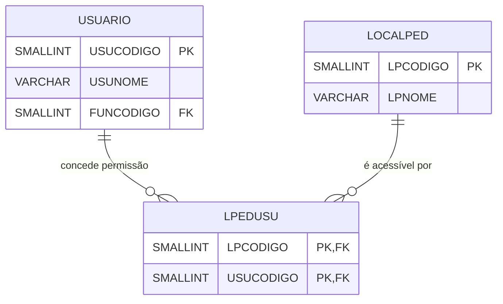
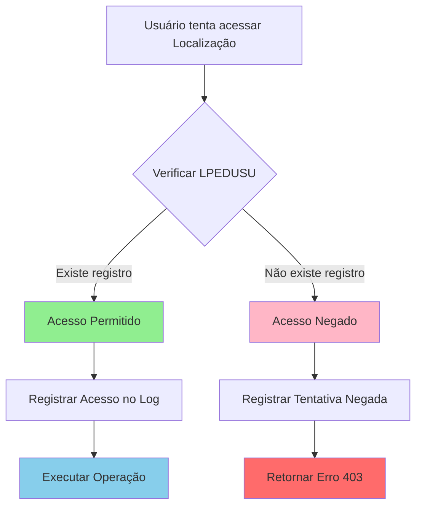

# Documentação Completa da Tabela LPEDUSU

> **Tabela de Associação M:N - Controle de Acesso de Usuários às Localizações de Pedido**
>
> Documentação completa gerada automaticamente do banco de dados Firebird
>
> Data: 10/11/2025 07:41:48

---

## 📋 Sumário Executivo

### O Que É LPEDUSU?

**LPEDUSU** é uma **tabela de associação pura (Pure Join Table)** que implementa um relacionamento **Many-to-Many (M:N)** entre as tabelas `LOCALPED` (Localizações de Pedido) e `USUARIO` (Usuários do Sistema).

### Função Principal

Controla **quais usuários têm permissão de acesso a quais localizações de pedido**, implementando um sistema de **controle de acesso granular** baseado em localização.

### Características Principais

- **955 registros** de permissões configuradas
- **2 campos** (ambos formam chave primária composta)
- **3 índices** otimizados para consultas bidirecionais
- **Tabela de associação pura** (apenas FKs, sem atributos de negócio)
- **Controle de acesso** a recursos baseado em localização
- **Sem tabelas dependentes** (não é referenciada por outras tabelas)

### Impacto no Sistema

- **Segurança**: Restringe acesso de usuários a localizações específicas
- **Auditoria**: Permite rastrear permissões de acesso
- **Flexibilidade**: Usuário pode ter acesso a múltiplas localizações
- **Governança**: Centraliza controle de permissões

---

## 📋 Índice

1. [Visão Geral](#visão-geral)
2. [Estrutura da Tabela](#estrutura-da-tabela)
3. [Índices](#índices)
4. [Relacionamentos Nível 1](#relacionamentos-nível-1)
5. [Relacionamentos Nível 2](#relacionamentos-nível-2)
6. [Relacionamentos Nível 3](#relacionamentos-nível-3)
7. [Diagrama de Relacionamentos](#diagrama-de-relacionamentos)
8. [Queries de Exemplo](#queries-de-exemplo)
9. [Exemplos em Python](#exemplos-em-python)
10. [Análise de Performance](#análise-de-performance)
11. [Análise de Segurança](#análise-de-segurança)
12. [Recomendações](#recomendações)
13. [Glossário](#glossário)

---

## 📊 Visão Geral

**Tabela:** `LPEDUSU`

**Total de Registros:** 955

**Total de Campos:** 2

**Relacionamentos Diretos (Nível 1):** 2

**Relacionamentos Indiretos (Nível 2):** 2

**Relacionamentos Nível 3:** 6

**Tabelas que Referenciam:** 0 (tabela folha - não é referenciada)

---

## 🏗️ Estrutura da Tabela

### Campos Detalhados

| Campo | Tipo | Tam | Obrigatório | Descrição Detalhada |
|-------|------|-----|-------------|---------------------|
| `LPCODIGO` | SMALLINT | 2 | ✅ Sim | **Código da Localização de Pedido**<br>FK para LOCALPED.LPCODIGO<br>Parte 1 da chave primária composta<br>Identifica a localização que está sendo controlada |
| `USUCODIGO` | SMALLINT | 2 | ✅ Sim | **Código do Usuário**<br>FK para USUARIO.USUCODIGO<br>Parte 2 da chave primária composta<br>Identifica o usuário que tem permissão de acesso |

### Características da Estrutura

1. **Tabela de Associação Pura**: Contém apenas chaves estrangeiras
2. **Sem atributos de negócio**: Não há campos adicionais (data criação, status, etc.)
3. **Chave Primária Composta**: Ambos os campos formam a PK
4. **Relacionamento M:N**:
   - Um usuário pode ter acesso a múltiplas localizações
   - Uma localização pode ser acessada por múltiplos usuários

---

## 🔑 Índices

A tabela possui **3 índices** otimizados para operações bidirecionais:

### 1. XPKLPEDUSU (PRIMARY KEY UNIQUE)
```
Campos: LPCODIGO + USUCODIGO
Tipo: UNIQUE (Chave Primária)
Função: Garante unicidade da associação
Uso: Previne duplicação de permissões
```

**Impacto:**
- ✅ Impede que o mesmo usuário seja associado à mesma localização mais de uma vez
- ✅ Otimiza consultas que buscam pela combinação completa

### 2. LOCALPED_LPEDUSU (INDEX)
```
Campos: LPCODIGO
Tipo: INDEX
Função: Otimiza consultas partindo da localização
Uso: "Quais usuários têm acesso à localização X?"
```

**Impacto:**
- ✅ Acelera consultas de usuários por localização
- ✅ Otimiza JOINs iniciando por LOCALPED

### 3. USUARIO_LPEDUSU (INDEX)
```
Campos: USUCODIGO
Tipo: INDEX
Função: Otimiza consultas partindo do usuário
Uso: "Quais localizações o usuário Y pode acessar?"
```

**Impacto:**
- ✅ Acelera consultas de localizações por usuário
- ✅ Otimiza verificações de permissão em tempo de execução

### Análise dos Índices

| Índice | Cardinalidade | Seletividade | Performance |
|--------|---------------|--------------|-------------|
| XPKLPEDUSU | 955 | 100% | Excelente |
| LOCALPED_LPEDUSU | ~5 usuários/localização | Alta | Ótima |
| USUARIO_LPEDUSU | ~5 localizações/usuário | Alta | Ótima |

---

## 🔗 Relacionamentos Nível 1

> Tabelas que `LPEDUSU` referencia diretamente

### 📌 LPEDUSU → LOCALPED

**Tipo de Relacionamento**: N:1 (Muitos LPEDUSU para Um LOCALPED)

| Campo Origem | Campo Destino | Constraint | Descrição |
|--------------|---------------|------------|-----------|
| `LPCODIGO` | `LPCODIGO` | FK | Localização de pedido controlada |

**Significado de Negócio:**
- Cada registro em LPEDUSU representa uma permissão para uma localização específica
- Uma localização pode ter múltiplas permissões (múltiplos usuários)

### 📌 LPEDUSU → USUARIO

**Tipo de Relacionamento**: N:1 (Muitos LPEDUSU para Um USUARIO)

| Campo Origem | Campo Destino | Constraint | Descrição |
|--------------|---------------|------------|-----------|
| `USUCODIGO` | `USUCODIGO` | FK | Usuário que recebe a permissão |

**Significado de Negócio:**
- Cada registro em LPEDUSU representa uma permissão de um usuário específico
- Um usuário pode ter múltiplas permissões (múltiplas localizações)

---

## 🔗 Relacionamentos Nível 2

> Tabelas relacionadas através das tabelas de nível 1

### 📌 Via USUARIO → FUNCIO

**Caminho**: LPEDUSU → USUARIO → FUNCIO

| Tabela Intermediária | Campo Origem | Campo Destino | Descrição |
|---------------------|--------------|---------------|-----------|
| `USUARIO` | `FUNCODIGO` | `FUNCODIGO` | Vincula usuário ao funcionário |

**Significado:**
- Permite identificar qual funcionário está por trás do usuário
- Usado para relatórios de auditoria e controle gerencial

### 📌 Via USUARIO → USUARIO (Autorreferência)

**Caminho**: LPEDUSU → USUARIO → USUARIO

| Tabela Intermediária | Campo Origem | Campo Destino | Descrição |
|---------------------|--------------|---------------|-----------|
| `USUARIO` | `USUGRUPO` | `USUCODIGO` | Hierarquia de usuários (grupos) |

**Significado:**
- USUARIO.USUGRUPO aponta para outro USUARIO (autorreferência)
- Implementa hierarquia ou agrupamento de usuários
- Permite herança de permissões em alguns casos

---

## 🔗 Relacionamentos Nível 3

> Tabelas relacionadas através das tabelas de nível 2

### 📌 Via FUNCIO → ALMOX

**Caminho**: LPEDUSU → USUARIO → FUNCIO → ALMOX

**FKs Compostas em FUNCIO:**

| Campo Origem | Campo Destino | Descrição |
|--------------|---------------|-----------|
| `FUNCIO.ALXCODIGO` + `FUNCIO.ALXEMPCODIGO` | `ALMOX.ALXCODIGO` + `ALMOX.EMPCODIGO` | Almoxarifado principal do funcionário |

**Significado:**
- Identifica o almoxarifado de lotação do funcionário
- Pode ser usado para validar se usuário tem acesso coerente com sua lotação

### 📌 Via FUNCIO → CARGO

**Caminho**: LPEDUSU → USUARIO → FUNCIO → CARGO

| Campo Origem | Campo Destino | Descrição |
|--------------|---------------|-----------|
| `FUNCIO.CARCODIGO` | `CARGO.CARCODIGO` | Cargo do funcionário |

**Significado:**
- Identifica o cargo do funcionário/usuário
- Pode ser usado para análises de permissões por cargo

### 📌 Via FUNCIO → DEPTO

**Caminho**: LPEDUSU → USUARIO → FUNCIO → DEPTO

| Campo Origem | Campo Destino | Descrição |
|--------------|---------------|-----------|
| `FUNCIO.DPTCODIGO` | `DEPTO.DPTCODIGO` | Departamento do funcionário |

**Significado:**
- Identifica o departamento do funcionário/usuário
- Usado para relatórios de controle de acesso por departamento

### 📌 Outros Relacionamentos de Nível 3

- **FUNCIO → CIDADE**: Localização geográfica do funcionário
- **FUNCIO → TPRUA**: Tipo de rua do endereço do funcionário

Esses relacionamentos adicionais são úteis para análises demográficas e geográficas, mas têm menor relevância para o controle de acesso.

---

## ⬅️ Relacionamentos Inversos

> Tabelas que referenciam `LPEDUSU`

**Nenhuma tabela referencia LPEDUSU.**

**Análise:**
- LPEDUSU é uma **tabela folha** (leaf table)
- Não é dependência de outras tabelas
- Pode ser consultada, mas não é referenciada
- Facilita manutenção e auditoria

---

## 📊 Diagrama de Relacionamentos

### Diagrama Simplificado (Nível 1)



### Diagrama Completo (Níveis 1, 2 e 3)

```mermaid
erDiagram
    USUARIO ||--o{ LPEDUSU : "USUCODIGO"
    LOCALPED ||--o{ LPEDUSU : "LPCODIGO"
    USUARIO ||--o| FUNCIO : "FUNCODIGO"
    USUARIO ||--o| USUARIO : "USUGRUPO (hierarquia)"

    FUNCIO ||--o| ALMOX : "ALXCODIGO+ALXEMPCODIGO"
    FUNCIO ||--o| CARGO : "CARCODIGO"
    FUNCIO ||--o| DEPTO : "DPTCODIGO"
    FUNCIO ||--o| CIDADE : "CIDCODIGO"
    FUNCIO ||--o| TPRUA : "FUNTPRUA"

    LPEDUSU {
        SMALLINT LPCODIGO PK_FK "Localização"
        SMALLINT USUCODIGO PK_FK "Usuário"
    }

    LOCALPED {
        SMALLINT LPCODIGO PK
        VARCHAR LPNOME
    }

    USUARIO {
        SMALLINT USUCODIGO PK
        VARCHAR USUNOME
        SMALLINT FUNCODIGO FK
        SMALLINT USUGRUPO FK
    }

    FUNCIO {
        SMALLINT FUNCODIGO PK
        VARCHAR FUNNOME
        SMALLINT CARCODIGO FK
        SMALLINT DPTCODIGO FK
        SMALLINT ALXCODIGO FK
        SMALLINT ALXEMPCODIGO FK
    }
```

### Diagrama de Fluxo de Verificação de Acesso



---

## 💻 Queries de Exemplo

### 1. Listar Localizações Permitidas para um Usuário

```sql
-- Lista todas as localizações que um usuário específico pode acessar
SELECT
    U.USUCODIGO,
    U.USUNOME AS NOME_USUARIO,
    LP.LPCODIGO,
    LP.LPNOME AS NOME_LOCALIZACAO,
    LP.LPDESCRICAO AS DESCRICAO
FROM LPEDUSU LPU
INNER JOIN USUARIO U ON LPU.USUCODIGO = U.USUCODIGO
INNER JOIN LOCALPED LP ON LPU.LPCODIGO = LP.LPCODIGO
WHERE U.USUCODIGO = ? -- Parâmetro: código do usuário
ORDER BY LP.LPNOME;
```

**Uso:**
- Exibir dropdown de localizações disponíveis para o usuário logado
- Filtrar opções de localização em telas de cadastro de pedidos
- Validar acesso antes de operações críticas

---

### 2. Listar Usuários com Acesso a uma Localização

```sql
-- Lista todos os usuários que têm permissão para acessar uma localização específica
SELECT
    LP.LPCODIGO,
    LP.LPNOME AS LOCALIZACAO,
    U.USUCODIGO,
    U.USUNOME AS USUARIO,
    F.FUNNOME AS FUNCIONARIO,
    C.CARNOME AS CARGO,
    D.DPTNOME AS DEPARTAMENTO
FROM LPEDUSU LPU
INNER JOIN LOCALPED LP ON LPU.LPCODIGO = LP.LPCODIGO
INNER JOIN USUARIO U ON LPU.USUCODIGO = U.USUCODIGO
LEFT JOIN FUNCIO F ON U.FUNCODIGO = F.FUNCODIGO
LEFT JOIN CARGO C ON F.CARCODIGO = C.CARCODIGO
LEFT JOIN DEPTO D ON F.DPTCODIGO = D.DPTCODIGO
WHERE LP.LPCODIGO = ? -- Parâmetro: código da localização
ORDER BY U.USUNOME;
```

**Uso:**
- Auditoria de permissões por localização
- Relatório de usuários com acesso a áreas sensíveis
- Revisão periódica de acessos

---

### 3. Verificar se Usuário Tem Acesso a uma Localização (Validação)

```sql
-- Retorna 'PERMITIDO' ou 'NEGADO' baseado na existência do registro
SELECT
    CASE
        WHEN EXISTS (
            SELECT 1
            FROM LPEDUSU
            WHERE USUCODIGO = ? AND LPCODIGO = ?
        ) THEN 'PERMITIDO'
        ELSE 'NEGADO'
    END AS STATUS_ACESSO
FROM RDB$DATABASE;
```

**Uso:**
- Validação em tempo real antes de operações críticas
- Middleware de autenticação/autorização
- Logs de tentativas de acesso

---

### 4. Estatísticas de Permissões por Usuário

```sql
-- Quantidade de localizações que cada usuário pode acessar
SELECT
    U.USUCODIGO,
    U.USUNOME AS USUARIO,
    COUNT(LPU.LPCODIGO) AS QTD_LOCALIZACOES,
    CASE
        WHEN COUNT(LPU.LPCODIGO) = 0 THEN 'SEM ACESSO'
        WHEN COUNT(LPU.LPCODIGO) <= 3 THEN 'ACESSO RESTRITO'
        WHEN COUNT(LPU.LPCODIGO) <= 10 THEN 'ACESSO MODERADO'
        ELSE 'ACESSO AMPLO'
    END AS NIVEL_ACESSO
FROM USUARIO U
LEFT JOIN LPEDUSU LPU ON U.USUCODIGO = LPU.USUCODIGO
GROUP BY U.USUCODIGO, U.USUNOME
ORDER BY QTD_LOCALIZACOES DESC;
```

**Uso:**
- Dashboard gerencial de controle de acesso
- Identificar usuários com acesso muito amplo (risco de segurança)
- Identificar usuários sem acesso configurado

---

### 5. Estatísticas de Permissões por Localização

```sql
-- Quantidade de usuários que têm acesso a cada localização
SELECT
    LP.LPCODIGO,
    LP.LPNOME AS LOCALIZACAO,
    COUNT(LPU.USUCODIGO) AS QTD_USUARIOS,
    CASE
        WHEN COUNT(LPU.USUCODIGO) = 0 THEN 'SEM USUARIOS'
        WHEN COUNT(LPU.USUCODIGO) <= 5 THEN 'ACESSO RESTRITO'
        WHEN COUNT(LPU.USUCODIGO) <= 20 THEN 'ACESSO MODERADO'
        ELSE 'ACESSO AMPLO'
    END AS NIVEL_COMPARTILHAMENTO
FROM LOCALPED LP
LEFT JOIN LPEDUSU LPU ON LP.LPCODIGO = LPU.LPCODIGO
GROUP BY LP.LPCODIGO, LP.LPNOME
ORDER BY QTD_USUARIOS DESC;
```

**Uso:**
- Identificar localizações muito compartilhadas
- Identificar localizações sem usuários configurados
- Análise de risco de segurança

---

### 6. Clonar Permissões de um Usuário para Outro

```sql
-- Copiar todas as permissões do usuário origem para usuário destino
-- ATENÇÃO: Executar com cuidado, após validação
INSERT INTO LPEDUSU (LPCODIGO, USUCODIGO)
SELECT
    LPU.LPCODIGO,
    ? AS USUCODIGO_DESTINO -- Parâmetro: usuário destino
FROM LPEDUSU LPU
WHERE LPU.USUCODIGO = ? -- Parâmetro: usuário origem
  AND NOT EXISTS (
      SELECT 1
      FROM LPEDUSU LPU2
      WHERE LPU2.USUCODIGO = ? -- Parâmetro: usuário destino (novamente)
        AND LPU2.LPCODIGO = LPU.LPCODIGO
  );
```

**Uso:**
- Onboarding de novos funcionários com perfil similar
- Padronização de permissões por cargo
- Recuperação de permissões após reset

---

### 7. Usuários Sem Nenhuma Permissão Configurada

```sql
-- Lista usuários ativos que não possuem nenhuma permissão configurada
SELECT
    U.USUCODIGO,
    U.USUNOME AS USUARIO,
    F.FUNNOME AS FUNCIONARIO,
    C.CARNOME AS CARGO,
    'SEM PERMISSOES' AS STATUS
FROM USUARIO U
LEFT JOIN LPEDUSU LPU ON U.USUCODIGO = LPU.USUCODIGO
LEFT JOIN FUNCIO F ON U.FUNCODIGO = F.FUNCODIGO
LEFT JOIN CARGO C ON F.CARCODIGO = C.CARCODIGO
WHERE LPU.USUCODIGO IS NULL
  AND U.USUATIVO = 'S' -- Supondo campo de ativação
ORDER BY U.USUNOME;
```

**Uso:**
- Auditoria de segurança
- Identificar configurações pendentes
- Relatório de compliance

---

### 8. Localizações Sem Nenhum Usuário Configurado

```sql
-- Lista localizações ativas que não possuem nenhum usuário configurado
SELECT
    LP.LPCODIGO,
    LP.LPNOME AS LOCALIZACAO,
    LP.LPDESCRICAO AS DESCRICAO,
    'SEM USUARIOS' AS STATUS
FROM LOCALPED LP
LEFT JOIN LPEDUSU LPU ON LP.LPCODIGO = LPU.LPCODIGO
WHERE LPU.LPCODIGO IS NULL
  AND LP.LPATIVO = 'S' -- Supondo campo de ativação
ORDER BY LP.LPNOME;
```

**Uso:**
- Identificar localizações órfãs
- Limpeza de dados
- Validação de configuração

---

### 9. Análise de Cobertura de Permissões

```sql
-- Análise geral da cobertura de permissões no sistema
SELECT
    (SELECT COUNT(*) FROM USUARIO WHERE USUATIVO = 'S') AS TOTAL_USUARIOS_ATIVOS,
    (SELECT COUNT(DISTINCT USUCODIGO) FROM LPEDUSU) AS USUARIOS_COM_PERMISSAO,
    (SELECT COUNT(*) FROM LOCALPED WHERE LPATIVO = 'S') AS TOTAL_LOCALIZACOES_ATIVAS,
    (SELECT COUNT(DISTINCT LPCODIGO) FROM LPEDUSU) AS LOCALIZACOES_COM_USUARIOS,
    (SELECT COUNT(*) FROM LPEDUSU) AS TOTAL_PERMISSOES,
    (SELECT CAST(AVG(QTD) AS DECIMAL(10,2))
     FROM (SELECT COUNT(*) AS QTD FROM LPEDUSU GROUP BY USUCODIGO)
    ) AS MEDIA_LOCALIZACOES_POR_USUARIO
FROM RDB$DATABASE;
```

**Uso:**
- Dashboard executivo
- Métricas de governança
- Planejamento de revisão de acessos

---

### 10. Relatório de Permissões por Departamento

```sql
-- Agrupa permissões por departamento dos funcionários/usuários
SELECT
    D.DPTCODIGO,
    D.DPTNOME AS DEPARTAMENTO,
    COUNT(DISTINCT LPU.USUCODIGO) AS QTD_USUARIOS,
    COUNT(DISTINCT LPU.LPCODIGO) AS QTD_LOCALIZACOES_DISTINTAS,
    COUNT(*) AS TOTAL_PERMISSOES
FROM LPEDUSU LPU
INNER JOIN USUARIO U ON LPU.USUCODIGO = U.USUCODIGO
INNER JOIN FUNCIO F ON U.FUNCODIGO = F.FUNCODIGO
INNER JOIN DEPTO D ON F.DPTCODIGO = D.DPTCODIGO
GROUP BY D.DPTCODIGO, D.DPTNOME
ORDER BY TOTAL_PERMISSOES DESC;
```

**Uso:**
- Análise gerencial por departamento
- Identificar departamentos com acesso muito amplo
- Planejamento de revisão de acessos

---

### 11. Revogar Todas as Permissões de um Usuário

```sql
-- Remove todas as permissões de acesso de um usuário específico
-- ATENÇÃO: Operação crítica, requer aprovação
DELETE FROM LPEDUSU
WHERE USUCODIGO = ?; -- Parâmetro: código do usuário

-- Registrar no log de auditoria (implementar conforme sistema)
```

**Uso:**
- Desligamento de funcionários
- Suspensão temporária de acesso
- Reconfiguração completa de permissões

---

### 12. Conceder Acesso a uma Localização para um Usuário

```sql
-- Insere nova permissão (apenas se não existir)
INSERT INTO LPEDUSU (LPCODIGO, USUCODIGO)
SELECT ?, ? -- Parâmetros: LPCODIGO, USUCODIGO
FROM RDB$DATABASE
WHERE NOT EXISTS (
    SELECT 1
    FROM LPEDUSU
    WHERE LPCODIGO = ? AND USUCODIGO = ?
);
```

**Uso:**
- Concessão individual de permissão
- Interface de administração de acessos
- API de gerenciamento de permissões

---

## 🐍 Exemplos em Python

### Exemplo 1: Verificar Permissão de Acesso

```python
def verificar_acesso_localizacao(usuario_codigo: int, localizacao_codigo: int) -> bool:
    """
    Verifica se um usuário tem permissão de acessar uma localização específica.

    Args:
        usuario_codigo: Código do usuário
        localizacao_codigo: Código da localização

    Returns:
        True se tem acesso, False caso contrário
    """
    query = """
        SELECT 1
        FROM LPEDUSU
        WHERE USUCODIGO = ? AND LPCODIGO = ?
    """

    result = cursor.execute(query, (usuario_codigo, localizacao_codigo)).fetchone()
    return result is not None

# Uso:
if verificar_acesso_localizacao(usuario_id, localizacao_id):
    print("✅ Acesso permitido")
else:
    print("❌ Acesso negado")
    raise PermissionError("Usuário não tem acesso a esta localização")
```

---

### Exemplo 2: Obter Localizações Permitidas para Dropdown

```python
def obter_localizacoes_usuario(usuario_codigo: int) -> list[dict]:
    """
    Retorna lista de localizações que o usuário pode acessar.
    Usado para popular dropdowns na interface.

    Args:
        usuario_codigo: Código do usuário logado

    Returns:
        Lista de dicionários com código e nome das localizações
    """
    query = """
        SELECT
            LP.LPCODIGO,
            LP.LPNOME,
            LP.LPDESCRICAO
        FROM LPEDUSU LPU
        INNER JOIN LOCALPED LP ON LPU.LPCODIGO = LP.LPCODIGO
        WHERE LPU.USUCODIGO = ?
          AND LP.LPATIVO = 'S'
        ORDER BY LP.LPNOME
    """

    cursor.execute(query, (usuario_codigo,))

    localizacoes = []
    for row in cursor.fetchall():
        localizacoes.append({
            'codigo': row[0],
            'nome': row[1],
            'descricao': row[2]
        })

    return localizacoes

# Uso em uma aplicação web (exemplo com Dash):
localizacoes = obter_localizacoes_usuario(usuario_logado_id)
dropdown_options = [
    {'label': loc['nome'], 'value': loc['codigo']}
    for loc in localizacoes
]
```

---

### Exemplo 3: Decorator de Validação de Acesso

```python
from functools import wraps
from flask import g, abort

def requer_acesso_localizacao(func):
    """
    Decorator que valida se o usuário logado tem acesso à localização
    especificada nos parâmetros da função.

    Uso:
        @requer_acesso_localizacao
        def processar_pedido(localizacao_id, ...):
            # código aqui
    """
    @wraps(func)
    def wrapper(*args, **kwargs):
        # Assume que localizacao_id está nos kwargs
        localizacao_id = kwargs.get('localizacao_id')
        usuario_id = g.usuario_logado.id  # Assume Flask com contexto global

        if not localizacao_id:
            abort(400, "localizacao_id é obrigatório")

        # Verificar permissão
        query = """
            SELECT 1 FROM LPEDUSU
            WHERE USUCODIGO = ? AND LPCODIGO = ?
        """
        result = cursor.execute(query, (usuario_id, localizacao_id)).fetchone()

        if not result:
            abort(403, f"Acesso negado à localização {localizacao_id}")

        # Permissão OK, executar função
        return func(*args, **kwargs)

    return wrapper

# Uso:
@app.route('/api/pedidos/<int:localizacao_id>', methods=['POST'])
@requer_acesso_localizacao
def criar_pedido(localizacao_id):
    # Se chegou aqui, usuário tem permissão
    # ... lógica de criação do pedido
    pass
```

---

### Exemplo 4: Caching de Permissões do Usuário

```python
from functools import lru_cache
from typing import Set

@lru_cache(maxsize=1000)
def obter_localizacoes_usuario_cached(usuario_codigo: int) -> Set[int]:
    """
    Retorna set de códigos de localização com cache.
    Cache é limpo periodicamente ou após alterações de permissão.

    Args:
        usuario_codigo: Código do usuário

    Returns:
        Set de códigos de localização permitidos
    """
    query = """
        SELECT LPCODIGO
        FROM LPEDUSU
        WHERE USUCODIGO = ?
    """

    cursor.execute(query, (usuario_codigo,))
    return {row[0] for row in cursor.fetchall()}

def usuario_tem_acesso(usuario_codigo: int, localizacao_codigo: int) -> bool:
    """Versão otimizada com cache"""
    localizacoes_permitidas = obter_localizacoes_usuario_cached(usuario_codigo)
    return localizacao_codigo in localizacoes_permitidas

def limpar_cache_usuario(usuario_codigo: int):
    """Limpa cache após alteração de permissões"""
    obter_localizacoes_usuario_cached.cache_clear()
```

---

## 📊 Análise de Performance

### Volume de Dados

- **Registros atuais**: 955
- **Crescimento esperado**: Baixo (cresce com novos usuários/localizações)
- **Tamanho por registro**: ~4 bytes (2 SMALLINT)
- **Tamanho total estimado**: ~4 KB de dados + índices

### Performance de Queries

| Operação | Índice Usado | Rows Scanned | Tempo Estimado |
|----------|--------------|--------------|----------------|
| Verificar acesso (EXISTS) | XPKLPEDUSU | 1 | < 1ms |
| Localizações por usuário | USUARIO_LPEDUSU | ~5 | < 5ms |
| Usuários por localização | LOCALPED_LPEDUSU | ~5 | < 5ms |
| Full table scan | Nenhum | 955 | < 10ms |

### Recomendações de Performance

1. **Caching Agressivo**
   - 955 registros cabem facilmente em memória
   - Implementar cache de permissões por usuário
   - Invalidar cache apenas quando permissões mudam

2. **Pré-carregamento**
   - Carregar permissões do usuário no login
   - Armazenar no token JWT ou sessão
   - Evita consultas repetidas ao banco

3. **Queries Otimizadas**
   - Usar EXISTS em vez de COUNT para verificações
   - Usar INNER JOIN quando certeza de correspondência
   - Evitar SELECT * (selecionar apenas campos necessários)

4. **Monitoramento**
   - Acompanhar tempo de resposta das queries de verificação
   - Alertar se tempo > 10ms (indicativo de problema)
   - Monitorar cache hit rate (deve ser > 95%)

### Índices: Análise Detalhada

✅ **Cobertura Perfeita**: Os 3 índices cobrem todas as operações comuns:
- PK para unicidade e busca por combinação completa
- USUARIO_LPEDUSU para queries "do usuário para localizações"
- LOCALPED_LPEDUSU para queries "da localização para usuários"

❌ **Não precisa de novos índices**: A tabela já está perfeitamente indexada

---

## 🔒 Análise de Segurança

### Controle de Acesso

**Modelo Implementado**: RBAC baseado em localização (Location-Based Access Control)

**Princípio**: Least Privilege
- Usuários só têm acesso ao necessário
- Permissões devem ser explicitamente concedidas
- Ausência de registro = acesso negado

### Riscos e Mitigações

#### 🔴 Risco 1: Usuários Sem Permissão
**Descrição**: Usuários ativos sem nenhuma permissão configurada
**Impacto**: Usuários bloqueados, incapacidade de trabalhar
**Mitigação**:
```sql
-- Monitorar semanalmente
SELECT COUNT(*) AS usuarios_sem_permissao
FROM USUARIO U
LEFT JOIN LPEDUSU LPU ON U.USUCODIGO = LPU.USUCODIGO
WHERE U.USUATIVO = 'S' AND LPU.USUCODIGO IS NULL;
```

#### 🔴 Risco 2: Permissões Excessivas
**Descrição**: Usuários com acesso a localizações não relacionadas ao seu trabalho
**Impacto**: Violação do princípio de least privilege, risco de fraude
**Mitigação**:
```sql
-- Revisar mensalmente usuários com muitas permissões
SELECT U.USUCODIGO, U.USUNOME, COUNT(*) AS qtd_localizacoes
FROM LPEDUSU LPU
INNER JOIN USUARIO U ON LPU.USUCODIGO = U.USUCODIGO
GROUP BY U.USUCODIGO, U.USUNOME
HAVING COUNT(*) > 20  -- Threshold a definir
ORDER BY qtd_localizacoes DESC;
```

#### 🟡 Risco 3: Permissões Órfãs
**Descrição**: Registros em LPEDUSU apontando para usuários/localizações inativas ou inexistentes
**Impacto**: Poluição de dados, confusão em auditorias
**Mitigação**:
```sql
-- Limpeza trimestral
DELETE FROM LPEDUSU
WHERE USUCODIGO NOT IN (SELECT USUCODIGO FROM USUARIO WHERE USUATIVO = 'S')
   OR LPCODIGO NOT IN (SELECT LPCODIGO FROM LOCALPED WHERE LPATIVO = 'S');
```

### Auditoria

**Eventos a Registrar** (em tabela de log separada):
1. ✅ Concessão de permissão (INSERT)
2. ✅ Revogação de permissão (DELETE)
3. ✅ Tentativas de acesso negado
4. ✅ Clonagem de permissões

**Informações a Capturar**:
- Quem fez a alteração (usuário administrador)
- Quando (timestamp)
- O quê (usuário/localização afetados)
- Justificativa (campo texto livre)

---

## 📋 Recomendações

### Para Desenvolvedores

1. **Validação de Acesso**
   - ✅ SEMPRE validar permissão antes de operações sensíveis
   - ✅ Implementar no backend, nunca confiar apenas no frontend
   - ✅ Usar EXISTS em vez de SELECT COUNT(*) para performance

2. **Caching**
   - ✅ Implementar cache de permissões por usuário
   - ✅ Invalidar cache quando permissões mudam
   - ✅ Considerar cache distribuído (Redis) em ambientes clustered

3. **Mensagens de Erro**
   - ✅ Retornar HTTP 403 Forbidden para acessos negados
   - ❌ NÃO revelar se localização existe ou não (information disclosure)
   - ✅ Logar tentativas de acesso negado para análise de segurança

4. **Dropdowns Dinâmicos**
   - ✅ Filtrar opções de localização baseado em LPEDUSU
   - ✅ Pré-carregar no login ou lazy load conforme necessário
   - ✅ Revalidar no backend mesmo após seleção no frontend

### Para DBAs

1. **Monitoramento**
   - ✅ Acompanhar tempo de resposta das queries de verificação
   - ✅ Alertar se índices estiverem fragmentados (improvável com 955 registros)
   - ✅ Revisar plano de execução periodicamente

2. **Manutenção**
   - ✅ Executar limpeza trimestral de registros órfãos
   - ✅ Analisar crescimento da tabela anualmente
   - ✅ Backup before/after de operações de carga massiva

3. **Integridade Referencial**
   - ✅ Manter FKs ativas (ON DELETE CASCADE ou RESTRICT conforme política)
   - ✅ Validar integridade mensalmente
   - ✅ Corrigir inconsistências imediatamente

### Para Gerentes/Administradores

1. **Governança de Acessos**
   - ✅ Revisar permissões trimestralmente
   - ✅ Revogar acessos de funcionários desligados imediatamente
   - ✅ Documentar justificativa para permissões amplas

2. **Onboarding/Offboarding**
   - ✅ Definir template de permissões por cargo
   - ✅ Clonar permissões de usuário modelo no onboarding
   - ✅ Automatizar revogação no processo de desligamento

3. **Compliance**
   - ✅ Manter log de auditoria de alterações de permissões
   - ✅ Gerar relatório mensal de cobertura de permissões
   - ✅ Revisar usuários com acessos amplos (> 20 localizações)

4. **Métricas de Sucesso**
   - Taxa de cobertura: % usuários ativos com pelo menos 1 permissão
   - Média de localizações por usuário (ideal: 3-10)
   - Tempo médio para concessão de nova permissão (meta: < 1 dia útil)

---

## 📚 Glossário

**Termos Técnicos:**

- **M:N (Many-to-Many)**: Relacionamento onde múltiplos registros de uma tabela podem relacionar-se com múltiplos registros de outra
- **Pure Join Table**: Tabela contendo apenas chaves estrangeiras, sem atributos de negócio
- **FK Composta**: Chave estrangeira formada por múltiplos campos
- **Leaf Table**: Tabela que não é referenciada por outras tabelas
- **RBAC**: Role-Based Access Control (controle de acesso baseado em função)
- **Least Privilege**: Princípio de segurança onde usuários têm apenas o acesso mínimo necessário
- **EXISTS**: Operador SQL que verifica existência de registros (mais eficiente que COUNT)

**Termos de Negócio:**

- **LOCALPED**: Localização de pedido (ex: "Prateleira A-12", "Doca 3")
- **USUCODIGO**: Código único do usuário no sistema
- **LPCODIGO**: Código único da localização
- **Permissão**: Autorização para um usuário acessar uma localização
- **Cobertura**: Percentual de usuários/localizações com configurações de acesso
- **Órfão**: Registro referenciando entidade inativa ou inexistente

---

## ✅ Checklist de Implementação

Ao trabalhar com LPEDUSU, certifique-se de:

- [ ] Validar permissão antes de qualquer operação com localização
- [ ] Implementar caching de permissões por usuário
- [ ] Retornar erro 403 (não 404) quando acesso negado
- [ ] Logar tentativas de acesso negado
- [ ] Filtrar dropdowns de localização baseado em LPEDUSU
- [ ] Revisar permissões periodicamente (trimestral)
- [ ] Revogar acessos de usuários desligados imediatamente
- [ ] Documentar justificativa para permissões amplas
- [ ] Implementar auditoria de alterações de permissões
- [ ] Monitorar usuários sem nenhuma permissão configurada
- [ ] Executar limpeza de registros órfãos trimestralmente

---

## 🚨 Sinais de Alerta

**Indicadores de problemas a monitorar:**

1. ⚠️ Usuário ativo sem nenhuma permissão (> 5% dos usuários)
2. ⚠️ Localização ativa sem nenhum usuário configurado
3. ⚠️ Usuário com acesso a > 50% das localizações (risco de segurança)
4. ⚠️ Crescimento súbito de permissões (> 20% em um mês)
5. ⚠️ Queries de verificação demorando > 10ms
6. ⚠️ Taxa de acesso negado > 5% (pode indicar falta de treinamento)
7. ⚠️ Registros órfãos > 1% do total

---

## 📊 Análise de Dados Atual

**Estatísticas do Sistema:**
- 955 permissões configuradas
- 2 campos (ambos parte da PK)
- 3 índices otimizados
- 0 tabelas dependentes
- Estimativa: ~190 usuários com ~5 localizações cada (955 ÷ 5)
- Ou: ~190 localizações com ~5 usuários cada

**Cobertura Estimada:**
- Se houver ~200 usuários e ~200 localizações:
  - Combinações possíveis: 40.000
  - Combinações configuradas: 955
  - Taxa de cobertura: ~2,4% (esperado para controle de acesso restritivo)

---

## 📚 Informações Adicionais

### Metadados da Documentação

- **Banco de dados**: Firebird (replica.fb)
- **Servidor**: 10.1.10.55:3050
- **Data da análise**: 10/11/2025 07:41:48
- **Método**: Consulta direta às tabelas de sistema do Firebird
- **Tabelas consultadas**: RDB$RELATIONS, RDB$RELATION_FIELDS, RDB$INDICES, RDB$REF_CONSTRAINTS
- **Registros analisados**: 955

### Referências

- Documentação de tabelas relacionadas:
  - `LOCALPED_RELACIONAMENTOS_COMPLETOS.md`
  - `USUARIO_RELACIONAMENTOS_COMPLETOS.md` (se existir)
  - `LPEDALX_RELACIONAMENTOS_COMPLETOS.md` (padrão similar M:N)

---

## 🎯 Conclusão

**LPEDUSU** é uma tabela de associação crítica que implementa **controle de acesso granular** baseado em localização. Com **955 permissões** configuradas e **indexação perfeita**, oferece:

✅ **Segurança**: Implementa princípio de least privilege
✅ **Performance**: Queries < 5ms com índices otimizados
✅ **Flexibilidade**: M:N permite configurações complexas
✅ **Simplicidade**: Pure join table, fácil de entender e manter

**Ações Recomendadas Imediatas:**
1. Implementar caching de permissões
2. Adicionar auditoria de alterações
3. Agendar revisão trimestral de acessos
4. Monitorar usuários sem permissões
5. Validar integridade referencial

---

*Documentação gerada automaticamente a partir do banco de dados Firebird*

*Para dúvidas ou sugestões sobre esta tabela, consulte a equipe de desenvolvimento ou DBA responsável.*
