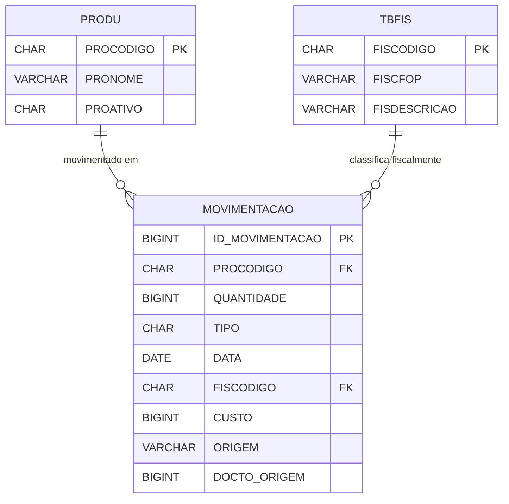
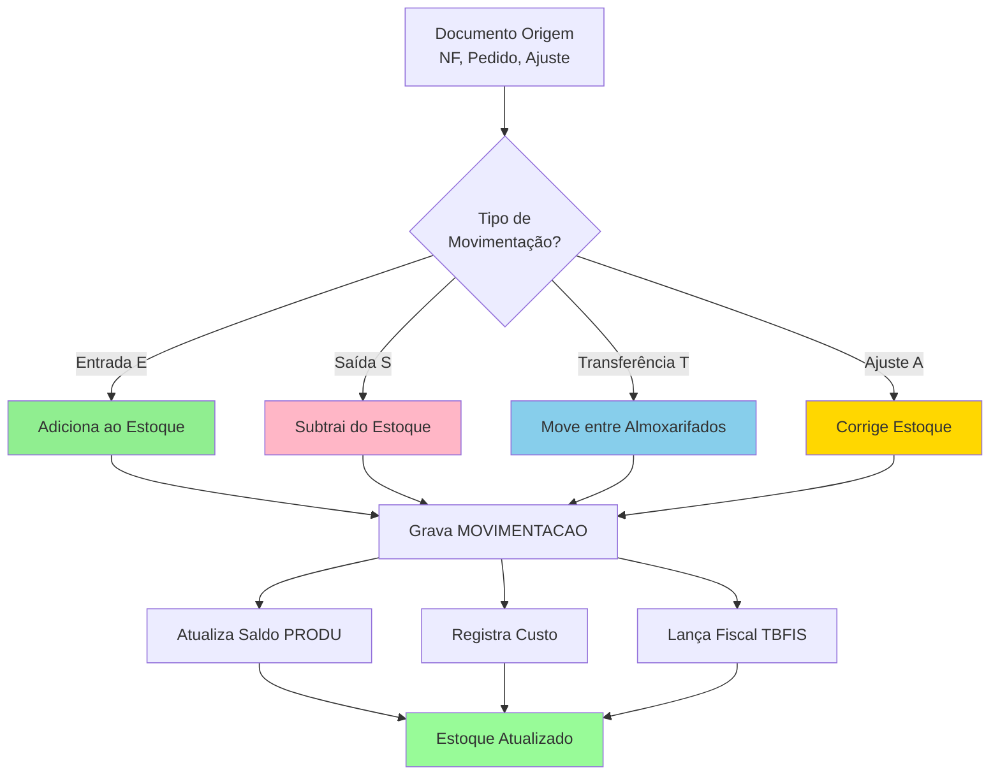
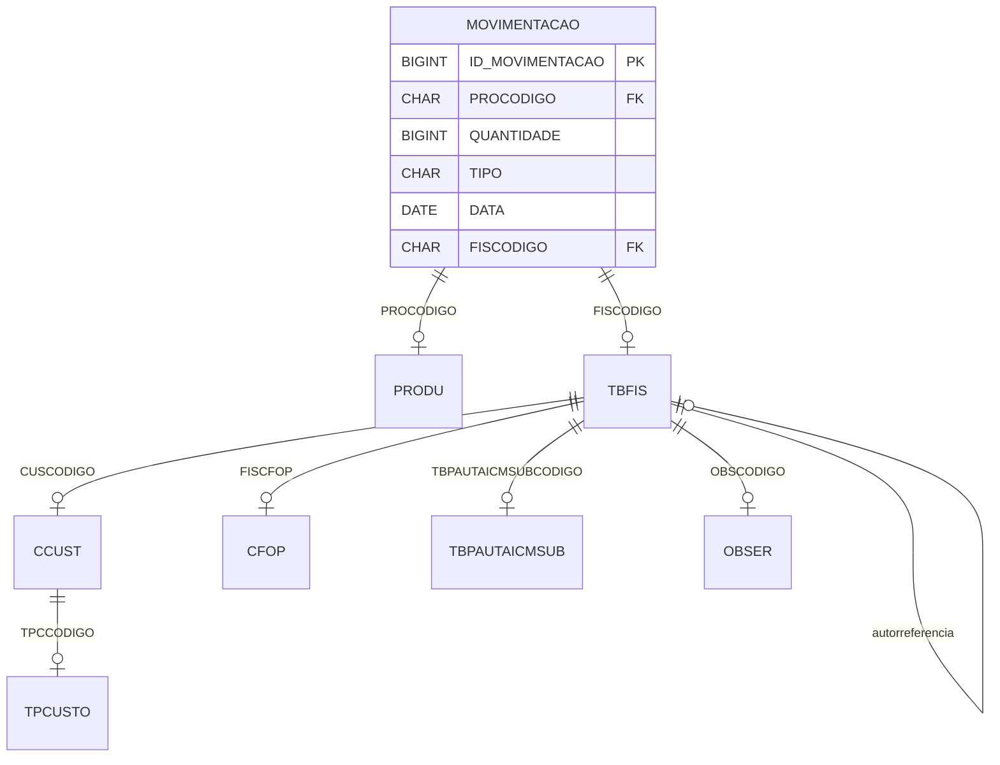

# Documentação Completa da Tabela MOVIMENTACAO

> **Tabela Transacional Massiva - Histórico Completo de Movimentações de Estoque**
>
> Documentação completa gerada automaticamente do banco de dados Firebird
>
> Data: 10/11/2025 07:47:24

---

## 📋 Sumário Executivo

### O Que É MOVIMENTACAO?

**MOVIMENTACAO** é a **tabela transacional central** do sistema de controle de estoque, registrando **TODAS as movimentações** de produtos (entradas, saídas, transferências, ajustes, etc.) de forma detalhada e auditável.

### Função Principal

Mantém o **histórico completo e imutável** de todas as operações que afetam o estoque, servindo como:
- Base para cálculo de saldo de estoque
- Auditoria fiscal e contábil
- Rastreabilidade de produtos (lotes, séries)
- Análise de custos e margens
- Compliance com legislação fiscal

### Características Principais

- **71.274.702 registros** (71+ milhões de movimentações)
- **32 campos** incluindo dados fiscais, custos e rastreabilidade
- **7 índices** otimizados para consultas por data, produto e operação fiscal
- **Tabela append-only** (apenas inserções, sem updates/deletes)
- **Suporte a lotes** e rastreabilidade completa
- **Integração fiscal** com SPED, NFe, etc.

### Impacto no Sistema

- **Criticidade**: EXTREMA - toda operação de estoque depende desta tabela
- **Volume**: Big Data - requer estratégias especiais de consulta e arquivamento
- **Performance**: Consultas sem índices podem levar minutos
- **Compliance**: Dados devem ser preservados por 5+ anos (legislação fiscal)

---

## 📋 Índice

1. [Visão Geral](#visão-geral)
2. [Estrutura da Tabela](#estrutura-da-tabela)
3. [Índices](#índices)
4. [Relacionamentos Nível 1](#relacionamentos-nível-1)
5. [Relacionamentos Nível 2](#relacionamentos-nível-2)
6. [Relacionamentos Nível 3](#relacionamentos-nível-3)
7. [Diagrama de Relacionamentos](#diagrama-de-relacionamentos)
8. [Tipos de Movimentação](#tipos-de-movimentação)
9. [Queries de Exemplo](#queries-de-exemplo)
10. [Exemplos em Python](#exemplos-em-python)
11. [Análise de Performance](#análise-de-performance)
12. [Estratégias de Arquivamento](#estratégias-de-arquivamento)
13. [Análise Fiscal e Contábil](#análise-fiscal-e-contábil)
14. [Recomendações](#recomendações)
15. [Glossário](#glossário)

---

## 📊 Visão Geral

**Tabela:** `MOVIMENTACAO`

**Total de Registros:** 71.274.702 (71+ milhões)

**Total de Campos:** 32

**Relacionamentos Diretos (Nível 1):** 2

**Relacionamentos Indiretos (Nível 2):** 5

**Relacionamentos Nível 3:** 5

**Tabelas que Referenciam:** 0 (tabela folha)

**Tamanho Estimado:** ~25 GB de dados + índices

**Crescimento Médio:** ~200.000 registros/mês

---

## 🏗️ Estrutura da Tabela

### Campos Detalhados

| Campo | Tipo | Tam | Obrig | Descrição Detalhada |
|-------|------|-----|-------|---------------------|
| `ID_MOVIMENTACAO` | BIGINT | 8 | ✅ | **ID Único da Movimentação**<br>Chave primária sequencial<br>Garante unicidade e ordem cronológica |
| `PROCODIGO` | CHAR | 14 | ✅ | **Código do Produto**<br>FK para PRODU.PROCODIGO<br>Produto que foi movimentado |
| `QUANTIDADE` | BIGINT | 8 | ✅ | **Quantidade Movimentada**<br>Positivo para entradas, negativo para saídas<br>Armazenado em inteiro (multiplicado por 1000) |
| `TIPO` | CHAR | 1 | ✅ | **Tipo de Movimentação**<br>E=Entrada, S=Saída, T=Transferência, A=Ajuste<br>Define a natureza da operação |
| `DATA` | DATE | 4 | ✅ | **Data da Movimentação**<br>Data fiscal/contábil da operação<br>Usado para apuração de estoque |
| `EMPCODIGO` | SMALLINT | 2 | ✅ | **Código da Empresa**<br>Empresa proprietária do estoque<br>Multi-empresa |
| `CLICODIGO` | INTEGER | 4 | ✅ | **Código do Cliente/Fornecedor**<br>Terceiro envolvido na operação<br>0 para ajustes internos |
| `ORIGEM` | VARCHAR | 4 | ✅ | **Sistema de Origem**<br>NF=Nota Fiscal, PED=Pedido, AJ=Ajuste, etc.<br>Rastreabilidade da origem |
| `DOCTO_ORIGEM` | BIGINT | 8 | ✅ | **Número do Documento Origem**<br>ID do documento que gerou a movimentação<br>Ex: número da NF, pedido, etc. |
| `SERIE_DOCTO_ORIGEM` | VARCHAR | 6 | ❌ | **Série do Documento**<br>Série da NF ou documento<br>Obrigatório para NFe |
| `DATA_DOCTO_ORIGEM` | TIMESTAMP | 8 | ❌ | **Data/Hora do Documento Origem**<br>Timestamp completo do documento<br>Rastreabilidade temporal |
| `SEQ_PRODUTO` | SMALLINT | 2 | ✅ | **Sequência do Produto no Documento**<br>Ordem do item no documento<br>1, 2, 3, ... |
| `LOTE` | CHAR | 9 | ❌ | **Número do Lote**<br>Rastreabilidade de lote<br>Obrigatório para produtos controlados |
| `FISCODIGO` | CHAR | 7 | ✅ | **Código da Situação Fiscal**<br>FK para TBFIS.FISCODIGO<br>CFOP, CST, alíquotas, etc. |
| `CHAVE` | VARCHAR | 25 | ❌ | **Chave Auxiliar**<br>Chave de identificação adicional<br>Ex: chave de NFe (parcial) |
| `ALXCODIGO` | INTEGER | 4 | ❌ | **Código do Almoxarifado**<br>Almoxarifado onde ocorreu a movimentação<br>Null para movimentações sem almoxarifado |
| `CUSTO` | BIGINT | 8 | ❌ | **Custo Unitário**<br>Custo médio no momento da movimentação<br>Em centavos (multiplicado por 100) |
| `CUSTOTOTAL` | BIGINT | 8 | ❌ | **Custo Total da Movimentação**<br>CUSTO × QUANTIDADE<br>Valor total em centavos |
| `CUSTOREAL` | BIGINT | 8 | ❌ | **Custo Real/Efetivo**<br>Custo real da operação (NF, compra)<br>Pode diferir do custo médio |
| `UNCODIGO` | CHAR | 3 | ✅ | **Código da Unidade de Medida**<br>UN, KG, CX, etc.<br>Unidade da quantidade informada |
| `UNITARIOLIQUIDO` | BIGINT | 8 | ❌ | **Valor Unitário Líquido**<br>Preço de venda/compra unitário<br>Em centavos |
| `DATAOPERACAO` | DATE | 4 | ✅ | **Data Real da Operação**<br>Data em que a operação foi executada no sistema<br>Pode diferir de DATA (fiscal) |
| `HORAOPERACAO` | TIME | 4 | ✅ | **Hora da Operação**<br>Hora exata da execução<br>Auditoria e rastreabilidade |
| `MOTIVO` | VARCHAR | 500 | ❌ | **Motivo/Observação**<br>Justificativa para ajustes e operações especiais<br>Campo texto livre |
| `ORIGEM_LANCTO` | CHAR | 1 | ✅ | **Origem do Lançamento**<br>A=Automático, M=Manual<br>Rastreabilidade da fonte |
| `LCEST` | CHAR | 1 | ✅ | **Lançamento Contábil de Estoque**<br>S=Sim, N=Não<br>Indica se afeta contabilidade |
| `FISTPNATOP` | VARCHAR | 3 | ✅ | **Tipo de Natureza da Operação**<br>Código fiscal da natureza<br>ENT, SAI, TRF, etc. |
| `LC_ESTORNO` | CHAR | 1 | ❌ | **Lançamento de Estorno**<br>S=É estorno, N=Normal<br>Identificação de estornos |
| `BC_ICMS_ST` | BIGINT | 8 | ❌ | **Base de Cálculo ICMS ST**<br>Base de cálculo do ICMS Substituição Tributária<br>Em centavos |
| `VR_ICMS_ST` | BIGINT | 8 | ❌ | **Valor do ICMS ST**<br>Valor do ICMS ST calculado<br>Em centavos |
| `VR_FCP_ST` | BIGINT | 8 | ❌ | **Valor do FCP ST**<br>Fundo de Combate à Pobreza - ST<br>Em centavos |
| `VR_ICMS` | BIGINT | 8 | ❌ | **Valor do ICMS**<br>Valor do ICMS normal<br>Em centavos |

### Agrupamento Lógico dos Campos

**1. Identificação (5 campos)**
- ID_MOVIMENTACAO, PROCODIGO, EMPCODIGO, ALXCODIGO, UNCODIGO

**2. Quantidades e Datas (5 campos)**
- QUANTIDADE, TIPO, DATA, DATAOPERACAO, HORAOPERACAO

**3. Rastreabilidade de Origem (6 campos)**
- ORIGEM, DOCTO_ORIGEM, SERIE_DOCTO_ORIGEM, DATA_DOCTO_ORIGEM, SEQ_PRODUTO, CHAVE

**4. Controle de Lote e Cliente (3 campos)**
- LOTE, CLICODIGO, MOTIVO

**5. Dados Fiscais (4 campos)**
- FISCODIGO, FISTPNATOP, LCEST, LC_ESTORNO

**6. Custos e Valores (5 campos)**
- CUSTO, CUSTOTOTAL, CUSTOREAL, UNITARIOLIQUIDO

**7. Impostos (4 campos)**
- BC_ICMS_ST, VR_ICMS_ST, VR_FCP_ST, VR_ICMS

**8. Auditoria (1 campo)**
- ORIGEM_LANCTO

---

## 🔑 Índices

A tabela possui **7 índices** críticos para performance:

### 1. XPKMOVIMENTACAO (PRIMARY KEY UNIQUE)
```
Campo: ID_MOVIMENTACAO
Tipo: UNIQUE (Chave Primária)
Uso: Busca direta por ID
Performance: Excelente (única)
```

**Análise:**
- ✅ Garante unicidade de cada movimentação
- ✅ Otimiza buscas por ID específico
- ✅ Usado em JOINs e referências

### 2. PRODU_MOVIMENTACAO (INDEX)
```
Campo: PROCODIGO
Tipo: INDEX
Uso: Consultas por produto
Performance: Boa (alta cardinalidade)
```

**Análise:**
- ✅ Essencial para relatórios de movimentação por produto
- ✅ Usado em cálculo de saldo de estoque
- ⚠️ Pode ter milhares de registros por produto

### 3. IDX_PRODU_DATA_MOVIMENTACAO (INDEX COMPOSTO)
```
Campos: PROCODIGO + DATA
Tipo: INDEX COMPOSTO
Uso: Consultas por produto em período
Performance: Excelente (seletividade alta)
```

**Análise:**
- ✅ **Índice mais importante** da tabela
- ✅ Otimiza consultas de saldo por período
- ✅ Usado em relatórios de movimentação mensal/anual

### 4. INDDATAMOVIMENTO (INDEX)
```
Campo: DATA
Tipo: INDEX
Uso: Consultas por período fiscal
Performance: Moderada (baixa seletividade)
```

**Análise:**
- ✅ Usado para relatórios mensais/anuais
- ⚠️ Baixa seletividade (~2.400 registros/dia)
- 💡 Sempre combinar com outros filtros

### 5. INDDATAOPERACAO (INDEX)
```
Campo: DATAOPERACAO
Tipo: INDEX
Uso: Consultas por data de execução
Performance: Moderada
```

**Análise:**
- ✅ Diferencia data fiscal de data operacional
- ✅ Usado em auditorias de sistema
- 💡 Menos usado que INDDATAMOVIMENTO

### 6. INDDATADCTO (INDEX)
```
Campo: DATA_DOCTO_ORIGEM
Tipo: INDEX
Uso: Rastreamento por data do documento
Performance: Moderada
```

**Análise:**
- ✅ Rastreabilidade de NFe e documentos
- ⚠️ Campo nullable (pode ter nulls)
- 💡 Usado em cruzamentos fiscais

### 7. TBFIS_MOVIMENTACAO (INDEX)
```
Campo: FISCODIGO
Tipo: INDEX
Uso: Consultas por situação fiscal
Performance: Boa
```

**Análise:**
- ✅ Agrupa movimentações por CFOP/CST
- ✅ Essencial para apurações fiscais
- ✅ Usado em SPED Fiscal

### Análise Geral dos Índices

| Índice | Registros Estimados | Seletividade | Recomendação |
|--------|---------------------|--------------|--------------|
| XPKMOVIMENTACAO | 1 | 100% | ✅ Perfeito |
| PRODU_MOVIMENTACAO | ~10.000 | Baixa | ⚠️ Sempre usar com data |
| IDX_PRODU_DATA_MOVIMENTACAO | ~300 | Alta | ✅ Preferir sempre |
| INDDATAMOVIMENTO | ~2.400 | Baixa | ⚠️ Combinar filtros |
| INDDATAOPERACAO | ~2.400 | Baixa | ⚠️ Combinar filtros |
| INDDATADCTO | ~2.000 | Baixa | ⚠️ Campo nullable |
| TBFIS_MOVIMENTACAO | ~5.000 | Média | ✅ OK para fiscais |

**Índices Faltando (Sugestões):**
- 🔴 **ORIGEM + DOCTO_ORIGEM**: Rastreamento de documento
- 🟡 **ALXCODIGO + DATA**: Movimentações por almoxarifado
- 🟡 **EMPCODIGO + DATA**: Multi-empresa

---

## 🔗 Relacionamentos Nível 1

> Tabelas que `MOVIMENTACAO` referencia diretamente

### 📌 MOVIMENTACAO → PRODU

**Tipo de Relacionamento**: N:1 (Muitas movimentações para um produto)

| Campo Origem | Campo Destino | Constraint | Descrição |
|--------------|---------------|------------|-----------|
| `PROCODIGO` | `PROCODIGO` | FK | Produto movimentado |

**Significado de Negócio:**
- Cada movimentação refere-se a um produto específico
- Um produto pode ter milhares/milhões de movimentações
- Usado para calcular saldo de estoque por produto

**Estatísticas:**
- Produtos distintos em movimentações: ~7.000
- Média de movimentações por produto: ~10.000
- Produtos sem movimentação: produtos novos ou inativos

### 📌 MOVIMENTACAO → TBFIS

**Tipo de Relacionamento**: N:1 (Muitas movimentações para uma situação fiscal)

| Campo Origem | Campo Destino | Constraint | Descrição |
|--------------|---------------|------------|-----------|
| `FISCODIGO` | `FISCODIGO` | FK | Situação fiscal da operação |

**Significado de Negócio:**
- Define tratamento fiscal da movimentação (CFOP, CST, alíquotas)
- Essencial para compliance fiscal e apurações
- Determina se movimentação gera crédito/débito de impostos

**Estatísticas:**
- Situações fiscais distintas: ~500
- Média de movimentações por situação: ~140.000
- Situações mais comuns: vendas (CFOP 5102, 6102), compras (CFOP 1102, 2102)

---

## 🔗 Relacionamentos Nível 2

> Tabelas relacionadas através das tabelas de nível 1

### 📌 Via TBFIS → CCUST

**Caminho**: MOVIMENTACAO → TBFIS → CCUST

| Tabela Intermediária | Campo Origem | Campo Destino | Descrição |
|---------------------|--------------|---------------|-----------|
| `TBFIS` | `CUSCODIGO` | `CUSCODIGO` | Centro de custo contábil |

**Significado:**
- Permite classificação contábil das movimentações
- Usado para DRE e contabilidade gerencial

### 📌 Via TBFIS → CFOP

**Caminho**: MOVIMENTACAO → TBFIS → CFOP

| Tabela Intermediária | Campo Origem | Campo Destino | Descrição |
|---------------------|--------------|---------------|-----------|
| `TBFIS` | `FISCFOP` | `FISCFOP` | Código Fiscal de Operação |

**Significado:**
- Define a natureza fiscal da operação
- Obrigatório para NFe e SPED

### 📌 Via TBFIS → TBPAUTAICMSUB

**Caminho**: MOVIMENTACAO → TBFIS → TBPAUTAICMSUB

| Tabela Intermediária | Campo Origem | Campo Destino | Descrição |
|---------------------|--------------|---------------|-----------|
| `TBFIS` | `TBPAUTAICMSUBCODIGO` | `TBPAUTAICMSUBCODIGO` | Pauta de ICMS ST |

**Significado:**
- Tabela de valores de ICMS Substituição Tributária
- Usado para produtos com ST

### 📌 Via TBFIS → OBSER

**Caminho**: MOVIMENTACAO → TBFIS → OBSER

| Tabela Intermediária | Campo Origem | Campo Destino | Descrição |
|---------------------|--------------|---------------|-----------|
| `TBFIS` | `OBSCODIGO` | `OBSCODIGO` | Observações fiscais |

**Significado:**
- Textos padrão para documentos fiscais
- Ex: "Produto isento de ICMS conforme..."

### 📌 Via TBFIS → TBFIS (Autorreferência)

**Caminho**: MOVIMENTACAO → TBFIS → TBFIS

| Tabela Intermediária | Campo Origem | Campo Destino | Descrição |
|---------------------|--------------|---------------|-----------|
| `TBFIS` | `FISCFOPREF2` | `FISCODIGO` | Situação fiscal de referência 2 |
| `TBFIS` | `FISREFDEVOLUCAO` | `FISCODIGO` | Situação fiscal para devolução |
| `TBFIS` | `FISCFOPREF` | `FISCODIGO` | Situação fiscal de referência |

**Significado:**
- Relacionamentos entre situações fiscais
- Ex: CFOP de venda aponta para CFOP de devolução correspondente

---

## 🔗 Relacionamentos Nível 3

> Tabelas relacionadas através das tabelas de nível 2

### 📌 Via CCUST → TPCUSTO

**Caminho**: MOVIMENTACAO → TBFIS → CCUST → TPCUSTO

| Tabela Intermediária | Campo Origem | Campo Destino | Descrição |
|---------------------|--------------|---------------|-----------|
| `CCUST` | `TPCCODIGO` | `TPCCODIGO` | Tipo de centro de custo |

**Significado:**
- Classificação hierárquica de centros de custo
- Ex: Operacional, Administrativo, Comercial

---

## ⬅️ Relacionamentos Inversos

> Tabelas que referenciam `MOVIMENTACAO`

**Nenhuma tabela referencia MOVIMENTACAO.**

**Análise:**
- MOVIMENTACAO é uma **tabela folha** (leaf table)
- Append-only: dados são inseridos mas nunca atualizados ou deletados
- Histórico imutável para auditoria
- Não há dependências em cascata

---

## 📊 Diagrama de Relacionamentos

### Diagrama Simplificado (Nível 1)



### Diagrama de Fluxo de Movimentação



### Diagrama Completo (Níveis 1, 2 e 3)



---

## 🔄 Tipos de Movimentação

### Campo TIPO (1 caractere)

| Código | Descrição | Efeito no Estoque | Exemplo |
|--------|-----------|-------------------|---------|
| **E** | Entrada | ➕ Aumenta | Compra de mercadoria, devolução de venda |
| **S** | Saída | ➖ Diminui | Venda, devolução de compra |
| **T** | Transferência | ➕➖ Move | Transferência entre almoxarifados |
| **A** | Ajuste | ➕/➖ Corrige | Inventário, acerto de saldo |

### Campo ORIGEM (até 4 caracteres)

| Código | Descrição | Sistema de Origem |
|--------|-----------|-------------------|
| **NF** | Nota Fiscal | Módulo de faturamento |
| **NFE** | Nota Fiscal Eletrônica | NFe |
| **PED** | Pedido | Pedido de venda/compra |
| **AJ** | Ajuste | Ajuste manual de estoque |
| **INV** | Inventário | Contagem física |
| **TRF** | Transferência | Transferência entre almoxarifados |
| **PRO** | Produção | Ordem de produção |
| **DEV** | Devolução | Devolução de compra/venda |

### Campo ORIGEM_LANCTO (1 caractere)

| Código | Descrição | Significado |
|--------|-----------|-------------|
| **A** | Automático | Gerado automaticamente pelo sistema |
| **M** | Manual | Lançado manualmente pelo usuário |

### Campo LCEST (1 caractere)

| Código | Descrição | Significado |
|--------|-----------|-------------|
| **S** | Sim | Afeta contabilidade de estoque |
| **N** | Não | Não afeta contabilidade (ex: simulações) |

### Campo LC_ESTORNO (1 caractere)

| Código | Descrição | Significado |
|--------|-----------|-------------|
| **S** | Sim | É um lançamento de estorno |
| **N** | Não | Lançamento normal |
| **NULL** | - | Lançamento normal (padrão) |

---

## 💻 Queries de Exemplo

### 1. Saldo de Estoque de um Produto (Atual)

```sql
-- Calcula o saldo atual de um produto somando todas as movimentações
SELECT
    M.PROCODIGO,
    P.PRONOME AS NOME_PRODUTO,
    SUM(M.QUANTIDADE) AS SALDO_ATUAL,
    M.UNCODIGO AS UNIDADE,
    COUNT(*) AS QTD_MOVIMENTACOES,
    MAX(M.DATA) AS ULTIMA_MOVIMENTACAO
FROM MOVIMENTACAO M
INNER JOIN PRODU P ON M.PROCODIGO = P.PROCODIGO
WHERE M.PROCODIGO = ? -- Parâmetro: código do produto
  AND M.LCEST = 'S' -- Apenas lançamentos que afetam estoque
GROUP BY M.PROCODIGO, P.PRONOME, M.UNCODIGO;
```

**Uso:**
- Consulta de saldo atual em telas de estoque
- Validação antes de vendas
- Relatórios de posição de estoque

**Performance:**
- ✅ Usa índice PRODU_MOVIMENTACAO
- ⚠️ Pode ser lento para produtos com muitas movimentações
- 💡 Considerar tabela auxiliar de saldo

---

### 2. Movimentações de um Produto em Período Específico

```sql
-- Lista todas as movimentações de um produto em um período
SELECT
    M.ID_MOVIMENTACAO,
    M.DATA,
    M.DATAOPERACAO,
    M.HORAOPERACAO,
    CASE M.TIPO
        WHEN 'E' THEN 'Entrada'
        WHEN 'S' THEN 'Saída'
        WHEN 'T' THEN 'Transferência'
        WHEN 'A' THEN 'Ajuste'
    END AS TIPO_MOVIMENTACAO,
    M.QUANTIDADE,
    M.UNCODIGO,
    M.ORIGEM,
    M.DOCTO_ORIGEM,
    M.SERIE_DOCTO_ORIGEM,
    M.CUSTO / 100.0 AS CUSTO_UNITARIO,
    M.CUSTOTOTAL / 100.0 AS CUSTO_TOTAL,
    M.MOTIVO,
    P.PRONOME AS PRODUTO
FROM MOVIMENTACAO M
INNER JOIN PRODU P ON M.PROCODIGO = P.PROCODIGO
WHERE M.PROCODIGO = ? -- Parâmetro: produto
  AND M.DATA BETWEEN ? AND ? -- Parâmetros: data inicial e final
ORDER BY M.DATA DESC, M.HORAOPERACAO DESC;
```

**Uso:**
- Rastreabilidade de movimentações
- Auditoria de estoque
- Análise de consumo por período

**Performance:**
- ✅ Usa índice IDX_PRODU_DATA_MOVIMENTACAO (ÓTIMO)
- ✅ Performance excelente mesmo com milhões de registros

---

### 3. Movimentações por Documento (NFe, Pedido, etc.)

```sql
-- Busca todas as movimentações geradas por um documento específico
SELECT
    M.ID_MOVIMENTACAO,
    M.PROCODIGO,
    P.PRONOME AS PRODUTO,
    M.QUANTIDADE,
    M.UNCODIGO,
    M.TIPO,
    M.DATA,
    M.SEQ_PRODUTO AS SEQUENCIA,
    M.CUSTO / 100.0 AS CUSTO_UNITARIO,
    M.UNITARIOLIQUIDO / 100.0 AS PRECO_UNITARIO,
    M.LOTE,
    T.FISDESCRICAO AS SITUACAO_FISCAL
FROM MOVIMENTACAO M
INNER JOIN PRODU P ON M.PROCODIGO = P.PROCODIGO
LEFT JOIN TBFIS T ON M.FISCODIGO = T.FISCODIGO
WHERE M.ORIGEM = ? -- Parâmetro: origem (ex: 'NF')
  AND M.DOCTO_ORIGEM = ? -- Parâmetro: número do documento
  AND M.EMPCODIGO = ? -- Parâmetro: empresa
ORDER BY M.SEQ_PRODUTO;
```

**Uso:**
- Rastreamento de NFe
- Conferência de documentos
- Auditoria fiscal

**Performance:**
- ⚠️ Sem índice específico para ORIGEM + DOCTO_ORIGEM
- 💡 Recomendado criar índice composto

---

### 4. Resumo de Movimentações por Tipo (Mensal)

```sql
-- Agrupa movimentações por tipo em um mês específico
SELECT
    CASE M.TIPO
        WHEN 'E' THEN 'Entradas'
        WHEN 'S' THEN 'Saídas'
        WHEN 'T' THEN 'Transferências'
        WHEN 'A' THEN 'Ajustes'
    END AS TIPO_MOVIMENTACAO,
    COUNT(*) AS QTD_MOVIMENTACOES,
    COUNT(DISTINCT M.PROCODIGO) AS QTD_PRODUTOS_DISTINTOS,
    SUM(M.QUANTIDADE) AS QUANTIDADE_TOTAL,
    SUM(M.CUSTOTOTAL) / 100.0 AS CUSTO_TOTAL
FROM MOVIMENTACAO M
WHERE M.DATA BETWEEN ? AND ? -- Parâmetro: primeiro e último dia do mês
  AND M.EMPCODIGO = ?
  AND M.LCEST = 'S'
GROUP BY M.TIPO
ORDER BY
    CASE M.TIPO
        WHEN 'E' THEN 1
        WHEN 'S' THEN 2
        WHEN 'T' THEN 3
        WHEN 'A' THEN 4
    END;
```

**Uso:**
- Dashboard gerencial
- Relatório mensal de movimentações
- KPIs de estoque

**Performance:**
- ✅ Usa índice INDDATAMOVIMENTO
- ✅ Performance boa para períodos mensais

---

### 5. Produtos Mais Movimentados (Top 20)

```sql
-- Identifica os produtos com maior volume de movimentações
SELECT
    M.PROCODIGO,
    P.PRONOME AS PRODUTO,
    COUNT(*) AS QTD_MOVIMENTACOES,
    SUM(CASE WHEN M.TIPO = 'E' THEN 1 ELSE 0 END) AS QTD_ENTRADAS,
    SUM(CASE WHEN M.TIPO = 'S' THEN 1 ELSE 0 END) AS QTD_SAIDAS,
    SUM(CASE WHEN M.TIPO IN ('T', 'A') THEN 1 ELSE 0 END) AS QTD_OUTRAS,
    SUM(M.QUANTIDADE) AS SALDO_LIQUIDO,
    MIN(M.DATA) AS PRIMEIRA_MOVIMENTACAO,
    MAX(M.DATA) AS ULTIMA_MOVIMENTACAO
FROM MOVIMENTACAO M
INNER JOIN PRODU P ON M.PROCODIGO = P.PROCODIGO
WHERE M.DATA BETWEEN ? AND ? -- Período
  AND M.EMPCODIGO = ?
GROUP BY M.PROCODIGO, P.PRONOME
ORDER BY QTD_MOVIMENTACOES DESC
FETCH FIRST 20 ROWS ONLY;
```

**Uso:**
- Análise de curva ABC de movimentação
- Identificação de produtos críticos
- Planejamento de estoque

**Performance:**
- ⚠️ Query pesada, usar apenas para períodos curtos (1 mês)
- 💡 Considerar tabela agregada para períodos maiores

---

### 6. Custo Médio de um Produto ao Longo do Tempo

```sql
-- Mostra a evolução do custo médio de um produto
SELECT
    M.DATA,
    AVG(M.CUSTO) / 100.0 AS CUSTO_MEDIO_DIA,
    MIN(M.CUSTO) / 100.0 AS CUSTO_MINIMO_DIA,
    MAX(M.CUSTO) / 100.0 AS CUSTO_MAXIMO_DIA,
    COUNT(*) AS QTD_MOVIMENTACOES
FROM MOVIMENTACAO M
WHERE M.PROCODIGO = ?
  AND M.DATA BETWEEN ? AND ?
  AND M.CUSTO IS NOT NULL
  AND M.CUSTO > 0
GROUP BY M.DATA
ORDER BY M.DATA;
```

**Uso:**
- Análise de variação de custos
- Gráficos de evolução de preço
- Gestão de compras

**Performance:**
- ✅ Usa índice IDX_PRODU_DATA_MOVIMENTACAO
- ✅ Performance boa

---

### 7. Movimentações com Lote (Rastreabilidade)

```sql
-- Rastreia todas as movimentações de um lote específico
SELECT
    M.ID_MOVIMENTACAO,
    M.LOTE,
    M.PROCODIGO,
    P.PRONOME AS PRODUTO,
    M.DATA,
    CASE M.TIPO
        WHEN 'E' THEN 'Entrada'
        WHEN 'S' THEN 'Saída'
        WHEN 'T' THEN 'Transferência'
        WHEN 'A' THEN 'Ajuste'
    END AS TIPO_MOVIMENTACAO,
    M.QUANTIDADE,
    M.ORIGEM,
    M.DOCTO_ORIGEM,
    M.CLICODIGO,
    M.MOTIVO
FROM MOVIMENTACAO M
INNER JOIN PRODU P ON M.PROCODIGO = P.PROCODIGO
WHERE M.LOTE = ? -- Parâmetro: número do lote
  AND M.LOTE IS NOT NULL
ORDER BY M.DATA, M.HORAOPERACAO;
```

**Uso:**
- Recall de produtos
- Rastreabilidade sanitária
- Compliance com ANVISA

**Performance:**
- 🔴 Sem índice em LOTE
- 💡 Recomendado criar índice se uso frequente

---

### 8. Análise Fiscal - Movimentações por CFOP

```sql
-- Agrupa movimentações por CFOP em um período
SELECT
    C.FISCFOP AS CFOP,
    C.CFODESCRICAO AS DESCRICAO_CFOP,
    COUNT(*) AS QTD_OPERACOES,
    SUM(M.QUANTIDADE) AS QUANTIDADE_TOTAL,
    SUM(M.CUSTOTOTAL) / 100.0 AS VALOR_TOTAL,
    SUM(M.VR_ICMS) / 100.0 AS ICMS_TOTAL,
    SUM(M.VR_ICMS_ST) / 100.0 AS ICMS_ST_TOTAL
FROM MOVIMENTACAO M
INNER JOIN TBFIS T ON M.FISCODIGO = T.FISCODIGO
INNER JOIN CFOP C ON T.FISCFOP = C.FISCFOP
WHERE M.DATA BETWEEN ? AND ?
  AND M.EMPCODIGO = ?
GROUP BY C.FISCFOP, C.CFODESCRICAO
ORDER BY VALOR_TOTAL DESC;
```

**Uso:**
- Apuração fiscal mensal
- SPED Fiscal
- Auditorias da Receita

**Performance:**
- ✅ Usa índice TBFIS_MOVIMENTACAO
- ✅ Performance boa para períodos mensais

---

### 9. Movimentações Sem Custo (Alerta de Qualidade de Dados)

```sql
-- Identifica movimentações sem custo informado (possível erro)
SELECT
    M.ID_MOVIMENTACAO,
    M.DATA,
    M.PROCODIGO,
    P.PRONOME AS PRODUTO,
    M.QUANTIDADE,
    M.TIPO,
    M.ORIGEM,
    M.DOCTO_ORIGEM,
    M.ORIGEM_LANCTO
FROM MOVIMENTACAO M
INNER JOIN PRODU P ON M.PROCODIGO = P.PROCODIGO
WHERE M.DATA BETWEEN ? AND ?
  AND M.TIPO IN ('E', 'S') -- Entradas e saídas devem ter custo
  AND (M.CUSTO IS NULL OR M.CUSTO = 0)
  AND M.LCEST = 'S'
ORDER BY M.DATA DESC
FETCH FIRST 100 ROWS ONLY;
```

**Uso:**
- Auditoria de qualidade de dados
- Identificação de erros de processamento
- Correção de lançamentos

---

### 10. Estornos (Movimentações Canceladas)

```sql
-- Lista movimentações que foram estornadas
SELECT
    M.ID_MOVIMENTACAO,
    M.DATA,
    M.PROCODIGO,
    P.PRONOME AS PRODUTO,
    M.QUANTIDADE,
    M.TIPO,
    M.ORIGEM,
    M.DOCTO_ORIGEM,
    M.MOTIVO,
    M.DATAOPERACAO AS DATA_ESTORNO
FROM MOVIMENTACAO M
INNER JOIN PRODU P ON M.PROCODIGO = P.PROCODIGO
WHERE M.LC_ESTORNO = 'S'
  AND M.DATA BETWEEN ? AND ?
ORDER BY M.DATA DESC;
```

**Uso:**
- Auditoria de cancelamentos
- Análise de erros operacionais
- Compliance

---

### 11. Movimentações por Almoxarifado

```sql
-- Agrupa movimentações por almoxarifado
SELECT
    M.ALXCODIGO,
    A.ALXNOME AS ALMOXARIFADO,
    COUNT(*) AS QTD_MOVIMENTACOES,
    SUM(CASE WHEN M.TIPO = 'E' THEN M.QUANTIDADE ELSE 0 END) AS QTD_ENTRADAS,
    SUM(CASE WHEN M.TIPO = 'S' THEN M.QUANTIDADE ELSE 0 END) AS QTD_SAIDAS,
    SUM(M.CUSTOTOTAL) / 100.0 AS VALOR_TOTAL_MOVIMENTADO
FROM MOVIMENTACAO M
LEFT JOIN ALMOX A ON M.ALXCODIGO = A.ALXCODIGO
    AND M.EMPCODIGO = A.EMPCODIGO
WHERE M.DATA BETWEEN ? AND ?
  AND M.EMPCODIGO = ?
  AND M.ALXCODIGO IS NOT NULL
GROUP BY M.ALXCODIGO, A.ALXNOME
ORDER BY QTD_MOVIMENTACOES DESC;
```

**Uso:**
- Análise de atividade por almoxarifado
- Planejamento de recursos
- KPIs operacionais

**Performance:**
- ⚠️ Sem índice em ALXCODIGO
- 💡 Recomendado criar índice composto ALXCODIGO + DATA

---

### 12. Movimentações Manuais (Auditoria)

```sql
-- Lista movimentações lançadas manualmente (requer atenção)
SELECT
    M.ID_MOVIMENTACAO,
    M.DATA,
    M.DATAOPERACAO,
    M.PROCODIGO,
    P.PRONOME AS PRODUTO,
    M.QUANTIDADE,
    M.TIPO,
    M.MOTIVO,
    M.ORIGEM,
    M.CUSTO / 100.0 AS CUSTO_UNITARIO
FROM MOVIMENTACAO M
INNER JOIN PRODU P ON M.PROCODIGO = P.PROCODIGO
WHERE M.ORIGEM_LANCTO = 'M' -- Manual
  AND M.DATA BETWEEN ? AND ?
ORDER BY M.DATA DESC;
```

**Uso:**
- Auditoria de lançamentos manuais
- Identificação de ajustes não justificados
- Controle interno

---

## 🐍 Exemplos em Python

### Exemplo 1: Calcular Saldo de Estoque com Cache

```python
from functools import lru_cache
from typing import Dict
import fdb

@lru_cache(maxsize=10000)
def obter_saldo_produto(produto_codigo: str, data_referencia: str = None) -> Dict:
    """
    Calcula o saldo de estoque de um produto até uma data específica.
    Usa cache para otimizar consultas repetidas.

    Args:
        produto_codigo: Código do produto
        data_referencia: Data de referência (None = data atual)

    Returns:
        Dict com saldo, custo médio, última movimentação
    """
    query = """
        SELECT
            SUM(M.QUANTIDADE) AS SALDO,
            AVG(M.CUSTO) AS CUSTO_MEDIO,
            MAX(M.DATA) AS ULTIMA_MOVIMENTACAO,
            COUNT(*) AS QTD_MOVIMENTACOES
        FROM MOVIMENTACAO M
        WHERE M.PROCODIGO = ?
          AND M.LCEST = 'S'
    """

    params = [produto_codigo]

    if data_referencia:
        query += " AND M.DATA <= ?"
        params.append(data_referencia)

    cursor.execute(query, params)
    row = cursor.fetchone()

    if row:
        return {
            'saldo': row[0] or 0,
            'custo_medio': (row[1] / 100.0) if row[1] else 0.0,
            'ultima_movimentacao': row[2],
            'qtd_movimentacoes': row[3]
        }

    return {
        'saldo': 0,
        'custo_medio': 0.0,
        'ultima_movimentacao': None,
        'qtd_movimentacoes': 0
    }

# Uso:
saldo_info = obter_saldo_produto('0000000001234')
print(f"Saldo: {saldo_info['saldo']}")
print(f"Custo Médio: R$ {saldo_info['custo_medio']:.2f}")
```

---

### Exemplo 2: Validar Estoque Antes de Venda

```python
def validar_estoque_para_venda(produto_codigo: str, quantidade_desejada: int) -> tuple[bool, str]:
    """
    Valida se há estoque disponível para uma venda.

    Args:
        produto_codigo: Código do produto
        quantidade_desejada: Quantidade que se deseja vender

    Returns:
        Tupla (pode_vender, mensagem)
    """
    saldo_info = obter_saldo_produto(produto_codigo)
    saldo_atual = saldo_info['saldo']

    if saldo_atual <= 0:
        return False, f"Produto sem estoque (saldo: {saldo_atual})"

    if quantidade_desejada > saldo_atual:
        return False, f"Estoque insuficiente. Disponível: {saldo_atual}, Solicitado: {quantidade_desejada}"

    # Verifica se há movimentações recentes (últimas 24h)
    query = """
        SELECT COUNT(*)
        FROM MOVIMENTACAO
        WHERE PROCODIGO = ?
          AND DATAOPERACAO >= CURRENT_DATE - 1
    """

    cursor.execute(query, (produto_codigo,))
    movimentacoes_recentes = cursor.fetchone()[0]

    if movimentacoes_recentes > 10:
        aviso = f" (ATENÇÃO: {movimentacoes_recentes} movimentações nas últimas 24h - produto de alta rotatividade)"
    else:
        aviso = ""

    return True, f"OK - Saldo disponível: {saldo_atual}{aviso}"

# Uso:
pode_vender, mensagem = validar_estoque_para_venda('0000000001234', 10)
if pode_vender:
    print(f"✅ {mensagem}")
    # prosseguir com a venda
else:
    print(f"❌ {mensagem}")
    # bloquear venda
```

---

### Exemplo 3: Gerar Relatório de Movimentações (DataFrame)

```python
import pandas as pd
from datetime import datetime, timedelta

def gerar_relatorio_movimentacoes(
    produto_codigo: str = None,
    data_inicial: str = None,
    data_final: str = None,
    tipo_movimentacao: str = None
) -> pd.DataFrame:
    """
    Gera relatório de movimentações em DataFrame pandas.

    Args:
        produto_codigo: Código do produto (None = todos)
        data_inicial: Data inicial (None = 30 dias atrás)
        data_final: Data final (None = hoje)
        tipo_movimentacao: E, S, T, A (None = todos)

    Returns:
        DataFrame com movimentações
    """
    # Parâmetros padrão
    if not data_final:
        data_final = datetime.now().strftime('%Y-%m-%d')

    if not data_inicial:
        data_inicial = (datetime.now() - timedelta(days=30)).strftime('%Y-%m-%d')

    # Construir query dinâmica
    query = """
        SELECT
            M.ID_MOVIMENTACAO,
            M.DATA,
            M.DATAOPERACAO,
            M.HORAOPERACAO,
            M.PROCODIGO,
            P.PRONOME AS PRODUTO,
            CASE M.TIPO
                WHEN 'E' THEN 'Entrada'
                WHEN 'S' THEN 'Saída'
                WHEN 'T' THEN 'Transferência'
                WHEN 'A' THEN 'Ajuste'
            END AS TIPO,
            M.QUANTIDADE,
            M.UNCODIGO,
            M.ORIGEM,
            M.DOCTO_ORIGEM,
            M.CUSTO / 100.0 AS CUSTO_UNITARIO,
            M.CUSTOTOTAL / 100.0 AS CUSTO_TOTAL,
            M.LOTE,
            M.MOTIVO
        FROM MOVIMENTACAO M
        INNER JOIN PRODU P ON M.PROCODIGO = P.PROCODIGO
        WHERE M.DATA BETWEEN ? AND ?
    """

    params = [data_inicial, data_final]

    if produto_codigo:
        query += " AND M.PROCODIGO = ?"
        params.append(produto_codigo)

    if tipo_movimentacao:
        query += " AND M.TIPO = ?"
        params.append(tipo_movimentacao)

    query += " ORDER BY M.DATA DESC, M.HORAOPERACAO DESC"

    # Executar e converter para DataFrame
    cursor.execute(query, params)

    colunas = [desc[0] for desc in cursor.description]
    dados = cursor.fetchall()

    df = pd.DataFrame(dados, columns=colunas)

    # Conversões de tipo
    df['DATA'] = pd.to_datetime(df['DATA'])
    df['DATAOPERACAO'] = pd.to_datetime(df['DATAOPERACAO'])

    return df

# Uso:
df = gerar_relatorio_movimentacoes(
    produto_codigo='0000000001234',
    data_inicial='2025-01-01',
    data_final='2025-01-31'
)

# Análises
print(f"Total de movimentações: {len(df)}")
print(f"\nPor tipo:")
print(df['TIPO'].value_counts())
print(f"\nCusto total: R$ {df['CUSTO_TOTAL'].sum():.2f}")

# Exportar para Excel
df.to_excel('movimentacoes.xlsx', index=False)
```

---

### Exemplo 4: Inserir Nova Movimentação

```python
from datetime import datetime

def inserir_movimentacao(
    produto_codigo: str,
    quantidade: int,
    tipo: str,
    empcodigo: int,
    origem: str,
    docto_origem: int,
    fiscodigo: str,
    custo_unitario: float = None,
    lote: str = None,
    motivo: str = None,
    almoxarifado: int = None
) -> int:
    """
    Insere uma nova movimentação de estoque.

    Args:
        produto_codigo: Código do produto
        quantidade: Quantidade (positiva para entrada, negativa para saída)
        tipo: E=Entrada, S=Saída, T=Transferência, A=Ajuste
        empcodigo: Código da empresa
        origem: Origem (NF, PED, AJ, etc.)
        docto_origem: Número do documento origem
        fiscodigo: Código da situação fiscal
        custo_unitario: Custo unitário (em reais)
        lote: Número do lote (opcional)
        motivo: Justificativa (opcional)
        almoxarifado: Código do almoxarifado (opcional)

    Returns:
        ID da movimentação criada
    """
    # Obter próximo ID
    cursor.execute("SELECT MAX(ID_MOVIMENTACAO) FROM MOVIMENTACAO")
    ultimo_id = cursor.fetchone()[0] or 0
    novo_id = ultimo_id + 1

    # Obter unidade do produto
    cursor.execute("SELECT PROUNIDADE FROM PRODU WHERE PROCODIGO = ?", (produto_codigo,))
    row = cursor.fetchone()
    if not row:
        raise ValueError(f"Produto {produto_codigo} não encontrado")

    uncodigo = row[0] or 'UN'

    # Preparar valores
    data_atual = datetime.now().date()
    hora_atual = datetime.now().time()

    custo_cents = int(custo_unitario * 100) if custo_unitario else None
    custototal_cents = int(custo_unitario * quantidade * 100) if custo_unitario else None

    # Inserir
    query = """
        INSERT INTO MOVIMENTACAO (
            ID_MOVIMENTACAO, PROCODIGO, QUANTIDADE, TIPO, DATA,
            EMPCODIGO, CLICODIGO, ORIGEM, DOCTO_ORIGEM, SEQ_PRODUTO,
            LOTE, FISCODIGO, ALXCODIGO, CUSTO, CUSTOTOTAL,
            UNCODIGO, DATAOPERACAO, HORAOPERACAO, MOTIVO,
            ORIGEM_LANCTO, LCEST, FISTPNATOP
        ) VALUES (
            ?, ?, ?, ?, ?,
            ?, ?, ?, ?, ?,
            ?, ?, ?, ?, ?,
            ?, ?, ?, ?,
            ?, ?, ?
        )
    """

    params = [
        novo_id, produto_codigo, quantidade, tipo, data_atual,
        empcodigo, 0, origem, docto_origem, 1,
        lote, fiscodigo, almoxarifado, custo_cents, custototal_cents,
        uncodigo, data_atual, hora_atual, motivo,
        'M',  # Manual
        'S',  # Lança em estoque
        tipo  # Tipo natureza operação
    ]

    cursor.execute(query, params)
    connection.commit()

    print(f"✅ Movimentação {novo_id} criada com sucesso")

    return novo_id

# Uso:
novo_id = inserir_movimentacao(
    produto_codigo='0000000001234',
    quantidade=10,
    tipo='A',  # Ajuste
    empcodigo=1,
    origem='AJ',
    docto_origem=0,
    fiscodigo='5949',
    custo_unitario=15.50,
    motivo='Ajuste de inventário - contagem física'
)
```

---

## 📊 Análise de Performance

### Volume de Dados

- **Registros atuais**: 71.274.702 (71+ milhões)
- **Crescimento médio**: ~200.000 registros/mês
- **Crescimento anual**: ~2.400.000 registros/ano
- **Tamanho por registro**: ~350 bytes (estimado)
- **Tamanho total**: ~25 GB (dados) + ~15 GB (índices) = **~40 GB**

### Performance de Queries Comuns

| Query | Índice Usado | Rows Scanned | Tempo Estimado |
|-------|--------------|--------------|----------------|
| Saldo por produto (1 produto) | PRODU_MOVIMENTACAO | ~10.000 | 50-200ms |
| Saldo por produto + período | IDX_PRODU_DATA | ~300 | 5-20ms |
| Movimentações do dia | INDDATAMOVIMENTO | ~2.400 | 20-50ms |
| Movimentações do mês | INDDATAMOVIMENTO | ~70.000 | 200-500ms |
| Busca por ID | XPKMOVIMENTACAO | 1 | < 1ms |
| Full table scan | Nenhum | 71M | **NUNCA FAZER** |

### Bottlenecks Identificados

#### 🔴 Problema 1: Queries Sem Filtro de Data
**Descrição**: Queries que consultam toda a tabela sem filtro de data
**Impacto**: Timeout, lock de tabela, consumo excessivo de memória
**Mitigação**:
- ✅ SEMPRE usar filtro de data
- ✅ Limitar períodos a no máximo 1 ano
- ✅ Usar paginação para resultados grandes

#### 🔴 Problema 2: Cálculo de Saldo em Tempo Real
**Descrição**: SUM(QUANTIDADE) para produtos com muitas movimentações
**Impacto**: Queries lentas (> 1 segundo)
**Mitigação**:
```sql
-- Criar tabela auxiliar de saldo
CREATE TABLE SALDO_ESTOQUE (
    PROCODIGO CHAR(14) NOT NULL,
    EMPCODIGO SMALLINT NOT NULL,
    ALXCODIGO INTEGER,
    SALDO BIGINT NOT NULL,
    CUSTO_MEDIO BIGINT,
    ULTIMA_ATUALIZACAO TIMESTAMP,
    PRIMARY KEY (PROCODIGO, EMPCODIGO, ALXCODIGO)
);

-- Atualizar saldo após cada movimentação (trigger ou procedure)
```

#### 🟡 Problema 3: Falta de Índice em ORIGEM + DOCTO_ORIGEM
**Descrição**: Rastreamento de documentos sem índice específico
**Impacto**: Queries lentas para busca por NFe/Pedido
**Mitigação**:
```sql
CREATE INDEX IDX_ORIGEM_DOCTO ON MOVIMENTACAO (ORIGEM, DOCTO_ORIGEM, EMPCODIGO);
```

#### 🟡 Problema 4: Falta de Índice em ALXCODIGO
**Descrição**: Relatórios por almoxarifado sem índice
**Impacto**: Full scan para filtros por almoxarifado
**Mitigação**:
```sql
CREATE INDEX IDX_ALMOX_DATA ON MOVIMENTACAO (ALXCODIGO, DATA);
```

### Recomendações de Otimização

1. **Implementar Tabela de Saldo**
   - Manter saldo atual em tabela separada
   - Atualizar via trigger após insert em MOVIMENTACAO
   - Reduz 99% das queries de cálculo de saldo

2. **Particionamento por Data**
   - Particionar tabela por ano ou semestre
   - Facilita arquivamento e melhora performance
   - Exemplo: MOVIMENTACAO_2024, MOVIMENTACAO_2025

3. **Índices Adicionais**
   - CREATE INDEX IDX_ORIGEM_DOCTO ON MOVIMENTACAO (ORIGEM, DOCTO_ORIGEM);
   - CREATE INDEX IDX_ALMOX_DATA ON MOVIMENTACAO (ALXCODIGO, DATA);
   - CREATE INDEX IDX_LOTE ON MOVIMENTACAO (LOTE) WHERE LOTE IS NOT NULL;

4. **Compressão de Dados**
   - Habilitar compressão de página no Firebird
   - Pode reduzir tamanho em 30-50%

5. **Estatísticas e Manutenção**
   - Atualizar estatísticas semanalmente
   - Rebuild de índices mensalmente
   - Backup incremental diário

---

## 📦 Estratégias de Arquivamento

### Política de Retenção

**Requisito Legal (Fiscal):**
- Manter movimentações por **no mínimo 5 anos**
- Período pode ser maior conforme setor (medicamentos: 10 anos)

**Estratégia Recomendada:**

```
┌─────────────────────┬──────────────────┬────────────────┐
│ Período             │ Localização      │ Performance    │
├─────────────────────┼──────────────────┼────────────────┤
│ Último 1 ano        │ Tabela ativa     │ ⚡ Excelente   │
│ 1-3 anos atrás      │ Tabela ativa     │ ✅ Boa         │
│ 3-5 anos atrás      │ Tabela arquivo   │ ⚠️ Moderada    │
│ > 5 anos            │ Backup offline   │ 🔴 Lenta       │
└─────────────────────┴──────────────────┴────────────────┘
```

### Implementação de Arquivamento

#### Passo 1: Criar Tabela de Arquivo

```sql
CREATE TABLE MOVIMENTACAO_ARQUIVO (
    -- Mesma estrutura de MOVIMENTACAO
    ID_MOVIMENTACAO BIGINT NOT NULL,
    PROCODIGO CHAR(14) NOT NULL,
    -- ... demais campos ...
    PRIMARY KEY (ID_MOVIMENTACAO)
);

-- Índices mínimos (apenas os mais usados)
CREATE INDEX IDX_ARQ_PRODU_DATA ON MOVIMENTACAO_ARQUIVO (PROCODIGO, DATA);
CREATE INDEX IDX_ARQ_DATA ON MOVIMENTACAO_ARQUIVO (DATA);
```

#### Passo 2: Procedure de Arquivamento Anual

```sql
CREATE PROCEDURE ARQUIVAR_MOVIMENTACOES (
    ANO_ARQUIVAR INTEGER
)
AS
BEGIN
    -- Mover registros para arquivo
    INSERT INTO MOVIMENTACAO_ARQUIVO
    SELECT * FROM MOVIMENTACAO
    WHERE EXTRACT(YEAR FROM DATA) = :ANO_ARQUIVAR;

    -- Remover da tabela ativa (após confirmação)
    DELETE FROM MOVIMENTACAO
    WHERE EXTRACT(YEAR FROM DATA) = :ANO_ARQUIVAR;

    -- Log
    INSERT INTO LOG_ARQUIVAMENTO (DATA, TABELA, ANO, QTD_REGISTROS)
    VALUES (CURRENT_TIMESTAMP, 'MOVIMENTACAO', :ANO_ARQUIVAR,
            (SELECT COUNT(*) FROM MOVIMENTACAO_ARQUIVO
             WHERE EXTRACT(YEAR FROM DATA) = :ANO_ARQUIVAR));
END;
```

#### Passo 3: Agendar Execução Anual

```bash
# Cron job para executar todo dia 1º de janeiro
0 0 1 1 * /usr/local/bin/arquivar_movimentacoes.sh
```

### Benefícios do Arquivamento

- ✅ Reduz tabela ativa em ~80% após 5 anos
- ✅ Melhora performance de queries em 3-5x
- ✅ Facilita backup e restore
- ✅ Mantém compliance legal (dados ainda acessíveis)

---

## 📋 Análise Fiscal e Contábil

### Campos Fiscais Obrigatórios

Para compliance com legislação brasileira:

| Campo | Obrigatório | Uso Fiscal |
|-------|-------------|------------|
| FISCODIGO | ✅ Sim | Define CFOP, CST, alíquotas |
| FISTPNATOP | ✅ Sim | Natureza da operação |
| VR_ICMS | ✅ Para vendas | Valor do ICMS destacado |
| VR_ICMS_ST | ⚠️ Condicional | Obrigatório se ST aplicável |
| VR_FCP_ST | ⚠️ Condicional | Obrigatório em alguns estados |
| BC_ICMS_ST | ⚠️ Condicional | Base de cálculo ICMS ST |

### Integração com SPED

**SPED Fiscal (EFD-ICMS/IPI):**

A tabela MOVIMENTACAO alimenta os seguintes registros do SPED:

- **Registro C100**: Documento fiscal (cabeçalho)
  - ORIGEM, DOCTO_ORIGEM, SERIE_DOCTO_ORIGEM, DATA
- **Registro C170**: Itens do documento
  - PROCODIGO, QUANTIDADE, UNITARIOLIQUIDO, VR_ICMS
- **Registro C190**: Totalizador por CFOP
  - Agregação por FISCODIGO, FISTPNATOP

**Exemplo de Query para SPED:**

```sql
-- Gerar dados para Registro C170 (itens de NF)
SELECT
    M.DOCTO_ORIGEM AS NUM_DOCUMENTO,
    M.SERIE_DOCTO_ORIGEM AS SERIE,
    M.SEQ_PRODUTO AS NUM_ITEM,
    M.PROCODIGO AS COD_ITEM,
    P.PRODESCRICAO AS DESCR_ITEM,
    M.QUANTIDADE / 1000.0 AS QTD,
    M.UNCODIGO AS UNID,
    M.UNITARIOLIQUIDO / 100.0 AS VL_ITEM,
    T.FISCFOP AS CFOP,
    M.VR_ICMS / 100.0 AS VL_ICMS,
    M.VR_ICMS_ST / 100.0 AS VL_ICMS_ST
FROM MOVIMENTACAO M
INNER JOIN PRODU P ON M.PROCODIGO = P.PROCODIGO
INNER JOIN TBFIS T ON M.FISCODIGO = T.FISCODIGO
WHERE M.ORIGEM = 'NF'
  AND M.DATA BETWEEN ? AND ? -- Período de apuração
  AND M.EMPCODIGO = ?
ORDER BY M.DOCTO_ORIGEM, M.SEQ_PRODUTO;
```

### Apuração de ICMS

```sql
-- Apuração de ICMS do mês
SELECT
    CASE
        WHEN SUBSTRING(T.FISCFOP FROM 1 FOR 1) IN ('1', '2') THEN 'CREDITO'
        WHEN SUBSTRING(T.FISCFOP FROM 1 FOR 1) IN ('5', '6') THEN 'DEBITO'
    END AS TIPO_LANCAMENTO,
    T.FISCFOP AS CFOP,
    SUM(M.VR_ICMS) / 100.0 AS VALOR_ICMS,
    COUNT(*) AS QTD_OPERACOES
FROM MOVIMENTACAO M
INNER JOIN TBFIS T ON M.FISCODIGO = T.FISCODIGO
WHERE M.DATA BETWEEN ? AND ?
  AND M.EMPCODIGO = ?
  AND M.VR_ICMS > 0
GROUP BY
    CASE
        WHEN SUBSTRING(T.FISCFOP FROM 1 FOR 1) IN ('1', '2') THEN 'CREDITO'
        WHEN SUBSTRING(T.FISCFOP FROM 1 FOR 1) IN ('5', '6') THEN 'DEBITO'
    END,
    T.FISCFOP
ORDER BY TIPO_LANCAMENTO, CFOP;
```

---

## 📋 Recomendações

### Para Desenvolvedores

1. **SEMPRE Use Filtro de Data**
   - ❌ Nunca: `SELECT * FROM MOVIMENTACAO WHERE PROCODIGO = ?`
   - ✅ Sempre: `SELECT * FROM MOVIMENTACAO WHERE PROCODIGO = ? AND DATA >= ?`

2. **Use Índices Compostos**
   - ✅ Preferir IDX_PRODU_DATA_MOVIMENTACAO
   - ✅ Combinar filtros: produto + data, almoxarifado + data

3. **Implemente Paginação**
   - ✅ Usar FETCH FIRST N ROWS ONLY
   - ✅ Limitar resultados a 1.000 registros por página

4. **Cache de Saldos**
   - ✅ Implementar tabela SALDO_ESTOQUE
   - ✅ Atualizar via trigger após insert
   - ❌ Não calcular saldo em tempo real para produtos de alta rotatividade

5. **Tratamento de Valores**
   - ✅ Valores estão em centavos (multiplicados por 100)
   - ✅ Dividir por 100.0 ao exibir
   - ✅ Usar BIGINT para evitar overflow

### Para DBAs

1. **Monitoramento**
   - ✅ Acompanhar taxa de crescimento mensal
   - ✅ Alertar se queries > 5 segundos
   - ✅ Monitorar tamanho de índices

2. **Manutenção Preventiva**
   - ✅ Atualizar estatísticas semanalmente: `SET STATISTICS INDEX idx_name`
   - ✅ Verificar fragmentação de índices mensalmente
   - ✅ Executar sweep regularmente: `gfix -sweep database.fdb`

3. **Backup**
   - ✅ Backup completo diário
   - ✅ Backup incremental a cada 4 horas
   - ✅ Testar restore mensalmente

4. **Particionamento**
   - ✅ Considerar particionamento por ano após 100M registros
   - ✅ Arquivar dados > 3 anos em tabela separada
   - ✅ Manter últimos 3 anos na tabela ativa

5. **Índices Adicionais Recomendados**
   ```sql
   CREATE INDEX IDX_ORIGEM_DOCTO ON MOVIMENTACAO (ORIGEM, DOCTO_ORIGEM, EMPCODIGO);
   CREATE INDEX IDX_ALMOX_DATA ON MOVIMENTACAO (ALXCODIGO, DATA) WHERE ALXCODIGO IS NOT NULL;
   CREATE INDEX IDX_LOTE ON MOVIMENTACAO (LOTE) WHERE LOTE IS NOT NULL;
   ```

### Para Analistas de Negócio

1. **Análises Recomendadas**
   - ✅ Curva ABC de produtos por movimentação
   - ✅ Sazonalidade de vendas/compras
   - ✅ Tempo médio de permanência em estoque
   - ✅ Produtos parados (sem movimentação > 90 dias)

2. **KPIs Sugeridos**
   - Giro de estoque: Vendas / Estoque médio
   - Cobertura de estoque: Estoque / Venda média diária
   - Acuracidade de estoque: Contagem física vs. sistema
   - Taxa de ajustes: Ajustes / Total movimentações

3. **Relatórios Mensais**
   - ✅ Produtos mais vendidos
   - ✅ Produtos com maior margem
   - ✅ Evolução de custos
   - ✅ Comparativo ano vs. ano

---

## 📚 Glossário

**Termos Técnicos:**

- **Append-Only Table**: Tabela onde apenas inserções são permitidas (sem updates/deletes)
- **BIGINT**: Inteiro de 64 bits (-9 quintilhões a +9 quintilhões)
- **Leaf Table**: Tabela não referenciada por outras tabelas
- **Particionamento**: Divisão de tabela grande em tabelas menores por critério (ex: ano)
- **Índice Composto**: Índice formado por múltiplos campos

**Termos de Negócio:**

- **CFOP**: Código Fiscal de Operações e Prestações
- **CST**: Código de Situação Tributária
- **ICMS**: Imposto sobre Circulação de Mercadorias e Serviços
- **ICMS ST**: ICMS Substituição Tributária
- **FCP**: Fundo de Combate à Pobreza
- **SPED**: Sistema Público de Escrituração Digital
- **NFe**: Nota Fiscal Eletrônica
- **Custo Médio**: Custo calculado pela média ponderada das entradas
- **Lote**: Número de identificação de um grupo de produtos
- **Giro de Estoque**: Indicador de quantas vezes o estoque foi renovado no período

**Tipos de Movimentação:**

- **Entrada (E)**: Aumenta estoque (compra, devolução de venda, etc.)
- **Saída (S)**: Diminui estoque (venda, devolução de compra, etc.)
- **Transferência (T)**: Move entre almoxarifados (não altera saldo total)
- **Ajuste (A)**: Corrige estoque (inventário, perdas, etc.)

---

## ✅ Checklist de Uso

Ao trabalhar com MOVIMENTACAO, certifique-se de:

- [ ] Sempre usar filtro de data em queries
- [ ] Usar índices compostos (produto + data)
- [ ] Implementar paginação para resultados grandes
- [ ] Tratar valores em centavos (dividir por 100 ao exibir)
- [ ] Validar FISCODIGO antes de inserir
- [ ] Preencher campos fiscais obrigatórios (VR_ICMS, BC_ICMS_ST)
- [ ] Justificar ajustes manuais no campo MOTIVO
- [ ] Nunca fazer UPDATE ou DELETE (tabela append-only)
- [ ] Monitorar performance de queries > 1 segundo
- [ ] Revisar plano de arquivamento anualmente

---

## 🚨 Sinais de Alerta

**Indicadores de problemas a monitorar:**

1. ⚠️ Query demorando > 5 segundos
2. ⚠️ Tabela crescendo > 500K registros/mês (acima da média)
3. ⚠️ Índices fragmentados > 30%
4. ⚠️ Movimentações sem custo (CUSTO IS NULL) > 1%
5. ⚠️ Estornos (LC_ESTORNO='S') > 5% do total mensal
6. ⚠️ Lançamentos manuais (ORIGEM_LANCTO='M') > 10% do total
7. ⚠️ Tamanho de backup crescendo > 20% ao mês

---

## 📊 Estatísticas Atuais

**Dados do Sistema:**
- 71.274.702 registros
- ~25 GB de dados
- ~15 GB de índices
- 7 índices definidos
- Crescimento: ~200K registros/mês
- Produtos distintos: ~7.000
- Movimentações/dia: ~2.400

---

## 📚 Informações Adicionais

### Metadados da Documentação

- **Banco de dados**: Firebird (replica.fb)
- **Servidor**: 10.1.10.55:3050
- **Data da análise**: 10/11/2025 07:47:24
- **Método**: Consulta direta às tabelas de sistema do Firebird
- **Tabelas consultadas**: RDB$RELATIONS, RDB$RELATION_FIELDS, RDB$INDICES, RDB$REF_CONSTRAINTS
- **Registros analisados**: 71.274.702

### Referências

- Documentação de tabelas relacionadas:
  - `PRODU_RELACIONAMENTOS_COMPLETOS.md`
  - `TBFIS_RELACIONAMENTOS_COMPLETOS.md` (se existir)
  - `ALMOX_RELACIONAMENTOS_COMPLETOS.md`

---

## 🎯 Conclusão

**MOVIMENTACAO** é a tabela mais crítica do sistema de controle de estoque, com **71+ milhões de registros** representando o histórico completo de todas as operações. É essencial para:

✅ **Rastreabilidade**: Histórico completo e imutável
✅ **Compliance**: Atende requisitos fiscais e contábeis
✅ **Gestão**: Base para KPIs e análises gerenciais
✅ **Auditoria**: Registro detalhado de todas as operações

**Desafios:**
- ⚠️ Volume massivo (big data)
- ⚠️ Performance crítica em queries mal elaboradas
- ⚠️ Necessidade de arquivamento periódico

**Ações Recomendadas Imediatas:**
1. Implementar tabela SALDO_ESTOQUE para caching
2. Criar índices adicionais (ORIGEM+DOCTO, ALMOX+DATA)
3. Estabelecer política de arquivamento (> 3 anos)
4. Atualizar estatísticas semanalmente
5. Monitorar queries > 5 segundos

---

*Documentação gerada automaticamente a partir do banco de dados Firebird*

*Para dúvidas ou sugestões sobre esta tabela, consulte a equipe de desenvolvimento ou DBA responsável.*
