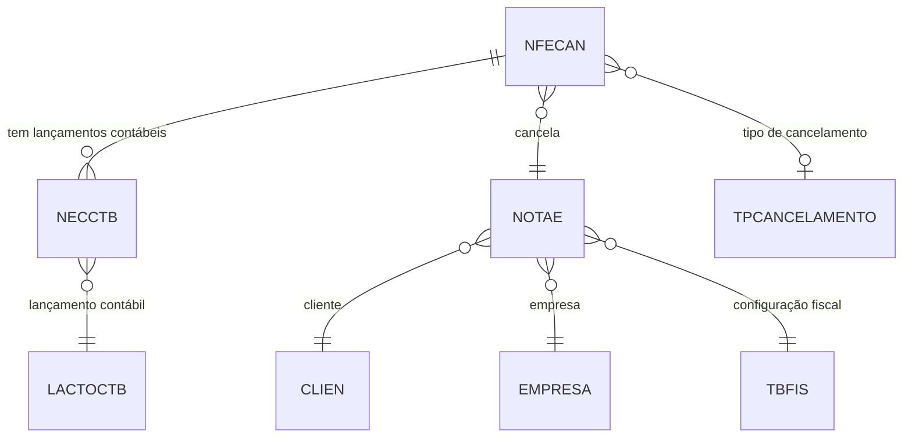

# NFECAN - Documentação Completa de Relacionamentos

## 📊 Informações Gerais

- **Nome da Tabela**: NFECAN (Nota Fiscal Eletrônica - Cancelamento)
- **Total de Registros**: 35
- **Total de Colunas**: 5
- **Chave Primária**: NFECODIGO, EMPCODIGO (composite)
- **Chaves Estrangeiras**: 3
- **Índices**: 0
- **Tabelas Dependentes**: 1 (NECCTB)
- **Banco de Dados**: Firebird

## 📝 Descrição

**NFECAN** é a tabela que registra os cancelamentos de Notas Fiscais Eletrônicas (NF-e). Ela armazena informações sobre quando e por que motivo uma NF-e foi cancelada, mantendo o histórico de cancelamentos para fins de auditoria e conformidade fiscal.

Com apenas **35 registros**, esta tabela representa um volume baixo de cancelamentos, o que indica uma boa gestão fiscal ou um sistema relativamente novo. Cada registro representa um cancelamento de uma NF-e específica, vinculado ao tipo de cancelamento através da tabela `TPCANCELAMENTO`.

Esta tabela é essencial para:
- **Auditoria Fiscal**: Rastreamento de cancelamentos de NF-e
- **Conformidade Legal**: Atendimento às exigências da Receita Federal
- **Integração Contábil**: Vinculação com lançamentos contábeis através de `NECCTB`

---

## 🔑 Estrutura de Colunas

### Identificação e Controle
| Coluna | Tipo | Descrição |
|--------|------|-----------|
| **NFECODIGO** 🔑 🔗 | INT | Código da NF-e cancelada (PK, FK → NOTAE) |
| **EMPCODIGO** 🔑 🔗 | INT | Código da empresa (PK, FK → NOTAE) |
| **TPNCODIGO** 🔗 | INT | Código do tipo de cancelamento (FK → TPCANCELAMENTO) |

### Temporal e Histórico
| Coluna | Tipo | Descrição |
|--------|------|-----------|
| **NFECDATA** | TIMESTAMP | Data do cancelamento |
| **NFECHISTORICO** | VARCHAR(37) | Histórico/observações do cancelamento |

---

## 🔗 Relacionamentos - Nível 1 (Diretos)

### NOTAE - Nota Fiscal Eletrônica (FK Obrigatória)
**Volume:** 204.952 registros

**Relacionamento:**
```
NFECAN.NFECODIGO → NOTAE.NFECODIGO (N:1) [FK: NOTAE_NFECAN]
NFECAN.EMPCODIGO → NOTAE.EMPCODIGO (N:1) [FK: NOTAE_NFECAN]
```

**Descrição:** Cada cancelamento está vinculado a uma NF-e específica. O relacionamento utiliza chave composta (`NFECODIGO`, `EMPCODIGO`) para garantir unicidade por empresa.

**Proporção:** ~0.017% das NF-e foram canceladas (35 de 204.952)

**Campos importantes em NOTAE:**
- `NFENRNOTA` - Número da nota fiscal
- `NFEDTEMIS` - Data de emissão
- `NFESIT` - Situação da NF-e
- `CLICODIGO` - Cliente relacionado

---

### TPCANCELAMENTO - Tipo de Cancelamento (FK Opcional)
**Volume:** 10 registros

**Relacionamento:**
```
NFECAN.TPNCODIGO → TPCANCELAMENTO.TPNCODIGO (N:1) [FK: TPCANCELAMENTO_NFECAN]
```

**Descrição:** Define o motivo/tipo do cancelamento. Esta tabela mestre contém os diferentes tipos de cancelamento possíveis no sistema.

**Valores Típicos:**
- Cancelamento por solicitação do cliente
- Cancelamento por erro de digitação
- Cancelamento por substituição
- Cancelamento por determinação judicial
- Outros motivos administrativos

---

## 🔗 Relacionamentos - Nível 2 (Indiretos)

### Através de NOTAE

#### CLIEN - Cliente
```
NFECAN → NOTAE → CLIEN
```
**Descrição:** Permite identificar qual cliente estava relacionado à NF-e cancelada.

#### EMPRESA - Empresa
```
NFECAN → NOTAE → EMPRESA
```
**Descrição:** Identifica a empresa que emitiu a NF-e cancelada.

#### TBFIS - Tabela Fiscal
```
NFECAN → NOTAE → TBFIS (via FISCODIGO1/FISCODIGO2)
```
**Descrição:** Permite identificar a configuração fiscal utilizada na NF-e cancelada.

---

## 📊 Tabelas que Referenciam NFECAN

### NECCTB - Lançamento Contábil de Cancelamento
**Volume:** 0 registros

**Relacionamento:**
```
NECCTB.NFECODIGO → NFECAN.NFECODIGO (N:1) [FK: NFECAN_NECCTB]
NECCTB.EMPCODIGO → NFECAN.EMPCODIGO (N:1) [FK: NFECAN_NECCTB]
```

**Descrição:** Vincula o cancelamento da NF-e aos lançamentos contábeis correspondentes. Atualmente sem registros, mas preparado para integração contábil.

**Campos em NECCTB:**
- `LACCODIGO` - Código do lançamento contábil
- `EMPCTB` - Empresa contábil
- `NECLTIPO` - Tipo do lançamento

---

## 🗺️ Diagrama de Relacionamentos



---

## 💡 Casos de Uso Práticos

### 1. Consultar Cancelamentos de uma NF-e Específica

```sql
SELECT 
    nfec.NFECODIGO,
    nfec.EMPCODIGO,
    nfec.NFECDATA,
    nfec.NFECHISTORICO,
    tpc.TPNDESCRICAO AS TIPO_CANCELAMENTO,
    nfe.NFENRNOTA,
    nfe.NFEDTEMIS,
    cli.CLINOME
FROM NFECAN nfec
INNER JOIN NOTAE nfe 
    ON nfec.NFECODIGO = nfe.NFECODIGO 
    AND nfec.EMPCODIGO = nfe.EMPCODIGO
LEFT JOIN TPCANCELAMENTO tpc 
    ON nfec.TPNCODIGO = tpc.TPNCODIGO
LEFT JOIN CLIEN cli 
    ON nfe.CLICODIGO = cli.CLICODIGO
WHERE nfec.NFECODIGO = :nfecodigo
    AND nfec.EMPCODIGO = :empcodigo;
```

### 2. Relatório de Cancelamentos por Período

```sql
SELECT 
    DATE(nfec.NFECDATA) AS DATA_CANCELAMENTO,
    COUNT(*) AS TOTAL_CANCELAMENTOS,
    tpc.TPNDESCRICAO AS TIPO_CANCELAMENTO,
    emp.EMPNOME AS EMPRESA
FROM NFECAN nfec
INNER JOIN NOTAE nfe 
    ON nfec.NFECODIGO = nfe.NFECODIGO 
    AND nfec.EMPCODIGO = nfe.EMPCODIGO
LEFT JOIN TPCANCELAMENTO tpc 
    ON nfec.TPNCODIGO = tpc.TPNCODIGO
INNER JOIN EMPRESA emp 
    ON nfec.EMPCODIGO = emp.EMPCODIGO
WHERE nfec.NFECDATA BETWEEN :data_inicio AND :data_fim
GROUP BY DATE(nfec.NFECDATA), tpc.TPNDESCRICAO, emp.EMPNOME
ORDER BY DATA_CANCELAMENTO DESC;
```

### 3. Verificar Cancelamentos com Lançamentos Contábeis

```sql
SELECT 
    nfec.NFECODIGO,
    nfec.NFECDATA,
    nfec.NFECHISTORICO,
    nec.LACCODIGO,
    nec.NECLTIPO,
    lct.LACDESCRICAO
FROM NFECAN nfec
LEFT JOIN NECCTB nec 
    ON nfec.NFECODIGO = nec.NFECODIGO 
    AND nfec.EMPCODIGO = nec.EMPCODIGO
LEFT JOIN LACTOCTB lct 
    ON nec.LACCODIGO = lct.LACCODIGO 
    AND nec.EMPCTB = lct.EMPCODIGO
WHERE nfec.NFECODIGO = :nfecodigo;
```

### 4. Cancelamentos por Tipo e Empresa

```sql
SELECT 
    emp.EMPNOME,
    tpc.TPNDESCRICAO AS TIPO_CANCELAMENTO,
    COUNT(*) AS QUANTIDADE,
    MIN(nfec.NFECDATA) AS PRIMEIRO_CANCELAMENTO,
    MAX(nfec.NFECDATA) AS ULTIMO_CANCELAMENTO
FROM NFECAN nfec
INNER JOIN EMPRESA emp 
    ON nfec.EMPCODIGO = emp.EMPCODIGO
LEFT JOIN TPCANCELAMENTO tpc 
    ON nfec.TPNCODIGO = tpc.TPNCODIGO
GROUP BY emp.EMPNOME, tpc.TPNDESCRICAO
ORDER BY emp.EMPNOME, QUANTIDADE DESC;
```

---

## 📈 Estatísticas e Insights

### Volume de Dados
- **Total de Cancelamentos**: 35 registros
- **Taxa de Cancelamento**: ~0.017% das NF-e emitidas
- **Média**: Aproximadamente 1 cancelamento para cada 5.856 NF-e emitidas

### Análise Temporal
- A tabela permite análise temporal através do campo `NFECDATA`
- Útil para identificar padrões de cancelamento ao longo do tempo

### Integração Contábil
- **NECCTB**: Preparado para integração contábil (0 registros atualmente)
- Permite rastreamento completo do impacto contábil dos cancelamentos

---

## ⚡ Performance e Otimização

### Índices Recomendados

```sql
-- Índice para consultas por NF-e
CREATE INDEX IDX_NFECAN_NFE ON NFECAN (NFECODIGO, EMPCODIGO);

-- Índice para consultas por data
CREATE INDEX IDX_NFECAN_DATA ON NFECAN (NFECDATA);

-- Índice para consultas por tipo de cancelamento
CREATE INDEX IDX_NFECAN_TPN ON NFECAN (TPNCODIGO);
```

### Otimizações de Consulta

1. **Sempre usar chave composta completa** nas consultas:
   ```sql
   WHERE NFECODIGO = :nfecodigo AND EMPCODIGO = :empcodigo
   ```

2. **Usar JOIN explícito** ao invés de subconsultas para melhor performance

3. **Filtrar por data** quando possível para reduzir o conjunto de resultados

---

## 🔒 Integridade de Dados

### Validações Importantes

1. **Chave Composta**: `NFECODIGO` + `EMPCODIGO` deve existir em `NOTAE`
2. **Tipo de Cancelamento**: `TPNCODIGO` deve existir em `TPCANCELAMENTO` (se informado)
3. **Data**: `NFECDATA` deve ser posterior à data de emissão da NF-e (`NOTAE.NFEDTEMIS`)

### Constraints Recomendados

```sql
-- Verificar se a NF-e existe antes de cancelar
ALTER TABLE NFECAN
ADD CONSTRAINT CHK_NFECAN_NFE_EXISTS
CHECK (
    EXISTS (
        SELECT 1 FROM NOTAE 
        WHERE NFECODIGO = NFECAN.NFECODIGO 
        AND EMPCODIGO = NFECAN.EMPCODIGO
    )
);

-- Verificar se a data de cancelamento é posterior à emissão
ALTER TABLE NFECAN
ADD CONSTRAINT CHK_NFECAN_DATA_VALIDA
CHECK (
    NFECDATA >= (
        SELECT NFEDTEMIS FROM NOTAE 
        WHERE NFECODIGO = NFECAN.NFECODIGO 
        AND EMPCODIGO = NFECAN.EMPCODIGO
    )
);
```

---

## 🔄 Fluxo Completo de Relacionamentos

### Exemplo: Cancelamento Completo com Todos os Dados

```sql
SELECT 
    -- Dados do Cancelamento
    nfec.NFECODIGO,
    nfec.NFECDATA,
    nfec.NFECHISTORICO,
    tpc.TPNDESCRICAO AS TIPO_CANCELAMENTO,
    
    -- Dados da NF-e
    nfe.NFENRNOTA,
    nfe.NFEDTEMIS,
    nfe.NFESIT,
    
    -- Dados do Cliente
    cli.CLINOME,
    cli.CLICGC,
    
    -- Dados da Empresa
    emp.EMPNOME,
    emp.EMPCGC,
    
    -- Dados Contábeis (se existirem)
    nec.LACCODIGO,
    lct.LACDESCRICAO AS LANCAMENTO_CONTABIL
    
FROM NFECAN nfec
INNER JOIN NOTAE nfe 
    ON nfec.NFECODIGO = nfe.NFECODIGO 
    AND nfec.EMPCODIGO = nfe.EMPCODIGO
LEFT JOIN TPCANCELAMENTO tpc 
    ON nfec.TPNCODIGO = tpc.TPNCODIGO
LEFT JOIN CLIEN cli 
    ON nfe.CLICODIGO = cli.CLICODIGO
LEFT JOIN EMPRESA emp 
    ON nfec.EMPCODIGO = emp.EMPCODIGO
LEFT JOIN NECCTB nec 
    ON nfec.NFECODIGO = nec.NFECODIGO 
    AND nfec.EMPCODIGO = nec.EMPCODIGO
LEFT JOIN LACTOCTB lct 
    ON nec.LACCODIGO = lct.LACCODIGO 
    AND nec.EMPCTB = lct.EMPCODIGO
WHERE nfec.NFECODIGO = :nfecodigo
    AND nfec.EMPCODIGO = :empcodigo;
```

---

## 📚 Integração com Aplicação (Laravel)

### Model NFECAN

```php
<?php

namespace App\Models;

use Illuminate\Database\Eloquent\Model;
use Illuminate\Database\Eloquent\Relations\BelongsTo;

final class NFECAN extends Model
{
    protected $table = 'NFECAN';
    
    protected $primaryKey = ['NFECODIGO', 'EMPCODIGO'];
    
    public $incrementing = false;
    
    protected $fillable = [
        'NFECODIGO',
        'EMPCODIGO',
        'NFECDATA',
        'NFECHISTORICO',
        'TPNCODIGO',
    ];
    
    protected $casts = [
        'NFECDATA' => 'datetime',
    ];
    
    /**
     * Relacionamento com NOTAE
     */
    public function notae(): BelongsTo
    {
        return $this->belongsTo(NOTAE::class, ['NFECODIGO', 'EMPCODIGO'], ['NFECODIGO', 'EMPCODIGO']);
    }
    
    /**
     * Relacionamento com TPCANCELAMENTO
     */
    public function tipoCancelamento(): BelongsTo
    {
        return $this->belongsTo(TPCANCELAMENTO::class, 'TPNCODIGO', 'TPNCODIGO');
    }
    
    /**
     * Relacionamento com NECCTB (lançamentos contábeis)
     */
    public function lancamentosContabeis(): HasMany
    {
        return $this->hasMany(NECCTB::class, ['NFECODIGO', 'EMPCODIGO'], ['NFECODIGO', 'EMPCODIGO']);
    }
}
```

---

## ✅ Boas Práticas

### Design
1. **Sempre registrar o histórico** do cancelamento no campo `NFECHISTORICO`
2. **Informar o tipo de cancelamento** (`TPNCODIGO`) para melhor rastreabilidade
3. **Manter consistência** entre a data de cancelamento e a data de emissão da NF-e

### Performance
1. **Usar índices** nas consultas frequentes (NFECODIGO, EMPCODIGO, NFECDATA)
2. **Evitar SELECT *** em consultas, especificar apenas campos necessários
3. **Usar filtros de data** para reduzir o volume de dados processados

### Integridade
1. **Validar existência da NF-e** antes de criar registro de cancelamento
2. **Verificar data** de cancelamento em relação à data de emissão
3. **Manter referência** ao tipo de cancelamento para auditoria

### Manutenção
1. **Monitorar taxa de cancelamento** para identificar problemas operacionais
2. **Revisar periodicamente** os tipos de cancelamento mais frequentes
3. **Garantir integração contábil** através de `NECCTB` quando necessário

---

**Documentação gerada em**: 2025-01-27

**Banco de dados**: Firebird

