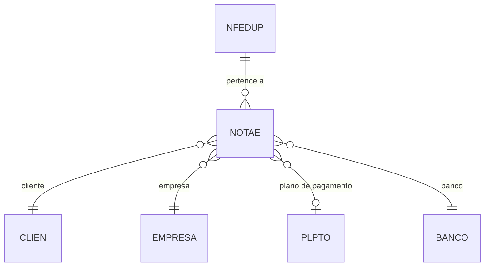

# NFEDUP - Documentação Completa de Relacionamentos

## 📊 Informações Gerais

- **Nome da Tabela**: NFEDUP (Nota Fiscal Eletrônica - Duplicatas)
- **Total de Registros**: 227.404
- **Total de Colunas**: 5
- **Chave Primária**: NFECODIGO, NFEDSEQ, EMPCODIGO (composite)
- **Chaves Estrangeiras**: 2 (ambas para NOTAE)
- **Índices**: 0
- **Tabelas Dependentes**: 0
- **Banco de Dados**: Firebird

## 📝 Descrição

**NFEDUP** é a tabela que armazena as duplicatas (parcelas de pagamento) das Notas Fiscais Eletrônicas (NF-e). Cada registro representa uma parcela de pagamento vinculada a uma NF-e específica, contendo informações sobre o valor e a data de vencimento.

Com **227.404 registros**, esta tabela representa um volume significativo de parcelas de pagamento, indicando que muitas NF-e são parceladas. A média é de aproximadamente **1.1 duplicatas por NF-e** (227.404 / 204.952), sugerindo que a maioria das NF-e possui apenas uma parcela, mas algumas têm múltiplas.

Esta tabela é essencial para:
- **Gestão Financeira**: Controle de recebimentos e vencimentos
- **Conformidade Fiscal**: Registro de condições de pagamento na NF-e
- **Integração Bancária**: Vinculação com extratos e conciliações bancárias

---

## 🔑 Estrutura de Colunas

### Identificação e Controle
| Coluna | Tipo | Descrição |
|--------|------|-----------|
| **NFECODIGO** 🔑 🔗 | INT | Código da NF-e (PK, FK → NOTAE) |
| **NFEDSEQ** 🔑 | INT | Sequencial da duplicata (PK) |
| **EMPCODIGO** 🔑 🔗 | INT | Código da empresa (PK, FK → NOTAE) |

### Valores e Datas
| Coluna | Tipo | Descrição |
|--------|------|-----------|
| **NFEDDTVENCTO** | DATE | Data de vencimento da duplicata |
| **NFEDVALOR** | DECIMAL(16,2) | Valor da duplicata |

---

## 🔗 Relacionamentos - Nível 1 (Diretos)

### NOTAE - Nota Fiscal Eletrônica (FK Obrigatória)
**Volume:** 204.952 registros

**Relacionamento:**
```
NFEDUP.NFECODIGO → NOTAE.NFECODIGO (N:1) [FK: NOTAE_NFEDUP]
NFEDUP.EMPCODIGO → NOTAE.EMPCODIGO (N:1) [FK: NOTAE_NFEDUP]
```

**Descrição:** Cada duplicata está vinculada a uma NF-e específica. O relacionamento utiliza chave composta (`NFECODIGO`, `EMPCODIGO`) para garantir unicidade por empresa.

**Proporção:** ~1.11 duplicatas por NF-e em média (227.404 / 204.952)

**Campos importantes em NOTAE:**
- `NFENRNOTA` - Número da nota fiscal
- `NFEDTEMIS` - Data de emissão
- `NFEVRTOTAL` - Valor total da NF-e
- `CLICODIGO` - Cliente relacionado
- `PGTCODIGO` - Plano de pagamento

---

## 🔗 Relacionamentos - Nível 2 (Indiretos)

### Através de NOTAE

#### CLIEN - Cliente
```
NFEDUP → NOTAE → CLIEN
```
**Descrição:** Permite identificar qual cliente está relacionado às duplicatas da NF-e.

#### EMPRESA - Empresa
```
NFEDUP → NOTAE → EMPRESA
```
**Descrição:** Identifica a empresa que emitiu a NF-e e suas duplicatas.

#### PLPTO - Plano de Pagamento
```
NFEDUP → NOTAE → PLPTO (via PGTCODIGO)
```
**Descrição:** Permite identificar o plano de pagamento utilizado na NF-e, que define como as duplicatas foram geradas.

---

## 🗺️ Diagrama de Relacionamentos



---

## 💡 Casos de Uso Práticos

### 1. Consultar Duplicatas de uma NF-e

```sql
SELECT 
    nfed.NFECODIGO,
    nfed.NFEDSEQ,
    nfed.NFEDDTVENCTO,
    nfed.NFEDVALOR,
    nfe.NFENRNOTA,
    nfe.NFEDTEMIS,
    cli.CLINOME
FROM NFEDUP nfed
INNER JOIN NOTAE nfe 
    ON nfed.NFECODIGO = nfe.NFECODIGO 
    AND nfed.EMPCODIGO = nfe.EMPCODIGO
LEFT JOIN CLIEN cli 
    ON nfe.CLICODIGO = cli.CLICODIGO
WHERE nfed.NFECODIGO = :nfecodigo
    AND nfed.EMPCODIGO = :empcodigo
ORDER BY nfed.NFEDSEQ;
```

### 2. Relatório de Duplicatas Vencidas

```sql
SELECT 
    nfed.NFECODIGO,
    nfed.NFEDSEQ,
    nfed.NFEDDTVENCTO,
    nfed.NFEDVALOR,
    nfe.NFENRNOTA,
    cli.CLINOME,
    emp.EMPNOME,
    CASE 
        WHEN nfed.NFEDDTVENCTO < CURRENT_DATE THEN 'VENCIDA'
        WHEN nfed.NFEDDTVENCTO BETWEEN CURRENT_DATE AND CURRENT_DATE + 7 THEN 'VENCE EM 7 DIAS'
        ELSE 'A VENCER'
    END AS SITUACAO
FROM NFEDUP nfed
INNER JOIN NOTAE nfe 
    ON nfed.NFECODIGO = nfe.NFECODIGO 
    AND nfed.EMPCODIGO = nfe.EMPCODIGO
LEFT JOIN CLIEN cli 
    ON nfe.CLICODIGO = cli.CLICODIGO
LEFT JOIN EMPRESA emp 
    ON nfed.EMPCODIGO = emp.EMPCODIGO
WHERE nfed.NFEDDTVENCTO <= CURRENT_DATE + 30
ORDER BY nfed.NFEDDTVENCTO, nfed.NFEDVALOR DESC;
```

### 3. Total de Duplicatas por NF-e

```sql
SELECT 
    nfe.NFECODIGO,
    nfe.NFENRNOTA,
    COUNT(nfed.NFEDSEQ) AS QTD_DUPLICATAS,
    SUM(nfed.NFEDVALOR) AS VALOR_TOTAL_DUPLICATAS,
    nfe.NFEVRTOTAL AS VALOR_TOTAL_NFE,
    CASE 
        WHEN ABS(SUM(nfed.NFEDVALOR) - nfe.NFEVRTOTAL) < 0.01 THEN 'OK'
        ELSE 'DIVERGENCIA'
    END AS STATUS_VALOR
FROM NOTAE nfe
LEFT JOIN NFEDUP nfed 
    ON nfe.NFECODIGO = nfed.NFECODIGO 
    AND nfe.EMPCODIGO = nfed.EMPCODIGO
GROUP BY nfe.NFECODIGO, nfe.NFENRNOTA, nfe.NFEVRTOTAL
HAVING ABS(SUM(COALESCE(nfed.NFEDVALOR, 0)) - nfe.NFEVRTOTAL) >= 0.01
ORDER BY ABS(SUM(COALESCE(nfed.NFEDVALOR, 0)) - nfe.NFEVRTOTAL) DESC;
```

### 4. Duplicatas por Período de Vencimento

```sql
SELECT 
    DATE_TRUNC('MONTH', nfed.NFEDDTVENCTO) AS MES_VENCIMENTO,
    COUNT(*) AS QTD_DUPLICATAS,
    SUM(nfed.NFEDVALOR) AS VALOR_TOTAL,
    AVG(nfed.NFEDVALOR) AS VALOR_MEDIO,
    MIN(nfed.NFEDVALOR) AS VALOR_MINIMO,
    MAX(nfed.NFEDVALOR) AS VALOR_MAXIMO
FROM NFEDUP nfed
WHERE nfed.NFEDDTVENCTO BETWEEN :data_inicio AND :data_fim
GROUP BY DATE_TRUNC('MONTH', nfed.NFEDDTVENCTO)
ORDER BY MES_VENCIMENTO;
```

---

## 📈 Estatísticas e Insights

### Volume de Dados
- **Total de Duplicatas**: 227.404 registros
- **Média por NF-e**: ~1.11 duplicatas por NF-e
- **Distribuição**: A maioria das NF-e possui 1 duplicata, mas algumas têm múltiplas parcelas

### Análise Financeira
- Permite análise de fluxo de caixa através das datas de vencimento
- Facilita identificação de concentração de recebimentos em períodos específicos
- Útil para planejamento financeiro e gestão de contas a receber

---

## ⚡ Performance e Otimização

### Índices Recomendados

```sql
-- Índice para consultas por NF-e
CREATE INDEX IDX_NFEDUP_NFE ON NFEDUP (NFECODIGO, EMPCODIGO, NFEDSEQ);

-- Índice para consultas por data de vencimento
CREATE INDEX IDX_NFEDUP_VENCTO ON NFEDUP (NFEDDTVENCTO);

-- Índice composto para relatórios financeiros
CREATE INDEX IDX_NFEDUP_VENCTO_VALOR ON NFEDUP (NFEDDTVENCTO, NFEDVALOR);
```

### Otimizações de Consulta

1. **Sempre usar chave composta completa** nas consultas:
   ```sql
   WHERE NFECODIGO = :nfecodigo AND EMPCODIGO = :empcodigo
   ```

2. **Usar filtros de data** para reduzir o conjunto de resultados em relatórios temporais

3. **Agregar valores** no banco ao invés de processar em aplicação para melhor performance

---

## 🔒 Integridade de Dados

### Validações Importantes

1. **Chave Composta**: `NFECODIGO` + `EMPCODIGO` deve existir em `NOTAE`
2. **Soma das Duplicatas**: A soma de `NFEDVALOR` deve ser igual a `NOTAE.NFEVRTOTAL`
3. **Sequencial**: `NFEDSEQ` deve ser único por NF-e e sequencial (1, 2, 3...)
4. **Data de Vencimento**: `NFEDDTVENCTO` deve ser posterior à data de emissão da NF-e

### Constraints Recomendados

```sql
-- Verificar se a NF-e existe antes de criar duplicata
ALTER TABLE NFEDUP
ADD CONSTRAINT CHK_NFEDUP_NFE_EXISTS
CHECK (
    EXISTS (
        SELECT 1 FROM NOTAE 
        WHERE NFECODIGO = NFEDUP.NFECODIGO 
        AND EMPCODIGO = NFEDUP.EMPCODIGO
    )
);

-- Verificar se a soma das duplicatas é igual ao valor total da NF-e
-- (Esta validação deve ser feita via trigger ou aplicação)
```

---

## 📚 Integração com Aplicação (Laravel)

### Model NFEDUP

```php
<?php

namespace App\Models;

use Illuminate\Database\Eloquent\Model;
use Illuminate\Database\Eloquent\Relations\BelongsTo;

final class NFEDUP extends Model
{
    protected $table = 'NFEDUP';
    
    protected $primaryKey = ['NFECODIGO', 'NFEDSEQ', 'EMPCODIGO'];
    
    public $incrementing = false;
    
    protected $fillable = [
        'NFECODIGO',
        'NFEDSEQ',
        'EMPCODIGO',
        'NFEDDTVENCTO',
        'NFEDVALOR',
    ];
    
    protected $casts = [
        'NFEDDTVENCTO' => 'date',
        'NFEDVALOR' => 'decimal:2',
    ];
    
    /**
     * Relacionamento com NOTAE
     */
    public function notae(): BelongsTo
    {
        return $this->belongsTo(NOTAE::class, ['NFECODIGO', 'EMPCODIGO'], ['NFECODIGO', 'EMPCODIGO']);
    }
    
    /**
     * Scope para duplicatas vencidas
     */
    public function scopeVencidas($query)
    {
        return $query->where('NFEDDTVENCTO', '<', now());
    }
    
    /**
     * Scope para duplicatas a vencer
     */
    public function scopeAVencer($query, $dias = 30)
    {
        return $query->whereBetween('NFEDDTVENCTO', [now(), now()->addDays($dias)]);
    }
}
```

---

## ✅ Boas Práticas

### Design
1. **Manter sequencial único** por NF-e (`NFEDSEQ`: 1, 2, 3...)
2. **Validar soma** das duplicatas igual ao valor total da NF-e
3. **Data de vencimento** deve ser posterior à data de emissão

### Performance
1. **Usar índices** nas consultas frequentes (NFECODIGO, EMPCODIGO, NFEDDTVENCTO)
2. **Evitar SELECT *** em consultas, especificar apenas campos necessários
3. **Usar filtros de data** para reduzir o volume de dados processados

### Integridade
1. **Validar existência da NF-e** antes de criar duplicatas
2. **Verificar soma** das duplicatas em relação ao valor total
3. **Manter sequencial** correto ao inserir novas duplicatas

### Manutenção
1. **Monitorar divergências** entre soma de duplicatas e valor total da NF-e
2. **Revisar periodicamente** duplicatas vencidas não recebidas
3. **Garantir consistência** entre duplicatas e plano de pagamento da NF-e

---

**Documentação gerada em**: 2025-01-27

**Banco de dados**: Firebird

