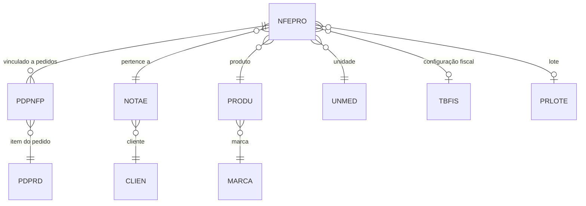

# NFEPRO - Documentação Completa de Relacionamentos

## 📊 Informações Gerais

- **Nome da Tabela**: NFEPRO (Nota Fiscal Eletrônica - Produtos)
- **Total de Registros**: 1.913.065
- **Total de Colunas**: 196
- **Chave Primária**: NFECODIGO, NFESEQ, PROCODIGO, EMPCODIGO (composite)
- **Chaves Estrangeiras**: 8
- **Índices**: 0
- **Tabelas Dependentes**: 1 (PDPNFP)
- **Banco de Dados**: Firebird

## 📝 Descrição

**NFEPRO** é a tabela que armazena os itens de produtos das Notas Fiscais Eletrônicas (NF-e). Com **1.9 milhões de registros** e **196 colunas**, é uma das tabelas mais complexas e volumosas do sistema, contendo informações detalhadas sobre cada produto incluído em uma NF-e, incluindo cálculos tributários completos (ICMS, IPI, PIS, COFINS, CSLL, etc.) em múltiplas bases de cálculo.

Esta tabela é essencial para:
- **Controle Fiscal**: Detalhamento completo de impostos por item
- **Gestão de Estoque**: Rastreamento de produtos vendidos
- **Integração com Pedidos**: Vinculação com itens de pedidos através de `PDPNFP`
- **Cálculos Tributários**: Múltiplas bases e alíquotas para diferentes impostos

---

## 🔑 Estrutura de Colunas (Principais)

### Identificação
| Coluna | Tipo | Descrição |
|--------|------|-----------|
| **NFECODIGO** 🔑 🔗 | INT | Código da NF-e (PK, FK → NOTAE) |
| **NFESEQ** 🔑 | INT | Sequencial do item (PK) |
| **PROCODIGO** 🔑 🔗 | VARCHAR(14) | Código do produto (PK, FK → PRODU) |
| **EMPCODIGO** 🔑 🔗 | INT | Código da empresa (PK, FK → NOTAE) |

### Informações do Produto
| Coluna | Tipo | Descrição |
|--------|------|-----------|
| **NFEPDESCRICAO** | VARCHAR(37) | Descrição do produto |
| **NFEPQTDADE** | DECIMAL(27,4) | Quantidade |
| **UNCODIGO** 🔗 | VARCHAR(14) | Unidade de medida (FK → UNMED) |
| **NFEPPCOUNIT** | DECIMAL(27,6) | Preço unitário |
| **NFEPUNITLIQUIDO** | DECIMAL(27,6) | Preço unitário líquido |

### Custos
| Coluna | Tipo | Descrição |
|--------|------|-----------|
| **NFEPPCOCUSTO** | DECIMAL(27,6) | Preço de custo |
| **NFEPCUSTOTOTAL** | DECIMAL(27,2) | Custo total |
| **NFEPCUSTOREAL** | DECIMAL(27,6) | Custo real |

### Tributação (ICMS, IPI, PIS, COFINS, CSLL)
A tabela possui campos para múltiplas bases de cálculo e alíquotas:
- ICMS: Base, Alíquota, Valor, Isento, Outros
- IPI: Base, Alíquota, Valor, Isento, Outros
- PIS: Base, Alíquota, Valor
- COFINS: Base, Alíquota, Valor
- CSLL: Base, Alíquota, Valor
- Campos com sufixo "2" para segunda base de cálculo

### Lote e Fiscal
| Coluna | Tipo | Descrição |
|--------|------|-----------|
| **PRLLOTE** 🔗 | VARCHAR(14) | Lote do produto (FK → PRLOTE) |
| **FISCODIGO** 🔗 | VARCHAR(14) | Código fiscal (FK → TBFIS) |
| **NFEPSITTRIB** | VARCHAR(14) | Situação tributária |
| **NFEPSITTRIBIPI** | VARCHAR(14) | Situação tributária IPI |
| **NFEPSITTRIBPIS** | VARCHAR(14) | Situação tributária PIS |
| **NFEPSITTRIBCOFINS** | VARCHAR(14) | Situação tributária COFINS |

---

## 🔗 Relacionamentos - Nível 1 (Diretos)

### NOTAE - Nota Fiscal Eletrônica (FK Obrigatória)
**Volume:** 204.952 registros

**Relacionamento:**
```
NFEPRO.NFECODIGO → NOTAE.NFECODIGO (N:1) [FK: NOTAE_NFEPRO]
NFEPRO.EMPCODIGO → NOTAE.EMPCODIGO (N:1) [FK: NOTAE_NFEPRO]
```

**Proporção:** ~9.3 itens por NF-e em média (1.913.065 / 204.952)

---

### PRODU - Produto (FK Obrigatória)
**Volume:** 178.187 registros

**Relacionamento:**
```
NFEPRO.PROCODIGO → PRODU.PROCODIGO (N:1) [FK: PRODU_NEPRO]
```

**Descrição:** Cada item está vinculado a um produto do cadastro.

---

### UNMED - Unidade de Medida (FK Obrigatória)
**Volume:** 130 registros

**Relacionamento:**
```
NFEPRO.UNCODIGO → UNMED.UNCODIGO (N:1) [FK: UNMED_NFEPRO]
```

---

### TBFIS - Tabela Fiscal (FK Opcional)
**Volume:** Varia conforme configuração fiscal

**Relacionamento:**
```
NFEPRO.FISCODIGO → TBFIS.FISCODIGO (N:1) [FK: TBFIS_NFEPRO]
```

---

### PRLOTE - Lote do Produto (FK Opcional)
**Volume:** 0 registros (tabela preparada)

**Relacionamento:**
```
NFEPRO.PROCODIGO → PRLOTE.PROCODIGO (N:1) [FK: PRLLOTE_NFEPRO]
NFEPRO.EMPCODIGO → PRLOTE.EMPCODIGO (N:1) [FK: PRLLOTE_NFEPRO]
NFEPRO.PRLLOTE → PRLOTE.PRLLOTE (N:1) [FK: PRLLOTE_NFEPRO]
```

---

## 📊 Tabelas que Referenciam NFEPRO

### PDPNFP - Pedido x NF-e Produto
**Volume:** 59.723 registros

**Relacionamento:**
```
PDPNFP.NFECODIGO → NFEPRO.NFECODIGO (N:1)
PDPNFP.NFESEQ → NFEPRO.NFESEQ (N:1)
PDPNFP.PROCODIGO → NFEPRO.PROCODIGO (N:1)
PDPNFP.EMPCODIGO → NFEPRO.EMPCODIGO (N:1)
```

**Descrição:** Vincula itens de pedidos aos itens de NF-e.

---

## 🗺️ Diagrama de Relacionamentos



---

## 💡 Casos de Uso Práticos

### 1. Consultar Itens de uma NF-e

```sql
SELECT 
    nfep.NFECODIGO,
    nfep.NFESEQ,
    nfep.PROCODIGO,
    nfep.NFEPDESCRICAO,
    nfep.NFEPQTDADE,
    nfep.NFEPPCOUNIT,
    nfep.NFEPUNITLIQUIDO,
    prod.PRODESCRICAO,
    un.UNDESCRICAO
FROM NFEPRO nfep
INNER JOIN PRODU prod ON nfep.PROCODIGO = prod.PROCODIGO
LEFT JOIN UNMED un ON nfep.UNCODIGO = un.UNCODIGO
WHERE nfep.NFECODIGO = :nfecodigo
    AND nfep.EMPCODIGO = :empcodigo
ORDER BY nfep.NFESEQ;
```

### 2. Relatório de Produtos Mais Vendidos

```sql
SELECT 
    nfep.PROCODIGO,
    prod.PRODESCRICAO,
    SUM(nfep.NFEPQTDADE) AS QTDADE_TOTAL,
    SUM(nfep.NFEPUNITLIQUIDO * nfep.NFEPQTDADE) AS VALOR_TOTAL,
    COUNT(DISTINCT nfep.NFECODIGO) AS QTD_NFES
FROM NFEPRO nfep
INNER JOIN PRODU prod ON nfep.PROCODIGO = prod.PROCODIGO
INNER JOIN NOTAE nfe ON nfep.NFECODIGO = nfe.NFECODIGO 
    AND nfep.EMPCODIGO = nfe.EMPCODIGO
WHERE nfe.NFEDTEMIS BETWEEN :data_inicio AND :data_fim
GROUP BY nfep.PROCODIGO, prod.PRODESCRICAO
ORDER BY VALOR_TOTAL DESC
ROWS 100;
```

### 3. Análise Tributária por Item

```sql
SELECT 
    nfep.PROCODIGO,
    nfep.NFEPDESCRICAO,
    nfep.NFEPBASEICMS,
    nfep.NFEPVRICMS,
    nfep.NFEPBASEIPI,
    nfep.NFEPVRIPI,
    nfep.NFEPBASEPIS,
    nfep.NFEPVRPIS,
    nfep.NFEPBASECOFINS,
    nfep.NFEPVRCOFINS,
    (nfep.NFEPVRICMS + nfep.NFEPVRIPI + nfep.NFEPVRPIS + nfep.NFEPVRCOFINS) AS TOTAL_IMPOSTOS
FROM NFEPRO nfep
WHERE nfep.NFECODIGO = :nfecodigo
    AND nfep.EMPCODIGO = :empcodigo;
```

---

## ⚡ Performance e Otimização

### Índices Recomendados

```sql
-- Índice para consultas por NF-e
CREATE INDEX IDX_NFEPRO_NFE ON NFEPRO (NFECODIGO, EMPCODIGO, NFESEQ);

-- Índice para consultas por produto
CREATE INDEX IDX_NFEPRO_PRODUTO ON NFEPRO (PROCODIGO);

-- Índice para relatórios de vendas
CREATE INDEX IDX_NFEPRO_NFE_PROD ON NFEPRO (NFECODIGO, EMPCODIGO, PROCODIGO);
```

---

## 📚 Integração com Aplicação (Laravel)

### Model NFEPRO

```php
<?php

namespace App\Models;

use Illuminate\Database\Eloquent\Model;
use Illuminate\Database\Eloquent\Relations\BelongsTo;

final class NFEPRO extends Model
{
    protected $table = 'NFEPRO';
    
    protected $primaryKey = ['NFECODIGO', 'NFESEQ', 'PROCODIGO', 'EMPCODIGO'];
    
    public $incrementing = false;
    
    protected $fillable = [
        'NFECODIGO', 'NFESEQ', 'PROCODIGO', 'EMPCODIGO',
        'NFEPDESCRICAO', 'NFEPQTDADE', 'NFEPPCOUNIT',
        'UNCODIGO', 'FISCODIGO', 'PRLLOTE',
        // ... outros campos fiscais
    ];
    
    protected $casts = [
        'NFEPQTDADE' => 'decimal:4',
        'NFEPPCOUNIT' => 'decimal:6',
        'NFEPUNITLIQUIDO' => 'decimal:6',
        'NFEPVRICMS' => 'decimal:2',
        'NFEPVRIPI' => 'decimal:2',
        // ... outros casts
    ];
    
    public function notae(): BelongsTo
    {
        return $this->belongsTo(NOTAE::class, ['NFECODIGO', 'EMPCODIGO'], ['NFECODIGO', 'EMPCODIGO']);
    }
    
    public function produto(): BelongsTo
    {
        return $this->belongsTo(PRODU::class, 'PROCODIGO', 'PROCODIGO');
    }
    
    public function unidadeMedida(): BelongsTo
    {
        return $this->belongsTo(UNMED::class, 'UNCODIGO', 'UNCODIGO');
    }
}
```

---

## ✅ Boas Práticas

### Design
1. **Manter sequencial único** por NF-e (`NFESEQ`: 1, 2, 3...)
2. **Validar soma** dos valores dos itens igual ao valor total da NF-e
3. **Manter consistência** entre campos fiscais e situação tributária

### Performance
1. **Usar índices** nas consultas frequentes
2. **Evitar SELECT *** devido ao grande número de colunas
3. **Usar filtros** por NF-e ou produto para reduzir volume

### Integridade
1. **Validar existência** da NF-e e produto antes de inserir
2. **Verificar cálculos** tributários para consistência
3. **Manter referência** ao lote quando aplicável

---

**Documentação gerada em**: 2025-01-27

**Banco de dados**: Firebird

