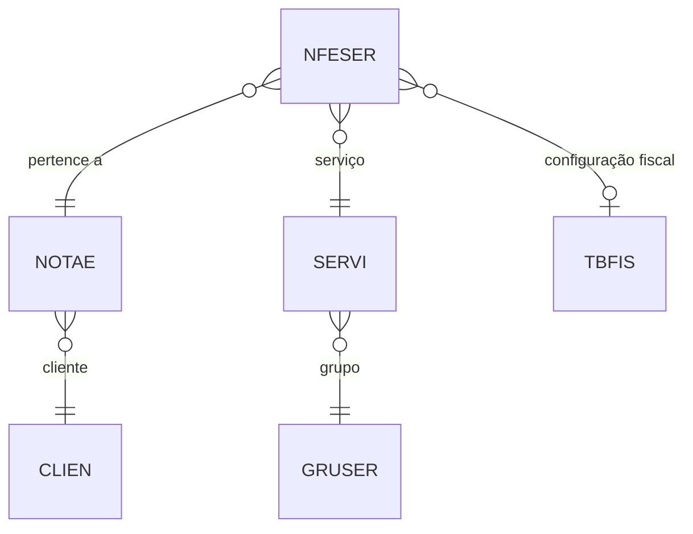

# NFESER - Documentação Completa de Relacionamentos

## 📊 Informações Gerais

- **Nome da Tabela**: NFESER (Nota Fiscal Eletrônica - Serviços)
- **Total de Registros**: 22.492
- **Total de Colunas**: 171
- **Chave Primária**: NFECODIGO, NFESSEQ, EMPCODIGO (composite)
- **Chaves Estrangeiras**: 4
- **Índices**: 0
- **Tabelas Dependentes**: 0
- **Banco de Dados**: Firebird

## 📝 Descrição

**NFESER** armazena os itens de serviços das Notas Fiscais Eletrônicas (NF-e). Com **22.492 registros** e **171 colunas**, contém informações detalhadas sobre serviços incluídos em NF-e, incluindo cálculos tributários (ISS, PIS, COFINS, CSLL, IR, INSS, IPI, ICMS quando aplicável).

Esta tabela é essencial para:
- **Controle Fiscal de Serviços**: Detalhamento de impostos sobre serviços
- **Gestão de Serviços**: Rastreamento de serviços prestados
- **Cálculos Tributários**: Múltiplas bases e alíquotas para diferentes impostos

---

## 🔑 Estrutura de Colunas (Principais)

### Identificação
| Coluna | Tipo | Descrição |
|--------|------|-----------|
| **NFECODIGO** 🔑 🔗 | INT | Código da NF-e (PK, FK → NOTAE) |
| **NFESSEQ** 🔑 | INT | Sequencial do serviço (PK) |
| **EMPCODIGO** 🔑 🔗 | INT | Código da empresa (PK, FK → NOTAE) |
| **SERCODIGO** 🔗 | VARCHAR(14) | Código do serviço (FK → SERVI) |

### Informações do Serviço
| Coluna | Tipo | Descrição |
|--------|------|-----------|
| **NFESDESCRICAO** | VARCHAR(37) | Descrição do serviço |
| **NFESQTDADE** | DECIMAL(27,4) | Quantidade |
| **NFESUNITLIQUIDO** | DECIMAL(27,6) | Preço unitário líquido |
| **NFESVALOR** | DECIMAL(27,2) | Valor total |

### Tributação (ISS, PIS, COFINS, CSLL, IR, INSS, IPI, ICMS)
Campos para múltiplas bases de cálculo e alíquotas, incluindo campos com sufixo "2" para segunda base.

---

## 🔗 Relacionamentos - Nível 1 (Diretos)

### NOTAE - Nota Fiscal Eletrônica (FK Obrigatória)
```
NFESER.NFECODIGO → NOTAE.NFECODIGO (N:1)
NFESER.EMPCODIGO → NOTAE.EMPCODIGO (N:1)
```

### SERVI - Serviço (FK Obrigatória)
```
NFESER.SERCODIGO → SERVI.SERCODIGO (N:1)
```

### TBFIS - Tabela Fiscal (FK Opcional)
```
NFESER.FISCODIGO → TBFIS.FISCODIGO (N:1)
```

---

## 🗺️ Diagrama de Relacionamentos



---

## 💡 Casos de Uso Práticos

### 1. Consultar Serviços de uma NF-e

```sql
SELECT 
    nfes.NFECODIGO,
    nfes.NFESSEQ,
    nfes.SERCODIGO,
    nfes.NFESDESCRICAO,
    nfes.NFESQTDADE,
    nfes.NFESUNITLIQUIDO,
    nfes.NFESVALOR,
    serv.SERDESCRICAO
FROM NFESER nfes
INNER JOIN SERVI serv ON nfes.SERCODIGO = serv.SERCODIGO
WHERE nfes.NFECODIGO = :nfecodigo
    AND nfes.EMPCODIGO = :empcodigo
ORDER BY nfes.NFESSEQ;
```

### 2. Relatório de Serviços Mais Prestados

```sql
SELECT 
    nfes.SERCODIGO,
    serv.SERDESCRICAO,
    SUM(nfes.NFESQTDADE) AS QTDADE_TOTAL,
    SUM(nfes.NFESVALOR) AS VALOR_TOTAL,
    COUNT(DISTINCT nfes.NFECODIGO) AS QTD_NFES
FROM NFESER nfes
INNER JOIN SERVI serv ON nfes.SERCODIGO = serv.SERCODIGO
INNER JOIN NOTAE nfe ON nfes.NFECODIGO = nfe.NFECODIGO 
    AND nfes.EMPCODIGO = nfe.EMPCODIGO
WHERE nfe.NFEDTEMIS BETWEEN :data_inicio AND :data_fim
GROUP BY nfes.SERCODIGO, serv.SERDESCRICAO
ORDER BY VALOR_TOTAL DESC;
```

---

## ⚡ Performance e Otimização

### Índices Recomendados

```sql
CREATE INDEX IDX_NFESER_NFE ON NFESER (NFECODIGO, EMPCODIGO, NFESSEQ);
CREATE INDEX IDX_NFESER_SERVICO ON NFESER (SERCODIGO);
```

---

**Documentação gerada em**: 2025-01-27

**Banco de dados**: Firebird

