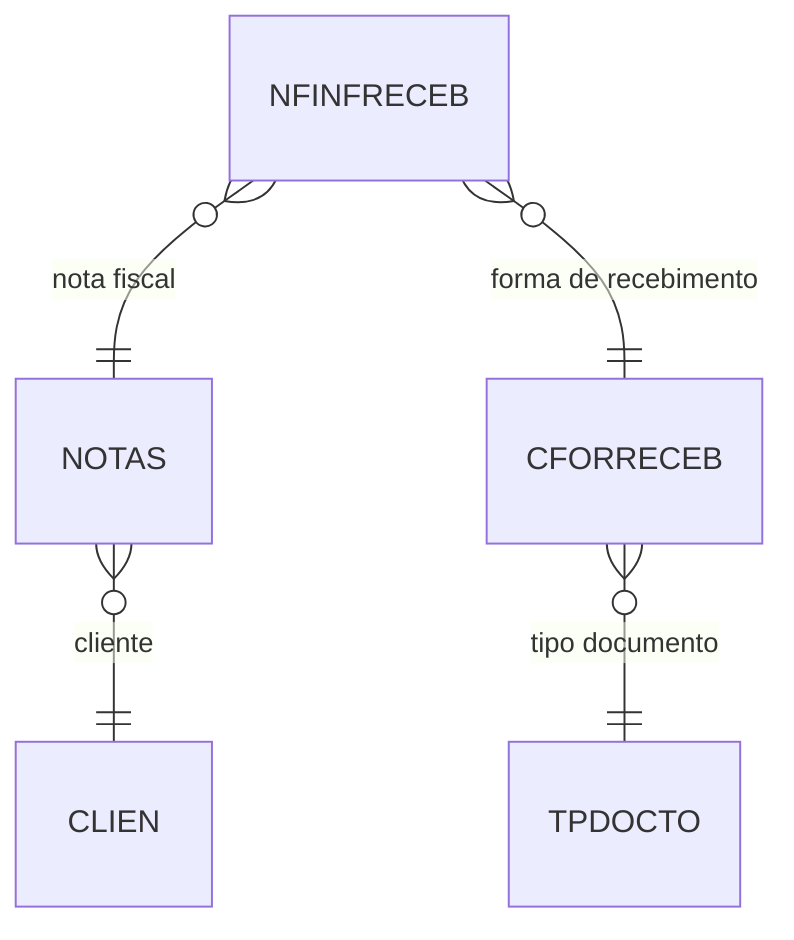

# NFINFRECEB - Documentação Completa de Relacionamentos

## 📊 Informações Gerais

- **Nome da Tabela**: NFINFRECEB (Nota Fiscal - Informações de Recebimento)
- **Total de Registros**: 1.051.559
- **Total de Colunas**: 16
- **Chave Primária**: NFCODIGO, EMPCODIGO, SEQ (composite)
- **Chaves Estrangeiras**: 3
- **Índices**: 0
- **Tabelas Dependentes**: 0
- **Banco de Dados**: Firebird

## 📝 Descrição

**NFINFRECEB** armazena informações de recebimento/pagamento das Notas Fiscais, incluindo dados de transações eletrônicas (PIX, cartão, etc.). Com **1.05 milhão de registros**, representa um volume significativo de transações de recebimento.

Esta tabela é essencial para:
- **Gestão Financeira**: Controle de recebimentos de NF
- **Integração Bancária**: Dados de transações eletrônicas
- **Conciliação**: Vinculação com extratos bancários

---

## 🔑 Estrutura de Colunas

### Identificação
| Coluna | Tipo | Descrição |
|--------|------|-----------|
| **NFCODIGO** 🔑 🔗 | VARCHAR(14) | Código da NF (PK, FK → NOTAS) |
| **EMPCODIGO** 🔑 🔗 | INT | Código da empresa (PK, FK → NOTAS) |
| **SEQ** 🔑 | INT | Sequencial do recebimento (PK) |

### Informações de Recebimento
| Coluna | Tipo | Descrição |
|--------|------|-----------|
| **FRCCODIGO** 🔗 | INT | Forma de recebimento (FK → CFORRECEB) |
| **VALOR** | DECIMAL(16,2) | Valor recebido |
| **CAUT** | VARCHAR(37) | Código de autorização |
| **NSU** | VARCHAR(37) | Número sequencial único |
| **DATAHORATRANS** | TIMESTAMP | Data/hora da transação |
| **FINALIZACAO** | VARCHAR(37) | Código de finalização |
| **REDE** | VARCHAR(37) | Rede de pagamento |
| **REDECNPJ** | VARCHAR(37) | CNPJ da rede |
| **INDPAG** | INT | Indicador de pagamento |
| **UFPAG** | VARCHAR(37) | UF do pagamento |
| **IDTERMPAG** | VARCHAR(37) | ID do terminal |
| **IDCADINTTRAN** | VARCHAR(37) | ID cadastro intermediário |
| **CNPJINTTRAN** | VARCHAR(37) | CNPJ intermediário |

---

## 🔗 Relacionamentos - Nível 1 (Diretos)

### NOTAS - Nota Fiscal (FK Obrigatória)
```
NFINFRECEB.NFCODIGO → NOTAS.NFCODIGO (N:1)
NFINFRECEB.EMPCODIGO → NOTAS.EMPCODIGO (N:1)
```

### CFORRECEB - Forma de Recebimento (FK Obrigatória)
```
NFINFRECEB.FRCCODIGO → CFORRECEB.FRCCODIGO (N:1)
```

---

## 🗺️ Diagrama de Relacionamentos



---

## 💡 Casos de Uso Práticos

### 1. Consultar Recebimentos de uma NF

```sql
SELECT 
    nfir.NFCODIGO,
    nfir.SEQ,
    nfir.FRCCODIGO,
    nfir.VALOR,
    nfir.DATAHORATRANS,
    nfir.NSU,
    cfr.FRCDESC
FROM NFINFRECEB nfir
INNER JOIN CFORRECEB cfr ON nfir.FRCCODIGO = cfr.FRCCODIGO
WHERE nfir.NFCODIGO = :nfcodigo
    AND nfir.EMPCODIGO = :empcodigo
ORDER BY nfir.SEQ;
```

### 2. Relatório de Recebimentos por Forma

```sql
SELECT 
    cfr.FRCDESC,
    COUNT(*) AS QTD_TRANSACOES,
    SUM(nfir.VALOR) AS VALOR_TOTAL,
    DATE(nfir.DATAHORATRANS) AS DATA
FROM NFINFRECEB nfir
INNER JOIN CFORRECEB cfr ON nfir.FRCCODIGO = cfr.FRCCODIGO
WHERE nfir.DATAHORATRANS BETWEEN :data_inicio AND :data_fim
GROUP BY cfr.FRCDESC, DATE(nfir.DATAHORATRANS)
ORDER BY DATA DESC, VALOR_TOTAL DESC;
```

---

## ⚡ Performance e Otimização

### Índices Recomendados

```sql
CREATE INDEX IDX_NFINFRECEB_NF ON NFINFRECEB (NFCODIGO, EMPCODIGO, SEQ);
CREATE INDEX IDX_NFINFRECEB_DATA ON NFINFRECEB (DATAHORATRANS);
CREATE INDEX IDX_NFINFRECEB_FRC ON NFINFRECEB (FRCCODIGO);
```

---

**Documentação gerada em**: 2025-01-27

**Banco de dados**: Firebird

