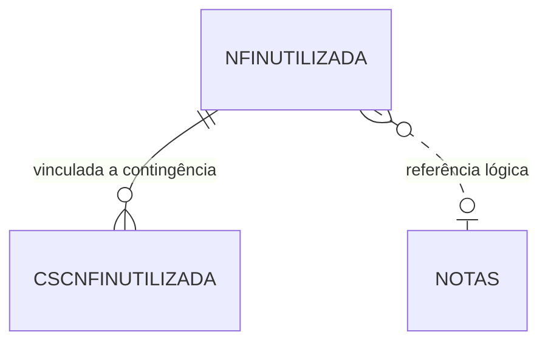

# NFINUTILIZADA - Documentação Completa de Relacionamentos

## 📊 Informações Gerais

- **Nome da Tabela**: NFINUTILIZADA (Nota Fiscal Não Utilizada)
- **Total de Registros**: 552
- **Total de Colunas**: 5
- **Chave Primária**: ID_NFINUTILIZADA
- **Chaves Estrangeiras**: 0
- **Índices**: 0
- **Tabelas Dependentes**: 1 (CSCNFINUTILIZADA)
- **Banco de Dados**: Firebird

## 📝 Descrição

**NFINUTILIZADA** registra notas fiscais que foram marcadas como não utilizadas, provavelmente para controle de numeração de séries não utilizadas ou canceladas antes da emissão. Com **552 registros**, representa um volume baixo de notas não utilizadas.

Esta tabela é essencial para:
- **Controle de Numeração**: Rastreamento de séries não utilizadas
- **Auditoria**: Registro de notas que não foram efetivamente emitidas
- **Conformidade**: Atendimento a exigências fiscais sobre numeração

---

## 🔑 Estrutura de Colunas

| Coluna | Tipo | Descrição |
|--------|------|-----------|
| **ID_NFINUTILIZADA** 🔑 | INT | Identificador único (PK) |
| **EMPCODIGO** | INT | Código da empresa |
| **NFCODIGO** | VARCHAR(14) | Código da nota fiscal |
| **NFSERIE** | VARCHAR(14) | Série da nota fiscal |
| **DTINUTILIZACAO** | TIMESTAMP | Data de inutilização |

---

## 🔗 Relacionamentos - Nível 1 (Diretos)

Nenhuma foreign key formal, mas relacionamentos lógicos:
- `NFCODIGO` + `EMPCODIGO` → `NOTAS` (lógico)
- `NFSERIE` + `EMPCODIGO` → `MODELONFSER` (lógico)

---

## 📊 Tabelas que Referenciam NFINUTILIZADA

### CSCNFINUTILIZADA - Contingência x NF Não Utilizada
```
CSCNFINUTILIZADA.ID_NFINUTILIZADA → NFINUTILIZADA.ID_NFINUTILIZADA (N:1)
```

---

## 🗺️ Diagrama de Relacionamentos



---

## 💡 Casos de Uso Práticos

### 1. Consultar Notas Não Utilizadas

```sql
SELECT 
    nfu.ID_NFINUTILIZADA,
    nfu.EMPCODIGO,
    nfu.NFCODIGO,
    nfu.NFSERIE,
    nfu.DTINUTILIZACAO,
    emp.EMPNOME
FROM NFINUTILIZADA nfu
LEFT JOIN EMPRESA emp ON nfu.EMPCODIGO = emp.EMPCODIGO
WHERE nfu.DTINUTILIZACAO BETWEEN :data_inicio AND :data_fim
ORDER BY nfu.DTINUTILIZACAO DESC;
```

---

## ⚡ Performance e Otimização

### Índices Recomendados

```sql
CREATE INDEX IDX_NFINUTILIZADA_EMP_NF ON NFINUTILIZADA (EMPCODIGO, NFCODIGO);
CREATE INDEX IDX_NFINUTILIZADA_DATA ON NFINUTILIZADA (DTINUTILIZACAO);
```

---

**Documentação gerada em**: 2025-01-27

**Banco de dados**: Firebird

