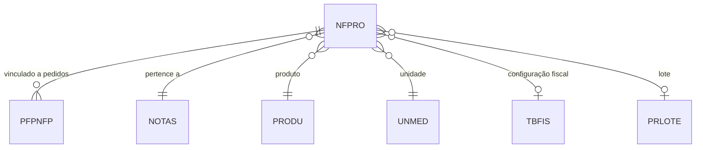

# NFPRO - Documentação Completa de Relacionamentos

## 📊 Informações Gerais

- **Nome da Tabela**: NFPRO (Nota Fiscal - Produtos)
- **Total de Registros**: 3.724.413
- **Total de Colunas**: 117
- **Chave Primária**: NFCODIGO, NFPSEQ, EMPCODIGO (composite)
- **Chaves Estrangeiras**: 8
- **Índices**: 0
- **Tabelas Dependentes**: 1 (PFPNFP)
- **Banco de Dados**: Firebird

## 📝 Descrição

**NFPRO** armazena os itens de produtos das Notas Fiscais tradicionais (não eletrônicas). Com **3.7 milhões de registros** e **117 colunas**, é uma das tabelas mais volumosas do sistema, contendo informações detalhadas sobre cada produto incluído em uma NF, incluindo cálculos tributários completos.

Esta tabela é essencial para:
- **Controle Fiscal**: Detalhamento completo de impostos por item
- **Gestão de Estoque**: Rastreamento de produtos vendidos
- **Integração com Pedidos**: Vinculação com itens de pedidos através de `PFPNFP`

---

## 🔑 Estrutura de Colunas (Principais)

### Identificação
| Coluna | Tipo | Descrição |
|--------|------|-----------|
| **NFCODIGO** 🔑 🔗 | VARCHAR(14) | Código da NF (PK, FK → NOTAS) |
| **NFPSEQ** 🔑 | INT | Sequencial do item (PK) |
| **EMPCODIGO** 🔑 🔗 | INT | Código da empresa (PK, FK → NOTAS) |
| **PROCODIGO** 🔗 | VARCHAR(14) | Código do produto (FK → PRODU) |

### Informações do Produto
| Coluna | Tipo | Descrição |
|--------|------|-----------|
| **NFPDESCRICAO** | VARCHAR(37) | Descrição do produto |
| **NFPQTDADE** | DECIMAL(27,4) | Quantidade |
| **NFPPCOVENDA** | DECIMAL(27,6) | Preço de venda |
| **NFPCUSTO** | DECIMAL(27,6) | Custo |
| **NFPCUSTOTOTAL** | DECIMAL(27,2) | Custo total |
| **NFPTPPRECO** | VARCHAR(14) | Tipo de preço |
| **UNCODIGO** 🔗 | VARCHAR(14) | Unidade de medida (FK → UNMED) |

### Tributação
Campos para ICMS, IPI, PIS, COFINS, CSLL, etc.

---

## 🔗 Relacionamentos - Nível 1 (Diretos)

### NOTAS - Nota Fiscal (FK Obrigatória)
```
NFPRO.NFCODIGO → NOTAS.NFCODIGO (N:1)
NFPRO.EMPCODIGO → NOTAS.EMPCODIGO (N:1)
```

### PRODU - Produto (FK Obrigatória)
```
NFPRO.PROCODIGO → PRODU.PROCODIGO (N:1)
```

### UNMED - Unidade de Medida (FK Obrigatória)
```
NFPRO.UNCODIGO → UNMED.UNCODIGO (N:1)
```

### TBFIS - Tabela Fiscal (FK Opcional)
```
NFPRO.FISCODIGO → TBFIS.FISCODIGO (N:1)
```

### PRLOTE - Lote (FK Opcional)
```
NFPRO.PROCODIGO → PRLOTE.PROCODIGO (N:1)
NFPRO.EMPCODIGO → PRLOTE.EMPCODIGO (N:1)
NFPRO.PRLLOTE → PRLOTE.PRLLOTE (N:1)
```

---

## 📊 Tabelas que Referenciam NFPRO

### PFPNFP - Pedido Fornecedor x NF Produto
```
PFPNFP.NFCODIGO → NFPRO.NFCODIGO (N:1)
PFPNFP.NFPSEQ → NFPRO.NFPSEQ (N:1)
PFPNFP.EMPCODIGO → NFPRO.EMPCODIGO (N:1)
```

---

## 🗺️ Diagrama de Relacionamentos



---

## ⚡ Performance e Otimização

### Índices Recomendados

```sql
CREATE INDEX IDX_NFPRO_NF ON NFPRO (NFCODIGO, EMPCODIGO, NFPSEQ);
CREATE INDEX IDX_NFPRO_PRODUTO ON NFPRO (PROCODIGO);
```

---

**Documentação gerada em**: 2025-01-27

**Banco de dados**: Firebird

