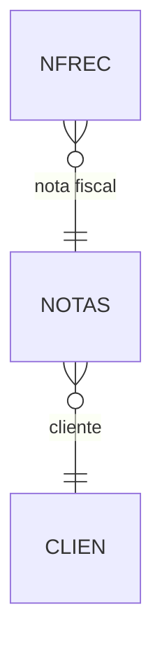

# NFREC - Documentação Completa de Relacionamentos

## 📊 Informações Gerais

- **Nome da Tabela**: NFREC (Nota Fiscal - Recebimento)
- **Total de Registros**: 1.060.552
- **Total de Colunas**: 7
- **Chave Primária**: NFCODIGO, NRCODIGO, EMPCODIGO (composite)
- **Chaves Estrangeiras**: 2 (ambas para NOTAS)
- **Índices**: 2
- **Tabelas Dependentes**: 0
- **Banco de Dados**: Firebird

## 📝 Descrição

**NFREC** registra informações de recebimento de Notas Fiscais, vinculando notas a códigos de recebimento. Com **1.06 milhão de registros**, representa um volume significativo de recebimentos registrados.

Esta tabela é essencial para:
- **Gestão Financeira**: Controle de recebimentos de NF
- **Rastreabilidade**: Vinculação entre notas e recebimentos
- **Conciliação**: Integração com sistema de recebimentos

---

## 🔑 Estrutura de Colunas

| Coluna | Tipo | Descrição |
|--------|------|-----------|
| **NFCODIGO** 🔑 🔗 | VARCHAR(14) | Código da NF (PK, FK → NOTAS) |
| **NRCODIGO** 🔑 | VARCHAR(14) | Código do recebimento (PK) |
| **EMPCODIGO** 🔑 🔗 | INT | Código da empresa (PK, FK → NOTAS) |
| **NFDTNOTA** | DATE | Data da nota |
| **NRDATA** | DATE | Data do recebimento (INDEXADO) |
| **NRSIT** | VARCHAR(14) | Situação do recebimento |
| **NREMPRESA** | INT | Empresa do recebimento |

---

## 🔗 Relacionamentos - Nível 1 (Diretos)

### NOTAS - Nota Fiscal (FK Obrigatória)
```
NFREC.NFCODIGO → NOTAS.NFCODIGO (N:1)
NFREC.EMPCODIGO → NOTAS.EMPCODIGO (N:1)
```

---

## 📇 Índices Existentes

| Nome | Colunas |
|------|---------|
| IDX_NFREC_INDNRDATA | NRDATA |
| IDX_NFREC_NRCODIGO | NRCODIGO |

---

## 🗺️ Diagrama de Relacionamentos



---

## 💡 Casos de Uso Práticos

### 1. Consultar Recebimentos de uma NF

```sql
SELECT 
    nfr.NFCODIGO,
    nfr.NRCODIGO,
    nfr.NRDATA,
    nfr.NRSIT,
    nf.NFDTEMIS
FROM NFREC nfr
INNER JOIN NOTAS nf ON nfr.NFCODIGO = nf.NFCODIGO 
    AND nfr.EMPCODIGO = nf.EMPCODIGO
WHERE nfr.NFCODIGO = :nfcodigo
    AND nfr.EMPCODIGO = :empcodigo;
```

### 2. Relatório de Recebimentos por Período

```sql
SELECT 
    DATE(nfr.NRDATA) AS DATA_RECEBIMENTO,
    COUNT(*) AS QTD_RECEBIMENTOS,
    COUNT(DISTINCT nfr.NFCODIGO) AS QTD_NFS
FROM NFREC nfr
WHERE nfr.NRDATA BETWEEN :data_inicio AND :data_fim
GROUP BY DATE(nfr.NRDATA)
ORDER BY DATA_RECEBIMENTO DESC;
```

---

## ⚡ Performance e Otimização

### Índices Recomendados

```sql
-- Índices já existentes são adequados
-- Considerar índice composto para consultas frequentes:
CREATE INDEX IDX_NFREC_NF_EMP ON NFREC (NFCODIGO, EMPCODIGO);
```

---

**Documentação gerada em**: 2025-01-27

**Banco de dados**: Firebird

