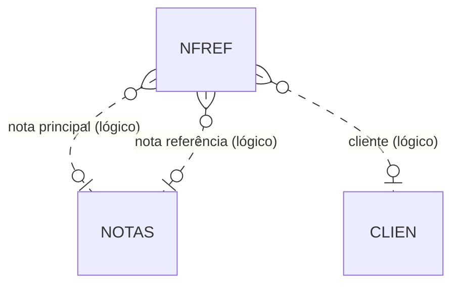

# NFREF - Documentação Completa de Relacionamentos

## 📊 Informações Gerais

- **Nome da Tabela**: NFREF (Nota Fiscal - Referências)
- **Total de Registros**: 79.525
- **Total de Colunas**: 9
- **Chave Primária**: EMPCODIGO, CLICODIGO, NFNUMDOC, NFNUMDOCREF (composite)
- **Chaves Estrangeiras**: 0
- **Índices**: 0
- **Tabelas Dependentes**: 0
- **Banco de Dados**: Firebird

## 📝 Descrição

**NFREF** armazena referências entre notas fiscais, permitindo vincular uma nota a outras notas relacionadas (notas de referência, notas de devolução, etc.). Com **79.525 registros**, representa um volume significativo de relacionamentos entre notas.

Esta tabela é essencial para:
- **Rastreabilidade**: Vinculação entre notas relacionadas
- **Conformidade Fiscal**: Registro de referências exigidas pela legislação
- **Auditoria**: Rastreamento de notas de devolução, complementares, etc.

---

## 🔑 Estrutura de Colunas

| Coluna | Tipo | Descrição |
|--------|------|-----------|
| **EMPCODIGO** 🔑 | INT | Código da empresa (PK) |
| **CLICODIGO** 🔑 | INT | Código do cliente (PK) |
| **NFNUMDOC** 🔑 | VARCHAR(37) | Número do documento (PK) |
| **NFNUMDOCREF** 🔑 | VARCHAR(37) | Número do documento de referência (PK) |
| **NFORIGEM** | VARCHAR(14) | Origem da referência |
| **NFTIPO** | VARCHAR(14) | Tipo de referência |
| **NFNOTA** | VARCHAR(14) | Número da nota |
| **NFNOTAREF** | VARCHAR(14) | Número da nota de referência |
| **NFCHAVEREF** | VARCHAR(37) | Chave da nota de referência (NFe) |

---

## 🔗 Relacionamentos Lógicos

Embora não haja foreign keys formais, existem relacionamentos lógicos:
- `NFNUMDOC` + `EMPCODIGO` → `NOTAS` (lógico)
- `NFNUMDOCREF` + `EMPCODIGO` → `NOTAS` (lógico)
- `CLICODIGO` → `CLIEN` (lógico)

---

## 🗺️ Diagrama de Relacionamentos



---

## 💡 Casos de Uso Práticos

### 1. Consultar Referências de uma Nota

```sql
SELECT 
    nfr.NFNUMDOC,
    nfr.NFNUMDOCREF,
    nfr.NFTIPO,
    nfr.NFORIGEM,
    nfr.NFCHAVEREF,
    nf1.NFDTEMIS AS DATA_NOTA,
    nf2.NFDTEMIS AS DATA_REFERENCIA
FROM NFREF nfr
LEFT JOIN NOTAS nf1 ON nfr.NFNUMDOC = CAST(nf1.NFCODIGO AS VARCHAR(37))
    AND nfr.EMPCODIGO = nf1.EMPCODIGO
LEFT JOIN NOTAS nf2 ON nfr.NFNUMDOCREF = CAST(nf2.NFCODIGO AS VARCHAR(37))
    AND nfr.EMPCODIGO = nf2.EMPCODIGO
WHERE nfr.NFNUMDOC = :nfdoc
    AND nfr.EMPCODIGO = :empcodigo;
```

### 2. Relatório de Referências por Tipo

```sql
SELECT 
    nfr.NFTIPO,
    nfr.NFORIGEM,
    COUNT(*) AS QTD_REFERENCIAS
FROM NFREF nfr
GROUP BY nfr.NFTIPO, nfr.NFORIGEM
ORDER BY QTD_REFERENCIAS DESC;
```

---

## ⚡ Performance e Otimização

### Índices Recomendados

```sql
CREATE INDEX IDX_NFREF_DOC ON NFREF (NFNUMDOC, EMPCODIGO);
CREATE INDEX IDX_NFREF_DOCREF ON NFREF (NFNUMDOCREF, EMPCODIGO);
CREATE INDEX IDX_NFREF_CLI ON NFREF (CLICODIGO);
```

---

**Documentação gerada em**: 2025-01-27

**Banco de dados**: Firebird

