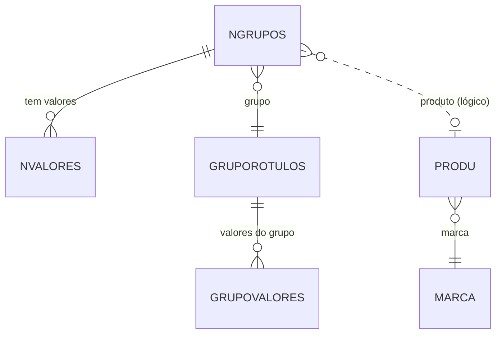

# NGRUPOS - Documentação Completa de Relacionamentos

## 📊 Informações Gerais

- **Nome da Tabela**: NGRUPOS (Produtos x Grupos de Rotulos)
- **Total de Registros**: 466.058
- **Total de Colunas**: 2
- **Chave Primária**: PROCODIGO, GRCODIGO (composite)
- **Chaves Estrangeiras**: 1
- **Índices**: 0
- **Tabelas Dependentes**: 1 (NVALORES)
- **Banco de Dados**: Firebird

## 📝 Descrição

**NGRUPOS** é uma tabela de relacionamento muitos-para-muitos que vincula produtos a grupos de rótulos. Com **466.058 registros**, representa um volume significativo de associações entre produtos e grupos, permitindo que produtos pertençam a múltiplos grupos de rótulos.

Esta tabela é essencial para:
- **Classificação de Produtos**: Agrupamento de produtos por rótulos
- **Organização**: Estruturação hierárquica de produtos
- **Rotulagem**: Vinculação de produtos a grupos de rótulos para impressão/etiquetagem

---

## 🔑 Estrutura de Colunas

| Coluna | Tipo | Descrição |
|--------|------|-----------|
| **PROCODIGO** 🔑 | VARCHAR(14) | Código do produto (PK) |
| **GRCODIGO** 🔑 🔗 | INT | Código do grupo de rótulos (PK, FK → GRUPOROTULOS) |

---

## 🔗 Relacionamentos - Nível 1 (Diretos)

### GRUPOROTULOS - Grupo de Rótulos (FK Obrigatória)
**Volume:** 35 registros

**Relacionamento:**
```
NGRUPOS.GRCODIGO → GRUPOROTULOS.GRCODIGO (N:1) [FK: GRUPOROTULOS_NGRUPOS]
```

**Descrição:** Cada associação está vinculada a um grupo de rótulos específico.

**Proporção:** ~13.316 produtos por grupo em média (466.058 / 35)

---

## 📊 Tabelas que Referenciam NGRUPOS

### NVALORES - Valores de Grupos
**Volume:** 465.660 registros

**Relacionamento:**
```
NVALORES.PROCODIGO → NGRUPOS.PROCODIGO (N:1)
NVALORES.GRCODIGO → NGRUPOS.GRCODIGO (N:1)
```

**Descrição:** Vincula valores específicos aos produtos dentro de cada grupo.

---

## 🔗 Relacionamentos - Nível 2 (Indiretos)

### Através de PROCODIGO

#### PRODU - Produto
```
NGRUPOS → PRODU (via PROCODIGO)
```
**Descrição:** Permite acessar informações completas do produto associado ao grupo.

### Através de GRCODIGO

#### GRUPOVALORES - Valores do Grupo
```
NGRUPOS → GRUPOROTULOS → GRUPOVALORES
```
**Descrição:** Permite acessar os valores disponíveis para cada grupo de rótulos.

---

## 🗺️ Diagrama de Relacionamentos



---

## 💡 Casos de Uso Práticos

### 1. Consultar Grupos de um Produto

```sql
SELECT 
    ng.PROCODIGO,
    prod.PRODESCRICAO,
    ng.GRCODIGO,
    gr.GRDESCRICAO AS GRUPO_ROTULO
FROM NGRUPOS ng
INNER JOIN PRODU prod ON ng.PROCODIGO = prod.PROCODIGO
INNER JOIN GRUPOROTULOS gr ON ng.GRCODIGO = gr.GRCODIGO
WHERE ng.PROCODIGO = :procodigo;
```

### 2. Consultar Produtos de um Grupo

```sql
SELECT 
    ng.GRCODIGO,
    gr.GRDESCRICAO AS GRUPO_ROTULO,
    ng.PROCODIGO,
    prod.PRODESCRICAO,
    COUNT(nv.NVALORES) AS QTD_VALORES
FROM NGRUPOS ng
INNER JOIN GRUPOROTULOS gr ON ng.GRCODIGO = gr.GRCODIGO
INNER JOIN PRODU prod ON ng.PROCODIGO = prod.PROCODIGO
LEFT JOIN NVALORES nv ON ng.PROCODIGO = nv.PROCODIGO 
    AND ng.GRCODIGO = nv.GRCODIGO
WHERE ng.GRCODIGO = :grcodigo
GROUP BY ng.GRCODIGO, gr.GRDESCRICAO, ng.PROCODIGO, prod.PRODESCRICAO
ORDER BY prod.PRODESCRICAO;
```

### 3. Relatório de Distribuição de Produtos por Grupo

```sql
SELECT 
    gr.GRCODIGO,
    gr.GRDESCRICAO AS GRUPO_ROTULO,
    COUNT(DISTINCT ng.PROCODIGO) AS QTD_PRODUTOS,
    COUNT(nv.NVALORES) AS QTD_VALORES_TOTAL
FROM GRUPOROTULOS gr
LEFT JOIN NGRUPOS ng ON gr.GRCODIGO = ng.GRCODIGO
LEFT JOIN NVALORES nv ON ng.PROCODIGO = nv.PROCODIGO 
    AND ng.GRCODIGO = nv.GRCODIGO
GROUP BY gr.GRCODIGO, gr.GRDESCRICAO
ORDER BY QTD_PRODUTOS DESC;
```

### 4. Produtos com Valores em Grupos

```sql
SELECT 
    ng.PROCODIGO,
    prod.PRODESCRICAO,
    ng.GRCODIGO,
    gr.GRDESCRICAO AS GRUPO,
    nv.NVALORES AS VALOR
FROM NGRUPOS ng
INNER JOIN PRODU prod ON ng.PROCODIGO = prod.PROCODIGO
INNER JOIN GRUPOROTULOS gr ON ng.GRCODIGO = gr.GRCODIGO
INNER JOIN NVALORES nv ON ng.PROCODIGO = nv.PROCODIGO 
    AND ng.GRCODIGO = nv.GRCODIGO
WHERE ng.PROCODIGO = :procodigo
ORDER BY gr.GRCODIGO, nv.NVALORES;
```

---

## 📈 Estatísticas e Insights

### Volume de Dados
- **Total de Associações**: 466.058 registros
- **Média**: ~13.316 produtos por grupo de rótulos
- **Distribuição**: Permite que produtos pertençam a múltiplos grupos simultaneamente

### Análise de Uso
- Permite organização flexível de produtos por rótulos
- Facilita impressão de etiquetas por grupo
- Suporta múltiplas classificações para o mesmo produto

---

## ⚡ Performance e Otimização

### Índices Recomendados

```sql
-- Índice para consultas por produto
CREATE INDEX IDX_NGRUPOS_PRODUTO ON NGRUPOS (PROCODIGO);

-- Índice para consultas por grupo
CREATE INDEX IDX_NGRUPOS_GRUPO ON NGRUPOS (GRCODIGO);

-- Índice composto para consultas combinadas
CREATE INDEX IDX_NGRUPOS_PROD_GRUPO ON NGRUPOS (PROCODIGO, GRCODIGO);
```

### Otimizações de Consulta

1. **Usar índices** nas consultas por produto ou grupo
2. **Evitar SELECT *** - especificar apenas campos necessários
3. **Usar JOIN** ao invés de subconsultas para melhor performance

---

## 🔒 Integridade de Dados

### Validações Importantes

1. **Chave Composta**: `PROCODIGO` + `GRCODIGO` deve ser única
2. **Produto**: `PROCODIGO` deve existir em `PRODU`
3. **Grupo**: `GRCODIGO` deve existir em `GRUPOROTULOS`

### Constraints Recomendados

```sql
-- Verificar se o produto existe
ALTER TABLE NGRUPOS
ADD CONSTRAINT CHK_NGRUPOS_PRODUTO_EXISTS
CHECK (
    EXISTS (
        SELECT 1 FROM PRODU 
        WHERE PROCODIGO = NGRUPOS.PROCODIGO
    )
);

-- Verificar se o grupo existe
ALTER TABLE NGRUPOS
ADD CONSTRAINT CHK_NGRUPOS_GRUPO_EXISTS
CHECK (
    EXISTS (
        SELECT 1 FROM GRUPOROTULOS 
        WHERE GRCODIGO = NGRUPOS.GRCODIGO
    )
);
```

---

## 📚 Integração com Aplicação (Laravel)

### Model NGRUPOS

```php
<?php

namespace App\Models;

use Illuminate\Database\Eloquent\Model;
use Illuminate\Database\Eloquent\Relations\BelongsTo;
use Illuminate\Database\Eloquent\Relations\HasMany;

final class NGRUPOS extends Model
{
    protected $table = 'NGRUPOS';
    
    protected $primaryKey = ['PROCODIGO', 'GRCODIGO'];
    
    public $incrementing = false;
    
    protected $fillable = [
        'PROCODIGO',
        'GRCODIGO',
    ];
    
    /**
     * Relacionamento com GRUPOROTULOS
     */
    public function grupoRotulos(): BelongsTo
    {
        return $this->belongsTo(GRUPOROTULOS::class, 'GRCODIGO', 'GRCODIGO');
    }
    
    /**
     * Relacionamento com PRODU (lógico)
     */
    public function produto(): BelongsTo
    {
        return $this->belongsTo(PRODU::class, 'PROCODIGO', 'PROCODIGO');
    }
    
    /**
     * Relacionamento com NVALORES
     */
    public function valores(): HasMany
    {
        return $this->hasMany(NVALORES::class, ['PROCODIGO', 'GRCODIGO'], ['PROCODIGO', 'GRCODIGO']);
    }
}
```

---

## ✅ Boas Práticas

### Design
1. **Manter unicidade** da chave composta (`PROCODIGO` + `GRCODIGO`)
2. **Validar existência** do produto e grupo antes de inserir
3. **Considerar performance** ao inserir múltiplas associações

### Performance
1. **Usar índices** nas consultas frequentes
2. **Evitar consultas** sem filtros em tabelas grandes
3. **Usar JOIN** ao invés de múltiplas consultas

### Integridade
1. **Validar existência** do produto e grupo
2. **Manter consistência** com tabelas relacionadas
3. **Evitar duplicatas** da chave composta

### Manutenção
1. **Monitorar crescimento** da tabela
2. **Revisar periodicamente** associações não utilizadas
3. **Garantir consistência** com produtos e grupos

---

**Documentação gerada em**: 2025-01-27

**Banco de dados**: Firebird

