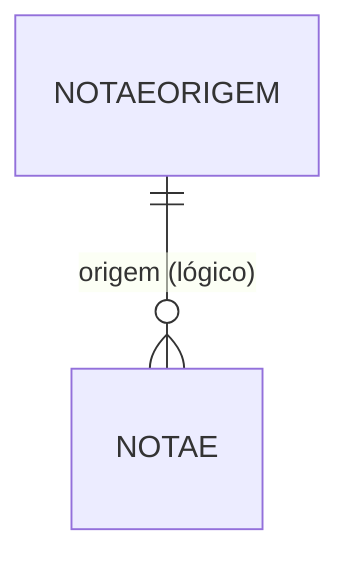

# NOTAEORIGEM - Documentação Completa de Relacionamentos

## 📊 Informações Gerais

- **Nome da Tabela**: NOTAEORIGEM (Origem de Nota Fiscal Eletrônica)
- **Total de Registros**: 2
- **Total de Colunas**: 2
- **Chave Primária**: NFECODIGO
- **Chaves Estrangeiras**: 0
- **Índices**: 0
- **Tabelas Dependentes**: 0
- **Banco de Dados**: Firebird

## 📝 Descrição

**NOTAEORIGEM** é uma tabela mestre de referência que define os tipos de origem possíveis para uma Nota Fiscal Eletrônica. Com apenas **2 registros**, é uma tabela de configuração simples que serve como catálogo de valores para o campo `NFEORIGEM` na tabela `NOTAE`.

Esta tabela é essencial para:
- **Classificação**: Identificar a origem da NF-e (ex: Venda Direta, Pedido, Importação, etc.)
- **Relatórios**: Agrupar NF-e por origem para análises
- **Validação**: Garantir que apenas origens válidas sejam utilizadas

---

## 🔑 Estrutura de Colunas

| Coluna | Tipo | Descrição |
|--------|------|-----------|
| **NFECODIGO** 🔑 | VARCHAR(14) | Código único da origem (PK) |
| **NFEDESCRICAO** | VARCHAR(37) | Descrição da origem |

---

## 🔗 Relacionamentos - Nível 1 (Diretos)

### Nenhum Relacionamento Formal

Esta tabela não possui chaves estrangeiras formais, mas é referenciada logicamente pela tabela `NOTAE` através do campo `NFEORIGEM`.

---

## 🔗 Relacionamentos - Nível 2 (Indiretos)

### NOTAE - Notas Fiscais Eletrônicas (Relacionamento Lógico)

**Relacionamento Lógico:**
```
NOTAE.NFEORIGEM → NOTAEORIGEM.NFECODIGO (N:1)
```

**Descrição:** O campo `NFEORIGEM` na tabela `NOTAE` referencia logicamente esta tabela para identificar a origem da NF-e.

**Uso:** Classificar e filtrar NF-e por origem em relatórios e consultas.

---

## 🗺️ Diagrama de Relacionamentos



---

## 💡 Casos de Uso Práticos

### 1. Consultar Todas as Origens Disponíveis

```sql
SELECT NFECODIGO, NFEDESCRICAO
FROM NOTAEORIGEM
ORDER BY NFECODIGO;
```

### 2. Relatório de NF-e por Origem

```sql
SELECT 
    no.NFECODIGO AS CODIGO_ORIGEM,
    no.NFEDESCRICAO AS DESCRICAO_ORIGEM,
    COUNT(nfe.NFECODIGO) AS QTD_NFES,
    SUM(nfe.NFEVRTOTAL) AS VALOR_TOTAL
FROM NOTAEORIGEM no
LEFT JOIN NOTAE nfe ON no.NFECODIGO = nfe.NFEORIGEM
GROUP BY no.NFECODIGO, no.NFEDESCRICAO
ORDER BY QTD_NFES DESC;
```

### 3. Validar Origem Antes de Inserir NF-e

```sql
SELECT COUNT(*) AS ORIGEM_VALIDA
FROM NOTAEORIGEM
WHERE NFECODIGO = :origem;
```

---

## 📈 Estatísticas e Insights

### Volume de Dados
- **Total de Origens**: 2 registros
- **Uso**: Tabela de referência/catálogo
- **Frequência de Alteração**: Baixa (tabela de configuração)

---

## ⚡ Performance e Otimização

### Índices Recomendados

Como tabela pequena (2 registros), índices não são necessários. A tabela inteira pode ser carregada em memória.

---

## 🔒 Integridade de Dados

### Validações Importantes

1. **Código Único**: `NFECODIGO` deve ser único
2. **Descrição Obrigatória**: `NFEDESCRICAO` deve estar preenchida
3. **Consistência**: Códigos utilizados em `NOTAE.NFEORIGEM` devem existir nesta tabela

---

## 📚 Integração com Aplicação (Laravel)

### Model NOTAEORIGEM

```php
<?php

namespace App\Models;

use Illuminate\Database\Eloquent\Model;

final class NOTAEORIGEM extends Model
{
    protected $table = 'NOTAEORIGEM';
    
    protected $primaryKey = 'NFECODIGO';
    
    public $incrementing = false;
    
    protected $fillable = [
        'NFECODIGO',
        'NFEDESCRICAO',
    ];
    
    /**
     * Relacionamento lógico com NOTAE
     */
    public function notasFiscais()
    {
        return $this->hasMany(NOTAE::class, 'NFEORIGEM', 'NFECODIGO');
    }
    
    /**
     * Scope para buscar por código
     */
    public function scopePorCodigo($query, $codigo)
    {
        return $query->where('NFECODIGO', $codigo);
    }
}
```

---

## ✅ Boas Práticas

### Design
1. **Manter códigos consistentes** com o padrão do sistema
2. **Descrições claras** e objetivas
3. **Evitar exclusão** de registros já utilizados em `NOTAE`

### Performance
1. **Cachear valores** em memória devido ao pequeno volume
2. **Usar em dropdowns** e listas de seleção

### Integridade
1. **Validar existência** antes de usar em `NOTAE`
2. **Não permitir exclusão** de códigos em uso

### Manutenção
1. **Documentar significado** de cada código
2. **Revisar periodicamente** se novos códigos são necessários

---

**Documentação gerada em**: 2025-01-27

**Banco de dados**: Firebird

