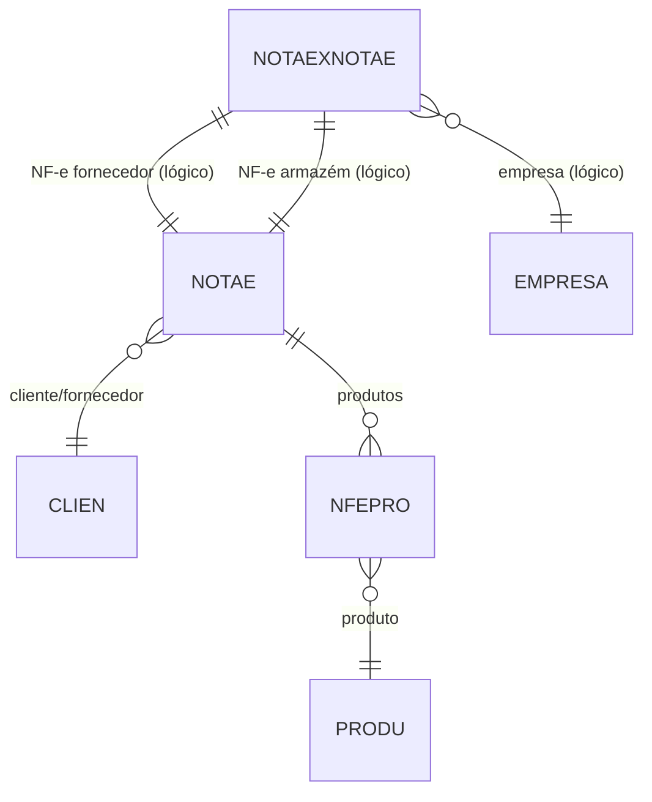

# NOTAEXNOTAE - Documentação Completa de Relacionamentos

## 📊 Informações Gerais

- **Nome da Tabela**: NOTAEXNOTAE (Relação entre NF-e de Fornecedor e Armazém)
- **Total de Registros**: 158
- **Total de Colunas**: 3
- **Chave Primária**: EMPCODIGO, NFECODIGO_FORNE, NFECODIGO_ARMAZ (composite)
- **Chaves Estrangeiras**: 0 (relacionamentos lógicos)
- **Índices**: 0
- **Tabelas Dependentes**: 0
- **Banco de Dados**: Firebird

## 📝 Descrição

**NOTAEXNOTAE** é uma tabela de relacionamento que vincula Notas Fiscais Eletrônicas de fornecedores (`NFECODIGO_FORNE`) com Notas Fiscais Eletrônicas de armazém (`NFECODIGO_ARMAZ`). Com **158 registros**, esta tabela permite rastrear a relação entre NF-e de entrada (fornecedor) e NF-e de saída (armazém), facilitando o controle de estoque e a rastreabilidade de mercadorias.

Esta tabela é essencial para:
- **Rastreabilidade**: Vincular NF-e de entrada com NF-e de saída
- **Controle de Estoque**: Rastrear movimentação de mercadorias entre fornecedor e armazém
- **Auditoria**: Manter histórico de relacionamentos entre NF-e
- **Integração**: Facilitar integração entre sistemas de fornecedor e armazém

---

## 🔑 Estrutura de Colunas

| Coluna | Tipo | Descrição |
|--------|------|-----------|
| **EMPCODIGO** 🔑 | INT | Código da empresa (PK) |
| **NFECODIGO_FORNE** 🔑 | INT | Código da NF-e do fornecedor (PK) |
| **NFECODIGO_ARMAZ** 🔑 | INT | Código da NF-e do armazém (PK) |

---

## 🔗 Relacionamentos - Nível 1 (Diretos)

### Relacionamentos Lógicos

Embora não existam chaves estrangeiras formais, esta tabela referencia logicamente:

#### NOTAE - NF-e do Fornecedor (Relacionamento Lógico)
```
NOTAEXNOTAE.NFECODIGO_FORNE → NOTAE.NFECODIGO (N:1)
NOTAEXNOTAE.EMPCODIGO → NOTAE.EMPCODIGO (N:1)
```

**Descrição:** Identifica a NF-e de entrada do fornecedor.

---

#### NOTAE - NF-e do Armazém (Relacionamento Lógico)
```
NOTAEXNOTAE.NFECODIGO_ARMAZ → NOTAE.NFECODIGO (N:1)
NOTAEXNOTAE.EMPCODIGO → NOTAE.EMPCODIGO (N:1)
```

**Descrição:** Identifica a NF-e de saída do armazém.

---

#### EMPRESA - Empresa (Relacionamento Lógico)
```
NOTAEXNOTAE.EMPCODIGO → EMPRESA.EMPCODIGO (N:1)
```

**Descrição:** Identifica a empresa que possui o relacionamento entre as NF-e.

---

## 🔗 Relacionamentos - Nível 2 (Indiretos)

### Através de NOTAE (Fornecedor)

#### CLIEN - Cliente/Fornecedor
```
NOTAEXNOTAE → NOTAE (fornecedor) → CLIEN
```
**Descrição:** Permite identificar o fornecedor relacionado à NF-e de entrada.

---

#### PRODU - Produtos
```
NOTAEXNOTAE → NOTAE (fornecedor) → NFEPRO → PRODU
```
**Descrição:** Permite identificar produtos recebidos do fornecedor.

---

### Através de NOTAE (Armazém)

#### CLIEN - Cliente
```
NOTAEXNOTAE → NOTAE (armazém) → CLIEN
```
**Descrição:** Permite identificar o cliente relacionado à NF-e de saída.

---

#### PRODU - Produtos
```
NOTAEXNOTAE → NOTAE (armazém) → NFEPRO → PRODU
```
**Descrição:** Permite identificar produtos enviados ao armazém.

---

## 🗺️ Diagrama de Relacionamentos



---

## 💡 Casos de Uso Práticos

### 1. Consultar Relacionamento Completo entre NF-e

```sql
SELECT 
    nxn.EMPCODIGO,
    nxn.NFECODIGO_FORNE,
    nxn.NFECODIGO_ARMAZ,
    nfe_forne.NFENRNOTA AS NF_NUMERO_FORNE,
    nfe_forne.NFEDTEMIS AS DT_EMISSAO_FORNE,
    nfe_forne.NFEVRTOTAL AS VALOR_FORNE,
    cli_forne.CLINOME AS FORNECEDOR,
    nfe_armaz.NFENRNOTA AS NF_NUMERO_ARMAZ,
    nfe_armaz.NFEDTEMIS AS DT_EMISSAO_ARMAZ,
    nfe_armaz.NFEVRTOTAL AS VALOR_ARMAZ,
    cli_armaz.CLINOME AS ARMAZEM
FROM NOTAEXNOTAE nxn
INNER JOIN NOTAE nfe_forne 
    ON nxn.NFECODIGO_FORNE = nfe_forne.NFECODIGO 
    AND nxn.EMPCODIGO = nfe_forne.EMPCODIGO
INNER JOIN NOTAE nfe_armaz 
    ON nxn.NFECODIGO_ARMAZ = nfe_armaz.NFECODIGO 
    AND nxn.EMPCODIGO = nfe_armaz.EMPCODIGO
LEFT JOIN CLIEN cli_forne ON nfe_forne.CLICODIGO = cli_forne.CLICODIGO
LEFT JOIN CLIEN cli_armaz ON nfe_armaz.CLICODIGO = cli_armaz.CLICODIGO
WHERE nxn.EMPCODIGO = :empcodigo;
```

### 2. Rastrear Produtos do Fornecedor ao Armazém

```sql
SELECT 
    nxn.NFECODIGO_FORNE,
    nxn.NFECODIGO_ARMAZ,
    nfep_forne.PROCODIGO,
    prod.PRODESCRICAO,
    nfep_forne.NFEPQTDE AS QTD_FORNE,
    nfep_armaz.NFEPQTDE AS QTD_ARMAZ,
    (nfep_forne.NFEPQTDE - COALESCE(nfep_armaz.NFEPQTDE, 0)) AS DIFERENCA
FROM NOTAEXNOTAE nxn
INNER JOIN NFEPRO nfep_forne 
    ON nxn.NFECODIGO_FORNE = nfep_forne.NFECODIGO 
    AND nxn.EMPCODIGO = nfep_forne.EMPCODIGO
LEFT JOIN NFEPRO nfep_armaz 
    ON nxn.NFECODIGO_ARMAZ = nfep_armaz.NFECODIGO 
    AND nxn.EMPCODIGO = nfep_armaz.EMPCODIGO
    AND nfep_forne.PROCODIGO = nfep_armaz.PROCODIGO
INNER JOIN PRODU prod ON nfep_forne.PROCODIGO = prod.PROCODIGO
WHERE nxn.EMPCODIGO = :empcodigo
ORDER BY nxn.NFECODIGO_FORNE, prod.PRODESCRICAO;
```

### 3. Relatório de Relacionamentos por Período

```sql
SELECT 
    DATE(nfe_forne.NFEDTEMIS) AS DATA_FORNE,
    COUNT(DISTINCT nxn.NFECODIGO_FORNE) AS QTD_NFES_FORNE,
    COUNT(DISTINCT nxn.NFECODIGO_ARMAZ) AS QTD_NFES_ARMAZ,
    COUNT(DISTINCT nxn.EMPCODIGO) AS QTD_RELACIONAMENTOS,
    SUM(nfe_forne.NFEVRTOTAL) AS VALOR_TOTAL_FORNE,
    SUM(nfe_armaz.NFEVRTOTAL) AS VALOR_TOTAL_ARMAZ
FROM NOTAEXNOTAE nxn
INNER JOIN NOTAE nfe_forne 
    ON nxn.NFECODIGO_FORNE = nfe_forne.NFECODIGO 
    AND nxn.EMPCODIGO = nfe_forne.EMPCODIGO
INNER JOIN NOTAE nfe_armaz 
    ON nxn.NFECODIGO_ARMAZ = nfe_armaz.NFECODIGO 
    AND nxn.EMPCODIGO = nfe_armaz.EMPCODIGO
WHERE nfe_forne.NFEDTEMIS BETWEEN :data_inicio AND :data_fim
GROUP BY DATE(nfe_forne.NFEDTEMIS)
ORDER BY DATA_FORNE DESC;
```

### 4. Validar Existência de NF-e Antes de Criar Relacionamento

```sql
SELECT 
    CASE 
        WHEN EXISTS (
            SELECT 1 FROM NOTAE 
            WHERE NFECODIGO = :nfecodigo_forne 
            AND EMPCODIGO = :empcodigo
        ) THEN 'NF-e FORNE existe'
        ELSE 'NF-e FORNE não existe'
    END AS STATUS_FORNE,
    CASE 
        WHEN EXISTS (
            SELECT 1 FROM NOTAE 
            WHERE NFECODIGO = :nfecodigo_armaz 
            AND EMPCODIGO = :empcodigo
        ) THEN 'NF-e ARMAZ existe'
        ELSE 'NF-e ARMAZ não existe'
    END AS STATUS_ARMAZ
FROM RDB$DATABASE;
```

---

## 📈 Estatísticas e Insights

### Volume de Dados
- **Total de Relacionamentos**: 158 registros
- **Média**: Aproximadamente 0,08% das NF-e possuem relacionamento (158 / 204.952)
- **Uso**: Tabela de rastreabilidade específica para operações entre fornecedor e armazém

---

## ⚡ Performance e Otimização

### Índices Recomendados

```sql
-- Índice para consultas por NF-e fornecedor
CREATE INDEX IDX_NOTAEXNOTAE_FORNE ON NOTAEXNOTAE (NFECODIGO_FORNE, EMPCODIGO);

-- Índice para consultas por NF-e armazém
CREATE INDEX IDX_NOTAEXNOTAE_ARMAZ ON NOTAEXNOTAE (NFECODIGO_ARMAZ, EMPCODIGO);

-- Índice composto para consultas completas
CREATE INDEX IDX_NOTAEXNOTAE_COMPLETA ON NOTAEXNOTAE (EMPCODIGO, NFECODIGO_FORNE, NFECODIGO_ARMAZ);
```

### Otimizações de Consulta

1. **Sempre usar chave composta completa** nas consultas
2. **Usar JOINs** em vez de subconsultas quando possível
3. **Validar existência** das NF-e antes de criar relacionamento

---

## 🔒 Integridade de Dados

### Validações Importantes

1. **Chave Composta Única**: A combinação `EMPCODIGO` + `NFECODIGO_FORNE` + `NFECODIGO_ARMAZ` deve ser única
2. **NF-e Fornecedor**: `NFECODIGO_FORNE` deve existir em `NOTAE`
3. **NF-e Armazém**: `NFECODIGO_ARMAZ` deve existir em `NOTAE`
4. **Empresa Consistente**: Ambas as NF-e devem pertencer à mesma empresa (`EMPCODIGO`)
5. **Evitar Auto-relacionamento**: `NFECODIGO_FORNE` não deve ser igual a `NFECODIGO_ARMAZ`

---

## 📚 Integração com Aplicação (Laravel)

### Model NOTAEXNOTAE

```php
<?php

namespace App\Models;

use Illuminate\Database\Eloquent\Model;
use Illuminate\Database\Eloquent\Relations\BelongsTo;

final class NOTAEXNOTAE extends Model
{
    protected $table = 'NOTAEXNOTAE';
    
    protected $primaryKey = ['EMPCODIGO', 'NFECODIGO_FORNE', 'NFECODIGO_ARMAZ'];
    
    public $incrementing = false;
    
    protected $fillable = [
        'EMPCODIGO',
        'NFECODIGO_FORNE',
        'NFECODIGO_ARMAZ',
    ];
    
    /**
     * Relacionamento lógico com NOTAE (fornecedor)
     */
    public function notaFornecedor()
    {
        return $this->belongsTo(NOTAE::class, ['NFECODIGO_FORNE', 'EMPCODIGO'], ['NFECODIGO', 'EMPCODIGO']);
    }
    
    /**
     * Relacionamento lógico com NOTAE (armazém)
     */
    public function notaArmazem()
    {
        return $this->belongsTo(NOTAE::class, ['NFECODIGO_ARMAZ', 'EMPCODIGO'], ['NFECODIGO', 'EMPCODIGO']);
    }
    
    /**
     * Relacionamento lógico com EMPRESA
     */
    public function empresa()
    {
        return $this->belongsTo(EMPRESA::class, 'EMPCODIGO', 'EMPCODIGO');
    }
    
    /**
     * Scope para buscar por NF-e fornecedor
     */
    public function scopePorNotaFornecedor($query, $nfecodigo, $empcodigo)
    {
        return $query->where('NFECODIGO_FORNE', $nfecodigo)
            ->where('EMPCODIGO', $empcodigo);
    }
    
    /**
     * Scope para buscar por NF-e armazém
     */
    public function scopePorNotaArmazem($query, $nfecodigo, $empcodigo)
    {
        return $query->where('NFECODIGO_ARMAZ', $nfecodigo)
            ->where('EMPCODIGO', $empcodigo);
    }
}
```

---

## ✅ Boas Práticas

### Design
1. **Manter unicidade** da chave composta
2. **Validar existência** das NF-e antes de criar relacionamento
3. **Garantir consistência** de empresa entre as NF-e
4. **Evitar auto-relacionamento** (mesma NF-e como fornecedor e armazém)

### Performance
1. **Usar índices** nas consultas frequentes
2. **Validar existência** antes de inserir para evitar erros
3. **Considerar cache** para consultas frequentes

### Integridade
1. **Validar existência** de ambas as NF-e antes de criar relacionamento
2. **Garantir mesma empresa** para ambas as NF-e
3. **Evitar duplicatas** da mesma relação

### Manutenção
1. **Monitorar crescimento** da tabela
2. **Revisar periodicamente** relacionamentos órfãos (NF-e excluídas)
3. **Documentar regras de negócio** para criação de relacionamentos

---

**Documentação gerada em**: 2025-01-27

**Banco de dados**: Firebird

