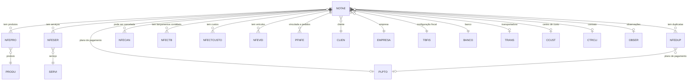

# NOTAE - Documentação Completa de Relacionamentos

## 📊 Informações Gerais

- **Nome da Tabela**: NOTAE (Nota Fiscal Eletrônica)
- **Total de Registros**: 204.952
- **Total de Colunas**: 195
- **Chave Primária**: NFECODIGO, EMPCODIGO (composite)
- **Chaves Estrangeiras**: 13
- **Índices**: 4
- **Tabelas Dependentes**: 18
- **Banco de Dados**: Firebird

## 📝 Descrição

**NOTAE** é a tabela central de Notas Fiscais Eletrônicas (NF-e) do sistema. Com **204.952 registros** e **195 colunas**, é uma das tabelas mais complexas e importantes do sistema fiscal, contendo informações completas sobre cada NF-e emitida, incluindo dados do cliente, valores, impostos calculados (ICMS, IPI, PIS, COFINS, CSLL, ISS, IR, INSS), transporte, observações e configurações fiscais.

Esta tabela é essencial para:
- **Gestão Fiscal**: Controle completo de NF-e emitidas
- **Conformidade Legal**: Atendimento às exigências da Receita Federal
- **Integração Contábil**: Base para lançamentos contábeis
- **Gestão Financeira**: Controle de recebimentos e duplicatas
- **Rastreabilidade**: Histórico completo de operações fiscais

---

## 🔑 Estrutura de Colunas (Principais)

### Identificação e Controle
| Coluna | Tipo | Descrição |
|--------|------|-----------|
| **NFECODIGO** 🔑 | INT | Código único da NF-e (PK) |
| **EMPCODIGO** 🔑 🔗 | INT | Código da empresa (PK, FK → EMPRESA) |
| **NFENRNOTA** | VARCHAR(14) | Número da nota fiscal |
| **NFEMODELO** | VARCHAR(14) | Modelo da nota fiscal |
| **NFETIPO** | VARCHAR(14) | Tipo da NF-e |
| **NFESIT** | VARCHAR(14) | Situação da NF-e |
| **NFECHNFELETRONICA** | VARCHAR(37) | Chave de acesso da NF-e |

### Cliente e Endereços
| Coluna | Tipo | Descrição |
|--------|------|-----------|
| **CLICODIGO** 🔗 | INT | Código do cliente (FK → CLIEN) |
| **CLICODIGO2** 🔗 | INT | Código do cliente secundário (FK → CLIEN) |
| **ENDCODIGO** | INT | Código do endereço de entrega |
| **ENDCOB** | INT | Código do endereço de cobrança |

### Datas e Períodos
| Coluna | Tipo | Descrição |
|--------|------|-----------|
| **NFEDTEMIS** | TIMESTAMP | Data de emissão (INDEXADO) |
| **NFEDTENTRADA** | TIMESTAMP | Data de entrada/saída (INDEXADO) |

### Valores e Totais
| Coluna | Tipo | Descrição |
|--------|------|-----------|
| **NFEVRMERC** | DECIMAL(27,2) | Valor das mercadorias |
| **NFEVRSERVI** | DECIMAL(27,2) | Valor dos serviços |
| **NFEVRDESCTO** | DECIMAL(27,2) | Valor do desconto |
| **NFEVRFRETE** | DECIMAL(27,2) | Valor do frete |
| **NFEVRSEGURO** | DECIMAL(27,2) | Valor do seguro |
| **NFEVRDESPESA** | DECIMAL(27,2) | Valor das despesas |
| **NFEVRTOTAL** | DECIMAL(27,2) | Valor total da NF-e |

### Tributação (ICMS, IPI, PIS, COFINS, CSLL, ISS, IR, INSS)
A tabela possui campos para múltiplas bases de cálculo e alíquotas, incluindo campos com sufixo "2" para segunda base de cálculo.

### Configurações Fiscais
| Coluna | Tipo | Descrição |
|--------|------|-----------|
| **FISCODIGO1** 🔗 | VARCHAR(14) | Configuração fiscal principal (FK → TBFIS) |
| **FISCODIGO2** 🔗 | VARCHAR(14) | Configuração fiscal secundária (FK → TBFIS) |

### Transporte
| Coluna | Tipo | Descrição |
|--------|------|-----------|
| **TRACODIGO** 🔗 | INT | Transportadora (FK → TRANS) |
| **NFEPLACA** | VARCHAR(37) | Placa do veículo |
| **NFETPFRETE** | VARCHAR(14) | Tipo de frete |

### Financeiro
| Coluna | Tipo | Descrição |
|--------|------|-----------|
| **BCOCODIGO** 🔗 | INT | Banco (FK → BANCO) |
| **PGTCODIGO** 🔗 | INT | Plano de pagamento (FK → PLPTO) |
| **NFETPPAGTO** | VARCHAR(14) | Tipo de pagamento |

### Observações
| Coluna | Tipo | Descrição |
|--------|------|-----------|
| **OBSCODIGO1** 🔗 | INT | Observação 1 (FK → OBSER) |
| **OBSCODIGO2** 🔗 | INT | Observação 2 (FK → OBSER) |
| **NFEOBSER** | VARCHAR(261) | Observações gerais |
| **NFEOBSER2** | VARCHAR(261) | Observações adicionais |

### Controle e Lançamentos
| Coluna | Tipo | Descrição |
|--------|------|-----------|
| **NFELCESTOQ** | VARCHAR(14) | Lançamento de estoque |
| **NFELCFINANC** | VARCHAR(14) | Lançamento financeiro |
| **NFEIMPRE** | VARCHAR(14) | Impressão |
| **NFEEFEITOCTB** | VARCHAR(14) | Efeito contábil |
| **CUSCODIGO** 🔗 | VARCHAR(14) | Centro de custo (FK → CCUST) |

---

## 🔗 Relacionamentos - Nível 1 (Diretos)

### CLIEN - Cliente (FK Obrigatória)
**Volume:** 9.251 registros

**Relacionamento:**
```
NOTAE.CLICODIGO → CLIEN.CLICODIGO (N:1) [FK: CLIEN_NOTAE]
NOTAE.CLICODIGO2 → CLIEN.CLICODIGO (N:1) [FK: CLIEN2_NOTAE]
```

**Descrição:** Cada NF-e está vinculada a um cliente. O campo `CLICODIGO2` permite referenciar um cliente secundário quando necessário.

**Proporção:** ~22 NF-e por cliente em média (204.952 / 9.251)

---

### EMPRESA - Empresa (FK Obrigatória)
**Volume:** Variável conforme número de empresas

**Relacionamento:**
```
NOTAE.EMPCODIGO → EMPRESA.EMPCODIGO (N:1) [FK: EMPRESA_NOTAE]
```

**Descrição:** Identifica a empresa que emitiu a NF-e.

---

### TBFIS - Tabela Fiscal (FK Obrigatória e Opcional)
**Volume:** Variável conforme configuração fiscal

**Relacionamento:**
```
NOTAE.FISCODIGO1 → TBFIS.FISCODIGO (N:1) [FK: TBFIS1_NOTAE]
NOTAE.FISCODIGO2 → TBFIS.FISCODIGO (N:1) [FK: TBFIS2_NOTAE]
```

**Descrição:** Define a configuração fiscal utilizada na NF-e. `FISCODIGO1` é obrigatório, `FISCODIGO2` é opcional.

---

### BANCO - Banco (FK Obrigatória)
**Volume:** Variável conforme número de bancos

**Relacionamento:**
```
NOTAE.BCOCODIGO → BANCO.BCOCODIGO (N:1) [FK: BANCO_NOTAE]
```

**Descrição:** Identifica o banco utilizado para recebimento da NF-e.

---

### PLPTO - Plano de Pagamento (FK Opcional)
**Volume:** Variável conforme planos cadastrados

**Relacionamento:**
```
NOTAE.PGTCODIGO → PLPTO.PGTCODIGO (N:1) [FK: PLPTO_NOTAE]
```

**Descrição:** Define o plano de pagamento utilizado na NF-e, que determina como as duplicatas são geradas.

---

### TRANS - Transportadora (FK Opcional)
**Volume:** Variável conforme transportadoras cadastradas

**Relacionamento:**
```
NOTAE.TRACODIGO → TRANS.TRACODIGO (N:1) [FK: TRANS_NOTAE]
```

**Descrição:** Identifica a transportadora utilizada para entrega.

---

### CCUST - Centro de Custo (FK Opcional)
**Volume:** Variável conforme centros de custo cadastrados

**Relacionamento:**
```
NOTAE.CUSCODIGO → CCUST.CUSCODIGO (N:1) [FK: CCUST_NOTAE]
```

**Descrição:** Identifica o centro de custo para contabilização.

---

### CTRCLI - Contrato de Cliente (FK Opcional)
**Volume:** Variável conforme contratos cadastrados

**Relacionamento:**
```
NOTAE.CTCNUMERO → CTRCLI.CTCNUMERO (N:1) [FK: CTRCLI_NOTAE]
NOTAE.EMPCODIGO → CTRCLI.EMPCODIGO (N:1) [FK: CTRCLI_NOTAE]
```

**Descrição:** Vincula a NF-e a um contrato específico do cliente.

---

### OBSER - Observações (FK Opcional)
**Volume:** Variável conforme observações cadastradas

**Relacionamento:**
```
NOTAE.OBSCODIGO1 → OBSER.OBSCODIGO (N:1) [FK: OBSER1_NOTAE]
NOTAE.OBSCODIGO2 → OBSER.OBSCODIGO (N:1) [FK: OBSER2_NOTAE]
```

**Descrição:** Permite adicionar observações padronizadas à NF-e.

---

## 📊 Tabelas que Referenciam NOTAE

### Tabelas de Detalhes da NF-e

#### NFEPRO - Produtos da NF-e
**Volume:** 1.913.065 registros

**Relacionamento:**
```
NFEPRO.NFECODIGO → NOTAE.NFECODIGO (N:1)
NFEPRO.EMPCODIGO → NOTAE.EMPCODIGO (N:1)
```

**Descrição:** Itens de produtos incluídos na NF-e.

---

#### NFESER - Serviços da NF-e
**Volume:** 22.492 registros

**Relacionamento:**
```
NFESER.NFECODIGO → NOTAE.NFECODIGO (N:1)
NFESER.EMPCODIGO → NOTAE.EMPCODIGO (N:1)
```

**Descrição:** Itens de serviços incluídos na NF-e.

---

#### NFEDUP - Duplicatas da NF-e
**Volume:** 227.404 registros

**Relacionamento:**
```
NFEDUP.NFECODIGO → NOTAE.NFECODIGO (N:1)
NFEDUP.EMPCODIGO → NOTAE.EMPCODIGO (N:1)
```

**Descrição:** Parcelas de pagamento da NF-e.

---

#### NFECAN - Cancelamentos da NF-e
**Volume:** 35 registros

**Relacionamento:**
```
NFECAN.NFECODIGO → NOTAE.NFECODIGO (N:1)
NFECAN.EMPCODIGO → NOTAE.EMPCODIGO (N:1)
```

**Descrição:** Registro de cancelamentos da NF-e.

---

#### NFECTB - Lançamentos Contábeis
**Volume:** Variável

**Relacionamento:**
```
NFECTB.NFECODIGO → NOTAE.NFECODIGO (N:1)
NFECTB.EMPCODIGO → NOTAE.EMPCODIGO (N:1)
```

**Descrição:** Lançamentos contábeis relacionados à NF-e.

---

#### NFECTCUSTO - Custos da NF-e
**Volume:** Variável

**Relacionamento:**
```
NFECTCUSTO.NFECODIGO → NOTAE.NFECODIGO (N:1)
NFECTCUSTO.EMPCODIGO → NOTAE.EMPCODIGO (N:1)
```

**Descrição:** Custos relacionados à NF-e.

---

#### NFEVEI - Veículos da NF-e
**Volume:** Variável

**Relacionamento:**
```
NFEVEI.NFECODIGO → NOTAE.NFECODIGO (N:1)
NFEVEI.EMPCODIGO → NOTAE.EMPCODIGO (N:1)
```

**Descrição:** Informações de veículos relacionados à NF-e.

---

#### PFNFE - Pedido Fornecedor x NF-e
**Volume:** Variável

**Relacionamento:**
```
PFNFE.NFECODIGO → NOTAE.NFECODIGO (N:1)
PFNFE.EMPCODIGO → NOTAE.EMPCODIGO (N:1)
```

**Descrição:** Vinculação entre pedidos de fornecedor e NF-e.

---

#### RATEIOCONHECIMENTOFRETE - Rateio de Frete
**Volume:** Variável

**Relacionamento:**
```
RATEIOCONHECIMENTOFRETE.NFECODIGO → NOTAE.NFECODIGO (N:1)
RATEIOCONHECIMENTOFRETE.EMPCODIGO → NOTAE.EMPCODIGO (N:1)
```

**Descrição:** Rateio de frete entre múltiplas NF-e.

---

## 🔗 Relacionamentos - Nível 2 (Indiretos)

### Através de NFEPRO

#### PRODU - Produto
```
NOTAE → NFEPRO → PRODU
```
**Descrição:** Permite identificar quais produtos foram vendidos em cada NF-e.

---

### Através de NFEDUP

#### PLPTO - Plano de Pagamento
```
NOTAE → NFEDUP → PLPTO (via NOTAE.PGTCODIGO)
```
**Descrição:** Permite identificar como as duplicatas foram geradas.

---

### Através de CLIEN

#### PEDID - Pedidos
```
NOTAE → CLIEN → PEDID
```
**Descrição:** Permite identificar pedidos relacionados ao cliente da NF-e.

---

## 🗺️ Diagrama de Relacionamentos



---

## 💡 Casos de Uso Práticos

### 1. Consultar NF-e Completa com Todos os Dados

```sql
SELECT 
    nfe.NFECODIGO,
    nfe.EMPCODIGO,
    nfe.NFENRNOTA,
    nfe.NFEDTEMIS,
    nfe.NFEDTENTRADA,
    nfe.NFEVRTOTAL,
    nfe.NFESIT,
    nfe.NFECHNFELETRONICA,
    cli.CLINOME,
    cli.CLICGC,
    emp.EMPNOME,
    tbf.FISDESCRICAO AS CONFIGURACAO_FISCAL,
    ban.BCONOME AS BANCO,
    COUNT(nfep.NFESEQ) AS QTD_PRODUTOS,
    COUNT(nfes.NFESSEQ) AS QTD_SERVICOS,
    COUNT(nfed.NFEDSEQ) AS QTD_DUPLICATAS
FROM NOTAE nfe
INNER JOIN CLIEN cli ON nfe.CLICODIGO = cli.CLICODIGO
INNER JOIN EMPRESA emp ON nfe.EMPCODIGO = emp.EMPCODIGO
LEFT JOIN TBFIS tbf ON nfe.FISCODIGO1 = tbf.FISCODIGO
LEFT JOIN BANCO ban ON nfe.BCOCODIGO = ban.BCOCODIGO
LEFT JOIN NFEPRO nfep ON nfe.NFECODIGO = nfep.NFECODIGO 
    AND nfe.EMPCODIGO = nfep.EMPCODIGO
LEFT JOIN NFESER nfes ON nfe.NFECODIGO = nfes.NFECODIGO 
    AND nfe.EMPCODIGO = nfes.EMPCODIGO
LEFT JOIN NFEDUP nfed ON nfe.NFECODIGO = nfed.NFECODIGO 
    AND nfe.EMPCODIGO = nfed.EMPCODIGO
WHERE nfe.NFECODIGO = :nfecodigo
    AND nfe.EMPCODIGO = :empcodigo
GROUP BY nfe.NFECODIGO, nfe.EMPCODIGO, nfe.NFENRNOTA, nfe.NFEDTEMIS, 
    nfe.NFEDTENTRADA, nfe.NFEVRTOTAL, nfe.NFESIT, nfe.NFECHNFELETRONICA,
    cli.CLINOME, cli.CLICGC, emp.EMPNOME, tbf.FISDESCRICAO, ban.BCONOME;
```

### 2. Relatório de Vendas por Período

```sql
SELECT 
    DATE(nfe.NFEDTEMIS) AS DATA_EMISSAO,
    emp.EMPNOME AS EMPRESA,
    COUNT(DISTINCT nfe.NFECODIGO) AS QTD_NFES,
    SUM(nfe.NFEVRTOTAL) AS VALOR_TOTAL,
    SUM(nfe.NFEVRICMS) AS VALOR_ICMS,
    SUM(nfe.NFEVRIPI) AS VALOR_IPI,
    SUM(nfe.NFEVRPIS) AS VALOR_PIS,
    SUM(nfe.NFEVRCOFINS) AS VALOR_COFINS
FROM NOTAE nfe
INNER JOIN EMPRESA emp ON nfe.EMPCODIGO = emp.EMPCODIGO
WHERE nfe.NFEDTEMIS BETWEEN :data_inicio AND :data_fim
    AND nfe.NFESIT = 'AUTORIZADA'
GROUP BY DATE(nfe.NFEDTEMIS), emp.EMPNOME
ORDER BY DATA_EMISSAO DESC, VALOR_TOTAL DESC;
```

### 3. NF-e com Duplicatas Vencidas

```sql
SELECT 
    nfe.NFECODIGO,
    nfe.NFENRNOTA,
    nfe.NFEDTEMIS,
    nfe.NFEVRTOTAL,
    cli.CLINOME,
    COUNT(nfed.NFEDSEQ) AS QTD_DUPLICATAS,
    SUM(CASE WHEN nfed.NFEDDTVENCTO < CURRENT_DATE THEN nfed.NFEDVALOR ELSE 0 END) AS VALOR_VENCIDO,
    SUM(CASE WHEN nfed.NFEDDTVENCTO BETWEEN CURRENT_DATE AND CURRENT_DATE + 7 THEN nfed.NFEDVALOR ELSE 0 END) AS VALOR_VENCE_7_DIAS
FROM NOTAE nfe
INNER JOIN CLIEN cli ON nfe.CLICODIGO = cli.CLICODIGO
LEFT JOIN NFEDUP nfed ON nfe.NFECODIGO = nfed.NFECODIGO 
    AND nfe.EMPCODIGO = nfed.EMPCODIGO
WHERE nfe.NFESIT = 'AUTORIZADA'
GROUP BY nfe.NFECODIGO, nfe.NFENRNOTA, nfe.NFEDTEMIS, nfe.NFEVRTOTAL, cli.CLINOME
HAVING SUM(CASE WHEN nfed.NFEDDTVENCTO < CURRENT_DATE THEN nfed.NFEDVALOR ELSE 0 END) > 0
ORDER BY VALOR_VENCIDO DESC;
```

### 4. Análise Tributária por NF-e

```sql
SELECT 
    nfe.NFECODIGO,
    nfe.NFENRNOTA,
    nfe.NFEDTEMIS,
    nfe.NFEVRTOTAL,
    nfe.NFEBASEICMS,
    nfe.NFEVRICMS,
    nfe.NFEBASEIPI,
    nfe.NFEVRIPI,
    nfe.NFEBASEPIS,
    nfe.NFEVRPIS,
    nfe.NFEBASECOFINS,
    nfe.NFEVRCOFINS,
    nfe.NFEBASECSLL,
    nfe.NFEVRCSLL,
    (nfe.NFEVRICMS + nfe.NFEVRIPI + nfe.NFEVRPIS + nfe.NFEVRCOFINS + nfe.NFEVRCSLL) AS TOTAL_IMPOSTOS,
    (nfe.NFEVRTOTAL - (nfe.NFEVRICMS + nfe.NFEVRIPI + nfe.NFEVRPIS + nfe.NFEVRCOFINS + nfe.NFEVRCSLL)) AS VALOR_LIQUIDO
FROM NOTAE nfe
WHERE nfe.NFECODIGO = :nfecodigo
    AND nfe.EMPCODIGO = :empcodigo;
```

---

## 📈 Estatísticas e Insights

### Volume de Dados
- **Total de NF-e**: 204.952 registros
- **Média**: Aproximadamente 22 NF-e por cliente
- **Distribuição**: Permite análise de vendas por período, cliente, empresa, etc.

### Análise Fiscal
- Permite análise completa de impostos por NF-e
- Facilita geração de relatórios fiscais (SPED Fiscal, EFD, etc.)
- Suporta múltiplas bases de cálculo para diferentes impostos

### Integração
- **18 tabelas dependentes** mostram a centralidade de NOTAE no sistema
- Integração completa com produtos, serviços, duplicatas, cancelamentos
- Suporte a integração contábil e de custos

---

## ⚡ Performance e Otimização

### Índices Existentes

| Nome | Colunas |
|------|---------|
| INDNFECODIGO | NFECODIGO |
| INDNFEDTEMIS | NFEDTEMIS |
| INDNFEDTENTRADA | NFEDTENTRADA |
| INDNFENRNOTA | NFENRNOTA |

### Índices Recomendados Adicionais

```sql
-- Índice para consultas por cliente
CREATE INDEX IDX_NOTAE_CLIENTE ON NOTAE (CLICODIGO);

-- Índice para consultas por empresa e data
CREATE INDEX IDX_NOTAE_EMP_DATA ON NOTAE (EMPCODIGO, NFEDTEMIS);

-- Índice para consultas por situação
CREATE INDEX IDX_NOTAE_SITUACAO ON NOTAE (NFESIT);

-- Índice composto para relatórios fiscais
CREATE INDEX IDX_NOTAE_EMP_CLI_DATA ON NOTAE (EMPCODIGO, CLICODIGO, NFEDTEMIS);
```

### Otimizações de Consulta

1. **Sempre usar chave composta completa** nas consultas:
   ```sql
   WHERE NFECODIGO = :nfecodigo AND EMPCODIGO = :empcodigo
   ```

2. **Usar filtros de data** para reduzir o conjunto de resultados
3. **Evitar SELECT *** devido ao grande número de colunas
4. **Usar índices** nas consultas frequentes

---

## 🔒 Integridade de Dados

### Validações Importantes

1. **Chave Composta**: `NFECODIGO` + `EMPCODIGO` deve ser única
2. **Cliente**: `CLICODIGO` deve existir em `CLIEN`
3. **Empresa**: `EMPCODIGO` deve existir em `EMPRESA`
4. **Configuração Fiscal**: `FISCODIGO1` deve existir em `TBFIS`
5. **Banco**: `BCOCODIGO` deve existir em `BANCO`
6. **Soma de Valores**: Valores dos itens (NFEPRO + NFESER) devem somar `NFEVRTOTAL`
7. **Soma de Duplicatas**: Soma de `NFEDUP.NFEDVALOR` deve ser igual a `NFEVRTOTAL`

---

## 📚 Integração com Aplicação (Laravel)

### Model NOTAE

```php
<?php

namespace App\Models;

use Illuminate\Database\Eloquent\Model;
use Illuminate\Database\Eloquent\Relations\BelongsTo;
use Illuminate\Database\Eloquent\Relations\HasMany;

final class NOTAE extends Model
{
    protected $table = 'NOTAE';
    
    protected $primaryKey = ['NFECODIGO', 'EMPCODIGO'];
    
    public $incrementing = false;
    
    protected $fillable = [
        'NFECODIGO', 'EMPCODIGO', 'NFENRNOTA', 'NFEDTEMIS',
        'CLICODIGO', 'FISCODIGO1', 'BCOCODIGO', 'NFEVRTOTAL',
        // ... outros campos
    ];
    
    protected $casts = [
        'NFEDTEMIS' => 'datetime',
        'NFEDTENTRADA' => 'datetime',
        'NFEVRTOTAL' => 'decimal:2',
        'NFEVRICMS' => 'decimal:2',
        'NFEVRIPI' => 'decimal:2',
        // ... outros casts
    ];
    
    /**
     * Relacionamento com CLIEN
     */
    public function cliente(): BelongsTo
    {
        return $this->belongsTo(CLIEN::class, 'CLICODIGO', 'CLICODIGO');
    }
    
    /**
     * Relacionamento com EMPRESA
     */
    public function empresa(): BelongsTo
    {
        return $this->belongsTo(EMPRESA::class, 'EMPCODIGO', 'EMPCODIGO');
    }
    
    /**
     * Relacionamento com TBFIS
     */
    public function configuracaoFiscal(): BelongsTo
    {
        return $this->belongsTo(TBFIS::class, 'FISCODIGO1', 'FISCODIGO');
    }
    
    /**
     * Relacionamento com NFEPRO
     */
    public function produtos(): HasMany
    {
        return $this->hasMany(NFEPRO::class, ['NFECODIGO', 'EMPCODIGO'], ['NFECODIGO', 'EMPCODIGO']);
    }
    
    /**
     * Relacionamento com NFESER
     */
    public function servicos(): HasMany
    {
        return $this->hasMany(NFESER::class, ['NFECODIGO', 'EMPCODIGO'], ['NFECODIGO', 'EMPCODIGO']);
    }
    
    /**
     * Relacionamento com NFEDUP
     */
    public function duplicatas(): HasMany
    {
        return $this->hasMany(NFEDUP::class, ['NFECODIGO', 'EMPCODIGO'], ['NFECODIGO', 'EMPCODIGO']);
    }
    
    /**
     * Scope para NF-e autorizadas
     */
    public function scopeAutorizadas($query)
    {
        return $query->where('NFESIT', 'AUTORIZADA');
    }
    
    /**
     * Scope para NF-e por período
     */
    public function scopePorPeriodo($query, $dataInicio, $dataFim)
    {
        return $query->whereBetween('NFEDTEMIS', [$dataInicio, $dataFim]);
    }
}
```

---

## ✅ Boas Práticas

### Design
1. **Manter unicidade** da chave composta (`NFECODIGO` + `EMPCODIGO`)
2. **Validar soma** dos valores dos itens igual ao valor total
3. **Validar soma** das duplicatas igual ao valor total
4. **Manter consistência** entre campos fiscais e situação tributária

### Performance
1. **Usar índices** nas consultas frequentes
2. **Evitar SELECT *** devido ao grande número de colunas
3. **Usar filtros de data** para reduzir volume de dados
4. **Considerar particionamento** por data para grandes volumes

### Integridade
1. **Validar existência** de todas as entidades relacionadas antes de inserir
2. **Verificar cálculos** tributários para consistência
3. **Manter referência** ao plano de pagamento quando aplicável
4. **Garantir consistência** entre NF-e e seus detalhes

### Manutenção
1. **Monitorar crescimento** da tabela
2. **Revisar periodicamente** NF-e canceladas ou não utilizadas
3. **Garantir integração** contábil através de `NFECTB`
4. **Manter histórico** de alterações através de tabelas de log

---

**Documentação gerada em**: 2025-01-27

**Banco de dados**: Firebird

