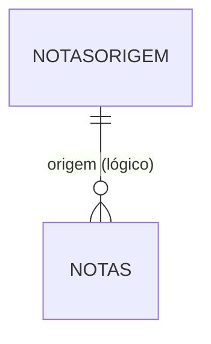

# NOTASORIGEM - Documentação Completa de Relacionamentos

## 📊 Informações Gerais

- **Nome da Tabela**: NOTASORIGEM (Origem de Nota Fiscal Tradicional)
- **Total de Registros**: 4
- **Total de Colunas**: 2
- **Chave Primária**: NOTASCODIGO
- **Chaves Estrangeiras**: 0
- **Índices**: 0
- **Tabelas Dependentes**: 0
- **Banco de Dados**: Firebird

## 📝 Descrição

**NOTASORIGEM** é uma tabela mestre de referência que define os tipos de origem possíveis para uma Nota Fiscal tradicional. Com apenas **4 registros**, é uma tabela de configuração simples que serve como catálogo de valores para o campo `NFORIGEM` na tabela `NOTAS`.

Esta tabela é essencial para:
- **Classificação**: Identificar a origem da nota fiscal (ex: Venda Direta, Pedido, Importação, etc.)
- **Relatórios**: Agrupar notas fiscais por origem para análises
- **Validação**: Garantir que apenas origens válidas sejam utilizadas

---

## 🔑 Estrutura de Colunas

| Coluna | Tipo | Descrição |
|--------|------|-----------|
| **NOTASCODIGO** 🔑 | VARCHAR(14) | Código único da origem (PK) |
| **NOTASDESCRICAO** | VARCHAR(37) | Descrição da origem |

---

## 🔗 Relacionamentos - Nível 1 (Diretos)

### Nenhum Relacionamento Formal

Esta tabela não possui chaves estrangeiras formais, mas é referenciada logicamente pela tabela `NOTAS` através do campo `NFORIGEM`.

---

## 🔗 Relacionamentos - Nível 2 (Indiretos)

### NOTAS - Notas Fiscais Tradicionais (Relacionamento Lógico)

**Relacionamento Lógico:**
```
NOTAS.NFORIGEM → NOTASORIGEM.NOTASCODIGO (N:1)
```

**Descrição:** O campo `NFORIGEM` na tabela `NOTAS` referencia logicamente esta tabela para identificar a origem da nota fiscal.

**Uso:** Classificar e filtrar notas fiscais por origem em relatórios e consultas.

---

## 🗺️ Diagrama de Relacionamentos



---

## 💡 Casos de Uso Práticos

### 1. Consultar Todas as Origens Disponíveis

```sql
SELECT NOTASCODIGO, NOTASDESCRICAO
FROM NOTASORIGEM
ORDER BY NOTASCODIGO;
```

### 2. Relatório de Notas Fiscais por Origem

```sql
SELECT 
    no.NOTASCODIGO AS CODIGO_ORIGEM,
    no.NOTASDESCRICAO AS DESCRICAO_ORIGEM,
    COUNT(nf.NFCODIGO) AS QTD_NOTAS,
    SUM(nf.NFVRTOTAL) AS VALOR_TOTAL
FROM NOTASORIGEM no
LEFT JOIN NOTAS nf ON no.NOTASCODIGO = nf.NFORIGEM
GROUP BY no.NOTASCODIGO, no.NOTASDESCRICAO
ORDER BY QTD_NOTAS DESC;
```

### 3. Validar Origem Antes de Inserir Nota Fiscal

```sql
SELECT COUNT(*) AS ORIGEM_VALIDA
FROM NOTASORIGEM
WHERE NOTASCODIGO = :origem;
```

---

## 📈 Estatísticas e Insights

### Volume de Dados
- **Total de Origens**: 4 registros
- **Uso**: Tabela de referência/catálogo
- **Frequência de Alteração**: Baixa (tabela de configuração)

---

## ⚡ Performance e Otimização

Como tabela pequena (4 registros), índices não são necessários. A tabela inteira pode ser carregada em memória.

---

## 🔒 Integridade de Dados

### Validações Importantes

1. **Código Único**: `NOTASCODIGO` deve ser único
2. **Descrição Obrigatória**: `NOTASDESCRICAO` deve estar preenchida
3. **Consistência**: Códigos utilizados em `NOTAS.NFORIGEM` devem existir nesta tabela

---

## 📚 Integração com Aplicação (Laravel)

### Model NOTASORIGEM

```php
<?php

namespace App\Models;

use Illuminate\Database\Eloquent\Model;

final class NOTASORIGEM extends Model
{
    protected $table = 'NOTASORIGEM';
    
    protected $primaryKey = 'NOTASCODIGO';
    
    public $incrementing = false;
    
    protected $fillable = [
        'NOTASCODIGO',
        'NOTASDESCRICAO',
    ];
    
    /**
     * Relacionamento lógico com NOTAS
     */
    public function notasFiscais()
    {
        return $this->hasMany(NOTAS::class, 'NFORIGEM', 'NOTASCODIGO');
    }
}
```

---

## ✅ Boas Práticas

### Design
1. **Manter códigos consistentes** com o padrão do sistema
2. **Descrições claras** e objetivas
3. **Evitar exclusão** de registros já utilizados em `NOTAS`

### Performance
1. **Cachear valores** em memória devido ao pequeno volume
2. **Usar em dropdowns** e listas de seleção

### Integridade
1. **Validar existência** antes de usar em `NOTAS`
2. **Não permitir exclusão** de códigos em uso

---

**Documentação gerada em**: 2025-01-27

**Banco de dados**: Firebird

