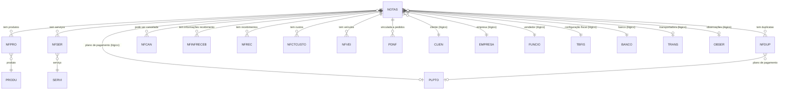

# NOTAS - Documentação Completa de Relacionamentos

## 📊 Informações Gerais

- **Nome da Tabela**: NOTAS (Nota Fiscal Tradicional)
- **Total de Registros**: 1.206.013
- **Total de Colunas**: 172
- **Chave Primária**: NFCODIGO, EMPCODIGO (composite)
- **Chaves Estrangeiras**: 0 (relacionamentos lógicos)
- **Índices**: 6
- **Tabelas Dependentes**: 44
- **Banco de Dados**: Firebird

## 📝 Descrição

**NOTAS** é a tabela central de Notas Fiscais tradicionais (não eletrônicas) do sistema. Com **1.206.013 registros** e **172 colunas**, é uma das tabelas mais volumosas e importantes do sistema fiscal, contendo informações completas sobre cada nota fiscal emitida, incluindo dados do cliente, valores, impostos calculados (ICMS, IPI, PIS, COFINS, ISS, IR, INSS), transporte, observações e configurações fiscais.

Esta tabela é essencial para:
- **Gestão Fiscal**: Controle completo de notas fiscais tradicionais emitidas
- **Conformidade Legal**: Atendimento às exigências fiscais
- **Integração Contábil**: Base para lançamentos contábeis
- **Gestão Financeira**: Controle de recebimentos e duplicatas
- **Rastreabilidade**: Histórico completo de operações fiscais
- **Legado**: Suporte a notas fiscais não eletrônicas

**Diferença em relação a NOTAE**: `NOTAS` gerencia notas fiscais tradicionais (modelo 1/1A), enquanto `NOTAE` gerencia Notas Fiscais Eletrônicas (NF-e). Ambas têm estruturas similares mas são independentes.

---

## 🔑 Estrutura de Colunas (Principais)

### Identificação e Controle
| Coluna | Tipo | Descrição |
|--------|------|-----------|
| **NFCODIGO** 🔑 | INT | Código único da nota fiscal (PK) |
| **EMPCODIGO** 🔑 | INT | Código da empresa (PK) |
| **NFDTEMIS** | TIMESTAMP | Data de emissão (INDEXADO) |
| **NFMODELO** | VARCHAR(14) | Modelo da nota fiscal |
| **NFSIT** | VARCHAR(14) | Situação da nota fiscal |
| **NFORIGEM** | VARCHAR(14) | Origem da nota fiscal |
| **NFCHNFELETRONICA** | VARCHAR(37) | Chave de acesso (se convertida para eletrônica) |

### Cliente e Endereços
| Coluna | Tipo | Descrição |
|--------|------|-----------|
| **CLICODIGO** | INT | Código do cliente |
| **ENDENT** | INT | Código do endereço de entrega |
| **ENDFAT** | INT | Código do endereço de faturamento |
| **ENDCOB** | INT | Código do endereço de cobrança |

### Valores e Totais
| Coluna | Tipo | Descrição |
|--------|------|-----------|
| **NFVRMERC** | DECIMAL(27,2) | Valor das mercadorias |
| **NFVRSERVI** | DECIMAL(27,2) | Valor dos serviços |
| **NFVRDESCTO** | DECIMAL(27,2) | Valor do desconto |
| **NFVRFRETE** | DECIMAL(27,2) | Valor do frete |
| **NFVRSEGURO** | DECIMAL(27,2) | Valor do seguro |
| **NFVRDESPESA** | DECIMAL(27,2) | Valor das despesas |
| **NFVRTOTAL** | DECIMAL(27,2) | Valor total da nota |

### Tributação
Campos para ICMS, IPI, PIS, COFINS, ISS, IR, INSS, CSLL, etc.

### Configurações Fiscais
| Coluna | Tipo | Descrição |
|--------|------|-----------|
| **FISCODIGO1** | VARCHAR(14) | Configuração fiscal principal |
| **FISCODIGO2** | VARCHAR(14) | Configuração fiscal secundária |

### Transporte
| Coluna | Tipo | Descrição |
|--------|------|-----------|
| **TRACODIGO1** | INT | Transportadora principal |
| **TRACODIGO2** | INT | Transportadora secundária |
| **NFPLACA** | VARCHAR(37) | Placa do veículo |
| **NFTPFRETE** | VARCHAR(14) | Tipo de frete |

### Financeiro
| Coluna | Tipo | Descrição |
|--------|------|-----------|
| **BCOCODIGO** | INT | Banco |
| **COBCODIGO** | VARCHAR(14) | Código de cobrança |
| **PGTCODIGO** | INT | Plano de pagamento |

### Funcionário e Comissões
| Coluna | Tipo | Descrição |
|--------|------|-----------|
| **FUNCODIGO** | INT | Funcionário vendedor (INDEXADO) |
| **FUNCODIGO2** | INT | Funcionário secundário |
| **NFPCCOMIS** | DECIMAL(27,2) | Percentual de comissão |
| **NFPCCOMIS2** | DECIMAL(27,2) | Percentual de comissão secundário |

### Observações
| Coluna | Tipo | Descrição |
|--------|------|-----------|
| **OBSCODIGO1** | INT | Observação 1 |
| **OBSCODIGO2** | INT | Observação 2 |
| **NFOBSER** | VARCHAR(261) | Observações gerais |
| **NFOBSER2** | VARCHAR(261) | Observações adicionais |

### Controle e Lançamentos
| Coluna | Tipo | Descrição |
|--------|------|-----------|
| **NFLCESTOQ** | VARCHAR(14) | Lançamento de estoque |
| **NFLCFINANC** | VARCHAR(14) | Lançamento financeiro |
| **NFLCCOMIS** | VARCHAR(14) | Lançamento de comissão |
| **NFIMPRE** | VARCHAR(14) | Impressão |
| **NFEFEITOCTB** | VARCHAR(14) | Efeito contábil |
| **CUSCODIGO** | VARCHAR(14) | Centro de custo |

---

## 🔗 Relacionamentos - Nível 1 (Diretos)

### Relacionamentos Lógicos (Sem FKs Formais)

Embora não existam chaves estrangeiras formais, a tabela referencia logicamente:

#### CLIEN - Cliente
```
NOTAS.CLICODIGO → CLIEN.CLICODIGO (N:1)
```

**Descrição:** Cada nota fiscal está vinculada a um cliente.

**Proporção:** ~130 notas por cliente em média (1.206.013 / 9.251)

---

#### EMPRESA - Empresa
```
NOTAS.EMPCODIGO → EMPRESA.EMPCODIGO (N:1)
```

**Descrição:** Identifica a empresa que emitiu a nota fiscal.

---

#### FUNCIO - Funcionário/Vendedor
```
NOTAS.FUNCODIGO → FUNCIO.FUNCODIGO (N:1)
NOTAS.FUNCODIGO2 → FUNCIO.FUNCODIGO (N:1)
```

**Descrição:** Identifica o funcionário vendedor responsável pela nota.

---

#### TBFIS - Tabela Fiscal
```
NOTAS.FISCODIGO1 → TBFIS.FISCODIGO (N:1)
NOTAS.FISCODIGO2 → TBFIS.FISCODIGO (N:1)
```

**Descrição:** Define a configuração fiscal utilizada na nota.

---

#### BANCO - Banco
```
NOTAS.BCOCODIGO → BANCO.BCOCODIGO (N:1)
```

**Descrição:** Identifica o banco utilizado para recebimento.

---

#### PLPTO - Plano de Pagamento
```
NOTAS.PGTCODIGO → PLPTO.PGTCODIGO (N:1)
```

**Descrição:** Define o plano de pagamento utilizado.

---

#### TRANS - Transportadora
```
NOTAS.TRACODIGO1 → TRANS.TRACODIGO (N:1)
NOTAS.TRACODIGO2 → TRANS.TRACODIGO (N:1)
```

**Descrição:** Identifica a transportadora utilizada.

---

#### OBSER - Observações
```
NOTAS.OBSCODIGO1 → OBSER.OBSCODIGO (N:1)
NOTAS.OBSCODIGO2 → OBSER.OBSCODIGO (N:1)
```

**Descrição:** Permite adicionar observações padronizadas.

---

## 📊 Tabelas que Referenciam NOTAS

### Tabelas de Detalhes da Nota Fiscal

#### NFPRO - Produtos da Nota Fiscal
**Volume:** 3.724.413 registros

**Relacionamento:**
```
NFPRO.NFCODIGO → NOTAS.NFCODIGO (N:1)
NFPRO.EMPCODIGO → NOTAS.EMPCODIGO (N:1)
```

**Descrição:** Itens de produtos incluídos na nota fiscal.

---

#### NFSER - Serviços da Nota Fiscal
**Volume:** Variável

**Relacionamento:**
```
NFSER.NFCODIGO → NOTAS.NFCODIGO (N:1)
NFSER.EMPCODIGO → NOTAS.EMPCODIGO (N:1)
```

**Descrição:** Itens de serviços incluídos na nota fiscal.

---

#### NFDUP - Duplicatas da Nota Fiscal
**Volume:** 2.621.608 registros

**Relacionamento:**
```
NFDUP.NFCODIGO → NOTAS.NFCODIGO (N:1)
NFDUP.EMPCODIGO → NOTAS.EMPCODIGO (N:1)
```

**Descrição:** Parcelas de pagamento da nota fiscal.

---

#### NFCAN - Cancelamentos da Nota Fiscal
**Volume:** 5.057 registros

**Relacionamento:**
```
NFCAN.NFCODIGO → NOTAS.NFCODIGO (N:1)
NFCAN.EMPCODIGO → NOTAS.EMPCODIGO (N:1)
```

**Descrição:** Registro de cancelamentos da nota fiscal.

---

#### NFINFRECEB - Informações de Recebimento
**Volume:** 1.051.559 registros

**Relacionamento:**
```
NFINFRECEB.NFCODIGO → NOTAS.NFCODIGO (N:1)
NFINFRECEB.EMPCODIGO → NOTAS.EMPCODIGO (N:1)
```

**Descrição:** Informações de recebimento relacionadas à nota fiscal.

---

#### NFREC - Recebimentos da Nota Fiscal
**Volume:** 1.060.552 registros

**Relacionamento:**
```
NFREC.NFCODIGO → NOTAS.NFCODIGO (N:1)
NFREC.EMPCODIGO → NOTAS.EMPCODIGO (N:1)
```

**Descrição:** Recebimentos efetivos da nota fiscal.

---

#### NFCTCUSTO - Custos da Nota Fiscal
**Volume:** Variável

**Relacionamento:**
```
NFCTCUSTO.NFCODIGO → NOTAS.NFCODIGO (N:1)
NFCTCUSTO.EMPCODIGO → NOTAS.EMPCODIGO (N:1)
```

**Descrição:** Custos relacionados à nota fiscal.

---

#### NFSCTB - Lançamentos Contábeis
**Volume:** Variável

**Relacionamento:**
```
NFSCTB.NFCODIGO → NOTAS.NFCODIGO (N:1)
NFSCTB.EMPCODIGO → NOTAS.EMPCODIGO (N:1)
```

**Descrição:** Lançamentos contábeis relacionados à nota fiscal.

---

#### NFVEI - Veículos da Nota Fiscal
**Volume:** Variável

**Relacionamento:**
```
NFVEI.NFCODIGO → NOTAS.NFCODIGO (N:1)
NFVEI.EMPCODIGO → NOTAS.EMPCODIGO (N:1)
```

**Descrição:** Informações de veículos relacionados à nota fiscal.

---

#### PDNF - Pedido x Nota Fiscal
**Volume:** Variável

**Relacionamento:**
```
PDNF.NFCODIGO → NOTAS.NFCODIGO (N:1)
PDNF.EMPCODIGO → NOTAS.EMPCODIGO (N:1)
```

**Descrição:** Vinculação entre pedidos e notas fiscais.

---

#### Outras Tabelas Dependentes
- **CPNF** - Cupons relacionados
- **CTCDUP** - Contratos relacionados
- **EXPNFTRANS** - Exportação de notas
- **NFINFRECEBANT** - Informações de recebimento anteriores
- **NFSEXML** - XML de NFS-e
- **NOTACRED** - Notas de crédito
- **NOTASINFO** - Informações adicionais
- **NOTASRETNFE** - Retorno de NF-e
- **PCTNF** - Percentuais relacionados
- **PDNFREMBENEF** - Pedidos com benefícios
- **PEDREMTERCEIRO** - Pedidos de terceiros
- **PROTOITEMNOTAS** - Protocolos de itens

---

## 🔗 Relacionamentos - Nível 2 (Indiretos)

### Através de NFPRO

#### PRODU - Produto
```
NOTAS → NFPRO → PRODU
```
**Descrição:** Permite identificar quais produtos foram vendidos em cada nota.

---

### Através de NFDUP

#### PLPTO - Plano de Pagamento
```
NOTAS → NFDUP → PLPTO (via NOTAS.PGTCODIGO)
```
**Descrição:** Permite identificar como as duplicatas foram geradas.

---

### Através de CLIEN

#### PEDID - Pedidos
```
NOTAS → CLIEN → PEDID
```
**Descrição:** Permite identificar pedidos relacionados ao cliente da nota.

---

## 🗺️ Diagrama de Relacionamentos



---

## 💡 Casos de Uso Práticos

### 1. Consultar Nota Fiscal Completa

```sql
SELECT 
    nf.NFCODIGO,
    nf.EMPCODIGO,
    nf.NFDTEMIS,
    nf.NFDTSAIDA,
    nf.NFVRTOTAL,
    nf.NFSIT,
    cli.CLINOME,
    cli.CLICGC,
    emp.EMPNOME,
    func.FUNNOME AS VENDEDOR,
    COUNT(nfp.NFPSEQ) AS QTD_PRODUTOS,
    COUNT(nfs.NFSSEQ) AS QTD_SERVICOS,
    COUNT(nfd.NFDSEQ) AS QTD_DUPLICATAS
FROM NOTAS nf
LEFT JOIN CLIEN cli ON nf.CLICODIGO = cli.CLICODIGO
LEFT JOIN EMPRESA emp ON nf.EMPCODIGO = emp.EMPCODIGO
LEFT JOIN FUNCIO func ON nf.FUNCODIGO = func.FUNCODIGO
LEFT JOIN NFPRO nfp ON nf.NFCODIGO = nfp.NFCODIGO AND nf.EMPCODIGO = nfp.EMPCODIGO
LEFT JOIN NFSER nfs ON nf.NFCODIGO = nfs.NFCODIGO AND nf.EMPCODIGO = nfs.EMPCODIGO
LEFT JOIN NFDUP nfd ON nf.NFCODIGO = nfd.NFCODIGO AND nf.EMPCODIGO = nfd.EMPCODIGO
WHERE nf.NFCODIGO = :nfcodigo
    AND nf.EMPCODIGO = :empcodigo
GROUP BY nf.NFCODIGO, nf.EMPCODIGO, nf.NFDTEMIS, nf.NFDTSAIDA, nf.NFVRTOTAL, 
    nf.NFSIT, cli.CLINOME, cli.CLICGC, emp.EMPNOME, func.FUNNOME;
```

### 2. Relatório de Vendas por Vendedor

```sql
SELECT 
    func.FUNCODIGO,
    func.FUNNOME AS VENDEDOR,
    COUNT(DISTINCT nf.NFCODIGO) AS QTD_NOTAS,
    SUM(nf.NFVRTOTAL) AS VALOR_TOTAL,
    SUM(nf.NFPCCOMIS * nf.NFVRTOTAL / 100) AS COMISSAO_TOTAL
FROM NOTAS nf
INNER JOIN FUNCIO func ON nf.FUNCODIGO = func.FUNCODIGO
WHERE nf.NFDTEMIS BETWEEN :data_inicio AND :data_fim
    AND nf.NFSIT = 'AUTORIZADA'
GROUP BY func.FUNCODIGO, func.FUNNOME
ORDER BY VALOR_TOTAL DESC;
```

### 3. Notas com Duplicatas Vencidas

```sql
SELECT 
    nf.NFCODIGO,
    nf.NFDTEMIS,
    nf.NFVRTOTAL,
    cli.CLINOME,
    COUNT(nfd.NFDSEQ) AS QTD_DUPLICATAS,
    SUM(CASE WHEN nfd.NFDDTVENCTO < CURRENT_DATE THEN nfd.NFDVALOR ELSE 0 END) AS VALOR_VENCIDO
FROM NOTAS nf
INNER JOIN CLIEN cli ON nf.CLICODIGO = cli.CLICODIGO
LEFT JOIN NFDUP nfd ON nf.NFCODIGO = nfd.NFCODIGO AND nf.EMPCODIGO = nfd.EMPCODIGO
WHERE nf.NFSIT = 'AUTORIZADA'
GROUP BY nf.NFCODIGO, nf.NFDTEMIS, nf.NFVRTOTAL, cli.CLINOME
HAVING SUM(CASE WHEN nfd.NFDDTVENCTO < CURRENT_DATE THEN nfd.NFDVALOR ELSE 0 END) > 0
ORDER BY VALOR_VENCIDO DESC;
```

---

## 📈 Estatísticas e Insights

### Volume de Dados
- **Total de Notas**: 1.206.013 registros
- **Média**: Aproximadamente 130 notas por cliente
- **Distribuição**: Permite análise de vendas por período, cliente, vendedor, empresa, etc.

### Análise Fiscal
- Permite análise completa de impostos por nota fiscal
- Facilita geração de relatórios fiscais
- Suporta múltiplas bases de cálculo para diferentes impostos

### Integração
- **44 tabelas dependentes** mostram a centralidade de NOTAS no sistema
- Integração completa com produtos, serviços, duplicatas, cancelamentos
- Suporte a integração contábil e de custos

---

## ⚡ Performance e Otimização

### Índices Existentes

| Nome | Colunas |
|------|---------|
| INDNFCODIGO | NFCODIGO |
| INDNFDTEMIS | NFDTEMIS |
| INDNFDTSAIDA | NFDTSAIDA |
| INDNFPLACACLI | NFPLACACLI |
| IND_CLIEN_NOTAS | CLICODIGO |
| IND_FUNCIO_NOTAS | FUNCODIGO |

### Índices Recomendados Adicionais

```sql
-- Índice para consultas por empresa e data
CREATE INDEX IDX_NOTAS_EMP_DATA ON NOTAS (EMPCODIGO, NFDTEMIS);

-- Índice para consultas por situação
CREATE INDEX IDX_NOTAS_SITUACAO ON NOTAS (NFSIT);

-- Índice composto para relatórios fiscais
CREATE INDEX IDX_NOTAS_EMP_CLI_DATA ON NOTAS (EMPCODIGO, CLICODIGO, NFDTEMIS);
```

---

## 🔒 Integridade de Dados

### Validações Importantes

1. **Chave Composta**: `NFCODIGO` + `EMPCODIGO` deve ser única
2. **Cliente**: `CLICODIGO` deve existir em `CLIEN`
3. **Empresa**: `EMPCODIGO` deve existir em `EMPRESA`
4. **Vendedor**: `FUNCODIGO` deve existir em `FUNCIO`
5. **Soma de Valores**: Valores dos itens (NFPRO + NFSER) devem somar `NFVRTOTAL`
6. **Soma de Duplicatas**: Soma de `NFDUP.NFDVALOR` deve ser igual a `NFVRTOTAL`

---

## 📚 Integração com Aplicação (Laravel)

### Model NOTAS

```php
<?php

namespace App\Models;

use Illuminate\Database\Eloquent\Model;
use Illuminate\Database\Eloquent\Relations\HasMany;

final class NOTAS extends Model
{
    protected $table = 'NOTAS';
    
    protected $primaryKey = ['NFCODIGO', 'EMPCODIGO'];
    
    public $incrementing = false;
    
    protected $fillable = [
        'NFCODIGO', 'EMPCODIGO', 'NFDTEMIS', 'CLICODIGO',
        'FUNCODIGO', 'NFVRTOTAL', 'NFSIT',
        // ... outros campos
    ];
    
    protected $casts = [
        'NFDTEMIS' => 'datetime',
        'NFDTSAIDA' => 'datetime',
        'NFVRTOTAL' => 'decimal:2',
        // ... outros casts
    ];
    
    /**
     * Relacionamento com NFPRO
     */
    public function produtos(): HasMany
    {
        return $this->hasMany(NFPRO::class, ['NFCODIGO', 'EMPCODIGO'], ['NFCODIGO', 'EMPCODIGO']);
    }
    
    /**
     * Relacionamento com NFDUP
     */
    public function duplicatas(): HasMany
    {
        return $this->hasMany(NFDUP::class, ['NFCODIGO', 'EMPCODIGO'], ['NFCODIGO', 'EMPCODIGO']);
    }
    
    /**
     * Scope para notas autorizadas
     */
    public function scopeAutorizadas($query)
    {
        return $query->where('NFSIT', 'AUTORIZADA');
    }
}
```

---

## ✅ Boas Práticas

### Design
1. **Manter unicidade** da chave composta
2. **Validar soma** dos valores dos itens igual ao valor total
3. **Validar soma** das duplicatas igual ao valor total
4. **Manter consistência** entre campos fiscais e situação tributária

### Performance
1. **Usar índices** nas consultas frequentes
2. **Evitar SELECT *** devido ao grande número de colunas
3. **Usar filtros de data** para reduzir volume de dados
4. **Considerar particionamento** por data para grandes volumes

### Integridade
1. **Validar existência** de todas as entidades relacionadas antes de inserir
2. **Verificar cálculos** tributários para consistência
3. **Manter referência** ao plano de pagamento quando aplicável
4. **Garantir consistência** entre nota fiscal e seus detalhes

---

**Documentação gerada em**: 2025-01-27

**Banco de dados**: Firebird

