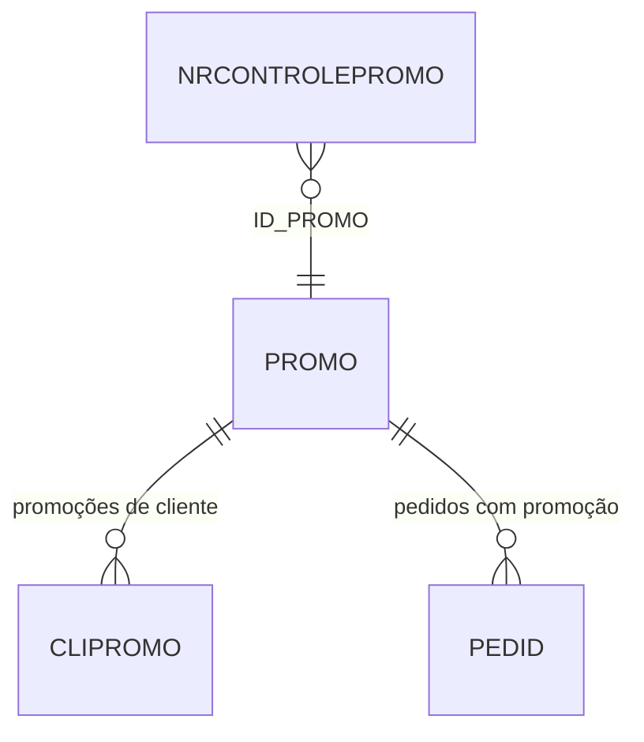

# NRCONTROLEPROMO - Documentação Completa de Relacionamentos

## 📊 Informações Gerais

- **Nome da Tabela**: NRCONTROLEPROMO (Controle de Número de Promoção)
- **Total de Registros**: 93
- **Total de Colunas**: 6
- **Chave Primária**: ID_NRCONTROLEPROMO
- **Chaves Estrangeiras**: 1
- **Índices**: 0
- **Tabelas Dependentes**: 0
- **Banco de Dados**: Firebird

## 📝 Descrição

**NRCONTROLEPROMO** é uma tabela de configuração que define regras de controle para números de promoção. Com **93 registros**, esta tabela permite configurar validações e restrições para números de promoção associados a cada promoção cadastrada, incluindo controle de caracteres mínimos/máximos, aceitação de duplicidade e outras regras de validação.

Esta tabela é essencial para:
- **Validação**: Controlar formato e validade de números de promoção
- **Prevenção de Fraude**: Bloquear duplicidade de números quando necessário
- **Flexibilidade**: Permitir diferentes regras por promoção
- **Auditoria**: Manter controle sobre números de promoção utilizados

---

## 🔑 Estrutura de Colunas

| Coluna | Tipo | Descrição |
|--------|------|-----------|
| **ID_NRCONTROLEPROMO** 🔑 | INT | Código único do controle (PK) |
| **ID_PROMO** 🔗 | INT | Código da promoção (FK → PROMO) |
| **ACEITAR** | VARCHAR(14) | Flag indicando se aceita números de promoção |
| **QTDECARACTERESMIN** | INT | Quantidade mínima de caracteres |
| **QTDECARACTERESMAX** | INT | Quantidade máxima de caracteres |
| **BLOQUEARDUPLICIDADE** | VARCHAR(14) | Flag indicando se bloqueia duplicidade |

---

## 🔗 Relacionamentos - Nível 1 (Diretos)

### PROMO - Promoção (FK Obrigatória)
**Volume:** 156 registros

**Relacionamento:**
```
NRCONTROLEPROMO.ID_PROMO → PROMO.ID_PROMO (N:1) [FK: XFKNRCTRLPROMO_PROMO]
```

**Descrição:** Cada controle está vinculado a uma promoção específica. Permite definir regras diferentes para cada promoção.

**Proporção:** ~0,6 controles por promoção em média (93 / 156)

**Campos importantes em PROMO:**
- `ID_PROMO` - Código da promoção
- `DESCRICAO` - Descrição da promoção
- `DTINICIAL` - Data inicial da promoção
- `DTFINAL` - Data final da promoção
- `EXIGENRCONTROLE` - Flag indicando se exige controle de número

---

## 🔗 Relacionamentos - Nível 2 (Indiretos)

### Através de PROMO

#### CLIPROMO - Promoções de Cliente
```
NRCONTROLEPROMO → PROMO → CLIPROMO
```
**Descrição:** Permite identificar quais clientes estão relacionados à promoção que possui controle de número.

---

#### PEDID - Pedidos com Promoção
```
NRCONTROLEPROMO → PROMO → PEDID (via campo de promoção)
```
**Descrição:** Permite identificar pedidos que utilizam a promoção com controle de número.

---

## 🗺️ Diagrama de Relacionamentos



---

## 💡 Casos de Uso Práticos

### 1. Consultar Controles de uma Promoção

```sql
SELECT 
    nrc.ID_NRCONTROLEPROMO,
    nrc.ID_PROMO,
    nrc.ACEITAR,
    nrc.QTDECARACTERESMIN,
    nrc.QTDECARACTERESMAX,
    nrc.BLOQUEARDUPLICIDADE,
    prom.DESCRICAO AS PROMOCAO_DESCRICAO,
    prom.DTINICIAL,
    prom.DTFINAL
FROM NRCONTROLEPROMO nrc
INNER JOIN PROMO prom ON nrc.ID_PROMO = prom.ID_PROMO
WHERE nrc.ID_PROMO = :id_promo;
```

### 2. Validar Número de Promoção

```sql
SELECT 
    CASE 
        WHEN nrc.ACEITAR = 'S' THEN 'Aceita números'
        ELSE 'Não aceita números'
    END AS STATUS_ACEITACAO,
    CASE 
        WHEN LENGTH(:numero_promo) BETWEEN nrc.QTDECARACTERESMIN AND nrc.QTDECARACTERESMAX 
        THEN 'Formato válido'
        ELSE 'Formato inválido'
    END AS STATUS_FORMATO,
    CASE 
        WHEN nrc.BLOQUEARDUPLICIDADE = 'S' AND EXISTS (
            SELECT 1 FROM PEDID 
            WHERE ID_PROMO = nrc.ID_PROMO 
            AND NUMERO_PROMOCAO = :numero_promo
        ) THEN 'Duplicado - bloqueado'
        ELSE 'Não duplicado'
    END AS STATUS_DUPLICIDADE
FROM NRCONTROLEPROMO nrc
WHERE nrc.ID_PROMO = :id_promo;
```

### 3. Relatório de Promoções com Controle

```sql
SELECT 
    prom.ID_PROMO,
    prom.DESCRICAO,
    prom.DTINICIAL,
    prom.DTFINAL,
    COUNT(DISTINCT nrc.ID_NRCONTROLEPROMO) AS QTD_CONTROLES,
    MAX(nrc.QTDECARACTERESMIN) AS CARACT_MIN,
    MAX(nrc.QTDECARACTERESMAX) AS CARACT_MAX,
    MAX(CASE WHEN nrc.BLOQUEARDUPLICIDADE = 'S' THEN 1 ELSE 0 END) AS BLOQUEIA_DUPLICIDADE
FROM PROMO prom
LEFT JOIN NRCONTROLEPROMO nrc ON prom.ID_PROMO = nrc.ID_PROMO
WHERE prom.EXIGENRCONTROLE = 'S'
GROUP BY prom.ID_PROMO, prom.DESCRICAO, prom.DTINICIAL, prom.DTFINAL
ORDER BY prom.DTINICIAL DESC;
```

### 4. Verificar Duplicidade de Número de Promoção

```sql
SELECT 
    ped.ID_PEDIDO,
    ped.ID_PROMO,
    ped.NUMERO_PROMOCAO,
    nrc.BLOQUEARDUPLICIDADE,
    COUNT(*) OVER (PARTITION BY ped.ID_PROMO, ped.NUMERO_PROMOCAO) AS QTD_USOS
FROM PEDID ped
INNER JOIN NRCONTROLEPROMO nrc ON ped.ID_PROMO = nrc.ID_PROMO
WHERE ped.ID_PROMO = :id_promo
    AND ped.NUMERO_PROMOCAO = :numero_promo
    AND nrc.BLOQUEARDUPLICIDADE = 'S';
```

---

## 📈 Estatísticas e Insights

### Volume de Dados
- **Total de Controles**: 93 registros
- **Média**: Aproximadamente 0,6 controles por promoção
- **Uso**: Configuração específica para promoções que exigem controle de número

---

## ⚡ Performance e Otimização

### Índices Recomendados

```sql
-- Índice para consultas por promoção
CREATE INDEX IDX_NRCONTROLEPROMO_PROMO ON NRCONTROLEPROMO (ID_PROMO);
```

### Otimizações de Consulta

1. **Usar índice** em `ID_PROMO` para consultas frequentes
2. **Cachear configurações** de promoções ativas em memória
3. **Validar antes de inserir** para evitar duplicatas

---

## 🔒 Integridade de Dados

### Validações Importantes

1. **Promoção**: `ID_PROMO` deve existir em `PROMO`
2. **Caracteres**: `QTDECARACTERESMIN` deve ser menor ou igual a `QTDECARACTERESMAX`
3. **Unicidade**: Um controle por promoção (ou múltiplos se permitido pelo negócio)
4. **Consistência**: Se `ACEITAR = 'N'`, outros campos podem ser ignorados

---

## 📚 Integração com Aplicação (Laravel)

### Model NRCONTROLEPROMO

```php
<?php

namespace App\Models;

use Illuminate\Database\Eloquent\Model;
use Illuminate\Database\Eloquent\Relations\BelongsTo;

final class NRCONTROLEPROMO extends Model
{
    protected $table = 'NRCONTROLEPROMO';
    
    protected $primaryKey = 'ID_NRCONTROLEPROMO';
    
    protected $fillable = [
        'ID_PROMO',
        'ACEITAR',
        'QTDECARACTERESMIN',
        'QTDECARACTERESMAX',
        'BLOQUEARDUPLICIDADE',
    ];
    
    protected $casts = [
        'QTDECARACTERESMIN' => 'integer',
        'QTDECARACTERESMAX' => 'integer',
        'ACEITAR' => 'boolean',
        'BLOQUEARDUPLICIDADE' => 'boolean',
    ];
    
    /**
     * Relacionamento com PROMO
     */
    public function promocao(): BelongsTo
    {
        return $this->belongsTo(PROMO::class, 'ID_PROMO', 'ID_PROMO');
    }
    
    /**
     * Validar número de promoção
     */
    public function validarNumero(string $numero): array
    {
        $resultado = [
            'valido' => false,
            'erros' => [],
        ];
        
        if ($this->ACEITAR !== 'S') {
            $resultado['erros'][] = 'Promoção não aceita números de promoção';
            return $resultado;
        }
        
        $tamanho = strlen($numero);
        
        if ($tamanho < $this->QTDECARACTERESMIN) {
            $resultado['erros'][] = "Número deve ter no mínimo {$this->QTDECARACTERESMIN} caracteres";
        }
        
        if ($tamanho > $this->QTDECARACTERESMAX) {
            $resultado['erros'][] = "Número deve ter no máximo {$this->QTDECARACTERESMAX} caracteres";
        }
        
        if (empty($resultado['erros'])) {
            $resultado['valido'] = true;
        }
        
        return $resultado;
    }
    
    /**
     * Verificar se bloqueia duplicidade
     */
    public function bloqueiaDuplicidade(): bool
    {
        return $this->BLOQUEARDUPLICIDADE === 'S';
    }
}
```

---

## ✅ Boas Práticas

### Design
1. **Manter consistência** entre `QTDECARACTERESMIN` e `QTDECARACTERESMAX`
2. **Validar promoção** antes de criar controle
3. **Documentar regras** de negócio para cada promoção

### Performance
1. **Usar índice** em `ID_PROMO` para consultas frequentes
2. **Cachear configurações** de promoções ativas
3. **Validar antes de inserir** para evitar duplicatas

### Integridade
1. **Validar existência** da promoção antes de criar controle
2. **Garantir consistência** entre campos de validação
3. **Verificar duplicidade** quando `BLOQUEARDUPLICIDADE = 'S'`

### Manutenção
1. **Revisar periodicamente** controles de promoções inativas
2. **Documentar regras** de negócio para cada tipo de controle
3. **Monitorar uso** de números de promoção para detectar fraudes

---

**Documentação gerada em**: 2025-01-27

**Banco de dados**: Firebird

