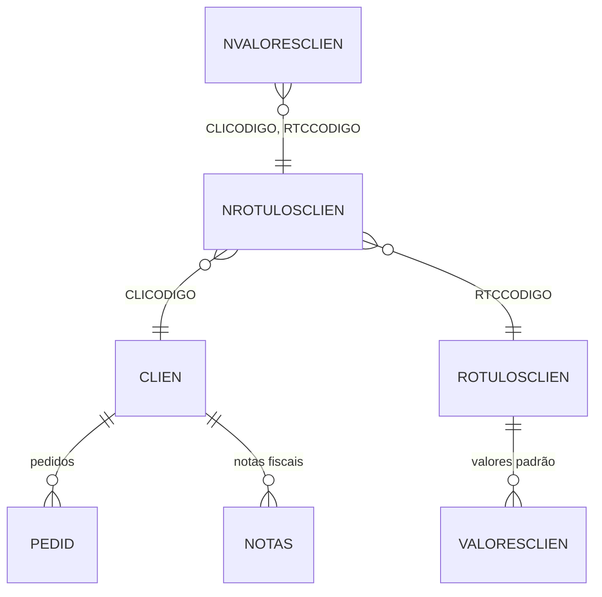

# NROTULOSCLIEN - Documentação Completa de Relacionamentos

## 📊 Informações Gerais

- **Nome da Tabela**: NROTULOSCLIEN (Rótulos de Cliente x Produto)
- **Total de Registros**: 2.614
- **Total de Colunas**: 2
- **Chave Primária**: CLICODIGO, RTCCODIGO (composite)
- **Chaves Estrangeiras**: 2
- **Índices**: 0
- **Tabelas Dependentes**: 2
- **Banco de Dados**: Firebird

## 📝 Descrição

**NROTULOSCLIEN** é uma tabela de relacionamento que vincula clientes (`CLIEN`) a rótulos de produtos (`ROTULOSCLIEN`). Com **2.614 registros**, esta tabela permite associar múltiplos rótulos a cada cliente, criando uma relação muitos-para-muitos entre clientes e rótulos de produtos.

Esta tabela é essencial para:
- **Personalização**: Associar rótulos específicos a clientes
- **Classificação**: Categorizar clientes por tipos de produtos/rótulos
- **Filtragem**: Filtrar produtos por rótulos associados ao cliente
- **Relatórios**: Gerar relatórios por cliente e rótulo

---

## 🔑 Estrutura de Colunas

| Coluna | Tipo | Descrição |
|--------|------|-----------|
| **CLICODIGO** 🔑 🔗 | INT | Código do cliente (PK, FK → CLIEN) |
| **RTCCODIGO** 🔑 🔗 | INT | Código do rótulo (PK, FK → ROTULOSCLIEN) |

---

## 🔗 Relacionamentos - Nível 1 (Diretos)

### CLIEN - Cliente (FK Obrigatória)
**Volume:** 9.251 registros

**Relacionamento:**
```
NROTULOSCLIEN.CLICODIGO → CLIEN.CLICODIGO (N:1) [FK: FKCLIEN]
```

**Descrição:** Cada registro vincula um cliente a um rótulo.

**Proporção:** ~0,28 rótulos por cliente em média (2.614 / 9.251)

---

### ROTULOSCLIEN - Rótulos de Cliente (FK Obrigatória)
**Volume:** 11 registros

**Relacionamento:**
```
NROTULOSCLIEN.RTCCODIGO → ROTULOSCLIEN.RTCCODIGO (N:1) [FK: FKROTULOSCLIEN]
```

**Descrição:** Cada registro vincula um rótulo a um cliente.

**Proporção:** ~238 clientes por rótulo em média (2.614 / 11)

---

## 📊 Tabelas que Referenciam NROTULOSCLIEN

### NVALORESCLIEN - Valores de Cliente x Rótulo
**Volume:** 2.043 registros

**Relacionamento:**
```
NVALORESCLIEN.CLICODIGO → NROTULOSCLIEN.CLICODIGO (N:1)
NVALORESCLIEN.RTCCODIGO → NROTULOSCLIEN.RTCCODIGO (N:1)
```

**Descrição:** Valores específicos associados à combinação cliente x rótulo.

---

## 🔗 Relacionamentos - Nível 2 (Indiretos)

### Através de CLIEN

#### PEDID - Pedidos
```
NROTULOSCLIEN → CLIEN → PEDID
```
**Descrição:** Permite identificar pedidos relacionados ao cliente que possui rótulos.

---

#### NOTAS - Notas Fiscais
```
NROTULOSCLIEN → CLIEN → NOTAS
```
**Descrição:** Permite identificar notas fiscais relacionadas ao cliente que possui rótulos.

---

### Através de ROTULOSCLIEN

#### VALORESCLIEN - Valores de Rótulo
```
NROTULOSCLIEN → ROTULOSCLIEN → VALORESCLIEN
```
**Descrição:** Permite identificar valores padrão do rótulo que podem ser sobrescritos por cliente.

---

## 🗺️ Diagrama de Relacionamentos



---

## 💡 Casos de Uso Práticos

### 1. Consultar Rótulos de um Cliente

```sql
SELECT 
    nrc.CLICODIGO,
    nrc.RTCCODIGO,
    cli.CLINOME,
    rot.RTCNOME AS ROTULO_NOME
FROM NROTULOSCLIEN nrc
INNER JOIN CLIEN cli ON nrc.CLICODIGO = cli.CLICODIGO
INNER JOIN ROTULOSCLIEN rot ON nrc.RTCCODIGO = rot.RTCCODIGO
WHERE nrc.CLICODIGO = :clicodigo
ORDER BY rot.RTCNOME;
```

### 2. Consultar Clientes por Rótulo

```sql
SELECT 
    nrc.RTCCODIGO,
    nrc.CLICODIGO,
    rot.RTCNOME AS ROTULO_NOME,
    cli.CLINOME,
    cli.CLICGC
FROM NROTULOSCLIEN nrc
INNER JOIN ROTULOSCLIEN rot ON nrc.RTCCODIGO = rot.RTCCODIGO
INNER JOIN CLIEN cli ON nrc.CLICODIGO = cli.CLICODIGO
WHERE nrc.RTCCODIGO = :rtccodigo
ORDER BY cli.CLINOME;
```

### 3. Relatório de Distribuição de Rótulos

```sql
SELECT 
    rot.RTCCODIGO,
    rot.RTCNOME,
    COUNT(DISTINCT nrc.CLICODIGO) AS QTD_CLIENTES,
    COUNT(DISTINCT nvc.NVALORESCLIEN) AS QTD_VALORES_PERSONALIZADOS
FROM ROTULOSCLIEN rot
LEFT JOIN NROTULOSCLIEN nrc ON rot.RTCCODIGO = nrc.RTCCODIGO
LEFT JOIN NVALORESCLIEN nvc ON nrc.CLICODIGO = nvc.CLICODIGO 
    AND nrc.RTCCODIGO = nvc.RTCCODIGO
GROUP BY rot.RTCCODIGO, rot.RTCNOME
ORDER BY QTD_CLIENTES DESC;
```

### 4. Clientes com Valores Personalizados por Rótulo

```sql
SELECT 
    nrc.CLICODIGO,
    cli.CLINOME,
    nrc.RTCCODIGO,
    rot.RTCNOME,
    nvc.NVALORESCLIEN AS VALOR_PERSONALIZADO,
    vc.VALORESCLIEN AS VALOR_PADRAO
FROM NROTULOSCLIEN nrc
INNER JOIN CLIEN cli ON nrc.CLICODIGO = cli.CLICODIGO
INNER JOIN ROTULOSCLIEN rot ON nrc.RTCCODIGO = rot.RTCCODIGO
LEFT JOIN NVALORESCLIEN nvc ON nrc.CLICODIGO = nvc.CLICODIGO 
    AND nrc.RTCCODIGO = nvc.RTCCODIGO
LEFT JOIN VALORESCLIEN vc ON rot.RTCCODIGO = vc.RTCCODIGO
WHERE nvc.NVALORESCLIEN IS NOT NULL
ORDER BY cli.CLINOME, rot.RTCNOME;
```

---

## 📈 Estatísticas e Insights

### Volume de Dados
- **Total de Relacionamentos**: 2.614 registros
- **Média**: Aproximadamente 0,28 rótulos por cliente
- **Distribuição**: Permite análise de associação entre clientes e rótulos

---

## ⚡ Performance e Otimização

### Índices Recomendados

```sql
-- Índice para consultas por cliente
CREATE INDEX IDX_NROTULOSCLIEN_CLIENTE ON NROTULOSCLIEN (CLICODIGO);

-- Índice para consultas por rótulo
CREATE INDEX IDX_NROTULOSCLIEN_ROTULO ON NROTULOSCLIEN (RTCCODIGO);

-- Índice composto para consultas completas
CREATE INDEX IDX_NROTULOSCLIEN_COMPLETA ON NROTULOSCLIEN (CLICODIGO, RTCCODIGO);
```

---

## 🔒 Integridade de Dados

### Validações Importantes

1. **Chave Composta Única**: A combinação `CLICODIGO` + `RTCCODIGO` deve ser única
2. **Cliente**: `CLICODIGO` deve existir em `CLIEN`
3. **Rótulo**: `RTCCODIGO` deve existir em `ROTULOSCLIEN`

---

## 📚 Integração com Aplicação (Laravel)

### Model NROTULOSCLIEN

```php
<?php

namespace App\Models;

use Illuminate\Database\Eloquent\Model;
use Illuminate\Database\Eloquent\Relations\BelongsTo;
use Illuminate\Database\Eloquent\Relations\HasMany;

final class NROTULOSCLIEN extends Model
{
    protected $table = 'NROTULOSCLIEN';
    
    protected $primaryKey = ['CLICODIGO', 'RTCCODIGO'];
    
    public $incrementing = false;
    
    protected $fillable = [
        'CLICODIGO',
        'RTCCODIGO',
    ];
    
    /**
     * Relacionamento com CLIEN
     */
    public function cliente(): BelongsTo
    {
        return $this->belongsTo(CLIEN::class, 'CLICODIGO', 'CLICODIGO');
    }
    
    /**
     * Relacionamento com ROTULOSCLIEN
     */
    public function rotulo(): BelongsTo
    {
        return $this->belongsTo(ROTULOSCLIEN::class, 'RTCCODIGO', 'RTCCODIGO');
    }
    
    /**
     * Relacionamento com NVALORESCLIEN
     */
    public function valores(): HasMany
    {
        return $this->hasMany(NVALORESCLIEN::class, ['CLICODIGO', 'RTCCODIGO'], ['CLICODIGO', 'RTCCODIGO']);
    }
}
```

---

## ✅ Boas Práticas

### Design
1. **Manter unicidade** da chave composta
2. **Validar existência** de cliente e rótulo antes de criar relacionamento
3. **Evitar duplicatas** da mesma combinação

### Performance
1. **Usar índices** nas consultas frequentes
2. **Considerar cache** para consultas frequentes

### Integridade
1. **Validar existência** de cliente e rótulo antes de inserir
2. **Garantir unicidade** da combinação cliente x rótulo

---

**Documentação gerada em**: 2025-01-27

**Banco de dados**: Firebird

