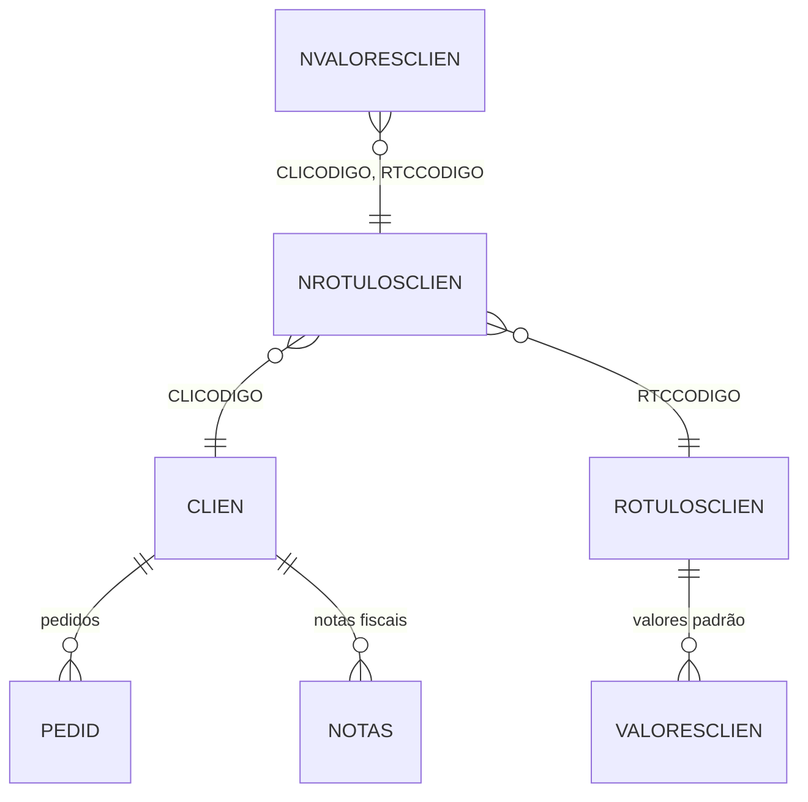

# NVALORESCLIEN - Documentação Completa de Relacionamentos

## 📊 Informações Gerais

- **Nome da Tabela**: NVALORESCLIEN (Valores de Cliente x Rótulo)
- **Total de Registros**: 2.043
- **Total de Colunas**: 3
- **Chave Primária**: RTCCODIGO, CLICODIGO, NVALORESCLIEN (composite)
- **Chaves Estrangeiras**: 2
- **Índices**: 0
- **Tabelas Dependentes**: 0
- **Banco de Dados**: Firebird

## 📝 Descrição

**NVALORESCLIEN** é uma tabela de relacionamento que vincula clientes (`CLIEN`) a rótulos (`ROTULOSCLIEN`) com valores específicos personalizados por cliente. Com **2.043 registros**, esta tabela permite associar múltiplos valores a cada combinação de cliente e rótulo, criando uma relação muitos-para-muitos com valores personalizados por cliente.

Esta tabela é essencial para:
- **Personalização**: Associar valores específicos a clientes por rótulo
- **Sobrescrita**: Permitir valores personalizados que sobrescrevem valores padrão
- **Classificação**: Categorizar clientes por valores de rótulos
- **Relatórios**: Gerar relatórios por cliente, rótulo e valor personalizado

---

## 🔑 Estrutura de Colunas

| Coluna | Tipo | Descrição |
|--------|------|-----------|
| **RTCCODIGO** 🔑 🔗 | INT | Código do rótulo (PK, FK → NROTULOSCLIEN) |
| **CLICODIGO** 🔑 🔗 | INT | Código do cliente (PK, FK → NROTULOSCLIEN) |
| **NVALORESCLIEN** 🔑 | VARCHAR(37) | Valor personalizado do cliente (PK) |

---

## 🔗 Relacionamentos - Nível 1 (Diretos)

### NROTULOSCLIEN - Cliente x Rótulo (FK Obrigatória)
**Volume:** 2.614 registros

**Relacionamento:**
```
NVALORESCLIEN.CLICODIGO → NROTULOSCLIEN.CLICODIGO (N:1) [FK: NROTULOSCLIEN_NVALORESCLIEN]
NVALORESCLIEN.RTCCODIGO → NROTULOSCLIEN.RTCCODIGO (N:1) [FK: NROTULOSCLIEN_NVALORESCLIEN]
```

**Descrição:** Cada registro vincula um valor personalizado a uma combinação de cliente e rótulo existente em `NROTULOSCLIEN`.

**Proporção:** ~0,78 valores por combinação cliente x rótulo em média (2.043 / 2.614)

**Campos importantes em NROTULOSCLIEN:**
- `CLICODIGO` - Código do cliente (FK → CLIEN)
- `RTCCODIGO` - Código do rótulo (FK → ROTULOSCLIEN)

---

## 🔗 Relacionamentos - Nível 2 (Indiretos)

### Através de NROTULOSCLIEN

#### CLIEN - Cliente
```
NVALORESCLIEN → NROTULOSCLIEN → CLIEN
```
**Descrição:** Permite identificar o cliente relacionado ao valor personalizado.

---

#### ROTULOSCLIEN - Rótulo
```
NVALORESCLIEN → NROTULOSCLIEN → ROTULOSCLIEN
```
**Descrição:** Permite identificar o rótulo relacionado ao valor personalizado.

---

### Através de ROTULOSCLIEN

#### VALORESCLIEN - Valores Padrão do Rótulo
```
NVALORESCLIEN → NROTULOSCLIEN → ROTULOSCLIEN → VALORESCLIEN
```
**Descrição:** Permite comparar valores personalizados do cliente com valores padrão do rótulo.

---

### Através de CLIEN

#### PEDID - Pedidos
```
NVALORESCLIEN → NROTULOSCLIEN → CLIEN → PEDID
```
**Descrição:** Permite identificar pedidos relacionados ao cliente que possui valores personalizados.

---

#### NOTAS - Notas Fiscais
```
NVALORESCLIEN → NROTULOSCLIEN → CLIEN → NOTAS
```
**Descrição:** Permite identificar notas fiscais relacionadas ao cliente que possui valores personalizados.

---

## 🗺️ Diagrama de Relacionamentos



---

## 💡 Casos de Uso Práticos

### 1. Consultar Valores Personalizados de um Cliente

```sql
SELECT 
    nvc.RTCCODIGO,
    nvc.CLICODIGO,
    nvc.NVALORESCLIEN,
    cli.CLINOME,
    rot.RTCNOME AS ROTULO_NOME,
    vc.VALORESCLIEN AS VALOR_PADRAO
FROM NVALORESCLIEN nvc
INNER JOIN NROTULOSCLIEN nrc ON nvc.CLICODIGO = nrc.CLICODIGO 
    AND nvc.RTCCODIGO = nrc.RTCCODIGO
INNER JOIN CLIEN cli ON nvc.CLICODIGO = cli.CLICODIGO
INNER JOIN ROTULOSCLIEN rot ON nvc.RTCCODIGO = rot.RTCCODIGO
LEFT JOIN VALORESCLIEN vc ON rot.RTCCODIGO = vc.RTCCODIGO
WHERE nvc.CLICODIGO = :clicodigo
ORDER BY rot.RTCNOME, nvc.NVALORESCLIEN;
```

### 2. Comparar Valores Personalizados com Valores Padrão

```sql
SELECT 
    nvc.CLICODIGO,
    cli.CLINOME,
    nvc.RTCCODIGO,
    rot.RTCNOME AS ROTULO_NOME,
    nvc.NVALORESCLIEN AS VALOR_PERSONALIZADO,
    vc.VALORESCLIEN AS VALOR_PADRAO,
    CASE 
        WHEN nvc.NVALORESCLIEN = vc.VALORESCLIEN THEN 'Igual ao padrão'
        WHEN vc.VALORESCLIEN IS NULL THEN 'Sem padrão definido'
        ELSE 'Diferente do padrão'
    END AS COMPARACAO
FROM NVALORESCLIEN nvc
INNER JOIN NROTULOSCLIEN nrc ON nvc.CLICODIGO = nrc.CLICODIGO 
    AND nvc.RTCCODIGO = nrc.RTCCODIGO
INNER JOIN CLIEN cli ON nvc.CLICODIGO = cli.CLICODIGO
INNER JOIN ROTULOSCLIEN rot ON nvc.RTCCODIGO = rot.RTCCODIGO
LEFT JOIN VALORESCLIEN vc ON rot.RTCCODIGO = vc.RTCCODIGO
ORDER BY cli.CLINOME, rot.RTCNOME;
```

### 3. Relatório de Valores Personalizados por Rótulo

```sql
SELECT 
    rot.RTCCODIGO,
    rot.RTCNOME,
    COUNT(DISTINCT nvc.CLICODIGO) AS QTD_CLIENTES_COM_VALOR,
    COUNT(DISTINCT nvc.NVALORESCLIEN) AS QTD_VALORES_DISTINTOS,
    COUNT(*) AS QTD_ASSOCIACOES
FROM ROTULOSCLIEN rot
LEFT JOIN NROTULOSCLIEN nrc ON rot.RTCCODIGO = nrc.RTCCODIGO
LEFT JOIN NVALORESCLIEN nvc ON nrc.CLICODIGO = nvc.CLICODIGO 
    AND nrc.RTCCODIGO = nvc.RTCCODIGO
GROUP BY rot.RTCCODIGO, rot.RTCNOME
ORDER BY QTD_ASSOCIACOES DESC;
```

### 4. Clientes com Múltiplos Valores no Mesmo Rótulo

```sql
SELECT 
    nvc.CLICODIGO,
    cli.CLINOME,
    nvc.RTCCODIGO,
    rot.RTCNOME AS ROTULO_NOME,
    COUNT(DISTINCT nvc.NVALORESCLIEN) AS QTD_VALORES,
    LIST(nvc.NVALORESCLIEN, ', ') AS VALORES
FROM NVALORESCLIEN nvc
INNER JOIN NROTULOSCLIEN nrc ON nvc.CLICODIGO = nrc.CLICODIGO 
    AND nvc.RTCCODIGO = nrc.RTCCODIGO
INNER JOIN CLIEN cli ON nvc.CLICODIGO = cli.CLICODIGO
INNER JOIN ROTULOSCLIEN rot ON nvc.RTCCODIGO = rot.RTCCODIGO
GROUP BY nvc.CLICODIGO, cli.CLINOME, nvc.RTCCODIGO, rot.RTCNOME
HAVING COUNT(DISTINCT nvc.NVALORESCLIEN) > 1
ORDER BY QTD_VALORES DESC, cli.CLINOME;
```

---

## 📈 Estatísticas e Insights

### Volume de Dados
- **Total de Valores Personalizados**: 2.043 registros
- **Média**: Aproximadamente 0,78 valores por combinação cliente x rótulo
- **Distribuição**: Permite análise de personalização de valores por cliente

---

## ⚡ Performance e Otimização

### Índices Recomendados

```sql
-- Índice para consultas por cliente
CREATE INDEX IDX_NVALORESCLIEN_CLIENTE ON NVALORESCLIEN (CLICODIGO);

-- Índice para consultas por rótulo
CREATE INDEX IDX_NVALORESCLIEN_ROTULO ON NVALORESCLIEN (RTCCODIGO);

-- Índice composto para consultas completas
CREATE INDEX IDX_NVALORESCLIEN_COMPLETA ON NVALORESCLIEN (CLICODIGO, RTCCODIGO, NVALORESCLIEN);
```

---

## 🔒 Integridade de Dados

### Validações Importantes

1. **Chave Composta Única**: A combinação `RTCCODIGO` + `CLICODIGO` + `NVALORESCLIEN` deve ser única
2. **NROTULOSCLIEN**: A combinação `CLICODIGO` + `RTCCODIGO` deve existir em `NROTULOSCLIEN`
3. **Valor**: `NVALORESCLIEN` não deve ser nulo ou vazio

---

## 📚 Integração com Aplicação (Laravel)

### Model NVALORESCLIEN

```php
<?php

namespace App\Models;

use Illuminate\Database\Eloquent\Model;
use Illuminate\Database\Eloquent\Relations\BelongsTo;

final class NVALORESCLIEN extends Model
{
    protected $table = 'NVALORESCLIEN';
    
    protected $primaryKey = ['RTCCODIGO', 'CLICODIGO', 'NVALORESCLIEN'];
    
    public $incrementing = false;
    
    protected $fillable = [
        'RTCCODIGO',
        'CLICODIGO',
        'NVALORESCLIEN',
    ];
    
    /**
     * Relacionamento com NROTULOSCLIEN
     */
    public function rotuloCliente(): BelongsTo
    {
        return $this->belongsTo(NROTULOSCLIEN::class, ['CLICODIGO', 'RTCCODIGO'], ['CLICODIGO', 'RTCCODIGO']);
    }
    
    /**
     * Scope para buscar por cliente
     */
    public function scopePorCliente($query, $clicodigo)
    {
        return $query->where('CLICODIGO', $clicodigo);
    }
    
    /**
     * Scope para buscar por rótulo
     */
    public function scopePorRotulo($query, $rtccodigo)
    {
        return $query->where('RTCCODIGO', $rtccodigo);
    }
}
```

---

## ✅ Boas Práticas

### Design
1. **Manter unicidade** da chave composta
2. **Validar existência** da combinação cliente x rótulo em `NROTULOSCLIEN` antes de criar valor
3. **Evitar duplicatas** da mesma combinação

### Performance
1. **Usar índices** nas consultas frequentes
2. **Considerar cache** para consultas frequentes

### Integridade
1. **Validar existência** da combinação em `NROTULOSCLIEN` antes de inserir
2. **Garantir unicidade** da combinação rótulo x cliente x valor

---

**Documentação gerada em**: 2025-01-27

**Banco de dados**: Firebird

