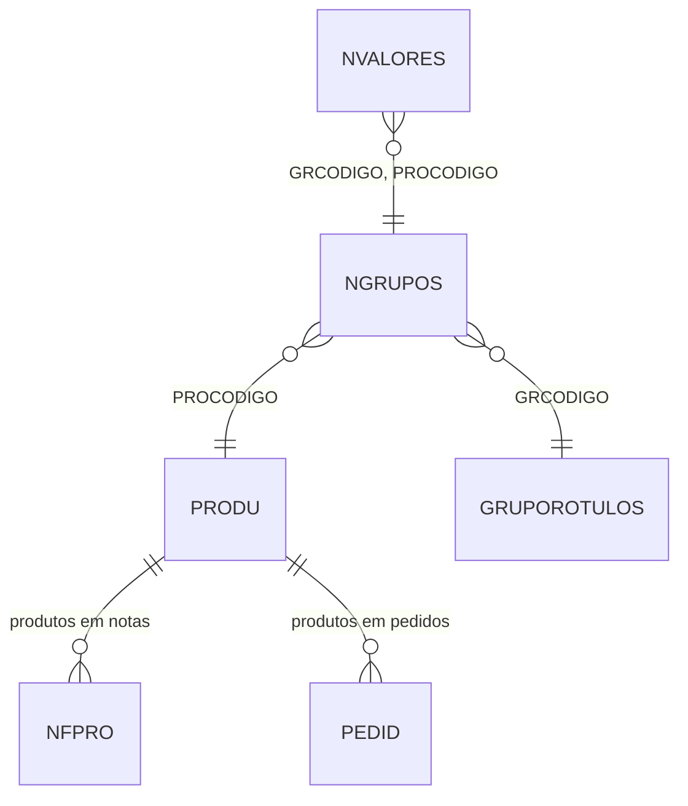

# NVALORES - Documentação Completa de Relacionamentos

## 📊 Informações Gerais

- **Nome da Tabela**: NVALORES (Valores de Produto x Grupo de Rótulos)
- **Total de Registros**: 465.660
- **Total de Colunas**: 3
- **Chave Primária**: GRCODIGO, PROCODIGO, NVALORES (composite)
- **Chaves Estrangeiras**: 2
- **Índices**: 0
- **Tabelas Dependentes**: 0
- **Banco de Dados**: Firebird

## 📝 Descrição

**NVALORES** é uma tabela de relacionamento que vincula produtos (`PRODU`) a grupos de rótulos (`NGRUPOS`) com valores específicos. Com **465.660 registros**, esta tabela permite associar múltiplos valores a cada combinação de produto e grupo de rótulos, criando uma relação muitos-para-muitos com valores personalizados.

Esta tabela é essencial para:
- **Valores Personalizados**: Associar valores específicos a produtos por grupo de rótulos
- **Classificação**: Categorizar produtos por grupos de rótulos com valores
- **Filtragem**: Filtrar produtos por valores associados a grupos de rótulos
- **Relatórios**: Gerar relatórios por produto, grupo e valor

---

## 🔑 Estrutura de Colunas

| Coluna | Tipo | Descrição |
|--------|------|-----------|
| **GRCODIGO** 🔑 🔗 | INT | Código do grupo de rótulos (PK, FK → NGRUPOS) |
| **PROCODIGO** 🔑 🔗 | INT | Código do produto (PK, FK → NGRUPOS) |
| **NVALORES** 🔑 | VARCHAR(37) | Valor associado (PK) |

---

## 🔗 Relacionamentos - Nível 1 (Diretos)

### NGRUPOS - Produto x Grupo de Rótulos (FK Obrigatória)
**Volume:** 466.058 registros

**Relacionamento:**
```
NVALORES.GRCODIGO → NGRUPOS.GRCODIGO (N:1) [FK: NGRUPOS_NVALORES]
NVALORES.PROCODIGO → NGRUPOS.PROCODIGO (N:1) [FK: NGRUPOS_NVALORES]
```

**Descrição:** Cada registro vincula um valor a uma combinação de produto e grupo de rótulos existente em `NGRUPOS`.

**Proporção:** ~1 valor por combinação produto x grupo em média (465.660 / 466.058)

**Campos importantes em NGRUPOS:**
- `PROCODIGO` - Código do produto
- `GRCODIGO` - Código do grupo de rótulos (FK → GRUPOROTULOS)

---

## 🔗 Relacionamentos - Nível 2 (Indiretos)

### Através de NGRUPOS

#### PRODU - Produto
```
NVALORES → NGRUPOS → PRODU
```
**Descrição:** Permite identificar o produto relacionado ao valor.

---

#### GRUPOROTULOS - Grupo de Rótulos
```
NVALORES → NGRUPOS → GRUPOROTULOS
```
**Descrição:** Permite identificar o grupo de rótulos relacionado ao valor.

---

### Através de PRODU

#### NFPRO - Produtos em Notas Fiscais
```
NVALORES → NGRUPOS → PRODU → NFPRO
```
**Descrição:** Permite identificar notas fiscais que contêm o produto com valores específicos.

---

#### PEDID - Pedidos
```
NVALORES → NGRUPOS → PRODU → PEDID (via produtos do pedido)
```
**Descrição:** Permite identificar pedidos que contêm o produto com valores específicos.

---

## 🗺️ Diagrama de Relacionamentos



---

## 💡 Casos de Uso Práticos

### 1. Consultar Valores de um Produto por Grupo

```sql
SELECT 
    nv.GRCODIGO,
    nv.PROCODIGO,
    nv.NVALORES,
    prod.PRODESCRICAO,
    gr.GRNOME AS GRUPO_NOME
FROM NVALORES nv
INNER JOIN NGRUPOS ng ON nv.GRCODIGO = ng.GRCODIGO 
    AND nv.PROCODIGO = ng.PROCODIGO
INNER JOIN PRODU prod ON nv.PROCODIGO = prod.PROCODIGO
INNER JOIN GRUPOROTULOS gr ON nv.GRCODIGO = gr.GRCODIGO
WHERE nv.PROCODIGO = :procodigo
ORDER BY gr.GRNOME, nv.NVALORES;
```

### 2. Consultar Produtos por Valor e Grupo

```sql
SELECT 
    nv.GRCODIGO,
    nv.PROCODIGO,
    nv.NVALORES,
    prod.PRODESCRICAO,
    gr.GRNOME AS GRUPO_NOME
FROM NVALORES nv
INNER JOIN NGRUPOS ng ON nv.GRCODIGO = ng.GRCODIGO 
    AND nv.PROCODIGO = ng.PROCODIGO
INNER JOIN PRODU prod ON nv.PROCODIGO = prod.PROCODIGO
INNER JOIN GRUPOROTULOS gr ON nv.GRCODIGO = gr.GRCODIGO
WHERE nv.GRCODIGO = :grcodigo
    AND nv.NVALORES = :nvalores
ORDER BY prod.PRODESCRICAO;
```

### 3. Relatório de Distribuição de Valores por Grupo

```sql
SELECT 
    gr.GRCODIGO,
    gr.GRNOME,
    COUNT(DISTINCT nv.PROCODIGO) AS QTD_PRODUTOS,
    COUNT(DISTINCT nv.NVALORES) AS QTD_VALORES_DISTINTOS,
    COUNT(*) AS QTD_ASSOCIACOES
FROM GRUPOROTULOS gr
LEFT JOIN NGRUPOS ng ON gr.GRCODIGO = ng.GRCODIGO
LEFT JOIN NVALORES nv ON ng.GRCODIGO = nv.GRCODIGO 
    AND ng.PROCODIGO = nv.PROCODIGO
GROUP BY gr.GRCODIGO, gr.GRNOME
ORDER BY QTD_ASSOCIACOES DESC;
```

### 4. Produtos com Múltiplos Valores no Mesmo Grupo

```sql
SELECT 
    nv.GRCODIGO,
    nv.PROCODIGO,
    prod.PRODESCRICAO,
    gr.GRNOME AS GRUPO_NOME,
    COUNT(DISTINCT nv.NVALORES) AS QTD_VALORES,
    LIST(nv.NVALORES, ', ') AS VALORES
FROM NVALORES nv
INNER JOIN NGRUPOS ng ON nv.GRCODIGO = ng.GRCODIGO 
    AND nv.PROCODIGO = ng.PROCODIGO
INNER JOIN PRODU prod ON nv.PROCODIGO = prod.PROCODIGO
INNER JOIN GRUPOROTULOS gr ON nv.GRCODIGO = gr.GRCODIGO
GROUP BY nv.GRCODIGO, nv.PROCODIGO, prod.PRODESCRICAO, gr.GRNOME
HAVING COUNT(DISTINCT nv.NVALORES) > 1
ORDER BY QTD_VALORES DESC, prod.PRODESCRICAO;
```

---

## 📈 Estatísticas e Insights

### Volume de Dados
- **Total de Valores**: 465.660 registros
- **Média**: Aproximadamente 1 valor por combinação produto x grupo
- **Distribuição**: Permite análise de associação entre produtos, grupos e valores

---

## ⚡ Performance e Otimização

### Índices Recomendados

```sql
-- Índice para consultas por produto
CREATE INDEX IDX_NVALORES_PRODUTO ON NVALORES (PROCODIGO);

-- Índice para consultas por grupo
CREATE INDEX IDX_NVALORES_GRUPO ON NVALORES (GRCODIGO);

-- Índice composto para consultas completas
CREATE INDEX IDX_NVALORES_COMPLETA ON NVALORES (GRCODIGO, PROCODIGO, NVALORES);
```

---

## 🔒 Integridade de Dados

### Validações Importantes

1. **Chave Composta Única**: A combinação `GRCODIGO` + `PROCODIGO` + `NVALORES` deve ser única
2. **NGRUPOS**: A combinação `GRCODIGO` + `PROCODIGO` deve existir em `NGRUPOS`
3. **Valor**: `NVALORES` não deve ser nulo ou vazio

---

## 📚 Integração com Aplicação (Laravel)

### Model NVALORES

```php
<?php

namespace App\Models;

use Illuminate\Database\Eloquent\Model;
use Illuminate\Database\Eloquent\Relations\BelongsTo;

final class NVALORES extends Model
{
    protected $table = 'NVALORES';
    
    protected $primaryKey = ['GRCODIGO', 'PROCODIGO', 'NVALORES'];
    
    public $incrementing = false;
    
    protected $fillable = [
        'GRCODIGO',
        'PROCODIGO',
        'NVALORES',
    ];
    
    /**
     * Relacionamento com NGRUPOS
     */
    public function grupoProduto(): BelongsTo
    {
        return $this->belongsTo(NGRUPOS::class, ['GRCODIGO', 'PROCODIGO'], ['GRCODIGO', 'PROCODIGO']);
    }
    
    /**
     * Scope para buscar por produto
     */
    public function scopePorProduto($query, $procodigo)
    {
        return $query->where('PROCODIGO', $procodigo);
    }
    
    /**
     * Scope para buscar por grupo
     */
    public function scopePorGrupo($query, $grcodigo)
    {
        return $query->where('GRCODIGO', $grcodigo);
    }
}
```

---

## ✅ Boas Práticas

### Design
1. **Manter unicidade** da chave composta
2. **Validar existência** da combinação produto x grupo em `NGRUPOS` antes de criar valor
3. **Evitar duplicatas** da mesma combinação

### Performance
1. **Usar índices** nas consultas frequentes
2. **Considerar cache** para consultas frequentes

### Integridade
1. **Validar existência** da combinação em `NGRUPOS` antes de inserir
2. **Garantir unicidade** da combinação grupo x produto x valor

---

**Documentação gerada em**: 2025-01-27

**Banco de dados**: Firebird

