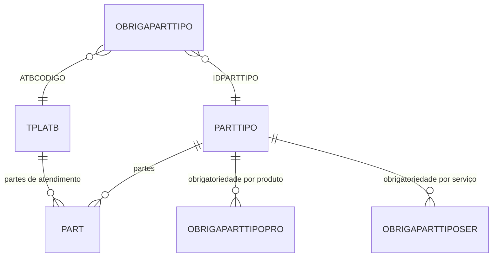

# OBRIGAPARTTIPO - Documentação Completa de Relacionamentos

## 📊 Informações Gerais

- **Nome da Tabela**: OBRIGAPARTTIPO (Obrigatoriedade de Tipo de Parte)
- **Total de Registros**: 68
- **Total de Colunas**: 3
- **Chave Primária**: ATBCODIGO, IDPARTTIPO (composite)
- **Chaves Estrangeiras**: 2
- **Índices**: 0
- **Tabelas Dependentes**: 0
- **Banco de Dados**: Firebird

## 📝 Descrição

**OBRIGAPARTTIPO** é uma tabela de configuração que define quais tipos de partes (`PARTTIPO`) são obrigatórios para cada tipo de atendimento (`TPLATB`). Com **68 registros**, esta tabela permite configurar regras de obrigatoriedade específicas por tipo de atendimento, garantindo que os dados necessários sejam coletados durante o atendimento.

Esta tabela é essencial para:
- **Validação**: Garantir que tipos de partes obrigatórios sejam preenchidos
- **Configuração**: Permitir diferentes regras por tipo de atendimento
- **Flexibilidade**: Habilitar ou desabilitar obrigatoriedade conforme necessário
- **Auditoria**: Manter controle sobre quais tipos de partes são obrigatórios

---

## 🔑 Estrutura de Colunas

| Coluna | Tipo | Descrição |
|--------|------|-----------|
| **ATBCODIGO** 🔑 🔗 | INT | Código do tipo de atendimento (PK, FK → TPLATB) |
| **IDPARTTIPO** 🔑 🔗 | INT | Código do tipo de parte (PK, FK → PARTTIPO) |
| **OBRIGA** | VARCHAR(14) | Flag indicando se é obrigatório |

---

## 🔗 Relacionamentos - Nível 1 (Diretos)

### TPLATB - Tipo de Atendimento (FK Obrigatória)
**Volume:** 18 registros

**Relacionamento:**
```
OBRIGAPARTTIPO.ATBCODIGO → TPLATB.ATBCODIGO (N:1) [FK: FK_OBRIGAPARTTIPO_TPLATB]
```

**Descrição:** Cada registro vincula uma obrigatoriedade a um tipo de atendimento específico.

**Proporção:** ~3,8 obrigatoriedades por tipo de atendimento em média (68 / 18)

**Campos importantes em TPLATB:**
- `ATBCODIGO` - Código do tipo de atendimento
- `ATBDESCRICAO` - Descrição do tipo de atendimento
- `ATBOBRIGAANAMNESE` - Flag indicando se obriga anamnese

---

### PARTTIPO - Tipo de Parte (FK Obrigatória)
**Volume:** 6 registros

**Relacionamento:**
```
OBRIGAPARTTIPO.IDPARTTIPO → PARTTIPO.TPPID (N:1) [FK: FK_OBRIGAPARTTIPO_PARTTIPO]
```

**Descrição:** Cada registro vincula uma obrigatoriedade a um tipo de parte específico.

**Proporção:** ~11,3 obrigatoriedades por tipo de parte em média (68 / 6)

**Campos importantes em PARTTIPO:**
- `TPPID` - Código do tipo de parte
- `TPPDESCRICAO` - Descrição do tipo de parte
- `TPPPALAVRACHAVE` - Palavra-chave do tipo de parte
- `TPPVISIVELPART` - Flag indicando se é visível na parte

---

## 🔗 Relacionamentos - Nível 2 (Indiretos)

### Através de TPLATB

#### PART - Partes de Atendimento
```
OBRIGAPARTTIPO → TPLATB → PART (via tipo de atendimento)
```
**Descrição:** Permite identificar partes de atendimento relacionadas ao tipo que possui obrigatoriedades configuradas.

---

### Através de PARTTIPO

#### PART - Partes
```
OBRIGAPARTTIPO → PARTTIPO → PART
```
**Descrição:** Permite identificar partes relacionadas ao tipo que possui obrigatoriedade configurada.

---

#### OBRIGAPARTTIPOPRO - Obrigatoriedade por Produto
```
OBRIGAPARTTIPO → PARTTIPO → OBRIGAPARTTIPOPRO
```
**Descrição:** Permite identificar obrigatoriedades específicas por produto relacionadas ao tipo de parte.

---

#### OBRIGAPARTTIPOSER - Obrigatoriedade por Serviço
```
OBRIGAPARTTIPO → PARTTIPO → OBRIGAPARTTIPOSER
```
**Descrição:** Permite identificar obrigatoriedades específicas por serviço relacionadas ao tipo de parte.

---

## 🗺️ Diagrama de Relacionamentos



---

## 💡 Casos de Uso Práticos

### 1. Consultar Obrigatoriedades de um Tipo de Atendimento

```sql
SELECT 
    opt.ATBCODIGO,
    opt.IDPARTTIPO,
    opt.OBRIGA,
    tpl.ATBDESCRICAO AS TIPO_ATENDIMENTO,
    pt.TPPDESCRICAO AS TIPO_PARTE
FROM OBRIGAPARTTIPO opt
INNER JOIN TPLATB tpl ON opt.ATBCODIGO = tpl.ATBCODIGO
INNER JOIN PARTTIPO pt ON opt.IDPARTTIPO = pt.TPPID
WHERE opt.ATBCODIGO = :atbcodigo
ORDER BY pt.TPPDESCRICAO;
```

### 2. Consultar Tipos de Atendimento que Exigem um Tipo de Parte

```sql
SELECT 
    opt.ATBCODIGO,
    opt.IDPARTTIPO,
    opt.OBRIGA,
    tpl.ATBDESCRICAO AS TIPO_ATENDIMENTO,
    pt.TPPDESCRICAO AS TIPO_PARTE
FROM OBRIGAPARTTIPO opt
INNER JOIN TPLATB tpl ON opt.ATBCODIGO = tpl.ATBCODIGO
INNER JOIN PARTTIPO pt ON opt.IDPARTTIPO = pt.TPPID
WHERE opt.IDPARTTIPO = :idparttipo
    AND opt.OBRIGA = 'S'
ORDER BY tpl.ATBDESCRICAO;
```

### 3. Relatório de Obrigatoriedades por Tipo de Atendimento

```sql
SELECT 
    tpl.ATBCODIGO,
    tpl.ATBDESCRICAO AS TIPO_ATENDIMENTO,
    COUNT(DISTINCT opt.IDPARTTIPO) AS QTD_TIPOS_PARTE,
    COUNT(DISTINCT CASE WHEN opt.OBRIGA = 'S' THEN opt.IDPARTTIPO END) AS QTD_OBRIGATORIOS
FROM TPLATB tpl
LEFT JOIN OBRIGAPARTTIPO opt ON tpl.ATBCODIGO = opt.ATBCODIGO
GROUP BY tpl.ATBCODIGO, tpl.ATBDESCRICAO
ORDER BY QTD_OBRIGATORIOS DESC, tpl.ATBDESCRICAO;
```

### 4. Validar Obrigatoriedade Antes de Salvar Parte

```sql
SELECT 
    CASE 
        WHEN opt.OBRIGA = 'S' THEN 'Obrigatório'
        ELSE 'Opcional'
    END AS STATUS_OBRIGATORIEDADE
FROM OBRIGAPARTTIPO opt
WHERE opt.ATBCODIGO = :atbcodigo
    AND opt.IDPARTTIPO = :idparttipo;
```

---

## 📈 Estatísticas e Insights

### Volume de Dados
- **Total de Obrigatoriedades**: 68 registros
- **Média**: Aproximadamente 3,8 obrigatoriedades por tipo de atendimento
- **Distribuição**: Permite análise de configuração de obrigatoriedades por tipo de atendimento

---

## ⚡ Performance e Otimização

### Índices Recomendados

```sql
-- Índice para consultas por tipo de atendimento
CREATE INDEX IDX_OBRIGAPARTTIPO_ATB ON OBRIGAPARTTIPO (ATBCODIGO);

-- Índice para consultas por tipo de parte
CREATE INDEX IDX_OBRIGAPARTTIPO_PART ON OBRIGAPARTTIPO (IDPARTTIPO);

-- Índice composto para consultas completas
CREATE INDEX IDX_OBRIGAPARTTIPO_COMPLETA ON OBRIGAPARTTIPO (ATBCODIGO, IDPARTTIPO);
```

---

## 🔒 Integridade de Dados

### Validações Importantes

1. **Chave Composta Única**: A combinação `ATBCODIGO` + `IDPARTTIPO` deve ser única
2. **TPLATB**: `ATBCODIGO` deve existir em `TPLATB`
3. **PARTTIPO**: `IDPARTTIPO` deve existir em `PARTTIPO`
4. **OBRIGA**: Deve ser 'S' ou 'N' (ou valores booleanos equivalentes)

---

## 📚 Integração com Aplicação (Laravel)

### Model OBRIGAPARTTIPO

```php
<?php

namespace App\Models;

use Illuminate\Database\Eloquent\Model;
use Illuminate\Database\Eloquent\Relations\BelongsTo;

final class OBRIGAPARTTIPO extends Model
{
    protected $table = 'OBRIGAPARTTIPO';
    
    protected $primaryKey = ['ATBCODIGO', 'IDPARTTIPO'];
    
    public $incrementing = false;
    
    protected $fillable = [
        'ATBCODIGO',
        'IDPARTTIPO',
        'OBRIGA',
    ];
    
    protected $casts = [
        'OBRIGA' => 'boolean',
    ];
    
    /**
     * Relacionamento com TPLATB
     */
    public function tipoAtendimento(): BelongsTo
    {
        return $this->belongsTo(TPLATB::class, 'ATBCODIGO', 'ATBCODIGO');
    }
    
    /**
     * Relacionamento com PARTTIPO
     */
    public function tipoParte(): BelongsTo
    {
        return $this->belongsTo(PARTTIPO::class, 'IDPARTTIPO', 'TPPID');
    }
    
    /**
     * Verificar se é obrigatório
     */
    public function isObrigatorio(): bool
    {
        return $this->OBRIGA === 'S' || $this->OBRIGA === true;
    }
    
    /**
     * Scope para buscar por tipo de atendimento
     */
    public function scopePorTipoAtendimento($query, $atbcodigo)
    {
        return $query->where('ATBCODIGO', $atbcodigo);
    }
    
    /**
     * Scope para buscar apenas obrigatórios
     */
    public function scopeObrigatorios($query)
    {
        return $query->where('OBRIGA', 'S');
    }
}
```

---

## ✅ Boas Práticas

### Design
1. **Manter unicidade** da chave composta
2. **Validar existência** de tipo de atendimento e tipo de parte antes de criar obrigatoriedade
3. **Documentar regras** de negócio para cada tipo de atendimento

### Performance
1. **Usar índices** nas consultas frequentes
2. **Cachear configurações** de obrigatoriedades por tipo de atendimento
3. **Validar antes de inserir** para evitar duplicatas

### Integridade
1. **Validar existência** de tipo de atendimento e tipo de parte antes de inserir
2. **Garantir consistência** entre campos de obrigatoriedade
3. **Verificar obrigatoriedade** antes de permitir salvar parte

### Manutenção
1. **Revisar periodicamente** obrigatoriedades de tipos de atendimento inativos
2. **Documentar regras** de negócio para cada tipo de atendimento
3. **Monitorar uso** de obrigatoriedades para otimizar configurações

---

**Documentação gerada em**: 2025-01-27

**Banco de dados**: Firebird

