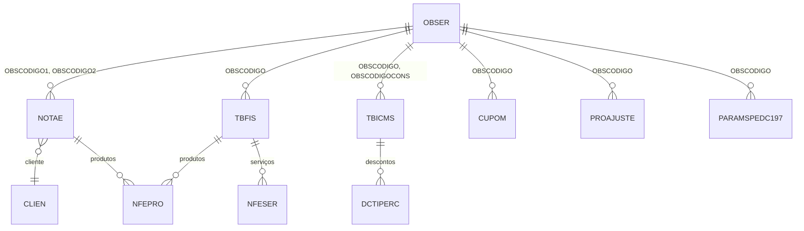

# OBSER - Documentação Completa de Relacionamentos

## 📊 Informações Gerais

- **Nome da Tabela**: OBSER (Observações)
- **Total de Registros**: 712
- **Total de Colunas**: 3
- **Chave Primária**: OBSCODIGO
- **Chaves Estrangeiras**: 0
- **Índices**: 0
- **Tabelas Dependentes**: 8
- **Banco de Dados**: Firebird

## 📝 Descrição

**OBSER** é uma tabela mestre de observações padronizadas utilizadas em diversas partes do sistema fiscal e comercial. Com **712 registros**, esta tabela centraliza textos de observações que podem ser reutilizados em notas fiscais, configurações fiscais, cupons fiscais e outras entidades do sistema.

Esta tabela é essencial para:
- **Padronização**: Manter observações consistentes em todo o sistema
- **Reutilização**: Evitar duplicação de textos de observações
- **Manutenção**: Facilitar atualização de observações em um único local
- **Conformidade Fiscal**: Garantir que observações fiscais estejam corretas e atualizadas
- **Eficiência**: Reduzir digitação repetitiva de observações comuns

---

## 🔑 Estrutura de Colunas

| Coluna | Tipo | Descrição |
|--------|------|-----------|
| **OBSCODIGO** 🔑 | INT | Código único da observação (PK) |
| **OBSDESCRICAO** | VARCHAR(37) | Descrição/título da observação |
| **OBSOBSER** | VARCHAR(261) | Texto completo da observação |

---

## 🔗 Relacionamentos - Nível 1 (Diretos)

### Nenhum Relacionamento Formal

Esta tabela não possui chaves estrangeiras formais, mas é referenciada por 8 tabelas através de campos de observação.

---

## 📊 Tabelas que Referenciam OBSER

### NOTAE - Notas Fiscais Eletrônicas
**Volume:** 204.952 registros

**Relacionamento:**
```
NOTAE.OBSCODIGO1 → OBSER.OBSCODIGO (N:1) [FK: OBSER1_NOTAE]
NOTAE.OBSCODIGO2 → OBSER.OBSCODIGO (N:1) [FK: OBSER2_NOTAE]
```

**Descrição:** Cada NF-e pode ter até duas observações padronizadas associadas.

**Campos importantes em NOTAE:**
- `OBSCODIGO1` - Primeira observação da NF-e
- `OBSCODIGO2` - Segunda observação da NF-e
- `NFEOBSER` - Observações gerais (texto livre)
- `NFEOBSER2` - Observações adicionais (texto livre)

---

### TBFIS - Tabela Fiscal
**Volume:** Variável conforme configuração fiscal

**Relacionamento:**
```
TBFIS.OBSCODIGO → OBSER.OBSCODIGO (N:1) [FK: OBSER_TBFIS]
```

**Descrição:** Configurações fiscais podem ter observações padronizadas associadas.

**Uso:** Observações fiscais padrão para determinadas configurações tributárias.

---

### TBICMS - Tabela de ICMS
**Volume:** 1.216 registros

**Relacionamento:**
```
TBICMS.OBSCODIGO → OBSER.OBSCODIGO (N:1) [FK: OBSER_TBICMS]
TBICMS.OBSCODIGOCONS → OBSER.OBSCODIGO (N:1) [FK: OBSERCONS_TBICMS]
```

**Descrição:** Tabelas de ICMS podem ter observações padrão e observações de consolidação.

**Campos importantes em TBICMS:**
- `OBSCODIGO` - Observação padrão da tabela ICMS
- `OBSCODIGOCONS` - Observação de consolidação da tabela ICMS

---

### CUPOM - Cupons Fiscais
**Volume:** Variável

**Relacionamento:**
```
CUPOM.OBSCODIGO → OBSER.OBSCODIGO (N:1) [FK: OBSER_CUPOM]
```

**Descrição:** Cupons fiscais podem ter observações padronizadas associadas.

---

### PROAJUSTE - Ajustes de Produto
**Volume:** Variável

**Relacionamento:**
```
PROAJUSTE.OBSCODIGO → OBSER.OBSCODIGO (N:1) [FK: FK_PROAJUSTE_2]
```

**Descrição:** Ajustes de produtos podem ter observações padronizadas associadas.

---

### PARAMSPEDC197 - Parâmetros SPED C197
**Volume:** Variável

**Relacionamento:**
```
PARAMSPEDC197.OBSCODIGO → OBSER.OBSCODIGO (N:1) [FK: FK_PARAMSPEDC197_1]
```

**Descrição:** Parâmetros do SPED Fiscal podem ter observações padronizadas associadas.

---

## 🔗 Relacionamentos - Nível 2 (Indiretos)

### Através de NOTAE

#### CLIEN - Cliente
```
OBSER → NOTAE → CLIEN
```
**Descrição:** Permite identificar quais clientes recebem NF-e com determinadas observações.

---

#### NFEPRO - Produtos da NF-e
```
OBSER → NOTAE → NFEPRO → PRODU
```
**Descrição:** Permite identificar produtos relacionados a NF-e com determinadas observações.

---

### Através de TBFIS

#### NFEPRO - Produtos em NF-e
```
OBSER → TBFIS → NFEPRO → PRODU
```
**Descrição:** Permite identificar produtos que utilizam configurações fiscais com determinadas observações.

---

#### NFESER - Serviços em NF-e
```
OBSER → TBFIS → NFESER → SERVI
```
**Descrição:** Permite identificar serviços que utilizam configurações fiscais com determinadas observações.

---

### Através de TBICMS

#### DCTIPERC - Desconto de ICMS por Percentual
```
OBSER → TBICMS → DCTIPERC
```
**Descrição:** Permite identificar descontos de ICMS relacionados a tabelas ICMS com determinadas observações.

---

## 🗺️ Diagrama de Relacionamentos



---

## 💡 Casos de Uso Práticos

### 1. Consultar Observação e Seu Uso

```sql
SELECT 
    obs.OBSCODIGO,
    obs.OBSDESCRICAO,
    obs.OBSOBSER,
    COUNT(DISTINCT nfe.NFECODIGO) AS QTD_NFES_COM_OBS1,
    COUNT(DISTINCT CASE WHEN nfe.OBSCODIGO2 = obs.OBSCODIGO THEN nfe.NFECODIGO END) AS QTD_NFES_COM_OBS2,
    COUNT(DISTINCT tbf.FISCODIGO) AS QTD_CONFIG_FISCAIS,
    COUNT(DISTINCT tbi.ICMCODIGO) AS QTD_TABELAS_ICMS
FROM OBSER obs
LEFT JOIN NOTAE nfe ON obs.OBSCODIGO IN (nfe.OBSCODIGO1, nfe.OBSCODIGO2)
LEFT JOIN TBFIS tbf ON obs.OBSCODIGO = tbf.OBSCODIGO
LEFT JOIN TBICMS tbi ON obs.OBSCODIGO IN (tbi.OBSCODIGO, tbi.OBSCODIGOCONS)
WHERE obs.OBSCODIGO = :obscodigo
GROUP BY obs.OBSCODIGO, obs.OBSDESCRICAO, obs.OBSOBSER;
```

### 2. Relatório de Observações Mais Utilizadas

```sql
SELECT 
    obs.OBSCODIGO,
    obs.OBSDESCRICAO,
    obs.OBSOBSER,
    (
        (SELECT COUNT(*) FROM NOTAE WHERE OBSCODIGO1 = obs.OBSCODIGO OR OBSCODIGO2 = obs.OBSCODIGO) +
        (SELECT COUNT(*) FROM TBFIS WHERE OBSCODIGO = obs.OBSCODIGO) +
        (SELECT COUNT(*) FROM TBICMS WHERE OBSCODIGO = obs.OBSCODIGO OR OBSCODIGOCONS = obs.OBSCODIGO) +
        (SELECT COUNT(*) FROM CUPOM WHERE OBSCODIGO = obs.OBSCODIGO) +
        (SELECT COUNT(*) FROM PROAJUSTE WHERE OBSCODIGO = obs.OBSCODIGO) +
        (SELECT COUNT(*) FROM PARAMSPEDC197 WHERE OBSCODIGO = obs.OBSCODIGO)
    ) AS TOTAL_USOS
FROM OBSER obs
ORDER BY TOTAL_USOS DESC
ROWS 20;
```

### 3. Observações Utilizadas em NF-e por Cliente

```sql
SELECT 
    obs.OBSCODIGO,
    obs.OBSDESCRICAO,
    cli.CLICODIGO,
    cli.CLINOME,
    COUNT(DISTINCT nfe.NFECODIGO) AS QTD_NFES
FROM OBSER obs
INNER JOIN NOTAE nfe ON obs.OBSCODIGO IN (nfe.OBSCODIGO1, nfe.OBSCODIGO2)
INNER JOIN CLIEN cli ON nfe.CLICODIGO = cli.CLICODIGO
WHERE cli.CLICODIGO = :clicodigo
GROUP BY obs.OBSCODIGO, obs.OBSDESCRICAO, cli.CLICODIGO, cli.CLINOME
ORDER BY QTD_NFES DESC;
```

### 4. Observações Não Utilizadas

```sql
SELECT 
    obs.OBSCODIGO,
    obs.OBSDESCRICAO,
    obs.OBSOBSER
FROM OBSER obs
WHERE NOT EXISTS (
    SELECT 1 FROM NOTAE WHERE OBSCODIGO1 = obs.OBSCODIGO OR OBSCODIGO2 = obs.OBSCODIGO
)
AND NOT EXISTS (
    SELECT 1 FROM TBFIS WHERE OBSCODIGO = obs.OBSCODIGO
)
AND NOT EXISTS (
    SELECT 1 FROM TBICMS WHERE OBSCODIGO = obs.OBSCODIGO OR OBSCODIGOCONS = obs.OBSCODIGO
)
AND NOT EXISTS (
    SELECT 1 FROM CUPOM WHERE OBSCODIGO = obs.OBSCODIGO
)
AND NOT EXISTS (
    SELECT 1 FROM PROAJUSTE WHERE OBSCODIGO = obs.OBSCODIGO
)
AND NOT EXISTS (
    SELECT 1 FROM PARAMSPEDC197 WHERE OBSCODIGO = obs.OBSCODIGO
)
ORDER BY obs.OBSCODIGO;
```

---

## 📈 Estatísticas e Insights

### Volume de Dados
- **Total de Observações**: 712 registros
- **Distribuição**: Permite análise de uso de observações em diferentes contextos
- **Reutilização**: Observações podem ser utilizadas em múltiplas entidades

### Análise de Uso
- Permite identificar observações mais utilizadas
- Facilita identificação de observações não utilizadas
- Suporta análise de padrões de uso por tipo de entidade

---

## ⚡ Performance e Otimização

### Índices Recomendados

```sql
-- Índice para consultas por código
CREATE INDEX IDX_OBSER_CODIGO ON OBSER (OBSCODIGO);

-- Índice para busca por descrição (se necessário)
CREATE INDEX IDX_OBSER_DESCRICAO ON OBSER (OBSDESCRICAO);
```

### Otimizações de Consulta

1. **Cachear observações** em memória devido ao volume moderado
2. **Usar em dropdowns** e listas de seleção
3. **Evitar SELECT *** quando não necessário

---

## 🔒 Integridade de Dados

### Validações Importantes

1. **Código Único**: `OBSCODIGO` deve ser único
2. **Descrição Obrigatória**: `OBSDESCRICAO` deve estar preenchida
3. **Observação Obrigatória**: `OBSOBSER` deve estar preenchida
4. **Consistência**: Códigos utilizados nas tabelas dependentes devem existir nesta tabela

---

## 📚 Integração com Aplicação (Laravel)

### Model OBSER

```php
<?php

namespace App\Models;

use Illuminate\Database\Eloquent\Model;
use Illuminate\Database\Eloquent\Relations\HasMany;

final class OBSER extends Model
{
    protected $table = 'OBSER';
    
    protected $primaryKey = 'OBSCODIGO';
    
    public $incrementing = false;
    
    protected $fillable = [
        'OBSCODIGO',
        'OBSDESCRICAO',
        'OBSOBSER',
    ];
    
    /**
     * Relacionamento lógico com NOTAE (observação 1)
     */
    public function notasFiscaisObservacao1()
    {
        return $this->hasMany(NOTAE::class, 'OBSCODIGO1', 'OBSCODIGO');
    }
    
    /**
     * Relacionamento lógico com NOTAE (observação 2)
     */
    public function notasFiscaisObservacao2()
    {
        return $this->hasMany(NOTAE::class, 'OBSCODIGO2', 'OBSCODIGO');
    }
    
    /**
     * Relacionamento lógico com TBFIS
     */
    public function configuracoesFiscais()
    {
        return $this->hasMany(TBFIS::class, 'OBSCODIGO', 'OBSCODIGO');
    }
    
    /**
     * Relacionamento lógico com TBICMS
     */
    public function tabelasICMS()
    {
        return $this->hasMany(TBICMS::class, 'OBSCODIGO', 'OBSCODIGO');
    }
    
    /**
     * Scope para buscar por descrição
     */
    public function scopePorDescricao($query, $descricao)
    {
        return $query->where('OBSDESCRICAO', 'LIKE', "%{$descricao}%");
    }
    
    /**
     * Scope para buscar por texto da observação
     */
    public function scopePorTexto($query, $texto)
    {
        return $query->where('OBSOBSER', 'LIKE', "%{$texto}%");
    }
}
```

---

## ✅ Boas Práticas

### Design
1. **Manter códigos consistentes** com o padrão do sistema
2. **Descrições claras** e objetivas
3. **Textos completos** e bem formatados
4. **Evitar exclusão** de observações já utilizadas

### Performance
1. **Cachear observações** em memória devido ao volume moderado
2. **Usar em dropdowns** e listas de seleção
3. **Indexar código** para consultas rápidas

### Integridade
1. **Validar existência** antes de usar nas tabelas dependentes
2. **Não permitir exclusão** de observações em uso
3. **Manter consistência** entre descrição e texto da observação

### Manutenção
1. **Revisar periodicamente** observações não utilizadas
2. **Atualizar textos** quando necessário para conformidade fiscal
3. **Documentar significado** de cada observação
4. **Monitorar uso** para identificar observações obsoletas

---

**Documentação gerada em**: 2025-01-27

**Banco de dados**: Firebird

