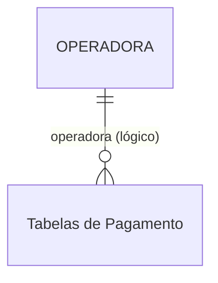

# OPERADORA - Documentação Completa de Relacionamentos

## 📊 Informações Gerais

- **Nome da Tabela**: OPERADORA (Operadora de Cartão/Credenciadora)
- **Total de Registros**: 1
- **Total de Colunas**: 2
- **Chave Primária**: OPEID
- **Chaves Estrangeiras**: 0
- **Índices**: 0
- **Tabelas Dependentes**: 0
- **Banco de Dados**: Firebird

## 📝 Descrição

**OPERADORA** é uma tabela mestre de referência que define operadoras de cartão ou credenciadoras. Com apenas **1 registro**, é uma tabela de configuração simples que serve como catálogo de valores para operadoras de pagamento.

Esta tabela é essencial para:
- **Classificação**: Identificar operadoras de cartão/credenciadoras
- **Configuração**: Configurar operadoras disponíveis no sistema
- **Relatórios**: Agrupar transações por operadora para análises
- **Validação**: Garantir que apenas operadoras válidas sejam utilizadas

**Nota**: Com apenas 1 registro, esta tabela pode estar em fase inicial de implementação ou pode ser uma configuração singleton para uma operadora padrão.

---

## 🔑 Estrutura de Colunas

| Coluna | Tipo | Descrição |
|--------|------|-----------|
| **OPEID** 🔑 | INT | Código único da operadora (PK) |
| **OPEDESCRICAO** | VARCHAR(37) | Descrição/nome da operadora |

---

## 🔗 Relacionamentos - Nível 1 (Diretos)

### Nenhum Relacionamento Formal

Esta tabela não possui chaves estrangeiras formais e não é referenciada por outras tabelas no momento.

---

## 🔗 Relacionamentos - Nível 2 (Indiretos)

### Relacionamentos Lógicos Potenciais

Embora não existam relacionamentos formais, esta tabela pode ser referenciada logicamente por:

#### Tabelas de Pagamento (Relacionamento Lógico Potencial)
```
Tabelas de pagamento.OPEID → OPERADORA.OPEID (N:1)
```

**Descrição:** Tabelas relacionadas a pagamentos podem referenciar esta tabela para identificar a operadora utilizada.

**Tabelas potenciais:**
- Tabelas de recebimento
- Tabelas de transações de cartão
- Tabelas de conciliação bancária

---

## 🗺️ Diagrama de Relacionamentos



---

## 💡 Casos de Uso Práticos

### 1. Consultar Todas as Operadoras Disponíveis

```sql
SELECT OPEID, OPEDESCRICAO
FROM OPERADORA
ORDER BY OPEID;
```

### 2. Validar Operadora Antes de Usar

```sql
SELECT COUNT(*) AS OPERADORA_VALIDA
FROM OPERADORA
WHERE OPEID = :opeid;
```

### 3. Relatório de Operadoras (Preparado para Futuro Uso)

```sql
SELECT 
    op.OPEID,
    op.OPEDESCRICAO,
    COUNT(*) AS QTD_USOS
FROM OPERADORA op
LEFT JOIN (
    -- Exemplo de uso futuro quando tabelas de pagamento referenciarem OPERADORA
    SELECT OPEID FROM TABELA_PAGAMENTO
    UNION ALL
    SELECT OPEID FROM OUTRA_TABELA
) uso ON op.OPEID = uso.OPEID
GROUP BY op.OPEID, op.OPEDESCRICAO
ORDER BY QTD_USOS DESC;
```

---

## 📈 Estatísticas e Insights

### Volume de Dados
- **Total de Operadoras**: 1 registro
- **Uso**: Tabela de referência/catálogo
- **Frequência de Alteração**: Baixa (tabela de configuração)
- **Estado**: Possivelmente em fase inicial de implementação

---

## ⚡ Performance e Otimização

Como tabela muito pequena (1 registro), índices não são necessários. A tabela inteira pode ser carregada em memória.

---

## 🔒 Integridade de Dados

### Validações Importantes

1. **Código Único**: `OPEID` deve ser único
2. **Descrição Obrigatória**: `OPEDESCRICAO` deve estar preenchida
3. **Consistência**: Códigos utilizados em tabelas de pagamento devem existir nesta tabela (quando implementado)

---

## 📚 Integração com Aplicação (Laravel)

### Model OPERADORA

```php
<?php

namespace App\Models;

use Illuminate\Database\Eloquent\Model;

final class OPERADORA extends Model
{
    protected $table = 'OPERADORA';
    
    protected $primaryKey = 'OPEID';
    
    public $incrementing = false;
    
    protected $fillable = [
        'OPEID',
        'OPEDESCRICAO',
    ];
    
    /**
     * Scope para buscar por código
     */
    public function scopePorCodigo($query, $opeid)
    {
        return $query->where('OPEID', $opeid);
    }
    
    /**
     * Método estático para obter operadora padrão (se singleton)
     */
    public static function operadoraPadrao()
    {
        return static::first();
    }
}
```

---

## ✅ Boas Práticas

### Design
1. **Manter códigos consistentes** com o padrão do sistema
2. **Descrições claras** e objetivas
3. **Preparar para expansão** quando novas operadoras forem adicionadas

### Performance
1. **Cachear valores** em memória devido ao pequeno volume
2. **Usar em dropdowns** e listas de seleção

### Integridade
1. **Validar existência** antes de usar em tabelas de pagamento (quando implementado)
2. **Não permitir exclusão** de operadoras em uso

### Manutenção
1. **Documentar significado** de cada código
2. **Revisar periodicamente** se novos códigos são necessários
3. **Preparar integração** com tabelas de pagamento quando necessário

---

**Documentação gerada em**: 2025-01-27

**Banco de dados**: Firebird

