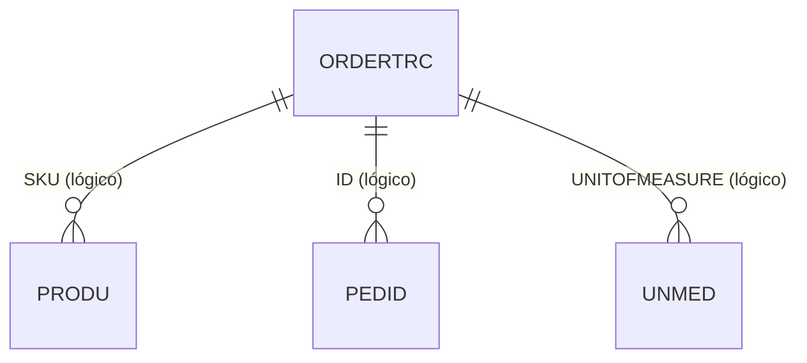

# ORDERTRC - Documentação Completa de Relacionamentos

## 📊 Informações Gerais

- **Nome da Tabela**: ORDERTRC (Order Trace - Rastreamento de Pedidos)
- **Total de Registros**: 11
- **Total de Colunas**: 8
- **Chave Primária**: ID
- **Chaves Estrangeiras**: 0
- **Índices**: 0
- **Tabelas Dependentes**: 0
- **Banco de Dados**: Firebird

## 📝 Descrição

**ORDERTRC** é uma tabela de rastreamento e controle de pedidos, possivelmente relacionada a integração com sistemas externos ou rastreamento de ações em pedidos. Com **11 registros** e **8 colunas**, esta tabela armazena informações sobre ações, tipos, unidades de medida e possíveis erros relacionados a pedidos.

Esta tabela é essencial para:
- **Rastreamento**: Rastrear ações e eventos relacionados a pedidos
- **Integração**: Possivelmente integrar com sistemas externos de rastreamento
- **Auditoria**: Manter histórico de ações realizadas em pedidos
- **Controle**: Controlar tipos de ações e unidades de medida

**Nota**: Os nomes das colunas em inglês sugerem que esta tabela pode estar relacionada a integração com sistemas externos ou ser uma tabela de configuração para rastreamento.

---

## 🔑 Estrutura de Colunas

| Coluna | Tipo | Descrição |
|--------|------|-----------|
| **ID** 🔑 | INT | Código único do registro (PK) |
| **DESCRIPTION** | VARCHAR(37) | Descrição da ação/evento |
| **SKU** | VARCHAR(37) | SKU (Stock Keeping Unit) do produto |
| **TYPE** | VARCHAR(37) | Tipo da ação/evento |
| **UNITOFMEASURE** | VARCHAR(37) | Unidade de medida |
| **ACTION** | VARCHAR(37) | Ação realizada |
| **ERROR** | VARCHAR(37) | Mensagem de erro (se houver) |
| **DESENHO** | VARCHAR(261) | Desenho ou referência adicional |

---

## 🔗 Relacionamentos - Nível 1 (Diretos)

### Nenhum Relacionamento Formal

Esta tabela não possui chaves estrangeiras formais e não é referenciada por outras tabelas no momento.

---

## 🔗 Relacionamentos - Nível 2 (Indiretos)

### Relacionamentos Lógicos Potenciais

Embora não existam relacionamentos formais, esta tabela pode ser referenciada logicamente por:

#### PRODU - Produto (Relacionamento Lógico Potencial)
```
ORDERTRC.SKU → PRODU.PROCODIGO (N:1)
```

**Descrição:** O campo `SKU` pode referenciar logicamente produtos na tabela `PRODU`.

---

#### PEDID - Pedido (Relacionamento Lógico Potencial)
```
ORDERTRC.ID → PEDID.ID_PEDIDO (N:1)
```

**Descrição:** O campo `ID` pode referenciar logicamente pedidos na tabela `PEDID`, dependendo do contexto de uso.

---

#### UNMED - Unidade de Medida (Relacionamento Lógico Potencial)
```
ORDERTRC.UNITOFMEASURE → UNMED.UNMCODIGO (N:1)
```

**Descrição:** O campo `UNITOFMEASURE` pode referenciar logicamente unidades de medida na tabela `UNMED`.

---

## 🗺️ Diagrama de Relacionamentos



---

## 💡 Casos de Uso Práticos

### 1. Consultar Todos os Registros de Rastreamento

```sql
SELECT 
    ID,
    DESCRIPTION,
    SKU,
    TYPE,
    UNITOFMEASURE,
    ACTION,
    ERROR,
    DESENHO
FROM ORDERTRC
ORDER BY ID;
```

### 2. Consultar Rastreamento por SKU

```sql
SELECT 
    otrc.ID,
    otrc.DESCRIPTION,
    otrc.SKU,
    otrc.TYPE,
    otrc.ACTION,
    otrc.ERROR,
    prod.PRODESCRICAO
FROM ORDERTRC otrc
LEFT JOIN PRODU prod ON otrc.SKU = CAST(prod.PROCODIGO AS VARCHAR(37))
WHERE otrc.SKU = :sku
ORDER BY otrc.ID;
```

### 3. Relatório de Ações por Tipo

```sql
SELECT 
    TYPE,
    ACTION,
    COUNT(*) AS QTD_REGISTROS,
    COUNT(DISTINCT SKU) AS QTD_PRODUTOS_DISTINTOS,
    COUNT(CASE WHEN ERROR IS NOT NULL THEN 1 END) AS QTD_ERROS
FROM ORDERTRC
GROUP BY TYPE, ACTION
ORDER BY QTD_REGISTROS DESC;
```

### 4. Consultar Registros com Erro

```sql
SELECT 
    ID,
    DESCRIPTION,
    SKU,
    TYPE,
    ACTION,
    ERROR,
    DESENHO
FROM ORDERTRC
WHERE ERROR IS NOT NULL
ORDER BY ID;
```

### 5. Consultar Rastreamento por Unidade de Medida

```sql
SELECT 
    otrc.UNITOFMEASURE,
    COUNT(*) AS QTD_REGISTROS,
    COUNT(DISTINCT otrc.SKU) AS QTD_PRODUTOS,
    unm.UNMDESCRICAO
FROM ORDERTRC otrc
LEFT JOIN UNMED unm ON otrc.UNITOFMEASURE = unm.UNMCODIGO
GROUP BY otrc.UNITOFMEASURE, unm.UNMDESCRICAO
ORDER BY QTD_REGISTROS DESC;
```

---

## 📈 Estatísticas e Insights

### Volume de Dados
- **Total de Registros**: 11 registros
- **Uso**: Tabela de rastreamento/auditoria
- **Frequência de Alteração**: Variável conforme uso do sistema

---

## ⚡ Performance e Otimização

### Índices Recomendados

```sql
-- Índice para consultas por SKU
CREATE INDEX IDX_ORDERTRC_SKU ON ORDERTRC (SKU);

-- Índice para consultas por tipo
CREATE INDEX IDX_ORDERTRC_TYPE ON ORDERTRC (TYPE);

-- Índice para consultas por ação
CREATE INDEX IDX_ORDERTRC_ACTION ON ORDERTRC (ACTION);

-- Índice para consultas com erro
CREATE INDEX IDX_ORDERTRC_ERROR ON ORDERTRC (ERROR) WHERE ERROR IS NOT NULL;
```

---

## 🔒 Integridade de Dados

### Validações Importantes

1. **ID Único**: `ID` deve ser único
2. **Campos Obrigatórios**: `DESCRIPTION`, `SKU`, `TYPE`, `UNITOFMEASURE`, `ACTION` são obrigatórios
3. **SKU**: Deve existir em `PRODU` quando referenciado logicamente
4. **UNITOFMEASURE**: Deve existir em `UNMED` quando referenciado logicamente

---

## 📚 Integração com Aplicação (Laravel)

### Model ORDERTRC

```php
<?php

namespace App\Models;

use Illuminate\Database\Eloquent\Model;

final class ORDERTRC extends Model
{
    protected $table = 'ORDERTRC';
    
    protected $primaryKey = 'ID';
    
    protected $fillable = [
        'ID',
        'DESCRIPTION',
        'SKU',
        'TYPE',
        'UNITOFMEASURE',
        'ACTION',
        'ERROR',
        'DESENHO',
    ];
    
    /**
     * Relacionamento lógico com PRODU
     */
    public function produto()
    {
        return $this->belongsTo(PRODU::class, 'SKU', 'PROCODIGO');
    }
    
    /**
     * Relacionamento lógico com UNMED
     */
    public function unidadeMedida()
    {
        return $this->belongsTo(UNMED::class, 'UNITOFMEASURE', 'UNMCODIGO');
    }
    
    /**
     * Scope para buscar por SKU
     */
    public function scopePorSku($query, $sku)
    {
        return $query->where('SKU', $sku);
    }
    
    /**
     * Scope para buscar por tipo
     */
    public function scopePorTipo($query, $type)
    {
        return $query->where('TYPE', $type);
    }
    
    /**
     * Scope para buscar registros com erro
     */
    public function scopeComErro($query)
    {
        return $query->whereNotNull('ERROR');
    }
    
    /**
     * Scope para buscar por ação
     */
    public function scopePorAcao($query, $action)
    {
        return $query->where('ACTION', $action);
    }
}
```

---

## ✅ Boas Práticas

### Design
1. **Manter IDs únicos** e sequenciais
2. **Validar SKU** antes de inserir
3. **Validar unidade de medida** antes de inserir
4. **Documentar tipos e ações** disponíveis

### Performance
1. **Usar índices** nas consultas frequentes
2. **Considerar particionamento** por data se o volume crescer
3. **Arquivar registros antigos** periodicamente

### Integridade
1. **Validar existência** de SKU e unidade de medida antes de inserir
2. **Garantir consistência** entre campos relacionados
3. **Registrar erros** de forma clara e objetiva

### Manutenção
1. **Monitorar crescimento** da tabela
2. **Revisar periodicamente** registros com erro
3. **Documentar tipos e ações** disponíveis
4. **Arquivar registros antigos** quando necessário

---

**Documentação gerada em**: 2025-01-27

**Banco de dados**: Firebird

